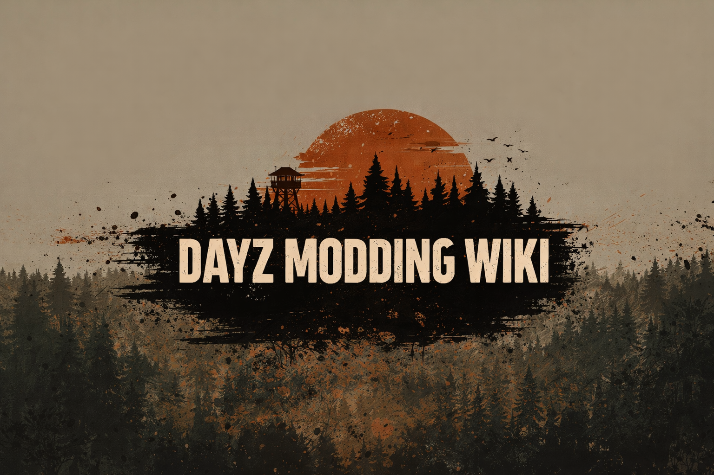

<h1 align="center">DayZ Modding Complete Guide</h1>

  

---

  <strong>The most comprehensive DayZ modding and server administration documentation ever created.</strong> 
  From absolute zero to published mod, from first server to advanced economy tuning — in 12 languages.

  
  
  
  
  
  
  
  
  
  
  
  

  
  

---

## Why This Wiki?

There is **no complete public documentation** for DayZ modding. The official wiki is sparse, community tutorials are scattered and outdated, and most knowledge lives in private Discord servers. This project changes that.

This wiki was built by studying the **2,800+ vanilla DayZ script files** and the **12 official Bohemia sample mods**, and documenting every pattern, gotcha, and best practice we found.

**Whether you're creating your first mod or building a complex framework — this is your reference.**

---

## What's Inside

| Part | Topic | Chapters | What You'll Learn |
|:----:|-------|:--------:|-------------------|
| **1** | [Enforce Script Language](en/01-enforce-script/01-variables-types.md) | 13 | The complete language — types, classes, modded classes, memory management, 30+ gotchas |
| **2** | [Mod Structure](en/02-mod-structure/01-five-layers.md) | 6 | 5-layer hierarchy, config.cpp, server/client architecture |
| **3** | [GUI & Layout System](en/03-gui-system/01-widget-types.md) | 10 | Widgets, .layout files, sizing, events, dialogs, production UI patterns |
| **4** | [File Formats & Tools](en/04-file-formats/01-textures.md) | 8 | Textures, models, audio, DayZ Tools, Workbench, PBO packing |
| **5** | [Configuration Files](en/05-config-files/01-stringtable.md) | 6 | stringtable.csv, inputs.xml, imagesets, server configs, spawn gear |
| **6** | [Engine API Reference](en/06-engine-api/01-entity-system.md) | 23 | Entity, player, vehicle, sound, crafting, construction, animation, zombie/AI, terrain, particles, admin |
| **7** | [Patterns & Best Practices](en/07-patterns/01-singletons.md) | 7 | Singletons, modules, RPC, permissions, events, performance |
| **8** | [Tutorials](en/08-tutorials/01-first-mod.md) | 13 | Hello World → Custom Items → Admin Panel → Vehicles → Shop UI & Safe Refusal |
| **9** | [Server Administration](en/09-server-admin/01-server-setup.md) | 12 | Server setup, loot economy, vehicles, persistence, performance, troubleshooting |
| | [Quick Reference](en/06-engine-api/quick-reference.md) | 5 | API quick reference, cheatsheet, glossary, FAQ, troubleshooting |

> **98 numbered chapters plus 5 reference pages — 103 content pages** — each with code examples, common mistakes, and best practices. (`en/` also holds 2 landing pages, `README.md` and `index.md`, for 105 files in total.)

---

## Quick Start

**New to DayZ modding?** Follow this path:

1. [Your First Mod (Hello World)](en/08-tutorials/01-first-mod.md) — Build and load a mod in 15 minutes
2. [The 5-Layer Script Hierarchy](en/02-mod-structure/01-five-layers.md) — Understand how DayZ organizes code
3. [Variables & Types](en/01-enforce-script/01-variables-types.md) — Learn Enforce Script basics
4. [Creating a Custom Item](en/08-tutorials/02-custom-item.md) — Add your first in-game item
5. [What Does NOT Exist](en/01-enforce-script/12-gotchas.md) — Avoid the 30 most common traps

**Experienced developer?** Jump to:
- [API Quick Reference](en/06-engine-api/quick-reference.md) — Condensed method reference
- [Professional Mod Template](en/08-tutorials/09-professional-template.md) — Feature-rich illustrative starter (not runtime-validated)
- [UI Architecture Patterns](en/03-gui-system/09-real-mod-patterns.md) — How to structure a non-trivial mod UI
- [Troubleshooting Guide](en/troubleshooting.md) — Symptom / cause / fix tables across nine problem areas

---

## Key Features

- **Learn by example** — Chapters teach through worked code: some examples are runnable in full, others are the fragment that makes the point
- **Gotcha-first approach** — Each topic highlights what goes wrong before showing what's right
- **Adapt, then test** — Examples illustrate APIs and patterns rather than ship as drop-in code. Many are deliberately partial (a method body, a config excerpt). Adapt them to your mod and test against your target DayZ build: nothing here is compiled or run as part of authoring
- **Theory vs Practice** — Tables showing what the docs say vs how things actually behave
- **12 languages** — Available in English, Portuguese, German, Russian, Spanish, French, Japanese, Chinese, Czech, Polish, Hungarian, and Italian. **English is the source of truth**; the accuracy review described here covers the English pages only, and the translations have not been re-verified against it
- **31+ Mermaid diagrams** — Visual flowcharts, class hierarchies, and sequence diagrams
- **Professional template** — Complete mod starter with every file explained

---

## Reference Material

This documentation is grounded in:

| Source | Role |
|--------|------|
| Vanilla DayZ Scripts | 2,800+ script files — the definitive API reference |
| [Official DayZ Samples](https://github.com/BohemiaInteractive/DayZ-Samples) | 12 sample mods (commit `da5e543`) covering buildings, fireplaces, clothing retexture, clutter, crafting, garden plots, inputs, ladders, swimming, a vehicle, stringtables and terrain |

The example code is written for this wiki rather than lifted from a published mod; the wiki has no audit trail that can establish the provenance of every snippet, so treat that as the authors’ intent and not a guarantee. If you want real-world open-source mods to study on your own, notable projects in the ecosystem include [Community Framework](https://github.com/Arkensor/DayZ-CommunityFramework), [Community Online Tools](https://github.com/Jacob-Mango/DayZ-CommunityOnlineTools), [VPP Admin Tools](https://github.com/VanillaPlusPlus/VPP-Admin-Tools), [DayZ Expansion](https://github.com/salutesh/DayZ-Expansion-Scripts), [Dabs Framework](https://github.com/InclementDab/DayZ-Dabs-Framework), [Colorful UI](https://github.com/DayZ-n-Chill/DayZ-Colorful-UI), and [DayZ Editor](https://github.com/InclementDab/DayZ-Editor) — each under its own license.

---

## Contributing

We welcome contributions! Whether it's fixing a typo, adding an example, translating a chapter, or writing new content.

See [CONTRIBUTING.md](CONTRIBUTING.md) for guidelines.

**Ways to contribute:**
- Report errors or suggest improvements via [Issues](https://github.com/StarDZ-Team/DayZ-Modding-WIKI/issues)
- Submit corrections or new content via [Pull Requests](https://github.com/StarDZ-Team/DayZ-Modding-WIKI/pulls)
- Help translate — see [Translation Guide](CONTRIBUTING.md#translations)
- Add screenshots to chapters that need them — see [Image Needs](images/NEEDED_IMAGES.md)

---

## Credits

A tip of the hat to the developers whose open-source projects have shaped the DayZ modding ecosystem and inspired this wiki to exist:

| Developer | Projects | Known For |
|-----------|----------|-------------------|
| [**Jacob_Mango**](https://github.com/Jacob-Mango) | Community Framework, COT | Module system, RPC, permissions, ESP |
| [**InclementDab**](https://github.com/InclementDab) | Dabs Framework, DayZ Editor, Mod Template | MVC, ViewBinding, editor UI |
| [**salutesh**](https://github.com/salutesh) | DayZ Expansion | Market, party, map markers, vehicles |
| [**Arkensor**](https://github.com/Arkensor) | DayZ Expansion | Central economy, settings versioning |
| [**DaOne**](https://github.com/Da0ne) | VPP Admin Tools | Player management, webhooks, ESP |
| [**GravityWolf**](https://github.com/GravityWolfNotAmused) | VPP Admin Tools | Permissions, server management |
| [**Brian Orr (DrkDevil)**](https://github.com/DrkDevil) | Colorful UI | Color theming, modded class UI patterns |
| [**lothsun**](https://github.com/lothsun) | Colorful UI | UI color systems, visual enhancement |
| [**Bohemia Interactive**](https://github.com/BohemiaInteractive) | DayZ Engine & Samples | Enforce Script, vanilla scripts, DayZ Tools |
| [**StarDZ Team**](https://github.com/StarDZ-Team) | This Wiki | Documentation, translation & organization |

---

  <strong>Built with reverse engineering, coffee, and the DayZ modding community.</strong>  
   
  If this wiki helped you, give it a ⭐ star and share it with fellow modders!

---

## License

  Documentation is licensed under  — share and adapt with attribution. 
  Code examples are licensed under  — use freely in your mods.
  See  for full text.

