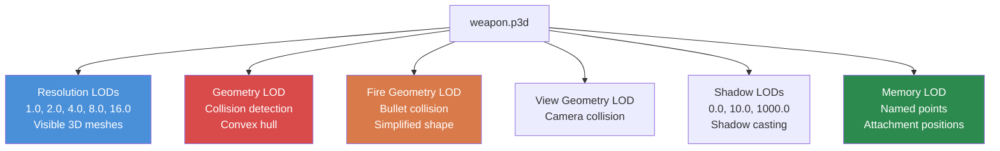

# Chapter 4.2: 3D Models (.p3d)

[Domů](../../README.md) | [<< Předchozí: Textury](01-textures.md) | **3D modely** | [Další: Materiály >>](03-materials.md)

---

## Úvod

Every physical object in DayZ -- weapons, clothing, buildings, vehicles, trees, rocks -- is a 3D model stored in Bohemia's proprietary **P3D** format. The P3D format is far more than a mesh container: it encodes více levels of detail, collision geometry, animation selections, memory points for attachments and effects, and proxy positions for mountable items. Understanding how P3D files work and how to create them with **Object Builder** is essential for jakýkoli mod that adds physical items to the herní svět.

This chapter covers the P3D format structure, the LOD system, named selections, memory points, the proxy system, animation configuration via `model.cfg`, and the import workflow from standard 3D formats.

---

## Obsah

- [P3D Format Overview](#p3d-format-overview)
- [Object Builder](#object-builder)
- [The LOD System](#the-lod-system)
- [Named Selections](#named-selections)
- [Memory Points](#memory-points)
- [The Proxy System](#the-proxy-system)
- [Model.cfg for Animations](#modelcfg-for-animations)
- [Importing from FBX/OBJ](#importing-from-fbxobj)
- [Běžné Model Types](#common-model-types)
- [Běžné Mistakes](#common-mistakes)
- [Best Practices](#best-practices)

---

## P3D Format Overview

**P3D** (Point 3D) is Bohemia Interactive's binary 3D model format, inherited from the Real Virtuality engine and carried forward into Enfusion. It is a compiled, engine-ready format -- you ne write P3D files by hand.

### Key Characteristics

- **Binary format:** Not human-readable. Created and edited exclusively with Object Builder.
- **Multi-LOD container:** A jeden P3D file contains více LOD (Level of Detail) meshes, každý with a odlišný purpose.
- **Engine-native:** The DayZ engine loads P3D přímo. No runtime conversion occurs.
- **Binarized vs. unbinarized:** Source P3D files from Object Builder are "MLOD" (editable). Binarize converts them to "ODOL" (optimized, read-only). The game can load oba, but ODOL loads faster and is smaller.

### File Types You Will Encounter

| Extension | Description |
|-----------|-------------|
| `.p3d` | 3D model (both MLOD source and ODOL binarized) |
| `.rtm` | Runtime Motion -- animation keyframe data |
| `.bisurf` | Surface properties file (used alongside P3D) |

### MLOD vs. ODOL

| Property | MLOD (Source) | ODOL (Binarized) |
|----------|---------------|-------------------|
| Created by | Object Builder | Binarize |
| Editable | Yes | No |
| File size | Larger | Smaller |
| Načtěte speed | Slower | Faster |
| Used during | Development | Release |
| Contains | Full edit data, named selections | Optimized mesh data |

> **Important:** Když pack a PBO with binarization enabled, your MLOD P3D files are automatickýally converted to ODOL. Pokud pack with `-packonly`, the MLOD files are included as-is. Oba work ve hře, but ODOL is preferred for release builds.

---

## Object Builder

**Object Builder** is the Bohemia-provided přílišl for creating and editing P3D models. It is included in the DayZ Tools suite on Steam.

### Core Capabilities

- Vytvořte and edit 3D meshes with vertices, edges, and faces.
- Define více LODs within a jeden P3D file.
- Assign **named selections** (groups of vertices/faces) for animation and texture control.
- Place **memory points** for attachment positions, particle origins, and sound sources.
- Přidejte **proxy objects** for attachable items (magazines, optics, etc.).
- Assign materials (`.rvmat`) and textures (`.paa`) to faces.
- Import meshes from FBX, OBJ, and 3DS formats.
- Export platnýated P3D files for Binarize.

### Workspace Setup

Object Builder requires the **P: drive** (workdrive) to be set up. This virtual drive provides a unified path prefix that engine uses to locate assets.

```
P:\
  DZ\                        <-- Vanilla DayZ data (extracted)
  DayZ Tools\                <-- Tools installation
  MyMod\                     <-- Your mod's source directory
    data\
      models\
        my_item.p3d
      textures\
        my_item_co.paa
```

All paths in P3D files and materials are relative to the P: drive root. Například a material reference inside the model would be `MyMod\data\textures\my_item_co.paa`.

### Basic Workflow in Object Builder

1. **Vytvořte or import** your mesh geometry.
2. **Define LODs** -- minimálně, create Resolution, Geometry, and Fire Geometry LODs.
3. **Assign materials** to faces in the Resolution LOD.
4. **Name selections** for jakýkoli parts that animate, swap textures, or need code interaction.
5. **Place memory points** for attachments, muzzle flash positions, ejection ports, etc.
6. **Přidejte proxies** for items that can be attached (optics, magazines, suppressors).
7. **Validate** using Object Builder's vestavěný platnýation (Structure --> Validate).
8. **Save** as P3D.
9. **Build** via Binarize or AddonBuilder.

---

## The LOD System

A P3D file contains více **LODs** (Levels of Detail), každý serving a specifický purpose. Engine selects which LOD to use based on the situation -- distance from camera, physics calculations, shadow rendering, etc.

### LOD Types

| LOD | Resolution Value | Purpose |
|-----|-----------------|---------|
| **Resolution 0** | 1.000 | Highest detail visual mesh. Rendered when the object is close to the camera. |
| **Resolution 1** | 1.100 | Medium detail. Rendered at moderate distance. |
| **Resolution 2** | 1.200 | Low detail. Rendered at far distance. |
| **Resolution 3+** | 1.300+ | Additional distance LODs. |
| **View Geometry** | Special | Determines what blocks hráč's view (first person). Simplified mesh. |
| **Fire Geometry** | Special | Collision for bullets and projectiles. Must be convex or composed of convex parts. |
| **Geometry** | Special | Physics collision. Used for movement collision, gravity, placement. Must be convex or composed of convex decomposition. |
| **Shadow 0** | Special | Shadow casting mesh (close range). |
| **Shadow 1000** | Special | Shadow casting mesh (far range). Simpler than Shadow 0. |
| **Memory** | Special | Contains pouze named points (no visible geometry). Used for attachment positions, sound origins, etc. |
| **Roadway** | Special | Defines walkable surfaces on objects (vehicles, buildings with enterable interiors). |
| **Paths** | Special | AI pathfinding hints for buildings. |

### LOD Hierarchy



### LOD Resolution Values (Visual LODs)

Engine uses a formula based on distance and object size to determine which visual LOD to render:

```
LOD selected = (distance_to_object * LOD_factor) / object_bounding_sphere_radius
```

Lower values = closer camera. Engine finds the LOD whose resolution value is the closest match to the calculated value.

### Creating LODs in Object Builder

1. **File --> New LOD** or right-click the LOD list.
2. Vyberte the LOD type from the dropdown.
3. For visual LODs (Resolution), enter the resolution value.
4. Model the geometry for that LOD.

### LOD Requirements by Item Type

| Item Type | Required LODs | Recommended Additional LODs |
|-----------|---------------|----------------------------|
| **Handheld item** | Resolution 0, Geometry, Fire Geometry, Memory | Shadow 0, Resolution 1 |
| **Clothing** | Resolution 0, Geometry, Fire Geometry, Memory | Shadow 0, Resolution 1, Resolution 2 |
| **Weapon** | Resolution 0, Geometry, Fire Geometry, View Geometry, Memory | Shadow 0, Resolution 1, Resolution 2 |
| **Building** | Resolution 0, Geometry, Fire Geometry, View Geometry, Memory | Shadow 0, Shadow 1000, Roadway, Paths |
| **Vehicle** | Resolution 0, Geometry, Fire Geometry, View Geometry, Memory | Shadow 0, Roadway, Resolution 1+ |

### Geometry LOD Rules

The Geometry and Fire Geometry LODs have strict requirements:

- **Must be convex** or composed of více convex components. Engine's physics system requires convex collision shapes.
- **Named selections must match** those in the Resolution LOD (for animated parts).
- **Mass musí být defined.** Vyberte all vertices in the Geometry LOD and assign mass via **Structure --> Mass**. This determines the object's physical weight.
- **Udržujte it simple.** Fewer triangles = better physics performance. A weapon's geometry LOD might have 20-50 triangles vs. thousands in the visual LOD.

---

## Named Selections

Named selections are groups of vertices, edges, or faces within a LOD that are tagged with a name. They serve as handles that engine and scripts use to manipulate parts of a model.

### What Named Selections Do

| Purpose | Example Selection Name | Used By |
|---------|----------------------|---------|
| **Animation** | `bolt`, `trigger`, `magazine` | `model.cfg` animation sources |
| **Texture swaps** | `camo`, `camo1`, `body` | `hiddenSelections[]` in config.cpp |
| **Damage textures** | `zbytek` | Engine damage system, material swaps |
| **Attachment points** | `magazine`, `optics`, `suppressor` | Proxy and attachment system |

### hiddenSelections (Texture Swaps)

The většina common use of named selections for modders is **hiddenSelections** -- the ability to swap textures za běhu via config.cpp.

**In the P3D model (Resolution LOD):**
1. Vyberte the faces that should be retexturable.
2. Name the selection (e.g., `camo`).

**In config.cpp:**
```cpp
class MyRifle: Rifle_Base
{
    hiddenSelections[] = {"camo"};
    hiddenSelectionsTextures[] = {"MyMod\data\my_rifle_co.paa"};
    hiddenSelectionsMaterials[] = {"MyMod\data\my_rifle.rvmat"};
};
```

This allows odlišný variants of the stejný model with odlišný textures without duplicating the P3D file.

### Creating Named Selections

In Object Builder:

1. Vyberte the vertices or faces chcete to group.
2. Go to **Structure --> Named Selections** (or press Ctrl+N).
3. Klikněte **New**, enter the selection name.
4. Klikněte **Assign** to tag the selected geometry with that name.

> **Tip:** Selection names are case-sensitive. `Camo` and `camo` are odlišný selections. Convention is lowercase.

### Selections Across LODs

Named selections musí být consistent across LODs for animations to work:

- Pokud `bolt` selection exists in Resolution 0, it must také exist in Geometry and Fire Geometry LODs (covering the corresponding collision geometry).
- Shadow LODs should také have the selection if the animated part should cast correct shadows.

---

## Memory Points

Memory points are named positions defined in the **Memory LOD**. They have no visual representation ve hře -- they define spatial coordinates that engine and scripts reference for positioning effects, attachments, sounds, and more.

### Běžné Memory Points

| Point Name | Purpose |
|------------|---------|
| `usti hlavne` | Muzzle position (where bullets originate, muzzle flash appears) |
| `konec hlavne` | End of barrel (used with `usti hlavne` to define barrel direction) |
| `nabojnicestart` | Ejection port start (where shell casings emerge) |
| `nabojniceend` | Ejection port end (direction of ejection) |
| `handguard` | Handguard attachment point |
| `magazine` | Magazine well position |
| `optics` | Optic rail position |
| `suppressor` | Suppressor mount position |
| `trigger` | Trigger position (for hand IK) |
| `pistolgrip` | Pistol grip position (for hand IK) |
| `lefthand` | Left hand grip position |
| `righthand` | Right hand grip position |
| `eye` | Eye position (for first-person view alignment) |
| `pilot` | Driver/pilot seat position (vehicles) |
| `light_l` / `light_r` | Left/right headlight positions (vehicles) |

### Directional Memory Points

Many effects need oba a position and a direction. This is achieved with paired memory points:

```
usti hlavne  ------>  konec hlavne
(muzzle start)        (muzzle end)

The direction vector is: konec hlavne - usti hlavne
```

### Creating Memory Points in Object Builder

1. Switch to the **Memory LOD** in the LOD list.
2. Vytvořte a vertex at the desired position.
3. Name it via **Structure --> Named Selections**: create a selection with the point name and assign the jeden vertex to it.

> **Poznámka:** The Memory LOD should contain ONLY named points (individual vertices). Do not create faces or edges in the Memory LOD.

---

## The Proxy System

Proxies define positions where jiný P3D models can be attached. Když viz a magazine inserted in a weapon, an optic mounted on a rail, or a suppressor screwed onto a barrel -- those are proxy-attached models.

### How Proxies Work

A proxy is a special reference placed in the Resolution LOD that points to další P3D file. Engine renders the proxy's referenced model at the proxy's position and orientation.

### Proxy Naming Convention

Proxy names follow the pattern: `proxy:\path\to\model.p3d`

For attachment proxies on weapons, the standard names are:

| Proxy Path | Attachment Type |
|------------|----------------|
| `proxy:\dz\weapons\attachments\magazine\mag_placeholder.p3d` | Magazine slot |
| `proxy:\dz\weapons\attachments\optics\optic_placeholder.p3d` | Optics rail |
| `proxy:\dz\weapons\attachments\suppressor\sup_placeholder.p3d` | Suppressor mount |
| `proxy:\dz\weapons\attachments\handguard\handguard_placeholder.p3d` | Handguard slot |
| `proxy:\dz\weapons\attachments\stock\stock_placeholder.p3d` | Stock/buttstock slot |

### Adding Proxies in Object Builder

1. In the Resolution LOD, position the 3D cursor where the attachment should appear.
2. Go to **Structure --> Proxy --> Create**.
3. Enter the proxy path (e.g., `dz\weapons\attachments\magazine\mag_placeholder.p3d`).
4. The proxy appears as a small arrow indicating position and orientation.
5. Rotate and position the proxy to align správně with the attachment geometry.

### Proxy Index

Each proxy has an index number (starting from 1). Když model has více proxies of the stejný type, index odlišnýiates them. The index is referenced in config.cpp:

```cpp
class MyWeapon: Rifle_Base
{
    class Attachments
    {
        class magazine
        {
            type = "magazine";
            proxy = "proxy:\dz\weapons\attachments\magazine\mag_placeholder.p3d";
            proxyIndex = 1;
        };
    };
};
```

---

## Model.cfg for Animations

The `model.cfg` file defines animations for P3D models. It maps animation sources (driven by herní logika) to transformations on named selections.

### Basic Structure

```cpp
class CfgModels
{
    class Default
    {
        sectionsInherit = "";
        sections[] = {};
        skeletonName = "";
    };

    class MyRifle: Default
    {
        skeletonName = "MyRifle_skeleton";
        sections[] = {"camo"};

        class Animations
        {
            class bolt_move
            {
                type = "translation";
                source = "reload";        // Engine animation source
                selection = "bolt";       // Named selection in P3D
                axis = "bolt_axis";       // Axis memory point pair
                memory = 1;               // Axis defined in Memory LOD
                minValue = 0;
                maxValue = 1;
                offset0 = 0;
                offset1 = 0.05;           // 5cm translation
            };

            class trigger_move
            {
                type = "rotation";
                source = "trigger";
                selection = "trigger";
                axis = "trigger_axis";
                memory = 1;
                minValue = 0;
                maxValue = 1;
                angle0 = 0;
                angle1 = -0.4;            // Radians
            };
        };
    };
};

class CfgSkeletons
{
    class Default
    {
        isDiscrete = 0;
        skeletonInherit = "";
        skeletonBones[] = {};
    };

    class MyRifle_skeleton: Default
    {
        skeletonBones[] =
        {
            "bolt", "",          // "bone_name", "parent_bone" ("" = root)
            "trigger", "",
            "magazine", ""
        };
    };
};
```

### Animation Types

| Type | Keyword | Movement | Controlled By |
|------|---------|----------|---------------|
| **Translation** | `translation` | Linear movement along an axis | `offset0` / `offset1` (meters) |
| **Rotation** | `rotation` | Rotation around an axis | `angle0` / `angle1` (radians) |
| **RotationX/Y/Z** | `rotationX` | Rotation around a fixed world axis | `angle0` / `angle1` |
| **Hide** | `hide` | Show/hide a selection | `hideValue` threshold |

### Animation Sources

Animation sources are engine-provided values that drive animations:

| Source | Range | Description |
|--------|-------|-------------|
| `reload` | 0-1 | Weapon reload phase |
| `trigger` | 0-1 | Trigger pull |
| `zeroing` | 0-N | Weapon zeroing setting |
| `isFlipped` | 0-1 | Iron sight flip state |
| `door` | 0-1 | Door open/close |
| `rpm` | 0-N | Vehicle engine RPM |
| `speed` | 0-N | Vehicle speed |
| `fuel` | 0-1 | Vehicle fuel level |
| `damper` | 0-1 | Vehicle suspension |

---

## Importing from FBX/OBJ

Most modders create 3D models in externí přílišls (Blender, 3ds Max, Maya) and import them into Object Builder.

### Supported Import Formats

| Format | Extension | Notes |
|--------|-----------|-------|
| **FBX** | `.fbx` | Best compatibility. Export as FBX 2013 or later (binary). |
| **OBJ** | `.obj` | Wavefront OBJ. Simple mesh data pouze (no animations). |
| **3DS** | `.3ds` | Legacy 3ds Max format. Limited to 65K vertices per mesh. |

### Import Workflow

**Step 1: Prepare in your 3D software**
- Model should be centered at origin.
- Apply all transforms (location, rotation, scale).
- Scale: 1 unit = 1 meter. DayZ uses meters.
- Triangulate the mesh (Object Builder works with triangles).
- UV unwrap the model.
- Export as FBX (binary, no animation, Y-up or Z-up -- Object Builder handles oba).

**Step 2: Import into Object Builder**
1. Otevřete Object Builder.
2. **File --> Import --> FBX** (or OBJ/3DS).
3. Review the import settings:
   - Scale factor (should be 1.0 if your source is in meters).
   - Axis conversion (Z-up to Y-up if needed).
4. The mesh appears in a nový Resolution LOD.

**Step 3: Post-import setup**
1. Assign materials to faces (select faces, right-click --> **Face Properties**).
2. Vytvořte additional LODs (Geometry, Fire Geometry, Memory, Shadow).
3. Simplify geometry for collision LODs (remove small details, ensure convexity).
4. Přidejte named selections, memory points, and proxies.
5. Validate and save.

### Blender-Specific Tips

- Use the **Blender DayZ Toolbox** community addon if dostupný -- it streamlines export settings.
- Export with: **Apply Modifiers**, **Triangulate Faces**, **Apply Scale**.
- Nastavte **Forward: -Z Forward**, **Up: Y Up** in the FBX export dialog.
- Name mesh objects in Blender to match intended named selections -- některé importers preserve object names.

---

## Běžné Model Types

### Weapons

Weapons are the většina complex P3D models, requiring:
- High-poly Resolution LOD (5,000-20,000 triangles)
- Multiple named selections (bolt, trigger, magazine, camo, etc.)
- Full memory point set (muzzle, ejection, grip positions)
- Multiple proxies (magazine, optics, suppressor, handguard, stock)
- Skeleton and animations in model.cfg
- View Geometry for first-person obstruction

### Clothing

Clothing models are rigged to the character skeleton:
- Resolution LOD follows the character's bone structure
- Named selections for texture variants (`camo`, `camo1`)
- Simpler collision geometry
- No proxies (usually)
- hiddenSelections for color/camo variants

### Buildings

Buildings have unique requirements:
- Large, detailed Resolution LODs
- Roadway LOD for walkable surfaces (floors, stairs)
- Paths LOD for AI navigation
- View Geometry to prevent seeing through walls
- Multiple Shadow LODs for performance at odlišný distances
- Named selections for doors and windows that open

### Vehicles

Vehicles combine mnoho systems:
- Detailed Resolution LOD with animated parts (wheels, doors, hood)
- Complex skeleton with mnoho bones
- Roadway LOD for passengers standing in truck beds
- Memory points for lights, exhaust, driver position, passenger seats
- Multiple proxies for attachments (wheels, doors)

---

## Časté chyby

### 1. Missing Geometry LOD

**Symptom:** Object has no collision. Players and bullets pass through it.
**Fix:** Vytvořte a Geometry LOD with a simplified convex mesh. Assign mass to vertices.

### 2. Non-Convex Collision Shapes

**Symptom:** Physics glitches, objects bouncing erratically, items falling through surfaces.
**Fix:** Break complex shapes into více convex components in the Geometry LOD. Each component must be a closed convex solid.

### 3. Inconsistent Named Selections

**Symptom:** Animations pouze work visually but not for collision, or shadow ne animate.
**Fix:** Zajistěte každý named selection that exists in the Resolution LOD také exists in Geometry, Fire Geometry, and Shadow LODs.

### 4. Wrong Scale

**Symptom:** Object is gigantic or microscopic ve hře.
**Fix:** Ověřte your 3D software uses meters as the unit. A DayZ character is approximately 1.8 meters tall.

### 5. Missing Memory Points

**Symptom:** Muzzle flash appears at the wrong position, attachments float in space.
**Fix:** Vytvořte the Memory LOD and add all povinný named points at correct positions.

### 6. No Mass Defined

**Symptom:** Object nemůže být picked up, or physics interactions behave strangely.
**Fix:** Vyberte all vertices in the Geometry LOD and assign mass via **Structure --> Mass**.

---

## Osvědčené postupy

1. **Spusťte with the Geometry LOD.** Block out your collision shape first, then build the visual detail on top. This prevents the common mistake of creating a beautiful model that cannot collide properly.

2. **Use reference models.** Extract vanilla P3D files from the game data and study them in Object Builder. They show exactly what engine expects for každý item type.

3. **Validate frequently.** Use Object Builder's **Structure --> Validate** after každý significant change. Fix warnings before they become mysterious ve hře bugs.

4. **Udržujte LOD triangle counts proportional.** Resolution 0 might have 10,000 triangles; Resolution 1 should have ~5,000; Geometry should have ~100-500. Dramatic reduction at každý level.

5. **Name selections descriptively.** Use `bolt_carrier` místo `sel01`. Your future self (and jiný modders) will thank you.

6. **Testujte with file patching first.** Načtěte your unbinarized P3D via file patching mode before committing to a plný PBO build. This catches většina issues faster.

7. **Document memory points.** Udržujte a reference image or text file listing all memory points and their intended positions. Complex weapons can have 20+ points.

---

## Pozorováno v reálných modech

| Vzor | Mod | Detail |
|---------|-----|--------|
| Full LOD chain with 5+ resolution levels | DayZ-Samples (Test_Weapon) | Shows complete LOD hierarchy: Resolution 1.0 through 16.0, plus Geometry, Fire Geometry, Memory, Shadow |
| Complex skeletons with 20+ bones | Expansion Vehicles | Helicopter and boat models use extensive bone hierarchies for doors, rotors, rudders, and turrets |
| Proxy stacking for modular weapons | Dabs Framework (RFCP weapons) | Weapons use více proxy slots for rail attachments, allowing optic + laser + grip combos |

---

## Kompatibilita a dopad

- **Více modů:** Two mods může bezpečně reference odlišný P3D models without conflict. Conflicts arise pouze when oba mods try to `modded class` the stejný entity and change its `model` path in config.cpp.
- **Výkon:** Each visible P3D adds draw calls proportional to its material count. Models with 10+ materials per LOD can be expensive in scenes with mnoho instances. Udržujte material count under 4 per visual LOD when možný.
- **Verze:** The P3D format (MLOD/ODOL) has remained stable across DayZ updates. Object Builder occasionally receives minor updates via DayZ Tools, but the format itself has not changed since DayZ 1.0.

---

## Navigace

| Previous | Up | Next |
|----------|----|------|
| [4.1 Textures](01-textures.md) | [Part 4: File Formats & DayZ Tools](01-textures.md) | [4.3 Materials](03-materials.md) |
