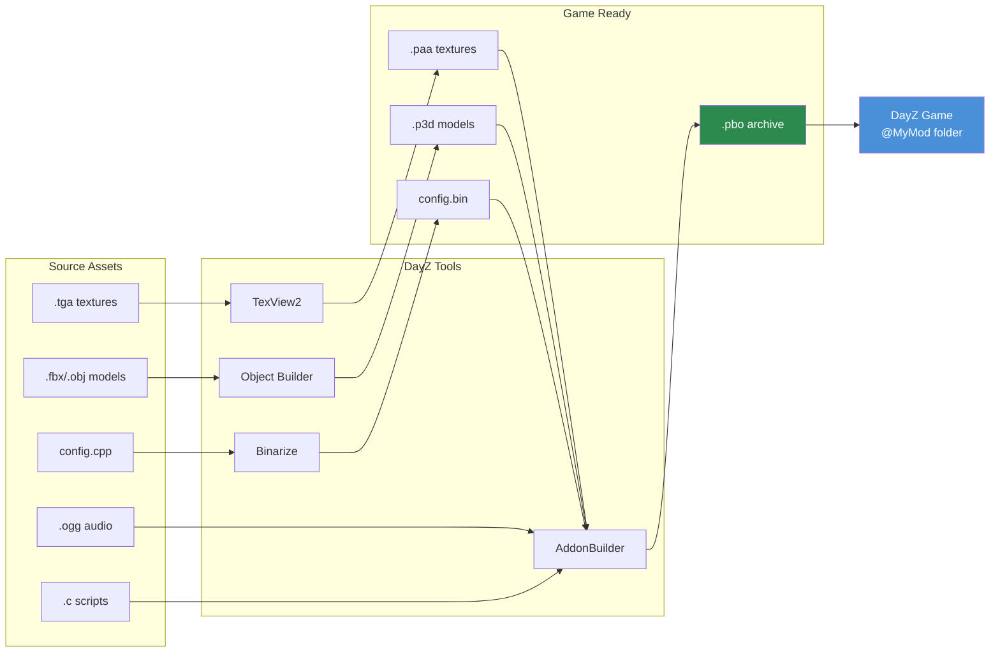

# Kapitola 4.5: Pracovní postup s DayZ Tools

[Domů](../../README.md) | [<< Předchozí: Zvuk](04-audio.md) | **DayZ Tools** | [Další: Balení PBO >>](06-pbo-packing.md)

---

## Úvod

DayZ Tools je bezplatná sada vývojových aplikací distribuovaná přes Steam, poskytovaná společností Bohemia Interactive pro moddery. Obsahuje vše potřebné pro vytváření, konverzi a balení herních assetů: editor 3D modelů, prohlížeč textur, editor terénů, debugger skriptů a binarizační pipeline, která transformuje lidsky čitelné zdrojové soubory do optimalizovaných formátů připravených pro hru. Žádný DayZ mod nelze vytvořit bez alespoň částečné interakce s těmito nástroji.

Tato kapitola poskytuje přehled každého nástroje v sadě, vysvětluje systém disku P: (workdrive), který tvoří základ celého pracovního postupu, pokrývá file patching pro rychlou iteraci při vývoji a provede vás kompletním pipeline od zdrojových souborů k hratelnému modu.

---

## Obsah

- [Přehled sady DayZ Tools](#přehled-sady-dayz-tools)
- [Instalace a nastavení](#instalace-a-nastavení)
- [Disk P: (Workdrive)](#disk-p-workdrive)
- [Object Builder](#object-builder)
- [TexView2](#texview2)
- [Terrain Builder](#terrain-builder)
- [Binarize](#binarize)
- [AddonBuilder](#addonbuilder)
- [Workbench](#workbench)
- [Režim File Patching](#režim-file-patching)
- [Kompletní postup: od zdroje ke hře](#kompletní-postup-od-zdroje-ke-hře)
- [Časté chyby](#časté-chyby)
- [Osvědčené postupy](#osvědčené-postupy)

---

## Přehled sady DayZ Tools

DayZ Tools jsou dostupné jako bezplatné stažení ve Steamu v kategorii **Tools**. Instalace zahrnuje kolekci aplikací, z nichž každá plní specifickou roli v moddingové pipeline.

| Nástroj | Účel | Hlavní uživatelé |
|---------|------|------------------|
| **Object Builder** | Vytváření a editace 3D modelů (.p3d) | 3D umělci, modeláři |
| **TexView2** | Prohlížení a konverze textur (.paa, .tga, .png) | Texturní umělci, všichni moddeři |
| **Terrain Builder** | Vytváření a editace terénů/map | Tvůrci map |
| **Binarize** | Konverze zdrojových formátů do herních | Build pipeline (většinou automatizovaně) |
| **AddonBuilder** | Balení PBO s volitelnou binarizací | Všichni moddeři |
| **Workbench** | Ladění, testování a profilování skriptů | Skripteři |
| **DayZ Tools Launcher** | Centrální rozhraní pro spouštění nástrojů a konfiguraci disku P: | Všichni moddeři |

### Umístění na disku

Po instalaci ze Steamu se nástroje typicky nacházejí zde:

```
C:\Program Files (x86)\Steam\steamapps\common\DayZ Tools\
  Bin\
    AddonBuilder\
      AddonBuilder.exe          <-- Balič PBO
    Binarize\
      Binarize.exe              <-- Konvertor assetů
    TexView2\
      TexView2.exe              <-- Nástroj pro textury
    ObjectBuilder\
      ObjectBuilder.exe         <-- Editor 3D modelů
    Workbench\
      workbenchApp.exe          <-- Debugger skriptů
  TerrainBuilder\
    TerrainBuilder.exe          <-- Editor terénů
```

---

## Instalace a nastavení

### Krok 1: Instalace DayZ Tools ze Steamu

1. Otevřete knihovnu Steamu.
2. Zapněte filtr **Tools** v rozbalovacím menu.
3. Vyhledejte "DayZ Tools".
4. Nainstalujte (zdarma, přibližně 2 GB).

### Krok 2: Spuštění DayZ Tools

1. Spusťte "DayZ Tools" ze Steamu.
2. Otevře se DayZ Tools Launcher -- centrální rozhraní aplikace.
3. Odtud můžete spustit jakýkoli jednotlivý nástroj a konfigurovat nastavení.

### Krok 3: Konfigurace disku P:

Launcher poskytuje tlačítko pro vytvoření a připojení disku P: (workdrive). Jedná se o virtuální disk, který všechny nástroje DayZ používají jako kořenovou cestu.

1. Klikněte na **Setup Workdrive** (nebo tlačítko konfigurace disku P:).
2. Nástroj vytvoří disk P: mapovaný pomocí subst, ukazující na adresář na vašem skutečném disku.
3. Extrahujte nebo propojte symlinkem vanilková data DayZ na P:, aby nástroje mohly odkazovat na herní assety.

---

## Disk P: (Workdrive)

**Disk P:** je virtuální disk Windows (vytvořený pomocí `subst` nebo junction), který slouží jako jednotná kořenová cesta pro veškerý modding DayZ. Každá cesta v P3D modelech, RVMAT materiálech, odkazech v config.cpp a build skriptech je relativní k P:.

### Proč disk P: existuje

Asset pipeline DayZ byla navržena kolem pevné kořenové cesty. Když materiál odkazuje na `MyMod\data\texture_co.paa`, engine hledá `P:\MyMod\data\texture_co.paa`. Tato konvence zajišťuje:

- Všechny nástroje se shodují na umístění souborů.
- Cesty v zabalených PBO odpovídají cestám při vývoji.
- Více modů může koexistovat pod jedním kořenem.

### Struktura

```
P:\
  DZ\                          <-- Extrahovaná vanilková data DayZ
    characters\
    weapons\
    data\
    ...
  DayZ Tools\                  <-- Instalace nástrojů (nebo symlink)
  MyMod\                       <-- Zdroj vašeho modu
    config.cpp
    Scripts\
    data\
  AnotherMod\                  <-- Zdroj dalšího modu
    ...
```

### SetupWorkdrive.bat

Mnoho modových projektů obsahuje skript `SetupWorkdrive.bat`, který automatizuje vytvoření disku P: a nastavení junctions. Typický skript:

```batch
@echo off
REM Create P: drive pointing to the workspace
subst P: "D:\DayZModding"

REM Create junctions for vanilla game data
mklink /J "P:\DZ" "C:\Program Files (x86)\Steam\steamapps\common\DayZ\dta"

REM Create junction for tools
mklink /J "P:\DayZ Tools" "C:\Program Files (x86)\Steam\steamapps\common\DayZ Tools"

echo Workdrive P: configured.
pause
```

> **Tip:** Workdrive musí být připojen před spuštěním jakéhokoli nástroje DayZ. Pokud Object Builder nebo Binarize nemůže najít soubory, první věc ke kontrole je, zda je disk P: připojen.

---

## Object Builder

Object Builder je editor 3D modelů pro soubory P3D. Podrobně je popsán v [Kapitole 4.2: 3D modely](02-models.md). Zde je souhrn jeho role v řetězci nástrojů.

### Hlavní schopnosti

- Vytváření a editace souborů P3D modelů.
- Definice LODů (Level of Detail) pro vizuální, kolizní a stínové meshe.
- Přiřazení materiálů (RVMAT) a textur (PAA) k plochám modelu.
- Vytváření pojmenovaných selekcí pro animace a výměnu textur.
- Umísťování paměťových bodů a proxy objektů.
- Import geometrie z formátů FBX, OBJ a 3DS.
- Validace modelů pro kompatibilitu s enginem.

### Spuštění

```
DayZ Tools Launcher --> Object Builder
```

Nebo přímo: `P:\DayZ Tools\Bin\ObjectBuilder\ObjectBuilder.exe`

### Integrace s dalšími nástroji

- **Odkazuje na TexView2** pro náhledy textur (dvojklik na texturu ve vlastnostech ploch).
- **Výstupem jsou soubory P3D** spotřebovávané Binarize a AddonBuilderem.
- **Čte soubory P3D** z vanilkových dat na disku P: pro referenci.

---

## TexView2

TexView2 je nástroj pro prohlížení a konverzi textur. Obsluhuje všechny konverze texturových formátů potřebné pro modding DayZ.

### Hlavní schopnosti

- Otevření a náhled souborů PAA, TGA, PNG, EDDS a DDS.
- Konverze mezi formáty (TGA/PNG do PAA, PAA do TGA atd.).
- Prohlížení jednotlivých kanálů (R, G, B, A) samostatně.
- Zobrazení úrovní mipmap.
- Zobrazení rozměrů textury a typu komprese.
- Dávková konverze přes příkazový řádek.

### Spuštění

```
DayZ Tools Launcher --> TexView2
```

Nebo přímo: `P:\DayZ Tools\Bin\TexView2\TexView2.exe`

### Běžné operace

**Konverze TGA do PAA:**
1. File --> Open --> vyberte váš TGA soubor.
2. Ověřte, že obrázek vypadá správně.
3. File --> Save As --> zvolte formát PAA.
4. Vyberte kompresi (DXT1 pro neprůhledné, DXT5 pro alfa kanál).
5. Uložte.

**Kontrola vanilkové PAA textury:**
1. File --> Open --> procházejte do `P:\DZ\...` a vyberte PAA soubor.
2. Prohlédněte si obrázek. Klikněte na tlačítka kanálů (R, G, B, A) pro kontrolu jednotlivých kanálů.
3. Poznamenejte si rozměry a typ komprese zobrazené ve stavovém řádku.

**Konverze přes příkazový řádek:**
```bash
TexView2.exe -i "P:\MyMod\data\texture_co.tga" -o "P:\MyMod\data\texture_co.paa"
```

---

## Terrain Builder

Terrain Builder je specializovaný nástroj pro vytváření vlastních map (terénů). Tvorba map je jedním z nejsložitějších moddingových úkolů v DayZ, zahrnující satelitní snímky, výškové mapy, povrchové masky a umísťování objektů.

### Hlavní schopnosti

- Import satelitních snímků a výškových map.
- Definice vrstev terénu (tráva, hlína, kámen, písek atd.).
- Umísťování objektů (budov, stromů, skal) na mapu.
- Konfigurace povrchových textur a materiálů.
- Export dat terénu pro Binarize.

### Kdy potřebujete Terrain Builder

- Vytváření nové mapy od nuly.
- Modifikace existujícího terénu (přidávání/odebírání objektů, změna tvaru terénu).
- Terrain Builder NENÍ potřeba pro mody předmětů, zbraní, UI nebo mody obsahující pouze skripty.

### Spuštění

```
DayZ Tools Launcher --> Terrain Builder
```

> **Poznámka:** Tvorba terénů je pokročilé téma, které si zaslouží vlastní dedikovaného průvodce. Tato kapitola pokrývá Terrain Builder pouze jako součást přehledu nástrojů.

---

## Binarize

Binarize je hlavní konverzní engine, který transformuje lidsky čitelné zdrojové soubory do optimalizovaných, herně připravených binárních formátů. Běží na pozadí během balení PBO (přes AddonBuilder), ale lze ho také vyvolat přímo.

### Co Binarize konvertuje

| Zdrojový formát | Výstupní formát | Popis |
|-----------------|-----------------|-------|
| MLOD `.p3d` | ODOL `.p3d` | Optimalizovaný 3D model |
| `.tga` / `.png` / `.edds` | `.paa` | Komprimovaná textura |
| `.cpp` (config) | `.bin` | Binarizovaný config (rychlejší parsování) |
| `.rvmat` | `.rvmat` (zpracovaný) | Materiál s vyřešenými cestami |
| `.wrp` | `.wrp` (optimalizovaný) | Terénní svět |

### Kdy je binarizace potřebná

| Typ obsahu | Binarizovat? | Důvod |
|------------|--------------|-------|
| Config.cpp s CfgVehicles | **Ano** | Engine vyžaduje binarizované configy pro definice předmětů |
| Config.cpp (pouze skripty) | Volitelné | Configs pouze se skripty fungují i bez binarizace |
| P3D modely | **Ano** | ODOL se načítá rychleji, je menší, optimalizovaný pro engine |
| Textury (TGA/PNG) | **Ano** | PAA je povinný za běhu |
| Skripty (.c soubory) | **Ne** | Skripty se načítají tak, jak jsou (text) |
| Audio (.ogg) | **Ne** | OGG je již připravený pro hru |
| Layouty (.layout) | **Ne** | Načítají se tak, jak jsou |

### Přímé vyvolání

```bash
Binarize.exe -targetPath="P:\build\MyMod" -sourcePath="P:\MyMod" -noLogs
```

V praxi Binarize přímo voláte zřídka -- AddonBuilder ho obaluje jako součást procesu balení PBO.

---

## AddonBuilder

AddonBuilder je nástroj pro balení PBO. Vezme zdrojový adresář a vytvoří archiv `.pbo`, volitelně předtím spustí Binarize na obsahu. Podrobně je popsán v [Kapitole 4.6: Balení PBO](06-pbo-packing.md).

### Rychlá reference

```bash
# Balení s binarizací (pro mody předmětů/zbraní s configy, modely, texturami)
AddonBuilder.exe "P:\MyMod" "P:\output" -prefix="MyMod" -sign="MyKey"

# Balení bez binarizace (pro mody obsahující pouze skripty)
AddonBuilder.exe "P:\MyMod" "P:\output" -prefix="MyMod" -packonly
```

### Spuštění

Z DayZ Tools Launcheru, nebo přímo:
```
P:\DayZ Tools\Bin\AddonBuilder\AddonBuilder.exe
```

AddonBuilder má jak GUI režim, tak režim příkazového řádku. GUI poskytuje vizuální prohlížeč souborů a zaškrtávací políčka možností. Režim příkazového řádku používají automatizované build skripty.

---

## Workbench

Workbench je vývojové prostředí pro skripty zahrnuté v DayZ Tools. Poskytuje schopnosti editace, ladění a profilování skriptů.

### Hlavní schopnosti

- **Editace skriptů** se zvýrazněním syntaxe pro Enforce Script.
- **Ladění** s breakpointy, krokováním a kontrolou proměnných.
- **Profilování** pro identifikaci výkonnostních úzkých míst ve skriptech.
- **Konzole** pro vyhodnocování výrazů a testování úryvků.
- **Prohlížeč zdrojů** pro kontrolu herních dat.

### Spuštění

```
DayZ Tools Launcher --> Workbench
```

Nebo přímo: `P:\DayZ Tools\Bin\Workbench\workbenchApp.exe`

### Pracovní postup ladění

1. Otevřete Workbench.
2. Nakonfigurujte projekt tak, aby ukazoval na skripty vašeho modu.
3. Nastavte breakpointy v souborech `.c`.
4. Spusťte hru přes Workbench (spustí DayZ v debug režimu).
5. Když provádění narazí na breakpoint, Workbench pozastaví hru a zobrazí zásobník volání, lokální proměnné a umožní krokování.

### Omezení

- Podpora Enforce Scriptu ve Workbenchi má určité mezery -- ne všechna engine API jsou plně dokumentována v jeho automatickém doplňování.
- Někteří moddeři preferují externí editory (VS Code s komunitními rozšířeními pro Enforce Script) pro psaní kódu a Workbench používají pouze pro ladění.
- Workbench může být nestabilní s velkými mody nebo složitými konfiguracemi breakpointů.

---

## Režim File Patching

**File patching** je vývojová zkratka, která umožňuje hře načítat volné soubory z disku místo toho, aby vyžadovala jejich zabalení do PBO. To dramaticky zrychluje iteraci při vývoji.

### Jak File Patching funguje

Když je DayZ spuštěn s parametrem `-filePatching`, engine kontroluje disk P: pro soubory dříve, než hledá v PBO. Pokud soubor existuje na P:, načte se volná verze místo verze z PBO.

```
Normální režim: Hra načítá --> PBO --> soubory
File patching:  Hra načítá --> Disk P: (pokud soubor existuje) --> PBO (záloha)
```

### Povolení File Patching

Přidejte parametr spuštění `-filePatching` k DayZ:

```bash
# Klient
DayZDiag_x64.exe -filePatching -mod="MyMod" -connect=127.0.0.1

# Server
DayZDiag_x64.exe -filePatching -server -mod="MyMod" -config=serverDZ.cfg
```

> **Důležité:** File patching vyžaduje **Diag** (diagnostický) spustitelný soubor (`DayZDiag_x64.exe`), nikoli retailový spustitelný soubor. Retailový build ignoruje `-filePatching` z bezpečnostních důvodů.

### Co File Patching dokáže

| Typ assetu | File Patching funguje? | Poznámky |
|------------|------------------------|----------|
| Skripty (.c) | **Ano** | Nejrychlejší iterace -- editace, restart, test |
| Layouty (.layout) | **Ano** | Změny UI bez rebuildu |
| Textury (.paa) | **Ano** | Výměna textur bez rebuildu |
| Config.cpp | **Částečně** | Pouze nebinarizované configy |
| Modely (.p3d) | **Ano** | Pouze nebinarizované MLOD P3D |
| Audio (.ogg) | **Ano** | Výměna zvuků bez rebuildu |

### Pracovní postup s File Patching

1. Nastavte disk P: se zdrojovými soubory vašeho modu.
2. Spusťte server a klienta s `-filePatching`.
3. Editujte skriptový soubor ve vašem editoru.
4. Restartujte hru (nebo se znovu připojte) pro načtení změn.
5. Žádný rebuild PBO není potřeba.

> **Tip:** Pro změny pouze ve skriptech file patching zcela eliminuje krok buildu. Editujete soubory `.c`, restartujete a testujete. Toto je nejrychlejší vývojová smyčka, která je k dispozici.

### Omezení

- **Žádný binarizovaný obsah.** Config.cpp s položkami `CfgVehicles` nemusí fungovat správně bez binarizace. Configs pouze se skripty fungují bez problémů.
- **Žádné podepisování klíčů.** File-patchovaný obsah není podepsaný, takže funguje pouze při vývoji (ne na veřejných serverech).
- **Pouze Diag build.** Retailový spustitelný soubor ignoruje file patching.
- **Disk P: musí být připojen.** Pokud workdrive není připojen, file patching nemá odkud číst.

---

## Kompletní postup: od zdroje ke hře

Zde je kompletní pipeline pro přeměnu zdrojových assetů v hratelný mod:

### Kompletní asset pipeline



### Fáze 1: Vytvoření zdrojových assetů

```
3D Software (Blender/3dsMax)  -->  FBX export
Image Editor (Photoshop/GIMP) -->  TGA/PNG export
Audio Editor (Audacity)       -->  OGG export
Text Editor (VS Code)         -->  .c skripty, config.cpp, .layout soubory
```

### Fáze 2: Import a konverze

```
FBX  -->  Object Builder  -->  P3D (s LODy, selekcemi, materiály)
TGA  -->  TexView2         -->  PAA (komprimovaná textura)
PNG  -->  TexView2         -->  PAA (komprimovaná textura)
OGG  -->  (konverze není potřeba, připravené pro hru)
```

### Fáze 3: Organizace na disku P:

```
P:\MyMod\
  config.cpp                    <-- Konfigurace modu
  Scripts\
    3_Game\                     <-- Skripty s časným načítáním
    4_World\                    <-- Skripty entit/manažerů
    5_Mission\                  <-- Skripty UI/mise
  data\
    models\
      my_item.p3d               <-- 3D model
    textures\
      my_item_co.paa            <-- Difúzní textura
      my_item_nohq.paa          <-- Normálová mapa
      my_item_smdi.paa          <-- Spekulární mapa
    materials\
      my_item.rvmat             <-- Definice materiálu
  sound\
    my_sound.ogg                <-- Audio soubor
  GUI\
    layouts\
      my_panel.layout           <-- UI layout
```

### Fáze 4: Testování s File Patching (Vývoj)

```
Spuštění DayZDiag s -filePatching
  |
  |--> Engine čte volné soubory z P:\MyMod\
  |--> Test ve hře
  |--> Editace souborů přímo na P:
  |--> Restart pro načtení změn
  |--> Rychlá iterace
```

### Fáze 5: Balení PBO (Vydání)

```
AddonBuilder / build skript
  |
  |--> Čte zdroj z P:\MyMod\
  |--> Binarize konvertuje: P3D-->ODOL, TGA-->PAA, config.cpp-->.bin
  |--> Zabalí vše do MyMod.pbo
  |--> Podepíše klíčem: MyMod.pbo.MyKey.bisign
  |--> Výstup: @MyMod\addons\MyMod.pbo
```

### Fáze 6: Distribuce

```
@MyMod\
  addons\
    MyMod.pbo                   <-- Zabalený mod
    MyMod.pbo.MyKey.bisign      <-- Podpis pro ověření serverem
  keys\
    MyKey.bikey                 <-- Veřejný klíč pro administrátory serverů
  mod.cpp                       <-- Metadata modu (název, autor atd.)
```

Hráči se přihlásí k odběru modu na Steam Workshopu, nebo ho administrátoři serverů nainstalují ručně.

---

## Časté chyby

### 1. Disk P: není připojen

**Příznak:** Všechny nástroje hlásí chyby "file not found". Object Builder zobrazuje prázdné textury.
**Řešení:** Spusťte váš `SetupWorkdrive.bat` nebo připojte P: přes DayZ Tools Launcher před spuštěním jakéhokoli nástroje.

### 2. Špatný nástroj pro daný úkol

**Příznak:** Pokus editovat PAA soubor v textovém editoru, nebo otevření P3D v Notepadu.
**Řešení:** PAA je binární -- použijte TexView2. P3D je binární -- použijte Object Builder. Config.cpp je text -- použijte jakýkoli textový editor.

### 3. Zapomenutí extrahovat vanilková data

**Příznak:** Object Builder nemůže zobrazit vanilkové textury na odkazovaných modelech. Materiály se zobrazují růžově/magentově.
**Řešení:** Extrahujte vanilková data DayZ do `P:\DZ\`, aby nástroje mohly vyřešit křížové reference na herní obsah.

### 4. File Patching s retailovým spustitelným souborem

**Příznak:** Změny souborů na disku P: se neprojevují ve hře.
**Řešení:** Použijte `DayZDiag_x64.exe`, nikoli `DayZ_x64.exe`. Pouze Diag build podporuje `-filePatching`.

### 5. Build bez disku P:

**Příznak:** AddonBuilder nebo Binarize selže s chybami rozlišení cest.
**Řešení:** Připojte disk P: před spuštěním jakéhokoli build nástroje. Všechny cesty v modelech a materiálech jsou relativní k P:.

---

## Osvědčené postupy

1. **Vždy používejte disk P:.** Odolávejte pokušení používat absolutní cesty. P: je standard a všechny nástroje ho očekávají.

2. **Používejte file patching při vývoji.** Zkracuje dobu iterace z minut (rebuild PBO) na sekundy (restart hry). PBO sestavujte pouze pro testování vydání a distribuci.

3. **Automatizujte vaši build pipeline.** Používejte skripty (`build_pbos.bat`, `dev.py`) pro automatizaci volání AddonBuilderu. Ruční balení přes GUI je náchylné k chybám a pomalé pro mody s více PBO.

4. **Udržujte zdroj a výstup odděleně.** Zdrojové soubory žijí na P:. Sestavená PBO jdou do odděleného výstupního adresáře. Nikdy je nemíchejte.

5. **Naučte se klávesové zkratky.** Object Builder a TexView2 mají rozsáhlé klávesové zkratky, které dramaticky zrychlují práci. Investujte čas do jejich naučení.

6. **Extrahujte a studujte vanilková data.** Nejlepší způsob, jak se naučit strukturu DayZ assetů, je prozkoumat existující. Extrahujte vanilková PBO a otevřete modely, materiály a textury v příslušných nástrojích.

7. **Používejte Workbench pro ladění, externí editory pro psaní.** VS Code s rozšířeními pro Enforce Script poskytuje lepší editaci. Workbench poskytuje lepší ladění. Používejte oba.

---

## Pozorováno v reálných modech

| Vzor | Mod | Detail |
|------|-----|--------|
| Junctions disku P: přes `SetupWorkdrive.bat` | COT / Community Online Tools | Dodává batch skript, který vytváří junction linky ze zdroje modu na disk P: pro konzistentní rozlišení cest |
| `.gproj` projektové soubory Workbench | Dabs Framework | Obsahuje projektové soubory Workbench pro ladění Enforce Scriptu s breakpointy a kontrolou proměnných |
| Automatizovaný `dev.py` build orchestrátor | StarDZ (všechny mody) | Python skript obaluje volání AddonBuilderu, spravuje buildy více PBO, spouští server/klienta a monitoruje logy |

---

## Kompatibilita a dopad

- **Více modů:** Všechny nástroje DayZ sdílejí disk P:. Více modových projektů koexistuje pod `P:\` bez konfliktu, pokud se názvy složek liší. Kolize junctions nastanou, když dva mody používají stejnou cestu na P:.
- **Výkon:** Binarize je náročný na CPU a jednovláknový na soubor. Velké mody s mnoha P3D modely a texturami mohou trvat 5-10 minut na binarizaci. Rozdělení do více PBO a použití `-packonly` pro skripty výrazně snižuje dobu buildu.
- **Verze:** DayZ Tools jsou aktualizovány společně s hlavními patchi DayZ. Object Builder a Binarize příležitostně dostávají opravy, ale celkový pracovní postup je stabilní od DayZ 1.0. Vždy udržujte DayZ Tools aktualizované přes Steam.

---

## Navigace

| Předchozí | Nahoru | Další |
|-----------|--------|-------|
| [4.4 Zvuk](04-audio.md) | [Část 4: Formáty souborů a DayZ Tools](01-textures.md) | [4.6 Balení PBO](06-pbo-packing.md) |
