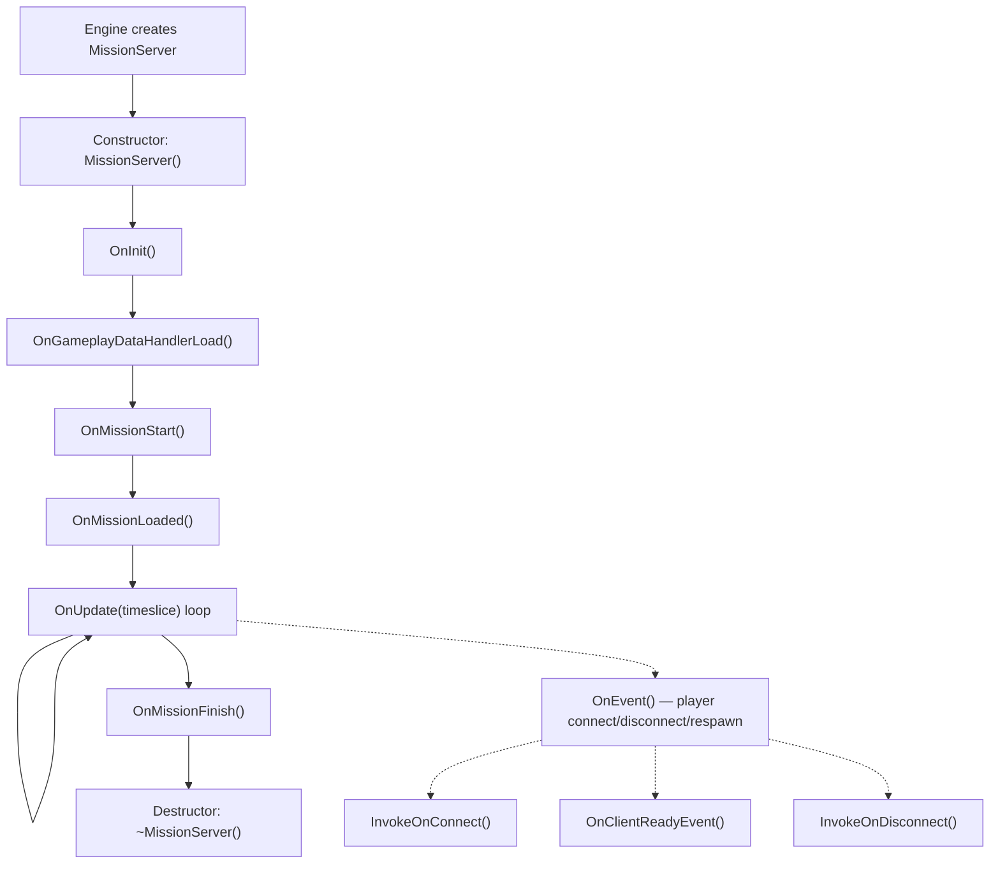
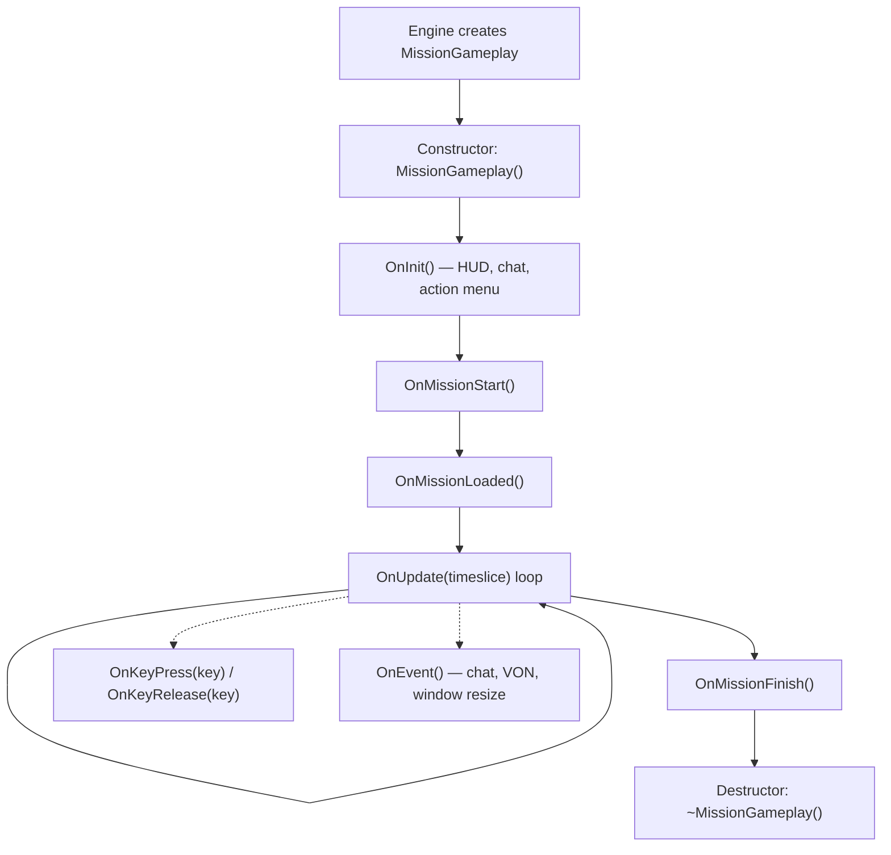
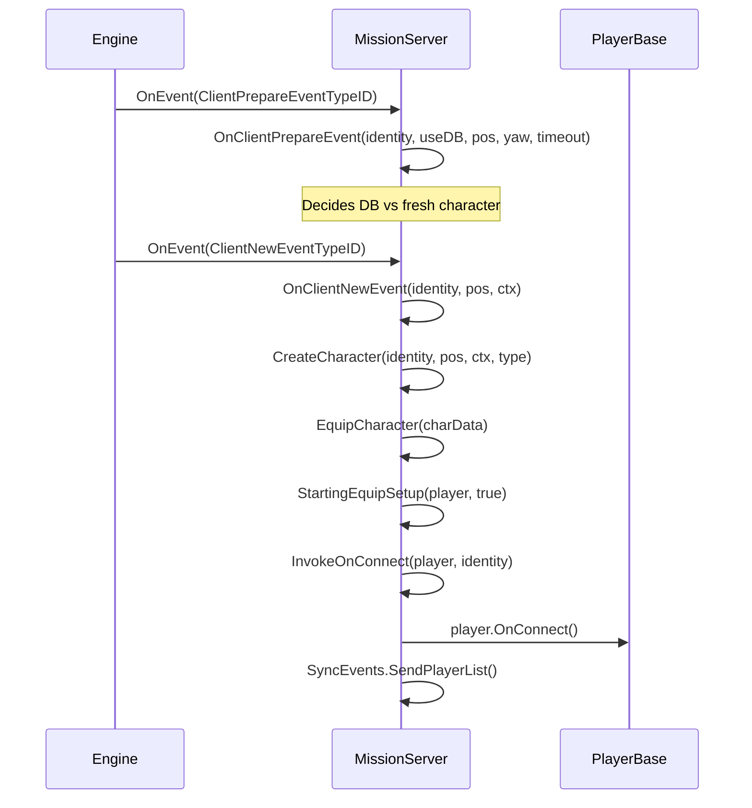
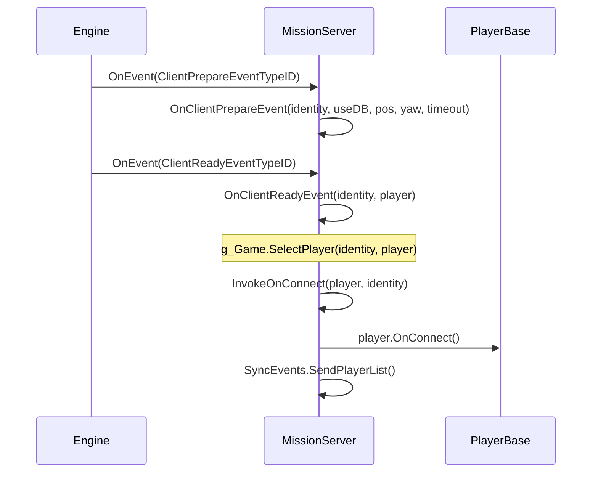
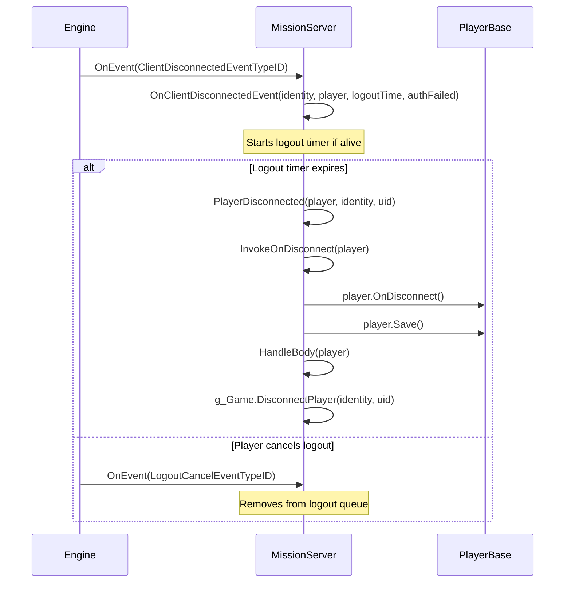

# Chapter 6.11: Mission Hooks

[Domů](../../README.md) | [<< Předchozí: Central Economy](10-central-economy.md) | **Mission Hooks** | [Další: Action System >>](12-action-system.md)

---

## Úvod

Každý DayZ mod potřebuje vstupní bod --- místo, kde inicializuje manažery, registruje RPC handlery, napojuje se na připojení hráčů a uklízí při vypnutí. Tímto vstupním bodem je třída **Mission**. Engine vytvoří přesně jednu instanci Mission při načtení scénáře: `MissionServer` na dedikovaném serveru, `MissionGameplay` na klientovi, nebo obě na listen serveru. Tyto třídy poskytují lifecycle hooky, které se spouštějí v garantovaném pořadí, a dávají tak modům spolehlivé místo pro vložení chování.

Tato kapitola pokrývá celou hierarchii tříd Mission, každou hookovatelnou metodu, správný vzor `modded class` pro jejich rozšíření a reálné příklady z vanilla DayZ, COT a Expansion.

---

## Hierarchie tříd

```
Mission                      // 3_Game/gameplay.c (base, defines all hook signatures)
└── MissionBaseWorld         // 4_World/classes/missionbaseworld.c (minimal bridge)
    └── MissionBase          // 5_Mission/mission/missionbase.c (shared setup: HUD, menus, plugins)
        ├── MissionServer    // 5_Mission/mission/missionserver.c (server-side)
        └── MissionGameplay  // 5_Mission/mission/missiongameplay.c (client-side)
```

- **Mission** definuje všechny signatury hooků jako prázdné metody: `OnInit()`, `OnUpdate()`, `OnEvent()`, `OnMissionStart()`, `OnMissionFinish()`, `OnKeyPress()`, `OnKeyRelease()`, atd.
- **MissionBase** inicializuje plugin manager, widget event handler, world data, dynamickou hudbu, zvukové sady a sledování vstupních zařízení. Je společným rodičem pro server i klienta.
- **MissionServer** zpracovává připojení hráčů, odpojení, respawny, správu mrtvol, plánování ticků a dělostřelectvo.
- **MissionGameplay** zpracovává vytvoření HUD, chat, akční menu, UI voice-over-network, inventář, blokování vstupu a plánování na straně klienta.

---

## Přehled životního cyklu

### Životní cyklus MissionServer (strana serveru)



### Životní cyklus MissionGameplay (strana klienta)



---

## Metody základní třídy Mission

**Soubor:** `3_Game/gameplay.c`

Základní třída `Mission` definuje každou hookovatelnou metodu. Všechny jsou virtuální s prázdnými výchozími implementacemi, pokud není uvedeno jinak.

### Hooky životního cyklu

| Metoda | Signatura | Kdy se volá |
|--------|-----------|-------------|
| `OnInit` | `void OnInit()` | Po konstruktoru, před startem mise. Primární bod nastavení. |
| `OnMissionStart` | `void OnMissionStart()` | Po OnInit. Svět mise je aktivní. |
| `OnMissionLoaded` | `void OnMissionLoaded()` | Po OnMissionStart. Všechny vanilla systémy jsou inicializovány. |
| `OnGameplayDataHandlerLoad` | `void OnGameplayDataHandlerLoad()` | Server: po načtení gameplay dat (cfggameplay.json). |
| `OnUpdate` | `void OnUpdate(float timeslice)` | Každý snímek. `timeslice` je počet sekund od posledního snímku (typicky 0,016–0,033). |
| `OnMissionFinish` | `void OnMissionFinish()` | Při vypnutí nebo odpojení. Zde ukliďte vše. |

### Hooky vstupu (strana klienta)

| Metoda | Signatura | Kdy se volá |
|--------|-----------|-------------|
| `OnKeyPress` | `void OnKeyPress(int key)` | Fyzická klávesa stisknuta. `key` je konstanta `KeyCode`. |
| `OnKeyRelease` | `void OnKeyRelease(int key)` | Fyzická klávesa uvolněna. |
| `OnMouseButtonPress` | `void OnMouseButtonPress(int button)` | Tlačítko myši stisknuto. |
| `OnMouseButtonRelease` | `void OnMouseButtonRelease(int button)` | Tlačítko myši uvolněno. |

### Hook událostí

| Metoda | Signatura | Kdy se volá |
|--------|-----------|-------------|
| `OnEvent` | `void OnEvent(EventType eventTypeId, Param params)` | Události enginu: chat, VON, připojení/odpojení hráče, změna velikosti okna, atd. |

### Pomocné metody

| Metoda | Signatura | Popis |
|--------|-----------|-------|
| `GetHud` | `Hud GetHud()` | Vrací instanci HUD (pouze klient). |
| `GetWorldData` | `WorldData GetWorldData()` | Vrací data specifická pro svět (teplotní křivky, atd.). |
| `IsPaused` | `bool IsPaused()` | Zda je hra pozastavena (singleplayer / listen server). |
| `IsServer` | `bool IsServer()` | `true` pro MissionServer, `false` pro MissionGameplay. |
| `IsMissionGameplay` | `bool IsMissionGameplay()` | `true` pro MissionGameplay, `false` pro MissionServer. |
| `PlayerControlEnable` | `void PlayerControlEnable(bool bForceSuppress)` | Znovu povolí vstup hráče po zakázání. |
| `PlayerControlDisable` | `void PlayerControlDisable(int mode)` | Zakáže vstup hráče (např. `INPUT_EXCLUDE_ALL`). |
| `IsControlDisabled` | `bool IsControlDisabled()` | Zda jsou ovládací prvky hráče aktuálně zakázány. |
| `GetControlDisabledMode` | `int GetControlDisabledMode()` | Vrací aktuální režim blokování vstupu. |

---

## Hooky MissionServer (strana serveru)

**Soubor:** `5_Mission/mission/missionserver.c`

MissionServer je instanciován enginem na dedikovaných serverech. Zpracovává vše související s životním cyklem hráčů na serveru.

### Klíčové vanilla chování

- **Konstruktor**: Nastavuje `CallQueue` pro statistiky hráčů (30sekundový interval), pole mrtvých hráčů, mapy sledování odhlášení, handler sběru deště.
- **OnInit**: Načítá `CfgGameplayHandler`, `PlayerSpawnHandler`, `CfgPlayerRestrictedAreaHandler`, `UndergroundAreaLoader`, pozice dělostřelecké palby.
- **OnMissionStart**: Vytváří zóny efektových oblastí (kontaminované zóny, atd.).
- **OnUpdate**: Spouští plánovač ticků, zpracovává časovače odhlášení, aktualizuje základní teplotu prostředí, sběr deště, náhodné dělostřelectvo.

### OnEvent --- události připojení hráčů

Serverový `OnEvent` je centrální dispečer pro všechny události životního cyklu hráčů. Engine posílá události s typovanými objekty `Param`. Vanilla je zpracovává přes blok `switch`:

| Událost | Typ Param | Co se stane |
|---------|-----------|-------------|
| `ClientPrepareEventTypeID` | `ClientPrepareEventParams` | Rozhoduje DB vs nová postava |
| `ClientNewEventTypeID` | `ClientNewEventParams` | Vytvoří + vybaví novou postavu, volá `InvokeOnConnect` |
| `ClientReadyEventTypeID` | `ClientReadyEventParams` | Existující postava načtena, volá `OnClientReadyEvent` + `InvokeOnConnect` |
| `ClientRespawnEventTypeID` | `ClientRespawnEventParams` | Žádost o respawn hráče, zabije starou postavu pokud je v bezvědomí |
| `ClientReconnectEventTypeID` | `ClientReconnectEventParams` | Hráč se znovu připojil k živé postavě |
| `ClientDisconnectedEventTypeID` | `ClientDisconnectedEventParams` | Hráč se odpojuje, spouští časovač odhlášení |
| `LogoutCancelEventTypeID` | `LogoutCancelEventParams` | Hráč zrušil odpočet odhlášení |

### Metody připojení hráčů

Volány zevnitř `OnEvent` při spuštění událostí souvisejících s hráči:

| Metoda | Signatura | Vanilla chování |
|--------|-----------|-----------------|
| `InvokeOnConnect` | `void InvokeOnConnect(PlayerBase player, PlayerIdentity identity)` | Volá `player.OnConnect()`. Primární hook „hráč se připojil". |
| `InvokeOnDisconnect` | `void InvokeOnDisconnect(PlayerBase player)` | Volá `player.OnDisconnect()`. Hráč plně odpojen. |
| `OnClientReadyEvent` | `void OnClientReadyEvent(PlayerIdentity identity, PlayerBase player)` | Volá `g_Game.SelectPlayer()`. Existující postava načtena z DB. |
| `OnClientNewEvent` | `PlayerBase OnClientNewEvent(PlayerIdentity identity, vector pos, ParamsReadContext ctx)` | Vytvoří + vybaví novou postavu. Vrací `PlayerBase`. |
| `OnClientRespawnEvent` | `void OnClientRespawnEvent(PlayerIdentity identity, PlayerBase player)` | Zabije starou postavu pokud je v bezvědomí/spoutána. |
| `OnClientReconnectEvent` | `void OnClientReconnectEvent(PlayerIdentity identity, PlayerBase player)` | Volá `player.OnReconnect()`. |
| `PlayerDisconnected` | `void PlayerDisconnected(PlayerBase player, PlayerIdentity identity, string uid)` | Volá `InvokeOnDisconnect`, ukládá hráče, opouští hive, zpracovává tělo, odstraňuje ze serveru. |

### Nastavení postavy

| Metoda | Signatura | Popis |
|--------|-----------|-------|
| `CreateCharacter` | `PlayerBase CreateCharacter(PlayerIdentity identity, vector pos, ParamsReadContext ctx, string characterName)` | Vytváří entitu hráče přes `g_Game.CreatePlayer()` + `g_Game.SelectPlayer()`. |
| `EquipCharacter` | `void EquipCharacter(MenuDefaultCharacterData char_data)` | Iteruje přes attachment sloty, náhodně vybírá pokud je vlastní respawn zakázán. Volá `StartingEquipSetup()`. |
| `StartingEquipSetup` | `void StartingEquipSetup(PlayerBase player, bool clothesChosen)` | **Prázdná ve vanilla** --- váš vstupní bod pro startovní vybavení. |

---

## Hooky MissionGameplay (strana klienta)

**Soubor:** `5_Mission/mission/missiongameplay.c`

MissionGameplay je instanciován na klientovi při připojení k serveru nebo spuštění singleplayeru. Spravuje veškeré UI a vstup na straně klienta.

### Klíčové vanilla chování

- **Konstruktor**: Ničí existující menu, vytváří Chat, ActionMenu, IngameHud, stav VoN, časovače prolínání, registraci SyncEvents.
- **OnInit**: Chrání proti dvojí inicializaci pomocí `m_Initialized`. Vytváří kořenový widget HUD z `"gui/layouts/day_z_hud.layout"`, widget chatu, akční menu, ikonu mikrofonu, widgety úrovně hlasu VoN, oblast chatovacího kanálu. Volá `PPEffects.Init()` a `MapMarkerTypes.Init()`.
- **OnMissionStart**: Skrývá kurzor, nastavuje stav mise na `MISSION_STATE_GAME`, načítá efektové oblasti v singleplayeru.
- **OnUpdate**: Plánovač ticků pro lokálního hráče, aktualizace hologramu, radiální quickbar (konzole), menu gest, zpracování vstupu pro inventář/chat/VoN, debug monitor, chování pauzy.
- **OnMissionFinish**: Skrývá dialog, ničí všechna menu a chat, maže kořenový widget HUD, zastavuje všechny PPE efekty, znovu povoluje všechny vstupy, nastavuje stav mise na `MISSION_STATE_FINNISH`.

### Hooky vstupu

```c
override void OnKeyPress(int key)
{
    super.OnKeyPress(key);
    // Vanilla předává do Hud.KeyPress(key)
    // hodnoty key jsou konstanty KeyCode (např. KeyCode.KC_F1 = 59)
}

override void OnKeyRelease(int key)
{
    super.OnKeyRelease(key);
}
```

### Hook událostí

Vanilla `MissionGameplay.OnEvent()` zpracovává `ChatMessageEventTypeID` (přidává do widgetu chatu), `ChatChannelEventTypeID` (aktualizuje indikátor kanálu), `WindowsResizeEventTypeID` (přestavuje menu/HUD), `SetFreeCameraEventTypeID` (debug kamera) a `VONStateEventTypeID` (stav hlasu). Přepište ji stejným vzorem `switch` a vždy volejte `super.OnEvent()`.

### Řízení vstupu

`PlayerControlDisable(int mode)` aktivuje skupinu vyloučení vstupu (např. `INPUT_EXCLUDE_ALL`, `INPUT_EXCLUDE_INVENTORY`). `PlayerControlEnable(bool bForceSuppress)` ji odebere. Mapují se na skupiny vyloučení definované v `specific.xml`. Přepište je, pokud váš mod potřebuje vlastní chování blokování vstupu (jako to dělá Expansion pro svá menu).

---

## Tok událostí na straně serveru: Připojení hráče

Pochopení přesné sekvence událostí při připojení hráče je klíčové pro to, abyste věděli, kde napojit svůj kód.

### Nová postava (první připojení nebo po smrti)



### Existující postava (opětovné připojení po odpojení)



### Odpojení hráče



---

## Jak hookovat: Vzor modded class

Správný způsob rozšíření tříd Mission je vzor `modded class`. Ten využívá mechanismus dědičnosti tříd v Enforce Scriptu, kde `modded class` rozšiřuje existující třídu bez jejího nahrazení, což umožňuje koexistenci více modů.

### Základní serverový hook

```c
// Your mod: Scripts/5_Mission/YourMod/MissionServer.c
modded class MissionServer
{
    ref MyServerManager m_MyManager;

    override void OnInit()
    {
        super.OnInit();  // ALWAYS call super first

        m_MyManager = new MyServerManager();
        m_MyManager.Init();
        Print("[MyMod] Server manager initialized");
    }

    override void OnMissionFinish()
    {
        if (m_MyManager)
        {
            m_MyManager.Cleanup();
            m_MyManager = null;
        }

        super.OnMissionFinish();  // Call super (before or after your cleanup)
    }
}
```

### Základní klientský hook

```c
// Your mod: Scripts/5_Mission/YourMod/MissionGameplay.c
modded class MissionGameplay
{
    ref MyHudWidget m_MyHud;

    override void OnInit()
    {
        super.OnInit();  // ALWAYS call super first

        // Create custom HUD elements
        m_MyHud = new MyHudWidget();
        m_MyHud.Init();
    }

    override void OnUpdate(float timeslice)
    {
        super.OnUpdate(timeslice);

        // Update custom HUD every frame
        if (m_MyHud)
        {
            m_MyHud.Update(timeslice);
        }
    }

    override void OnMissionFinish()
    {
        if (m_MyHud)
        {
            m_MyHud.Destroy();
            m_MyHud = null;
        }

        super.OnMissionFinish();
    }
}
```

### Hookování připojení hráče

```c
modded class MissionServer
{
    override void InvokeOnConnect(PlayerBase player, PlayerIdentity identity)
    {
        super.InvokeOnConnect(player, identity);

        // Your code runs AFTER vanilla and all earlier mods
        if (player && identity)
        {
            string uid = identity.GetId();
            string name = identity.GetName();
            Print("[MyMod] Player connected: " + name + " (" + uid + ")");

            // Load player data, send settings, etc.
            MyPlayerData.Load(uid);
        }
    }

    override void InvokeOnDisconnect(PlayerBase player)
    {
        // Save data BEFORE super (player may be deleted after)
        if (player && player.GetIdentity())
        {
            string uid = player.GetIdentity().GetId();
            MyPlayerData.Save(uid);
        }

        super.InvokeOnDisconnect(player);
    }
}
```

### Hookování chatových zpráv (serverový OnEvent)

```c
modded class MissionServer
{
    override void OnEvent(EventType eventTypeId, Param params)
    {
        // Intercept BEFORE super to potentially block events
        if (eventTypeId == ClientNewEventTypeID)
        {
            ClientNewEventParams newParams;
            Class.CastTo(newParams, params);
            PlayerIdentity identity = newParams.param1;

            if (IsPlayerBanned(identity))
            {
                // Block the connection by not calling super
                return;
            }
        }

        super.OnEvent(eventTypeId, params);
    }
}
```

### Hookování klávesového vstupu (strana klienta)

```c
modded class MissionGameplay
{
    override void OnKeyPress(int key)
    {
        super.OnKeyPress(key);

        // Open custom menu on F6
        if (key == KeyCode.KC_F6)
        {
            if (!GetGame().GetUIManager().GetMenu())
            {
                MyCustomMenu.Open();
            }
        }
    }
}
```

### Kde registrovat RPC handlery

RPC handlery by se měly registrovat v `OnInit`, ne v konstruktoru. V době `OnInit` jsou všechny skriptové moduly načteny a síťová vrstva je připravena.

```c
modded class MissionServer
{
    override void OnInit()
    {
        super.OnInit();

        // Register RPC handlers here
        GetDayZGame().Event_OnRPC.Insert(OnMyRPC);
    }

    override void OnMissionFinish()
    {
        GetDayZGame().Event_OnRPC.Remove(OnMyRPC);
        super.OnMissionFinish();
    }

    void OnMyRPC(PlayerIdentity sender, Object target, int rpc_type,
                 ParamsReadContext ctx)
    {
        // Handle your RPCs
    }
}
```

---

## Časté hooky podle účelu

| Chci... | Hookovat tuto metodu | Na které třídě |
|---------|---------------------|----------------|
| Inicializovat mod na serveru | `OnInit()` | `MissionServer` |
| Inicializovat mod na klientovi | `OnInit()` | `MissionGameplay` |
| Spustit kód každý snímek (server) | `OnUpdate(float timeslice)` | `MissionServer` |
| Spustit kód každý snímek (klient) | `OnUpdate(float timeslice)` | `MissionGameplay` |
| Reagovat na připojení hráče | `InvokeOnConnect(player, identity)` | `MissionServer` |
| Reagovat na odchod hráče | `InvokeOnDisconnect(player)` | `MissionServer` |
| Odeslat počáteční data novému klientovi | `OnClientReadyEvent(identity, player)` | `MissionServer` |
| Reagovat na spawn nové postavy | `OnClientNewEvent(identity, pos, ctx)` | `MissionServer` |
| Dát startovní vybavení | `StartingEquipSetup(player, clothesChosen)` | `MissionServer` |
| Reagovat na respawn hráče | `OnClientRespawnEvent(identity, player)` | `MissionServer` |
| Reagovat na opětovné připojení hráče | `OnClientReconnectEvent(identity, player)` | `MissionServer` |
| Zpracovat logiku odpojení/odhlášení | `OnClientDisconnectedEvent(identity, player, logoutTime, authFailed)` | `MissionServer` |
| Zachytit serverové události (připojení, chat) | `OnEvent(eventTypeId, params)` | `MissionServer` |
| Zachytit klientské události (chat, VON) | `OnEvent(eventTypeId, params)` | `MissionGameplay` |
| Zpracovat klávesový vstup | `OnKeyPress(key)` / `OnKeyRelease(key)` | `MissionGameplay` |
| Vytvořit prvky HUD | `OnInit()` | `MissionGameplay` |
| Uklidit při vypnutí serveru | `OnMissionFinish()` | `MissionServer` |
| Uklidit při odpojení klienta | `OnMissionFinish()` | `MissionGameplay` |
| Spustit kód jednou po načtení všech systémů | `OnMissionLoaded()` | Obě |
| Zakázat/povolit vstup hráče | `PlayerControlDisable(mode)` / `PlayerControlEnable(bForceSuppress)` | `MissionGameplay` |

---

## Server vs klient: Které hooky se spouštějí kde

| Hook | Server | Klient | Poznámky |
|------|--------|--------|----------|
| Konstruktor | Ano | Ano | Jiná třída na každé straně |
| `OnInit()` | Ano | Ano | |
| `OnMissionStart()` | Ano | Ano | |
| `OnMissionLoaded()` | Ano | Ano | |
| `OnGameplayDataHandlerLoad()` | Ano | Ne | cfggameplay.json načten |
| `OnUpdate(timeslice)` | Ano | Ano | Obě strany mají vlastní smyčku snímků |
| `OnMissionFinish()` | Ano | Ano | |
| `OnEvent()` | Ano | Ano | Různé typy událostí na každé straně |
| `InvokeOnConnect()` | Ano | Ne | Pouze server |
| `InvokeOnDisconnect()` | Ano | Ne | Pouze server |
| `OnClientReadyEvent()` | Ano | Ne | Pouze server |
| `OnClientNewEvent()` | Ano | Ne | Pouze server |
| `OnClientRespawnEvent()` | Ano | Ne | Pouze server |
| `OnClientReconnectEvent()` | Ano | Ne | Pouze server |
| `OnClientDisconnectedEvent()` | Ano | Ne | Pouze server |
| `PlayerDisconnected()` | Ano | Ne | Pouze server |
| `StartingEquipSetup()` | Ano | Ne | Pouze server |
| `EquipCharacter()` | Ano | Ne | Pouze server |
| `OnKeyPress()` | Ne | Ano | Pouze klient |
| `OnKeyRelease()` | Ne | Ano | Pouze klient |
| `OnMouseButtonPress()` | Ne | Ano | Pouze klient |
| `OnMouseButtonRelease()` | Ne | Ano | Pouze klient |
| `PlayerControlDisable()` | Ne | Ano | Pouze klient |
| `PlayerControlEnable()` | Ne | Ano | Pouze klient |

---

## Reference konstant EventType

Všechny konstanty událostí jsou definovány v `3_Game/gameplay.c` a odesílány přes `OnEvent()`.

| Konstanta | Strana | Popis |
|----------|--------|-------|
| `ClientPrepareEventTypeID` | Server | Přijata identita hráče, rozhodnutí DB vs nová postava |
| `ClientNewEventTypeID` | Server | Nová postava se vytváří |
| `ClientReadyEventTypeID` | Server | Existující postava načtena z DB |
| `ClientRespawnEventTypeID` | Server | Hráč požádal o respawn |
| `ClientReconnectEventTypeID` | Server | Hráč se znovu připojil k živé postavě |
| `ClientDisconnectedEventTypeID` | Server | Hráč se odpojuje |
| `LogoutCancelEventTypeID` | Server | Hráč zrušil odpočet odhlášení |
| `ChatMessageEventTypeID` | Klient | Přijata chatová zpráva (`ChatMessageEventParams`) |
| `ChatChannelEventTypeID` | Klient | Změněn chatový kanál (`ChatChannelEventParams`) |
| `VONStateEventTypeID` | Klient | Změněn stav voice-over-network |
| `VONStartSpeakingEventTypeID` | Klient | Hráč začal mluvit |
| `VONStopSpeakingEventTypeID` | Klient | Hráč přestal mluvit |
| `MPSessionStartEventTypeID` | Obě | Zahájena multiplayerová relace |
| `MPSessionEndEventTypeID` | Obě | Ukončena multiplayerová relace |
| `MPConnectionLostEventTypeID` | Klient | Ztraceno spojení se serverem |
| `PlayerDeathEventTypeID` | Obě | Hráč zemřel |
| `SetFreeCameraEventTypeID` | Klient | Přepnuta volná kamera (debug) |

---

## Příklady z praxe

### Příklad 1: Inicializace serverového manažera

Typický vzor pro inicializaci serverového manažera, který potřebuje spouštět periodické úlohy.

```c
modded class MissionServer
{
    ref MyTraderManager m_TraderManager;
    float m_TraderUpdateTimer;
    const float TRADER_UPDATE_INTERVAL = 5.0; // seconds

    override void OnInit()
    {
        super.OnInit();

        m_TraderManager = new MyTraderManager();
        m_TraderManager.LoadConfig();
        m_TraderManager.SpawnTraders();
        m_TraderUpdateTimer = 0;

        Print("[MyMod] Trader manager initialized");
    }

    override void OnUpdate(float timeslice)
    {
        super.OnUpdate(timeslice);

        // Frame-limit the trader update to every 5 seconds
        m_TraderUpdateTimer += timeslice;
        if (m_TraderUpdateTimer >= TRADER_UPDATE_INTERVAL)
        {
            m_TraderUpdateTimer = 0;
            m_TraderManager.Update();
        }
    }

    override void OnMissionFinish()
    {
        if (m_TraderManager)
        {
            m_TraderManager.SaveState();
            m_TraderManager.DespawnTraders();
            m_TraderManager = null;
        }

        super.OnMissionFinish();
    }
}
```

### Příklad 2: Načítání dat hráče při připojení

```c
modded class MissionServer
{
    override void InvokeOnConnect(PlayerBase player, PlayerIdentity identity)
    {
        super.InvokeOnConnect(player, identity);
        if (!player || !identity)
            return;

        string uid = identity.GetId();
        string path = "$profile:MyMod/Players/" + uid + ".json";
        ref MyPlayerStats stats = new MyPlayerStats();

        if (FileExist(path))
            JsonFileLoader<MyPlayerStats>.JsonLoadFile(path, stats);
        else
            stats.SetDefaults();

        player.m_MyStats = stats;

        // Send initial data to client
        ScriptRPC rpc = new ScriptRPC();
        rpc.Write(stats.GetKills());
        rpc.Write(stats.GetDeaths());
        rpc.Send(player, MY_RPC_SYNC_STATS, true, identity);
    }

    override void InvokeOnDisconnect(PlayerBase player)
    {
        if (player && player.GetIdentity() && player.m_MyStats)
        {
            string path = "$profile:MyMod/Players/" + player.GetIdentity().GetId() + ".json";
            JsonFileLoader<MyPlayerStats>.JsonSaveFile(path, player.m_MyStats);
        }
        super.InvokeOnDisconnect(player);
    }
}
```

### Příklad 3: Vytvoření klientského HUD

Vytvoření vlastního prvku HUD, který se aktualizuje každý snímek.

```c
modded class MissionGameplay
{
    ref Widget m_MyHudRoot;
    ref TextWidget m_MyStatusText;
    float m_HudUpdateTimer;

    override void OnInit()
    {
        super.OnInit();

        // Create HUD from layout file
        m_MyHudRoot = GetGame().GetWorkspace().CreateWidgets(
            "MyMod/gui/layouts/my_hud.layout"
        );

        if (m_MyHudRoot)
        {
            m_MyStatusText = TextWidget.Cast(
                m_MyHudRoot.FindAnyWidget("StatusText")
            );
            m_MyHudRoot.Show(true);
        }

        m_HudUpdateTimer = 0;
    }

    override void OnUpdate(float timeslice)
    {
        super.OnUpdate(timeslice);

        // Update HUD text twice per second, not every frame
        m_HudUpdateTimer += timeslice;
        if (m_HudUpdateTimer >= 0.5)
        {
            m_HudUpdateTimer = 0;
            UpdateMyHud();
        }
    }

    void UpdateMyHud()
    {
        PlayerBase player = PlayerBase.Cast(GetGame().GetPlayer());
        if (!player || !m_MyStatusText)
            return;

        string status = "Health: " + player.GetHealth("", "").ToString();
        m_MyStatusText.SetText(status);
    }

    override void OnMissionFinish()
    {
        if (m_MyHudRoot)
        {
            m_MyHudRoot.Unlink();
            m_MyHudRoot = null;
        }

        super.OnMissionFinish();
    }
}
```

### Příklad 4: Zachycení chatových příkazů (strana serveru)

Zachycení připojení hráčů pro implementaci systému banů. Tento vzor používá COT.

```c
modded class MissionServer
{
    override void OnEvent(EventType eventTypeId, Param params)
    {
        // Check bans BEFORE super processes the connection
        if (eventTypeId == ClientNewEventTypeID)
        {
            ClientNewEventParams newParams;
            Class.CastTo(newParams, params);
            PlayerIdentity identity = newParams.param1;

            if (identity && IsBanned(identity.GetId()))
            {
                Print("[MyMod] Blocked banned player: " + identity.GetId());
                // Do not call super --- connection is blocked
                return;
            }
        }

        super.OnEvent(eventTypeId, params);
    }

    bool IsBanned(string uid)
    {
        string path = "$profile:MyMod/Bans/" + uid + ".json";
        return FileExist(path);
    }
}
```

### Příklad 5: Startovní vybavení přes StartingEquipSetup

Nejčistší způsob, jak dát novým hráčům vybavení bez zásahu do `OnClientNewEvent`.

```c
modded class MissionServer
{
    override void StartingEquipSetup(PlayerBase player, bool clothesChosen)
    {
        super.StartingEquipSetup(player, clothesChosen);

        if (!player)
            return;

        // Give every new character a knife and bandage
        EntityAI knife = player.GetInventory().CreateInInventory("KitchenKnife");
        EntityAI bandage = player.GetInventory().CreateInInventory("BandageDressing");

        // Give food in their backpack (if they have one)
        EntityAI backpack = player.FindAttachmentBySlotName("Back");
        if (backpack)
        {
            backpack.GetInventory().CreateInInventory("SardinesCan");
            backpack.GetInventory().CreateInInventory("Canteen");
        }
    }
}
```

### Vzor: Delegate to a Central Manager

Both COT and Expansion follow the same pattern: their mission hooks are thin wrappers that delegate to a singleton manager. COT creates `g_cotBase = new CommunityOnlineTools` in the constructor, then calls `g_cotBase.OnStart()` / `OnUpdate()` / `OnFinish()` from the corresponding hooks. Expansion does the same with `GetDayZExpansion().OnStart()` / `OnLoaded()` / `OnFinish()`. Your mod should follow this pattern --- keep mission hook code thin and push logic into dedicated manager classes.

---

## OnInit vs OnMissionStart vs OnMissionLoaded

| Hook | When | Use For |
|------|------|---------|
| `OnInit()` | First. Script modules loaded, world not yet active. | Creating managers, registering RPCs, loading configs. |
| `OnMissionStart()` | Second. World is active, entities can be spawned. | Spawning entities, starting gameplay systems, creating triggers. |
| `OnMissionLoaded()` | Third. All vanilla systems fully initialized. | Cross-mod queries, finalization that depends on everything being ready. |

Always call `super` on all three. Use `OnInit` as your primary initialization point. Use `OnMissionLoaded` only when you need to guarantee other mods have already initialized.

---

## Accessing the Current Mission

```c
Mission mission = GetGame().GetMission();                                    // Base class
MissionServer serverMission = MissionServer.Cast(GetGame().GetMission());   // Server cast
MissionGameplay clientMission = MissionGameplay.Cast(GetGame().GetMission()); // Client cast
PlayerBase player = PlayerBase.Cast(GetGame().GetPlayer());                  // CLIENT ONLY (null on server)
```

---

## Caste chyby

### 1. Forgetting super.OnInit()

Every `override` **must** call `super`. Forgetting it breaks vanilla and every other mod in the chain. This is the single most common modding mistake.

```c
// WRONG                                    // CORRECT
override void OnInit()                      override void OnInit()
{                                           {
    m_MyManager = new MyManager();              super.OnInit();  // Always first!
}                                               m_MyManager = new MyManager();
                                            }
```

### 2. Using GetGame().GetPlayer() on the Server

`GetGame().GetPlayer()` is **always null** on a dedicated server. There is no "local" player. Use `GetGame().GetPlayers(array)` to iterate all connected players.

```c
// CORRECT way to iterate players on server
array<Man> players = new array<Man>();
GetGame().GetPlayers(players);
foreach (Man man : players)
{
    PlayerBase player = PlayerBase.Cast(man);
    if (player) { /* process */ }
}
```

### 3. Not Cleaning Up in OnMissionFinish

Always clean up widgets, callbacks, and references in `OnMissionFinish()`. Without cleanup, widgets leak into the next mission load (client), and stale references persist across server restarts.

```c
override void OnMissionFinish()
{
    if (m_MyWidget) { m_MyWidget.Unlink(); m_MyWidget = null; }
    super.OnMissionFinish();
}
```

### 4. OnUpdate Without Frame Limiting

`OnUpdate` fires every frame (15-60+ FPS). Use a timer accumulator for any non-trivial work.

```c
m_Timer += timeslice;
if (m_Timer >= 10.0)  // Every 10 seconds
{
    m_Timer = 0;
    DoExpensiveWork();
}
```

### 5. Registering RPCs in the Constructor

The constructor runs before all script modules are loaded. Register callbacks in `OnInit()` (earliest safe point) and unregister in `OnMissionFinish()`.

### 6. Accessing Identity on a Disconnecting Player

`player.GetIdentity()` can return `null` during disconnect. Always null-check both `player` and `identity` before accessing.

```c
override void InvokeOnDisconnect(PlayerBase player)
{
    if (player)
    {
        PlayerIdentity identity = player.GetIdentity();
        if (identity)
            Print("[MyMod] Disconnected: " + identity.GetId());
    }
    super.InvokeOnDisconnect(player);
}
```

---

## Shrnuti

| Koncept | Key Point |
|---------|-----------|
| Mission hierarchy | `Mission` > `MissionBaseWorld` > `MissionBase` > `MissionServer` / `MissionGameplay` |
| Server class | `MissionServer` --- handles player connections, spawns, tick scheduling |
| Client class | `MissionGameplay` --- handles HUD, input, chat, menus |
| Lifecycle order | Constructor > `OnInit()` > `OnMissionStart()` > `OnMissionLoaded()` > `OnUpdate()` loop > `OnMissionFinish()` > Destructor |
| Player join (server) | `OnEvent(ClientNewEventTypID/ClientReadyEventTypID)` > `InvokeOnConnect()` |
| Player leave (server) | `OnEvent(ClientDisconnectedEventTypID)` > `PlayerDisconnected()` > `InvokeOnDisconnect()` |
| Hooking pattern | `modded class MissionServer/MissionGameplay` with `override` and `super` calls |
| Input handling | `OnKeyPress(key)` / `OnKeyRelease(key)` on `MissionGameplay` (client only) |
| Event handling | `OnEvent(EventTyp, Param)` on both sides, different event types per side |
| super calls | **Always call super** on every override, or you break the entire mod chain |
| Cleanup | **Always clean up** in `OnMissionFinish()` --- remove RPC handlers, destroy widgets, null references |
| Frame limiting | Use timer accumulators in `OnUpdate()` for any non-trivial work |
| GetPlayer() | Only works on client; always returns `null` on dedicated server |
| RPC registration | Register in `OnInit()`, not constructor; unregister in `OnMissionFinish()` |

---

## Doporucene postupy

- **Always call `super` as the first line in every Mission override.** This is the single most common DayZ modding mistake. Forgetting `super.OnInit()` silently breaks vanilla initialization and every other mod in the chain.
- **Keep mission hook code thin --- delegate to manager classes.** Create a singleton manager (e.g., `MyModManager`) and call `manager.Init()` / `manager.Update()` / `manager.Cleanup()` from the hooks. This mirrors the pattern used by COT and Expansion.
- **Use timer accumulators in `OnUpdate()` for any work that does not need to run every frame.** `OnUpdate` fires 15-60+ times per second. Running database queries, file I/O, or player iteration at frame rate wastes server CPU.
- **Register RPCs and event handlers in `OnInit()`, not in the constructor.** The constructor runs before all script modules are loaded. The networking layer is not ready until `OnInit()`.
- **Always clean up in `OnMissionFinish()`.** Destroy widgets, remove `CallLater` registrations, unregister RPC handlers, and null manager references. Failure to clean up causes stale references across mission reloads.

---

## Kompatibilita a dopad

> **Mod Compatibility:** `MissionServer` and `MissionGameplay` are the two most commonly modded classes in DayZ. Every mod that has server logic or client UI hooks into them.

- **Load Order:** The last-loaded mod's `modded class` override runs outermost in the call chain. If a mod forgets `super`, it silently blocks all mods loaded before it. This is the #1 cause of multi-mod incompatibility.
- **Modded Class Conflicts:** `InvokeOnConnect`, `InvokeOnDisconnect`, `OnInit`, `OnUpdate`, and `OnMissionFinish` are the most contested override points. Conflicts are rare as long as every mod calls `super`.
- **Performance Impact:** Heavy logic in `OnUpdate()` without frame limiting directly reduces server/client FPS. A single mod doing `GetGame().GetPlayers()` iteration every frame on a 60-player server adds measurable overhead.
- **Server/Client:** `MissionServer` hooks only fire on dedicated servers. `MissionGameplay` hooks only fire on clients. On a listen server, both classes exist. `GetGame().GetPlayer()` is always null on dedicated servers.

---

## Pozorovano ve skutecnych modech

> These patterns were confirmed by studying the source code of professional DayZ mods.

| Vzor | Mod | File/Location |
|---------|-----|---------------|
| Thin `modded class MissionServer.OnInit()` delegating to singleton manager | COT | `CommunityOnlineTools` init in MissionServer |
| `InvokeOnConnect` override to load per-player JSON data | Expansion | Player settings sync on connect |
| `StartingEquipSetup` override for custom starter kits | Multiple community mods | MissionServer starter kit hooks |
| `OnEvent` interception before `super` to block banned players | COT | Ban system in MissionServer |
| `OnMissionFinish` cleanup with widget `Unlink()` and null assignments | Expansion | HUD and menu cleanup |

---

[<< Predchozi: Central Economy](10-central-economy.md) | **Mission Hooks** | [Dalsi: Akce System >>](12-action-system.md)
