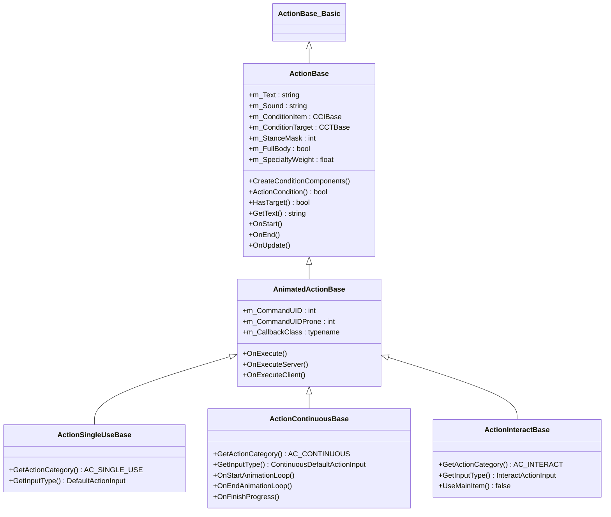
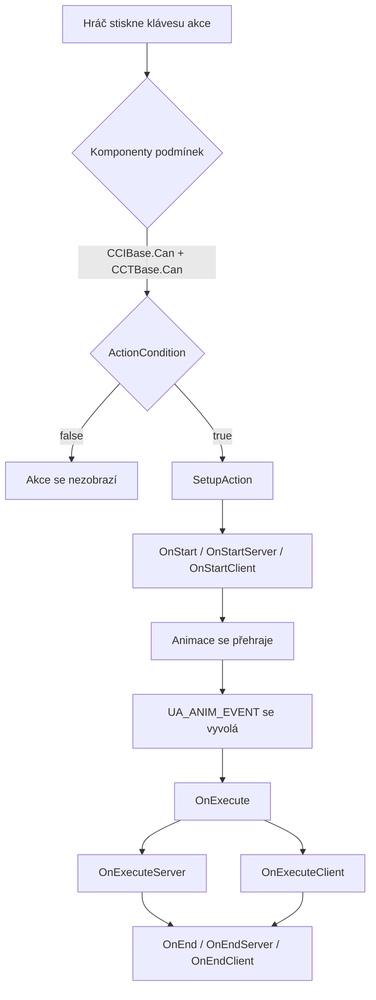
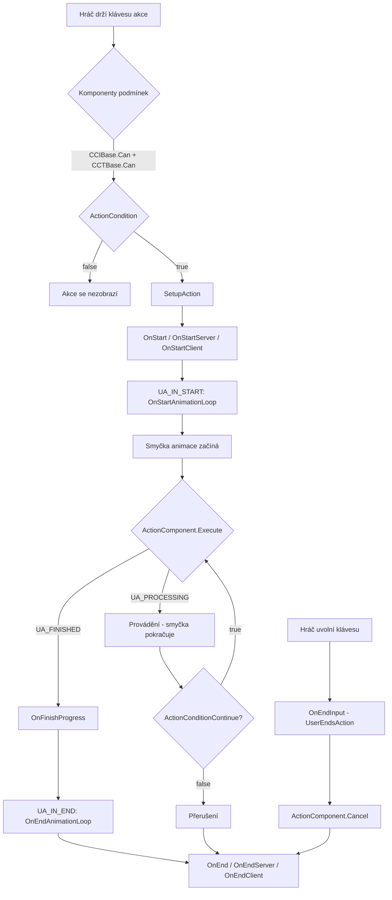
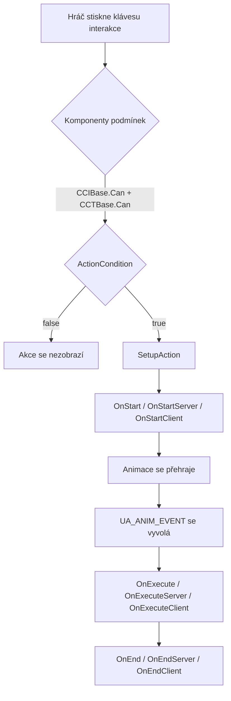

# Kapitola 6.12: Systém akcí

[Domů](../../README.md) | [<< Předchozí: Háčky mise](11-mission-hooks.md) | **Systém akcí** | [Další: Vstupní systém >>](13-input-system.md)

---

## Úvod

Systém akcí je způsob, jakým DayZ zpracovává všechny interakce hráče s předměty a světem. Pokaždé, když hráč sní jídlo, otevře dveře, obváže ránu, opraví zeď nebo zapne baterku, engine projde pipeline akcí. Pochopení tohoto pipeline --- od kontroly podmínek přes callbacky animací po vykonání na serveru --- je zásadní pro vytváření jakéhokoliv interaktivního herního modu.

Systém se nachází primárně v `4_World/classes/useractionscomponent/` a je postaven na třech pilířích:

1. **Třídy akcí**, které definují, co se stane (logika, podmínky, animace)
2. **Komponenty podmínek**, které brání, kdy se akce může objevit (vzdálenost, stav předmětu, typ cíle)
3. **Komponenty akcí**, které řídí, jak akce postupuje (čas, množství, opakující se cykly)

Tato kapitola pokrývá kompletní API, hierarchii tříd, životní cyklus a praktické vzory pro vytváření vlastních akcí.

---

## Hierarchie tříd

```
ActionBase_Basic                         // 3_Game — prázdný shell, kotva kompilace
└── ActionBase                           // 4_World — jádro logiky, podmínky, události
    └── AnimatedActionBase               // 4_World — callbacky animací, OnExecute
        ├── ActionSingleUseBase          // okamžité akce (spolknout pilulku, zapnout světlo)
        ├── ActionContinuousBase         // akce s progress barem (obvázat, opravit, jíst)
        └── ActionInteractBase           // interakce se světem (otevřít dveře, přepnout přepínač)
```



### Klíčové rozdíly mezi typy akcí

| Vlastnost | SingleUse | Continuous | Interact |
|----------|-----------|------------|----------|
| Konstanta kategorie | `AC_SINGLE_USE` | `AC_CONTINUOUS` | `AC_INTERACT` |
| Typ vstupu | `DefaultActionInput` | `ContinuousDefaultActionInput` | `InteractActionInput` |
| Progress bar | Ne | Ano | Ne |
| Používá hlavní předmět | Ano | Ano | Ne (výchozí) |
| Má cíl | Záleží | Záleží | Ano (výchozí) |
| Typické použití | Spolknout pilulku, přepnout baterku | Obvázat, opravit, jíst jídlo | Otevřít dveře, zapnout generátor |
| Třída callbacku | `ActionSingleUseBaseCB` | `ActionContinuousBaseCB` | `ActionInteractBaseCB` |

---

## Životní cyklus akce

### Konstanty stavů

Stavový automat akce používá tyto konstanty definované v `3_Game/constants.c`:

| Konstanta | Hodnota | Význam |
|----------|-------|---------|
| `UA_NONE` | 0 | Žádná akce neběží |
| `UA_PROCESSING` | 2 | Akce probíhá |
| `UA_FINISHED` | 4 | Akce úspěšně dokončena |
| `UA_CANCEL` | 5 | Akce zrušena hráčem |
| `UA_INTERRUPT` | 6 | Akce přerušena externě |
| `UA_INITIALIZE` | 12 | Kontinuální akce se inicializuje |
| `UA_ERROR` | 24 | Chybový stav --- akce přerušena |
| `UA_ANIM_EVENT` | 11 | Vyvolána událost vykonání animace |
| `UA_IN_START` | 17 | Událost začátku smyčky animace |
| `UA_IN_END` | 18 | Událost konce smyčky animace |

### Tok akce SingleUse



### Tok kontinuální akce



### Tok interaktivní akce



### Reference metod životního cyklu

Tyto metody jsou volány v pořadí během životnosti akce. Přepište je ve svých vlastních akcích:

| Metoda | Volá se na | Účel |
|--------|-----------|---------|
| `CreateConditionComponents()` | Obou | Nastavit `m_ConditionItem` a `m_ConditionTarget` |
| `ActionCondition()` | Obou | Vlastní validace (vzdálenost, stav, kontroly typů) |
| `ActionConditionContinue()` | Obou | Pouze kontinuální: přezkoumaná každý snímek během postupu |
| `SetupAction()` | Obou | Interní: sestaví `ActionData`, rezervuje inventář |
| `OnStart()` | Obou | Akce začíná (zruší umísťování, pokud je aktivní) |
| `OnStartServer()` | Server | Logika startu na straně serveru |
| `OnStartClient()` | Klient | Efekty startu na straně klienta |
| `OnExecute()` | Obou | Vyvolána událost animace --- hlavní vykonání |
| `OnExecuteServer()` | Server | Logika vykonání na straně serveru |
| `OnExecuteClient()` | Klient | Efekty vykonání na straně klienta |
| `OnFinishProgress()` | Obou | Pouze kontinuální: jeden cyklus dokončen |
| `OnFinishProgressServer()` | Server | Pouze kontinuální: cyklus dokončen na serveru |
| `OnFinishProgressClient()` | Klient | Pouze kontinuální: cyklus dokončen na klientu |
| `OnStartAnimationLoop()` | Obou | Pouze kontinuální: smyčka animace začíná |
| `OnEndAnimationLoop()` | Obou | Pouze kontinuální: smyčka animace končí |
| `OnEnd()` | Obou | Akce dokončena (úspěch nebo zrušení) |
| `OnEndServer()` | Server | Čištění na straně serveru |
| `OnEndClient()` | Klient | Čištění na straně klienta |

---

## ActionData

Každá běžící akce nese instanci `ActionData`, která drží kontext za běhu. Ta je předávána každé metodě životního cyklu:

```c
class ActionData
{
    ref ActionBase       m_Action;          // třída akce, která se provádí
    ItemBase             m_MainItem;        // předmět v rukou hráče (nebo null)
    ActionBaseCB         m_Callback;        // handler callbacku animace
    ref CABase           m_ActionComponent;  // komponenta postupu (čas, množství)
    int                  m_State;           // aktuální stav (UA_PROCESSING atd.)
    ref ActionTarget     m_Target;          // cílový objekt + informace o zásahu
    PlayerBase           m_Player;          // hráč provádějící akci
    bool                 m_WasExecuted;     // true po vyvolání OnExecute
    bool                 m_WasActionStarted; // true po startu smyčky akce
}
```

Můžete rozšířit `ActionData` pro vlastní data. Přepište `CreateActionData()` ve své akci:

```c
class MyCustomActionData : ActionData
{
    int m_CustomValue;
}

class MyCustomAction : ActionContinuousBase
{
    override ActionData CreateActionData()
    {
        return new MyCustomActionData;
    }

    override void OnFinishProgressServer(ActionData action_data)
    {
        MyCustomActionData data = MyCustomActionData.Cast(action_data);
        data.m_CustomValue = data.m_CustomValue + 1;
        // ... použít vlastní data
    }
}
```

---

## ActionTarget

Třída `ActionTarget` reprezentuje, na co hráč míří:

**Soubor:** `4_World/classes/useractionscomponent/actiontargets.c`

```c
class ActionTarget
{
    Object GetObject();         // přímý objekt pod kurzorem (nebo proxy potomek)
    Object GetParent();         // rodičovský objekt (pokud je cíl proxy/příslušenství)
    bool   IsProxy();           // true pokud má cíl rodiče
    int    GetComponentIndex(); // index geometrické komponenty (pojmenované selekce)
    float  GetUtility();        // skóre priority
    vector GetCursorHitPos();   // přesná světová pozice zásahu kurzorem
}
```

### Jak se vybírají cíle

Třída `ActionTargets` se spouští každý snímek na klientu a sbírá potenciální cíle:

1. **Raycast** z pozice kamery ve směru kamery (`c_RayDistance`)
2. **Skenování okolí** pro blízké objekty kolem hráče
3. Pro každého kandidáta engine zavolá `GetActions()` na objektu pro nalezení registrovaných akcí
4. Komponenty podmínek každé akce (`CCIBase.Can()`, `CCTBase.Can()`) a `ActionCondition()` jsou otestovány
5. Platné akce jsou seřazeny podle užitku a zobrazeny v HUD

---

## Komponenty podmínek

Každá akce má dvě komponenty podmínek nastavené v `CreateConditionComponents()`. Ty jsou kontrolovány **před** `ActionCondition()` a určují, zda se akce může vůbec objevit v HUD hráče.

### Podmínky předmětu (CCIBase)

Řídí, zda předmět v ruce hráče kvalifikuje pro tuto akci.

**Soubor:** `4_World/classes/useractionscomponent/itemconditioncomponents/`

| Třída | Chování |
|-------|----------|
| `CCINone` | Vždy projde --- žádný požadavek na předmět |
| `CCIDummy` | Projde, pokud předmět není null (předmět musí existovat) |
| `CCINonRuined` | Projde, pokud předmět existuje A není zničený |
| `CCINotPresent` | Projde, pokud předmět je null (ruce musí být prázdné) |
| `CCINotRuinedAndEmpty` | Projde, pokud předmět existuje, není zničený a není prázdný |

```c
// CCINone — žádný předmět není potřeba, vždy true
class CCINone : CCIBase
{
    override bool Can(PlayerBase player, ItemBase item) { return true; }
    override bool CanContinue(PlayerBase player, ItemBase item) { return true; }
}

// CCINotPresent — ruce musí být prázdné
class CCINotPresent : CCIBase
{
    override bool Can(PlayerBase player, ItemBase item) { return !item; }
}

// CCINonRuined — předmět musí existovat a nesmí být zničený
class CCINonRuined : CCIBase
{
    override bool Can(PlayerBase player, ItemBase item)
    {
        return (item && !item.IsDamageDestroyed());
    }
}
```

### Podmínky cíle (CCTBase)

Řídí, zda cílový objekt (na co se hráč dívá) kvalifikuje.

**Soubor:** `4_World/classes/useractionscomponent/targetconditionscomponents/`

| Třída | Konstruktor | Chování |
|-------|-------------|----------|
| `CCTNone` | `CCTNone()` | Vždy projde --- žádný cíl není potřeba |
| `CCTDummy` | `CCTDummy()` | Projde, pokud cílový objekt existuje |
| `CCTSelf` | `CCTSelf()` | Projde, pokud hráč existuje a je naživu |
| `CCTObject` | `CCTObject(float dist)` | Cílový objekt v dosahu vzdálenosti |
| `CCTCursor` | `CCTCursor(float dist)` | Pozice zásahu kurzorem v dosahu vzdálenosti |
| `CCTNonRuined` | `CCTNonRuined(float dist)` | Cíl v dosahu vzdálenosti A není zničený |
| `CCTCursorParent` | `CCTCursorParent(float dist)` | Kurzor na rodičovském objektu v dosahu vzdálenosti |

Vzdálenost se měří od **obou** kořenové pozice hráče a pozice kosti hlavy (která je bližší). Kontrola `CCTObject`:

```c
class CCTObject : CCTBase
{
    protected float m_MaximalActionDistanceSq;

    void CCTObject(float maximal_target_distance = UAMaxDistances.DEFAULT)
    {
        m_MaximalActionDistanceSq = maximal_target_distance * maximal_target_distance;
    }

    override bool Can(PlayerBase player, ActionTarget target)
    {
        Object targetObject = target.GetObject();
        if (!targetObject || !player)
            return false;

        vector playerHeadPos;
        MiscGameplayFunctions.GetHeadBonePos(player, playerHeadPos);

        float distanceRoot = vector.DistanceSq(targetObject.GetPosition(), player.GetPosition());
        float distanceHead = vector.DistanceSq(targetObject.GetPosition(), playerHeadPos);

        return (distanceRoot <= m_MaximalActionDistanceSq || distanceHead <= m_MaximalActionDistanceSq);
    }
}
```

### Konstanty vzdáleností

**Soubor:** `4_World/classes/useractionscomponent/actions/actionconstants.c`

| Konstanta | Hodnota (metry) | Typické použití |
|----------|---------------|-------------|
| `UAMaxDistances.SMALL` | 1.3 | Blízké interakce, žebříky |
| `UAMaxDistances.DEFAULT` | 2.0 | Standardní akce |
| `UAMaxDistances.REPAIR` | 3.0 | Opravné akce |
| `UAMaxDistances.LARGE` | 8.0 | Akce na velkou vzdálenost |
| `UAMaxDistances.BASEBUILDING` | 20.0 | Stavění základny |
| `UAMaxDistances.EXPLOSIVE_REMOTE_ACTIVATION` | 100.0 | Dálkové odpálení |

---

## Registrace akcí na předmětech

Akce se registrují na entitách přes vzor `SetActions()` / `AddAction()` / `RemoveAction()`. Engine volá `GetActions()` na entitě pro získání jejího seznamu akcí; poprvé, kdy k tomu dojde, `InitializeActions()` sestaví mapu přes `SetActions()`.

### Na ItemBase (předměty inventáře)

Nejběžnější vzor. Přepište `SetActions()` v `modded class`:

```c
modded class MyCustomItem extends ItemBase
{
    override void SetActions()
    {
        super.SetActions();          // KRITICKÉ: zachovat všechny vanilla akce
        AddAction(MyCustomAction);   // přidat vaši akci
    }
}
```

Pro odstranění vanilla akce a přidání vlastní náhrady:

```c
modded class Bandage_Basic extends ItemBase
{
    override void SetActions()
    {
        super.SetActions();
        RemoveAction(ActionBandageTarget);       // odstranit vanilla
        AddAction(MyImprovedBandageAction);      // přidat náhradu
    }
}
```

### Na BuildingBase (budovy světa)

Budovy používají stejný vzor, ale přes `BuildingBase`:

```c
// Vanilla příklad: Studna registruje akce s vodou
class Well extends BuildingSuper
{
    override void SetActions()
    {
        super.SetActions();
        AddAction(ActionWashHandsWell);
        AddAction(ActionDrinkWellContinuous);
    }
}
```

### Na PlayerBase (akce hráče)

Akce na úrovni hráče (pití z kaluží, otevírání dveří atd.) jsou registrovány v `PlayerBase.SetActions()`. Existují dvě signatury:

```c
// Moderní přístup (doporučený) — používá parametr InputActionMap
void SetActions(out TInputActionMap InputActionMap)
{
    AddAction(ActionOpenDoors, InputActionMap);
    AddAction(ActionCloseDoors, InputActionMap);
    // ...
}

// Starší přístup (zpětná kompatibilita) — nedoporučený
void SetActions()
{
    // ...
}
```

Hráč má také `SetActionsRemoteTarget()` pro akce prováděné **na** hráči jiným hráčem (CPR, kontrola pulzu atd.):

```c
void SetActionsRemoteTarget(out TInputActionMap InputActionMap)
{
    AddAction(ActionCPR, InputActionMap);
    AddAction(ActionCheckPulseTarget, InputActionMap);
}
```

### Jak registrační systém funguje interně

Každý typ entity udržuje statickou `TInputActionMap` (`map<typename, ref array<ActionBase_Basic>>`) klíčovanou typem vstupu. Když se zavolá `AddAction()`:

1. Singleton akce je načten z `ActionManagerBase.GetAction()`
2. Typ vstupu akce je dotázán (`GetInputType()`)
3. Akce je vložena do pole pro daný typ vstupu
4. Za běhu engine dotazuje všechny akce pro odpovídající typ vstupu

To znamená, že akce jsou sdíleny podle **typu** (třídy), ne podle instance. Všechny předměty stejné třídy sdílejí stejný seznam akcí.

---

## Vytvoření vlastní akce --- krok za krokem

### Příklad 1: Jednoduchá jednorázová akce

Vlastní akce, která okamžitě vyléčí hráče, když použije speciální předmět:

```c
// Soubor: 4_World/actions/ActionHealInstant.c

class ActionHealInstant : ActionSingleUseBase
{
    void ActionHealInstant()
    {
        m_CommandUID = DayZPlayerConstants.CMD_ACTIONMOD_EAT_PILL;
        m_CommandUIDProne = DayZPlayerConstants.CMD_ACTIONFB_EAT_PILL;
        m_Text = "#heal";  // klíč stringtable, nebo prostý text: "Heal"
    }

    override void CreateConditionComponents()
    {
        m_ConditionItem = new CCINonRuined;    // předmět nesmí být zničený
        m_ConditionTarget = new CCTSelf;       // akce na sebe
    }

    override bool HasTarget()
    {
        return false;  // žádný externí cíl není potřeba
    }

    override bool HasProneException()
    {
        return true;  // povolit jinou animaci vleže
    }

    override bool ActionCondition(PlayerBase player, ActionTarget target, ItemBase item)
    {
        // Zobrazit pouze pokud je hráč skutečně zraněný
        if (player.GetHealth("GlobalHealth", "Health") >= player.GetMaxHealth("GlobalHealth", "Health"))
            return false;

        return true;
    }

    override void OnExecuteServer(ActionData action_data)
    {
        // Vyléčit hráče na serveru
        PlayerBase player = action_data.m_Player;
        player.SetHealth("GlobalHealth", "Health", player.GetMaxHealth("GlobalHealth", "Health"));

        // Spotřebovat předmět (snížit množství o 1)
        ItemBase item = action_data.m_MainItem;
        if (item)
        {
            item.AddQuantity(-1);
        }
    }

    override void OnExecuteClient(ActionData action_data)
    {
        // Volitelné: přehrát efekt na straně klienta, zvuk nebo notifikaci
    }
}
```

Registrace na předmětu:

```c
// Soubor: 4_World/entities/HealingKit.c

modded class HealingKit extends ItemBase
{
    override void SetActions()
    {
        super.SetActions();
        AddAction(ActionHealInstant);
    }
}
```

### Příklad 2: Kontinuální akce s progress barem

Vlastní opravná akce, která trvá čas a spotřebovává odolnost předmětu:

```c
// Soubor: 4_World/actions/ActionRepairCustom.c

// Krok 1: Definovat callback s komponentou akce
class ActionRepairCustomCB : ActionContinuousBaseCB
{
    override void CreateActionComponent()
    {
        // CAContinuousTime(sekundy) — jednoduchý progress bar, který se dokončí jednou
        m_ActionData.m_ActionComponent = new CAContinuousTime(UATimeSpent.DEFAULT_REPAIR_CYCLE);
    }
}

// Krok 2: Definovat akci
class ActionRepairCustom : ActionContinuousBase
{
    void ActionRepairCustom()
    {
        m_CallbackClass = ActionRepairCustomCB;
        m_CommandUID = DayZPlayerConstants.CMD_ACTIONFB_ASSEMBLE;
        m_FullBody = true;  // celotelová animace (hráč se nemůže hýbat)
        m_StanceMask = DayZPlayerConstants.STANCEMASK_ERECT;
        m_SpecialtyWeight = UASoftSkillsWeight.ROUGH_HIGH;
        m_Text = "#repair";
    }

    override void CreateConditionComponents()
    {
        m_ConditionItem = new CCINonRuined;
        m_ConditionTarget = new CCTObject(UAMaxDistances.REPAIR);
    }

    override bool ActionCondition(PlayerBase player, ActionTarget target, ItemBase item)
    {
        Object obj = target.GetObject();
        if (!obj)
            return false;

        // Povolit opravu pouze poškozených (ale ne zničených) objektů
        EntityAI entity = EntityAI.Cast(obj);
        if (!entity)
            return false;

        float health = entity.GetHealth("", "Health");
        float maxHealth = entity.GetMaxHealth("", "Health");

        // Musí být poškozený, ale ne zničený
        if (health >= maxHealth || entity.IsDamageDestroyed())
            return false;

        return true;
    }

    override void OnFinishProgressServer(ActionData action_data)
    {
        // Volá se, když se progress bar dokončí
        Object target = action_data.m_Target.GetObject();
        if (target)
        {
            EntityAI entity = EntityAI.Cast(target);
            if (entity)
            {
                // Obnovit trochu zdraví
                float currentHealth = entity.GetHealth("", "Health");
                entity.SetHealth("", "Health", currentHealth + 25);
            }
        }

        // Poškodit nástroj
        action_data.m_MainItem.DecreaseHealth(UADamageApplied.REPAIR, false);
    }
}
```

### Příklad 3: Interaktivní akce (přepínání objektu světa)

Interaktivní akce pro přepínání vlastního zařízení zapnuto/vypnuto:

```c
// Soubor: 4_World/actions/ActionToggleMyDevice.c

class ActionToggleMyDevice : ActionInteractBase
{
    void ActionToggleMyDevice()
    {
        m_CommandUID = DayZPlayerConstants.CMD_ACTIONMOD_INTERACTONCE;
        m_StanceMask = DayZPlayerConstants.STANCEMASK_CROUCH | DayZPlayerConstants.STANCEMASK_ERECT;
        m_Text = "#switch_on";
    }

    override void CreateConditionComponents()
    {
        m_ConditionItem = new CCINone;     // žádný předmět v ruce není potřeba
        m_ConditionTarget = new CCTCursor(UAMaxDistances.DEFAULT);
    }

    override bool ActionCondition(PlayerBase player, ActionTarget target, ItemBase item)
    {
        Object obj = target.GetObject();
        if (!obj)
            return false;

        // Zkontrolovat, zda je cíl náš vlastní typ zařízení
        MyCustomDevice device = MyCustomDevice.Cast(obj);
        if (!device)
            return false;

        // Aktualizovat zobrazovaný text podle aktuálního stavu
        if (device.IsActive())
            m_Text = "#switch_off";
        else
            m_Text = "#switch_on";

        return true;
    }

    override void OnExecuteServer(ActionData action_data)
    {
        MyCustomDevice device = MyCustomDevice.Cast(action_data.m_Target.GetObject());
        if (device)
        {
            if (device.IsActive())
                device.Deactivate();
            else
                device.Activate();
        }
    }
}
```

Registrace na budově/zařízení:

```c
class MyCustomDevice extends BuildingBase
{
    override void SetActions()
    {
        super.SetActions();
        AddAction(ActionToggleMyDevice);
    }
}
```

### Příklad 4: Akce s požadavkem na specifický předmět

Akce, která vyžaduje, aby hráč držel specifický typ nástroje při mířením na specifický objekt:

```c
class ActionUnlockWithKey : ActionInteractBase
{
    void ActionUnlockWithKey()
    {
        m_CommandUID = DayZPlayerConstants.CMD_ACTIONMOD_INTERACTONCE;
        m_Text = "Unlock";
    }

    override void CreateConditionComponents()
    {
        m_ConditionItem = new CCINonRuined;   // musí držet nezničený předmět
        m_ConditionTarget = new CCTObject(UAMaxDistances.DEFAULT);
    }

    override bool UseMainItem()
    {
        return true;  // akce vyžaduje předmět v ruce
    }

    override bool MainItemAlwaysInHands()
    {
        return true;  // předmět musí být v rukou, ne jen v inventáři
    }

    override bool ActionCondition(PlayerBase player, ActionTarget target, ItemBase item)
    {
        // Předmět musí být klíč
        if (!item || !item.IsInherited(MyKeyItem))
            return false;

        // Cíl musí být zamčený kontejner
        MyLockedContainer container = MyLockedContainer.Cast(target.GetObject());
        if (!container || !container.IsLocked())
            return false;

        return true;
    }

    override void OnExecuteServer(ActionData action_data)
    {
        MyLockedContainer container = MyLockedContainer.Cast(action_data.m_Target.GetObject());
        if (container)
        {
            container.Unlock();
        }
    }
}
```

---

## Komponenty akcí (řízení postupu)

Komponenty akcí řídí _jak_ akce postupuje v čase. Vytvářejí se v metodě `CreateActionComponent()` callbacku.

**Soubor:** `4_World/classes/useractionscomponent/actioncomponents/`

### Dostupné komponenty

| Komponenta | Parametry | Chování |
|-----------|------------|----------|
| `CASingleUse` | žádné | Okamžité vykonání, žádný postup |
| `CAInteract` | žádné | Okamžité vykonání pro interaktivní akce |
| `CAContinuousTime` | `float time` | Progress bar, dokončí se po `time` sekundách |
| `CAContinuousRepeat` | `float time` | Opakující se cykly, vyvolá `OnFinishProgress` každý cyklus |
| `CAContinuousQuantity` | `float quantity, float time` | Spotřebovává množství v čase |
| `CAContinuousQuantityEdible` | `float quantity, float time` | Jako Quantity, ale aplikuje modifikátory jídla/pití |

### CAContinuousTime

Jednoduchý progress bar, který se dokončí jednou:

```c
class MyActionCB : ActionContinuousBaseCB
{
    override void CreateActionComponent()
    {
        // 5sekundový progress bar
        m_ActionData.m_ActionComponent = new CAContinuousTime(UATimeSpent.DEFAULT_CONSTRUCT);
    }
}
```

### CAContinuousRepeat

Opakující se cykly --- `OnFinishProgressServer()` je volán pokaždé, když se cyklus dokončí, a akce pokračuje, dokud hráč neuvolní klávesu:

```c
class MyRepeatActionCB : ActionContinuousBaseCB
{
    override void CreateActionComponent()
    {
        // Každý cyklus trvá 5 sekund, opakuje se, dokud hráč nepřestane
        m_ActionData.m_ActionComponent = new CAContinuousRepeat(UATimeSpent.DEFAULT_REPAIR_CYCLE);
    }
}
```

### Časové konstanty

**Soubor:** `4_World/classes/useractionscomponent/actions/actionconstants.c`

| Konstanta | Hodnota (sekundy) | Použití |
|----------|----------------|-----|
| `UATimeSpent.DEFAULT` | 1.0 | Obecné |
| `UATimeSpent.DEFAULT_CONSTRUCT` | 5.0 | Stavění |
| `UATimeSpent.DEFAULT_REPAIR_CYCLE` | 5.0 | Oprava za cyklus |
| `UATimeSpent.DEFAULT_DEPLOY` | 5.0 | Rozmisťování předmětů |
| `UATimeSpent.BANDAGE` | 4.0 | Obvazování |
| `UATimeSpent.RESTRAIN` | 10.0 | Spoutání |
| `UATimeSpent.SHAVE` | 12.75 | Holení |
| `UATimeSpent.SKIN` | 10.0 | Stahování zvířat |
| `UATimeSpent.DIG_STASH` | 10.0 | Kopání úkrytu |

---

## Anotované vanilla příklady

### ActionOpenDoors (interaktivní)

**Soubor:** `4_World/classes/useractionscomponent/actions/interact/actionopendoors.c`

```c
class ActionOpenDoors : ActionInteractBase
{
    void ActionOpenDoors()
    {
        m_CommandUID  = DayZPlayerConstants.CMD_ACTIONMOD_OPENDOORFW;
        m_StanceMask  = DayZPlayerConstants.STANCEMASK_CROUCH | DayZPlayerConstants.STANCEMASK_ERECT;
        m_Text        = "#open";   // reference na stringtable
    }

    override void CreateConditionComponents()
    {
        m_ConditionItem   = new CCINone();      // žádný předmět není potřeba
        m_ConditionTarget = new CCTCursor();     // kurzor musí být na něčem
    }

    override bool ActionCondition(PlayerBase player, ActionTarget target, ItemBase item)
    {
        if (!target)
            return false;

        Building building;
        if (Class.CastTo(building, target.GetObject()))
        {
            int doorIndex = building.GetDoorIndex(target.GetComponentIndex());
            if (doorIndex != -1)
            {
                if (!IsInReach(player, target, UAMaxDistances.DEFAULT))
                    return false;
                return building.CanDoorBeOpened(doorIndex, true);
            }
        }
        return false;
    }

    override void OnStartServer(ActionData action_data)
    {
        super.OnStartServer(action_data);
        Building building;
        if (Class.CastTo(building, action_data.m_Target.GetObject()))
        {
            int doorIndex = building.GetDoorIndex(action_data.m_Target.GetComponentIndex());
            if (doorIndex != -1 && building.CanDoorBeOpened(doorIndex, true))
                building.OpenDoor(doorIndex);
        }
    }
}
```

Klíčové poznatky:
- Používá `OnStartServer()` (ne `OnExecuteServer()`), protože interaktivní akce se vyvolají okamžitě
- `GetComponentIndex()` získává, na které dveře se hráč dívá
- Kontrola vzdálenosti provedena ručně pomocí `IsInReach()` i přes `CCTCursor`

### ActionTurnOnPowerGenerator (interaktivní)

**Soubor:** `4_World/classes/useractionscomponent/actions/interact/actionturnonpowergenerator.c`

```c
class ActionTurnOnPowerGenerator : ActionInteractBase
{
    void ActionTurnOnPowerGenerator()
    {
        m_CommandUID = DayZPlayerConstants.CMD_ACTIONMOD_INTERACTONCE;
        m_Text = "#switch_on";
    }

    override bool ActionCondition(PlayerBase player, ActionTarget target, ItemBase item)
    {
        PowerGeneratorBase pg = PowerGeneratorBase.Cast(target.GetObject());
        if (pg)
        {
            return pg.HasEnergyManager()
                && pg.GetCompEM().CanSwitchOn()
                && pg.HasSparkplug()
                && pg.GetCompEM().CanWork();
        }
        return false;
    }

    override void OnExecuteServer(ActionData action_data)
    {
        ItemBase target_IB = ItemBase.Cast(action_data.m_Target.GetObject());
        if (target_IB)
        {
            target_IB.GetCompEM().SwitchOn();
            target_IB.GetCompEM().InteractBranch(target_IB);
        }
    }
}
```

Klíčové poznatky:
- Dědí výchozí `CreateConditionComponents()` z `ActionInteractBase` (`CCINone` + `CCTObject(DEFAULT)`)
- Používá `OnExecuteServer()` pro skutečné přepnutí --- to se vyvolá při události animace
- Více kontrol podmínek řetězených v `ActionCondition()`

### ActionEat (kontinuální)

**Soubor:** `4_World/classes/useractionscomponent/actions/continuous/actioneat.c`

```c
class ActionEatBigCB : ActionContinuousBaseCB
{
    override void CreateActionComponent()
    {
        m_ActionData.m_ActionComponent = new CAContinuousQuantityEdible(
            UAQuantityConsumed.EAT_BIG,   // 25 jednotek spotřebovaných za cyklus
            UATimeSpent.DEFAULT            // 1 sekunda za cyklus
        );
    }
}

class ActionEatBig : ActionConsume
{
    void ActionEatBig()
    {
        m_CallbackClass = ActionEatBigCB;
        m_Text = "#eat";
    }

    override void CreateConditionComponents()
    {
        m_ConditionItem = new CCINonRuined;
        m_ConditionTarget = new CCTSelf;
    }

    override bool HasTarget()
    {
        return false;
    }
}
```

Klíčové poznatky:
- Třída callbacku řídí tempo (`CAContinuousQuantityEdible`)
- `ActionConsume` (rodič) zpracovává veškerou logiku konzumace jídla
- `HasTarget()` vrací false --- jedení je akce na sebe
- Různé velikosti jídla pouze vyměňují třídu callbacku s různými hodnotami `UAQuantityConsumed`

---

## Pokročilá témata

### Masky podmínek akcí

Akce mohou být omezeny na specifické stavy hráče pomocí `ActionConditionMask`:

```c
enum ActionConditionMask
{
    ACM_NO_EXEPTION    = 0,     // žádné speciální podmínky
    ACM_IN_VEHICLE     = 1,     // lze použít ve vozidle
    ACM_ON_LADDER      = 2,     // lze použít na žebříku
    ACM_SWIMMING       = 4,     // lze použít při plavání
    ACM_RESTRAIN       = 8,     // lze použít při spoutání
    ACM_RAISED         = 16,    // lze použít se zdviženou zbraní
    ACM_ON_BACK        = 32,    // lze použít na zádech
    ACM_THROWING       = 64,    // lze použít při házení
    ACM_LEANING        = 128,   // lze použít při naklonění
    ACM_BROKEN_LEGS    = 256,   // lze použít se zlomenými nohami
    ACM_IN_FREELOOK    = 512,   // lze použít ve volném pohledu
}
```

Přepište odpovídající metody ve své akci pro povolení:

```c
class MyVehicleAction : ActionSingleUseBase
{
    override bool CanBeUsedInVehicle()  { return true; }
    override bool CanBeUsedSwimming()   { return false; }
    override bool CanBeUsedOnLadder()   { return false; }
    override bool CanBeUsedInRestrain() { return false; }
}
```

### Celotelové vs aditivní animace

Akce mohou být **aditivní** (hráč se může pohybovat) nebo **celotelové** (hráč je zafixován na místě):

```c
class MyFullBodyAction : ActionContinuousBase
{
    void MyFullBodyAction()
    {
        m_FullBody = true;   // hráč se nemůže hýbat během akce
        m_CommandUID = DayZPlayerConstants.CMD_ACTIONFB_ASSEMBLE;
        m_StanceMask = DayZPlayerConstants.STANCEMASK_ERECT;
    }
}
```

- **Aditivní** (`m_FullBody = false`): Používá `CMD_ACTIONMOD_*` command UID. Hráč se může pohybovat.
- **Celotelová** (`m_FullBody = true`): Používá `CMD_ACTIONFB_*` command UID. Hráč je stacionární.

### Výjimka pro ležení

Některé akce potřebují jiné animace vleže oproti stání:

```c
override bool HasProneException()
{
    return true;  // používá m_CommandUIDProne, když je hráč vleže
}
```

Když `HasProneException()` vrací true, engine používá `m_CommandUIDProne` místo `m_CommandUID`, pokud je hráč v poloze vleže.

### Přerušení akce

Akce mohou být přerušeny na straně serveru přes callback:

```c
override void OnFinishProgressServer(ActionData action_data)
{
    // Zkontrolovat, zda by měla být akce přerušena
    if (SomeConditionFailed())
    {
        if (action_data.m_Callback)
            action_data.m_Callback.Interrupt();
        return;
    }

    // Normální vykonání...
}
```

### Vykonání z inventáře a quickbaru

Akce mohou být nakonfigurovány pro spuštění z obrazovky inventáře nebo quickbaru:

```c
override bool CanBePerformedFromInventory()
{
    return true;   // akce se objeví v kontextovém menu předmětu v inventáři
}

override bool CanBePerformedFromQuickbar()
{
    return true;   // akce může být spuštěna přes quickbar
}
```

### Uzamčení cíle při použití

Ve výchozím nastavení akce s cíli uzamknou cíl, takže s ním může interagovat pouze jeden hráč:

```c
override bool IsLockTargetOnUse()
{
    return false;  // povolit více hráčům interagovat současně
}
```

---

## Konstanty kategorií akcí

**Soubor:** `4_World/classes/useractionscomponent/_constants.c`

| Konstanta | Hodnota | Popis |
|----------|-------|-------------|
| `AC_UNCATEGORIZED` | 0 | Výchozí --- nemělo by se používat |
| `AC_SINGLE_USE` | 1 | Jednorázové akce |
| `AC_CONTINUOUS` | 2 | Kontinuální (s progress barem) akce |
| `AC_INTERACT` | 3 | Interaktivní akce |

---

## Časté chyby

### 1. Zapomenutí `super.SetActions()`

**Špatně:**
```c
modded class Apple extends ItemBase
{
    override void SetActions()
    {
        // Chybí super.SetActions()!
        AddAction(MyCustomEatAction);
    }
}
```

Toto **odstraní všechny vanilla akce** z předmětu. Hráč už nebude moci jíst, zahodit nebo jinak interagovat s jablky přes standardní akce.

**Správně:**
```c
modded class Apple extends ItemBase
{
    override void SetActions()
    {
        super.SetActions();          // zachovat vanilla akce
        AddAction(MyCustomEatAction);
    }
}
```

### 2. Umístění serverové logiky do OnExecuteClient

**Špatně:**
```c
override void OnExecuteClient(ActionData action_data)
{
    action_data.m_Player.SetHealth("GlobalHealth", "Health", 100);  // ŽÁDNÝ EFEKT
    action_data.m_MainItem.Delete();  // pouze na straně klienta, způsobí desync
}
```

Změny zdraví a inventářové operace se musí odehrávat na serveru. `OnExecuteClient` je pouze pro vizuální zpětnou vazbu (zvuky, částicové efekty, aktualizace UI).

**Správně:**
```c
override void OnExecuteServer(ActionData action_data)
{
    action_data.m_Player.SetHealth("GlobalHealth", "Health", 100);
    action_data.m_MainItem.Delete();
}

override void OnExecuteClient(ActionData action_data)
{
    // Pouze vizuální zpětná vazba
}
```

### 3. Nekontrolování null v ActionCondition

**Špatně:**
```c
override bool ActionCondition(PlayerBase player, ActionTarget target, ItemBase item)
{
    return target.GetObject().IsInherited(MyClass);  // PÁD pokud je target nebo objekt null
}
```

**Správně:**
```c
override bool ActionCondition(PlayerBase player, ActionTarget target, ItemBase item)
{
    if (!target)
        return false;

    Object obj = target.GetObject();
    if (!obj)
        return false;

    return obj.IsInherited(MyClass);
}
```

### 4. Špatné komponenty podmínek (akce se nikdy neobjeví)

**Problém:** Akce se nezobrazí v HUD.

Běžné příčiny:
- `CCIDummy` vyžaduje předmět v ruce, ale akce by měla fungovat s prázdnými rukama --- použijte místo toho `CCINone`
- `CCTDummy` vyžaduje cílový objekt, ale akce je akce na sebe --- použijte `CCTSelf` nebo `CCTNone`
- Vzdálenost `CCTObject` příliš malá pro typ cíle --- zvyšte parametr vzdálenosti
- `HasTarget()` vrací true, ale neexistuje platná podmínka cíle --- buď přidejte `CCTCursor`/`CCTObject`, nebo nastavte `HasTarget()` na false

### 5. Záměna OnStart a OnExecute

- `OnStart` / `OnStartServer`: Volá se, když akce **začíná** (animace startuje). Použijte pro nastavení, rezervaci předmětů.
- `OnExecute` / `OnExecuteServer`: Volá se, když se **vyvolá událost animace** (okamžik "provedení"). Použijte pro skutečný efekt.

Pro interaktivní akce se běžně používá `OnStartServer`, protože akce je okamžitá. Pro jednorázové akce se `OnExecuteServer` vyvolá při události animace. Vyberte správnou metodu podle toho, kdy potřebujete, aby efekt nastal.

### 6. Kontinuální akce se neopakuje

Pokud se vaše kontinuální akce dokončí jednou a zastaví se místo opakování, používáte `CAContinuousTime` (jedno dokončení). Přepněte na `CAContinuousRepeat` pro opakující se cykly:

```c
// Jedno dokončení — progress bar se naplní jednou, pak akce skončí
m_ActionData.m_ActionComponent = new CAContinuousTime(5.0);

// Opakování — progress bar se naplní, vyvolá OnFinishProgress, resetuje se, pokračuje
m_ActionData.m_ActionComponent = new CAContinuousRepeat(5.0);
```

### 7. Akce se zobrazuje na špatných předmětech

Pamatujte: `SetActions()` se volá podle **typu třídy**, ne podle instance. Pokud přidáte akci v rodičovské třídě, všechny potomky ji zdědí. Pokud chcete akci pouze na specifických podtřídách, buď:
- Přidejte ji pouze v `SetActions()` specifické podtřídy
- Přidejte kontrolu typu v `ActionCondition()` jako ochranu

### 8. Zapomenutí přepsání HasTarget()

Pokud je vaše akce akce na sebe (jedení, léčení, přepínání drženého předmětu), musíte přepsat:

```c
override bool HasTarget()
{
    return false;
}
```

Bez toho engine očekává cílový objekt a nemusí akci zobrazit, nebo se pokusí synchronizovat neexistující cíl na server.

---

## Rychlá reference umístění souborů

| Soubor | Účel |
|------|---------|
| `4_World/classes/useractionscomponent/actionbase.c` | `ActionBase` --- jádro třídy akce |
| `4_World/classes/useractionscomponent/animatedactionbase.c` | `AnimatedActionBase` + `ActionBaseCB` |
| `4_World/classes/useractionscomponent/actions/actionsingleusebase.c` | `ActionSingleUseBase` |
| `4_World/classes/useractionscomponent/actions/actioncontinuousbase.c` | `ActionContinuousBase` |
| `4_World/classes/useractionscomponent/actions/actioninteractbase.c` | `ActionInteractBase` |
| `4_World/classes/useractionscomponent/actions/actionconstants.c` | `UATimeSpent`, `UAMaxDistances`, `UAQuantityConsumed` |
| `4_World/classes/useractionscomponent/_constants.c` | `AC_SINGLE_USE`, `AC_CONTINUOUS`, `AC_INTERACT` |
| `4_World/classes/useractionscomponent/actiontargets.c` | `ActionTarget`, `ActionTargets` |
| `4_World/classes/useractionscomponent/itemconditioncomponents/` | Třídy `CCI*` |
| `4_World/classes/useractionscomponent/targetconditionscomponents/` | Třídy `CCT*` |
| `4_World/classes/useractionscomponent/actioncomponents/` | Komponenty postupu `CA*` |
| `3_Game/constants.c` | `UA_NONE`, `UA_PROCESSING`, `UA_FINISHED` atd. |

---

## Shrnutí

Systém akcí DayZ sleduje konzistentní vzor:

1. **Vyberte si základní třídu**: `ActionSingleUseBase` pro okamžité, `ActionContinuousBase` pro časované, `ActionInteractBase` pro přepínání ve světě
2. **Nastavte komponenty podmínek** v `CreateConditionComponents()`: CCI pro požadavky na předmět, CCT pro požadavky na cíl
3. **Přidejte vlastní validaci** v `ActionCondition()`: kontroly typu, stavu, vzdálenosti
4. **Implementujte serverovou logiku** v `OnExecuteServer()` nebo `OnFinishProgressServer()`
5. **Zaregistrujte akci** přes `AddAction()` v `SetActions()` příslušné entity
6. **Vždy volejte `super.SetActions()`** pro zachování vanilla akcí

Systém je navržen jako modulární: komponenty podmínek zpracovávají "může se to stát?", komponenty akcí zpracovávají "jak dlouho to trvá?", a vaše přepsání zpracovávají "co to dělá?". Udržujte serverovou logiku na serveru, vizuální zpětnou vazbu na klientu a vždy kontrolujte null u svých cílů.

---

## Doporučené postupy

- **Vždy volejte `super.SetActions()` při modování existujících předmětů.** Vynechání odstraní všechny vanilla akce (jíst, zahodit, prozkoumat) z předmětu, čímž naruší základní hratelnost.
- **Umístěte veškerou logiku měnící stav do `OnExecuteServer` nebo `OnFinishProgressServer`.** Změny zdraví, mazání předmětů a manipulace s inventářem se musí provádět na straně serveru. `OnExecuteClient` je pouze pro vizuální zpětnou vazbu.
- **Používejte `CCTObject` s příslušnými konstantami vzdálenosti.** Natvrdo kódovat kontroly vzdálenosti v `ActionCondition()` je křehké. Vestavěné komponenty podmínek zpracovávají brání vzdálenosti, zarovnání kurzoru a kontroly stavu předmětů konzistentně.
- **Kontrolujte null u každého objektu v `ActionCondition()`.** Metoda je volána často s potenciálně nulovými cíli. Přístup k `.GetObject()` bez ochrany způsobuje pády, které se těžko diagnostikují.
- **Preferujte `CAContinuousRepeat` před `CAContinuousTime` pro akce typu opravy.** Repeat vyvolá `OnFinishProgressServer` každý cyklus a pokračuje, dokud hráč neuvolní klávesu, což působí přirozeněji pro probíhající úkoly.

---

## Kompatibilita a dopad

- **Multi-mod:** Akce jsou registrovány podle typu třídy přes `SetActions()`. Dva mody přidávající různé akce ke stejné třídě předmětu oba fungují --- akce se hromadí. Pokud však oba mody přepíší `SetActions()` bez volání `super`, přežijí pouze akce posledně načteného modu.
- **Výkon:** `ActionCondition()` je vyhodnocován každý snímek pro každou kandidátní akci na aktuálním cíli hráče. Udržujte ho lehký --- vyhněte se drahým raycastům, vyhledáváním v konfigu nebo iteracím polí uvnitř kontrol podmínek.
- **Server/klient:** Pipeline akce je rozdělen: kontroly podmínek a zobrazení UI běží na klientu, callbacky vykonání běží na serveru. Engine zpracovává synchronizaci přes interní RPC. Nikdy se nespoléhejte na stav klienta pro autoritativní herní logiku.
