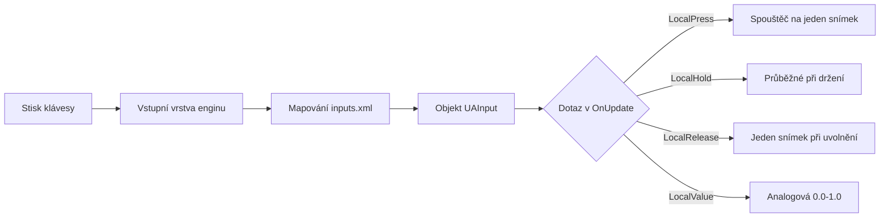

# Kapitola 6.13: Vstupní systém

[Domů](../../README.md) | [<< Předchozí: Systém akcí](12-action-system.md) | **Vstupní systém** | [Další: Systém hráčů >>](14-player-system.md)

---

## Úvod

Vstupní systém DayZ propojuje hardwarové vstupy --- klávesnici, myš a gamepad --- s pojmenovanými akcemi, na které se mohou skripty dotazovat. Pracuje ve dvou vrstvách:

1. **inputs.xml** (konfigurační vrstva) --- deklaruje pojmenované akce, přiřazuje výchozí klávesové zkratky a organizuje je do skupin pro nabídku ovládání v nastavení hráče. Viz [Kapitola 5.2: inputs.xml](../05-config-files/02-inputs-xml.md) pro úplné pokrytí.

2. **UAInput API** (skriptová vrstva) --- dotazuje stav vstupů za běhu. Toto volají vaše skripty každý snímek pro detekci stisknutí, uvolnění, držení a analogových hodnot.

Tato kapitola pokrývá skriptovou vrstvu: třídy, metody a vzory, které používáte pro čtení a ovládání vstupů z Enforce Scriptu.

---

## Základní třídy

Vstupní systém je postaven na třech hlavních třídách:

```
UAInputAPI         Globální singleton (přístupný přes GetUApi())
├── UAInput        Reprezentuje jednu pojmenovanou vstupní akci
└── Input          Nižší úroveň přístupu ke vstupům (přístupná přes GetGame().GetInput())
```

| Třída | Zdrojový soubor | Účel |
|-------|-----------|---------|
| `UAInputAPI` | `3_Game/inputapi/uainput.c` | Globální manažer vstupů. Získává vstupy podle jména/ID, spravuje vyloučení, presety a podsvícení. |
| `UAInput` | `3_Game/inputapi/uainput.c` | Jednotlivá vstupní akce. Poskytuje dotazy na stav (stisknutí, držení, uvolnění) a ovládání (deaktivace, potlačení, uzamčení). |
| `Input` | `3_Game/tools/input.c` | Vstupní třída na úrovni enginu. Dotazy na stav pomocí řetězců, správa zařízení, ovládání herního fokusu. |
| `InputUtils` | `3_Game/tools/inpututils.c` | Statická pomocná třída. Rozlišení názvů/ikon tlačítek pro zobrazení v UI. |

---

## Přístup ke vstupnímu API

### UAInputAPI (doporučeno)

Primární způsob přístupu ke vstupům. `GetUApi()` je globální funkce, která vrací singleton `UAInputAPI`:

```c
// Získání globálního vstupního API
UAInputAPI inputAPI = GetUApi();

// Získání konkrétní vstupní akce podle jména (jak je definováno v inputs.xml)
UAInput input = inputAPI.GetInputByName("UAMyAction");

// Získání konkrétní vstupní akce podle číselného ID
UAInput input = inputAPI.GetInputByID(someID);
```

### Třída Input (alternativa)

Třída `Input` poskytuje dotazy na stav přímo pomocí řetězců, bez nutnosti nejprve získat referenci `UAInput`:

```c
// Získání instance Input
Input input = GetGame().GetInput();

// Dotaz podle řetězce jména akce
if (input.LocalPress("UAMyAction", false))
{
    // Klávesa byla právě stisknuta
}
```

Parametr `bool check_focus` (druhý argument) ovládá, zda kontrola respektuje herní fokus. Předejte `true` (výchozí), aby se vrátilo false, když okno hry nemá fokus. Předejte `false` pro vždy vrácení surového stavu vstupu.

### Kdy použít který

- **`GetUApi().GetInputByName()`** --- Použijte, když potřebujete dotazovat stejný vstup vícekrát, potlačit/deaktivovat ho, nebo prozkoumat jeho vazby. Získáte objekt `UAInput`, který můžete znovu použít.
- **`GetGame().GetInput().LocalPress()`** --- Použijte pro jednorázové kontroly, kde nepotřebujete manipulovat se samotným vstupem. Jednodušší syntaxe, ale mírně méně efektivní pro opakované dotazy.

---

## Čtení stavu vstupu --- Metody UAInput

Jakmile máte referenci `UAInput`, tyto metody dotazují jeho aktuální stav:

```c
UAInput input = GetUApi().GetInputByName("UAMyAction");

// Kontroly přesné na snímek
bool justPressed   = input.LocalPress();        // True v PRVNÍM snímku, kdy klávesa jde dolů
bool justReleased  = input.LocalRelease();       // True v PRVNÍM snímku, kdy klávesa přijde nahoru
bool holdStarted   = input.LocalHoldBegin();     // True v prvním snímku, kdy je dosažen práh držení
bool isHeld        = input.LocalHold();          // True KAŽDÝ snímek, kdy je klávesa držena za prahem
bool clicked       = input.LocalClick();         // True při stisknutí a uvolnění před prahem držení
bool doubleClicked = input.LocalDoubleClick();   // True při detekci dvojitého klepnutí

// Analogová hodnota
float value = input.LocalValue();                // 0.0 nebo 1.0 pro digitální; 0.0-1.0 pro analogové osy
```

---

## Čtení stavu vstupu --- Metody třídy Input

Třída `Input` (z `GetGame().GetInput()`) nabízí ekvivalentní metody založené na řetězcích:

```c
Input input = GetGame().GetInput();

bool pressed  = input.LocalPress("UAMyAction", false);
bool released = input.LocalRelease("UAMyAction", false);
bool held     = input.LocalHold("UAMyAction", false);
bool dblClick = input.LocalDbl("UAMyAction", false);
float value   = input.LocalValue("UAMyAction", false);
```

Všimněte si mírného rozdílu v pojmenování: `LocalDoubleClick()` na `UAInput` vs `LocalDbl()` na `Input`.

Obě třídy také poskytují varianty `_ID`, které přijímají celočíselná ID akcí místo řetězců (např. `LocalPress_ID(int action)`).

---

## Reference metod dotazování vstupů

### Metody UAInput

| Metoda | Vrací | Kdy True | Případ použití |
|--------|---------|-----------|----------|
| `LocalPress()` | `bool` | První snímek, kdy klávesa jde dolů | Přepínací akce, jednorázové spouštěče |
| `LocalRelease()` | `bool` | První snímek, kdy klávesa přijde nahoru | Ukončení průběžných akcí |
| `LocalClick()` | `bool` | Klávesa stisknuta a uvolněna před časovačem držení | Detekce rychlého klepnutí |
| `LocalHoldBegin()` | `bool` | První snímek, kdy je dosažen práh držení | Zahájení akcí založených na držení |
| `LocalHold()` | `bool` | Každý snímek při držení za prahem | Průběžné akce držení |
| `LocalDoubleClick()` | `bool` | Detekováno dvojité klepnutí | Speciální/alternativní akce |
| `LocalValue()` | `float` | Vždy (vrací aktuální hodnotu) | Osy myši, triggery gamepadu, analogový vstup |

### Metody třídy Input

| Metoda | Vrací | Signatura | Ekvivalentní metoda UAInput |
|--------|---------|-----------|--------------------------|
| `LocalPress()` | `bool` | `LocalPress(string action, bool check_focus = true)` | `UAInput.LocalPress()` |
| `LocalRelease()` | `bool` | `LocalRelease(string action, bool check_focus = true)` | `UAInput.LocalRelease()` |
| `LocalHold()` | `bool` | `LocalHold(string action, bool check_focus = true)` | `UAInput.LocalHold()` |
| `LocalDbl()` | `bool` | `LocalDbl(string action, bool check_focus = true)` | `UAInput.LocalDoubleClick()` |
| `LocalValue()` | `float` | `LocalValue(string action, bool check_focus = true)` | `UAInput.LocalValue()` |

### Důležité poznámky k časování

- **`LocalPress()`** se spustí přesně na **jednom snímku** --- snímku, kdy klávesa přejde z uvolněné na stisknutou. Pokud ji zkontrolujete na jakémkoli jiném snímku, vrátí false.
- **`LocalClick()`** se spustí, když je klávesa stisknuta a rychle uvolněna (před tím, než nastoupí časovač držení). NENÍ totéž jako `LocalPress()`. Použijte `LocalPress()` pro okamžitou detekci stisknutí klávesy.
- **`LocalHold()`** se NEspustí okamžitě. Čeká, dokud není splněn práh držení enginu. Použijte `LocalPress()`, pokud potřebujete okamžitou odezvu.
- **`LocalHoldBegin()`** se spustí jednou, když je práh držení poprvé splněn. `LocalHold()` se pak spustí každý následující snímek.

---

## Kontrola vstupů v OnUpdate

Standardní vzor pro dotazování vlastních vstupů je uvnitř `MissionGameplay.OnUpdate()`:

```c
modded class MissionGameplay
{
    override void OnUpdate(float timeslice)
    {
        super.OnUpdate(timeslice);

        // Ochrana: potřebujeme živého hráče
        PlayerBase player = PlayerBase.Cast(GetGame().GetPlayer());
        if (!player)
            return;

        // Ochrana: žádný vstup, když je otevřena nabídka
        if (GetGame().GetUIManager().GetMenu())
            return;

        UAInput myInput = GetUApi().GetInputByName("UAMyModOpenMenu");
        if (myInput && myInput.LocalPress())
        {
            OpenMyModMenu();
        }
    }
}
```

### Použití třídy Input jako alternativy

```c
modded class MissionGameplay
{
    override void OnUpdate(float timeslice)
    {
        super.OnUpdate(timeslice);

        Input input = GetGame().GetInput();

        if (input.LocalPress("UAMyModOpenMenu", false))
        {
            OpenMyModMenu();
        }
    }
}
```

### Kde jinde můžete kontrolovat vstupy?

Vstupy lze technicky kontrolovat v jakémkoli callbacku per-snímek, ale `MissionGameplay.OnUpdate()` je kanonické umístění. Další platná místa zahrnují:

- `PlayerBase.CommandHandler()` --- běží každý snímek pro lokálního hráče
- `ScriptedWidgetEventHandler.Update()` --- pro vstup specifický pro UI (ale preferujte handlery událostí widgetů)
- `PluginBase.OnUpdate()` --- pro vstup v rozsahu pluginu

Vyhněte se kontrole vstupů v serverovém kódu, konstruktorech entit nebo jednorázových handlerech událostí, kde není zaručeno časování snímků.

---

## Alternativa: OnKeyPress a OnKeyRelease

Pro jednoduchou detekci natvrdo zakódovaných kláves `MissionBase` poskytuje callbacky `OnKeyPress()` a `OnKeyRelease()`:

```c
modded class MissionGameplay
{
    override void OnKeyPress(int key)
    {
        super.OnKeyPress(key);

        if (key == KeyCode.KC_F5)
        {
            // F5 byla stisknuta --- nepřemapovatelné!
            ToggleDebugOverlay();
        }
    }

    override void OnKeyRelease(int key)
    {
        super.OnKeyRelease(key);

        if (key == KeyCode.KC_F5)
        {
            // F5 byla uvolněna
        }
    }
}
```

### UAInput vs OnKeyPress: Kdy použít které

| Vlastnost | UAInput (GetUApi) | OnKeyPress |
|---------|-------------------|------------|
| Hráč může přemapovat | Ano | Ne |
| Podpora modifikátorů | Ano (Ctrl+klávesa komba přes inputs.xml) | Vyžaduje manuální kontrolu |
| Podpora gamepadu | Ano | Ne |
| Zobrazuje se v nabídce ovládání | Ano | Ne |
| Analogové hodnoty | Ano | Ne |
| Jednoduchost | Vyžaduje nastavení inputs.xml | Stačí kontrolovat KeyCode |
| Nejlepší pro | Všechny akce pro hráče | Ladicí nástroje, natvrdo zakódované dev zkratky |

**Pravidlo:** Pokud hráč někdy stiskne tuto klávesu, použijte UAInput s inputs.xml. Pouze použijte OnKeyPress pro interní ladicí nástroje nebo prototypové testování.

---

## Reference KeyCode

Enum `KeyCode` je definován v `1_Core/proto/ensystem.c`. Tyto konstanty se používají s `OnKeyPress()`, `OnKeyRelease()`, `KeyState()` a `DisableKey()`.

### Běžně používané klávesy

| Kategorie | Konstanty |
|----------|-----------|
| Escape | `KC_ESCAPE` |
| Funkční klávesy | `KC_F1` až `KC_F12` |
| Řádek čísel | `KC_1`, `KC_2`, `KC_3`, `KC_4`, `KC_5`, `KC_6`, `KC_7`, `KC_8`, `KC_9`, `KC_0` |
| Písmena | `KC_A` až `KC_Z` (např. `KC_Q`, `KC_W`, `KC_E`, `KC_R`, `KC_T`) |
| Modifikátory | `KC_LSHIFT`, `KC_RSHIFT`, `KC_LCONTROL`, `KC_RCONTROL`, `KC_LMENU` (levý Alt), `KC_RMENU` (pravý Alt) |
| Navigace | `KC_UP`, `KC_DOWN`, `KC_LEFT`, `KC_RIGHT` |
| Editace | `KC_SPACE`, `KC_RETURN`, `KC_TAB`, `KC_BACK` (Backspace), `KC_DELETE`, `KC_INSERT` |
| Ovládání stránek | `KC_HOME`, `KC_END`, `KC_PRIOR` (Page Up), `KC_NEXT` (Page Down) |
| Numerická klávesnice | `KC_NUMPAD0` až `KC_NUMPAD9`, `KC_NUMPADENTER`, `KC_ADD`, `KC_SUBTRACT`, `KC_MULTIPLY`, `KC_DIVIDE`, `KC_DECIMAL` |
| Zámky | `KC_CAPITAL` (Caps Lock), `KC_NUMLOCK`, `KC_SCROLL` (Scroll Lock) |
| Interpunkce | `KC_MINUS`, `KC_EQUALS`, `KC_LBRACKET`, `KC_RBRACKET`, `KC_SEMICOLON`, `KC_APOSTROPHE`, `KC_GRAVE`, `KC_BACKSLASH`, `KC_COMMA`, `KC_PERIOD`, `KC_SLASH` |

### Enum MouseState

Pro kontrolu surového stavu tlačítek myši (ne přes systém UAInput):

```c
enum MouseState
{
    LEFT,
    RIGHT,
    MIDDLE,
    X,        // Horizontální osa
    Y,        // Vertikální osa
    WHEEL     // Kolečko myši
};

// Použití:
int state = GetMouseState(MouseState.LEFT);
// Bit 15 (MB_PRESSED_MASK) je nastaven při stisknutí
```

### Nízkoúrovňový stav kláves

```c
// Kontrola surového stavu klávesy (vrací bitovou masku, bit 15 = aktuálně stisknuto)
int state = KeyState(KeyCode.KC_LSHIFT);

// Vyčistění stavu klávesy (zabraňuje auto-opakování do dalšího fyzického stisknutí)
ClearKey(KeyCode.KC_RETURN);

// Deaktivace klávesy pro zbytek tohoto snímku
GetGame().GetInput().DisableKey(KeyCode.KC_RETURN);
```

---

## Potlačení a deaktivace vstupů

### Potlačení (na jeden vstup, jeden snímek)

Zabraňuje spuštění vstupu na dalším snímku. Užitečné při přechodech (zavírání nabídky) pro zabránění jednorámcovému prosakování vstupu:

```c
UAInput input = GetUApi().GetInputByName("UAMyAction");
input.Supress();  // Poznámka: jedno 's' v názvu metody
```

### Potlačení všech vstupů (globální, jeden snímek)

Potlačí VŠECHNY vstupy na další snímek. Zavolejte toto při opouštění nabídek nebo přechodu mezi vstupními kontexty:

```c
GetUApi().SupressNextFrame(true);
```

Toto se běžně používá vanilkou při zavírání hlavní nabídky, aby se zabránilo klávese escape v okamžitém znovuotevření něčeho.

### ForceDisable (na jeden vstup, trvalé)

Kompletně deaktivuje konkrétní vstup, dokud není znovu povolen. Vstup nebude vyvolávat žádné události, dokud je deaktivován:

```c
// Deaktivace, dokud je nabídka otevřena
GetUApi().GetInputByName("UAMyAction").ForceDisable(true);

// Reaktivace po zavření nabídky
GetUApi().GetInputByName("UAMyAction").ForceDisable(false);
```

### Lock / Unlock (na jeden vstup, trvalé)

Podobné jako ForceDisable, ale používá jiný mechanismus. Buďte opatrní --- pokud více systémů zamyká/odemyká stejný vstup, mohou se navzájem rušit:

```c
UAInput input = GetUApi().GetInputByName("UAMyAction");
input.Lock();    // Deaktivovat, dokud se nezavolá Unlock()
input.Unlock();  // Reaktivovat

bool locked = input.IsLocked();  // Kontrola stavu
```

Dokumentace enginu doporučuje pro většinu případů použít exclude skupiny místo Lock/Unlock.

### ForceDisable všech vstupů (hromadně)

Při otevírání celoobrazovkového UI deaktivujte všechny herní vstupy kromě těch, které vaše UI potřebuje. Toto je vzor používaný COT a Expansion:

```c
void DisableAllInputs(bool state)
{
    TIntArray inputIDs = new TIntArray;
    GetUApi().GetActiveInputs(inputIDs);

    // Vstupy, které ponechat aktivní, i když je UI otevřeno
    TIntArray skipIDs = new TIntArray;
    skipIDs.Insert(GetUApi().GetInputByName("UAUIBack").ID());

    foreach (int inputID : inputIDs)
    {
        if (skipIDs.Find(inputID) == -1)
        {
            GetUApi().GetInputByID(inputID).ForceDisable(state);
        }
    }

    GetUApi().UpdateControls();
}
```

**Důležité:** Vždy zavolejte `GetUApi().UpdateControls()` po hromadné úpravě stavů vstupů.

### Exclude skupiny vstupů

Systém misí poskytuje pojmenované exclude skupiny definované v `specific.xml` enginu. Po aktivaci deaktivují kategorie vstupů:

```c
// Potlačení herních vstupů, když je nabídka otevřena
GetGame().GetMission().AddActiveInputExcludes({"menu"});

// Obnovení vstupů při zavření
GetGame().GetMission().RemoveActiveInputExcludes({"menu"}, true);
```

Signatury metod na třídě `Mission`:

```c
void AddActiveInputExcludes(array<string> excludes);
void RemoveActiveInputExcludes(array<string> excludes, bool bForceSupress = false);
void EnableAllInputs(bool bForceSupress = false);
bool IsInputExcludeActive(string exclude);
```

Parametr `bForceSupress` na `RemoveActiveInputExcludes` interně volá `SupressNextFrame` pro zabránění prosakování vstupu při reaktivaci.

Expansion používá vlastní exclude skupinu registrovanou u enginu:

```c
GetUApi().ActivateExclude("menuexpansion");
GetUApi().UpdateControls();
```

---

## Propojení inputs.xml se skriptem

Spojovacím prvkem mezi XML konfigurační vrstvou a skriptovou vrstvou je **řetězec jména akce**.



### Průběh

```
inputs.xml                              Skript
──────────────                          ──────────────────────────────
<input name="UAMyModOpenMenu" />   -->  GetUApi().GetInputByName("UAMyModOpenMenu")
       │                                         │
       │  Engine načte při startu                │  Vrací objekt UAInput
       │  Registruje v UAInputAPI                │  s navázanými klávesami z XML
       ▼                                         ▼
Hráč vidí v Nastavení > Ovládání         input.LocalPress() vrátí true
a může přemapovat klávesu               když hráč stiskne navázanou klávesu
```

1. Při startu engine čte všechny soubory `inputs.xml` z načtených modů
2. Každý `<input name="...">` je registrován jako `UAInput` v globálním `UAInputAPI`
3. Výchozí vazby kláves z `<preset>` jsou aplikovány (pokud je hráč nepřizpůsobil)
4. Ve skriptu `GetUApi().GetInputByName("UAMyModOpenMenu")` získá registrovaný vstup
5. Volání `LocalPress()` atd. kontroluje proti jakékoli klávese, kterou má hráč navázanou

Řetězec jména se musí shodovat **přesně** (rozlišuje velká a malá písmena) mezi XML a voláním skriptu.

Pro kompletní syntaxi inputs.xml viz [Kapitola 5.2: inputs.xml](../05-config-files/02-inputs-xml.md).

### Registrace za běhu (pokročilé)

Vstupy lze také registrovat za běhu ze skriptu, bez souboru inputs.xml:

```c
// Registrace nové skupiny
GetUApi().RegisterGroup("mymod", "My Mod");

// Registrace nového vstupu v té skupině
UAInput input = GetUApi().RegisterInput("UAMyModAction", "STR_MYMOD_ACTION", "mymod");

// Později, pokud je potřeba:
GetUApi().DeRegisterInput("UAMyModAction");
GetUApi().DeRegisterGroup("mymod");
```

Toto se používá zřídka. Přístup inputs.xml je preferován, protože se správně integruje s nabídkou nastavení ovládání a systémem presetů.

---

## Běžné vzory

### Přepínání panelu otevřít/zavřít

```c
modded class MissionGameplay
{
    protected bool m_MyPanelOpen;

    override void OnUpdate(float timeslice)
    {
        super.OnUpdate(timeslice);

        if (!GetGame().GetPlayer())
            return;

        UAInput input = GetUApi().GetInputByName("UAMyModPanel");
        if (input && input.LocalPress())
        {
            if (m_MyPanelOpen)
                CloseMyPanel();
            else
                OpenMyPanel();
        }
    }

    void OpenMyPanel()
    {
        m_MyPanelOpen = true;
        // Zobrazit UI...

        // Deaktivovat herní vstupy, dokud je panel otevřen
        GetGame().GetMission().AddActiveInputExcludes({"menu"});
    }

    void CloseMyPanel()
    {
        m_MyPanelOpen = false;
        // Skrýt UI...

        // Obnovit herní vstupy
        GetGame().GetMission().RemoveActiveInputExcludes({"menu"}, true);
    }
}
```

### Držet pro aktivaci, uvolnit pro deaktivaci

```c
override void OnUpdate(float timeslice)
{
    super.OnUpdate(timeslice);

    Input input = GetGame().GetInput();

    if (input.LocalPress("UAMyModSprint", false))
    {
        StartSprinting();
    }

    if (input.LocalRelease("UAMyModSprint", false))
    {
        StopSprinting();
    }
}
```

### Kontrola kombinace modifikátor + klávesa

Pokud jste definovali kombinaci Ctrl+klávesa v inputs.xml, systém UAInput to zpracuje automaticky. Ale pokud potřebujete kontrolovat stav modifikátoru manuálně vedle UAInput:

```c
override void OnUpdate(float timeslice)
{
    super.OnUpdate(timeslice);

    UAInput input = GetUApi().GetInputByName("UAMyModAction");
    if (input && input.LocalPress())
    {
        // Kontrola, zda je držen Shift přes surový KeyState
        bool shiftHeld = (KeyState(KeyCode.KC_LSHIFT) != 0);

        if (shiftHeld)
            PerformAlternateAction();
        else
            PerformNormalAction();
    }
}
```

### Potlačení vstupu, když ho UI spotřebuje

Když vaše UI zpracuje stisk klávesy, potlačte základní herní akci, aby se nespustily obě:

```c
class MyMenuHandler extends ScriptedWidgetEventHandler
{
    override bool OnClick(Widget w, int x, int y, int button)
    {
        if (w == m_ConfirmButton)
        {
            DoConfirm();

            // Potlačit herní vstup, který může sdílet tuto klávesu
            GetUApi().GetInputByName("UAFire").Supress();
            return true;
        }
        return false;
    }
}
```

### Získání zobrazovaného názvu navázané klávesy

Pro zobrazení hráči, jaká klávesa je navázána na akci (pro výzvy v UI):

```c
UAInput input = GetUApi().GetInputByName("UAMyModAction");
string keyName = InputUtils.GetButtonNameFromInput("UAMyModAction", EUAINPUT_DEVICE_KEYBOARDMOUSE);
// Vrátí lokalizovaný název klávesy jako "F5", "Left Ctrl" atd.
```

Pro ikony ovladačů a formátování rich-textu:

```c
string richText = InputUtils.GetRichtextButtonIconFromInputAction(
    "UAMyModAction",
    "Otevřít nabídku",
    EUAINPUT_DEVICE_CONTROLLER
);
// Vrátí tag obrázku + popisek pro zobrazení v UI
```

---

## Herní fokus

Třída `Input` poskytuje správu herního fokusu, která ovládá, zda se vstupy zpracovávají, když okno hry nemá fokus:

```c
Input input = GetGame().GetInput();

// Přidání k počítadlu fokusu (kladné = bez fokusu, vstupy potlačeny)
input.ChangeGameFocus(1);

// Odebrání z počítadla fokusu
input.ChangeGameFocus(-1);

// Reset počítadla fokusu na 0 (plný fokus)
input.ResetGameFocus();

// Kontrola, zda hra aktuálně má fokus (počítadlo == 0)
bool hasFocus = input.HasGameFocus();
```

Toto je systém s počítanou referencí. Více systémů může požadovat změny fokusu a vstupy se obnoví pouze tehdy, když je všechny uvolní.

---

## Časté chyby

### Dotazování vstupu na serveru

Vstupy jsou **pouze na straně klienta**. Server nemá žádný koncept klávesnice, myši ani gamepadu. Pokud zavoláte `GetUApi().GetInputByName()` na serveru, výsledek je bezvýznamný.

```c
// ŠPATNĚ --- toto běží na serveru, vstupy zde neexistují
modded class MissionServer
{
    override void OnUpdate(float timeslice)
    {
        super.OnUpdate(timeslice);
        UAInput input = GetUApi().GetInputByName("UAMyAction");
        if (input.LocalPress())  // Vždy false na serveru!
        {
            DoSomething();
        }
    }
}

// SPRÁVNĚ --- kontrola vstupu na klientu, odeslání RPC na server
modded class MissionGameplay  // Třída mise na straně klienta
{
    override void OnUpdate(float timeslice)
    {
        super.OnUpdate(timeslice);
        UAInput input = GetUApi().GetInputByName("UAMyAction");
        if (input && input.LocalPress())
        {
            // Odeslání RPC na server pro provedení akce
            GetGame().RPCSingleParam(null, MY_RPC_ID, null, true);
        }
    }
}
```

### Použití OnKeyPress pro akce určené hráčům

```c
// ŠPATNĚ --- natvrdo zakódovaná klávesa, hráč nemůže přemapovat
override void OnKeyPress(int key)
{
    super.OnKeyPress(key);
    if (key == KeyCode.KC_Y)
        OpenMyMenu();
}

// SPRÁVNĚ --- používá inputs.xml, hráč může přemapovat v Nastavení
override void OnUpdate(float timeslice)
{
    super.OnUpdate(timeslice);
    UAInput input = GetUApi().GetInputByName("UAMyModOpenMenu");
    if (input && input.LocalPress())
        OpenMyMenu();
}
```

### Nepotlačení vstupu, když je UI otevřeno

Když váš mod otevře UI panel, hráčovy klávesy WASD budou stále pohybovat postavou, myš bude stále mířit a kliknutí vystřelí zbraň --- pokud nedeaktivujete herní vstupy:

```c
// ŠPATNĚ --- postava se prochází za nabídkou
void OpenMenu()
{
    m_MenuWidget.Show(true);
}

// SPRÁVNĚ --- deaktivace pohybu, dokud je nabídka otevřena
void OpenMenu()
{
    m_MenuWidget.Show(true);
    GetGame().GetMission().AddActiveInputExcludes({"menu"});
    GetGame().GetUIManager().ShowCursor(true);
}

void CloseMenu()
{
    m_MenuWidget.Show(false);
    GetGame().GetMission().RemoveActiveInputExcludes({"menu"}, true);
    GetGame().GetUIManager().ShowCursor(false);
}
```

### Zapomenutí, že LocalPress se spustí pouze JEDEN snímek

`LocalPress()` vrací `true` přesně jeden snímek --- snímek, kdy klávesa přejde z uvolněné na stisknutou. Pokud vaše cesta kódu neběží přesně na tom snímku, událost zmeškáte.

```c
// ŠPATNĚ --- pokud DoExpensiveCheck() zabere čas nebo přeskočí snímky, zmeškáte stisk
void SomeCallback()
{
    if (GetUApi().GetInputByName("UAMyAction").LocalPress())
    {
        // Toto se nemusí nikdy spustit, pokud SomeCallback není volán každý snímek
    }
}

// SPRÁVNĚ --- vždy kontrolujte v callbacku per-snímek
override void OnUpdate(float timeslice)
{
    super.OnUpdate(timeslice);
    if (GetUApi().GetInputByName("UAMyAction").LocalPress())
    {
        DoAction();
    }
}
```

### Záměna LocalClick a LocalPress

`LocalClick()` NENÍ totéž jako `LocalPress()`. `LocalClick()` se spustí, když je klávesa stisknuta A uvolněna rychle (před prahem držení). `LocalPress()` se spustí okamžitě při stisknutí klávesy. Většina modů chce `LocalPress()`.

```c
// Nemusí se spustit, pokud hráč drží klávesu příliš dlouho
if (input.LocalClick())  // Vyžaduje rychlé klepnutí

// Spustí se okamžitě při stisknutí klávesy, bez ohledu na délku držení
if (input.LocalPress())  // Obvykle to, co chcete
```

### Zapomenutí UpdateControls po hromadných změnách

Když `ForceDisable()` více vstupů, musíte zavolat `UpdateControls()`, aby se změny projevily:

```c
// ŠPATNĚ --- změny se nemusí okamžitě projevit
GetUApi().GetInputByName("UAFire").ForceDisable(true);
GetUApi().GetInputByName("UAMoveForward").ForceDisable(true);

// SPRÁVNĚ --- propláchnout změny
GetUApi().GetInputByName("UAFire").ForceDisable(true);
GetUApi().GetInputByName("UAMoveForward").ForceDisable(true);
GetUApi().UpdateControls();
```

### Překlep v Supress

Metoda enginu je `Supress()` s jedním 's' (ne `Suppress`). Globální metoda `SupressNextFrame()` také používá jedno 's'. Toto je zvláštnost API enginu:

```c
// ŠPATNĚ --- nezkompiluje se
input.Suppress();

// SPRÁVNĚ --- jedno 's'
input.Supress();
GetUApi().SupressNextFrame(true);
```

---

## Rychlá reference

```c
// === Získání vstupů ===
UAInputAPI api = GetUApi();
UAInput input = api.GetInputByName("UAMyAction");
Input rawInput = GetGame().GetInput();

// === Dotazy na stav (UAInput) ===
input.LocalPress()        // Klávesa právě stisknuta (jeden snímek)
input.LocalRelease()      // Klávesa právě uvolněna (jeden snímek)
input.LocalClick()        // Detekováno rychlé klepnutí
input.LocalHoldBegin()    // Práh držení právě dosažen (jeden snímek)
input.LocalHold()         // Drženo za prahem (každý snímek)
input.LocalDoubleClick()  // Detekováno dvojité klepnutí
input.LocalValue()        // Analogová hodnota (float)

// === Dotazy na stav (Input, založené na řetězcích) ===
rawInput.LocalPress("UAMyAction", false)
rawInput.LocalRelease("UAMyAction", false)
rawInput.LocalHold("UAMyAction", false)
rawInput.LocalDbl("UAMyAction", false)
rawInput.LocalValue("UAMyAction", false)

// === Potlačení ===
input.Supress()                    // Tento vstup, další snímek
api.SupressNextFrame(true)         // Všechny vstupy, další snímek

// === Deaktivace ===
input.ForceDisable(true)           // Deaktivovat trvale
input.ForceDisable(false)          // Reaktivovat
input.Lock()                       // Uzamknout (raději použijte excludes)
input.Unlock()                     // Odemknout
api.UpdateControls()               // Propláchnout změny

// === Exclude skupiny ===
GetGame().GetMission().AddActiveInputExcludes({"menu"});
GetGame().GetMission().RemoveActiveInputExcludes({"menu"}, true);
GetGame().GetMission().EnableAllInputs(true);

// === Surový stav kláves ===
int state = KeyState(KeyCode.KC_LSHIFT);
GetGame().GetInput().DisableKey(KeyCode.KC_RETURN);

// === Pomocníci pro zobrazení ===
string name = InputUtils.GetButtonNameFromInput("UAMyAction", EUAINPUT_DEVICE_KEYBOARDMOUSE);
```

---

*Tato kapitola pokrývá skriptovou stranu API vstupního systému. Pro XML konfiguraci, která registruje vazby kláves, viz [Kapitola 5.2: inputs.xml](../05-config-files/02-inputs-xml.md).*

---

## Doporučené postupy

- **Vždy používejte `UAInput` přes inputs.xml pro vazby kláves určené hráčům.** To umožňuje hráčům přemapovat klávesy, zobrazuje akce v nabídce ovládání a podporuje vstup z gamepadu. Vyhraďte `OnKeyPress` pouze pro ladicí zkratky.
- **Volejte `AddActiveInputExcludes({"menu"})` při otevírání celoobrazovkového UI.** Bez toho klávesy pohybu hráče (WASD), míření myší a střelba ze zbraně zůstávají aktivní za vaší nabídkou, což způsobuje nechtěné akce.
- **Kontrolujte vstupy pouze v callbackech per-snímek jako `OnUpdate()`.** `LocalPress()` vrací true přesně jeden snímek. Kontrola v handlerech událostí nebo callbackech, které neběží každý snímek, zmeší stisknutí kláves.
- **Volejte `GetUApi().UpdateControls()` po hromadných změnách `ForceDisable()`.** Bez tohoto volání pro propláchnutí nemusí změny stavu deaktivace/aktivace nabýt účinnosti do dalšího snímku, což způsobí jednorámcové prosakování vstupu.
- **Pamatujte, že `Supress()` používá jedno "s".** API enginu to píše `Supress()` a `SupressNextFrame()`. Použití správného anglického pravopisu `Suppress` se nezkompiluje.

---

## Kompatibilita a dopad

- **Více modů:** Jména vstupních akcí jsou globální. Dva mody registrující stejné jméno `UAInput` (např. `"UAOpenMenu"`) se střetnou. Vždy prefixujte jménem vašeho modu: `"UAMyModOpenMenu"`. Exclude skupiny vstupů jsou sdílené --- jeden mod aktivující `"menu"` excludes ovlivňuje všechny mody.
- **Výkon:** Dotazování vstupů je lehké. `GetUApi().GetInputByName()` provádí hash lookup. Cachování reference `UAInput` v členské proměnné zabraňuje opakovaným lookupům, ale není to nutné z hlediska výkonu.
- **Server/Klient:** Vstupy existují pouze na klientu. Server nemá žádný stav klávesnice, myši ani gamepadu. Vždy detekujte vstup na klientu a odesílejte RPC na server pro autoritativní akce.
