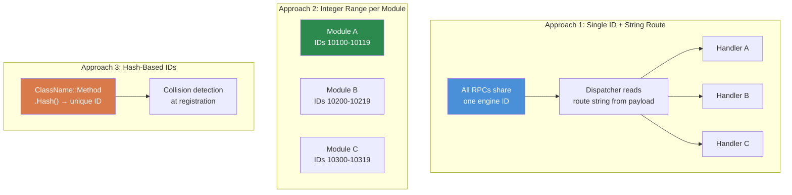

# Chapter 7.3: RPC Communication Patterns

[Domů](../../README.md) | [<< Předchozí: Systémy modulů](02-module-systems.md) | **RPC Communication Patterns** | [Další: Perzistence konfigurace >>](04-config-persistence.md)

---

## Úvod

Remote Procedure Calls (RPCs) are the pouze way to send data mezi client and server in DayZ. Every admin panel, každý synced UI, každý server-to-client notification, and každý client-to-server action request flows through RPCs. Understanding how to build them správně --- with proper serialization order, permission checks, and error handling --- is essential for jakýkoli mod that does more than add items to CfgVehicles.

This chapter covers the fundamental `ScriptRPC` pattern, klient-server roundtrip lifecycle, error handling, and then compares the three major RPC routing approaches used in the DayZ modding community.

---

## Obsah

- [ScriptRPC Fundamentals](#scriptrpc-fundamentals)
- [Client to Server to Client Roundtrip](#client-to-server-to-client-roundtrip)
- [Permission Checking Před Execution](#permission-checking-before-execution)
- [Error Handling and Notifications](#error-handling-and-notifications)
- [Serialization: The Read/Zapište Contract](#serialization-the-readwrite-contract)
- [Three RPC Approaches Compared](#three-rpc-approaches-compared)
- [Běžné Mistakes](#common-mistakes)
- [Best Practices](#best-practices)

---

## ScriptRPC Fundamentals

Every RPC in DayZ uses the `ScriptRPC` class. The pattern is vždy the stejný: create, write data, send.

### Sending Side

```c
void SendDamageReport(PlayerIdentity target, string weaponName, float damage)
{
    ScriptRPC rpc = new ScriptRPC();

    // Write fields in a specific order
    rpc.Write(weaponName);    // field 1: string
    rpc.Write(damage);        // field 2: float

    // Send through the engine
    // Parameters: target object, RPC ID, guaranteed delivery, recipient
    rpc.Send(null, MY_RPC_ID, true, target);
}
```

### Receiving Side

The receiver reads fields in the **exact stejný order** they were written:

```c
void OnRPC_DamageReport(PlayerIdentity sender, Object target, ParamsReadContext ctx)
{
    string weaponName;
    if (!ctx.Read(weaponName)) return;  // field 1: string

    float damage;
    if (!ctx.Read(damage)) return;      // field 2: float

    // Use the data
    Print("Hit by " + weaponName + " for " + damage.ToString() + " damage");
}
```

### Send Parameters Explained

```c
rpc.Send(object, rpcId, guaranteed, identity);
```

| Parameter | Type | Description |
|-----------|------|-------------|
| `object` | `Object` | The target entity (e.g., hráč or vehicle). Use `null` for globální RPCs. |
| `rpcId` | `int` | Integer identifying this RPC type. Must match na obou stranách. |
| `guaranteed` | `bool` | `true` = reliable (TCP-like, retransmits on loss). `false` = unreliable (fire-and-forget). |
| `identity` | `PlayerIdentity` | Recipient. `null` from client = send to server. `null` from server = broadcast to all clients. Specific identity = send to that client pouze. |

### When to Use `guaranteed`

- **`true` (reliable):** Config changes, permission grants, teleport commands, ban actions --- jakýkolithing where a dropped packet would leave client and server out of sync.
- **`false` (unreliable):** Rapid position updates, visual effects, HUD state that refreshes každý few seconds jakýkoliway. Lower overhead, no retransmit queue.

---

## Client to Server to Client Roundtrip

The většina common RPC pattern is the roundtrip: client requests an action, server platnýates and executes, server sends back výsledek.

```
CLIENT                          SERVER
  │                               │
  │  1. Request RPC ───────────►  │
  │     (action + params)         │
  │                               │  2. Validate permission
  │                               │  3. Execute action
  │                               │  4. Prepare response
  │  ◄─────────── 5. Response RPC │
  │     (result + data)           │
  │                               │
  │  6. Update UI                 │
```

### Complete Example: Teleport Request

**Client sends the request:**

```c
class TeleportClient
{
    void RequestTeleport(vector position)
    {
        ScriptRPC rpc = new ScriptRPC();
        rpc.Write(position);
        rpc.Send(null, MY_RPC_TELEPORT, true, null);  // null identity = send to server
    }
};
```

**Server receives, platnýates, executes, responds:**

```c
class TeleportServer
{
    void OnRPC_TeleportRequest(PlayerIdentity sender, Object target, ParamsReadContext ctx)
    {
        // 1. Read the request data
        vector position;
        if (!ctx.Read(position)) return;

        // 2. Validate permission
        if (!MyPermissions.GetInstance().HasPermission(sender.GetPlainId(), "MyMod.Admin.Teleport"))
        {
            SendError(sender, "No permission to teleport");
            return;
        }

        // 3. Validate the data
        if (position[1] < 0 || position[1] > 1000)
        {
            SendError(sender, "Invalid teleport height");
            return;
        }

        // 4. Execute the action
        PlayerBase player = PlayerBase.Cast(sender.GetPlayer());
        if (!player) return;

        player.SetPosition(position);

        // 5. Send success response
        ScriptRPC response = new ScriptRPC();
        response.Write(true);           // success flag
        response.Write(position);       // echo back the position
        response.Send(null, MY_RPC_TELEPORT_RESULT, true, sender);
    }
};
```

**Client receives the response:**

```c
class TeleportClient
{
    void OnRPC_TeleportResult(PlayerIdentity sender, Object target, ParamsReadContext ctx)
    {
        bool success;
        if (!ctx.Read(success)) return;

        vector position;
        if (!ctx.Read(position)) return;

        if (success)
        {
            // Update UI: "Teleported to X, Y, Z"
        }
    }
};
```

---

## Permission Checking Před Execution

Every server-side RPC handler that performs a privileged action **must** check permissions before executing. Nikdy trust klient.

### The Pattern

```c
void OnRPC_AdminAction(PlayerIdentity sender, Object target, ParamsReadContext ctx)
{
    // RULE 1: Always validate the sender exists
    if (!sender) return;

    // RULE 2: Check permission before reading data
    if (!MyPermissions.GetInstance().HasPermission(sender.GetPlainId(), "MyMod.Admin.Ban"))
    {
        MyLog.Warning("BanRPC", "Unauthorized ban attempt from " + sender.GetName());
        return;
    }

    // RULE 3: Only now read and execute
    string targetUid;
    if (!ctx.Read(targetUid)) return;

    // ... execute ban
}
```

### Why Zkontrolujte Před Reading?

Reading data from an unauthorized client wastes server cycles. More důležitýly, malformed data from a malicious client could cause parsing errors. Checking permission first is a cheap guard that rejects bad actors okamžitě.

### Log Unauthorized Attempts

Vždy log failed permission checks. This creates an audit trail and helps server owners detect exploit attempts:

```c
if (!HasPermission(sender, "MyMod.Spawn"))
{
    MyLog.Warning("SpawnRPC", "Denied spawn request from "
        + sender.GetName() + " (" + sender.GetPlainId() + ")");
    return;
}
```

---

## Error Handling and Notifications

RPCs can fail in více ways: network drops, malformed data, server-side platnýation failures. Robust mods handle all of these.

### Přečtěte Failures

Every `ctx.Read()` can fail. Vždy check the return value:

```c
// BAD: Ignoring read failures
string name;
ctx.Read(name);     // If this fails, name is "" — silent corruption
int count;
ctx.Read(count);    // This reads the wrong bytes — everything after is garbage

// GOOD: Early return on any read failure
string name;
if (!ctx.Read(name)) return;
int count;
if (!ctx.Read(count)) return;
```

### Error Response Pattern

When server rejects a request, send a structured error back to klient so the UI can display it:

```c
// Server: send error
void SendError(PlayerIdentity target, string errorMsg)
{
    ScriptRPC rpc = new ScriptRPC();
    rpc.Write(false);        // success = false
    rpc.Write(errorMsg);     // reason
    rpc.Send(null, MY_RPC_RESPONSE_ID, true, target);
}

// Client: handle error
void OnRPC_Response(PlayerIdentity sender, Object target, ParamsReadContext ctx)
{
    bool success;
    if (!ctx.Read(success)) return;

    if (!success)
    {
        string errorMsg;
        if (!ctx.Read(errorMsg)) return;

        // Show error in UI
        MyLog.Warning("MyMod", "Server error: " + errorMsg);
        return;
    }

    // Handle success...
}
```

### Notification Broadcasts

For dokoncets that all clients should viz (killfeed, announcements, weather changes), server broadcasts with `identity = null`:

```c
// Server: broadcast to all clients
void BroadcastAnnouncement(string message)
{
    ScriptRPC rpc = new ScriptRPC();
    rpc.Write(message);
    rpc.Send(null, RPC_ANNOUNCEMENT, true, null);  // null = all clients
}
```

---

## Serialization: The Read/Zapište Contract

The jeden většina důležitý rule of DayZ RPCs: **the Přečtěte order must exactly match the Zapište order, type for type.**

### The Contract

```c
// SENDER writes:
rpc.Write("hello");      // 1. string
rpc.Write(42);           // 2. int
rpc.Write(3.14);         // 3. float
rpc.Write(true);         // 4. bool

// RECEIVER reads in the SAME order:
string s;   ctx.Read(s);     // 1. string
int i;      ctx.Read(i);     // 2. int
float f;    ctx.Read(f);     // 3. float
bool b;     ctx.Read(b);     // 4. bool
```

### What Goes Wrong When Order Mismatches

Pokud swap the read order, the deserializer interprets bytes intended for one type as další. An `int` read where a `string` was written will produce garbage, and každý subsequent read will be offset --- corrupting all remaining fields. Engine ne throw an exception; it tiše returns wrong data or causes `Read()` to return `false`.

### Supported Types

| Type | Notes |
|------|-------|
| `int` | 32-bit signed |
| `float` | 32-bit IEEE 754 |
| `bool` | Single byte |
| `string` | Length-prefixed UTF-8 |
| `vector` | Three floats (x, y, z) |
| `Object` (as target parameter) | Entity reference, resolved by engine |

### Serializing Collections

There is no vestavěný array serialization. Zapište the count first, then každý element:

```c
// SENDER
array<string> names = {"Alice", "Bob", "Charlie"};
rpc.Write(names.Count());
for (int i = 0; i < names.Count(); i++)
{
    rpc.Write(names[i]);
}

// RECEIVER
int count;
if (!ctx.Read(count)) return;

array<string> names = new array<string>();
for (int i = 0; i < count; i++)
{
    string name;
    if (!ctx.Read(name)) return;
    names.Insert(name);
}
```

### Serializing Complex Objects

For complex data, serialize field by field. Do not try to pass objects přímo through `Write()`:

```c
// SENDER: flatten the object into primitives
rpc.Write(player.GetName());
rpc.Write(player.GetHealth());
rpc.Write(player.GetPosition());

// RECEIVER: reconstruct
string name;    ctx.Read(name);
float health;   ctx.Read(health);
vector pos;     ctx.Read(pos);
```

---

## Three RPC Approaches Compared

The DayZ modding community uses three zásadně odlišný approaches to RPC routing. Each has trade-offs.

### Three RPC Approaches Compared



### 1. CF Named RPCs

Community Framework provides `GetRPCManager()` which routes RPCs by string names grouped by mod namespace.

```c
// Registration (in OnInit):
GetRPCManager().AddRPC("MyMod", "RPC_SpawnItem", this, SingleplayerExecutionType.Server);

// Sending from client:
GetRPCManager().SendRPC("MyMod", "RPC_SpawnItem", new Param1<string>("AK74"), true);

// Handler receives:
void RPC_SpawnItem(CallType type, ParamsReadContext ctx, PlayerIdentity sender, Object target)
{
    if (type != CallType.Server) return;

    Param1<string> data;
    if (!ctx.Read(data)) return;

    string className = data.param1;
    // ... spawn the item
}
```

**Pros:**
- String-based routing is human-readable and collision-free
- Namespace grouping (`"MyMod"`) prevents name clashes mezi mods
- Widely used --- if you integrate with COT/Expansion, you use this

**Cons:**
- Requires CF as a dependency
- Uses `Param` wrappers which are verbose for complex payloads
- String comparison on každý dispatch (minor overhead)

### 2. COT / Vanilla Integer-Range RPCs

Vanilla DayZ and některé parts of COT use raw integer RPC IDs. Each mod claims a range of integers and dispatches in a modded `OnRPC` override.

```c
// Define your RPC IDs (pick a unique range to avoid collisions)
const int MY_RPC_SPAWN_ITEM     = 90001;
const int MY_RPC_DELETE_ITEM    = 90002;
const int MY_RPC_TELEPORT       = 90003;

// Sending:
ScriptRPC rpc = new ScriptRPC();
rpc.Write("AK74");
rpc.Send(null, MY_RPC_SPAWN_ITEM, true, null);

// Receiving (in modded DayZGame or entity):
modded class DayZGame
{
    override void OnRPC(PlayerIdentity sender, Object target, int rpc_type, ParamsReadContext ctx)
    {
        switch (rpc_type)
        {
            case MY_RPC_SPAWN_ITEM:
                HandleSpawnItem(sender, ctx);
                return;
            case MY_RPC_DELETE_ITEM:
                HandleDeleteItem(sender, ctx);
                return;
        }

        super.OnRPC(sender, target, rpc_type, ctx);
    }
};
```

**Pros:**
- No dependencies --- works with vanilla DayZ
- Integer comparison is fast
- Full control over the RPC pipeline

**Cons:**
- **ID collision risk**: two mods picking the stejný integer range will tiše intercept každý jiný's RPCs
- Manual dispatch logic (switch/case) gets unwieldy with mnoho RPCs
- No namespace isolation
- No vestavěný registry or discoverability

### 3. Custom String-Routed RPCs

A vlastní string-routed system uses a jeden engine RPC ID and vícexes by writing a mod name + function name as řetězec header in každý RPC. All routing happens inside a statická manager class (`MyRPC` in this example).

```c
// Registration:
MyRPC.Register("MyMod", "RPC_SpawnItem", this, MyRPCSide.SERVER);

// Sending (header-only, no payload):
MyRPC.Send("MyMod", "RPC_SpawnItem", null, true, null);

// Sending (with payload):
ScriptRPC rpc = MyRPC.CreateRPC("MyMod", "RPC_SpawnItem");
rpc.Write("AK74");
rpc.Write(5);    // quantity
rpc.Send(null, MyRPC.FRAMEWORK_RPC_ID, true, null);

// Handler:
void RPC_SpawnItem(PlayerIdentity sender, Object target, ParamsReadContext ctx)
{
    string className;
    if (!ctx.Read(className)) return;

    int quantity;
    if (!ctx.Read(quantity)) return;

    // ... spawn items
}
```

**Pros:**
- Zero collision risk --- string namespace + function name is globálníly unique
- Zero dependency on CF (but volitelnýly bridges to CF's `GetRPCManager()` when CF is present)
- Single engine ID means minimal hook footprint
- `CreateRPC()` helper pre-writes the routing header so you pouze write payload
- Clean handler signature: `(PlayerIdentity, Object, ParamsReadContext)`

**Cons:**
- Two extrřetězec reads per RPC (the routing header) --- minimal overhead v praxi
- Custom system means jiný mods cannot discover your RPCs through CF's registry
- Only dispatches via `CallFunctionParams` reflection, which is slightly slower than a direct method call

### Comparison Table

| Feature | CF Named | Integer-Range | Custom String-Routed |
|---------|----------|---------------|---------------------|
| **Collision risk** | None (namespaced) | High | None (namespaced) |
| **Dependencies** | Requires CF | None | None |
| **Handler signature** | `(CallType, ctx, sender, target)` | Custom | `(sender, target, ctx)` |
| **Discoverability** | CF registry | None | `MyRPC.s_Handlers` |
| **Dispatch overhead** | String lookup | Integer switch | String lookup |
| **Payload style** | Param wrappers | Raw Write/Přečtěte | Raw Write/Přečtěte |
| **CF bridge** | Native | Manual | Automatic (`#ifdef`) |

### Which Should You Use?

- **Your mod depends on CF jakýkoliway** (COT/Expansion integration): use CF Named RPCs
- **Standalone mod, minimal dependencies**: use integer-range or build řetězec-routed system
- **Building a framework**: consider řetězec-routed system like the vlastní `MyRPC` pattern výše
- **Learning / prototyping**: integer-range is the simplest to understand

---

## Časté chyby

### 1. Forgetting to Register the Handler

You send an RPC but nothing happens on the jiný side. The handler was nikdy registered.

```c
// WRONG: No registration — the server never knows about this handler
class MyModule
{
    void RPC_DoThing(PlayerIdentity sender, Object target, ParamsReadContext ctx) { ... }
};

// RIGHT: Register in OnInit
class MyModule
{
    void OnInit()
    {
        MyRPC.Register("MyMod", "RPC_DoThing", this, MyRPCSide.SERVER);
    }

    void RPC_DoThing(PlayerIdentity sender, Object target, ParamsReadContext ctx) { ... }
};
```

### 2. Read/Zapište Order Mismatch

The většina common RPC bug. The sender writes `(string, int, float)` but the receiver reads `(string, float, int)`. No error message --- jen garbage data.

**Fix:** Zapište a comment block documenting the field order at oba the send and receive sites:

```c
// Wire format: [string weaponName] [int damage] [float distance]
```

### 3. Sending Client-Only Data to the Server

The server cannot read client-side widget state, input state, or lokální variables. If potřebujete to send a UI selection to server, serialize the relevantní value (řetězec, an index, an ID) --- not the widget object itself.

### 4. Broadcasting When You Meant Unicast

```c
// WRONG: Sends to ALL clients when you meant to send to one
rpc.Send(null, MY_RPC_ID, true, null);

// RIGHT: Send to the specific client
rpc.Send(null, MY_RPC_ID, true, targetIdentity);
```

### 5. Not Handling Stale Handlers Across Mission Restarts

Pokud module registers an RPC handler and is then destroyed on mission end, the handler stále points to the dead object. The next RPC dispatch will crash.

**Fix:** Vždy unregister or clean up handlers on mission finish:

```c
override void OnMissionFinish()
{
    MyRPC.Unregister("MyMod", "RPC_DoThing");
}
```

Or use a centralized `Cleanup()` that clears the celý handler map (as `MyRPC.Cleanup()` does).

---

## Osvědčené postupy

1. **Vždy check `ctx.Read()` return values.** Every read can fail. Return okamžitě on failure.

2. **Vždy platnýate the sender on server.** Zkontrolujte that `sender` is non-null and has the povinný permission before doing jakýkolithing.

3. **Document the wire format.** At oba the send and receive sites, write a comment listing the fields in order with their types.

4. **Use reliable delivery for state changes.** Unreliable delivery is pouze appropriate for rapid, ephemeral updates (position, effects).

5. **Udržujte payloads small.** DayZ has a practical per-RPC size limit. For large data (config sync, player lists), split into více RPCs or use pagination.

6. **Register handlers early.** `OnInit()` is the safest place. Clients can connect before `OnMissionStart()` completes.

7. **Clean up handlers on shutdown.** Either unregister individually or clear the celý registry in `OnMissionFinish()`.

8. **Use `CreateRPC()` for payloads, `Send()` for signals.** Pokud have no data to send (just a "do it" signal), use the header-only `Send()`. Pokud have data, use `CreateRPC()` + manual writes + manual `rpc.Send()`.

---

## Kompatibilita a dopad

- **Více modů:** Integer-range RPCs are collision-prone --- two mods choosing the stejný ID tiše intercept každý jiný's messages. String-routed or CF-named RPCs avoid this by using namespace + function name as klíč.
- **Pořadí načítání:** RPC handler registration order matters only when multiple mods `modded class DayZGame` and override `OnRPC`. Each must call `super.OnRPC()` for unhandled IDs, or downstream mods never receive their RPCs. String-routed systems avoid this by using a single engine ID.
- **Listen Server:** On listen servers, oba client and server run in the stejný process. An RPC sent with `identity = null` from server side will také be received lokálníly. Guard handlers with `if (type != CallType.Server) return;` or check `GetGame().IsServer()` / `GetGame().IsClient()` as appropriate.
- **Výkon:** RPC dispatch overhead is minimal (string lookup or integer switch). The bottleneck is payload size --- DayZ has a practical per-RPC limit (~64 KB). For large data (config sync), paginate across více RPCs.
- **Migration:** RPC IDs are a mod-interní detail and unaffected by DayZ version updates. Pokud change your RPC wire format (add/remove fields), old clients talking to a nový server will tiše desync. Version your RPC payloads or force client updates.

---

## Teorie vs praxe

| Textbook Says | DayZ Reality |
|---------------|-------------|
| Use protocol buffers or schema-based serialization | Enforce Script has no protobuf support; you ručně `Write`/`Read` primitives in matched order |
| Validate all inputs with schema enforcement | No schema platnýation exists; každý `ctx.Read()` return value must be checked individually |
| RPCs should be idempotent | Practical in DayZ pouze for query RPCs; mutation RPCs (spawn, delete, teleport) are inherently non-idempotent --- guard with permission checks místo toho |

---

[Domů](../../README.md) | [<< Předchozí: Systémy modulů](02-module-systems.md) | **RPC Communication Patterns** | [Další: Perzistence konfigurace >>](04-config-persistence.md)
