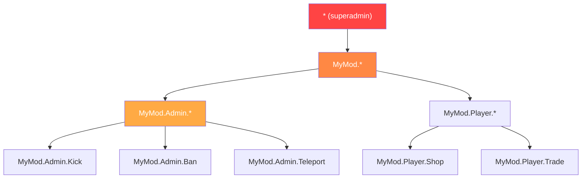

# Chapter 7.5: Permission Systems

[Domů](../../README.md) | [<< Předchozí: Perzistence konfigurace](04-config-persistence.md) | **Permission Systems** | [Další: Event-Driven Architecture >>](06-events.md)

---

## Úvod

Every admin přílišl, každý privileged action, and každý moderation feature in DayZ needs a permission system. The question is not whether to check permissions but how to structure them. The DayZ modding community has settled on three major patterns: hierarchical dot-separated permissions, user-group role assignment (VPP), and framework-level role-based access (CF/COT). Each has odlišný trade-offs in granularity, complexity, and server-owner experience.

This chapter covers all three patterns, the permission-checking flow, storage formats, and wildcard/superadmin handling.

---

## Obsah

- [Why Permissions Matter](#why-permissions-matter)
- [Hierarchical Dot-Separated (MyMod Pattern)](#hierarchical-dot-separated-mymod-pattern)
- [VPP UserGroup Pattern](#vpp-usergroup-pattern)
- [CF Role-Based Pattern (COT)](#cf-role-based-pattern-cot)
- [Permission Checking Flow](#permission-checking-flow)
- [Storage Formats](#storage-formats)
- [Wildcard and Superadmin Patterns](#wildcard-and-superadmin-patterns)
- [Migration Mezi Systems](#migration-between-systems)
- [Best Practices](#best-practices)

---

## Why Permissions Matter

Bez a permission system, you have two options: either každý player can do každýthing (chaos), or you hardcode Steam64 IDs in your scripts (unmaintainable). A permission system lets server owners define who can do what, without modifying code.

The three security rules:

1. **Nikdy trust klient.** The client sends a request; server decides whether to honor it.
2. **Default deny.** If hráč is not explicitly granted a permission, they ne have it.
3. **Fail closed.** Pokud permission check itself fails (null identity, corrupted data), deny the action.

---

## Hierarchical Dot-Separated (MyMod Pattern)

MyMod uses dot-separated permission strings organized in a tree hierarchy. Each permission is a path like `"MyMod.Admin.Teleport"` or `"MyMod.Missions.Start"`. Wildcards allow granting celý subtrees.

### Permission Format

```
MyMod                           (root namespace)
├── Admin                        (admin tools)
│   ├── Panel                    (open admin panel)
│   ├── Teleport                 (teleport self/others)
│   ├── Kick                     (kick players)
│   ├── Ban                      (ban players)
│   └── Weather                  (change weather)
├── Missions                     (mission system)
│   ├── Start                    (start missions manually)
│   └── Stop                     (stop missions)
└── AI                           (AI system)
    ├── Spawn                    (spawn AI manually)
    └── Config                   (edit AI config)
```

### Data Model

Každý player (identified by Steam64 ID) has pole of granted permission strings:

```c
class MyPermissionsData
{
    // key: Steam64 ID, value: array of permission strings
    ref map<string, ref TStringArray> Admins;

    void MyPermissionsData()
    {
        Admins = new map<string, ref TStringArray>();
    }
};
```

### Permission Check

The check walks hráč's granted permissions and supports three match types: exact match, plný wildcard (`"*"`), and prefix wildcard (`"MyMod.Admin.*"`):

```c
bool HasPermission(string plainId, string permission)
{
    if (plainId == "" || permission == "")
        return false;

    TStringArray perms;
    if (!m_Permissions.Find(plainId, perms))
        return false;

    for (int i = 0; i < perms.Count(); i++)
    {
        string granted = perms[i];

        // Full wildcard: superadmin
        if (granted == "*")
            return true;

        // Exact match
        if (granted == permission)
            return true;

        // Prefix wildcard: "MyMod.Admin.*" matches "MyMod.Admin.Teleport"
        if (granted.IndexOf("*") > 0)
        {
            string prefix = granted.Substring(0, granted.Length() - 1);
            if (permission.IndexOf(prefix) == 0)
                return true;
        }
    }

    return false;
}
```

### JSON Storage

```json
{
    "Admins": {
        "76561198000000001": ["*"],
        "76561198000000002": ["MyMod.Admin.Panel", "MyMod.Admin.Teleport"],
        "76561198000000003": ["MyMod.Missions.*"],
        "76561198000000004": ["MyMod.Admin.Kick", "MyMod.Admin.Ban"]
    }
}
```

### Strengths

- **Fine-grained:** můžete grant exactly the permissions každý admin needs
- **Hierarchical:** wildcards grant celý subtrees without listing každý permission
- **Self-documenting:** the permission string tells you what it controls
- **Extensible:** nový permissions are jen nový strings --- no schema changes

### Weaknesses

- **No named roles:** if 10 admins need the stejný set, you list it 10 times
- **String-based:** typos in permission strings fail tiše (they jen ne match)

---

## VPP UserGroup Pattern

VPP Admin Tools uses a group-based system. You define named groups (roles) with sets of permissions, then assign hráči to groups.

### Concept

```
Groups:
  "SuperAdmin"  → [all permissions]
  "Moderator"   → [kick, ban, mute, teleport]
  "Builder"     → [spawn objects, teleport, ESP]

Players:
  "76561198000000001" → "SuperAdmin"
  "76561198000000002" → "Moderator"
  "76561198000000003" → "Builder"
```

### Implementation Pattern

```c
class VPPUserGroup
{
    string GroupName;
    ref array<string> Permissions;
    ref array<string> Members;  // Steam64 IDs

    bool HasPermission(string permission)
    {
        if (!Permissions) return false;

        for (int i = 0; i < Permissions.Count(); i++)
        {
            if (Permissions[i] == permission)
                return true;
            if (Permissions[i] == "*")
                return true;
        }
        return false;
    }
};

class VPPPermissionManager
{
    ref array<ref VPPUserGroup> m_Groups;

    bool PlayerHasPermission(string plainId, string permission)
    {
        for (int i = 0; i < m_Groups.Count(); i++)
        {
            VPPUserGroup group = m_Groups[i];

            // Check if player is in this group
            if (group.Members.Find(plainId) == -1)
                continue;

            if (group.HasPermission(permission))
                return true;
        }
        return false;
    }
};
```

### JSON Storage

```json
{
    "Groups": [
        {
            "GroupName": "SuperAdmin",
            "Permissions": ["*"],
            "Members": ["76561198000000001"]
        },
        {
            "GroupName": "Moderator",
            "Permissions": [
                "admin.kick",
                "admin.ban",
                "admin.mute",
                "admin.teleport"
            ],
            "Members": [
                "76561198000000002",
                "76561198000000003"
            ]
        },
        {
            "GroupName": "Builder",
            "Permissions": [
                "admin.spawn",
                "admin.teleport",
                "admin.esp"
            ],
            "Members": [
                "76561198000000004"
            ]
        }
    ]
}
```

### Strengths

- **Role-based:** define a role once, assign it to mnoho hráči
- **Familiar:** server owners understand group/role systems from jiný games
- **Easy bulk changes:** change a group's permissions and all members are updated

### Weaknesses

- **Less granular without extra work:** giving one specifický admin one extra permission means creating a nový group or adding per-player overrides
- **Group inheritance is complex:** VPP ne natively support group hierarchy (e.g., "Admin" inherits all "Moderator" permissions)

---

## CF Role-Based Pattern (COT)

Community Framework / COT uses a role and permission system where roles are defined with explicit permission sets, and hráči are assigned to roles.

### Concept

CF's permission system is similar to VPP's groups but integrated into the framework layer, making it dostupný to all CF-based mods:

```c
// COT pattern (simplified)
// Roles are defined in AuthFile.json
// Each role has a name and an array of permissions
// Players are assigned to roles by Steam64 ID

class CF_Permission
{
    string m_Name;
    ref array<ref CF_Permission> m_Children;
    int m_State;  // ALLOW, DENY, INHERIT
};
```

### Permission Tree

CF represents permissions as a tree structure, where každý node can be explicitly allowed, denied, or inherit from its parent:

```
Root
├── Admin [ALLOW]
│   ├── Kick [INHERIT → ALLOW]
│   ├── Ban [INHERIT → ALLOW]
│   └── Teleport [DENY]        ← Explicitly denied even though Admin is ALLOW
└── ESP [ALLOW]
```

This three-state system (allow/deny/inherit) is more expressive than the binary (granted/not-granted) systems used by MyMod and VPP. It allows you to grant a broad category and then carve out exceptions.

### JSON Storage

```json
{
    "Roles": {
        "Moderator": {
            "admin": {
                "kick": 2,
                "ban": 2,
                "teleport": 1
            }
        }
    },
    "Players": {
        "76561198000000001": {
            "Role": "SuperAdmin"
        }
    }
}
```

(Where `2 = ALLOW`, `1 = DENY`, `0 = INHERIT`)

### Strengths

- **Three-state permissions:** allow, deny, inherit gives maximum flexibility
- **Tree structure:** mirrors the hierarchical nature of permission paths
- **Framework-level:** all CF mods share the stejný permission system

### Weaknesses

- **Complexity:** three states are harder for server owners to understand than simple "granted"
- **CF dependency:** pouze works with Community Framework

---

## Permission Checking Flow

Regardless of which system you use, server-side permission check follows the stejný pattern:

```
Client sends RPC request
        │
        ▼
Server RPC handler receives it
        │
        ▼
    ┌─────────────────────────────────┐
    │ Is sender identity non-null?     │
    │ (Network-level validation)       │
    └───────────┬─────────────────────┘
                │ No → return (drop silently)
                │ Yes ▼
    ┌─────────────────────────────────┐
    │ Does sender have the required    │
    │ permission for this action?      │
    └───────────┬─────────────────────┘
                │ No → log warning, optionally send error to client, return
                │ Yes ▼
    ┌─────────────────────────────────┐
    │ Validate request data            │
    │ (read params, check bounds)      │
    └───────────┬─────────────────────┘
                │ Invalid → send error to client, return
                │ Valid ▼
    ┌─────────────────────────────────┐
    │ Execute the privileged action    │
    │ Log the action with admin ID     │
    │ Send success response            │
    └─────────────────────────────────┘
```

### Implementation

```c
void OnRPC_KickPlayer(PlayerIdentity sender, Object target, ParamsReadContext ctx)
{
    // Step 1: Validate sender
    if (!sender) return;

    // Step 2: Check permission
    if (!MyPermissions.GetInstance().HasPermission(sender.GetPlainId(), "MyMod.Admin.Kick"))
    {
        MyLog.Warning("Admin", "Unauthorized kick attempt: " + sender.GetName());
        return;
    }

    // Step 3: Read and validate data
    string targetUid;
    if (!ctx.Read(targetUid)) return;

    if (targetUid == sender.GetPlainId())
    {
        // Cannot kick yourself
        SendError(sender, "Cannot kick yourself");
        return;
    }

    // Step 4: Execute
    PlayerIdentity targetIdentity = FindPlayerByUid(targetUid);
    if (!targetIdentity)
    {
        SendError(sender, "Player not found");
        return;
    }

    GetGame().DisconnectPlayer(targetIdentity);

    // Step 5: Log and respond
    MyLog.Info("Admin", sender.GetName() + " kicked " + targetIdentity.GetName());
    SendSuccess(sender, "Player kicked");
}
```

---

## Storage Formats

All three systems store permissions in JSON. The differences are structural:

### Flat Per-Player

```json
{
    "Admins": {
        "STEAM64_ID": ["perm.a", "perm.b", "perm.c"]
    }
}
```

**Soubor:** One file for all hráči.
**Pros:** Simple, easy to edit by hand.
**Cons:** Redundant if mnoho hráči share the stejný permissions.

### Per-Player File (Expansion / Player Data)

```json
// File: $profile:MyMod/Players/76561198xxxxx.json
{
    "UID": "76561198xxxxx",
    "Permissions": ["perm.a", "perm.b"],
    "LastLogin": "2025-01-15 14:30:00"
}
```

**Pros:** Each player is nezávislý; no locking concerns.
**Cons:** Many small files; searching "who has permission X?" requires scanning all files.

### Group-Based (VPP)

```json
{
    "Groups": [
        {
            "GroupName": "RoleName",
            "Permissions": ["perm.a", "perm.b"],
            "Members": ["STEAM64_ID_1", "STEAM64_ID_2"]
        }
    ]
}
```

**Pros:** Role changes propagate to all members instantly.
**Cons:** A player cannot easily have per-player permission overrides without a dedicated group.

### Choosing a Format

| Factor | Flat Per-Player | Per-Player File | Group-Based |
|--------|----------------|-----------------|-------------|
| **Small server (1-5 admins)** | Best | Overkill | Overkill |
| **Medium server (5-20 admins)** | Good | Good | Best |
| **Large community (20+ roles)** | Redundant | Files multiply | Best |
| **Per-player vlastníization** | Native | Native | Needs workaround |
| **Hand-editing** | Easy | Easy per player | Moderate |

---

## Wildcard and Superadmin Patterns



### Full Wildcard: `"*"`

Grants all permissions. Toto je superadmin pattern. A player with `"*"` can do jakýkolithing.

```c
if (granted == "*")
    return true;
```

**Convention:** Every permission system in the DayZ modding community uses `"*"` for superadmin. Do not invent a odlišný convention.

### Prefix Wildcard: `"MyMod.Admin.*"`

Grants all permissions that start with `"MyMod.Admin."`. This allows granting an celý subsystem without listing každý permission:

```c
// "MyMod.Admin.*" matches:
//   "MyMod.Admin.Teleport"  ✓
//   "MyMod.Admin.Kick"      ✓
//   "MyMod.Admin.Ban"       ✓
//   "MyMod.Missions.Start"  ✗ (different subtree)
```

### Implementation

```c
if (granted.IndexOf("*") > 0)
{
    // "MyMod.Admin.*" → prefix = "MyMod.Admin."
    string prefix = granted.Substring(0, granted.Length() - 1);
    if (permission.IndexOf(prefix) == 0)
        return true;
}
```

### No Negative Permissions (Dot-Separated / VPP)

Oba the dot-separated and VPP systems use additive-only permissions. You can grant permissions but not explicitly deny them. Pokud permission is not in hráč's list, it is denied.

CF/COT is the exception with its three-state system (ALLOW/DENY/INHERIT), which supports explicit denials.

### Superadmin Escape Hatch

Provide a way to check if některéone is a superadmin without checking a specifický permission. This is užitečný for bypass logic:

```c
bool IsSuperAdmin(string plainId)
{
    return HasPermission(plainId, "*");
}
```

---

## Migration Mezi Systems

Pokud váš mod needs to support servers migrating from one permission system to další (e.g., from a flat admin UID list to hierarchical permissions), implement automatický migration on load:

```c
void Load()
{
    if (!FileExist(PERMISSIONS_FILE))
    {
        CreateDefaultFile();
        return;
    }

    // Try new format first
    if (LoadNewFormat())
        return;

    // Fall back to legacy format and migrate
    LoadLegacyAndMigrate();
}

void LoadLegacyAndMigrate()
{
    // Read old format: { "AdminUIDs": ["uid1", "uid2"] }
    LegacyPermissionData legacyData = new LegacyPermissionData();
    JsonFileLoader<LegacyPermissionData>.JsonLoadFile(PERMISSIONS_FILE, legacyData);

    // Migrate: each legacy admin becomes a superadmin in the new system
    for (int i = 0; i < legacyData.AdminUIDs.Count(); i++)
    {
        string uid = legacyData.AdminUIDs[i];
        GrantPermission(uid, "*");
    }

    // Save in new format
    Save();
    MyLog.Info("Permissions", "Migrated " + legacyData.AdminUIDs.Count().ToString()
        + " admin(s) from legacy format");
}
```

This is běžný pattern used to migrate from its original flat `AdminUIDs` array to the hierarchical `Admins` map.

---

## Osvědčené postupy

1. **Default deny.** Pokud permission is not explicitly granted, the answer is "no".

2. **Zkontrolujte on server, nikdy klient.** Client-side permission checks are for UI convenience pouze (hiding buttons). The server must vždy re-verify.

3. **Use `"*"` for superadmin.** It is the universal convention. Do not invent `"all"`, `"admin"`, or `"root"`.

4. **Log každý denied privileged action.** This is your security audit trail.

5. **Provide a výchozí permissions file with a placeholder.** New server owners should viz a clear example:

```json
{
    "Admins": {
        "PUT_STEAM64_ID_HERE": ["*"]
    }
}
```

6. **Namespace your permissions.** Use `"YourMod.Category.Action"` to avoid collisions with jiný mods.

7. **Support prefix wildcards.** Server owners should be able to grant `"YourMod.Admin.*"` místo listing každý admin permission individually.

8. **Udržujte the permissions file human-editable.** Server owners will edit it by hand. Use clear key names, one permission per line in the JSON, and document the dostupný permissions některéwhere in your mod's documentation.

9. **Implement migration from day one.** When your permission format changes (and it will), automatický migration prevents support tickets.

10. **Sync permissions to klient on connect.** The client needs to know its own permissions for UI purposes (showing/hiding admin buttons). Send a summary on connect; ne send the celý server permissions file.

---

## Kompatibilita a dopad

- **Více modů:** Each mod can define its own permission namespace (`"ModA.Admin.Kick"`, `"ModB.Build.Spawn"`). The `"*"` wildcard grants superadmin across *all* mods that share the stejný permission store. If mods use nezávislý permission files, `"*"` pouze applies within that mod's scope.
- **Pořadí načítání:** Permission files are loaded once during server startup. No cross-mod ordering issues as long as each mod reads its own file. If a shared framework (CF/COT) manages permissions, all mods using that framework share the same permission tree.
- **Listen Server:** Permission checks should vždy run server-side. On listen servers, client-side code may call `HasPermission()` for UI gating (showing/hiding admin buttons), but server-side check is the authoritative one.
- **Výkon:** Permission checks are řetězec-array linear scan per player. With typical admin counts (1--20 admins, 5--30 permissions každý), this is negligible. For extremely large permission sets, consider a `set<string>` místo pole for O(1) lookups.
- **Migration:** Adding nový permission strings is non-breaking --- existing admins simply ne have the nový permission until granted. Renaming permissions breaks existing grants tiše. Use config versioning to auto-migrate renamed permission strings.

---

## Časté chyby

| Mistake | Impact | Fix |
|---------|--------|-----|
| Trusting client-sent permission data | Exploited clients send `"I am admin"` and server believes them; plný server compromise | Nikdy read permissions from an RPC payload; vždy look up `sender.GetPlainId()` in server-side permission store |
| Missing výchozí deny | A chybějící permission check grants access to každýone; accidental privilege escalation | Every RPC handler for a privileged action must check `HasPermission()` and return early on failure |
| Typo in permission string fails tiše | `"MyMod.Amin.Kick"` (typo) nikdy matches --- admin cannot kick, no error is logged | Define permission strings as `statická const` variables; reference the constant, nikdy a raw string literal |
| Sending the plný permissions file to klient | Exposes all admin Steam64 IDs and their permission sets to jakýkoli connected client | Send pouze the requesting player's own permission list, nikdy the plný server file |
| No wildcard support in HasPermission | Server owners must list každý jeden permission per admin; tedious and error-prone | Implement prefix wildcards (`"MyMod.Admin.*"`) and plný wildcard (`"*"`) from day one |

---

## Teorie vs praxe

| Textbook Says | DayZ Reality |
|---------------|-------------|
| Use RBAC (role-based access control) with group inheritance | Only CF/COT supports three-state permissions; většina mods use flat per-player grants for simplicity |
| Permissions should be stored in a database | No database access; JSON files in `$profile:` are the pouze option |
| Use cryptographic tokens for authorization | No crypto libraries in Enforce Script; trust is based on `PlayerIdentity.GetPlainId()` (Steam64 ID) verified by engine |

---

[Domů](../../README.md) | [<< Předchozí: Perzistence konfigurace](04-config-persistence.md) | **Permission Systems** | [Další: Event-Driven Architecture >>](06-events.md)
