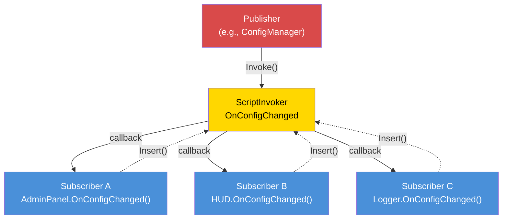

# Chapter 7.6: Event-Driven Architecture

[Domů](../../README.md) | [<< Předchozí: Permission Systems](05-permissions.md) | **Event-Driven Architecture** | [Další: Performance Optimization >>](07-performance.md)

---

## Úvod

Event-driven architecture decouples the producer of an dokoncet from its consumers. When hráč connects, the connection handler ne need to know about the killfeed, the admin panel, the mission system, or the logging module --- it fires a "player connected" dokoncet, and každý interested system subscribes nezávisle. Toto je foundation of extensible mod design: nový features subscribe to existing dokoncets without modifying the code that fires them.

DayZ provides `ScriptInvoker` as its vestavěný dokoncet primitive. On top of it, professional mods build dokoncet buses with named topics, typed handlers, and lifecycle management. This chapter covers all three major patterns and the critical discipline of memory-leak prevention.

---

## Obsah

- [ScriptInvoker Pattern](#scriptinvoker-pattern)
- [EventBus Pattern (String-Routed Topics)](#eventbus-pattern-string-routed-topics)
- [CF_EventHandler Pattern](#cf_eventhandler-pattern)
- [When to Use Events vs Direct Calls](#when-to-use-events-vs-direct-calls)
- [Memory Leak Prevention](#memory-leak-prevention)
- [Advanced: Custom Event Data](#advanced-vlastní-event-data)
- [Best Practices](#best-practices)

---

## ScriptInvoker Pattern

`ScriptInvoker` is engine's vestavěný pub/sub primitive. It holds a list of function zpětné volánís and invokes all of them when an dokoncet fires. Toto je lowest-level dokoncet mechanism in DayZ.

### Creating an Event

```c
class WeatherManager
{
    // The event. Anyone can subscribe to be notified when weather changes.
    ref ScriptInvoker OnWeatherChanged = new ScriptInvoker();

    protected string m_CurrentWeather;

    void SetWeather(string newWeather)
    {
        m_CurrentWeather = newWeather;

        // Fire the event — all subscribers are notified
        OnWeatherChanged.Invoke(newWeather);
    }
};
```

### Subscribing to an Event

```c
class WeatherUI
{
    void Init(WeatherManager mgr)
    {
        // Subscribe: when weather changes, call our handler
        mgr.OnWeatherChanged.Insert(OnWeatherChanged);
    }

    void OnWeatherChanged(string newWeather)
    {
        // Update the UI
        m_WeatherLabel.SetText("Weather: " + newWeather);
    }

    void Cleanup(WeatherManager mgr)
    {
        // CRITICAL: Unsubscribe when done
        mgr.OnWeatherChanged.Remove(OnWeatherChanged);
    }
};
```

### ScriptInvoker API

| Method | Description |
|--------|-------------|
| `Insert(func)` | Přidejte a zpětné volání to the subscriber list |
| `Remove(func)` | Odstraňte a specifický zpětné volání |
| `Invoke(...)` | Call all subscribed zpětné volánís with the given arguments |
| `Clear()` | Odstraňte all subscribers |

### Event-Driven Pattern



### How Insert/Odstraňte Work

`Insert` adds a function reference to an interní list. `Remove` searches the list and removes the matching entry. Pokud call `Insert` twice with the stejný function, it will be called twice on každý `Invoke`. Pokud call `Remove` once, it removes one entry.

```c
// Subscribing the same handler twice is a bug:
mgr.OnWeatherChanged.Insert(OnWeatherChanged);
mgr.OnWeatherChanged.Insert(OnWeatherChanged);  // Now called 2x per Invoke

// One Remove only removes one entry:
mgr.OnWeatherChanged.Remove(OnWeatherChanged);
// Still called 1x per Invoke — the second Insert is still there
```

### Typed Signatures

`ScriptInvoker` ne enforce parameter types at compile time. The convention is to document the expected signature in a comment:

```c
// Signature: void(string weatherName, float temperature)
ref ScriptInvoker OnWeatherChanged = new ScriptInvoker();
```

Pokud subscriber has the wrong signature, the behavior is undefined za běhu --- it may crash, receive garbage values, or tiše nehing. Vždy match the documented signature exactly.

### ScriptInvoker on Vanilla Classes

Many vanilla DayZ classes expose `ScriptInvoker` dokoncets:

```c
// UIScriptedMenu has OnVisibilityChanged
class UIScriptedMenu
{
    ref ScriptInvoker m_OnVisibilityChanged;
};

// MissionBase has event hooks
class MissionBase
{
    void OnUpdate(float timeslice);
    void OnEvent(EventType eventTypeId, Param params);
};
```

You can subscribe to these vanilla dokoncets from modded classes to react to engine-level state changes.

---

## EventBus Pattern (String-Routed Topics)

A `ScriptInvoker` is a jeden dokoncet channel. An EventBus is a collection of named channels, providing a central hub where jakýkoli module can publish or subscribe to dokoncets by topic name.

### Custom EventBus Pattern

This pattern implements the EventBus as a statická class with named `ScriptInvoker` fields for well-known dokoncets, plus a generic `OnCustomEvent` channel for ad-hoc topics:

```c
class MyEventBus
{
    // Well-known lifecycle events
    static ref ScriptInvoker OnPlayerConnected;      // void(PlayerIdentity)
    static ref ScriptInvoker OnPlayerDisconnected;    // void(PlayerIdentity)
    static ref ScriptInvoker OnPlayerReady;           // void(PlayerBase, PlayerIdentity)
    static ref ScriptInvoker OnConfigChanged;         // void(string modId, string field, string value)
    static ref ScriptInvoker OnAdminPanelToggled;     // void(bool opened)
    static ref ScriptInvoker OnMissionStarted;        // void(MyInstance)
    static ref ScriptInvoker OnMissionCompleted;      // void(MyInstance, int reason)
    static ref ScriptInvoker OnAdminDataSynced;       // void()

    // Generic custom event channel
    static ref ScriptInvoker OnCustomEvent;           // void(string eventName, Param params)

    static void Init() { ... }   // Creates all invokers
    static void Cleanup() { ... } // Nulls all invokers

    // Helper to fire a custom event
    static void Fire(string eventName, Param params)
    {
        if (!OnCustomEvent) Init();
        OnCustomEvent.Invoke(eventName, params);
    }
};
```

### Subscribing to the EventBus

```c
class MyMissionModule : MyServerModule
{
    override void OnInit()
    {
        super.OnInit();

        // Subscribe to player lifecycle
        MyEventBus.OnPlayerConnected.Insert(OnPlayerJoined);
        MyEventBus.OnPlayerDisconnected.Insert(OnPlayerLeft);

        // Subscribe to config changes
        MyEventBus.OnConfigChanged.Insert(OnConfigChanged);
    }

    override void OnMissionFinish()
    {
        // Always unsubscribe on shutdown
        MyEventBus.OnPlayerConnected.Remove(OnPlayerJoined);
        MyEventBus.OnPlayerDisconnected.Remove(OnPlayerLeft);
        MyEventBus.OnConfigChanged.Remove(OnConfigChanged);
    }

    void OnPlayerJoined(PlayerIdentity identity)
    {
        MyLog.Info("Missions", "Player joined: " + identity.GetName());
    }

    void OnPlayerLeft(PlayerIdentity identity)
    {
        MyLog.Info("Missions", "Player left: " + identity.GetName());
    }

    void OnConfigChanged(string modId, string field, string value)
    {
        if (modId == "MyMod_Missions")
        {
            // Reload our config
            ReloadSettings();
        }
    }
};
```

### Using Custom Events

For one-off or mod-specific dokoncets that ne warrant a dedicated `ScriptInvoker` field:

```c
// Publisher (e.g., in the loot system):
MyEventBus.Fire("LootRespawned", new Param1<int>(spawnedCount));

// Subscriber (e.g., in a logging module):
MyEventBus.OnCustomEvent.Insert(OnCustomEvent);

void OnCustomEvent(string eventName, Param params)
{
    if (eventName == "LootRespawned")
    {
        Param1<int> data;
        if (Class.CastTo(data, params))
        {
            MyLog.Info("Loot", "Respawned " + data.param1.ToString() + " items");
        }
    }
}
```

### When to Use Named Fields vs Custom Events

| Approach | Use When |
|----------|----------|
| Named `ScriptInvoker` field | The dokoncet is well-known, frequently used, and has a stable signature |
| `OnCustomEvent` + string name | The dokoncet is mod-specific, experimental, or used by a jeden subscriber |

Named fields are type-safe by convention and discoverable by reading třída. Custom dokoncets are flexible but require string matching and casting.

---

## CF_EventHandler Pattern

Community Framework provides `CF_EventHandler` as a more structured dokoncet system with type-safe dokoncet args.

### Concept

```c
// CF event handler pattern (simplified):
class CF_EventArgs
{
    // Base class for all event arguments
};

class CF_EventPlayerArgs : CF_EventArgs
{
    PlayerIdentity Identity;
    PlayerBase Player;
};

// Modules override event handler methods:
class MyModule : CF_ModuleWorld
{
    override void OnEvent(Class sender, CF_EventArgs args)
    {
        // Handle generic events
    }

    override void OnClientReady(Class sender, CF_EventArgs args)
    {
        // Client is ready, UI can be created
    }
};
```

### Key Differences from ScriptInvoker

| Feature | ScriptInvoker | CF_EventHandler |
|---------|--------------|-----------------|
| **Type safety** | Convention pouze | Typed EventArgs classes |
| **Discovery** | Přečtěte comments | Override named methods |
| **Subscription** | `Insert()` / `Remove()` | Override virtual methods |
| **Custom data** | Param wrappers | Custom EventArgs subclasses |
| **Cleanup** | Manual `Remove()` | Automatic (method override, no registration) |

CF's approach eliminates the need to ručně subscribe and unsubscribe --- you simply override the handler method. This removes an celý class of bugs (forgotten `Remove()` calls) at the cost of requiring CF as a dependency.

---

## When to Use Events vs Direct Calls

### Use Events When:

1. **Multiple nezávislý consumers** need to react to the stejný occurrence. Player connects? The killfeed, the admin panel, the mission system, and the logger all care.

2. **The producer should not know about the consumers.** The connection handler should not import the killfeed module.

3. **The set of consumers changes za běhu.** Modules can subscribe and unsubscribe dynamically.

4. **Cross-mod communication.** Mod A fires an dokoncet; Mod B subscribes to it. Neither imports the jiný.

### Use Direct Calls When:

1. **There is exactly one consumer** and it is known at compile time. If pouze the health system cares about a damage calculation, call it přímo.

2. **Return values are needed.** Events are fire-and-forget. If potřebujete a response ("should this action be allowed?"), use a direct method call.

3. **Order matters.** Event subscribers are called in insertion order, but depending on this order is fragile. If step B must happen after step A, call A then B explicitly.

4. **Performance is critical.** Events have overhead (iterating the subscriber list, calling via reflection). For per-frame, per-entity logic, direct calls are faster.

### Decision Guide

```
                    Does the producer need a return value?
                         /                    \
                       YES                     NO
                        |                       |
                   Direct call          How many consumers?
                                       /              \
                                     ONE            MULTIPLE
                                      |                |
                                 Direct call        EVENT
```

---

## Memory Leak Prevention

The jeden většina dangerous aspect of dokoncet-driven architecture in Enforce Script is **subscriber leaks**. If an object subscribes to an dokoncet and is then destroyed without unsubscribing, one of two things happens:

1. **Pokud object extends `Managed`:** The weak reference in the invoker is automatickýally nulled. The invoker will call a null function --- which nehing, but wastes cycles iterating dead entries.

2. **Pokud object does NOT extend `Managed`:** The invoker holds a dangling function pointer. Když dokoncet fires, it calls into freed memory. **Crash.**

### The Golden Rule

**Every `Insert()` must have a matching `Remove()`.** No exceptions.

### Pattern: Subscribe in OnInit, Unsubscribe in OnMissionFinish

```c
class MyModule : MyServerModule
{
    override void OnInit()
    {
        super.OnInit();
        MyEventBus.OnPlayerConnected.Insert(HandlePlayerConnect);
    }

    override void OnMissionFinish()
    {
        MyEventBus.OnPlayerConnected.Remove(HandlePlayerConnect);
        // Then call super or do other cleanup
    }

    void HandlePlayerConnect(PlayerIdentity identity) { ... }
};
```

### Pattern: Subscribe in Constructor, Unsubscribe in Destructor

For objects with a clear ownership lifecycle:

```c
class PlayerTracker : Managed
{
    void PlayerTracker()
    {
        MyEventBus.OnPlayerConnected.Insert(OnPlayerConnected);
        MyEventBus.OnPlayerDisconnected.Insert(OnPlayerDisconnected);
    }

    void ~PlayerTracker()
    {
        if (MyEventBus.OnPlayerConnected)
            MyEventBus.OnPlayerConnected.Remove(OnPlayerConnected);
        if (MyEventBus.OnPlayerDisconnected)
            MyEventBus.OnPlayerDisconnected.Remove(OnPlayerDisconnected);
    }

    void OnPlayerConnected(PlayerIdentity identity) { ... }
    void OnPlayerDisconnected(PlayerIdentity identity) { ... }
};
```

**Poznámka the null checks in the destructor.** Během shutdown, `MyEventBus.Cleanup()` may have již run, setting all invokers to `null`. Calling `Remove()` on a `null` invoker crashes.

### Pattern: EventBus Cleanup Nulls Everything

The `MyEventBus.Cleanup()` method sets all invokers to `null`, which drops all subscriber references at once. Toto je nuclear option --- it guarantees no stale subscribers survive across mission restarts:

```c
static void Cleanup()
{
    OnPlayerConnected    = null;
    OnPlayerDisconnected = null;
    OnConfigChanged      = null;
    // ... all other invokers
    s_Initialized = false;
}
```

This is called from `MyFramework.ShutdownAll()` during `OnMissionFinish`. Modules should stále `Remove()` their own subscriptions for correctness, but the EventBus cleanup acts as a safety net.

### Anti-Pattern: Anonymous Functions

```c
// BAD: You cannot Remove an anonymous function
MyEventBus.OnPlayerConnected.Insert(function(PlayerIdentity id) {
    Print("Connected: " + id.GetName());
});
// How do you Remove this? You cannot reference it.
```

Vždy use named methods so můžete unsubscribe later.

---

## Advanced: Custom Event Data

For dokoncets that carry complex payloads, use `Param` wrappers:

### Param Classes

DayZ provides `Param1<T>` through `Param4<T1, T2, T3, T4>` for wrapping typed data:

```c
// Firing with structured data:
Param2<string, int> data = new Param2<string, int>("AK74", 5);
MyEventBus.Fire("ItemSpawned", data);

// Receiving:
void OnCustomEvent(string eventName, Param params)
{
    if (eventName == "ItemSpawned")
    {
        Param2<string, int> data;
        if (Class.CastTo(data, params))
        {
            string className = data.param1;
            int quantity = data.param2;
        }
    }
}
```

### Custom Event Data Class

For dokoncets with mnoho fields, create a dedicated data class:

```c
class KillEventData : Managed
{
    string KillerName;
    string VictimName;
    string WeaponName;
    float Distance;
    vector KillerPos;
    vector VictimPos;
};

// Fire:
KillEventData killData = new KillEventData();
killData.KillerName = killer.GetIdentity().GetName();
killData.VictimName = victim.GetIdentity().GetName();
killData.WeaponName = weapon.GetType();
killData.Distance = vector.Distance(killer.GetPosition(), victim.GetPosition());
OnKillEvent.Invoke(killData);
```

---

## Osvědčené postupy

1. **Every `Insert()` must have a matching `Remove()`.** Audit your code: search for každý `Insert` call and verify it has a corresponding `Remove` in the cleanup path.

2. **Null-check the invoker before `Remove()` in destructors.** Během shutdown, the EventBus may have již been cleaned up.

3. **Document dokoncet signatures.** Above každý `ScriptInvoker` declaration, write a comment with the expected zpětné volání signature:
   ```c
   // Signature: void(PlayerBase player, float damage, string source)
   static ref ScriptInvoker OnPlayerDamaged;
   ```

4. **Do not rely on subscriber execution order.** If order matters, use direct calls místo toho.

5. **Udržujte dokoncet handlers fast.** Pokud handler needs to do expensive work, schedule it for the next tick spíše než blocking all jiný subscribers.

6. **Use named dokoncets for stable APIs, vlastní dokoncets for experiments.** Named `ScriptInvoker` fields are discoverable and documented. String-routed vlastní dokoncets are flexible but harder to find.

7. **Initialize the EventBus early.** Events can fire before `OnMissionStart()`. Call `Init()` during `OnInit()` or use the lazy pattern (check for `null` before `Insert`).

8. **Clean up the EventBus on mission finish.** Null all invokers to prevent stale references across mission restarts.

9. **Nikdy use anonymous functions as dokoncet subscribers.** You cannot unsubscribe them.

10. **Preferujte dokoncets over polling.** Instead of checking "has the config changed?" každý frame, subscribe to `OnConfigChanged` and react pouze when it fires.

---

## Kompatibilita a dopad

- **Více modů:** Multiple mods can subscribe to the stejný EventBus topics without conflict. Each subscriber is called nezávisle. Nicméně if one subscriber throws an unrecoverable error (e.g., null reference), subsequent subscribers on that invoker may not execute.
- **Pořadí načítání:** Subscription order equals call order on `Invoke()`. Mods that load earlier register first and receive events first. Do not depend on this order --- if execution order matters, use direct calls instead.
- **Listen Server:** On listen servers, dokoncets fired from server-side code are visible to client-side subscribers if they share the stejný statická `ScriptInvoker`. Use oddělený EventBus fields for server-only and client-only dokoncets, or guard handlers with `GetGame().IsServer()` / `GetGame().IsClient()`.
- **Výkon:** `ScriptInvoker.Invoke()` iterates all subscribers linearly. With 5--15 subscribers per dokoncet, this is negligible. Vyhněte se subscribing per-entity (100+ entities každý subscribing to the stejný dokoncet) --- use a manager pattern místo toho.
- **Migration:** `ScriptInvoker` is a stable vanilla API unlikely to change mezi DayZ versions. Custom EventBus wrappers are your own code and migrate with your mod.

---

## Časté chyby

| Mistake | Impact | Fix |
|---------|--------|-----|
| Subscribing with `Insert()` but nikdy calling `Remove()` | Memory leak: the invoker holds a reference to the dead object; on `Invoke()`, calls into freed memory (crash) or no-ops with wasted iteration | Pair každý `Insert()` with a `Remove()` in `OnMissionFinish` or the destructor |
| Calling `Remove()` on a null EventBus invoker during shutdown | `MyEventBus.Cleanup()` may have již nulled the invoker; calling `.Remove()` on null crashes | Vždy null-check the invoker before `Remove()`: `if (MyEventBus.OnPlayerConnected) MyEventBus.OnPlayerConnected.Remove(handler);` |
| Double `Insert()` of the stejný handler | Handler is called twice per `Invoke()`; one `Remove()` pouze removes one entry, leaving a stale subscription | Zkontrolujte before inserting, or ensure `Insert()` is pouze called once (e.g., in `OnInit` with a guard flag) |
| Using anonymous/lambda functions as handlers | Cannot be removed protože there is no reference to pass to `Remove()` | Vždy use named methods as dokoncet handlers |
| Firing dokoncets with mismatched argument signatures | Subscribers receive garbage data or crash za běhu; no compile-time check | Document the expected signature výše každý `ScriptInvoker` declaration and match it exactly in all handlers |

---

[Domů](../../README.md) | [<< Předchozí: Permission Systems](05-permissions.md) | **Event-Driven Architecture** | [Další: Performance Optimization >>](07-performance.md)
