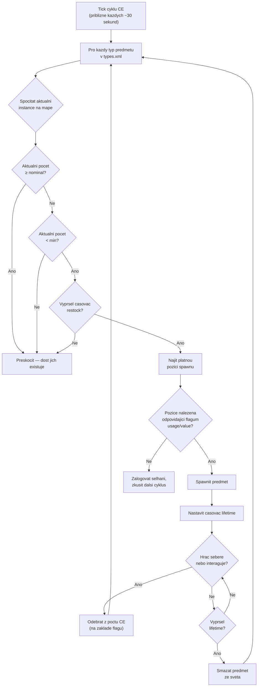

# Chapter 9.4: Lootova ekonomika podrobne

[Domu](../README.md) | [<< Predchozi: Reference serverDZ.cfg](03-server-cfg.md) | **Lootova ekonomika podrobne**

---

> **Shrnuti:** Centralni ekonomika (CE) je system, ktery ridi kazdy spawn predmetu v DayZ -- od plechovky fazoli na polici az po AKM ve vojenskem kasarni. Tato kapitola vysvetluje kompletni cyklus spawnu, dokumentuje kazde pole v `types.xml`, `globals.xml`, `events.xml` a `cfgspawnabletypes.xml` s realymi priklady z vanilkovych souboru serveru a pokryva nejcastejsi chyby ekonomiky.

---

## Obsah

- [Jak funguje Centralni ekonomika](#jak-funguje-centralni-ekonomika)
- [Cyklus spawnu](#cyklus-spawnu)
- [types.xml -- definice spawnu predmetu](#typesxml----definice-spawnu-predmetu)
- [Realne priklady types.xml](#realne-priklady-typesxml)
- [Reference poli types.xml](#reference-poli-typesxml)
- [globals.xml -- parametry ekonomiky](#globalsxml----parametry-ekonomiky)
- [events.xml -- dynamicke udalosti](#eventsxml----dynamicke-udalosti)
- [cfgspawnabletypes.xml -- prislusenstvi a naklad](#cfgspawnabletypesxml----prislusenstvi-a-naklad)
- [Vztah nominal/restock](#vztah-nominalrestock)
- [Caste chyby ekonomiky](#caste-chyby-ekonomiky)

---

## Jak funguje Centralni ekonomika

Centralni ekonomika (CE) je system na strane serveru, ktery bezi v nepretrziitem cyklu. Jejim ukolem je udrzovat populaci predmetu ve svete na urovnich definovanych ve vasich konfiguracnich souborech.

CE **neumistuje** predmety, kdyz hrac vstoupi do budovy. Misto toho bezi na globalnim casovaci a spawnuje predmety po cele mape, bez ohledu na blizkost hracu. Predmety maji **zivotnost** -- kdyz tento casovac vyprsi a zadny hrac s predmetem neinteragoval, CE ho odstrani. Poté v dalsim cyklu detekuje, ze pocet je pod cilovou hodnotou a spawnuje nahradu nekde jinde.

Klicove pojmy:

- **Nominal** -- cilovy pocet kopii predmetu, ktere by mely existovat na mape
- **Min** -- prah, pod kterym se CE pokusi predmet znovu spawnit
- **Lifetime** -- jak dlouho (v sekundach) nedotknuty predmet pretrva pred cistenim
- **Restock** -- minimalni cas (v sekundach) pred tim, nez CE muze spawnit nahradu po tom, co byl predmet sebran/znicen
- **Flags** -- co se pocita do celkoveho poctu (na mape, v nakladu, v inventari hrace, ve skrysich)

---

## Cyklus spawnu



Strucne: CE pocita, kolik kazdeho predmetu existuje, porovnava s cilovymi hodnotami nominal/min a spawnuje nahrady, kdyz pocet klesne pod `min` a casovac `restock` vyprsel.

---

## types.xml -- definice spawnu predmetu

Toto je nejdulezitejsi soubor ekonomiky. Kazdy predmet, ktery se muze spawnit ve svete, zde potrebuje zaznam. Vanilkovy `types.xml` pro Chernarus obsahuje priblizne 23 000 radku pokryvajicich tisice predmetu.

### Realne priklady types.xml

**Zbran -- AKM**

```xml
<type name="AKM">
    <nominal>3</nominal>
    <lifetime>7200</lifetime>
    <restock>3600</restock>
    <min>2</min>
    <quantmin>30</quantmin>
    <quantmax>80</quantmax>
    <cost>100</cost>
    <flags count_in_cargo="0" count_in_hoarder="0" count_in_map="1" count_in_player="0" crafted="0" deloot="0"/>
    <category name="weapons"/>
    <usage name="Military"/>
    <value name="Tier4"/>
</type>
```

AKM je vzacna, vysoke-tierova zbran. Na mape mohou soucasne existovat pouze 3 (`nominal`). Spawnuje se ve vojenskych budovach v oblastech Tier 4 (severozapad). Kdyz hrac jednu sebere, CE vidi, ze pocet na mape klesnul pod `min=2` a spawnuje nahradu po uplynuti alespon 3600 sekund (1 hodina). Zbran se spawnuje s 30-80 % munice ve vnitrnim zasobniku (`quantmin`/`quantmax`).

**Jidlo -- BakedBeansCan**

```xml
<type name="BakedBeansCan">
    <nominal>15</nominal>
    <lifetime>14400</lifetime>
    <restock>0</restock>
    <min>12</min>
    <quantmin>-1</quantmin>
    <quantmax>-1</quantmax>
    <cost>100</cost>
    <flags count_in_cargo="0" count_in_hoarder="0" count_in_map="1" count_in_player="0" crafted="0" deloot="0"/>
    <category name="food"/>
    <tag name="shelves"/>
    <usage name="Town"/>
    <usage name="Village"/>
    <value name="Tier1"/>
    <value name="Tier2"/>
    <value name="Tier3"/>
</type>
```

Fazole v plechovce jsou bezne jidlo. 15 plechovek by melo existovat v kazdem okamziku. Spawnuji se na policich v budovach Town a Village v Tierech 1-3 (pobrezí az stred mapy). `restock=0` znamena okamzitou zpusobilost k respawnu. `quantmin=-1` a `quantmax=-1` znamenaji, ze predmet nepouziva system mnozstvi (neni to kapalina ani kontejner na munici).

**Obleceni -- RidersJacket_Black**

```xml
<type name="RidersJacket_Black">
    <nominal>14</nominal>
    <lifetime>28800</lifetime>
    <restock>0</restock>
    <min>10</min>
    <quantmin>-1</quantmin>
    <quantmax>-1</quantmax>
    <cost>100</cost>
    <flags count_in_cargo="0" count_in_hoarder="0" count_in_map="1" count_in_player="0" crafted="0" deloot="0"/>
    <category name="clothes"/>
    <usage name="Town"/>
    <value name="Tier1"/>
    <value name="Tier2"/>
</type>
```

Bezna civilni bunda. 14 kopii na mape, k nalezeni v budovach Town blizko pobrezi (Tiery 1-2). Zivotnost 28800 sekund (8 hodin) znamena, ze pretrva dlouho, pokud ji nikdo nesebere.

**Lekarsky predmet -- BandageDressing**

```xml
<type name="BandageDressing">
    <nominal>40</nominal>
    <lifetime>14400</lifetime>
    <restock>0</restock>
    <min>30</min>
    <quantmin>-1</quantmin>
    <quantmax>-1</quantmax>
    <cost>100</cost>
    <flags count_in_cargo="0" count_in_hoarder="0" count_in_map="1" count_in_player="0" crafted="0" deloot="0"/>
    <category name="tools"/>
    <tag name="shelves"/>
    <usage name="Medic"/>
</type>
```

Obvazy jsou velmi bezne (40 nominal). Spawnuji se v budovach Medic (nemocnice, kliniky) ve vsech tierech (zadny tag `<value>` znamena vsechny tiery). Vsimnete si, ze kategorie je `"tools"`, ne `"medical"` -- DayZ nema kategorii medical; lekarske predmety pouzivaji kategorii tools.

**Zakazany predmet (varianta pro crafting)**

```xml
<type name="AK101_Black">
    <nominal>0</nominal>
    <lifetime>28800</lifetime>
    <restock>0</restock>
    <min>0</min>
    <quantmin>-1</quantmin>
    <quantmax>-1</quantmax>
    <cost>100</cost>
    <flags count_in_cargo="0" count_in_hoarder="0" count_in_map="1" count_in_player="0" crafted="1" deloot="0"/>
    <category name="weapons"/>
</type>
```

`nominal=0` a `min=0` znamena, ze CE tento predmet nikdy nespawnuje. `crafted=1` indikuje, ze je ziskatelny pouze craftingem (prebarvenim zbrane). Stale ma zivotnost, aby se ulozene instance nakonec vycistily.

---

## Reference poli types.xml

### Zakladni pole

| Pole | Typ | Rozsah | Popis |
|-------|------|-------|-------------|
| `name` | string | -- | Nazev tridy predmetu. Musi presne odpovidat nazvu tridy ve hre. |
| `nominal` | int | 0+ | Cilovy pocet tohoto predmetu na mape. Nastavte na 0 pro zabraneni spawnu. |
| `min` | int | 0+ | Kdyz pocet klesne na tuto hodnotu nebo nize, CE se pokusi spawnit vice. |
| `lifetime` | int | sekundy | Jak dlouho existuje nedotknuty predmet pred smazanim CE. |
| `restock` | int | sekundy | Minimalni cooldown pred tim, nez CE muze spawnit nahradu. 0 = okamzite. |
| `quantmin` | int | -1 az 100 | Minimalni procento mnozstvi pri spawnu (% munice, % kapaliny). -1 = nepouzitelne. |
| `quantmax` | int | -1 az 100 | Maximalni procento mnozstvi pri spawnu. -1 = nepouzitelne. |
| `cost` | int | 0+ | Prioritni vaha pro vyber spawnu. Vsechny vanilkove predmety aktualne pouzivaji 100. |

### Flagy

```xml
<flags count_in_cargo="0" count_in_hoarder="0" count_in_map="1" count_in_player="0" crafted="0" deloot="0"/>
```

| Flag | Hodnoty | Popis |
|------|--------|-------------|
| `count_in_map` | 0, 1 | Pocitat predmety lezici na zemi nebo na spawnovacich bodech v budovach. **Temer vzdy 1.** |
| `count_in_cargo` | 0, 1 | Pocitat predmety uvnitr jinych kontejneru (batohy, stany). |
| `count_in_hoarder` | 0, 1 | Pocitat predmety ve skrysich, sudech, zakopaných kontejnerech, stanech. |
| `count_in_player` | 0, 1 | Pocitat predmety v inventari hrace (na tele nebo v rukou). |
| `crafted` | 0, 1 | Kdyz je 1, tento predmet je ziskatelny pouze craftingem, ne spawnem CE. |
| `deloot` | 0, 1 | Loot dynamicke udalosti. Kdyz je 1, predmet se spawnuje pouze na mistech dynamickych udalosti (helikopterove zriceniny atd.). |

**Strategie flagu je dulezita.** Pokud je `count_in_player=1`, kazda AKM, kterou hrac nese, se pocita do nominalu. To znamena, ze sebrani AKM by nespustilo respawn, protoze se pocet nezmenil. Vetsina vanilkovych predmetu pouziva `count_in_player=0`, aby predmety v rukou hracu neblokovaly respawny.

### Tagy

| Element | Ucel | Definovano v |
|---------|---------|-----------|
| `<category name="..."/>` | Kategorie predmetu pro parovani spawnovacich bodu | `cfglimitsdefinition.xml` |
| `<usage name="..."/>` | Typ budovy, kde se tento predmet muze spawnit | `cfglimitsdefinition.xml` |
| `<value name="..."/>` | Zona tieru mapy, kde se tento predmet muze spawnit | `cfglimitsdefinition.xml` |
| `<tag name="..."/>` | Typ spawnovaci pozice uvnitr budovy | `cfglimitsdefinition.xml` |

**Platne kategorie:** `tools`, `containers`, `clothes`, `food`, `weapons`, `books`, `explosives`, `lootdispatch`

**Platne flagy pouziti:** `Military`, `Police`, `Medic`, `Firefighter`, `Industrial`, `Farm`, `Coast`, `Town`, `Village`, `Hunting`, `Office`, `School`, `Prison`, `Lunapark`, `SeasonalEvent`, `ContaminatedArea`, `Historical`

**Platne flagy hodnoty:** `Tier1`, `Tier2`, `Tier3`, `Tier4`, `Unique`

**Platne tagy:** `floor`, `shelves`, `ground`

Predmet muze mit **vice** tagu `<usage>` a `<value>`. Vice pouziti znamena, ze se muze spawnit v kterekoliv z techto typu budov. Vice hodnot znamena, ze se muze spawnit v kterekoliv z techto tieru.

Pokud uplne vynechate `<value>`, predmet se spawnuje ve **vsech** tierech. Pokud vynechate `<usage>`, predmet nema zadnou platnou lokaci spawnu a **nespawnuje se**.

---

## globals.xml -- parametry ekonomiky

Tento soubor ridi globalni chovani CE. Kazdy parametr z vanilkoveho souboru:

```xml
<variables>
    <var name="AnimalMaxCount" type="0" value="200"/>
    <var name="CleanupAvoidance" type="0" value="100"/>
    <var name="CleanupLifetimeDeadAnimal" type="0" value="1200"/>
    <var name="CleanupLifetimeDeadInfected" type="0" value="330"/>
    <var name="CleanupLifetimeDeadPlayer" type="0" value="3600"/>
    <var name="CleanupLifetimeDefault" type="0" value="45"/>
    <var name="CleanupLifetimeLimit" type="0" value="50"/>
    <var name="CleanupLifetimeRuined" type="0" value="330"/>
    <var name="FlagRefreshFrequency" type="0" value="432000"/>
    <var name="FlagRefreshMaxDuration" type="0" value="3456000"/>
    <var name="FoodDecay" type="0" value="1"/>
    <var name="IdleModeCountdown" type="0" value="60"/>
    <var name="IdleModeStartup" type="0" value="1"/>
    <var name="InitialSpawn" type="0" value="100"/>
    <var name="LootDamageMax" type="1" value="0.82"/>
    <var name="LootDamageMin" type="1" value="0.0"/>
    <var name="LootProxyPlacement" type="0" value="1"/>
    <var name="LootSpawnAvoidance" type="0" value="100"/>
    <var name="RespawnAttempt" type="0" value="2"/>
    <var name="RespawnLimit" type="0" value="20"/>
    <var name="RespawnTypes" type="0" value="12"/>
    <var name="RestartSpawn" type="0" value="0"/>
    <var name="SpawnInitial" type="0" value="1200"/>
    <var name="TimeHopping" type="0" value="60"/>
    <var name="TimeLogin" type="0" value="15"/>
    <var name="TimeLogout" type="0" value="15"/>
    <var name="TimePenalty" type="0" value="20"/>
    <var name="WorldWetTempUpdate" type="0" value="1"/>
    <var name="ZombieMaxCount" type="0" value="1000"/>
    <var name="ZoneSpawnDist" type="0" value="300"/>
</variables>
```

Atribut `type` indikuje datovy typ: `0` = integer, `1` = float.

### Kompletni reference parametru

| Parametr | Typ | Vychozi | Popis |
|-----------|------|---------|-------------|
| **AnimalMaxCount** | int | 200 | Maximalni pocet zvirat zivych na mape soucasne. |
| **CleanupAvoidance** | int | 100 | Vzdalenost v metrech od hrace, kde CE NEBUDE cistit predmety. Predmety v tomto okruhu jsou chraneny pred vyprselim zivotnosti. |
| **CleanupLifetimeDeadAnimal** | int | 1200 | Sekundy pred odstranenm mrtvoly zvírete. (20 minut) |
| **CleanupLifetimeDeadInfected** | int | 330 | Sekundy pred odstranenm mrtvoly zombie. (5,5 minuty) |
| **CleanupLifetimeDeadPlayer** | int | 3600 | Sekundy pred odstranenm mrtveho tela hrace. (1 hodina) |
| **CleanupLifetimeDefault** | int | 45 | Vychozi cas cisteni v sekundach pro predmety bez specificke zivotnosti. |
| **CleanupLifetimeLimit** | int | 50 | Maximalni pocet predmetu zpracovanych za cyklus cisteni. |
| **CleanupLifetimeRuined** | int | 330 | Sekundy pred vycistenim znicenych predmetu. (5,5 minuty) |
| **FlagRefreshFrequency** | int | 432000 | Jak casto musi byt vlajkovy stozar "obnoven" interakci, aby se zabranilo rozpadu baze, v sekundach. (5 dni) |
| **FlagRefreshMaxDuration** | int | 3456000 | Maximalni zivotnost vlajkoveho stozaru i pri pravidelnem obnovani, v sekundach. (40 dni) |
| **FoodDecay** | int | 1 | Povolit (1) nebo zakazat (0) kazeni jidla v case. |
| **IdleModeCountdown** | int | 60 | Sekundy pred vstupem serveru do rezimu necinnsti, kdyz nejsou pripojeni zadni hraci. |
| **IdleModeStartup** | int | 1 | Zda server startuje v rezimu necinnosti (1) nebo aktivnim rezimu (0). |
| **InitialSpawn** | int | 100 | Procento nominalnich hodnot ke spawnu pri prvnim spusteni serveru (0-100). |
| **LootDamageMax** | float | 0.82 | Maximalni stav poskozeni pro nahodne spawnovany loot (0.0 = pristine, 1.0 = ruined). |
| **LootDamageMin** | float | 0.0 | Minimalni stav poskozeni pro nahodne spawnovany loot. |
| **LootProxyPlacement** | int | 1 | Povolit (1) vizualni umisteni predmetu na policich/stolech vs. nahodne padani na podlahu. |
| **LootSpawnAvoidance** | int | 100 | Vzdalenost v metrech od hrace, kde CE NEBUDE spawnovat novy loot. Zabranuje pojavovani predmetu pred ocima hracu. |
| **RespawnAttempt** | int | 2 | Pocet pokusu o pozici spawnu na predmet za cyklus CE pred vzdasim se. |
| **RespawnLimit** | int | 20 | Maximalni pocet predmetu, ktere CE respawnuje za cyklus. |
| **RespawnTypes** | int | 12 | Maximalni pocet ruznych typu predmetu zpracovanych za cyklus respawnu. |
| **RestartSpawn** | int | 0 | Kdyz je 1, znovu nahodne rozmistit vsechny pozice lootu pri restartu serveru. Kdyz je 0, nacist z persistence. |
| **SpawnInitial** | int | 1200 | Pocet predmetu ke spawnu behem pocatecniho naplneni ekonomiky pri prvnim startu. |
| **TimeHopping** | int | 60 | Cooldown v sekundach branicimu hraci v opetovnem pripojeni ke stejnemu serveru (anti-server-hop). |
| **TimeLogin** | int | 15 | Odpocet prihlaseni v sekundach (casovac "Prosim cekejte" pri pripojovani). |
| **TimeLogout** | int | 15 | Odpocet odhlaseni v sekundach. Hrac zustava ve svete behem tohoto casu. |
| **TimePenalty** | int | 20 | Extra trestny cas v sekundach pridany k odpoctu odhlaseni pri nesprávnem odpojeni (Alt+F4). |
| **WorldWetTempUpdate** | int | 1 | Povolit (1) nebo zakazat (0) aktualizace svetovych teplot a vlhkosti. |
| **ZombieMaxCount** | int | 1000 | Maximalni pocet zombie zivych na mape soucasne. |
| **ZoneSpawnDist** | int | 300 | Vzdalenost v metrech od hrace, pri ktere se aktivuji spawnove zony zombie. |

### Bezne uprvy ladeni

**Vice lootu (PvP server):**
```xml
<var name="InitialSpawn" type="0" value="100"/>
<var name="RespawnLimit" type="0" value="50"/>
<var name="RespawnTypes" type="0" value="30"/>
<var name="RespawnAttempt" type="0" value="4"/>
```

**Delsi mrtvá tela (vice casu na lootovani zabitych):**
```xml
<var name="CleanupLifetimeDeadPlayer" type="0" value="7200"/>
```

**Kratsi rozpad bazi (rychlejsi cisteni neaktivnich bazi):**
```xml
<var name="FlagRefreshFrequency" type="0" value="259200"/>
<var name="FlagRefreshMaxDuration" type="0" value="1728000"/>
```

---

## events.xml -- dynamicke udalosti

Udalosti definuji spawny pro entity, ktere potrebuji specialni zachazeni: zvírata, vozidla a helikopterove zriceniny. Na rozdil od predmetu `types.xml`, ktere se spawnuji uvnitr budov, udalosti se spawnuji na preddefinovanych svetovych pozicich uvedenych v `cfgeventspawns.xml`.

### Realny priklad udalosti vozidla

```xml
<event name="VehicleCivilianSedan">
    <nominal>8</nominal>
    <min>5</min>
    <max>11</max>
    <lifetime>300</lifetime>
    <restock>0</restock>
    <saferadius>500</saferadius>
    <distanceradius>500</distanceradius>
    <cleanupradius>200</cleanupradius>
    <flags deletable="0" init_random="0" remove_damaged="1"/>
    <position>fixed</position>
    <limit>mixed</limit>
    <active>1</active>
    <children>
        <child lootmax="0" lootmin="0" max="5" min="3" type="CivilianSedan"/>
        <child lootmax="0" lootmin="0" max="5" min="3" type="CivilianSedan_Black"/>
        <child lootmax="0" lootmin="0" max="5" min="3" type="CivilianSedan_Wine"/>
    </children>
</event>
```

### Realny priklad udalosti zvírete

```xml
<event name="AnimalBear">
    <nominal>0</nominal>
    <min>2</min>
    <max>2</max>
    <lifetime>180</lifetime>
    <restock>0</restock>
    <saferadius>200</saferadius>
    <distanceradius>0</distanceradius>
    <cleanupradius>0</cleanupradius>
    <flags deletable="0" init_random="0" remove_damaged="1"/>
    <position>fixed</position>
    <limit>custom</limit>
    <active>1</active>
    <children>
        <child lootmax="0" lootmin="0" max="1" min="1" type="Animal_UrsusArctos"/>
    </children>
</event>
```

### Reference poli udalosti

| Pole | Popis |
|-------|-------------|
| `name` | Identifikator udalosti. Musi odpovidat zaznamu v `cfgeventspawns.xml` pro udalosti s `position="fixed"`. |
| `nominal` | Cilovy pocet aktivnich skupin udalosti na mape. |
| `min` | Minimalni pocet clenu skupiny na spawnovy bod. |
| `max` | Maximalni pocet clenu skupiny na spawnovy bod. |
| `lifetime` | Sekundy pred vycistenim a respawnem udalosti. U vozidel jde o interval kontroly respawnu, ne o zivotnost persistence vozidla. |
| `restock` | Minimalni sekundy mezi respawny. |
| `saferadius` | Minimalni vzdalenost v metrech od hrace pro spawn udalosti. |
| `distanceradius` | Minimalni vzdalenost mezi dvema instancemi stejne udalosti. |
| `cleanupradius` | Vzdalenost od jakehokoliv hrace, pod kterou udalost NEBUDE vycistena. |
| `deletable` | Zda muze CE smazat entitu udalosti (0 = ne). |
| `init_random` | Nahodne vygenerovat pocatecni pozice (0 = pouzit pevne pozice). |
| `remove_damaged` | Odstranit entitu udalosti, pokud se stane poskozenou/znicenou (1 = ano). |
| `position` | `"fixed"` = pouzit pozice z `cfgeventspawns.xml`. `"player"` = spawnovat v blizkosti hracu. |
| `limit` | `"child"` = limit pro kazdy detsky typ. `"mixed"` = limit sdileny mezi vsemi detmi. `"custom"` = specialni chovani. |
| `active` | 1 = povoleno, 0 = zakazano. |

### Deti (children)

Kazdy element `<child>` definuje variantu, ktera se muze spawnit:

| Atribut | Popis |
|-----------|-------------|
| `type` | Nazev tridy entity ke spawnu. |
| `min` | Minimalni pocet instanci teto varianty (pro `limit="child"`). |
| `max` | Maximalni pocet instanci teto varianty (pro `limit="child"`). |
| `lootmin` | Minimalni pocet lootovych predmetu spawnovaných uvnitr/na entite. |
| `lootmax` | Maximalni pocet lootovych predmetu spawnovaných uvnitr/na entite. |

---

## cfgspawnabletypes.xml -- prislusenstvi a naklad

Tento soubor definuje, jake prislusenstvi, naklad a stav poskozeni ma predmet pri spawnu. Bez zaznamu zde se predmety spawnuji prazdne a s nahodnym poskozenim (v rozsahu `LootDamageMin`/`LootDamageMax` z `globals.xml`).

### Zbran s prislusenstvim -- AKM

```xml
<type name="AKM">
    <damage min="0.45" max="0.85" />
    <attachments chance="1.00">
        <item name="AK_PlasticBttstck" chance="1.00" />
    </attachments>
    <attachments chance="1.00">
        <item name="AK_PlasticHndgrd" chance="1.00" />
    </attachments>
    <attachments chance="0.50">
        <item name="KashtanOptic" chance="0.30" />
        <item name="PSO11Optic" chance="0.20" />
    </attachments>
    <attachments chance="0.05">
        <item name="AK_Suppressor" chance="1.00" />
    </attachments>
    <attachments chance="0.30">
        <item name="Mag_AKM_30Rnd" chance="1.00" />
    </attachments>
</type>
```

Cteni tohoto zaznamu:

1. AKM se spawnuje s poskozenim 45-85 % (opotrebovana az silne poskozena)
2. **Vzdy** (100 %) dostane plastovou pazbu a predpazbi
3. 50% sance na obsazeni slotu optiky -- pokud ano, 30% sance na Kashtan, 20% na PSO-11
4. 5% sance na tlumič
5. 30% sance na nabity zasobnik

Kazdy blok `<attachments>` reprezentuje jeden slot prislusenstvi. Hodnota `chance` na bloku je pravdepodobnost, ze tento slot bude vubec obsazen. Hodnota `chance` na kazdem `<item>` uvnitr je relativni vaha vyberu -- CE vybere jeden predmet ze seznamu pomoci techto vah.

### Zbran s prislusenstvim -- M4A1

```xml
<type name="M4A1">
    <damage min="0.45" max="0.85" />
    <attachments chance="1.00">
        <item name="M4_OEBttstck" chance="1.00" />
    </attachments>
    <attachments chance="1.00">
        <item name="M4_PlasticHndgrd" chance="1.00" />
    </attachments>
    <attachments chance="1.00">
        <item name="BUISOptic" chance="0.50" />
        <item name="M4_CarryHandleOptic" chance="1.00" />
    </attachments>
    <attachments chance="0.30">
        <item name="Mag_CMAG_40Rnd" chance="0.15" />
        <item name="Mag_CMAG_10Rnd" chance="0.50" />
        <item name="Mag_CMAG_20Rnd" chance="0.70" />
        <item name="Mag_CMAG_30Rnd" chance="1.00" />
    </attachments>
</type>
```

### Vesta s kapsami -- PlateCarrierVest_Camo

```xml
<type name="PlateCarrierVest_Camo">
    <damage min="0.1" max="0.6" />
    <attachments chance="0.85">
        <item name="PlateCarrierHolster_Camo" chance="1.00" />
    </attachments>
    <attachments chance="0.85">
        <item name="PlateCarrierPouches_Camo" chance="1.00" />
    </attachments>
</type>
```

### Batoh s nakladem

```xml
<type name="AssaultBag_Ttsko">
    <cargo preset="mixArmy" />
    <cargo preset="mixArmy" />
    <cargo preset="mixArmy" />
</type>
```

Atribut `preset` odkazuje na lootovy pool definovany v `cfgrandompresets.xml`. Kazdy radek `<cargo>` je jedno hazeni -- tento batoh dostane 3 hazeni z poolu `mixArmy`. Vlastni hodnota `chance` poolu urcuje, zda kazde hazeni skutecne vyprodukovalo predmet.

### Predmety pouze pro hoardery

```xml
<type name="Barrel_Blue">
    <hoarder />
</type>
<type name="SeaChest">
    <hoarder />
</type>
```

Tag `<hoarder />` oznacuje predmety jako kontejnery pro hoardery. CE pocita predmety uvnitr techto kontejneru oddelene pomoci flagu `count_in_hoarder` z `types.xml`.

### Prepis poskozeni pri spawnu

```xml
<type name="BandageDressing">
    <damage min="0.0" max="0.0" />
</type>
```

Vynutí, aby se obvazy vzdy spawnily ve stavu Pristine, cimz prepise globalni `LootDamageMin`/`LootDamageMax` z `globals.xml`.

---

## Vztah nominal/restock

Pochopeni, jak spolu `nominal`, `min` a `restock` spolupracuji, je kriticke pro ladeni ekonomiky.

### Matematika

```
IF (aktualni_pocet < min) AND (cas_od_posledniho_spawnu > restock):
    spawnit novy predmet (az do nominal)
```

**Priklad s AKM:**
- `nominal = 3`, `min = 2`, `restock = 3600`
- Server startuje: CE spawnuje 3 AKM po mape
- Hrac sebere 1 AKM: pocet na mape klesne na 2
- Pocet (2) NENI mensi nez min (2), takze zadny respawn
- Hrac sebere dalsi AKM: pocet na mape klesne na 1
- Pocet (1) JE mensi nez min (2) a casovac restock (3600s = 1 hodina) se spusti
- Po 1 hodine CE spawnuje 2 nove AKM k dosazeni nominalu (3)

**Priklad s BakedBeansCan:**
- `nominal = 15`, `min = 12`, `restock = 0`
- Hrac sni plechovku: pocet na mape klesne na 14
- Pocet (14) NENI mensi nez min (12), takze zadny respawn
- Snezeny dalsi 3 plechovky: pocet klesne na 11
- Pocet (11) JE mensi nez min (12), restock je 0 (okamzite)
- Dalsi cyklus CE: spawnuje 4 plechovky k dosazeni nominalu (15)

### Klicove postrehy

- **Mezera mezi nominal a min** urcuje, kolik predmetu muze byt "spotrebovano" pred reakci CE. Mala mezera (jako AKM: 3/2) znamena, ze CE reaguje po pouhych 2 sebranych kusech. Velka mezera znamena, ze vice predmetu muze opustit ekonomiku pred aktivaci respawnu.

- **restock = 0** dela respawn efektivne okamzitym (dalsi cyklus CE). Vysoke hodnoty restock vytvareji nedostatek -- CE vi, ze potrebuje spawnit vice, ale musi cekat.

- **Lifetime** je nezavisly na nominal/min. I kdyz CE spawnulo predmet k dosazeni nominalu, predmet bude smazan po vyprsen jeho zivotnosti, pokud se ho nikdo nedotkne. To vytvari konstantni "obeh" predmetu objevujicich se a mizejicich po cele mape.

- Predmety, ktere hraci seberou a pozdeji polozi (na jinem miste), se stale pocitaji, pokud je prislusny flag nastaven. Polozena AKM na zemi se stale pocita do celkoveho poctu na mape, protoze `count_in_map=1`.

---

## Caste chyby ekonomiky

### Predmet ma zaznam v types.xml, ale nespawnuje se

**Kontrolujte v tomto poradi:**

1. Je `nominal` vetsi nez 0?
2. Ma predmet alespon jeden tag `<usage>`? (Zadne usage = zadna platna lokace spawnu)
3. Je tag `<usage>` definovany v `cfglimitsdefinition.xml`?
4. Je tag `<value>` (pokud je pritomen) definovany v `cfglimitsdefinition.xml`?
5. Je tag `<category>` platny?
6. Je predmet uveden v `cfgignorelist.xml`? (Predmety tam jsou blokovany)
7. Je flag `crafted` nastaven na 1? (Craftene predmety se nikdy prirozene nespawnuji)
8. Je `RestartSpawn` v `globals.xml` nastaven na 0 s existujici persistenci? (Stara persistence muze blokovat spawn novych predmetu do provedeni wipu)

### Predmety se spawnuji, ale okamzite zmizel

Hodnota `lifetime` je prilis nizka. Zivotnost 45 sekund (`CleanupLifetimeDefault`) znamena, ze predmet je vycisten temer okamzite. Zbrane by mely mit zivotnost 7200-28800 sekund.

### Prilis mnoho/malo predmetu

Upravte `nominal` a `min` spolecne. Pokud nastavite `nominal=100`, ale `min=1`, CE nespawnuje nahrady, dokud nebude sebrano 99 predmetu. Pokud chcete stabilni zasobovani, udrzujte `min` blizko `nominal` (napr. `nominal=20, min=15`).

### Predmety se spawnuji pouze v jedne oblasti

Zkontrolujte tagy `<value>`. Pokud ma predmet pouze `<value name="Tier4"/>`, spawnuje se pouze v severozapadni vojenské oblasti Chernarusu. Pridejte vice tieru pro rozsireni po mape:

```xml
<value name="Tier1"/>
<value name="Tier2"/>
<value name="Tier3"/>
<value name="Tier4"/>
```

### Modovane predmety se nespawnuji

Pri pridavani predmetu z modu do `types.xml`:

1. Ujistete se, ze mod je nacten (uveden v parametru `-mod=`)
2. Overte, ze nazev tridy je **presne** spravny (rozlisuje velka a mala pismena)
3. Pridejte predmetu tagy kategorie/pouziti/hodnoty -- samotny zaznam v `types.xml` nestaci
4. Pokud mod pridava nove tagy pouziti nebo hodnoty, pridejte je do `cfglimitsdefinitionuser.xml`
5. Zkontrolujte log skriptu na varovani o neznámych nazvech trid

### Dily vozidel se nespawnuji uvnitr vozidel

Dily vozidel se spawnuji pres `cfgspawnabletypes.xml`, ne `types.xml`. Pokud se vozidlo spawnuje bez kol nebo baterie, zkontrolujte, ze vozidlo ma zaznam v `cfgspawnabletypes.xml` s odpovidajicimi definicemi prislusenstvi.

### Veskerý loot je Pristine nebo veskerý loot je Ruined

Zkontrolujte `LootDamageMin` a `LootDamageMax` v `globals.xml`. Vanilkove hodnoty jsou `0.0` a `0.82`. Nastaveni obou na `0.0` udela vsechno pristine. Nastaveni obou na `1.0` udela vsechno ruined. Zkontrolujte take prepisy pro jednotlive predmety v `cfgspawnabletypes.xml`.

### Ekonomika se "zasekne" po uprave types.xml

Po uprave souboru ekonomiky provedte jedno z:
- Smazte `storage_1/` pro uplny wipe a novy start ekonomiky
- Nastavte `RestartSpawn` na `1` v `globals.xml` pro jeden restart k opetovnemu nahodnemu rozmisteni lootu, pak ho nastavte zpet na `0`
- Pockejte, az zivotnosti predmetu prirozene vyprsi (muze trvat hodiny)

---

**Predchozi:** [Reference serverDZ.cfg](03-server-cfg.md) | [Domu](../README.md) | **Dalsi:** [Spawnovani vozidel a dynamicke udalosti](05-vehicle-spawning.md)
