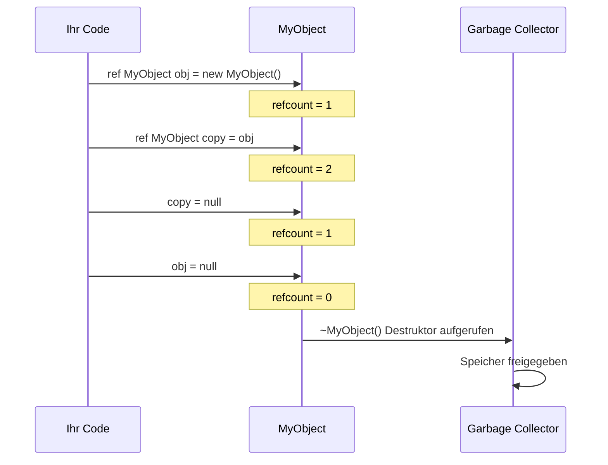
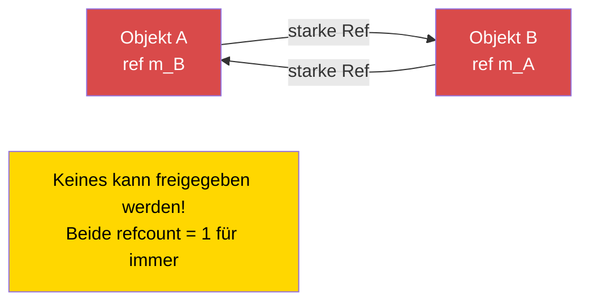

# Kapitel 1.8: Speicherverwaltung

[Startseite](../../README.md) | [<< Zurück: Mathematik & Vektoren](07-math-vectors.md) | **Speicherverwaltung** | [Weiter: Casting & Reflection >>](09-casting-reflection.md)

---

## Einführung

Enforce Script verwendet **automatische Referenzzählung (ARC)** zur Speicherverwaltung -- keine Garbage Collection im herkömmlichen Sinne. Zu verstehen, wie `ref`, `autoptr` und rohe Zeiger funktionieren, ist essenziell für das Schreiben stabiler DayZ-Mods. Macht man es falsch, leckt entweder der Speicher (der Server verbraucht allmählich mehr RAM, bis er abstürzt) oder man greift auf gelöschte Objekte zu (sofortiger Absturz ohne nützliche Fehlermeldung). Dieses Kapitel erklärt jeden Zeigertyp, wann jeder zu verwenden ist, und wie man die gefährlichste Falle vermeidet: Referenzzyklen.

---

## Die drei Zeigertypen

Enforce Script bietet drei Möglichkeiten, eine Referenz auf ein Objekt zu halten:

| Zeigertyp | Schlüsselwort | Hält Objekt am Leben? | Bei Löschung genullt? | Primärer Einsatz |
|-------------|---------|---------------------|-------------------|-------------|
| **Roher Zeiger** | *(keins)* | Nein (schwache Referenz) | Nur wenn die Klasse `Managed` erweitert | Rückreferenzen, Beobachter, Caches |
| **Starke Referenz** | `ref` | Ja | Ja | Besessene Mitglieder, Sammlungen |
| **Auto-Zeiger** | `autoptr` | Ja, bei Bereichsende gelöscht | Ja | Lokale Variablen |

### Wie ARC funktioniert

Jedes Objekt hat einen **Referenzzähler** -- die Anzahl starker Referenzen (`ref`, `autoptr`, lokale Variablen, Funktionsargumente), die auf es zeigen. Wenn der Zähler auf null fällt, wird das Objekt automatisch zerstört und sein Destruktor aufgerufen.

**Schwache Referenzen** (rohe Zeiger) erhöhen den Referenzzähler NICHT. Sie beobachten das Objekt, ohne es am Leben zu halten.

---

## Rohe Zeiger (Schwache Referenzen)

Ein roher Zeiger ist jede Variable, die ohne `ref` oder `autoptr` deklariert wird. Für Klassenmitglieder erzeugt dies eine **schwache Referenz**: Sie zeigt auf das Objekt, hält es aber NICHT am Leben.

```c
class Observer
{
    PlayerBase m_WatchedPlayer;  // Schwache Referenz -- hält den Spieler NICHT am Leben

    void Watch(PlayerBase player)
    {
        m_WatchedPlayer = player;
    }

    void Report()
    {
        if (m_WatchedPlayer) // Schwache Referenzen IMMER auf null prüfen
        {
            Print("Beobachte: " + m_WatchedPlayer.GetIdentity().GetName());
        }
        else
        {
            Print("Spieler existiert nicht mehr");
        }
    }
}
```

### Managed vs. Nicht-Managed-Klassen

Die Sicherheit schwacher Referenzen hängt davon ab, ob die Klasse des Objekts `Managed` erweitert:

- **Managed-Klassen** (die meisten DayZ-Gameplay-Klassen): Wenn das Objekt gelöscht wird, werden alle schwachen Referenzen automatisch auf `null` gesetzt. Das ist sicher.
- **Nicht-Managed-Klassen** (einfache `class` ohne Vererbung von `Managed`): Wenn das Objekt gelöscht wird, werden schwache Referenzen zu **hängenden Zeigern** -- sie halten noch die alte Speicheradresse. Der Zugriff auf sie verursacht einen Absturz.

```c
// SICHER -- Managed-Klasse, schwache Referenzen werden genullt
class SafeData : Managed
{
    int m_Value;
}

void TestManaged()
{
    SafeData data = new SafeData();
    SafeData weakRef = data;
    delete data;

    if (weakRef) // false -- weakRef wurde automatisch auf null gesetzt
    {
        Print(weakRef.m_Value); // Wird nie erreicht
    }
}
```

```c
// GEFÄHRLICH -- Nicht-Managed-Klasse, schwache Referenzen werden hängend
class UnsafeData
{
    int m_Value;
}

void TestNonManaged()
{
    UnsafeData data = new UnsafeData();
    UnsafeData weakRef = data;
    delete data;

    if (weakRef) // WAHR -- weakRef hält noch die alte Adresse!
    {
        Print(weakRef.m_Value); // ABSTURZ! Zugriff auf gelöschten Speicher
    }
}
```

> **Regel:** Wenn Sie eigene Klassen schreiben, erweitern Sie immer `Managed` für die Sicherheit. Die meisten DayZ-Engine-Klassen (EntityAI, ItemBase, PlayerBase, usw.) erben bereits von `Managed`.

---

## ref (Starke Referenz)

Das Schlüsselwort `ref` markiert eine Variable als **starke Referenz**. Das Objekt bleibt am Leben, solange mindestens eine starke Referenz existiert. Wenn die letzte starke Referenz zerstört oder überschrieben wird, wird das Objekt gelöscht.

### Klassenmitglieder

Verwenden Sie `ref` für Objekte, die Ihre Klasse **besitzt** und für deren Erstellung und Zerstörung sie verantwortlich ist.

```c
class MissionManager
{
    protected ref array<ref MissionBase> m_ActiveMissions;
    protected ref map<string, ref MissionConfig> m_Configs;
    protected ref MyLog m_Logger;

    void MissionManager()
    {
        m_ActiveMissions = new array<ref MissionBase>;
        m_Configs = new map<string, ref MissionConfig>;
        m_Logger = new MyLog;
    }

    // Kein Destruktor nötig! Wenn MissionManager gelöscht wird:
    // 1. m_Logger-Ref wird freigegeben -> MyLog wird gelöscht
    // 2. m_Configs-Ref wird freigegeben -> Map wird gelöscht -> jede MissionConfig wird gelöscht
    // 3. m_ActiveMissions-Ref wird freigegeben -> Array wird gelöscht -> jede MissionBase wird gelöscht
}
```

### Sammlungen besessener Objekte

Wenn Sie Objekte in einem Array oder einer Map speichern und die Sammlung sie besitzen soll, verwenden Sie `ref` sowohl für die Sammlung ALS AUCH für die Elemente:

```c
class ZoneManager
{
    // Das Array ist besessen (ref), und jede Zone darin ist besessen (ref)
    protected ref array<ref SafeZone> m_Zones;

    void ZoneManager()
    {
        m_Zones = new array<ref SafeZone>;
    }

    void AddZone(vector center, float radius)
    {
        ref SafeZone zone = new SafeZone(center, radius);
        m_Zones.Insert(zone);
    }
}
```

**Kritische Unterscheidung:** Ein `array<SafeZone>` hält **schwache** Referenzen. Ein `array<ref SafeZone>` hält **starke** Referenzen. Wenn Sie die schwache Version verwenden, können in das Array eingefügte Objekte sofort gelöscht werden, weil keine starke Referenz sie am Leben hält.

```c
// FALSCH -- Objekte werden sofort nach dem Einfügen gelöscht!
ref array<MyClass> weakArray = new array<MyClass>;
weakArray.Insert(new MyClass()); // Objekt erstellt, als schwache Ref eingefügt,
                                  // keine starke Ref existiert -> SOFORT gelöscht

// RICHTIG -- Objekte werden vom Array am Leben gehalten
ref array<ref MyClass> strongArray = new array<ref MyClass>;
strongArray.Insert(new MyClass()); // Objekt lebt, solange es im Array ist
```

---

## autoptr (Bereichsbezogene starke Referenz)

`autoptr` ist identisch mit `ref`, ist aber für **lokale Variablen** gedacht. Das Objekt wird automatisch gelöscht, wenn die Variable den Gültigkeitsbereich verlässt (wenn die Funktion zurückkehrt).

```c
void ProcessData()
{
    autoptr JsonSerializer serializer = new JsonSerializer;
    // serializer verwenden...

    // serializer wird hier automatisch gelöscht, wenn die Funktion endet
}
```

### Wann autoptr verwenden

In der Praxis sind **lokale Variablen standardmäßig bereits starke Referenzen** in Enforce Script. Das Schlüsselwort `autoptr` macht dies explizit und selbstdokumentierend. Sie können beides verwenden:

```c
void Example()
{
    // Diese sind funktional gleichwertig:
    MyClass a = new MyClass();       // Lokale Var = starke Ref (implizit)
    autoptr MyClass b = new MyClass(); // Lokale Var = starke Ref (explizit)

    // Sowohl a als auch b werden gelöscht, wenn diese Funktion endet
}
```

> **Konvention im DayZ-Modding:** Die meisten Codebasen verwenden `ref` für Klassenmitglieder und lassen `autoptr` für lokale Variablen weg (da sie sich auf das implizite Verhalten starker Referenzen verlassen). Die CLAUDE.md für dieses Projekt merkt an: "**`autoptr` wird NICHT verwendet** -- verwende explizites `ref`." Folgen Sie der Konvention, die Ihr Projekt festlegt.

---

## notnull-Parametermodifikator

Der `notnull`-Modifikator bei einem Funktionsparameter teilt dem Compiler mit, dass null kein gültiges Argument ist. Der Compiler erzwingt dies an den Aufrufstellen.

```c
void ProcessPlayer(notnull PlayerBase player)
{
    // Keine Null-Prüfung nötig -- der Compiler garantiert es
    string name = player.GetIdentity().GetName();
    Print("Verarbeite: " + name);
}

void CallExample(PlayerBase maybeNull)
{
    if (maybeNull)
    {
        ProcessPlayer(maybeNull); // OK -- wir haben vorher geprüft
    }

    // ProcessPlayer(null); // KOMPILIERFEHLER: null kann nicht an notnull-Parameter übergeben werden
}
```

Verwenden Sie `notnull` bei Parametern, bei denen null immer ein Programmierfehler wäre. Es fängt Fehler zur Kompilierzeit ab, anstatt zur Laufzeit Abstürze zu verursachen.

---

## Referenzzyklen (WARNUNG VOR SPEICHERLECKS)

Ein Referenzzyklus tritt auf, wenn zwei Objekte starke Referenzen (`ref`) aufeinander halten. Keines der Objekte kann jemals gelöscht werden, weil jedes das andere am Leben hält. Das ist die häufigste Quelle von Speicherlecks in DayZ-Mods.

### Das Problem

```c
class Parent
{
    ref Child m_Child; // Starke Referenz auf Child
}

class Child
{
    ref Parent m_Parent; // Starke Referenz auf Parent -- ZYKLUS!
}

void CreateCycle()
{
    ref Parent parent = new Parent();
    ref Child child = new Child();

    parent.m_Child = child;
    child.m_Parent = parent;

    // Wenn diese Funktion endet:
    // - Die lokale 'parent'-Ref wird freigegeben, aber child.m_Parent hält parent noch am Leben
    // - Die lokale 'child'-Ref wird freigegeben, aber parent.m_Child hält child noch am Leben
    // KEINES der Objekte wird jemals gelöscht! Das ist ein permanentes Speicherleck.
}
```

### Die Lösung: Eine Seite muss eine rohe (schwache) Referenz sein

Brechen Sie den Zyklus, indem Sie eine Seite zu einer schwachen Referenz machen. Das "Kind" sollte eine schwache Referenz auf sein "Elternteil" halten:

```c
class Parent
{
    ref Child m_Child; // Stark -- Elternteil BESITZT das Kind
}

class Child
{
    Parent m_Parent; // Schwach (roh) -- Kind BEOBACHTET das Elternteil
}

void NoCycle()
{
    ref Parent parent = new Parent();
    ref Child child = new Child();

    parent.m_Child = child;
    child.m_Parent = parent;

    // Wenn diese Funktion endet:
    // - Lokale 'parent'-Ref wird freigegeben -> Referenzzähler von parent = 0 -> GELÖSCHT
    // - Parent-Destruktor gibt m_Child frei -> Referenzzähler von child = 0 -> GELÖSCHT
    // Beide Objekte werden ordnungsgemäß bereinigt!
}
```

### Praxisbeispiel: UI-Panels

Ein häufiges Muster im DayZ-UI-Code ist ein Panel, das Widgets hält, wobei Widgets eine Referenz zurück auf das Panel benötigen. Das Panel besitzt die Widgets (starke Ref), und Widgets beobachten das Panel (schwache Ref).

```c
class AdminPanel
{
    protected ref array<ref AdminPanelTab> m_Tabs; // Besitzt die Tabs

    void AdminPanel()
    {
        m_Tabs = new array<ref AdminPanelTab>;
    }

    void AddTab(string name)
    {
        ref AdminPanelTab tab = new AdminPanelTab(name, this);
        m_Tabs.Insert(tab);
    }
}

class AdminPanelTab
{
    protected string m_Name;
    protected AdminPanel m_Owner; // SCHWACH -- vermeidet Zyklus

    void AdminPanelTab(string name, AdminPanel owner)
    {
        m_Name = name;
        m_Owner = owner; // Schwache Referenz zurück zum Elternteil
    }

    AdminPanel GetOwner()
    {
        return m_Owner; // Kann null sein, wenn das Panel gelöscht wurde
    }
}
```

### Lebenszyklus der Referenzzählung



### Referenzzyklus (Speicherleck)



---

## Das delete-Schlüsselwort

Sie können ein Objekt jederzeit manuell mit `delete` löschen. Dies zerstört das Objekt **sofort**, unabhängig von seinem Referenzzähler. Alle Referenzen (sowohl starke als auch schwache, bei Managed-Klassen) werden auf null gesetzt.

```c
void ManualDelete()
{
    ref MyClass obj = new MyClass();
    ref MyClass anotherRef = obj;

    Print(obj != null);        // true
    Print(anotherRef != null); // true

    delete obj;

    Print(obj != null);        // false
    Print(anotherRef != null); // false (ebenfalls genullt, bei Managed-Klassen)
}
```

### Wann delete verwenden

- Wenn Sie eine Ressource **sofort** freigeben müssen (nicht auf ARC warten)
- Bei der Bereinigung in einer Shutdown-/Destroy-Methode
- Beim Entfernen von Objekten aus der Spielwelt (`GetGame().ObjectDelete(obj)` für Spielentitäten)

### Wann NICHT delete verwenden

- Bei Objekten, die jemand anderem gehören (die `ref` des Besitzers wird unerwartet null)
- Bei Objekten, die noch von anderen Systemen verwendet werden (Timer, Callbacks, UI)
- Bei Engine-verwalteten Entitäten ohne den korrekten Weg

---

## Garbage-Collection-Verhalten

Enforce Script hat KEINEN traditionellen Garbage Collector, der periodisch nach unerreichbaren Objekten sucht. Stattdessen verwendet es **deterministische Referenzzählung:**

1. Wenn eine starke Referenz erstellt wird (Zuweisung an `ref`, lokale Variable, Funktionsargument), erhöht sich der Referenzzähler des Objekts.
2. Wenn eine starke Referenz den Gültigkeitsbereich verlässt oder überschrieben wird, sinkt der Referenzzähler.
3. Wenn der Referenzzähler null erreicht, wird das Objekt **sofort** zerstört (Destruktor wird aufgerufen, Speicher wird freigegeben).
4. `delete` umgeht den Referenzzähler und zerstört das Objekt sofort.

Das bedeutet:
- Objekt-Lebenszeiten sind vorhersagbar und deterministisch
- Es gibt keine "GC-Pausen" oder unvorhersehbare Verzögerungen
- Referenzzyklen werden NIE eingesammelt -- sie sind permanente Lecks
- Die Zerstörungsreihenfolge ist wohldefiniert: Objekte werden in umgekehrter Reihenfolge der Freigabe ihrer letzten Referenz zerstört

---

## Praxisbeispiel: Korrekte Manager-Klasse

Hier ist ein vollständiges Beispiel, das korrekte Speicherverwaltungsmuster für einen typischen DayZ-Mod-Manager zeigt:

```c
class MyZoneManager
{
    // Singleton-Instanz -- die einzige starke Ref, die dies am Leben hält
    private static ref MyZoneManager s_Instance;

    // Besessene Sammlungen -- der Manager ist für diese verantwortlich
    protected ref array<ref MyZone> m_Zones;
    protected ref map<string, ref MyZoneConfig> m_Configs;

    // Schwache Referenz auf ein externes System -- wir besitzen das nicht
    protected PlayerBase m_LastEditor;

    void MyZoneManager()
    {
        m_Zones = new array<ref MyZone>;
        m_Configs = new map<string, ref MyZoneConfig>;
    }

    void ~MyZoneManager()
    {
        // Explizite Bereinigung (optional -- ARC erledigt es, aber gute Praxis)
        m_Zones.Clear();
        m_Configs.Clear();
        m_LastEditor = null;

        Print("[MyZoneManager] Zerstört");
    }

    static MyZoneManager GetInstance()
    {
        if (!s_Instance)
        {
            s_Instance = new MyZoneManager();
        }
        return s_Instance;
    }

    static void DestroyInstance()
    {
        s_Instance = null; // Gibt die starke Ref frei, löst Destruktor aus
    }

    void CreateZone(string name, vector center, float radius, PlayerBase editor)
    {
        ref MyZoneConfig config = new MyZoneConfig(name, center, radius);
        m_Configs.Set(name, config);

        ref MyZone zone = new MyZone(config);
        m_Zones.Insert(zone);

        m_LastEditor = editor; // Schwache Referenz -- wir besitzen den Spieler nicht
    }

    void RemoveZone(int index)
    {
        if (!m_Zones.IsValidIndex(index))
            return;

        MyZone zone = m_Zones.Get(index);
        string name = zone.GetName();

        m_Zones.RemoveOrdered(index); // Starke Ref freigegeben, Zone kann gelöscht werden
        m_Configs.Remove(name);       // Config-Ref freigegeben, Config gelöscht
    }

    MyZone FindZoneAtPosition(vector pos)
    {
        foreach (MyZone zone : m_Zones)
        {
            if (zone.ContainsPosition(pos))
                return zone; // Schwache Referenz an den Aufrufer zurückgeben
        }
        return null;
    }
}

class MyZone
{
    protected string m_Name;
    protected vector m_Center;
    protected float m_Radius;
    protected MyZoneConfig m_Config; // Schwach -- Config gehört dem Manager

    void MyZone(MyZoneConfig config)
    {
        m_Config = config; // Schwache Referenz
        m_Name = config.GetName();
        m_Center = config.GetCenter();
        m_Radius = config.GetRadius();
    }

    string GetName() { return m_Name; }

    bool ContainsPosition(vector pos)
    {
        return vector.Distance(m_Center, pos) <= m_Radius;
    }
}

class MyZoneConfig
{
    protected string m_Name;
    protected vector m_Center;
    protected float m_Radius;

    void MyZoneConfig(string name, vector center, float radius)
    {
        m_Name = name;
        m_Center = center;
        m_Radius = radius;
    }

    string GetName() { return m_Name; }
    vector GetCenter() { return m_Center; }
    float GetRadius() { return m_Radius; }
}
```

### Speicher-Besitzdiagramm für dieses Beispiel

```
MyZoneManager (Singleton, besessen durch statisches s_Instance)
  |
  |-- ref array<ref MyZone>   m_Zones     [STARK -> STARKE Elemente]
  |     |
  |     +-- MyZone
  |           |-- MyZoneConfig m_Config    [SCHWACH -- besessen durch m_Configs]
  |
  |-- ref map<string, ref MyZoneConfig> m_Configs  [STARK -> STARKE Elemente]
  |     |
  |     +-- MyZoneConfig                   [Hier BESESSEN]
  |
  +-- PlayerBase m_LastEditor                [SCHWACH -- besessen durch die Engine]
```

Wenn `DestroyInstance()` aufgerufen wird:
1. `s_Instance` wird auf null gesetzt und gibt die starke Referenz frei
2. Der `MyZoneManager`-Destruktor läuft
3. `m_Zones` wird freigegeben -> Array wird gelöscht -> jede `MyZone` wird gelöscht
4. `m_Configs` wird freigegeben -> Map wird gelöscht -> jede `MyZoneConfig` wird gelöscht
5. `m_LastEditor` ist eine schwache Referenz, nichts zu bereinigen
6. Aller Speicher ist freigegeben. Keine Lecks.

---

## Bewährte Praktiken

- Verwenden Sie `ref` für Klassenmitglieder, die Ihre Klasse erstellt und besitzt; verwenden Sie rohe Zeiger (kein Schlüsselwort) für Rückreferenzen und externe Beobachtungen.
- Erweitern Sie immer `Managed` für reine Script-Klassen -- es stellt sicher, dass schwache Referenzen bei der Löschung genullt werden und verhindert hängende-Zeiger-Abstürze.
- Brechen Sie Referenzzyklen, indem das Kind einen rohen Zeiger auf sein Elternteil hält: Elternteil besitzt Kind (`ref`), Kind beobachtet Elternteil (roh).
- Verwenden Sie `array<ref MyClass>`, wenn die Sammlung ihre Elemente besitzt; `array<MyClass>` hält schwache Referenzen, die Objekte nicht am Leben halten.
- Bevorzugen Sie ARC-gesteuerte Bereinigung gegenüber manuellem `delete` -- lassen Sie die letzte `ref`-Freigabe den Destruktor natürlich auslösen.

---

## In echten Mods beobachtet

> Muster bestätigt durch die Untersuchung professioneller DayZ-Mod-Quellcodes.

| Muster | Mod | Detail |
|---------|-----|--------|
| Eltern-`ref` + Kind-Roh-Rückzeiger | COT / Expansion UI | Panels besitzen Tabs mit `ref`, Tabs halten rohe Zeiger auf das Eltern-Panel, um Zyklen zu vermeiden |
| `static ref`-Singleton + `Destroy()`-Nullsetzung | Dabs / VPP | Alle Singletons verwenden `s_Instance = null` in einer statischen `Destroy()`, um die Bereinigung auszulösen |
| `ref array<ref T>` für verwaltete Sammlungen | Expansion Market | Sowohl das Array als auch seine Elemente sind `ref`, um korrektes Besitztum sicherzustellen |
| Roher Zeiger für Engine-Entitäten (Spieler, Items) | COT Admin | Spielerreferenzen werden als rohe Zeiger gespeichert, da die Engine die Entitäts-Lebensdauer verwaltet |

---

## Theorie vs. Praxis

| Konzept | Theorie | Realität |
|---------|---------|---------|
| `autoptr` für lokale Variablen | Sollte beim Verlassen des Gültigkeitsbereichs automatisch löschen | Lokale Variablen sind bereits implizit starke Referenzen; `autoptr` wird in der Praxis selten verwendet |
| ARC erledigt die gesamte Bereinigung | Objekte werden freigegeben, wenn der Referenzzähler null erreicht | Referenzzyklen werden nie eingesammelt -- sie lecken permanent bis zum Server-Neustart |
| `delete` für sofortige Bereinigung | Zerstört das Objekt sofort | Kann Referenzen anderer Systeme unerwartet nullen -- bevorzugen Sie, ARC damit umgehen zu lassen |

---

## Häufige Fehler

| Fehler | Problem | Lösung |
|---------|---------|-----|
| Zwei Objekte mit `ref` aufeinander | Referenzzyklus, permanentes Speicherleck | Eine Seite muss eine rohe (schwache) Referenz sein |
| `array<MyClass>` statt `array<ref MyClass>` | Elemente sind schwache Referenzen, Objekte können sofort gelöscht werden | Verwenden Sie `array<ref MyClass>` für besessene Elemente |
| Zugriff auf einen rohen Zeiger nach Löschung des Objekts | Absturz (hängender Zeiger bei Nicht-Managed-Klassen) | Erweitern Sie `Managed` und prüfen Sie schwache Referenzen immer auf null |
| Schwache Referenzen nicht auf null prüfen | Absturz, wenn das referenzierte Objekt gelöscht wurde | Immer: `if (weakRef) { weakRef.DoThing(); }` |
| `delete` bei Objekten verwenden, die einem anderen System gehören | Die `ref` des Besitzers wird unerwartet null | Lassen Sie den Besitzer das Objekt durch ARC freigeben |
| `ref` auf Engine-Entitäten (Spieler, Items) speichern | Kann mit der Engine-Lebenszeitverwaltung konfligieren | Verwenden Sie rohe Zeiger für Engine-Entitäten |
| `ref` bei Klassenmitglieder-Sammlungen vergessen | Sammlung ist eine schwache Referenz, kann eingesammelt werden | Immer: `protected ref array<...> m_List;` |
| Zirkuläres Eltern-Kind mit `ref` auf beiden Seiten | Klassischer Zyklus; weder Elternteil noch Kind wird jemals freigegeben | Elternteil besitzt Kind (`ref`), Kind beobachtet Elternteil (roh) |

---

## Entscheidungsleitfaden: Welcher Zeigertyp?

```
Ist dies ein Klassenmitglied, das diese Klasse ERSTELLT und BESITZT?
  -> JA: Verwende ref
  -> NEIN: Ist dies eine Rückreferenz oder externe Beobachtung?
    -> JA: Verwende rohen Zeiger (kein Schlüsselwort), immer null prüfen
    -> NEIN: Ist dies eine lokale Variable in einer Funktion?
      -> JA: Roh ist in Ordnung (lokale Variablen sind implizit stark)
      -> Explizites autoptr ist optional für Klarheit

Objekte in einer Sammlung (Array/Map) speichern?
  -> Objekte BESESSEN von der Sammlung: array<ref MyClass>
  -> Objekte BEOBACHTET von der Sammlung: array<MyClass>

Funktionsparameter, der nie null sein darf?
  -> Verwende notnull-Modifikator
```

---

## Kurzreferenz

```c
// Roher Zeiger (schwache Referenz für Klassenmitglieder)
MyClass m_Observer;              // Hält Objekt NICHT am Leben
                                 // Bei Löschung auf null gesetzt (nur Managed)

// Starke Referenz (hält Objekt am Leben)
ref MyClass m_Owned;             // Objekt lebt, bis ref freigegeben wird
ref array<ref MyClass> m_List;   // Array UND Elemente werden stark gehalten

// Auto-Zeiger (bereichsbezogene starke Referenz)
autoptr MyClass local;           // Wird gelöscht, wenn der Bereich endet

// notnull (Kompilierzeit-Null-Schutz)
void Func(notnull MyClass obj);  // Compiler lehnt null-Argumente ab

// Manuelles delete (sofort, umgeht ARC)
delete obj;                      // Zerstört sofort, nullt alle Refs (Managed)

// Referenzzyklen brechen: eine Seite muss schwach sein
class Parent { ref Child m_Child; }      // Stark -- Elternteil besitzt Kind
class Child  { Parent m_Parent; }        // Schwach -- Kind beobachtet Elternteil
```

---

[<< 1.7: Mathematik & Vektoren](07-math-vectors.md) | [Startseite](../../README.md) | [1.9: Casting & Reflection >>](09-casting-reflection.md)
