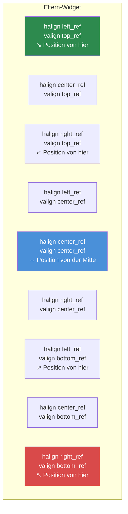

# Kapitel 3.3: Größen und Positionierung

[Startseite](../../README.md) | [<< Zurück: Layout-Dateiformat](02-layout-files.md) | **Größen und Positionierung** | [Weiter: Container-Widgets >>](04-containers.md)

---

Das DayZ-Layout-System verwendet einen **dualen Koordinatenmodus** -- jede Dimension kann entweder proportional (relativ zum Eltern-Widget) oder pixelbasiert (absolute Bildschirmpixel) sein. Das Missverständnis dieses Systems ist die häufigste Ursache für Layout-Fehler. Dieses Kapitel erklärt es ausführlich.

---

## Das Kernkonzept: Proportional vs. Pixel

Jedes Widget hat eine Position (`x, y`) und eine Größe (`Breite, Höhe`). Jeder dieser vier Werte kann unabhängig entweder sein:

- **Proportional** (0.0 bis 1.0) -- relativ zu den Abmessungen des Eltern-Widgets
- **Pixel** (jede positive Zahl) -- absolute Bildschirmpixel

Der Modus für jede Achse wird durch vier Flags gesteuert:

| Flag | Steuert | `0` = Proportional | `1` = Pixel |
|------|---------|---------------------|-------------|
| `hexactpos` | X-Position | Bruchteil der Elternbreite | Pixel von links |
| `vexactpos` | Y-Position | Bruchteil der Elternhöhe | Pixel von oben |
| `hexactsize` | Breite | Bruchteil der Elternbreite | Pixelbreite |
| `vexactsize` | Höhe | Bruchteil der Elternhöhe | Pixelhöhe |

Das bedeutet, Sie können Modi frei mischen. Zum Beispiel kann ein Widget eine proportionale Breite aber eine Pixelhöhe haben -- ein sehr häufiges Muster für Zeilen und Balken.

---

## Proportionalen Modus verstehen

Wenn ein Flag `0` (proportional) ist, repräsentiert der Wert einen **Bruchteil der Elterndimension**:

- `size 1 1` mit `hexactsize 0` und `vexactsize 0` bedeutet "100% der Elternbreite, 100% der Elternhöhe" -- das Kind füllt das Eltern-Widget.
- `size 0.5 0.3` bedeutet "50% der Elternbreite, 30% der Elternhöhe."
- `position 0.5 0` mit `hexactpos 0` bedeutet "starte bei 50% der Elternbreite von links."

Der proportionale Modus ist auflösungsunabhängig. Das Widget skaliert automatisch, wenn das Eltern-Widget seine Größe ändert oder wenn das Spiel in einer anderen Auflösung läuft.

```
// Ein Widget, das die linke Hälfte seines Eltern-Widgets füllt
FrameWidgetClass LeftHalf {
 position 0 0
 size 0.5 1
 hexactpos 0
 vexactpos 0
 hexactsize 0
 vexactsize 0
}
```

---

## Pixelmodus verstehen

Wenn ein Flag `1` (Pixel/exakt) ist, ist der Wert in **Bildschirmpixeln**:

- `size 200 40` mit `hexactsize 1` und `vexactsize 1` bedeutet "200 Pixel breit, 40 Pixel hoch."
- `position 10 10` mit `hexactpos 1` und `vexactpos 1` bedeutet "10 Pixel vom linken Rand des Eltern-Widgets, 10 Pixel vom oberen Rand des Eltern-Widgets."

Der Pixelmodus gibt Ihnen exakte Kontrolle, skaliert aber NICHT automatisch mit der Auflösung.

```
// Ein Button fester Größe: 120x30 Pixel
ButtonWidgetClass MyButton {
 position 10 10
 size 120 30
 hexactpos 1
 vexactpos 1
 hexactsize 1
 vexactsize 1
 text "Klick mich"
}
```

---

## Modi mischen: Das häufigste Muster

Die wahre Stärke liegt im Mischen von proportionalen und Pixelmodi. Das häufigste Muster in professionellen DayZ-Mods ist:

**Proportionale Breite, Pixelhöhe** -- für Balken, Zeilen und Kopfzeilen.

```
// Volle Breite, genau 30 Pixel hoch
FrameWidgetClass Row {
 position 0 0
 size 1 30
 hexactpos 0
 vexactpos 0
 hexactsize 0        // Breite: proportional (100% des Eltern-Widgets)
 vexactsize 1        // Höhe: Pixel (30px)
}
```

**Proportionale Breite und Höhe, Pixelposition** -- für zentrierte Panels mit festem Versatz.

```
// 60% x 70% Panel, 0px Versatz von der Mitte
FrameWidgetClass Dialog {
 position 0 0
 size 0.6 0.7
 halign center_ref
 valign center_ref
 hexactpos 1         // Position: Pixel (0px Versatz von der Mitte)
 vexactpos 1
 hexactsize 0        // Größe: proportional (60% x 70%)
 vexactsize 0
}
```

---

## Ausrichtungsreferenzen: halign und valign

Die Attribute `halign` und `valign` ändern den **Referenzpunkt** für die Positionierung:

| Wert | Effekt |
|------|--------|
| `left_ref` (Standard) | Position wird vom linken Rand des Eltern-Widgets gemessen |
| `center_ref` | Position wird von der Mitte des Eltern-Widgets gemessen |
| `right_ref` | Position wird vom rechten Rand des Eltern-Widgets gemessen |
| `top_ref` (Standard) | Position wird vom oberen Rand des Eltern-Widgets gemessen |
| `center_ref` | Position wird von der Mitte des Eltern-Widgets gemessen |
| `bottom_ref` | Position wird vom unteren Rand des Eltern-Widgets gemessen |

### Ausrichtungsreferenzpunkte



In Kombination mit Pixelposition (`hexactpos 1`) machen Ausrichtungsreferenzen das Zentrieren trivial:

```
// Auf dem Bildschirm zentriert ohne Versatz
FrameWidgetClass CenteredDialog {
 position 0 0
 size 0.4 0.5
 halign center_ref
 valign center_ref
 hexactpos 1
 vexactpos 1
 hexactsize 0
 vexactsize 0
}
```

Mit `center_ref` bedeutet eine Position von `0 0` "zentriert im Eltern-Widget." Eine Position von `10 0` bedeutet "10 Pixel rechts von der Mitte."

### Rechtsbündige Elemente

```
// Icon am rechten Rand angeheftet, 5px vom Rand
ImageWidgetClass StatusIcon {
 position 5 5
 size 24 24
 halign right_ref
 valign top_ref
 hexactpos 1
 vexactpos 1
 hexactsize 1
 vexactsize 1
}
```

### Am unteren Rand ausgerichtete Elemente

```
// Statusleiste am unteren Rand seines Eltern-Widgets
FrameWidgetClass StatusBar {
 position 0 0
 size 1 30
 halign left_ref
 valign bottom_ref
 hexactpos 1
 vexactpos 1
 hexactsize 0
 vexactsize 1
}
```

---

## KRITISCH: Keine negativen Größenwerte

**Verwenden Sie niemals negative Werte für die Widget-Größe in Layout-Dateien.** Negative Größen verursachen undefiniertes Verhalten -- Widgets können unsichtbar werden, falsch rendern oder das UI-System zum Absturz bringen. Wenn Sie ein Widget verbergen möchten, verwenden Sie stattdessen `visible 0`.

Dies ist einer der häufigsten Layout-Fehler. Wenn Ihr Widget nicht angezeigt wird, prüfen Sie, ob Sie nicht versehentlich einen negativen Größenwert gesetzt haben.

---

## Häufige Größenmuster

### Vollbildüberlagerung

```
FrameWidgetClass Overlay {
 position 0 0
 size 1 1
 hexactpos 0
 vexactpos 0
 hexactsize 0
 vexactsize 0
}
```

### Zentrierter Dialog (60% x 70%)

```
FrameWidgetClass Dialog {
 position 0 0
 size 0.6 0.7
 halign center_ref
 valign center_ref
 hexactpos 1
 vexactpos 1
 hexactsize 0
 vexactsize 0
}
```

### Rechtsbündiges Seitenpanel (25% Breite)

```
FrameWidgetClass SidePanel {
 position 0 0
 size 0.25 1
 halign right_ref
 hexactpos 1
 vexactpos 0
 hexactsize 0
 vexactsize 0
}
```

### Obere Leiste (Volle Breite, feste Höhe)

```
FrameWidgetClass TopBar {
 position 0 0
 size 1 40
 hexactpos 0
 vexactpos 0
 hexactsize 0
 vexactsize 1
}
```

### Abzeichen in der unteren rechten Ecke

```
FrameWidgetClass Badge {
 position 10 10
 size 80 24
 halign right_ref
 valign bottom_ref
 hexactpos 1
 vexactpos 1
 hexactsize 1
 vexactsize 1
}
```

### Zentriertes Icon fester Größe

```
ImageWidgetClass Icon {
 position 0 0
 size 64 64
 halign center_ref
 valign center_ref
 hexactpos 1
 vexactpos 1
 hexactsize 1
 vexactsize 1
}
```

---

## Programmatische Position und Größe

Im Code können Sie Position und Größe sowohl mit proportionalen als auch mit Pixelkoordinaten (Bildschirm) lesen und setzen:

```c
// Proportionale Koordinaten (0-1 Bereich)
float x, y, w, h;
widget.GetPos(x, y);           // Proportionale Position lesen
widget.SetPos(0.5, 0.1);      // Proportionale Position setzen
widget.GetSize(w, h);          // Proportionale Größe lesen
widget.SetSize(0.3, 0.2);     // Proportionale Größe setzen

// Pixel-/Bildschirmkoordinaten
widget.GetScreenPos(x, y);     // Pixelposition lesen
widget.SetScreenPos(100, 50);  // Pixelposition setzen
widget.GetScreenSize(w, h);    // Pixelgröße lesen
widget.SetScreenSize(400, 300);// Pixelgröße setzen
```

Ein Widget programmatisch auf dem Bildschirm zentrieren:

```c
int screen_w, screen_h;
GetScreenSize(screen_w, screen_h);

float w, h;
widget.GetScreenSize(w, h);
widget.SetScreenPos((screen_w - w) / 2, (screen_h - h) / 2);
```

---

## Das `scaled`-Attribut

Wenn `scaled 1` gesetzt ist, respektiert das Widget DayZ' UI-Skalierungseinstellung (Optionen > Video > HUD-Größe). Dies ist wichtig für HUD-Elemente, die mit der Benutzereinstellung skalieren sollen.

Ohne `scaled` haben pixelgroße Widgets dieselbe physische Größe, unabhängig von der UI-Skalierungsoption.

---

## Das `fixaspect`-Attribut

Verwenden Sie `fixaspect`, um das Seitenverhältnis eines Widgets beizubehalten:

- `fixaspect fixwidth` -- Höhe passt sich an, um das Seitenverhältnis basierend auf der Breite beizubehalten
- `fixaspect fixheight` -- Breite passt sich an, um das Seitenverhältnis basierend auf der Höhe beizubehalten

Dies ist hauptsächlich für `ImageWidget` nützlich, um Bildverzerrung zu verhindern.

---

## Z-Reihenfolge und Priorität

Das `priority`-Attribut steuert, welche Widgets oben gerendert werden, wenn sie sich überlappen. Höhere Werte werden über niedrigeren Werten gerendert.

| Prioritätsbereich | Typische Verwendung |
|--------------------|---------------------|
| 0-5 | Hintergrundelemente, dekorative Panels |
| 10-50 | Normale UI-Elemente, HUD-Komponenten |
| 50-100 | Overlay-Elemente, schwebende Panels |
| 100-200 | Benachrichtigungen, Tooltips |
| 998-999 | Modale Dialoge, blockierende Overlays |

```
FrameWidget myBackground {
    priority 1
    // ...
}

FrameWidget myDialog {
    priority 999
    // ...
}
```

**Wichtig:** Priorität beeinflusst nur die Rendering-Reihenfolge zwischen Geschwistern innerhalb desselben Eltern-Widgets. Verschachtelte Kinder werden immer über ihrem Eltern-Widget gezeichnet, unabhängig von den Prioritätswerten.

---

## Größenprobleme debuggen

Wenn ein Widget nicht dort erscheint, wo Sie es erwarten:

1. **Exact-Flags prüfen** -- Ist `hexactsize` auf `0` gesetzt, wenn Sie Pixel meinten? Ein Wert von `200` im proportionalen Modus bedeutet 200x die Elternbreite (weit außerhalb des Bildschirms).
2. **Auf negative Größen prüfen** -- Jeder negative Wert in `size` wird Probleme verursachen.
3. **Elterngröße prüfen** -- Ein proportionales Kind eines Eltern-Widgets mit Größe null hat Größe null.
4. **`visible` prüfen** -- Widgets sind standardmäßig sichtbar, aber wenn ein Eltern-Widget verborgen ist, sind es auch alle Kinder.
5. **`priority` prüfen** -- Ein Widget mit niedrigerer Priorität kann hinter einem anderen versteckt sein.
6. **`clipchildren` verwenden** -- Wenn ein Eltern-Widget `clipchildren 1` hat, sind Kinder außerhalb seiner Grenzen nicht sichtbar.

---

## Bewährte Praktiken

- Geben Sie immer alle vier Exact-Flags explizit an (`hexactpos`, `vexactpos`, `hexactsize`, `vexactsize`). Das Weglassen führt zu unvorhersehbarem Verhalten, da die Standardwerte zwischen Widget-Typen variieren.
- Verwenden Sie das Muster proportionale Breite + Pixelhöhe für Zeilen und Balken. Dies ist die auflösungssicherste Kombination und der Standard in professionellen Mods.
- Zentrieren Sie Dialoge mit `halign center_ref` + `valign center_ref` + Pixelposition `0 0`, nicht mit proportionaler Position `0.5 0.5`. Der Ausrichtungsreferenz-Ansatz bleibt unabhängig von der Widget-Größe zentriert.
- Vermeiden Sie Pixelgrößen für Vollbild- oder Nahezu-Vollbild-Elemente. Verwenden Sie proportionale Größen, damit sich die UI an jede Auflösung anpasst (1080p, 1440p, 4K).
- Wenn Sie `SetScreenPos()` / `SetScreenSize()` im Code verwenden, rufen Sie sie auf, nachdem das Widget an sein Eltern-Widget angehängt wurde. Ein Aufruf vor dem Anhängen kann falsche Koordinaten erzeugen.

---

## Theorie vs. Praxis

> Was die Dokumentation sagt gegenüber wie die Dinge zur Laufzeit tatsächlich funktionieren.

| Konzept | Theorie | Realität |
|---------|---------|---------|
| Proportionale Größen | Werte 0.0-1.0 skalieren relativ zum Eltern-Widget | Wenn das Eltern-Widget eine Pixelgröße hat, sind proportionale Werte des Kindes relativ zu diesem Pixelwert, nicht zum Bildschirm -- ein Kind eines 200px breiten Eltern-Widgets bei `size 0.5` ist 100px |
| `center_ref`-Ausrichtung | Widget zentriert sich innerhalb des Eltern-Widgets | Die obere linke Ecke des Widgets wird am Mittelpunkt platziert -- das Widget hängt nach rechts und unten von der Mitte, es sei denn, die Position ist `0 0` im Pixelmodus |
| `priority` Z-Reihenfolge | Höhere Werte rendern oben | Priorität beeinflusst nur Geschwister innerhalb desselben Eltern-Widgets. Ein Kind rendert immer über seinem Eltern-Widget, unabhängig von den Prioritätswerten |
| `scaled`-Attribut | Widget respektiert die HUD-Größen-Einstellung | Beeinflusst nur Pixelmodus-Dimensionen. Proportionale Dimensionen skalieren bereits mit dem Eltern-Widget und ignorieren das `scaled`-Flag |
| Negative Positionswerte | Sollten in umgekehrter Richtung versetzen | Funktioniert für Position (Versatz links/oben vom Referenzpunkt), aber negative Größenwerte verursachen undefiniertes Rendering-Verhalten -- verwenden Sie sie niemals |

---

## Kompatibilität und Auswirkungen

- **Multi-Mod:** Größen und Positionierung sind pro Widget und können nicht zwischen Mods kollidieren. Allerdings können Mods, die Vollbildüberlagerungen (`size 1 1` auf Root) mit `priority 999` verwenden, UI-Elemente anderer Mods daran hindern, Eingaben zu empfangen.
- **Leistung:** Proportionale Größen erfordern elternrelative Neuberechnung jeden Frame für animierte oder dynamische Widgets. Für statische Layouts gibt es keinen messbaren Unterschied zwischen proportionalem und Pixelmodus.
- **Version:** Das duale Koordinatensystem (proportional vs. Pixel) ist seit DayZ 0.63 Experimental stabil. Das Verhalten des `scaled`-Attributs wurde in DayZ 1.14 verfeinert, um den HUD-Größen-Schieberegler besser zu berücksichtigen.

---

## Nächste Schritte

- [3.4 Container-Widgets](04-containers.md) -- Wie Spacer und Scroll-Widgets das Layout automatisch handhaben
- [3.5 Programmatische Widget-Erstellung](05-programmatic-widgets.md) -- Größe und Position aus dem Code setzen
