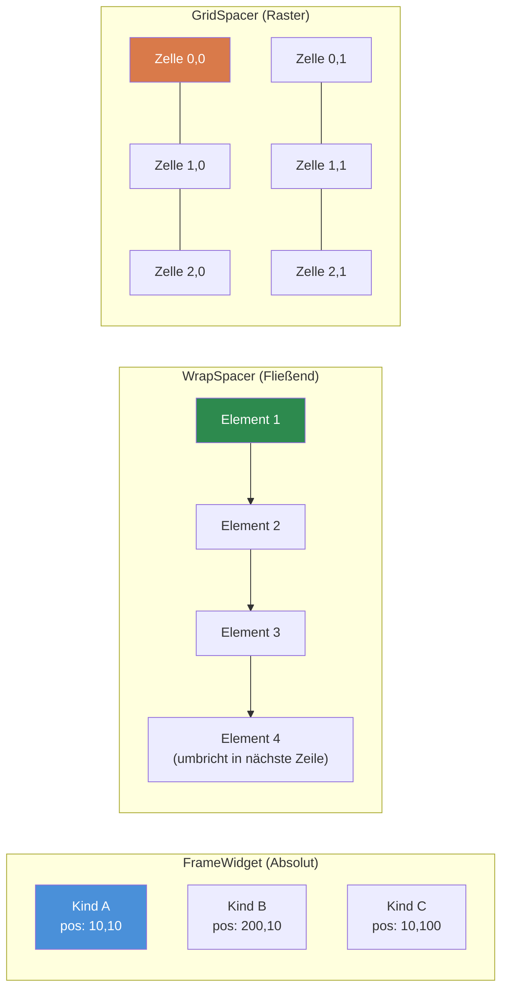
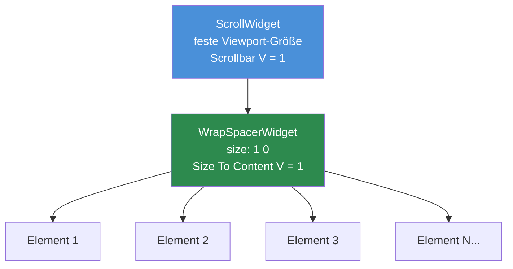

# Kapitel 3.4: Container-Widgets

[Startseite](../../README.md) | [<< Zurück: Größe & Positionierung](03-sizing-positioning.md) | **Container-Widgets** | [Weiter: Programmatische Widgets >>](05-programmatic-widgets.md)

---

Container-Widgets organisieren Kind-Widgets innerhalb von ihnen. Während `FrameWidget` der einfachste ist (unsichtbare Box, manuelle Positionierung), bietet DayZ drei spezialisierte Container, die das Layout automatisch handhaben: `WrapSpacerWidget`, `GridSpacerWidget` und `ScrollWidget`.

### Container-Vergleich



---

## FrameWidget -- Struktureller Container

`FrameWidget` ist der grundlegendste Container. Er zeichnet nichts auf dem Bildschirm und ordnet seine Kinder nicht an -- du musst jedes Kind manuell positionieren.

**Wann verwenden:**
- Gruppierung verwandter Widgets, damit sie gemeinsam ein-/ausgeblendet werden können
- Stamm-Widget eines Panels oder Dialogs
- Jede strukturelle Gruppierung, bei der du die Positionierung selbst handhabst

```
FrameWidgetClass MyPanel {
 size 0.5 0.5
 halign center_ref
 valign center_ref
 hexactpos 1
 vexactpos 1
 hexactsize 0
 vexactsize 0
 {
  TextWidgetClass Header {
   position 0 0
   size 1 0.1
   text "Panel-Titel"
   "text halign" center
  }
  PanelWidgetClass Divider {
   position 0 0.1
   size 1 2
   hexactsize 0
   vexactsize 1
   color 1 1 1 0.3
  }
  FrameWidgetClass Content {
   position 0 0.12
   size 1 0.88
  }
 }
}
```

**Hauptmerkmale:**
- Kein visuelles Erscheinungsbild (transparent)
- Kinder werden relativ zu den Grenzen des Frames positioniert
- Kein automatisches Layout -- jedes Kind braucht explizite Position/Größe
- Leichtgewichtig -- null Rendering-Kosten jenseits seiner Kinder

---

## WrapSpacerWidget -- Fließendes Layout

`WrapSpacerWidget` ordnet seine Kinder automatisch in einer Fließsequenz an. Kinder werden nacheinander horizontal platziert und brechen in die nächste Zeile um, wenn sie die verfügbare Breite überschreiten. Dies ist das Widget für dynamische Listen, bei denen sich die Anzahl der Kinder zur Laufzeit ändert.

### Layout-Attribute

| Attribut | Werte | Beschreibung |
|---|---|---|
| `Padding` | Ganzzahl (Pixel) | Abstand zwischen dem Rand des Spacers und seinen Kindern |
| `Margin` | Ganzzahl (Pixel) | Abstand zwischen einzelnen Kindern |
| `"Size To Content H"` | `0` oder `1` | Breite an alle Kinder anpassen |
| `"Size To Content V"` | `0` oder `1` | Höhe an alle Kinder anpassen |
| `content_halign` | `left`, `center`, `right` | Horizontale Ausrichtung der Kindergruppe |
| `content_valign` | `top`, `center`, `bottom` | Vertikale Ausrichtung der Kindergruppe |

### Einfaches fließendes Layout

```
WrapSpacerWidgetClass TagList {
 size 1 0
 hexactsize 0
 "Size To Content V" 1
 Padding 5
 Margin 3
 {
  ButtonWidgetClass Tag1 {
   size 80 24
   hexactsize 1
   vexactsize 1
   text "Waffen"
  }
  ButtonWidgetClass Tag2 {
   size 60 24
   hexactsize 1
   vexactsize 1
   text "Essen"
  }
  ButtonWidgetClass Tag3 {
   size 90 24
   hexactsize 1
   vexactsize 1
   text "Medizin"
  }
 }
}
```

In diesem Beispiel:
- Der Spacer hat die volle Elternbreite (`size 1`), aber seine Höhe passt sich den Kindern an (`"Size To Content V" 1`).
- Die Kinder sind 80px, 60px und 90px breite Buttons.
- Wenn die verfügbare Breite nicht alle drei in eine Zeile passt, bricht der Spacer sie in die nächste Zeile um.
- `Padding 5` fügt 5px Abstand innerhalb der Spacer-Ränder hinzu.
- `Margin 3` fügt 3px zwischen jedem Kind hinzu.

### Vertikale Liste mit WrapSpacer

Um eine vertikale Liste zu erstellen (ein Element pro Zeile), mache die Kinder vollbreit:

```
WrapSpacerWidgetClass ItemList {
 size 1 0
 hexactsize 0
 "Size To Content V" 1
 Margin 2
 {
  FrameWidgetClass Item1 {
   size 1 30
   hexactsize 0
   vexactsize 1
  }
  FrameWidgetClass Item2 {
   size 1 30
   hexactsize 0
   vexactsize 1
  }
 }
}
```

Jedes Kind hat 100% Breite (`size 1` mit `hexactsize 0`), sodass nur eines pro Zeile passt, was einen vertikalen Stapel ergibt.

### Dynamische Kinder

`WrapSpacerWidget` ist ideal für programmatisch hinzugefügte Kinder. Wenn du Kinder hinzufügst oder entfernst, rufe `Update()` auf dem Spacer auf, um ein Neuberechnen des Layouts auszulösen:

```c
WrapSpacerWidget spacer;

// Ein Kind aus einer Layout-Datei hinzufügen
Widget child = GetGame().GetWorkspace().CreateWidgets("MyMod/gui/layouts/ListItem.layout", spacer);

// Spacer zur Neuberechnung zwingen
spacer.Update();
```

---

## GridSpacerWidget -- Rasterlayout

`GridSpacerWidget` ordnet Kinder in einem gleichmäßigen Raster an. Du definierst die Anzahl der Spalten und Zeilen, und jede Zelle bekommt gleich viel Platz.

### Layout-Attribute

| Attribut | Werte | Beschreibung |
|---|---|---|
| `Columns` | Ganzzahl | Anzahl der Rasterspalten |
| `Rows` | Ganzzahl | Anzahl der Rasterzeilen |
| `Margin` | Ganzzahl (Pixel) | Abstand zwischen Rasterzellen |
| `"Size To Content V"` | `0` oder `1` | Höhe an den Inhalt anpassen |

### Einfaches Raster

```
GridSpacerWidgetClass InventoryGrid {
 size 0.5 0.5
 hexactsize 0
 vexactsize 0
 Columns 4
 Rows 3
 Margin 2
 {
  // 12 Zellen (4 Spalten x 3 Zeilen)
  // Kinder werden der Reihe nach platziert: links nach rechts, oben nach unten
  FrameWidgetClass Slot1 { }
  FrameWidgetClass Slot2 { }
  FrameWidgetClass Slot3 { }
  FrameWidgetClass Slot4 { }
  FrameWidgetClass Slot5 { }
  FrameWidgetClass Slot6 { }
  FrameWidgetClass Slot7 { }
  FrameWidgetClass Slot8 { }
  FrameWidgetClass Slot9 { }
  FrameWidgetClass Slot10 { }
  FrameWidgetClass Slot11 { }
  FrameWidgetClass Slot12 { }
 }
}
```

### Einspaltige Raster (Vertikale Liste)

`Columns 1` erstellt einen einfachen vertikalen Stapel, bei dem jedes Kind die volle Breite bekommt:

```
GridSpacerWidgetClass SettingsList {
 size 1 0
 hexactsize 0
 "Size To Content V" 1
 Columns 1
 {
  FrameWidgetClass Setting1 {
   size 150 30
   hexactsize 1
   vexactsize 1
  }
  FrameWidgetClass Setting2 {
   size 150 30
   hexactsize 1
   vexactsize 1
  }
  FrameWidgetClass Setting3 {
   size 150 30
   hexactsize 1
   vexactsize 1
  }
 }
}
```

### GridSpacer vs. WrapSpacer

| Eigenschaft | GridSpacer | WrapSpacer |
|---|---|---|
| Zellengröße | Einheitlich (gleich) | Jedes Kind behält seine eigene Größe |
| Layout-Modus | Festes Raster (Spalten x Zeilen) | Fließend mit Umbruch |
| Am besten für | Inventarslots, einheitliche Galerien | Dynamische Listen, Tag-Wolken |
| Kindergrößen | Ignoriert (Raster steuert es) | Respektiert (Kindergröße zählt) |

---

## ScrollWidget -- Scrollbarer Viewport

`ScrollWidget` umschließt Inhalte, die höher (oder breiter) als der sichtbare Bereich sein können, und bietet Scrollbalken zur Navigation.

### Layout-Attribute

| Attribut | Werte | Beschreibung |
|---|---|---|
| `"Scrollbar V"` | `0` oder `1` | Vertikalen Scrollbalken anzeigen |
| `"Scrollbar H"` | `0` oder `1` | Horizontalen Scrollbalken anzeigen |

### Skript-API

```c
ScrollWidget sw;
sw.VScrollToPos(float pos);     // Zur vertikalen Position scrollen (0 = oben)
sw.GetVScrollPos();             // Aktuelle Scroll-Position abrufen
sw.GetContentHeight();          // Gesamte Inhaltshöhe abrufen
sw.VScrollStep(int step);       // Um einen Schrittbetrag scrollen
```

### Einfache scrollbare Liste

```
ScrollWidgetClass ListScroll {
 size 1 300
 hexactsize 0
 vexactsize 1
 "Scrollbar V" 1
 {
  WrapSpacerWidgetClass ListContent {
   size 1 0
   hexactsize 0
   "Size To Content V" 1
   {
    // Viele Kinder hier...
    FrameWidgetClass Item1 {
     size 1 30
     hexactsize 0
     vexactsize 1
    }
    FrameWidgetClass Item2 {
     size 1 30
     hexactsize 0
     vexactsize 1
    }
    // ... weitere Elemente
   }
  }
 }
}
```

---

## Das ScrollWidget + WrapSpacer Muster

### ScrollWidget + WrapSpacer Muster



Dies ist **das** Muster für scrollbare dynamische Listen in DayZ-Mods. Es kombiniert ein `ScrollWidget` mit fester Höhe mit einem `WrapSpacerWidget`, das wächst, um seine Kinder aufzunehmen.

```
// Scroll-Viewport mit fester Höhe
ScrollWidgetClass DialogScroll {
 size 0.97 235
 hexactsize 0
 vexactsize 1
 "Scrollbar V" 1
 {
  // Inhalt wächst vertikal, um alle Kinder aufzunehmen
  WrapSpacerWidgetClass DialogContent {
   size 1 0
   hexactsize 0
   "Size To Content V" 1
  }
 }
}
```

So funktioniert es:

1. Das `ScrollWidget` hat eine **feste** Höhe (235 Pixel in diesem Beispiel).
2. Darin hat das `WrapSpacerWidget` `"Size To Content V" 1`, sodass seine Höhe wächst, wenn Kinder hinzugefügt werden.
3. Wenn der Inhalt des Spacers 235 Pixel überschreitet, erscheint der Scrollbalken und der Benutzer kann scrollen.

Dieses Muster erscheint durchgehend in DabsFramework, DayZ Editor, Expansion und praktisch jeder professionellen DayZ-Mod.

### Elemente programmatisch hinzufügen

```c
ScrollWidget m_Scroll;
WrapSpacerWidget m_Content;

void AddItem(string text)
{
    // Ein neues Kind innerhalb des WrapSpacer erstellen
    Widget item = GetGame().GetWorkspace().CreateWidgets(
        "MyMod/gui/layouts/ListItem.layout", m_Content);

    // Das neue Element konfigurieren
    TextWidget tw = TextWidget.Cast(item.FindAnyWidget("Label"));
    tw.SetText(text);

    // Layout-Neuberechnung erzwingen
    m_Content.Update();
}

void ScrollToBottom()
{
    m_Scroll.VScrollToPos(m_Scroll.GetContentHeight());
}

void ClearAll()
{
    // Alle Kinder entfernen
    Widget child = m_Content.GetChildren();
    while (child)
    {
        Widget next = child.GetSibling();
        child.Unlink();
        child = next;
    }
    m_Content.Update();
}
```

---

## Verschachtelungsregeln

Container können verschachtelt werden, um komplexe Layouts zu erstellen. Einige Richtlinien:

1. **FrameWidget in allem** -- Funktioniert immer. Verwende Frames, um Unterabschnitte innerhalb von Spacern oder Grids zu gruppieren.

2. **WrapSpacer in ScrollWidget** -- Das Standardmuster für scrollbare Listen. Der Spacer wächst; der Scroll beschneidet.

3. **GridSpacer in WrapSpacer** -- Funktioniert. Nützlich, um ein festes Raster als ein Element in einem fließenden Layout zu platzieren.

4. **ScrollWidget in WrapSpacer** -- Möglich, erfordert aber eine feste Höhe auf dem Scroll-Widget (`vexactsize 1`). Ohne feste Höhe wird das Scroll-Widget versuchen, zu wachsen, um seinen Inhalt aufzunehmen (was den Zweck des Scrollens zunichte macht).

5. **Tiefe Verschachtelung vermeiden** -- Jede Verschachtelungsebene erhöht die Layout-Berechnungskosten. Drei oder vier Ebenen tief ist typisch für komplexe UIs; mehr als sechs Ebenen deutet darauf hin, dass das Layout umstrukturiert werden sollte.

---

## Wann welchen Container verwenden

| Szenario | Bester Container |
|---|---|
| Statisches Panel mit manuell positionierten Elementen | `FrameWidget` |
| Dynamische Liste mit Elementen unterschiedlicher Größe | `WrapSpacerWidget` |
| Einheitliches Raster (Inventar, Galerie) | `GridSpacerWidget` |
| Vertikale Liste mit einem Element pro Zeile | `WrapSpacerWidget` (vollbreite Kinder) oder `GridSpacerWidget` (`Columns 1`) |
| Inhalt höher als verfügbarer Platz | `ScrollWidget` umschließt einen Spacer |
| Tab-Inhaltsbereich | `FrameWidget` (Kinder-Sichtbarkeit wechseln) |
| Toolbar-Buttons | `WrapSpacerWidget` oder `GridSpacerWidget` |

---

## Vollständiges Beispiel: Scrollbares Einstellungspanel

Ein Einstellungspanel mit einer Titelleiste, einem scrollbaren Inhaltsbereich mit rasterartig angeordneten Optionen und einer unteren Buttonleiste:

```
FrameWidgetClass SettingsPanel {
 size 0.4 0.6
 halign center_ref
 valign center_ref
 hexactpos 1
 vexactpos 1
 hexactsize 0
 vexactsize 0
 {
  // Titelleiste
  PanelWidgetClass TitleBar {
   position 0 0
   size 1 30
   hexactsize 0
   vexactsize 1
   color 0.2 0.4 0.8 1
  }

  // Scrollbarer Einstellungsbereich
  ScrollWidgetClass SettingsScroll {
   position 0 30
   size 1 0
   hexactpos 0
   vexactpos 1
   hexactsize 0
   vexactsize 0
   "Scrollbar V" 1
   {
    GridSpacerWidgetClass SettingsGrid {
     size 1 0
     hexactsize 0
     "Size To Content V" 1
     Columns 1
     Margin 2
    }
   }
  }

  // Buttonleiste unten
  FrameWidgetClass ButtonBar {
   size 1 40
   halign left_ref
   valign bottom_ref
   hexactpos 0
   vexactpos 1
   hexactsize 0
   vexactsize 1
  }
 }
}
```

---

## Bewährte Methoden

- Rufe immer `Update()` auf einem `WrapSpacerWidget` oder `GridSpacerWidget` auf, nachdem du Kinder programmatisch hinzugefügt oder entfernt hast. Ohne diesen Aufruf berechnet der Spacer sein Layout nicht neu und Kinder können sich überlappen oder unsichtbar sein.
- Verwende `ScrollWidget` + `WrapSpacerWidget` als Standardmuster für jede dynamische Liste. Setze den Scroll auf eine feste Pixelhöhe und den inneren Spacer auf `"Size To Content V" 1`.
- Bevorzuge `WrapSpacerWidget` mit vollbreiten Kindern gegenüber `GridSpacerWidget Columns 1` für vertikale Listen, bei denen Elemente unterschiedliche Höhen haben. GridSpacer erzwingt einheitliche Zellengrößen.
- Setze immer `clipchildren 1` auf dem `ScrollWidget`. Ohne dies wird überlaufender Inhalt außerhalb der Scroll-Viewport-Grenzen gerendert.
- Vermeide Verschachtelung von mehr als 4-5 Container-Ebenen. Jede Ebene erhöht die Layout-Berechnungskosten und macht das Debugging deutlich schwieriger.

---

## Theorie vs. Praxis

> Was die Dokumentation sagt gegenüber dem, was zur Laufzeit tatsächlich passiert.

| Konzept | Theorie | Realität |
|---------|---------|---------|
| `WrapSpacerWidget.Update()` | Layout berechnet sich automatisch neu, wenn Kinder sich ändern | Du musst `Update()` manuell aufrufen nach `CreateWidgets()` oder `Unlink()`. Das Vergessen ist der häufigste Spacer-Bug |
| `"Size To Content V"` | Spacer wächst, um Kinder aufzunehmen | Funktioniert nur, wenn Kinder explizite Größen haben (Pixelhöhe oder bekannter proportionaler Elternteil). Wenn Kinder auch `Size To Content` verwenden, erhältst du eine Höhe von Null |
| `GridSpacerWidget` Zellengröße | Raster steuert Zellengröße einheitlich | Die eigenen Größenattribute der Kinder werden ignoriert -- das Raster überschreibt sie. Das Setzen von `size` auf ein Raster-Kind hat keinen Effekt |
| `ScrollWidget` Scroll-Position | `VScrollToPos(0)` scrollt nach oben | Nach dem Hinzufügen von Kindern musst du `VScrollToPos()` möglicherweise um einen Frame verzögern (via `CallLater`), weil die Inhaltshöhe noch nicht neu berechnet wurde |
| Verschachtelte Spacer | Spacer können frei verschachtelt werden | Ein `WrapSpacer` in einem `WrapSpacer` funktioniert, aber `Size To Content` auf beiden Ebenen kann endlose Layout-Schleifen verursachen, die die UI einfrieren |

---

## Kompatibilität & Auswirkungen

- **Multi-Mod:** Container-Widgets sind pro Layout und verursachen keine Konflikte zwischen Mods. Wenn jedoch zwei Mods Kinder in dasselbe Vanilla-`ScrollWidget` injizieren (über `modded class`), ist die Kinder-Reihenfolge unvorhersehbar.
- **Leistung:** `WrapSpacerWidget.Update()` berechnet alle Kinder-Positionen neu. Bei Listen mit 100+ Elementen rufe `Update()` einmal nach Stapeloperationen auf, nicht nach jedem einzelnen Hinzufügen. GridSpacer ist schneller für einheitliche Raster, weil Zellenpositionen arithmetisch berechnet werden.
- **Version:** `WrapSpacerWidget` und `GridSpacerWidget` sind seit DayZ 1.0 verfügbar. Die `"Size To Content H/V"`-Attribute waren von Anfang an vorhanden, aber ihr Verhalten mit tief verschachtelten Layouts wurde um DayZ 1.10 herum stabilisiert.

---

## In echten Mods beobachtet

| Muster | Mod | Detail |
|---------|-----|--------|
| `ScrollWidget` + `WrapSpacerWidget` für dynamische Listen | DabsFramework, Expansion, COT | Scroll-Viewport mit fester Höhe und automatisch wachsendem innerem Spacer -- das universelle Muster für scrollbare Listen |
| `GridSpacerWidget Columns 10` für Inventar | Vanilla DayZ | Inventarraster verwendet GridSpacer mit fester Spaltenanzahl, die dem Slot-Layout entspricht |
| Gepoolte Kinder in WrapSpacer | VPP Admin Tools | Erstellt vorab einen Pool von Listen-Element-Widgets, zeigt/verbirgt sie anstatt sie zu erstellen/zerstören, um `Update()`-Overhead zu vermeiden |
| `WrapSpacerWidget` als Dialog-Stamm | COT, DayZ Editor | Dialog-Stamm verwendet `Size To Content V/H`, damit der Dialog sich automatisch um seinen Inhalt dimensioniert, ohne hartcodierte Abmessungen |

---

## Nächste Schritte

- [3.5 Programmatische Widget-Erstellung](05-programmatic-widgets.md) -- Widgets aus Code erstellen
- [3.6 Ereignisbehandlung](06-event-handling.md) -- Auf Klicks, Änderungen und andere Events reagieren
