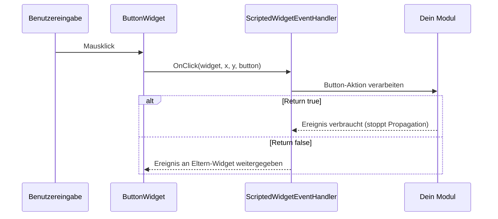

# Kapitel 3.6: Ereignisbehandlung

[Startseite](../../README.md) | [<< Zurück: Programmatische Widget-Erstellung](05-programmatic-widgets.md) | **Ereignisbehandlung** | [Weiter: Stile, Schriftarten & Bilder >>](07-styles-fonts.md)

---

Widgets erzeugen Ereignisse, wenn der Benutzer mit ihnen interagiert -- Buttons anklicken, in Eingabefelder tippen, die Maus bewegen, Elemente ziehen. Dieses Kapitel behandelt, wie du diese Ereignisse empfängst und verarbeitest.

---

## ScriptedWidgetEventHandler

Die Klasse `ScriptedWidgetEventHandler` ist die Grundlage aller Widget-Ereignisbehandlung in DayZ. Sie bietet überschreibbare Methoden für jedes mögliche Widget-Ereignis.

Um Ereignisse von einem Widget zu empfangen, erstelle eine Klasse, die `ScriptedWidgetEventHandler` erweitert, überschreibe die gewünschten Ereignismethoden und verbinde den Handler mit dem Widget über `SetHandler()`.

### Vollständige Ereignismethodenliste

```c
class ScriptedWidgetEventHandler
{
    // Klick-Ereignisse
    bool OnClick(Widget w, int x, int y, int button);
    bool OnDoubleClick(Widget w, int x, int y, int button);

    // Auswahl-Ereignisse
    bool OnSelect(Widget w, int x, int y);
    bool OnItemSelected(Widget w, int x, int y, int row, int column,
                         int oldRow, int oldColumn);

    // Fokus-Ereignisse
    bool OnFocus(Widget w, int x, int y);
    bool OnFocusLost(Widget w, int x, int y);

    // Maus-Ereignisse
    bool OnMouseEnter(Widget w, int x, int y);
    bool OnMouseLeave(Widget w, Widget enterW, int x, int y);
    bool OnMouseWheel(Widget w, int x, int y, int wheel);
    bool OnMouseButtonDown(Widget w, int x, int y, int button);
    bool OnMouseButtonUp(Widget w, int x, int y, int button);

    // Tastatur-Ereignisse
    bool OnKeyDown(Widget w, int x, int y, int key);
    bool OnKeyUp(Widget w, int x, int y, int key);
    bool OnKeyPress(Widget w, int x, int y, int key);

    // Änderungs-Ereignisse (Slider, Checkboxen, Eingabefelder)
    bool OnChange(Widget w, int x, int y, bool finished);

    // Drag-and-Drop-Ereignisse
    bool OnDrag(Widget w, int x, int y);
    bool OnDragging(Widget w, int x, int y, Widget receiver);
    bool OnDraggingOver(Widget w, int x, int y, Widget receiver);
    bool OnDrop(Widget w, int x, int y, Widget receiver);
    bool OnDropReceived(Widget w, int x, int y, Widget receiver);

    // Controller (Gamepad) Ereignisse
    bool OnController(Widget w, int control, int value);

    // Layout-Ereignisse
    bool OnResize(Widget w, int x, int y);
    bool OnChildAdd(Widget w, Widget child);
    bool OnChildRemove(Widget w, Widget child);

    // Sonstige
    bool OnUpdate(Widget w);
    bool OnModalResult(Widget w, int x, int y, int code, int result);
}
```

### Rückgabewert: Verbraucht vs. Durchgereicht

Jeder Ereignis-Handler gibt ein `bool` zurück:

- **`return true;`** -- Das Ereignis ist **verbraucht**. Kein anderer Handler wird es empfangen. Das Ereignis stoppt die Propagation durch die Widget-Hierarchie.
- **`return false;`** -- Das Ereignis wird **durchgereicht** zum Handler des Eltern-Widgets (falls vorhanden).

Dies ist entscheidend für den Aufbau geschichteter UIs. Zum Beispiel sollte ein Button-Klick-Handler `true` zurückgeben, um zu verhindern, dass der Klick auch ein Panel dahinter auslöst.

### Ereignisfluss



---

## Handler mit SetHandler() registrieren

Der einfachste Weg, Ereignisse zu behandeln, ist `SetHandler()` auf einem Widget aufzurufen:

```c
class MyPanel : ScriptedWidgetEventHandler
{
    protected Widget m_Root;
    protected ButtonWidget m_SaveBtn;
    protected ButtonWidget m_CancelBtn;

    void MyPanel()
    {
        m_Root = GetGame().GetWorkspace().CreateWidgets(
            "MyMod/gui/layouts/panel.layout");

        m_SaveBtn = ButtonWidget.Cast(m_Root.FindAnyWidget("SaveButton"));
        m_CancelBtn = ButtonWidget.Cast(m_Root.FindAnyWidget("CancelButton"));

        // Diese Klasse als Ereignis-Handler für beide Buttons registrieren
        m_SaveBtn.SetHandler(this);
        m_CancelBtn.SetHandler(this);
    }

    override bool OnClick(Widget w, int x, int y, int button)
    {
        if (w == m_SaveBtn)
        {
            Save();
            return true;  // Verbraucht
        }

        if (w == m_CancelBtn)
        {
            Cancel();
            return true;
        }

        return false;  // Nicht unser Widget, durchreichen
    }
}
```

Eine einzelne Handler-Instanz kann bei mehreren Widgets registriert werden. Innerhalb der Ereignismethode vergleiche `w` (das Widget, das das Ereignis ausgelöst hat) mit deinen gespeicherten Referenzen, um festzustellen, welches Widget interagiert wurde.

---

## Häufige Ereignisse im Detail

### OnClick

```c
bool OnClick(Widget w, int x, int y, int button)
```

Wird ausgelöst, wenn ein `ButtonWidget` angeklickt wird (Maus über dem Widget losgelassen).

- `w` -- Das angeklickte Widget
- `x, y` -- Mauszeiger-Position (Bildschirmpixel)
- `button` -- Maustastenindex: `0` = links, `1` = rechts, `2` = Mitte

```c
override bool OnClick(Widget w, int x, int y, int button)
{
    if (button != 0) return false;  // Nur Linksklick behandeln

    if (w == m_MyButton)
    {
        DoAction();
        return true;
    }
    return false;
}
```

### OnChange

```c
bool OnChange(Widget w, int x, int y, bool finished)
```

Wird von `SliderWidget`, `CheckBoxWidget`, `EditBoxWidget` und anderen wertbasierten Widgets ausgelöst, wenn sich ihr Wert ändert.

- `w` -- Das Widget, dessen Wert sich geändert hat
- `finished` -- Für Slider: `true`, wenn der Benutzer den Schieberegler loslässt. Für Eingabefelder: `true`, wenn Enter gedrückt wird.

```c
override bool OnChange(Widget w, int x, int y, bool finished)
{
    if (w == m_VolumeSlider)
    {
        SliderWidget slider = SliderWidget.Cast(w);
        float value = slider.GetCurrent();

        // Nur anwenden, wenn der Benutzer das Ziehen beendet
        if (finished)
        {
            ApplyVolume(value);
        }
        else
        {
            // Vorschau während des Ziehens
            PreviewVolume(value);
        }
        return true;
    }

    if (w == m_NameInput)
    {
        EditBoxWidget edit = EditBoxWidget.Cast(w);
        string text = edit.GetText();

        if (finished)
        {
            // Benutzer hat Enter gedrückt
            SubmitName(text);
        }
        return true;
    }

    if (w == m_EnableCheckbox)
    {
        CheckBoxWidget cb = CheckBoxWidget.Cast(w);
        bool checked = cb.IsChecked();
        ToggleFeature(checked);
        return true;
    }

    return false;
}
```

### OnMouseEnter / OnMouseLeave

```c
bool OnMouseEnter(Widget w, int x, int y)
bool OnMouseLeave(Widget w, Widget enterW, int x, int y)
```

Wird ausgelöst, wenn der Mauszeiger die Grenzen eines Widgets betritt oder verlässt. Der `enterW`-Parameter in `OnMouseLeave` ist das Widget, zu dem der Zeiger gewechselt hat.

Häufige Verwendung: Hover-Effekte.

```c
override bool OnMouseEnter(Widget w, int x, int y)
{
    if (w == m_HoverPanel)
    {
        m_HoverPanel.SetColor(ARGB(255, 80, 130, 200));  // Hervorheben
        return true;
    }
    return false;
}

override bool OnMouseLeave(Widget w, Widget enterW, int x, int y)
{
    if (w == m_HoverPanel)
    {
        m_HoverPanel.SetColor(ARGB(255, 50, 50, 50));  // Standard
        return true;
    }
    return false;
}
```

### OnFocus / OnFocusLost

```c
bool OnFocus(Widget w, int x, int y)
bool OnFocusLost(Widget w, int x, int y)
```

Wird ausgelöst, wenn ein Widget den Tastaturfokus erhält oder verliert. Wichtig für Eingabefelder und andere Texteingabe-Widgets.

```c
override bool OnFocus(Widget w, int x, int y)
{
    if (w == m_SearchBox)
    {
        m_SearchBox.SetColor(ARGB(255, 100, 160, 220));
        return true;
    }
    return false;
}

override bool OnFocusLost(Widget w, int x, int y)
{
    if (w == m_SearchBox)
    {
        m_SearchBox.SetColor(ARGB(255, 60, 60, 60));
        return true;
    }
    return false;
}
```

### OnMouseWheel

```c
bool OnMouseWheel(Widget w, int x, int y, int wheel)
```

Wird ausgelöst, wenn das Mausrad über einem Widget scrollt. `wheel` ist positiv für Hochscrollen, negativ für Runterscrollen.

### OnKeyDown / OnKeyUp / OnKeyPress

```c
bool OnKeyDown(Widget w, int x, int y, int key)
bool OnKeyUp(Widget w, int x, int y, int key)
bool OnKeyPress(Widget w, int x, int y, int key)
```

Tastatur-Ereignisse. Der `key`-Parameter entspricht `KeyCode`-Konstanten (z.B. `KeyCode.KC_ESCAPE`, `KeyCode.KC_RETURN`).

### OnDrag / OnDrop / OnDropReceived

```c
bool OnDrag(Widget w, int x, int y)
bool OnDrop(Widget w, int x, int y, Widget receiver)
bool OnDropReceived(Widget w, int x, int y, Widget receiver)
```

Drag-and-Drop-Ereignisse. Das Widget muss `draggable 1` in seinem Layout haben (oder `WidgetFlags.DRAGGABLE` im Code gesetzt).

- `OnDrag` -- Benutzer hat begonnen, Widget `w` zu ziehen
- `OnDrop` -- Widget `w` wurde abgelegt; `receiver` ist das Widget darunter
- `OnDropReceived` -- Widget `w` hat einen Drop empfangen; `receiver` ist das abgelegte Widget

### OnItemSelected

```c
bool OnItemSelected(Widget w, int x, int y, int row, int column,
                     int oldRow, int oldColumn)
```

Wird von `TextListboxWidget` ausgelöst, wenn eine Zeile ausgewählt wird.

---

## Vanilla WidgetEventHandler (Callback-Registrierung)

DayZ's Vanilla-Code verwendet ein alternatives Muster: `WidgetEventHandler`, ein Singleton, das Ereignisse an benannte Callback-Funktionen weiterleitet. Dies wird häufig in Vanilla-Menüs verwendet.

```c
WidgetEventHandler handler = WidgetEventHandler.GetInstance();

// Ereignis-Callbacks per Funktionsname registrieren
handler.RegisterOnClick(myButton, this, "OnMyButtonClick");
handler.RegisterOnMouseEnter(myWidget, this, "OnHoverStart");
handler.RegisterOnMouseLeave(myWidget, this, "OnHoverEnd");
handler.RegisterOnDoubleClick(myWidget, this, "OnDoubleClick");
handler.RegisterOnMouseButtonDown(myWidget, this, "OnMouseDown");
handler.RegisterOnMouseButtonUp(myWidget, this, "OnMouseUp");
handler.RegisterOnMouseWheel(myWidget, this, "OnWheel");
handler.RegisterOnFocus(myWidget, this, "OnFocusGained");
handler.RegisterOnFocusLost(myWidget, this, "OnFocusLost");
handler.RegisterOnDrag(myWidget, this, "OnDragStart");
handler.RegisterOnDrop(myWidget, this, "OnDropped");
handler.RegisterOnDropReceived(myWidget, this, "OnDropReceived");
handler.RegisterOnDraggingOver(myWidget, this, "OnDragOver");
handler.RegisterOnChildAdd(myWidget, this, "OnChildAdded");
handler.RegisterOnChildRemove(myWidget, this, "OnChildRemoved");

// Alle Callbacks für ein Widget deregistrieren
handler.UnregisterWidget(myWidget);
```

Die Callback-Funktionssignaturen müssen zum Ereignistyp passen:

```c
void OnMyButtonClick(Widget w, int x, int y, int button)
{
    // Klick behandeln
}

void OnHoverStart(Widget w, int x, int y)
{
    // Mouse-Enter behandeln
}

void OnHoverEnd(Widget w, Widget enterW, int x, int y)
{
    // Mouse-Leave behandeln
}
```

### SetHandler() vs. WidgetEventHandler

| Aspekt | SetHandler() | WidgetEventHandler |
|---|---|---|
| Muster | Virtuelle Methoden überschreiben | Benannte Callbacks registrieren |
| Handler pro Widget | Ein Handler pro Widget | Mehrere Callbacks pro Ereignis |
| Verwendet von | DabsFramework, Expansion, eigene Mods | Vanilla-DayZ-Menüs |
| Flexibilität | Muss alle Ereignisse in einer Klasse behandeln | Kann verschiedene Ziele für verschiedene Ereignisse registrieren |
| Aufräumen | Implizit, wenn der Handler zerstört wird | Muss `UnregisterWidget()` aufrufen |

Für neue Mods ist `SetHandler()` mit `ScriptedWidgetEventHandler` der empfohlene Ansatz.

---

## Vollständiges Beispiel: Interaktives Button-Panel

Ein Panel mit drei Buttons, die beim Hovern die Farbe ändern und beim Klicken Aktionen ausführen:

```c
class InteractivePanel : ScriptedWidgetEventHandler
{
    protected Widget m_Root;
    protected ButtonWidget m_BtnStart;
    protected ButtonWidget m_BtnStop;
    protected ButtonWidget m_BtnReset;
    protected TextWidget m_StatusText;

    protected int m_DefaultColor = ARGB(255, 60, 60, 60);
    protected int m_HoverColor   = ARGB(255, 80, 130, 200);
    protected int m_ActiveColor  = ARGB(255, 50, 180, 80);

    void InteractivePanel()
    {
        m_Root = GetGame().GetWorkspace().CreateWidgets(
            "MyMod/gui/layouts/interactive_panel.layout");

        m_BtnStart  = ButtonWidget.Cast(m_Root.FindAnyWidget("BtnStart"));
        m_BtnStop   = ButtonWidget.Cast(m_Root.FindAnyWidget("BtnStop"));
        m_BtnReset  = ButtonWidget.Cast(m_Root.FindAnyWidget("BtnReset"));
        m_StatusText = TextWidget.Cast(m_Root.FindAnyWidget("StatusText"));

        // Diesen Handler auf allen interaktiven Widgets registrieren
        m_BtnStart.SetHandler(this);
        m_BtnStop.SetHandler(this);
        m_BtnReset.SetHandler(this);
    }

    override bool OnClick(Widget w, int x, int y, int button)
    {
        if (button != 0) return false;

        if (w == m_BtnStart)
        {
            m_StatusText.SetText("Gestartet");
            m_StatusText.SetColor(m_ActiveColor);
            return true;
        }
        if (w == m_BtnStop)
        {
            m_StatusText.SetText("Gestoppt");
            m_StatusText.SetColor(ARGB(255, 200, 50, 50));
            return true;
        }
        if (w == m_BtnReset)
        {
            m_StatusText.SetText("Bereit");
            m_StatusText.SetColor(ARGB(255, 200, 200, 200));
            return true;
        }
        return false;
    }

    override bool OnMouseEnter(Widget w, int x, int y)
    {
        if (w == m_BtnStart || w == m_BtnStop || w == m_BtnReset)
        {
            w.SetColor(m_HoverColor);
            return true;
        }
        return false;
    }

    override bool OnMouseLeave(Widget w, Widget enterW, int x, int y)
    {
        if (w == m_BtnStart || w == m_BtnStop || w == m_BtnReset)
        {
            w.SetColor(m_DefaultColor);
            return true;
        }
        return false;
    }

    void Show(bool visible)
    {
        m_Root.Show(visible);
    }

    void ~InteractivePanel()
    {
        if (m_Root)
        {
            m_Root.Unlink();
            m_Root = null;
        }
    }
}
```

---

## Bewährte Methoden für die Ereignisbehandlung

1. **Gib immer `true` zurück, wenn du ein Ereignis behandelst** -- Andernfalls propagiert das Ereignis zu Eltern-Widgets und kann unbeabsichtigtes Verhalten auslösen.

2. **Gib `false` für Ereignisse zurück, die du nicht behandelst** -- Dies ermöglicht es Eltern-Widgets, das Ereignis zu verarbeiten.

3. **Cache Widget-Referenzen** -- Rufe `FindAnyWidget()` nicht innerhalb von Ereignis-Handlern auf. Suche Widgets einmal im Konstruktor und speichere Referenzen.

4. **Null-Prüfung in Ereignissen** -- Das Widget `w` ist normalerweise gültig, aber defensives Programmieren verhindert Abstürze.

5. **Handler aufräumen** -- Beim Zerstören eines Panels das Root-Widget unlinken. Bei Verwendung von `WidgetEventHandler` rufe `UnregisterWidget()` auf.

6. **`finished`-Parameter weise verwenden** -- Für Slider führe teure Operationen nur aus, wenn `finished` `true` ist (Benutzer hat den Griff losgelassen). Verwende nicht-abgeschlossene Ereignisse für die Vorschau.

7. **Aufwändige Arbeit aufschieben** -- Wenn ein Ereignis-Handler aufwändige Berechnung braucht, verwende `CallLater`, um sie aufzuschieben:

```c
override bool OnClick(Widget w, int x, int y, int button)
{
    if (w == m_HeavyActionBtn)
    {
        GetGame().GetCallQueue(CALL_CATEGORY_GUI).CallLater(DoHeavyWork, 0, false);
        return true;
    }
    return false;
}
```

---

## Theorie vs. Praxis

> Was die Dokumentation sagt gegenüber dem, was zur Laufzeit tatsächlich passiert.

| Konzept | Theorie | Realität |
|---------|---------|---------|
| `OnClick` wird bei jedem Widget ausgelöst | Jedes Widget kann Klick-Ereignisse empfangen | Nur `ButtonWidget` löst `OnClick` zuverlässig aus. Für andere Widget-Typen verwende stattdessen `OnMouseButtonDown` / `OnMouseButtonUp` |
| `SetHandler()` ersetzt den Handler | Das Setzen eines neuen Handlers ersetzt den alten | Richtig, aber der alte Handler wird nicht benachrichtigt. Wenn er Ressourcen hielt, lecken diese. Räume immer auf, bevor du Handler ersetzt |
| `OnChange` `finished`-Parameter | `true`, wenn der Benutzer die Interaktion beendet | Für `EditBoxWidget` ist `finished` nur beim Drücken von Enter `true` -- Tab-Wechsel oder Wegklicken setzt `finished` NICHT auf `true` |
| Ereignis-Rückgabewert-Propagation | `return false` gibt das Ereignis an den Elternteil weiter | Ereignisse propagieren die Widget-Hierarchie hoch, nicht zu Geschwister-Widgets. Ein `return false` von einem Kind geht an seinen Elternteil, nie an ein benachbartes Widget |
| `WidgetEventHandler` Callback-Namen | Jeder Funktionsname funktioniert | Die Funktion muss zum Zeitpunkt der Registrierung auf dem Zielobjekt existieren. Wenn der Funktionsname falsch geschrieben ist, gelingt die Registrierung stillschweigend, aber der Callback wird nie ausgelöst |

---

## Kompatibilität & Auswirkungen

- **Multi-Mod:** `SetHandler()` erlaubt nur einen Handler pro Widget. Wenn Mod A und Mod B beide `SetHandler()` auf demselben Vanilla-Widget aufrufen (über `modded class`), gewinnt der letzte und der andere empfängt stillschweigend keine Ereignisse mehr. Verwende `WidgetEventHandler.RegisterOnClick()` für additive Multi-Mod-Kompatibilität.
- **Leistung:** Ereignis-Handler laufen auf dem Hauptthread des Spiels. Ein langsamer `OnClick`-Handler (z.B. Datei-E/A oder komplexe Berechnungen) verursacht sichtbares Frame-Ruckeln. Schiebe aufwändige Arbeit mit `GetGame().GetCallQueue(CALL_CATEGORY_GUI).CallLater()` auf.
- **Version:** Die `ScriptedWidgetEventHandler`-API ist seit DayZ 1.0 stabil. `WidgetEventHandler`-Singleton-Callbacks sind Vanilla-Muster, die seit frühen Enforce-Script-Versionen existieren und unverändert geblieben sind.

---

## In echten Mods beobachtet

| Muster | Mod | Detail |
|---------|-----|--------|
| Einzelner Handler für gesamtes Panel | COT, VPP Admin Tools | Eine `ScriptedWidgetEventHandler`-Unterklasse behandelt alle Buttons in einem Panel und dispatcht durch Vergleich von `w` mit gespeicherten Widget-Referenzen |
| `WidgetEventHandler.RegisterOnClick` für modulare Buttons | Expansion Market | Jeder dynamisch erstellte Kauf-/Verkaufsbutton registriert seinen eigenen Callback und ermöglicht so Handler-Funktionen pro Element |
| `OnMouseEnter` / `OnMouseLeave` für Hover-Tooltips | DayZ Editor | Hover-Ereignisse lösen Tooltip-Widgets aus, die der Cursorposition via `GetMousePos()` folgen |
| `CallLater`-Aufschiebung in `OnClick` | DabsFramework | Aufwändige Operationen (Config speichern, RPC senden) werden um 0ms via `CallLater` aufgeschoben, um den UI-Thread während des Events nicht zu blockieren |

---

## Nächste Schritte

- [3.7 Stile, Schriftarten & Bilder](07-styles-fonts.md) -- Visuelles Styling mit Stilen, Schriftarten und ImageSet-Referenzen
- [3.5 Programmatische Widget-Erstellung](05-programmatic-widgets.md) -- Widgets erstellen, die Ereignisse erzeugen
