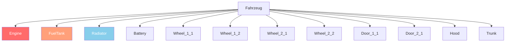

# Kapitel 6.2: Fahrzeugsystem

[Startseite](../../README.md) | [<< Zurück: Entity-System](01-entity-system.md) | **Fahrzeuge** | [Weiter: Wetter >>](03-weather.md)

---

## Einführung

DayZ-Fahrzeuge sind Entities, die das Transportsystem erweitern. Autos erweitern `CarScript`, Boote erweitern `BoatScript`, und beide erben von `Transport`. Fahrzeuge verfügen über Flüssigkeitssysteme, Teile mit unabhängiger Gesundheit, Getriebesimulation und von der Engine verwaltete Physik. Dieses Kapitel behandelt die API-Methoden, die Sie benötigen, um mit Fahrzeugen in Scripts zu interagieren.

---

## Klassenhierarchie

```
EntityAI
└── Transport                    // 3_Game - Basis für alle Fahrzeuge
    ├── Car                      // 3_Game - Engine-native Auto-Physik
    │   └── CarScript            // 4_World - skriptfähige Auto-Basis
    │       ├── CivilianSedan
    │       ├── OffroadHatchback
    │       ├── Hatchback_02
    │       ├── Sedan_02
    │       ├── Truck_01_Base
    │       └── ...
    └── Boat                     // 3_Game - Engine-native Boot-Physik
        └── BoatScript           // 4_World - skriptfähige Boot-Basis
```

---

## Transport (Basis)

**Datei:** `3_Game/entities/transport.c`

Die abstrakte Basis für alle Fahrzeuge. Bietet Sitzverwaltung und Besatzungszugriff.

### Besatzungsverwaltung

```c
proto native int   CrewSize();                          // Gesamtanzahl der Sitze
proto native int   CrewMemberIndex(Human crew_member);  // Sitzindex eines Menschen ermitteln
proto native Human CrewMember(int posIdx);              // Mensch an Sitzindex ermitteln
proto native void  CrewGetOut(int posIdx);              // Besatzungsmitglied aus dem Sitz zwingen
proto native void  CrewDeath(int posIdx);               // Besatzungsmitglied im Sitz töten
```

### Besatzungseinstieg

```c
proto native int  GetAnimInstance();
proto native int  CrewPositionIndex(int componentIdx);  // Komponente zu Sitzindex
proto native vector CrewEntryPoint(int posIdx);         // Welteinstiegspunkt für Sitz
```

**Beispiel --- alle Passagiere auswerfen:**

```c
void EjectAllCrew(Transport vehicle)
{
    for (int i = 0; i < vehicle.CrewSize(); i++)
    {
        Human crew = vehicle.CrewMember(i);
        if (crew)
        {
            vehicle.CrewGetOut(i);
        }
    }
}
```

---

## Car (Engine-nativ)

**Datei:** `3_Game/entities/car.c`

Engine-Level Auto-Physik. Alle `proto native`-Methoden, die die Fahrzeugsimulation antreiben.

### Motor

```c
proto native bool  EngineIsOn();
proto native void  EngineStart();
proto native void  EngineStop();
proto native float EngineGetRPM();
proto native float EngineGetRPMRedline();
proto native float EngineGetRPMMax();
proto native int   GetGear();
```

### Flüssigkeiten

DayZ-Fahrzeuge haben vier Flüssigkeitstypen, definiert im `CarFluid`-Enum:

```c
enum CarFluid
{
    FUEL,
    OIL,
    BRAKE,
    COOLANT
}
```

```c
proto native float GetFluidCapacity(CarFluid fluid);
proto native float GetFluidFraction(CarFluid fluid);     // 0.0 - 1.0
proto native void  Fill(CarFluid fluid, float amount);
proto native void  Leak(CarFluid fluid, float amount);
proto native void  LeakAll(CarFluid fluid);
```

**Beispiel --- ein Fahrzeug betanken:**

```c
void RefuelVehicle(Car car)
{
    float capacity = car.GetFluidCapacity(CarFluid.FUEL);
    float current = car.GetFluidFraction(CarFluid.FUEL) * capacity;
    float needed = capacity - current;
    car.Fill(CarFluid.FUEL, needed);
}
```

### Geschwindigkeit

```c
proto native float GetSpeedometer();    // Geschwindigkeit in km/h (Absolutwert)
```

### Steuerung (Simulation)

```c
proto native void  SetBrake(float value, int wheel = -1);    // 0.0 - 1.0, -1 = alle Räder
proto native void  SetHandbrake(float value);                 // 0.0 - 1.0
proto native void  SetSteering(float value, bool analog = true);
proto native void  SetThrust(float value, int wheel = -1);    // 0.0 - 1.0
proto native void  SetClutchState(bool engaged);
```

### Räder

```c
proto native int   WheelCount();
proto native bool  WheelIsAnyLocked();
proto native float WheelGetSurface(int wheelIdx);
```

### Callbacks (Überschreiben in CarScript)

```c
void OnEngineStart();
void OnEngineStop();
void OnContact(string zoneName, vector localPos, IEntity other, Contact data);
void OnFluidChanged(CarFluid fluid, float newValue, float oldValue);
void OnGearChanged(int newGear, int oldGear);
void OnSound(CarSoundCtrl ctrl, float oldValue);
```

---

## CarScript

**Datei:** `4_World/entities/vehicles/carscript.c`

Die skriptfähige Auto-Klasse, die die meisten Fahrzeug-Mods erweitern. Fügt Teile-, Tür-, Licht- und Soundverwaltung hinzu.

### Teilegesundheit

CarScript verwendet Schadenszonen, um Fahrzeugteile darzustellen. Jedes Teil kann unabhängig beschädigt werden:

```c
// Teilegesundheit über die Standard-EntityAI-API prüfen
float engineHP = car.GetHealth("Engine", "Health");
float fuelTankHP = car.GetHealth("FuelTank", "Health");

// Teilegesundheit setzen
car.SetHealth("Engine", "Health", 0);       // Den Motor zerstören
car.SetHealth("FuelTank", "Health", 100);   // Den Kraftstofftank reparieren
```

### Schadenszonen-Diagramm



Häufige Schadenszonen für Fahrzeuge:

| Zone | Beschreibung |
|------|--------------|
| `""` (global) | Gesamte Fahrzeuggesundheit |
| `"Engine"` | Motorteil |
| `"FuelTank"` | Kraftstofftank |
| `"Radiator"` | Kühler (Kühlmittel) |
| `"Battery"` | Batterie |
| `"SparkPlug"` | Zündkerze |
| `"FrontLeft"` / `"FrontRight"` | Vorderräder |
| `"RearLeft"` / `"RearRight"` | Hinterräder |
| `"DriverDoor"` / `"CoDriverDoor"` | Vordertüren |
| `"Hood"` / `"Trunk"` | Motorhaube und Kofferraum |

### Lichter

```c
void SetLightsState(int state);   // 0 = aus, 1 = an
int  GetLightsState();
```

### Türsteuerung

```c
bool IsDoorOpen(string doorSource);
void OpenDoor(string doorSource);
void CloseDoor(string doorSource);
```

### Wichtige Überschreibungen für benutzerdefinierte Fahrzeuge

```c
override void EEInit();                    // Fahrzeugteile, Flüssigkeiten initialisieren
override void OnEngineStart();             // Benutzerdefiniertes Motorstartverhalten
override void OnEngineStop();              // Benutzerdefiniertes Motorstoppverhalten
override void EOnSimulate(IEntity other, float dt);  // Simulation pro Tick
override bool CanObjectAttachWeapon(string slot_name);
```

**Beispiel --- ein Fahrzeug mit vollen Flüssigkeiten erstellen:**

```c
void SpawnReadyVehicle(vector pos)
{
    Car car = Car.Cast(GetGame().CreateObjectEx("CivilianSedan", pos,
                        ECE_PLACE_ON_SURFACE | ECE_INITAI | ECE_CREATEPHYSICS));
    if (!car)
        return;

    // Alle Flüssigkeiten auffüllen
    car.Fill(CarFluid.FUEL, car.GetFluidCapacity(CarFluid.FUEL));
    car.Fill(CarFluid.OIL, car.GetFluidCapacity(CarFluid.OIL));
    car.Fill(CarFluid.BRAKE, car.GetFluidCapacity(CarFluid.BRAKE));
    car.Fill(CarFluid.COOLANT, car.GetFluidCapacity(CarFluid.COOLANT));

    // Erforderliche Teile spawnen
    EntityAI carEntity = EntityAI.Cast(car);
    carEntity.GetInventory().CreateAttachment("CarBattery");
    carEntity.GetInventory().CreateAttachment("SparkPlug");
    carEntity.GetInventory().CreateAttachment("CarRadiator");
    carEntity.GetInventory().CreateAttachment("HatchbackWheel");
}
```

---

## BoatScript

**Datei:** `4_World/entities/vehicles/boatscript.c`

Skriptfähige Basis für Boot-Entities. Ähnliche API wie CarScript, aber mit propellerbasierter Physik.

### Motor und Antrieb

```c
proto native bool  EngineIsOn();
proto native void  EngineStart();
proto native void  EngineStop();
proto native float EngineGetRPM();
```

### Flüssigkeiten

Boote verwenden dasselbe `CarFluid`-Enum, nutzen aber typischerweise nur `FUEL`:

```c
float fuel = boat.GetFluidFraction(CarFluid.FUEL);
boat.Fill(CarFluid.FUEL, boat.GetFluidCapacity(CarFluid.FUEL));
```

### Geschwindigkeit

```c
proto native float GetSpeedometer();   // Geschwindigkeit in km/h
```

**Beispiel --- ein Boot spawnen:**

```c
void SpawnBoat(vector waterPos)
{
    BoatScript boat = BoatScript.Cast(
        GetGame().CreateObjectEx("Boat_01", waterPos,
                                  ECE_CREATEPHYSICS | ECE_INITAI)
    );
    if (boat)
    {
        boat.Fill(CarFluid.FUEL, boat.GetFluidCapacity(CarFluid.FUEL));
    }
}
```

---

## Fahrzeug-Interaktionsprüfungen

### Prüfen ob ein Spieler in einem Fahrzeug ist

```c
PlayerBase player;
if (player.IsInVehicle())
{
    EntityAI vehicle = player.GetDrivingVehicle();
    CarScript car;
    if (Class.CastTo(car, vehicle))
    {
        float speed = car.GetSpeedometer();
        Print(string.Format("Fährt mit %1 km/h", speed));
    }
}
```

### Alle Fahrzeuge in der Welt finden

```c
void FindAllVehicles(out array<Transport> vehicles)
{
    vehicles = new array<Transport>;
    array<Object> objects = new array<Object>;
    array<CargoBase> proxyCargos = new array<CargoBase>;

    // Großen Radius von der Kartenmitte verwenden
    GetGame().GetObjectsAtPosition(Vector(7500, 0, 7500), 15000, objects, proxyCargos);

    foreach (Object obj : objects)
    {
        Transport transport;
        if (Class.CastTo(transport, obj))
        {
            vehicles.Insert(transport);
        }
    }
}
```

---

## Zusammenfassung

| Konzept | Kernpunkt |
|---------|-----------|
| Hierarchie | `Transport` > `Car`/`Boat` > `CarScript`/`BoatScript` |
| Motor | `EngineStart()`, `EngineStop()`, `EngineIsOn()`, `EngineGetRPM()` |
| Flüssigkeiten | `CarFluid`-Enum: `FUEL`, `OIL`, `BRAKE`, `COOLANT` |
| Füllen/Lecken | `Fill(fluid, amount)`, `Leak(fluid, amount)`, `GetFluidFraction(fluid)` |
| Geschwindigkeit | `GetSpeedometer()` gibt km/h zurück |
| Besatzung | `CrewSize()`, `CrewMember(idx)`, `CrewGetOut(idx)` |
| Teile | Standard-Schadenszonen: `"Engine"`, `"FuelTank"`, `"Radiator"`, usw. |
| Erstellung | `CreateObjectEx` mit `ECE_PLACE_ON_SURFACE \| ECE_INITAI \| ECE_CREATEPHYSICS` |

---

## Bewährte Praktiken

- **Fügen Sie beim Spawnen von Fahrzeugen immer `ECE_CREATEPHYSICS | ECE_INITAI` hinzu.** Ohne Physik fällt das Fahrzeug durch den Boden. Ohne AI-Init startet die Motorsimulation nicht und das Fahrzeug kann nicht gefahren werden.
- **Füllen Sie alle vier Flüssigkeiten nach dem Spawnen auf.** Ein Fahrzeug ohne Öl, Bremsflüssigkeit oder Kühlmittel beschädigt sich sofort, wenn der Motor gestartet wird. Verwenden Sie `GetFluidCapacity()`, um korrekte Maximalwerte pro Fahrzeugtyp zu erhalten.
- **Null-Prüfung von `CrewMember()` vor Operationen an der Besatzung.** Leere Sitze geben `null` zurück. Das Iterieren über `CrewSize()` ohne Prüfung jedes Index verursacht Abstürze bei unbesetzten Sitzen.
- **Verwenden Sie `GetSpeedometer()` anstatt die Geschwindigkeit manuell zu berechnen.** Der Tachometer der Engine berücksichtigt Radkontakt, Getriebezustand und Physik korrekt. Manuelle Geschwindigkeitsberechnungen aus Positionsdifferenzen sind unzuverlässig.

---

## Kompatibilität und Auswirkungen

> **Mod-Kompatibilität:** Fahrzeug-Mods erweitern häufig `CarScript` mit modded-Klassen. Konflikte entstehen, wenn mehrere Mods dieselben Callbacks wie `OnEngineStart()` oder `EOnSimulate()` überschreiben.

- **Ladereihenfolge:** Wenn zwei Mods beide `modded class CarScript` verwenden und `OnEngineStart()` überschreiben, läuft nur die zuletzt geladene Mod, es sei denn, beide rufen `super` auf. Fahrzeug-Überarbeitungs-Mods sollten immer `super` in jedem Callback aufrufen.
- **Modded-Class-Konflikte:** Expansion Vehicles und Vanilla-Fahrzeug-Mods kollidieren häufig bei `EEInit()` und der Flüssigkeitsinitialisierung. Testen Sie mit beiden geladen.
- **Leistungsauswirkung:** `EOnSimulate()` läuft jeden Physik-Tick für jedes aktive Fahrzeug. Halten Sie die Logik in diesem Callback minimal; verwenden Sie Timer-Akkumulatoren für aufwendige Operationen.
- **Server/Client:** `EngineStart()`, `EngineStop()`, `Fill()`, `Leak()` und `CrewGetOut()` sind server-autoritativ. `GetSpeedometer()`, `EngineIsOn()` und `GetFluidFraction()` können sicher auf beiden Seiten gelesen werden.

---

## In echten Mods beobachtet

> Diese Muster wurden durch das Studium des Quellcodes professioneller DayZ-Mods bestätigt.

| Muster | Mod | Datei/Ort |
|--------|-----|-----------|
| `EEInit()` überschreiben, um benutzerdefinierte Flüssigkeitskapazitäten und Teile zu setzen | Expansion Vehicles | `CarScript`-Unterklassen |
| `EOnSimulate`-Akkumulator für periodische Kraftstoffverbrauchsprüfungen | Vanilla+ Fahrzeug-Mods | `CarScript`-Überschreibungen |
| `CrewGetOut()`-Schleife im Admin-Alle-Auswerfen-Befehl | VPP Admin Tools | Fahrzeugverwaltungsmodul |
| Benutzerdefinierter `OnContact()`-Override für Kollisionsschadens-Tuning | Expansion | `ExpansionCarScript` |

---

[Startseite](../../README.md) | [<< Zurück: Entity-System](01-entity-system.md) | **Fahrzeuge** | [Weiter: Wetter >>](03-weather.md)
