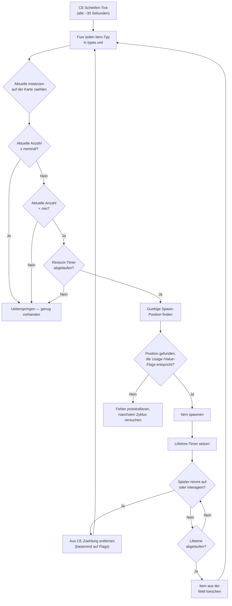

# Kapitel 9.4: Loot-Wirtschaft im Detail

[Home](../README.md) | [<< Zurueck: serverDZ.cfg-Referenz](03-server-cfg.md) | **Loot-Wirtschaft im Detail**

---

> **Zusammenfassung:** Die Zentralwirtschaft (Central Economy, CE) ist das System, das jeden Item-Spawn in DayZ steuert -- von einer Dose Bohnen auf einem Regal bis zu einer AKM in einer Militaerkaserne. Dieses Kapitel erklaert den vollstaendigen Spawn-Zyklus, dokumentiert jedes Feld in `types.xml`, `globals.xml`, `events.xml` und `cfgspawnabletypes.xml` mit realen Beispielen aus den Vanilla-Server-Dateien und behandelt die haeufigsten Wirtschaftsfehler.

---

## Inhaltsverzeichnis

- [Wie die Zentralwirtschaft funktioniert](#wie-die-zentralwirtschaft-funktioniert)
- [Der Spawn-Zyklus](#der-spawn-zyklus)
- [types.xml -- Item-Spawn-Definitionen](#typesxml----item-spawn-definitionen)
- [Reale types.xml-Beispiele](#reale-typesxml-beispiele)
- [types.xml-Feldreferenz](#typesxml-feldreferenz)
- [globals.xml -- Wirtschaftsparameter](#globalsxml----wirtschaftsparameter)
- [events.xml -- Dynamische Events](#eventsxml----dynamische-events)
- [cfgspawnabletypes.xml -- Anbauteile und Ladung](#cfgspawnabletypesxml----anbauteile-und-ladung)
- [Die Nominal-/Restock-Beziehung](#die-nominal-restock-beziehung)
- [Haeufige Wirtschaftsfehler](#haeufige-wirtschaftsfehler)

---

## Wie die Zentralwirtschaft funktioniert

Die Zentralwirtschaft (CE) ist ein serverseitiges System, das in einer kontinuierlichen Schleife laeuft. Ihre Aufgabe ist es, die Itempopulation der Welt auf dem in Ihren Konfigurationsdateien definierten Niveau zu halten.

Die CE platziert Items **nicht**, wenn ein Spieler ein Gebaeude betritt. Stattdessen laeuft sie auf einem globalen Timer und spawnt Items ueber die gesamte Karte, unabhaengig von der Spielernaehe. Items haben eine **Lebensdauer** -- wenn dieser Timer ablaeuft und kein Spieler mit dem Item interagiert hat, entfernt die CE es. Dann, im naechsten Zyklus, erkennt sie, dass die Anzahl unter dem Zielwert liegt und spawnt einen Ersatz an anderer Stelle.

Schluesselkonzepte:

- **Nominal** -- die Zielanzahl von Kopien eines Items, die auf der Karte existieren sollen
- **Min** -- der Schwellenwert, unter dem die CE versucht, das Item nachzuspawnen
- **Lifetime** -- wie lange (in Sekunden) ein unberuehrtes Item bestehen bleibt, bevor es aufgeraeumt wird
- **Restock** -- Mindestzeit (in Sekunden), bevor die CE ein Item nach Entnahme/Zerstoerung nachspawnen kann
- **Flags** -- was in die Gesamtzaehlung einfliesst (auf der Karte, in Ladung, im Spielerinventar, in Verstecken)

---

## Der Spawn-Zyklus



Kurz gesagt: Die CE zaehlt, wie viele von jedem Item existieren, vergleicht mit den Nominal-/Min-Zielen und spawnt Ersatz, wenn die Anzahl unter `min` faellt und der `restock`-Timer abgelaufen ist.

---

## types.xml -- Item-Spawn-Definitionen

Dies ist die wichtigste Wirtschaftsdatei. Jedes Item, das in der Welt spawnen kann, benoetigt hier einen Eintrag. Die Vanilla-`types.xml` fuer Chernarus enthaelt etwa 23.000 Zeilen und deckt Tausende von Items ab.

### Reale types.xml-Beispiele

**Waffe -- AKM**

```xml
<type name="AKM">
    <nominal>3</nominal>
    <lifetime>7200</lifetime>
    <restock>3600</restock>
    <min>2</min>
    <quantmin>30</quantmin>
    <quantmax>80</quantmax>
    <cost>100</cost>
    <flags count_in_cargo="0" count_in_hoarder="0" count_in_map="1" count_in_player="0" crafted="0" deloot="0"/>
    <category name="weapons"/>
    <usage name="Military"/>
    <value name="Tier4"/>
</type>
```

Die AKM ist eine seltene High-Tier-Waffe. Nur 3 koennen gleichzeitig auf der Karte existieren (`nominal`). Sie spawnt in Military-Gebaeuden in Tier-4-Gebieten (Nordwesten). Wenn ein Spieler eine aufhebt, sieht die CE, dass die Kartenanzahl unter `min=2` faellt und spawnt nach mindestens 3600 Sekunden (1 Stunde) Ersatz. Die Waffe spawnt mit 30-80% Munition im internen Magazin (`quantmin`/`quantmax`).

**Nahrung -- BakedBeansCan**

```xml
<type name="BakedBeansCan">
    <nominal>15</nominal>
    <lifetime>14400</lifetime>
    <restock>0</restock>
    <min>12</min>
    <quantmin>-1</quantmin>
    <quantmax>-1</quantmax>
    <cost>100</cost>
    <flags count_in_cargo="0" count_in_hoarder="0" count_in_map="1" count_in_player="0" crafted="0" deloot="0"/>
    <category name="food"/>
    <tag name="shelves"/>
    <usage name="Town"/>
    <usage name="Village"/>
    <value name="Tier1"/>
    <value name="Tier2"/>
    <value name="Tier3"/>
</type>
```

Bohnen in Dosen sind gaengiges Essen. 15 Dosen sollen jederzeit existieren. Sie spawnen auf Regalen in Town- und Village-Gebaeuden ueber die Tier 1-3 (Kueste bis Kartenmitte). `restock=0` bedeutet sofortige Respawn-Berechtigung. `quantmin=-1` und `quantmax=-1` bedeuten, dass das Item das Mengensystem nicht verwendet (es ist kein Fluessigkeits- oder Munitionsbehaelter).

**Kleidung -- RidersJacket_Black**

```xml
<type name="RidersJacket_Black">
    <nominal>14</nominal>
    <lifetime>28800</lifetime>
    <restock>0</restock>
    <min>10</min>
    <quantmin>-1</quantmin>
    <quantmax>-1</quantmax>
    <cost>100</cost>
    <flags count_in_cargo="0" count_in_hoarder="0" count_in_map="1" count_in_player="0" crafted="0" deloot="0"/>
    <category name="clothes"/>
    <usage name="Town"/>
    <value name="Tier1"/>
    <value name="Tier2"/>
</type>
```

Eine gaengige Zivilistenjacke. 14 Kopien auf der Karte, zu finden in Town-Gebaeuden nahe der Kueste (Tier 1-2). Eine Lebensdauer von 28800 Sekunden (8 Stunden) bedeutet, dass sie lange bestehen bleibt, wenn niemand sie aufhebt.

**Medizin -- BandageDressing**

```xml
<type name="BandageDressing">
    <nominal>40</nominal>
    <lifetime>14400</lifetime>
    <restock>0</restock>
    <min>30</min>
    <quantmin>-1</quantmin>
    <quantmax>-1</quantmax>
    <cost>100</cost>
    <flags count_in_cargo="0" count_in_hoarder="0" count_in_map="1" count_in_player="0" crafted="0" deloot="0"/>
    <category name="tools"/>
    <tag name="shelves"/>
    <usage name="Medic"/>
</type>
```

Bandagen sind sehr haeufig (40 nominal). Sie spawnen in Medic-Gebaeuden (Krankenhaeuser, Kliniken) ueber alle Tier (kein `<value>`-Tag bedeutet alle Tier). Beachten Sie, dass die Kategorie `"tools"` ist, nicht `"medical"` -- DayZ hat keine Medical-Kategorie; medizinische Items verwenden die Tools-Kategorie.

**Deaktiviertes Item (hergestellte Variante)**

```xml
<type name="AK101_Black">
    <nominal>0</nominal>
    <lifetime>28800</lifetime>
    <restock>0</restock>
    <min>0</min>
    <quantmin>-1</quantmin>
    <quantmax>-1</quantmax>
    <cost>100</cost>
    <flags count_in_cargo="0" count_in_hoarder="0" count_in_map="1" count_in_player="0" crafted="1" deloot="0"/>
    <category name="weapons"/>
</type>
```

`nominal=0` und `min=0` bedeuten, dass die CE dieses Item niemals spawnt. `crafted=1` zeigt an, dass es nur durch Herstellung (Anmalen einer Waffe) erhalten werden kann. Es hat trotzdem eine Lebensdauer, damit persistierte Instanzen letztendlich aufgeraeumt werden.

---

## types.xml-Feldreferenz

### Kernfelder

| Feld | Typ | Bereich | Beschreibung |
|------|-----|---------|--------------|
| `name` | string | -- | Klassenname des Items. Muss exakt mit dem Klassennamen im Spiel uebereinstimmen. |
| `nominal` | int | 0+ | Zielanzahl dieses Items auf der Karte. Auf 0 setzen, um Spawning zu verhindern. |
| `min` | int | 0+ | Wenn die Anzahl auf diesen Wert oder darunter faellt, versucht die CE nachzuspawnen. |
| `lifetime` | int | Sekunden | Wie lange ein unberuehrtes Item existiert, bevor die CE es loescht. |
| `restock` | int | Sekunden | Minimale Abklingzeit, bevor die CE Ersatz spawnen kann. 0 = sofort. |
| `quantmin` | int | -1 bis 100 | Minimaler Mengenprozentsatz beim Spawn (Munitions-%, Fluessigkeits-%). -1 = nicht anwendbar. |
| `quantmax` | int | -1 bis 100 | Maximaler Mengenprozentsatz beim Spawn. -1 = nicht anwendbar. |
| `cost` | int | 0+ | Prioritaetsgewicht fuer die Spawn-Auswahl. Derzeit verwenden alle Vanilla-Items 100. |

### Flags

```xml
<flags count_in_cargo="0" count_in_hoarder="0" count_in_map="1" count_in_player="0" crafted="0" deloot="0"/>
```

| Flag | Werte | Beschreibung |
|------|-------|--------------|
| `count_in_map` | 0, 1 | Items zaehlen, die auf dem Boden oder an Gebaeude-Spawnpunkten liegen. **Fast immer 1.** |
| `count_in_cargo` | 0, 1 | Items in anderen Behaeltern zaehlen (Rucksaecke, Zelte). |
| `count_in_hoarder` | 0, 1 | Items in Verstecken, Faessern, vergrabenen Behaeltern, Zelten zaehlen. |
| `count_in_player` | 0, 1 | Items im Spielerinventar zaehlen (am Koerper oder in den Haenden). |
| `crafted` | 0, 1 | Bei 1 ist dieses Item nur durch Herstellung erhaeltlich, nicht durch CE-Spawning. |
| `deloot` | 0, 1 | Dynamic-Event-Loot. Bei 1 spawnt das Item nur an dynamischen Eventorten (Heliabstuerze usw.). |

**Die Flag-Strategie ist wichtig.** Wenn `count_in_player=1`, zaehlt jede AKM, die ein Spieler traegt, zum Nominal. Das bedeutet, eine AKM aufzuheben wuerde keinen Respawn ausloesen, da sich die Zaehlung nicht geaendert hat. Die meisten Vanilla-Items verwenden `count_in_player=0`, damit Items im Spielerinventar keine Respawns blockieren.

### Tags

| Element | Zweck | Definiert in |
|---------|-------|-------------|
| `<category name="..."/>` | Item-Kategorie fuer Spawnpunkt-Zuordnung | `cfglimitsdefinition.xml` |
| `<usage name="..."/>` | Gebaeudetyp, in dem dieses Item spawnen kann | `cfglimitsdefinition.xml` |
| `<value name="..."/>` | Karten-Tier-Zone, in der dieses Item spawnen kann | `cfglimitsdefinition.xml` |
| `<tag name="..."/>` | Spawn-Positionstyp innerhalb eines Gebaeudes | `cfglimitsdefinition.xml` |

**Gueltige Kategorien:** `tools`, `containers`, `clothes`, `food`, `weapons`, `books`, `explosives`, `lootdispatch`

**Gueltige Usage-Flags:** `Military`, `Police`, `Medic`, `Firefighter`, `Industrial`, `Farm`, `Coast`, `Town`, `Village`, `Hunting`, `Office`, `School`, `Prison`, `Lunapark`, `SeasonalEvent`, `ContaminatedArea`, `Historical`

**Gueltige Value-Flags:** `Tier1`, `Tier2`, `Tier3`, `Tier4`, `Unique`

**Gueltige Tags:** `floor`, `shelves`, `ground`

Ein Item kann **mehrere** `<usage>`- und `<value>`-Tags haben. Mehrere Usages bedeuten, dass es in jedem dieser Gebaeudetypen spawnen kann. Mehrere Values bedeuten, dass es in jedem dieser Tier spawnen kann.

Wenn Sie `<value>` komplett weglassen, spawnt das Item in **allen** Tier. Wenn Sie `<usage>` weglassen, hat das Item keinen gueltigen Spawnort und wird **nicht spawnen**.

---

## globals.xml -- Wirtschaftsparameter

Diese Datei steuert das globale CE-Verhalten. Jeder Parameter aus der Vanilla-Datei:

```xml
<variables>
    <var name="AnimalMaxCount" type="0" value="200"/>
    <var name="CleanupAvoidance" type="0" value="100"/>
    <var name="CleanupLifetimeDeadAnimal" type="0" value="1200"/>
    <var name="CleanupLifetimeDeadInfected" type="0" value="330"/>
    <var name="CleanupLifetimeDeadPlayer" type="0" value="3600"/>
    <var name="CleanupLifetimeDefault" type="0" value="45"/>
    <var name="CleanupLifetimeLimit" type="0" value="50"/>
    <var name="CleanupLifetimeRuined" type="0" value="330"/>
    <var name="FlagRefreshFrequency" type="0" value="432000"/>
    <var name="FlagRefreshMaxDuration" type="0" value="3456000"/>
    <var name="FoodDecay" type="0" value="1"/>
    <var name="IdleModeCountdown" type="0" value="60"/>
    <var name="IdleModeStartup" type="0" value="1"/>
    <var name="InitialSpawn" type="0" value="100"/>
    <var name="LootDamageMax" type="1" value="0.82"/>
    <var name="LootDamageMin" type="1" value="0.0"/>
    <var name="LootProxyPlacement" type="0" value="1"/>
    <var name="LootSpawnAvoidance" type="0" value="100"/>
    <var name="RespawnAttempt" type="0" value="2"/>
    <var name="RespawnLimit" type="0" value="20"/>
    <var name="RespawnTypes" type="0" value="12"/>
    <var name="RestartSpawn" type="0" value="0"/>
    <var name="SpawnInitial" type="0" value="1200"/>
    <var name="TimeHopping" type="0" value="60"/>
    <var name="TimeLogin" type="0" value="15"/>
    <var name="TimeLogout" type="0" value="15"/>
    <var name="TimePenalty" type="0" value="20"/>
    <var name="WorldWetTempUpdate" type="0" value="1"/>
    <var name="ZombieMaxCount" type="0" value="1000"/>
    <var name="ZoneSpawnDist" type="0" value="300"/>
</variables>
```

Das `type`-Attribut gibt den Datentyp an: `0` = Integer, `1` = Float.

### Vollstaendige Parameterreferenz

| Parameter | Typ | Standard | Beschreibung |
|-----------|-----|----------|--------------|
| **AnimalMaxCount** | int | 200 | Maximale Anzahl lebender Tiere auf der Karte gleichzeitig. |
| **CleanupAvoidance** | int | 100 | Entfernung in Metern von einem Spieler, in der die CE Items NICHT aufraeumt. Items innerhalb dieses Radius sind vor Ablauf der Lebensdauer geschuetzt. |
| **CleanupLifetimeDeadAnimal** | int | 1200 | Sekunden, bevor ein totes Tier entfernt wird. (20 Minuten) |
| **CleanupLifetimeDeadInfected** | int | 330 | Sekunden, bevor eine tote Zombieleiche entfernt wird. (5,5 Minuten) |
| **CleanupLifetimeDeadPlayer** | int | 3600 | Sekunden, bevor ein toter Spielerkoerper entfernt wird. (1 Stunde) |
| **CleanupLifetimeDefault** | int | 45 | Standard-Aufraeumzeit in Sekunden fuer Items ohne spezifische Lebensdauer. |
| **CleanupLifetimeLimit** | int | 50 | Maximale Anzahl von Items, die pro Aufraeumzyklus verarbeitet werden. |
| **CleanupLifetimeRuined** | int | 330 | Sekunden, bevor zerstoerte Items aufgeraeumt werden. (5,5 Minuten) |
| **FlagRefreshFrequency** | int | 432000 | Wie oft ein Fahnenmast durch Interaktion "aufgefrischt" werden muss, um Basenverfall zu verhindern, in Sekunden. (5 Tage) |
| **FlagRefreshMaxDuration** | int | 3456000 | Maximale Lebensdauer eines Fahnenmasts auch bei regelmaessiger Auffrischung, in Sekunden. (40 Tage) |
| **FoodDecay** | int | 1 | Nahrungsverderbnis im Laufe der Zeit aktivieren (1) oder deaktivieren (0). |
| **IdleModeCountdown** | int | 60 | Sekunden, bevor der Server in den Leerlaufmodus wechselt, wenn keine Spieler verbunden sind. |
| **IdleModeStartup** | int | 1 | Ob der Server im Leerlaufmodus (1) oder im aktiven Modus (0) startet. |
| **InitialSpawn** | int | 100 | Prozentsatz der Nominalwerte, die beim ersten Serverstart gespawnt werden (0-100). |
| **LootDamageMax** | float | 0.82 | Maximaler Schadenszustand fuer zufaellig gespawntes Loot (0.0 = neuwertig, 1.0 = zerstoert). |
| **LootDamageMin** | float | 0.0 | Minimaler Schadenszustand fuer zufaellig gespawntes Loot. |
| **LootProxyPlacement** | int | 1 | Visuelle Platzierung von Items auf Regalen/Tischen (1) vs. zufaellige Bodenablage aktivieren. |
| **LootSpawnAvoidance** | int | 100 | Entfernung in Metern von einem Spieler, in der die CE KEIN neues Loot spawnt. Verhindert, dass Items vor Spielern erscheinen. |
| **RespawnAttempt** | int | 2 | Anzahl der Spawn-Positionsversuche pro Item pro CE-Zyklus vor dem Aufgeben. |
| **RespawnLimit** | int | 20 | Maximale Anzahl von Items, die die CE pro Zyklus respawnt. |
| **RespawnTypes** | int | 12 | Maximale Anzahl verschiedener Item-Typen, die pro Respawn-Zyklus verarbeitet werden. |
| **RestartSpawn** | int | 0 | Bei 1 werden alle Loot-Positionen beim Serverneustart neu zufallsgeneriert. Bei 0 wird aus der Persistenz geladen. |
| **SpawnInitial** | int | 1200 | Anzahl der Items, die waehrend der anfaenglichen Wirtschaftsbevoelkerung beim ersten Start gespawnt werden. |
| **TimeHopping** | int | 60 | Abklingzeit in Sekunden, die einen Spieler daran hindert, sich erneut mit demselben Server zu verbinden (Anti-Server-Hopping). |
| **TimeLogin** | int | 15 | Login-Countdown-Timer in Sekunden (der "Bitte warten"-Timer beim Verbinden). |
| **TimeLogout** | int | 15 | Logout-Countdown-Timer in Sekunden. Der Spieler bleibt waehrend dieser Zeit in der Welt. |
| **TimePenalty** | int | 20 | Zusaetzliche Strafzeit in Sekunden, die zum Logout-Timer hinzugefuegt wird, wenn der Spieler sich unsauber trennt (Alt+F4). |
| **WorldWetTempUpdate** | int | 1 | Welttemperatur- und Naessesimulations-Updates aktivieren (1) oder deaktivieren (0). |
| **ZombieMaxCount** | int | 1000 | Maximale Anzahl lebender Zombies auf der Karte gleichzeitig. |
| **ZoneSpawnDist** | int | 300 | Entfernung in Metern von einem Spieler, ab der Zombie-Spawnzonen aktiv werden. |

### Gaengige Anpassungen

**Mehr Loot (PvP-Server):**
```xml
<var name="InitialSpawn" type="0" value="100"/>
<var name="RespawnLimit" type="0" value="50"/>
<var name="RespawnTypes" type="0" value="30"/>
<var name="RespawnAttempt" type="0" value="4"/>
```

**Laengere Leichen (mehr Zeit zum Looten nach Kills):**
```xml
<var name="CleanupLifetimeDeadPlayer" type="0" value="7200"/>
```

**Kuerzerer Basenverfall (verwaiste Basen schneller entfernen):**
```xml
<var name="FlagRefreshFrequency" type="0" value="259200"/>
<var name="FlagRefreshMaxDuration" type="0" value="1728000"/>
```

---

## events.xml -- Dynamische Events

Events definieren Spawns fuer Entitaeten, die eine spezielle Behandlung benoetigen: Tiere, Fahrzeuge und Helikopterabstuerze. Anders als `types.xml`-Items, die in Gebaeuden spawnen, spawnen Events an vordefinierten Weltpositionen, die in `cfgeventspawns.xml` aufgelistet sind.

### Reales Fahrzeug-Event-Beispiel

```xml
<event name="VehicleCivilianSedan">
    <nominal>8</nominal>
    <min>5</min>
    <max>11</max>
    <lifetime>300</lifetime>
    <restock>0</restock>
    <saferadius>500</saferadius>
    <distanceradius>500</distanceradius>
    <cleanupradius>200</cleanupradius>
    <flags deletable="0" init_random="0" remove_damaged="1"/>
    <position>fixed</position>
    <limit>mixed</limit>
    <active>1</active>
    <children>
        <child lootmax="0" lootmin="0" max="5" min="3" type="CivilianSedan"/>
        <child lootmax="0" lootmin="0" max="5" min="3" type="CivilianSedan_Black"/>
        <child lootmax="0" lootmin="0" max="5" min="3" type="CivilianSedan_Wine"/>
    </children>
</event>
```

### Reales Tier-Event-Beispiel

```xml
<event name="AnimalBear">
    <nominal>0</nominal>
    <min>2</min>
    <max>2</max>
    <lifetime>180</lifetime>
    <restock>0</restock>
    <saferadius>200</saferadius>
    <distanceradius>0</distanceradius>
    <cleanupradius>0</cleanupradius>
    <flags deletable="0" init_random="0" remove_damaged="1"/>
    <position>fixed</position>
    <limit>custom</limit>
    <active>1</active>
    <children>
        <child lootmax="0" lootmin="0" max="1" min="1" type="Animal_UrsusArctos"/>
    </children>
</event>
```

### Event-Feldreferenz

| Feld | Beschreibung |
|------|--------------|
| `name` | Event-Bezeichner. Muss mit einem Eintrag in `cfgeventspawns.xml` uebereinstimmen, wenn `position="fixed"`. |
| `nominal` | Zielanzahl aktiver Event-Gruppen auf der Karte. |
| `min` | Minimale Gruppenmitglieder pro Spawnpunkt. |
| `max` | Maximale Gruppenmitglieder pro Spawnpunkt. |
| `lifetime` | Sekunden, bevor das Event aufgeraeumt und erneut gespawnt wird. Fuer Fahrzeuge ist dies das Respawn-Pruefintervall, nicht die Persistenz-Lebensdauer des Fahrzeugs. |
| `restock` | Minimale Sekunden zwischen Respawns. |
| `saferadius` | Mindestentfernung in Metern von einem Spieler, damit das Event spawnt. |
| `distanceradius` | Mindestentfernung zwischen zwei Instanzen desselben Events. |
| `cleanupradius` | Entfernung von einem Spieler, unterhalb derer das Event NICHT aufgeraeumt wird. |
| `deletable` | Ob das Event von der CE geloescht werden kann (0 = nein). |
| `init_random` | Anfangspositionen zufaellig verteilen (0 = feste Positionen verwenden). |
| `remove_damaged` | Event-Entitaet entfernen, wenn sie beschaedigt/zerstoert wird (1 = ja). |
| `position` | `"fixed"` = Positionen aus `cfgeventspawns.xml` verwenden. `"player"` = in der Naehe von Spielern spawnen. |
| `limit` | `"child"` = Limit pro Kindtyp. `"mixed"` = Limit ueber alle Kinder geteilt. `"custom"` = spezielles Verhalten. |
| `active` | 1 = aktiviert, 0 = deaktiviert. |

### Kinder

Jedes `<child>`-Element definiert eine Variante, die spawnen kann:

| Attribut | Beschreibung |
|----------|--------------|
| `type` | Klassenname der zu spawnenden Entitaet. |
| `min` | Mindestinstanzen dieser Variante (fuer `limit="child"`). |
| `max` | Maximalinstanzen dieser Variante (fuer `limit="child"`). |
| `lootmin` | Mindestanzahl von Loot-Items, die in/auf der Entitaet gespawnt werden. |
| `lootmax` | Maximalanzahl von Loot-Items, die in/auf der Entitaet gespawnt werden. |

---

## cfgspawnabletypes.xml -- Anbauteile und Ladung

Diese Datei definiert, welche Anbauteile, Ladung und welchen Schadenszustand ein Item beim Spawn hat. Ohne einen Eintrag hier spawnen Items leer und mit zufaelligem Schaden (innerhalb von `LootDamageMin`/`LootDamageMax` aus `globals.xml`).

### Waffe mit Anbauteilen -- AKM

```xml
<type name="AKM">
    <damage min="0.45" max="0.85" />
    <attachments chance="1.00">
        <item name="AK_PlasticBttstck" chance="1.00" />
    </attachments>
    <attachments chance="1.00">
        <item name="AK_PlasticHndgrd" chance="1.00" />
    </attachments>
    <attachments chance="0.50">
        <item name="KashtanOptic" chance="0.30" />
        <item name="PSO11Optic" chance="0.20" />
    </attachments>
    <attachments chance="0.05">
        <item name="AK_Suppressor" chance="1.00" />
    </attachments>
    <attachments chance="0.30">
        <item name="Mag_AKM_30Rnd" chance="1.00" />
    </attachments>
</type>
```

Diesen Eintrag lesen:

1. Die AKM spawnt mit Schaden zwischen 45-85% (abgenutzt bis stark beschaedigt)
2. Sie erhaelt **immer** (100%) einen Plastikschaft und Handschutz
3. 50% Chance, dass der Optik-Slot belegt wird -- wenn ja, 30% Chance fuer Kashtan, 20% fuer PSO-11
4. 5% Chance auf einen Schalldaempfer
5. 30% Chance auf ein geladenes Magazin

Jeder `<attachments>`-Block repraesentiert einen Anbauteil-Slot. Die `chance` auf dem Block ist die Wahrscheinlichkeit, dass dieser Slot ueberhaupt belegt wird. Die `chance` auf jedem `<item>` darin ist das relative Auswahlgewicht -- die CE waehlt ein Item aus der Liste anhand dieser Gewichtungen.

### Waffe mit Anbauteilen -- M4A1

```xml
<type name="M4A1">
    <damage min="0.45" max="0.85" />
    <attachments chance="1.00">
        <item name="M4_OEBttstck" chance="1.00" />
    </attachments>
    <attachments chance="1.00">
        <item name="M4_PlasticHndgrd" chance="1.00" />
    </attachments>
    <attachments chance="1.00">
        <item name="BUISOptic" chance="0.50" />
        <item name="M4_CarryHandleOptic" chance="1.00" />
    </attachments>
    <attachments chance="0.30">
        <item name="Mag_CMAG_40Rnd" chance="0.15" />
        <item name="Mag_CMAG_10Rnd" chance="0.50" />
        <item name="Mag_CMAG_20Rnd" chance="0.70" />
        <item name="Mag_CMAG_30Rnd" chance="1.00" />
    </attachments>
</type>
```

### Weste mit Taschen -- PlateCarrierVest_Camo

```xml
<type name="PlateCarrierVest_Camo">
    <damage min="0.1" max="0.6" />
    <attachments chance="0.85">
        <item name="PlateCarrierHolster_Camo" chance="1.00" />
    </attachments>
    <attachments chance="0.85">
        <item name="PlateCarrierPouches_Camo" chance="1.00" />
    </attachments>
</type>
```

### Rucksack mit Ladung

```xml
<type name="AssaultBag_Ttsko">
    <cargo preset="mixArmy" />
    <cargo preset="mixArmy" />
    <cargo preset="mixArmy" />
</type>
```

Das `preset`-Attribut referenziert einen Loot-Pool, der in `cfgrandompresets.xml` definiert ist. Jede `<cargo>`-Zeile ist ein Wurf -- dieser Rucksack erhaelt 3 Wuerfe aus dem `mixArmy`-Pool. Der eigene `chance`-Wert des Pools bestimmt, ob jeder Wurf tatsaechlich ein Item erzeugt.

### Hoarder-Only-Items

```xml
<type name="Barrel_Blue">
    <hoarder />
</type>
<type name="SeaChest">
    <hoarder />
</type>
```

Das `<hoarder />`-Tag markiert Items als Hoarder-Container. Die CE zaehlt Items in diesen separat unter Verwendung des `count_in_hoarder`-Flags aus `types.xml`.

### Spawn-Schadens-Override

```xml
<type name="BandageDressing">
    <damage min="0.0" max="0.0" />
</type>
```

Erzwingt, dass Bandagen immer im neuwertigen Zustand spawnen, und ueberschreibt die globalen `LootDamageMin`/`LootDamageMax` aus `globals.xml`.

---

## Die Nominal-/Restock-Beziehung

Das Verstaendnis, wie `nominal`, `min` und `restock` zusammenwirken, ist entscheidend fuer die Feineinstellung Ihrer Wirtschaft.

### Die Berechnung

```
WENN (aktuelle_anzahl < min) UND (zeit_seit_letztem_spawn > restock):
    neues Item spawnen (bis zu nominal)
```

**Beispiel mit der AKM:**
- `nominal = 3`, `min = 2`, `restock = 3600`
- Server startet: CE spawnt 3 AKMs ueber die Karte
- Spieler hebt 1 AKM auf: Kartenanzahl faellt auf 2
- Anzahl (2) ist NICHT kleiner als min (2), also kein Respawn
- Spieler hebt eine weitere AKM auf: Kartenanzahl faellt auf 1
- Anzahl (1) IST kleiner als min (2), und Restock-Timer (3600s = 1 Stunde) startet
- Nach 1 Stunde spawnt die CE 2 neue AKMs, um nominal (3) wieder zu erreichen

**Beispiel mit BakedBeansCan:**
- `nominal = 15`, `min = 12`, `restock = 0`
- Spieler isst eine Dose: Kartenanzahl faellt auf 14
- Anzahl (14) ist NICHT kleiner als min (12), also kein Respawn
- 3 weitere Dosen gegessen: Anzahl faellt auf 11
- Anzahl (11) IST kleiner als min (12), Restock ist 0 (sofort)
- Naechster CE-Zyklus: spawnt 4 Dosen, um nominal (15) zu erreichen

### Wichtige Erkenntnisse

- **Luecke zwischen nominal und min** bestimmt, wie viele Items "verbraucht" werden koennen, bevor die CE reagiert. Eine kleine Luecke (wie AKM: 3/2) bedeutet, dass die CE nach nur 2 Aufnahmen reagiert. Eine grosse Luecke bedeutet, dass mehr Items die Wirtschaft verlassen koennen, bevor der Respawn einsetzt.

- **restock = 0** macht das Respawning effektiv sofort (naechster CE-Zyklus). Hohe Restock-Werte erzeugen Knappheit -- die CE weiss, dass sie mehr spawnen muss, aber muss warten.

- **Lifetime** ist unabhaengig von nominal/min. Selbst wenn die CE ein Item gespawnt hat, um nominal zu erreichen, wird das Item geloescht, wenn seine Lebensdauer ablaeuft und niemand es beruehrt. Dies erzeugt eine staendige "Fluktuation" von Items, die ueber die Karte erscheinen und verschwinden.

- Items, die Spieler aufheben, aber spaeter ablegen (an einem anderen Ort), zaehlen weiterhin, wenn das entsprechende Flag gesetzt ist. Eine abgelegte AKM auf dem Boden zaehlt weiterhin zur Kartengesamtzahl, weil `count_in_map=1`.

---

## Haeufige Wirtschaftsfehler

### Item hat einen types.xml-Eintrag, spawnt aber nicht

**Pruefen Sie in dieser Reihenfolge:**

1. Ist `nominal` groesser als 0?
2. Hat das Item mindestens ein `<usage>`-Tag? (Kein Usage = kein gueltiger Spawnort)
3. Ist das `<usage>`-Tag in `cfglimitsdefinition.xml` definiert?
4. Ist das `<value>`-Tag (falls vorhanden) in `cfglimitsdefinition.xml` definiert?
5. Ist das `<category>`-Tag gueltig?
6. Ist das Item in `cfgignorelist.xml` aufgefuehrt? (Dort gelistete Items sind blockiert)
7. Ist das `crafted`-Flag auf 1 gesetzt? (Hergestellte Items spawnen niemals natuerlich)
8. Ist `RestartSpawn` in `globals.xml` auf 0 mit vorhandener Persistenz gesetzt? (Alte Persistenz kann verhindern, dass neue Items bis zu einem Wipe spawnen)

### Items spawnen, verschwinden aber sofort

Der `lifetime`-Wert ist zu niedrig. Eine Lebensdauer von 45 Sekunden (der `CleanupLifetimeDefault`) bedeutet, dass das Item fast sofort aufgeraeumt wird. Waffen sollten Lebensdauern von 7200-28800 Sekunden haben.

### Zu viele / zu wenige eines Items

Passen Sie `nominal` und `min` gemeinsam an. Wenn Sie `nominal=100` aber `min=1` setzen, spawnt die CE erst nach, wenn 99 Items entnommen wurden. Wenn Sie eine stetige Versorgung wollen, halten Sie `min` nahe an `nominal` (z.B. `nominal=20, min=15`).

### Items spawnen nur in einem Gebiet

Pruefen Sie Ihre `<value>`-Tags. Wenn ein Item nur `<value name="Tier4"/>` hat, spawnt es nur im nordwestlichen Militaergebiet von Chernarus. Fuegen Sie mehr Tier hinzu, um es ueber die Karte zu verteilen:

```xml
<value name="Tier1"/>
<value name="Tier2"/>
<value name="Tier3"/>
<value name="Tier4"/>
```

### Modded Items spawnen nicht

Wenn Sie Items aus einem Mod zu `types.xml` hinzufuegen:

1. Stellen Sie sicher, dass der Mod geladen ist (in `-mod=` aufgefuehrt)
2. Ueberpruefen Sie, ob der Klassenname **exakt** korrekt ist (Gross-/Kleinschreibung beachten)
3. Fuegen Sie dem Item die passenden Kategorie-/Usage-/Value-Tags hinzu -- nur einen `types.xml`-Eintrag zu haben reicht nicht
4. Wenn der Mod neue Usage- oder Value-Tags hinzufuegt, tragen Sie diese in `cfglimitsdefinitionuser.xml` ein
5. Pruefen Sie das Script-Log auf Warnungen zu unbekannten Klassennamen

### Fahrzeugteile spawnen nicht in Fahrzeugen

Fahrzeugteile spawnen ueber `cfgspawnabletypes.xml`, nicht `types.xml`. Wenn ein Fahrzeug ohne Raeder oder Batterie spawnt, pruefen Sie, ob das Fahrzeug einen Eintrag in `cfgspawnabletypes.xml` mit den entsprechenden Anbauteil-Definitionen hat.

### Alles Loot ist neuwertig oder alles Loot ist zerstoert

Pruefen Sie `LootDamageMin` und `LootDamageMax` in `globals.xml`. Vanilla-Werte sind `0.0` und `0.82`. Beide auf `0.0` setzen macht alles neuwertig. Beide auf `1.0` setzen macht alles zerstoert. Pruefen Sie auch itemspezifische Overrides in `cfgspawnabletypes.xml`.

### Wirtschaft fuehlt sich "blockiert" an nach Bearbeitung der types.xml

Nach dem Bearbeiten von Wirtschaftsdateien fuehren Sie eine der folgenden Massnahmen durch:
- `storage_1/` loeschen fuer einen vollstaendigen Wipe und frischen Wirtschaftsstart
- `RestartSpawn` in `globals.xml` fuer einen Neustart auf `1` setzen, um Loot neu zu verteilen, dann zurueck auf `0` setzen
- Warten, bis Item-Lebensdauern natuerlich ablaufen (kann Stunden dauern)

---

**Zurueck:** [serverDZ.cfg-Referenz](03-server-cfg.md) | [Home](../README.md) | **Weiter:** [Fahrzeug- & Dynamic-Event-Spawning](05-vehicle-spawning.md)
