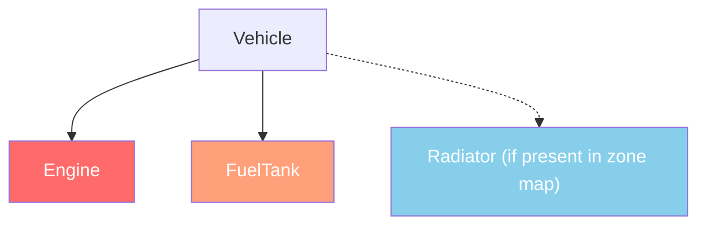

# Vehicle System


---

## Introduction

DayZ vehicles are entities that extend the transport system. Cars extend `CarScript`, boats extend `BoatScript`, and both inherit from `Transport`. Vehicles have fluid systems, parts with independent health, gear simulation, and physics managed by the engine. This chapter covers the API methods you need to interact with vehicles in scripts.

---

## Class Hierarchy

```
EntityAI
└── Transport                    // 3_Game - base for all vehicles
    ├── Car                      // 3_Game - engine-native car physics
    │   └── CarScript            // 4_World - scriptable car base
    │       ├── CivilianSedan
    │       ├── OffroadHatchback
    │       ├── Hatchback_02
    │       ├── Sedan_02
    │       ├── Truck_01_Base
    │       └── ...
    └── Boat                     // 3_Game - engine-native boat physics
        └── BoatScript           // 4_World - scriptable boat base
```

---

## Transport (Base)

**File:** `3_Game/vehicles/transport.c`

The abstract base for all vehicles. Provides seat management and crew access.

### Crew Management

```c
proto native int   CrewSize();                          // Total number of seats
proto native int   CrewMemberIndex(Human crew_member);  // Get seat index of a human
proto native Human CrewMember(int posIdx);              // Get human at seat index
proto native Human CrewGetOut(int posIdx);              // Force crew member out of seat (returns the ejected human)
proto native void  CrewDeath(int posIdx);               // Kill crew member in seat
```

### Crew Entry

```c
int  GetAnimInstance();                                 // Scripted (overridable) method, not proto native
proto native int  CrewPositionIndex(int componentIdx);  // Component to seat index
proto void CrewEntry(int posIdx, out vector pos, out vector dir);    // Entry point/direction in model space
proto void CrewEntryWS(int posIdx, out vector pos, out vector dir);  // Entry point/direction in world space
```

**Example --- eject all passengers:**

```c
void EjectAllCrew(Transport vehicle)
{
    for (int i = 0; i < vehicle.CrewSize(); i++)
    {
        Human crew = vehicle.CrewMember(i);
        if (crew)
        {
            vehicle.CrewGetOut(i);
        }
    }
}
```

---

## Car (Engine Native)

**File:** `3_Game/vehicles/car.c`

Engine-level car physics. All `proto native` methods that drive the vehicle simulation.

### Engine

```c
proto native bool  EngineIsOn();
proto native void  EngineStart();
proto native void  EngineStop();
proto native float EngineGetRPM();
proto native float EngineGetRPMRedline();
proto native float EngineGetRPMMax();
proto native int   GetGear();
```

### Fluids

DayZ vehicles have four fluid types defined in the `CarFluid` enum:

```c
enum CarFluid
{
    FUEL,
    OIL,
    BRAKE,
    COOLANT
}
```

```c
proto native float GetFluidCapacity(CarFluid fluid);
proto native float GetFluidFraction(CarFluid fluid);     // 0.0 - 1.0
proto native void  Fill(CarFluid fluid, float amount);
proto native void  Leak(CarFluid fluid, float amount);
proto native void  LeakAll(CarFluid fluid);
```

**Example --- refuel a vehicle:**

```c
void RefuelVehicle(Car car)
{
    float capacity = car.GetFluidCapacity(CarFluid.FUEL);
    float current = car.GetFluidFraction(CarFluid.FUEL) * capacity;
    float needed = capacity - current;
    car.Fill(CarFluid.FUEL, needed);
}
```

### Speed

```c
proto native float GetSpeedometer();  // Speed in km/h -- NOT absolute
float GetSpeedometerAbsolute();       // Math.AbsFloat(GetSpeedometer()) -- always non-negative
```

### Controls (Simulation)

```c
proto native void  SetBrake(float value, float unused0 = 0, bool unused1 = false);  // 0.0 - 1.0 (extra params unused)
proto native void  SetHandbrake(float value);                 // 0.0 - 1.0
proto native void  SetSteering(float value, bool unused0 = false);  // -1.0 - 1.0 (second param unused)
proto native void  SetThrottle(float value);                  // 0.0 - 1.0 (SetThrust is obsolete)
proto native void  SetClutch(float value);                    // SetClutchState is obsolete
```

### Wheels

```c
proto native int   WheelCount();
proto native bool  WheelIsAnyLocked();
proto native SurfaceInfo WheelGetSurface(int wheelIdx);
```

### Callbacks (Override in CarScript)

```c
void OnEngineStart();
void OnEngineStop();
void OnContact(string zoneName, vector localPos, IEntity other, Contact data);
void OnFluidChanged(CarFluid fluid, float newValue, float oldValue);
void OnGearChanged(int newGear, int oldGear);
void OnSound(CarSoundCtrl ctrl, float oldValue);
```

---

## CarScript

**File:** `4_World/entities/vehicles/carscript.c`

The scriptable car class that most vehicle mods extend. Adds parts, doors, lights, and sound management.

### Part Health

CarScript uses damage zones to represent vehicle parts. Each part can be independently damaged:

```c
// Check part health via the standard EntityAI API
float engineHP = car.GetHealth("Engine", "Health");
float fuelTankHP = car.GetHealth("FuelTank", "Health");

// Set part health
car.SetHealth("Engine", "Health", 0);       // Destroy the engine
car.SetHealth("FuelTank", "Health", 100);   // Repair the fuel tank
```

### Damage Zone Diagram

This diagram shows three damage-zone names used by `CarScript`, not a complete zone list for every vehicle. `Engine` and `FuelTank` are passed to the health API in `carscript.c:2572-2576`; `Radiator` is optional and is checked in the vehicle's zone map before use (`carscript.c:857-859`).



Damage zones are **not a fixed global list**. Each vehicle declares its own in its `config.cpp` under `DamageSystem >> DamageZones`, and `EntityAI.InitDamageZoneMapping()` builds the runtime map from that config via `DamageSystem.GetDamageZoneMap()`. So the correct way to find a given vehicle's zones is to read that vehicle's config, not to reuse a list from another vehicle.

These are the zone names vanilla *script* actually passes to the health API, and the ones you can rely on across the stock wheeled vehicles:

| Zone | Description | Seen in |
|------|-------------|---------|
| `""` (global) | Overall vehicle health | `CarScript`, `BoatScript` |
| `"Engine"` | Engine part | `CarScript.OnDamageCar()`, `BoatScript` |
| `"FuelTank"` | Fuel tank | `CarScript` |
| `"Radiator"` | Radiator (coolant) --- guarded with `m_DamageZoneMap.Contains("Radiator")` because not every car has one | `CarScript` |

> **Do not invent zone names.** `"Battery"`, `"SparkPlug"`, `"FrontLeft"`/`"FrontRight"`, `"RearLeft"`/`"RearRight"`, `"DriverDoor"`/`"CoDriverDoor"`, `"Hood"` and `"Trunk"` do **not** appear as damage-zone strings anywhere in the vanilla script dump. `"SparkPlug"`, `"CarBattery"` and `"TruckBattery"` are *attachment slot* names (used with `FindAttachmentBySlotName()`), which is a different namespace. For the battery slots, see `actionswitchlights.c:44-45`; plain `"Battery"` is not the slot name. Vanilla's geometry-side zone selections are spelled differently again --- `dmgZone_engine`, `dmgZone_front`, `dmgZone_back`, `dmgZone_fender_1_1` and friends. Passing a name that is not in a vehicle's zone map does not error; it just quietly does nothing. Follow `CarScript`'s own pattern and guard with `GetEntityDamageZoneMap().Contains(zone)` (`EntityAI`, `entityai.c`) before using an optional zone --- `DamageSystem.GetDamageZoneMap()` is a static, two-argument method that returns `bool`, not the map itself, and `CarScript`'s actual guard reads its own protected `m_DamageZoneMap` directly, which an external caller cannot access through a vehicle reference.

### Lights

The light API lives on `Transport`:

```c
proto native bool LightIsOn();    // True when lights are on
proto native void LightOn();      // Turn lights on
proto native void LightOff();     // Turn lights off
proto native void LightToggle();  // Toggle current light state
```

### Door Control

Door state is queried with `GetCarDoorsState`, which returns a `CarDoorState` value (`DOORS_MISSING`, `DOORS_OPEN`, or `DOORS_CLOSED`). Note that `slotType` is the **attachment slot name**, and vanilla's are prefixed per vehicle --- `"CivSedanDriverDoors"`, `"CivSedanCoDriverDoors"`, `"CivSedanHood"`, `"CivSedanTrunk"`, `"NivaDriverDoors"`, `"NivaHood"`, and so on (see `ActionAnimateSeats` and `ActionLockAttachment`). There is no generic `"DriverDoor"` slot; look up the names your target vehicle actually declares.

```c
enum CarDoorState
{
    DOORS_MISSING,
    DOORS_OPEN,
    DOORS_CLOSED
}

int GetCarDoorsState(string slotType);   // Returns a CarDoorState value
```

### Key Overrides for Custom Vehicles

```c
override void EEInit();                    // Initialize vehicle parts, fluids
override void OnEngineStart();             // Custom engine start behavior
override void OnEngineStop();              // Custom engine stop behavior
override void EOnPostSimulate(IEntity other, float timeSlice);  // Per-tick simulation (CarScript)
```

**Example --- create a vehicle with full fluids:**

```c
void SpawnReadyVehicle(vector pos)
{
    Car car = Car.Cast(GetGame().CreateObjectEx("CivilianSedan", pos,
                        ECE_PLACE_ON_SURFACE | ECE_INITAI | ECE_CREATEPHYSICS));
    if (!car)
        return;

    // Fill all fluids
    car.Fill(CarFluid.FUEL, car.GetFluidCapacity(CarFluid.FUEL));
    car.Fill(CarFluid.OIL, car.GetFluidCapacity(CarFluid.OIL));
    car.Fill(CarFluid.BRAKE, car.GetFluidCapacity(CarFluid.BRAKE));
    car.Fill(CarFluid.COOLANT, car.GetFluidCapacity(CarFluid.COOLANT));

    // Spawn required parts
    EntityAI carEntity = EntityAI.Cast(car);
    carEntity.GetInventory().CreateAttachment("CarBattery");
    carEntity.GetInventory().CreateAttachment("SparkPlug");
    carEntity.GetInventory().CreateAttachment("CarRadiator");
    carEntity.GetInventory().CreateAttachment("HatchbackWheel");
}
```

---

## BoatScript

**File:** `4_World/entities/vehicles/boatscript.c`

Scriptable base for boat entities. Similar API to CarScript but with propeller-based physics.

### Engine & Propulsion

```c
proto native bool  EngineIsOn();
proto native void  EngineStart();
proto native void  EngineStop();
proto native float EngineGetRPM();
```

### Fluids

Boats use a separate `BoatFluid` enum that only defines `FUEL`:

```c
float fuel = boat.GetFluidFraction(BoatFluid.FUEL);
boat.Fill(BoatFluid.FUEL, boat.GetFluidCapacity(BoatFluid.FUEL));
```

### Speed & Propulsion

`Boat` does not expose `GetSpeedometer()` (that method exists only on `Car`). Read engine RPM and propeller velocity instead:

```c
proto native float EngineGetRPM();                   // Engine rpm
proto native float PropellerGetAngularVelocity();    // Propeller angular velocity
```

**Example --- spawn a boat:**

`Boat_01` is not a directly spawnable class; spawn one of the concrete color variants (`Boat_01_Blue`, `Boat_01_Orange`, `Boat_01_Black`, `Boat_01_Camo`):

```c
void SpawnBoat(vector waterPos)
{
    BoatScript boat = BoatScript.Cast(
        GetGame().CreateObjectEx("Boat_01_Blue", waterPos,
                                  ECE_CREATEPHYSICS | ECE_INITAI)
    );
    if (boat)
    {
        boat.Fill(BoatFluid.FUEL, boat.GetFluidCapacity(BoatFluid.FUEL));
    }
}
```

---

## Vehicle Interaction Checks

### Checking if a Player is in a Vehicle

```c
PlayerBase player;
if (player.IsInVehicle())
{
    EntityAI vehicle = player.GetDrivingVehicle();
    CarScript car;
    if (Class.CastTo(car, vehicle))
    {
        float speed = car.GetSpeedometer();
        Print(string.Format("Driving at %1 km/h", speed));
    }
}
```

### Finding All Vehicles in the World

```c
void FindAllVehicles(out array<Transport> vehicles)
{
    vehicles = new array<Transport>;
    array<Object> objects = new array<Object>;
    array<CargoBase> proxyCargos = new array<CargoBase>;

    // Use a large radius from center of map
    GetGame().GetObjectsAtPosition(Vector(7500, 0, 7500), 15000, objects, proxyCargos);

    foreach (Object obj : objects)
    {
        Transport transport;
        if (Class.CastTo(transport, obj))
        {
            vehicles.Insert(transport);
        }
    }
}
```

---

## Summary

| Concept | Key Point |
|---------|-----------|
| Hierarchy | `Transport` > `Car`/`Boat` > `CarScript`/`BoatScript` |
| Engine | `EngineStart()`, `EngineStop()`, `EngineIsOn()`, `EngineGetRPM()` |
| Fluids | `CarFluid` enum: `FUEL`, `OIL`, `BRAKE`, `COOLANT` |
| Fill/Leak | `Fill(fluid, amount)`, `Leak(fluid, amount)`, `GetFluidFraction(fluid)` |
| Speed | `GetSpeedometer()` returns km/h |
| Crew | `CrewSize()`, `CrewMember(idx)`, `CrewGetOut(idx)` |
| Parts | Standard damage zones: `"Engine"`, `"FuelTank"`, `"Radiator"`, etc. |
| Creation | `CreateObjectEx` with `ECE_PLACE_ON_SURFACE \| ECE_INITAI \| ECE_CREATEPHYSICS` |
| 1.28 Config | `useNewNetworking`, `wheelHubFriction`, doubled brake torque values |
| 1.28 Physics | Updated Bullet Physics, new `Contact` API fields, suspension always active |
| 1.29 Experimental | Physics multithreading, `Transport` sleep, dynamic collision for all transport |

---

## Best Practices

- **Always include `ECE_CREATEPHYSICS | ECE_INITAI` when spawning vehicles.** Without physics, the vehicle falls through the ground. Without AI init, the engine simulation does not start and the vehicle cannot be driven.
- **Fill all four fluids after spawning.** A vehicle missing oil, brake fluid, or coolant will damage itself immediately when the engine starts. Use `GetFluidCapacity()` to get correct max values per vehicle type.
- **Null-check `CrewMember()` before operating on crew.** Empty seats return `null`. Iterating `CrewSize()` without checking each index causes crashes when seats are unoccupied.
- **Use `GetSpeedometer()` instead of computing velocity manually.** The engine's speedometer accounts for wheel contact, transmission state, and physics correctly. Manual velocity calculations from position deltas are unreliable.

---

## Compatibility & Impact

> **Mod Compatibility:** Vehicle mods commonly extend `CarScript` with modded classes. Conflicts arise when multiple mods override the same callbacks like `OnEngineStart()` or `EOnSimulate()`.

- **Load Order:** If two mods both `modded class CarScript` and override `OnEngineStart()`, only the last-loaded mod runs unless both call `super`. Vehicle overhaul mods should always call `super` in every callback.
- **Modded Class Conflicts:** DayZ Expansion Vehicles ships its own custom vehicle base class; mods that also touch `EEInit()` or fluid initialization on `CarScript` frequently conflict with it. Test with both loaded.
- **Performance Impact:** `EOnSimulate()` runs every physics tick for each active vehicle. Keep logic minimal in this callback; use timer accumulators for expensive operations.
- **Server/Client:** `EngineStart()`, `EngineStop()`, `Fill()`, `Leak()`, and `CrewGetOut()` are server-authoritative. `GetSpeedometer()`, `EngineIsOn()`, and `GetFluidFraction()` are safe to read on both sides.

---

## Vehicle Configuration Changes (1.28+)

> **Warning (1.28):** DayZ 1.28 introduced significant vehicle physics changes. If you are updating a vehicle mod from 1.27 or earlier, read this section carefully.
>
> **On the version numbers in this section:** the *content* of these changes was checked against the current unpacked game data, and where a claim is about script (the `Contact` class below) it is confirmed there. The *attribution of each change to a specific patch* comes from patch-note reporting, not from the game files, which carry no version history. Treat "1.28" and "1.29" here as approximate, and confirm against the official changelog for the build you actually target.

### `useNewNetworking` Parameter

DayZ 1.28 added the `useNewNetworking` config parameter for all `CarScript` classes. Default value is **1** (enabled).

```cpp
class CfgVehicles
{
    class CarScript;
    class MyVehicle : CarScript
    {
        // New networking improves rubber-banding at high ping
        useNewNetworking = 1;  // default — leave enabled for most mods

        // Disable ONLY if your mod modifies vehicle physics
        // outside of the SimulationModule config:
        // useNewNetworking = 0;
    };
};
```

**When to disable:** If your mod directly manipulates vehicle physics through script (custom `EOnSimulate` overrides, direct force application, custom wheel logic) rather than through the config-based `SimulationModule`, the new reconciliation system may fight your changes. Set `useNewNetworking = 0;` in that case.

### `wheelHubFriction` Parameter (1.28+)

New config variable that defines axle drag when **no wheels are attached**:

```cpp
class SimulationModule
{
    class Axles
    {
        class Front
        {
            wheelHubFriction = 0.5;  // How quickly vehicle decelerates with missing wheels
        };
    };
};
```

### Brake Torque Migration (1.28)

> **Breaking Change:** Prior to 1.28, brake and handbrake torque were applied **twice** due to a bug. This was fixed in 1.28. If you are migrating a vehicle mod, **double** your `maxBrakeTorque` and `maxHandbrakeTorque` values to maintain the same braking feel.

```cpp
// Pre-1.28 (bug: applied twice, so effective value was 2x)
maxBrakeTorque = 2000;
maxHandbrakeTorque = 3000;

// Post-1.28 (fix: applied once, so double to match old behavior)
maxBrakeTorque = 4000;
maxHandbrakeTorque = 6000;
```

### Suspension Always Active (1.28+)

Vehicle suspension is now always active while the vehicle is awake. Previously, suspension could be inactive in certain states. This improves stability but may change the feel of custom suspension tuning.

### Bullet Physics Update (1.28)

The Bullet Physics library was updated to the latest Enfusion version. Subtle differences in collision response, friction, and restitution may occur. Test all custom vehicle configurations thoroughly.

### Physics Contact API Changes (1.28)

The `Contact` class (`1_Core/physics/contact.c`, declared `sealed`) was reworked. The current shape, read directly from the unpacked scripts, is:

```c
sealed class Contact
{
    Physics Physics1;
    Physics Physics2;
    SurfaceProperties Material1;   // surface properties of Object1
    SurfaceProperties Material2;   // surface properties of Object2
    float   Impulse;               // impulse applied to resolve the collision
    int     ShapeIndex1;           // index of collider on Object1
    int     ShapeIndex2;           // index of collider on Object2
    vector  Normal;                // collision axis at the contact point
    vector  Position;              // contact point, world space
    float   PenetrationDepth;      // penetration depth on Object1

    float   RelativeNormalVelocityBefore;
    float   RelativeNormalVelocityAfter;
    vector  RelativeVelocityBefore;
    vector  RelativeVelocityAfter;

    vector  VelocityBefore1;       // Object1 velocity before collision, world space
    vector  VelocityBefore2;
    vector  VelocityAfter1;        // Object1 velocity after collision, world space
    vector  VelocityAfter2;

    proto native vector GetNormalImpulse();
    proto native float  GetRelativeVelocityBefore(vector vel);
    proto native float  GetRelativeVelocityAfter(vector vel);
}
```

Relative to older mod code:

- **Gone:** `MaterialIndex1` / `MaterialIndex2` and `Index1` / `Index2` --- none of these four names exist in the current scripts.
- **Present instead:** `ShapeIndex1` / `ShapeIndex2` identify which collider of a compound body was hit, and `Material1` / `Material2` are now `SurfaceProperties` objects rather than integer material indices.
- **Also available:** the pre/post collision velocity fields above, plus the three `proto native` helpers.

Mods that read `Contact` data in `OnContact` must update to these names and types. Because the class is `sealed`, you cannot extend it --- read the fields directly.

---

## Vehicle Changes in 1.29 (Experimental)

> **Note:** These changes are from DayZ 1.29 experimental and may change before stable release.

### Bullet Physics Multithreading (1.29 Experimental)

Multithreading support was enabled for the Bullet Physics library. Server stress tests showed up to 400% FPS improvement (9 FPS to 50 FPS). Vehicle mods that rely on specific physics timing or make physics calls from script callbacks should be tested extensively.

### Transport Sleep (1.29 Experimental)

Physics functions were added directly on `Transport` to allow vehicles to **sleep** when at rest. Inactive bodies no longer receive `EOnSimulate` / `EOnPostSimulate` callbacks. If your vehicle mod relies on these callbacks firing continuously, test on 1.29 experimental.

### Dynamic Collision for All Transport (1.29 Experimental)

The `Transport` class (parent of `CarScript` and `BoatScript`) now has dynamic collision resolution. Previously, only `CarScript` had this. Boat mods benefit from proper collision handling.

---

## Common Patterns in Published Vehicle Mods

These recurring patterns are all built from the vanilla `CarScript` API covered in this chapter:

- **Custom initialization in `EEInit()`** — subclasses override `EEInit()` (calling `super.EEInit()` first) to set fluid levels and spawn required attachments the moment the vehicle is created.
- **Tick accumulator in `EOnPostSimulate()`** — rather than running expensive logic every physics tick, accumulate `timeSlice` into a member float and act only when it crosses a threshold (periodic fuel-consumption checks, wear simulation).
- **Admin eject-all via `CrewGetOut()`** — loop over `CrewSize()` and call `CrewGetOut(i)` for each occupied seat, exactly like the `EjectAllCrew()` example earlier in this chapter.
- **Collision damage tuning in `OnContact()`** — override `OnContact()` to scale or filter contact damage using the `Contact` data before delegating to `super`.
