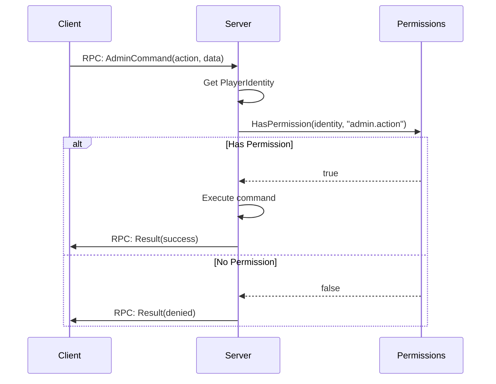

# Admin & Server Management

> **Summary:** The engine-level APIs that server administration is built on — reading the player list and identity, kicking and banning, writing the admin log, controlling time and weather, and reaching the Hive. Operational topics (server startup, launch parameters, `serverDZ.cfg`, BattlEye setup) live in Part 9; permission frameworks live in Part 7. Declarations are checked against the supplied extraction (release identity unconfirmed); snippets are illustrative and have not been compiled or runtime-tested, with a single worked example, **Lantern Admin**, showing how the pieces fit together.

---

## Table of Contents

- [Player Management](#player-management)
- [World Control](#world-control)
- [Permission Checks](#permission-checks)
- [Logging & Monitoring](#logging-monitoring)
- [Hive & Database](#hive-database)
- [Worked Example: Building Admin Features](#worked-example-building-admin-features)
- [Connection Events & Load Order](#connection-events-load-order)
- [BattlEye Notes](#battleye-notes)
- [Best Practices](#best-practices)
- [Common Mistakes](#common-mistakes)

---

## Introduction

Server administration in DayZ covers a broad set of responsibilities: managing connected players, enforcing rules, controlling world state (time, weather), logging events for audit trails, and integrating with persistence. Unlike most game engines that ship a built-in admin panel, DayZ exposes only low-level scripting APIs. Community admin tools such as **Community Online Tools (COT)**, **VPP Admin Tools**, and **DayZ-Expansion** build their panels entirely on top of these same engine APIs.

This chapter documents the engine-level admin APIs and the integration points that connect scripts to the Hive database and external services. Every signature is taken from the vanilla script source. Throughout the chapter, a small fictional framework called **Lantern Admin** (class prefix `LNT_`) is used to illustrate how the raw APIs combine into working features — related framework patterns live in Part 7. `LNT_FindPlayerByUID`, `LNT_RPC.SendReason`, `RequestTeleport`, and `RequestKick` are integration placeholders you must implement and register; this is not a complete admin mod.

For operational setup — launch parameters, `serverDZ.cfg`, profile layout, mod load order — see **Part 9 (Server Administration)**, especially [9.1 Server Setup](../09-server-admin/01-server-setup.md) and [9.3 serverDZ.cfg](../09-server-admin/03-server-cfg.md).

---

## Player Management

### Getting All Online Players

The engine provides two interfaces to retrieve all connected player entities.

```c
// Via CGame (most common)
array<Man> players = new array<Man>();
GetGame().GetPlayers(players);

// Alternative via World
array<Man> worldPlayers = new array<Man>();
GetGame().GetWorld().GetPlayerList(worldPlayers);
```

**Signatures** (from `3_Game/global/game.c` and `3_Game/global/world.c`):

```c
// CGame
proto native void GetPlayers(out array<Man> players);

// World
proto native void GetPlayerList(out array<Man> players);
```

Both populate an output array with `Man` references. Cast each to `PlayerBase` for full functionality:

```c
array<Man> players = new array<Man>();
GetGame().GetPlayers(players);

foreach (Man man : players)
{
    PlayerBase player = PlayerBase.Cast(man);
    if (player && player.GetIdentity())
    {
        string name = player.GetIdentity().GetName();
        string steamId = player.GetIdentity().GetPlainId();
        // ... admin logic
    }
}
```

### PlayerIdentity

Every connected player has a `PlayerIdentity` object that exposes identification and network statistics. Access it via `player.GetIdentity()`.

**Key methods** (from `3_Game/gameplay.c`):

```c
class PlayerIdentityBase : Managed
{
    // --- Identification ---
    proto string GetName();         // Nick (short) name of player
    proto string GetPlainName();    // Nick without any processing
    proto string GetFullName();     // Full name of player
    proto string GetId();           // Unique id (hashed steamID, database Xbox id...) CAN be used in database or logs
    proto string GetPlainId();      // Plaintext unique id - CANNOT be used in database or logs
    proto int    GetPlayerId();     // Session id (reused after disconnect)

    // --- Network Stats ---
    proto int GetPingAct();         // Current ping
    proto int GetPingMin();         // Minimum ping
    proto int GetPingMax();         // Maximum ping
    proto int GetPingAvg();         // Average ping
    proto int GetBandwidthMin();    // Bandwidth estimation (kbps)
    proto int GetBandwidthMax();
    proto int GetBandwidthAvg();
    proto float GetOutputThrottle(); // Throttling on output (0-1)
    proto float GetInputThrottle();  // Throttling on input (0-1); unknown on server

    // --- Associated Player ---
    proto Man GetPlayer();          // Get the player entity
}

// Moddable subclass (can be extended by mods)
class PlayerIdentity : PlayerIdentityBase {}
```

**Identity ID guidance (PC/Steam examples):**

| Method | Returns | Use For |
|--------|---------|---------|
| `GetPlainId()` | Plaintext unique id --- on PC the raw Steam64 ID (e.g. `"76561198012345678"`) | Live in-memory comparisons and operator-facing display. The source comments it **"cannot be used in database or logs"** (`gameplay.c:369-370`) |
| `GetId()` | Unique id of player: hashed steamID, database Xbox id, and so on | Database keys, persistent storage, log files --- the source explicitly sanctions this use (`gameplay.c:367-368`) |
| `GetName()` | Short nickname | UI display, log messages |
| `GetPlayerId()` | Integer session ID | Network operations within current session |

### Kicking Players

The inspected `CGame` interface provides `DisconnectPlayer()` which terminates the connection.

**Signature** (from `3_Game/global/game.c`):

```c
proto native void DisconnectPlayer(PlayerIdentity identity, string uid = "");
```

A bare disconnect gives the player no explanation. The usual approach is to send a reason to the client over RPC first, then disconnect on a short timer so the message arrives before the connection drops. The following is a illustrative `LNT_` helper (`LNT_RPC` is the example framework's RPC router — see [RPC Patterns](../07-patterns/03-rpc-patterns.md)):

```c
class LNT_KickService
{
    // Send the reason to the client, then disconnect after a brief delay
    void KickWithReason(PlayerBase target, string reason)
    {
        if (!target)
            return;

        PlayerIdentity identity = target.GetIdentity();
        if (!identity)
            return;

        // 1. Tell the client why (client shows it as a dialog)
        LNT_RPC.SendReason(identity, reason);

        // 2. Disconnect one second later, giving the RPC time to land
        GetGame().GetCallQueue(CALL_CATEGORY_SYSTEM).CallLater(this.DoDisconnect, 1000, false, identity);
    }

    void DoDisconnect(PlayerIdentity identity)
    {
        if (identity)
            GetGame().DisconnectPlayer(identity);
    }
}
```

A delay gives the notification time to travel but cannot guarantee delivery. Keep the service alive while its callback is queued and revalidate that the identity still belongs to the intended connection.

The `EClientKicked` enum (from `3_Game/global/errormodulehandler/clientkickedmodule.c`) defines the kick reasons the engine itself recognizes:

```c
enum EClientKicked
{
    UNKNOWN = -1,
    OK = 0,
    SERVER_EXIT,        // Server shutting down
    KICK_ALL_ADMIN,     // Admin kicked all (RCON)
    KICK_ALL_SERVER,    // Server kicked all
    TIMEOUT,            // Network timeout
    LOGOUT,             // Player logged out
    KICK,               // Generic kick
    BAN,                // Player was banned
    PING,               // Ping limit exceeded
    MODIFIED_DATA,      // Modified game files
    UNSTABLE_NETWORK,   // Connection too unstable
    SERVER_SHUTDOWN,    // Server shutting down
    NOT_WHITELISTED,    // Not on whitelist
    NO_IDENTITY,        // No identity received
    NO_INPUT_INTERFACE, // No input interface for player
    INVALID_UID,        // UID incorrect while creating identity
    BANK_COUNT,         // Bank count changed
    ADMIN_KICK,         // Kicked by admin
    INVALID_ID,         // Invalid player ID
    INPUT_HACK,         // Sending more inputs than possible
    QUIT,               // Player closed the game
    LEAVE,              // Player pressed Leave button
    PLATFORM_NOT_SUPPORTED, // Platform not allowed on this server (crossplatform restriction)
    // ... large jumps follow for login machine errors (LOGIN_MACHINE_ERROR = 48),
    // DB errors, respawn, verification, auth, and PBO mismatch codes
    BATTLEYE = 240,     // BattlEye kick
}
```

### Ban Management

The inspected declarations do not establish a general native ban API. This chapter describes external administration and mod-owned ban lists:

1. **External administration** — verify commands for the actual server-console or BattlEye RCon interface; their syntax is not interchangeable (see [BattlEye Notes](#battleye-notes)).
2. **Server-side ban lists** — an admin mod maintains its own JSON ban file under `$profile:` and refuses banned players as they connect.

A script-side ban list is straightforward to build on vanilla file I/O. The `LNT_BanManager` below stores records — including a temporary-ban expiry — and persists them with `JsonFileLoader` (modern `LoadFile` / `SaveFile` return success and an error string; legacy `JsonLoadFile` / `JsonSaveFile` return void):

```c
// One ban entry, serialized to JSON
class LNT_BanRecord
{
    string steamId;
    string playerName;
    string reason;
    bool   permanent;
    int    expiryDate;   // YYYYMMDD, ignored when permanent
    int    expiryTime;   // HHMM,     ignored when permanent
}

// The on-disk ban file
class LNT_BanList
{
    ref array<ref LNT_BanRecord> bans = new array<ref LNT_BanRecord>();
}

class LNT_BanManager
{
    protected ref LNT_BanList m_List;
    protected bool m_LoadOK;
    protected const string BAN_PATH = "$profile:LanternAdmin/bans.json";

    void LNT_BanManager()
    {
        MakeDirectory("$profile:LanternAdmin");
        Load();
    }

    void Load()
    {
        m_List = new LNT_BanList();
        m_LoadOK = true;
        if (FileExist(BAN_PATH))
        {
            string error;
            m_LoadOK = JsonFileLoader<LNT_BanList>.LoadFile(BAN_PATH, m_List, error);
            if (!m_LoadOK || !m_List || !m_List.bans)
            {
                m_LoadOK = false;
                ErrorEx("Ban list unavailable: " + error);
            }
        }
    }

    void Save()
    {
        if (!m_LoadOK)
            return;
        string error;
        if (!JsonFileLoader<LNT_BanList>.SaveFile(BAN_PATH, m_List, error))
            ErrorEx(error);
    }

    // Build comparable YYYYMMDD / HHMM stamps from the current UTC clock
    void NowStamp(out int dateStamp, out int timeStamp)
    {
        int y, mo, d, h, mi, s;
        GetYearMonthDayUTC(y, mo, d);
        GetHourMinuteSecondUTC(h, mi, s);
        dateStamp = y * 10000 + mo * 100 + d;
        timeStamp = h * 100 + mi;
    }

    bool IsBanned(string steamId)
    {
        if (!m_LoadOK)
            return true; // Example policy: refuse admission until the file is repaired
        int nowDate, nowTime;
        NowStamp(nowDate, nowTime);

        foreach (LNT_BanRecord rec : m_List.bans)
        {
            if (!rec || rec.steamId != steamId)
                continue;
            if (rec.permanent)
                return true;
            // Temporary ban: still active until its expiry stamp passes
            if (rec.expiryDate > nowDate)
                return true;
            if (rec.expiryDate == nowDate && rec.expiryTime > nowTime)
                return true;
        }
        return false;
    }

    void Add(string steamId, string playerName, string reason, bool permanent, int expiryDate, int expiryTime)
    {
        if (!m_LoadOK)
            return;
        LNT_BanRecord rec = new LNT_BanRecord();
        rec.steamId = steamId;
        rec.playerName = playerName;
        rec.reason = reason;
        rec.permanent = permanent;
        rec.expiryDate = expiryDate;
        rec.expiryTime = expiryTime;
        m_List.bans.Insert(rec);
        Save();
    }
}
```

Enforcement happens as the player connects. The mission's `OnClientPrepareEvent` (see [Connection Events](#connection-events-load-order)) runs before the character finishes loading, but an admission-check integration must account for the remaining vanilla event flow. This storage example does not implement or test connection rejection. To ban someone already in-game, call `Add()` and then reuse the deferred kick from the previous section.

---

## World Control

### Admin Log

The engine provides a native method to write to the server's admin log file (`*.ADM` file in the server profile).

**Signature** (from `3_Game/global/game.c`):

```c
proto native void AdminLog(string text);
```

**Usage:**

```c
// Direct engine call
GetGame().AdminLog("Admin action: player teleported");

// Through PluginAdminLog (vanilla pattern)
PluginAdminLog adm = PluginAdminLog.Cast(GetPlugin(PluginAdminLog));
if (adm)
    adm.DirectAdminLogPrint("Custom admin event occurred");
```

The vanilla `PluginAdminLog` class wraps `AdminLog()` and provides structured logging for player events:

| Method | Logged Event |
|--------|-------------|
| `PlayerKilled(player, source)` | Kill with weapon, distance, attacker |
| `PlayerHitBy(damageResult, ...)` | Hit details: zone, damage, ammo type |
| `UnconStart(player)` / `UnconStop(player)` | Unconsciousness transitions |
| `Suicide(player)` | Suicide via emote |
| `BleedingOut(player)` | Death by bleeding |
| `OnPlacementComplete(player, item)` | Item placement (tents, traps) |
| `OnContinouousAction(action_data)` | Build/dismantle/destroy actions |
| `PlayerList()` | Periodic dump of all players with positions |
| `PlayerTeleportedLog(player, from, to, reason)` | Teleportation events |

The plugin is controlled by `serverDZ.cfg` settings, read through the engine's `ServerConfigGetInt()`:

```c
// Read in the PluginAdminLog constructor
m_HitFilter = g_Game.ServerConfigGetInt("adminLogPlayerHitsOnly");   // 1 = player hits only
m_PlacementFilter = g_Game.ServerConfigGetInt("adminLogPlacement");  // 1 = log placements
m_ActionsFilter = g_Game.ServerConfigGetInt("adminLogBuildActions"); // 1 = log build actions
m_PlayerListFilter = g_Game.ServerConfigGetInt("adminLogPlayerList"); // 1 = periodic list
```

The `serverDZ.cfg` keys themselves are documented in [9.3 serverDZ.cfg](../09-server-admin/03-server-cfg.md).

### Chat Messages

**Signatures** (from `3_Game/global/game.c`):

```c
// Print text to local chat (client-side)
proto native void Chat(string text, string colorClass);

// Send chat from server to a specific recipient
proto native void ChatMP(Man recipient, string text, string colorClass);

// Submit player chat; this declaration is not a server-only contract
proto native void ChatPlayer(string text);
```

The `colorClass` parameter is a string naming a chat color class. Vanilla uses `"colorAction"`, `"colorFriendly"` and `"colorImportant"` --- the first appears in the `Chat()` documentation example itself (`3_game/global/game.c:1029-1035`) and all three are used throughout `4_world/entities/itembase/fishingrod_base.c` (lines 129, 203, 209, 275, 297 and others). The value resolves against chat configuration, so a custom class must exist there before it will render.

### Time & Date Control

The `World` class provides direct control over the in-game date and time.

**Signatures** (from `3_Game/global/world.c`):

```c
class World : Managed
{
    // Read current date/time
    proto void GetDate(out int year, out int month, out int day, out int hour, out int minute);

    // Set date/time for server administration (replication not tested here)
    proto native void SetDate(int year, int month, int day, int hour, int minute);

    // Time acceleration multiplier (0-64, -1 to reset to config)
    proto native void SetTimeMultiplier(float timeMultiplier);

    // Day/night queries
    proto native bool IsNight();
    proto native float GetSunOrMoon(); // Native sun/moon query; encoding not documented here
}
```

**Example usage:**

```c
// Read current time
int year, month, day, hour, minute;
GetGame().GetWorld().GetDate(year, month, day, hour, minute);

// Set to noon
GetGame().GetWorld().SetDate(year, month, day, 12, 0);

// Speed up time (2x acceleration)
GetGame().GetWorld().SetTimeMultiplier(2.0);
```

Also available from `CGame`:

```c
proto native float GetDayTime(); // Current daytime on server; unit not specified in this declaration
```

### Weather Control

The `Weather` class (accessed via `GetGame().GetWeather()`) exposes phenomenon objects for overcast, rain, fog, snowfall, and wind. This section covers the admin-facing calls; for the full weather model see [Weather](./03-weather.md).

**Core structure** (from `3_Game/weather.c`):

```c
class Weather
{
    proto native Overcast       GetOvercast();
    proto native Fog            GetFog();
    proto native Rain           GetRain();
    proto native Snowfall       GetSnowfall();
    proto native WindDirection   GetWindDirection();
    proto native WindMagnitude   GetWindMagnitude();

    proto native void SetStorm(float density, float threshold, float timeOut);
    proto native void SetWind(vector wind);
    proto native float GetWindSpeed();

    void MissionWeather(bool use);  // Enable mission-controlled weather
}
```

Each phenomenon (Overcast, Rain, Fog, etc.) extends `WeatherPhenomenon`:

```c
class WeatherPhenomenon
{
    proto native float GetActual();     // Current value (0-1 except wind)
    proto native float GetForecast();   // Target value

    // Set forecast: value, interpolation time (seconds), minimum duration (seconds)
    proto native void Set(float forecast, float time = 0, float minDuration = 0);

    // Control auto-change behavior
    proto native void SetLimits(float fnMin, float fnMax);
    proto native void SetForecastChangeLimits(float fcMin, float fcMax);
    proto native void SetForecastTimeLimits(float ftMin, float ftMax);
    proto native float GetNextChange();
    proto native void SetNextChange(float time);
}
```

**Admin weather control example:**

```c
Weather weather = GetGame().GetWeather();

// Force clear skies over 60 seconds, hold for 10 minutes
weather.GetOvercast().Set(0.0, 60, 600);

// Stop rain immediately
weather.GetRain().Set(0.0, 0, 300);

// Dense fog over 30 seconds
weather.GetFog().Set(0.8, 30, 600);

// Thunderstorm: high density, triggers above 0.6 overcast, 10s between strikes
weather.SetStorm(1.0, 0.6, 10);

// Bypass WorldData callback; native forecasting still runs
weather.MissionWeather(true);
weather.GetOvercast().SetLimits(0.0, 0.2);   // Lock to clear
weather.GetRain().SetLimits(0.0, 0.0);       // No rain
```

---

## Permission Checks

Any RPC handler that performs a privileged action must confirm the sender is allowed to do it — **server-side, every time**. Client-side UI checks are cosmetic; a modified client can send any RPC. This section covers the admin-specific plumbing; a reusable, dot-separated permission framework (`LNT_Permissions`) is built end to end in [Permissions](../07-patterns/05-permissions.md).



### UID-Based Admin Detection

The simplest check compares a player's Steam64 ID against a file-loaded list:

```c
class LNT_AdminList
{
    protected ref array<string> m_AdminUIDs = new array<string>();

    void Load()
    {
        m_AdminUIDs.Clear();
        // One Steam64 ID per line at $profile:LanternAdmin/admins.txt
        FileHandle file = OpenFile("$profile:LanternAdmin/admins.txt", FileMode.READ);
        if (file == 0)
            return;

        string line;
        while (FGets(file, line) >= 0)
        {
            line = line.Trim();
            if (line.Length() > 0)
                m_AdminUIDs.Insert(line);
        }
        CloseFile(file);
    }

    bool IsAdmin(PlayerIdentity identity)
    {
        if (!identity)
            return false;
        return m_AdminUIDs.Find(identity.GetPlainId()) != -1;
    }
}
```

> **Identifier caution.** This example stores plaintext Steam64 IDs on disk because that is what operators can read and paste. The engine's own declaration says `GetPlainId()` **cannot be used in database or logs** (`gameplay.c:369-370`), while `GetId()` is the identifier documented for exactly that. If your admin data lands in a database or the RPT log, key it on `GetId()` and keep any plaintext ID for display only. The in-memory `Find()` comparison below is not itself database or log storage.

A UID list answers only "admin or not". Real tools grade access with **hierarchical, dot-separated permissions** (`"admin.player.teleport"`, `"admin.world.weather"`) so a moderator can teleport but not spawn items. That model — registration, wildcard `"*"` super-admin, per-group storage — is the subject of the [Permissions](../07-patterns/05-permissions.md) chapter; the snippets below assume a `LNT_Permissions.GetInstance().HasPermission(uid, node)` from there.

### Server-Side Validation in RPC Handlers

Validate the sender before touching game state:

```c
// Server-side RPC handler
void OnKickRequest(ParamsReadContext ctx, PlayerIdentity sender)
{
    Param1<string> data = new Param1<string>("");
    if (!ctx.Read(data))
        return;

    // ALWAYS verify permissions server-side, using the sender's real UID
    if (!GetGame().IsServer() || !sender)
        return;
    if (!LNT_Permissions.GetInstance().HasPermission(sender.GetPlainId(), "admin.player.kick"))
        return;

    string targetUid = data.param1;
    PlayerBase target = LNT_FindPlayerByUID(targetUid);
    if (target && target.GetIdentity())
        GetGame().DisconnectPlayer(target.GetIdentity());
}
```

Never trust a client-side permission check alone. Always re-validate on the server, keyed on `sender.GetPlainId()` (the identity the engine attaches to the RPC), never on any UID the client puts in the payload.

### Permission & Data Storage

Keep all admin data under one profile subfolder so operators can back it up or wipe it in one place:

```
$profile:LanternAdmin/
    admins.txt          -- Steam64 IDs, one per line
    bans.json           -- LNT_BanManager records
    permissions/        -- Groups and per-UID grants (see Part 7 Permissions)
    logs/               -- Session log files
```

The `$profile:` prefix resolves to whatever directory the operator set with `-profiles=` — never hardcode absolute paths.

---

## Logging & Monitoring

### Admin Log (ADM Files)

The primary server-side audit log. Controlled by `serverDZ.cfg` settings (`adminLogPlayerHitsOnly`, `adminLogPlacement`, `adminLogBuildActions`, `adminLogPlayerList`) and written to `$profile:` as `.ADM` files.

```c
// Write directly
GetGame().AdminLog("Custom message to ADM file");
```

`PluginAdminLog.GetPlayerPrefix` uses name, `identity.GetId()`, and position:

```c
// Vanilla prefix format (from PluginAdminLog.GetPlayerPrefix):
// Illustrative output: Player "PlayerName" (id=PlatformUniqueID pos=<X, Z, Y>)
```

### Script Log

`Print` and `PrintFormat` write script diagnostics. For explicit engine RPT output use `PrintToRPT`; these are separate log channels. No log output was generated in this audit.

Script diagnostics:

```c
Print("Debug message");                              // Standard output
PrintFormat("Player %1 at pos %2", name, pos);       // Formatted output
Error("Something went wrong");                        // Error-level output
```

### Custom Log Files

For mod-specific logging, use the file I/O API. A dedicated log file keeps admin activity separate from the noise in the ADM/RPT logs — and can optionally mirror to the ADM log so operators see everything in one place:

```c
class LNT_AdminLog
{
    protected FileHandle m_File;
    protected bool m_MirrorToADM;

    void Open(bool mirrorToADM)
    {
        Close();
        m_MirrorToADM = mirrorToADM;

        MakeDirectory("$profile:LanternAdmin");
        MakeDirectory("$profile:LanternAdmin/logs");

        int y, mo, d;
        GetYearMonthDayUTC(y, mo, d);

        string fileName = string.Format("$profile:LanternAdmin/logs/Log_%1-%2-%3.txt", y, mo, d);
        m_File = OpenFile(fileName, FileMode.APPEND);
    }

    void Write(string message)
    {
        int h, mi, s;
        GetHourMinuteSecondUTC(h, mi, s);
        string stamp = string.Format("[%1:%2:%3] ", h, mi, s);

        // Own log file
        if (m_File != 0)
            FPrintln(m_File, stamp + message);

        // Optionally also into the engine admin log
        if (m_MirrorToADM)
            GetGame().AdminLog("[Lantern] " + message);
    }

    void Close()
    {
        if (m_File != 0)
        {
            CloseFile(m_File);
            m_File = 0;
        }
    }
}
```

Note `FileMode.APPEND` — opening with `FileMode.WRITE` truncates the file each session.

### Discord Webhooks

The DayZ engine ships a **native HTTP client**: the `RestApi` class in `3_Game/http/restapi.c`. You do **not** need any external framework to POST to a Discord webhook — Framework wrappers, where used, are separate third-party APIs.

Build the JSON payload with `JsonSerializer` rather than string concatenation — that encodes JSON quotes, backslashes, and control characters correctly. Enforce supports escaped quotes; vanilla `JsonFileLoader.LoadFile` uses them in error strings:

```c
// Serializable body matching Discord's webhook schema
class LNT_DiscordPayload
{
    string content;
}

// The callback must outlive the request: POST() is asynchronous and the engine
// invokes OnSuccess/OnError/OnTimeout later (restapi.c:48-88). Holding it in a
// file-scope ref is the simplest way to keep it alive.
ref RestCallback g_LNT_DiscordCallback;

// POST a message to a Discord webhook using the vanilla RestApi
void LNT_PostDiscord(string webhookUrl, string message)
{
    if (!GetGame().IsServer())
        return;
    RestApi api = GetRestApi();
    if (!api)
        return;

    RestContext ctx = api.GetRestContext(webhookUrl);
    if (!ctx)
        return;

    ctx.SetHeader("application/json");

    LNT_DiscordPayload payload = new LNT_DiscordPayload();
    payload.content = message;

    string body;
    JsonSerializer serializer = new JsonSerializer();
    if (!serializer.WriteToString(payload, false, body))
        return;

    // The request path is empty because the full webhook URL is the context.
    // Assign the retained callback *before* the call so it is still alive when
    // the engine reports the result.
    g_LNT_DiscordCallback = new RestCallback();
    ctx.POST(g_LNT_DiscordCallback, "", body);
}
```

Discord limits `content` to 2000 characters and documents `wait` and `allowed_mentions` in [Execute Webhook](https://docs.discord.com/developers/resources/webhook#execute-webhook) (accessed 2026-09-11). Validate payload size and handle errors and rate limits in a production integration. Note the callback lifetime above: passing `new RestCallback()` directly as the argument leaves it unreferenced the moment `POST()` returns.

If `GetRestApi()` returns null, return rather than calling `CreateRestApi()`. That global is declared "out of Hive initialization" (`restapi.c:179-183`), is paired with `DestroyRestApi()`, and no vanilla script in the inspected extraction calls it; creating the engine-global REST API from a mod is not documented as side-effect-free and can collide with the engine's own instance.

`RestContext.POST()` takes a `RestCallback` whose `OnSuccess` / `OnError` methods you can override to react to the HTTP result. Keep webhook posting server-side to protect its credential; this does not mean native REST is unavailable on clients. Store the webhook URL in your `$profile:` config rather than hardcoding it.

---

## Hive & Database

### What Is the Hive

The Hive is DayZ's persistence layer — a native C++ system that stores character data, world objects (tents, barrels, vehicles), and server state to disk. It is not directly accessible from script beyond a small set of `proto native` methods.

**Hive class** (from `3_Game/hive/hive.c`):

```c
class Hive
{
    proto native void InitOnline(string ceSetup, string host = "");
    proto native void InitOffline();
    proto native void InitSandbox();
    proto native bool IsIdleMode();
    proto native void SetShardID(string shard);
    proto native void SetEnviroment(string env);
    proto native void CharacterSave(Man player);
    proto native void CharacterKill(Man player);
    proto native void CharacterExit(Man player);
    proto native void CallUpdater(string content);
    proto native bool CharacterIsLoginPositionChanged(Man player);
}

proto native Hive CreateHive();
proto native void DestroyHive();
proto native Hive GetHive();
```

### Character Persistence

The Hive manages character lifecycle through these methods:

```c
// Save character state (called periodically and on disconnect)
GetHive().CharacterSave(player);

// Mark character as dead in database
GetHive().CharacterKill(player);

// Mark character as exited (disconnect without death)
GetHive().CharacterExit(player);
```

These are called automatically by `MissionServer` during connection and disconnection events:

```c
// From MissionServer.PlayerDisconnected() (missionserver.c:677-710)
if (GetHive())
{
    // save player
    player.Save();

    // unlock player in DB
    GetHive().CharacterExit(player);
}
```

`OnClientDisconnectedEvent()` (`missionserver.c:628-674`) does **not** call `CharacterExit` itself. Its logout-timer branch returns early and `UpdateLogoutPlayers()` reaches `PlayerDisconnected()` once the timer expires (`:290`); only the instant-logout branch calls `PlayerDisconnected()` directly (`:673`). Hook `PlayerDisconnected()` if you need to observe or extend the Hive exit.

### Object Persistence

World objects (tents, barrels, buried stashes, vehicles) persist through the Central Economy (CE) system, not through direct script calls. Storage location depends on mission/server persistence configuration; do not infer it from `$profile:`. `Hive.CharacterSave` saves a character, not arbitrary world objects; these declarations expose no general database query. See [Central Economy](./10-central-economy.md).

### Hive Initialization Modes

| Mode | Method | Use Case |
|------|--------|----------|
| Online | `InitOnline(ceSetup)` | Normal dedicated server with persistence |
| Offline | `InitOffline()` | Used by official dedicated-server mission examples |
| Sandbox | `InitSandbox()` | Native mode; persistence guarantees not established here |

The Hive mode is set in `init.c` before the mission starts. Guard `GetHive()` before use; a missing Hive reference alone does not establish the behavior of every persistence subsystem.

---

## Worked Example: Building Admin Features

The remaining features admin panels are known for — teleport, object spawning, weather/time toggles, on-screen overlays — are all thin wrappers over vanilla APIs. The `LNT_` code below is a single, illustrative example of how they wire together. (Lantern Admin is the wiki's teaching mod, not a shipped product.)

### Teleport

A teleport is a server-side `SetPosition()` plus a log entry. Naming the three common moves as an enum keeps call sites readable:

```c
enum LNT_Teleport
{
    GOTO,    // admin moves to the target
    BRING,   // target is moved to the admin
    RETURN   // target is sent back to a saved position
}

// Server-side: move the player and record it in the ADM log
void LNT_TeleportPlayer(PlayerBase player, vector destination, string reason)
{
    if (!player)
        return;
    if (!player.IsAlive())
        return;

    vector from = player.GetPosition();
    player.SetPosition(destination);

    PluginAdminLog adm = PluginAdminLog.Cast(GetPlugin(PluginAdminLog));
    if (adm)
        adm.PlayerTeleportedLog(player, from, destination, reason);
}
```

A "teleport to where I'm looking" hotkey resolves the destination on the client with a camera raycast, then sends the hit point to the server (which calls `LNT_TeleportPlayer`). The raycast uses the current camera transform and `DayZPhysics.RaycastRV`:

```c
// CLIENT: find the world point under the crosshair
vector rayStart = GetGame().GetCurrentCameraPosition();
vector rayEnd = rayStart + GetGame().GetCurrentCameraDirection() * 1000.0;

vector hitPos;
vector hitNormal;
int hitComponent;
bool hit = DayZPhysics.RaycastRV(rayStart, rayEnd, hitPos, hitNormal, hitComponent);
if (hit)
{
    // Send hitPos to the server via RPC; the server validates and teleports
    LNT_RPC.RequestTeleport(hitPos);
}
```

### Object Spawner

Spawning any item or entity is `CreateObjectEx` with the flags that place it on the ground, followed by an optional health set:

```c
// Server-side: spawn an item on the surface, optionally at a set health
Object LNT_SpawnItem(string className, vector position, float health)
{
    Object obj = GetGame().CreateObjectEx(className, position, ECE_PLACE_ON_SURFACE);

    EntityAI entity = EntityAI.Cast(obj);
    if (entity && health >= 0)
        entity.SetHealth("", "", health);

    return obj;
}
```

The relevant engine signatures (from `3_Game/global/game.c`):

```c
proto native Object CreateObject(string type, vector pos, bool create_local = false, bool init_ai = false, bool create_physics = true);

proto native Object CreateObjectEx(string type, vector pos, int iFlags, int iRotation = RF_DEFAULT);
```

`ECE_PLACE_ON_SURFACE` (defined in `3_Game/ce/centraleconomy.c`) combines the create-physics, path-graph-update, and surface-trace flags, so the object drops onto terrain correctly.

### Weather & Time Actions

Admin weather and time panels are direct calls into the APIs shown under [World Control](#world-control):

```c
// Apply a weather preset (server-side)
void LNT_ApplyWeather(float overcast, float rain, float fog, float interpTime, float duration)
{
    Weather w = GetGame().GetWeather();
    w.MissionWeather(true);   // bypass WorldData callback; native forecasts continue
    w.GetOvercast().Set(overcast, interpTime, duration);
    w.GetRain().Set(rain, interpTime, duration);
    w.GetFog().Set(fog, interpTime, duration);
}

// Apply a date/time preset (server-side)
void LNT_ApplyDate(int year, int month, int day, int hour, int minute)
{
    GetGame().GetWorld().SetDate(year, month, day, hour, minute);
}
```

### Player Overlays (ESP)

An "ESP" overlay draws player names, distance, and health above heads on the admin's screen. It is a **world-overlay tooling** problem, not an admin-API one: the server sends positions and stats to the admin client over RPC on a timer (for example, every 1–5 seconds; tune the interval to your workload), and the client projects each world position to screen space with `GetGame().GetScreenPos()` / `GetScreenPosRelative()` and draws a widget there. The widget-projection technique is covered in [Advanced Widgets](../03-gui-system/10-advanced-widgets.md).

### Player Stats Viewer

An admin panel reads live player stats through the `PlayerBase` API (see [Player System](./14-player-system.md)):

```c
// Common stats read for an admin panel (server-side)
float health = player.GetHealth("", "Health");
float blood  = player.GetHealth("", "Blood");
float shock  = player.GetHealth("", "Shock");
float water  = player.GetStatWater().Get();
float energy = player.GetStatEnergy().Get();
vector pos   = player.GetPosition();
int bleedSources;
if (player.GetBleedingManagerServer())
    bleedSources = player.GetBleedingManagerServer().GetBleedingSourcesCount();
```

---

## Connection Events & Load Order

`MissionServer` (extending `MissionBase`) dispatches connection events through its `OnEvent()` handler. These are the primary hook points for admin logic — a ban check on prepare, a welcome message on ready, a Hive save on disconnect:

| Event Type | Method | When |
|------------|--------|------|
| `ClientPrepareEventTypeID` | `OnClientPrepareEvent()` | Player begins connecting |
| `ClientNewEventTypeID` | `OnClientNewEvent()` | New character created |
| `ClientReadyEventTypeID` | `OnClientReadyEvent()` | Existing character loaded |
| `ClientReconnectEventTypeID` | `OnClientReconnectEvent()` | Reconnecting to existing character |
| `ClientDisconnectedEventTypeID` | `OnClientDisconnectedEvent()` | Player disconnecting |

The mechanics of `modded class MissionServer` and each event's parameters are covered in [Mission Hooks](./11-mission-hooks.md); the server startup path (`init.c`, `CreateCustomMission`, launch parameters) is covered in [9.1 Server Setup](../09-server-admin/01-server-setup.md).

**Load order matters.** Admin tools are among the heaviest users of `modded class MissionServer` — **COT**, **VPP**, and **DayZ-Expansion** all intercept these connection events. When several mods override the same hook, only cooperative overrides survive:

- Any override of `OnEvent()` or a specific `On*Event()` method **must call `super`**, to preserve vanilla behavior and earlier implementations in its inheritance chain.
- If multiple mods override the same vanilla plugin (for example `PluginAdminLog`), call `super` when extending inherited behavior; document what an intentional replacement suppresses.
- All admin commands are server-authoritative. Client mods provide UI only; a `-servermod=` package can run admin logic without shipping scripts to clients, but cannot draw in-game UI.

---

## BattlEye Notes

BattlEye and the server console are operational interfaces separate from the Enforce RPC handlers described here. Follow [9.9 Access Control](../09-server-admin/09-access-control.md) for setup and verify commands against the actual interface. This audit does not establish that DayZ custom RPCs need `scripts.txt` or `remoteexec.txt` exceptions; do not import that rule from Arma documentation. A chat channel for BattlEye messages is not a script command API.

The chat system exposes a BattlEye channel for RCON/system messages:

```c
// From chat.c - BattlEye/system messages are displayed differently
if (channel & CCSystem || channel & CCBattlEye)
{
    // Display as a system message (different color/style)
}
```

---

## Best Practices

- **Always validate permissions server-side.** Client-side checks are cosmetic. Any RPC handler that performs a privileged action must run a permission check before executing — the client can be modified to skip UI-level checks.
- **Persist and log with `GetId()`; use `GetPlainId()` only in memory.** `3_game/gameplay.c:367-370` sanctions `GetId()` for database and log use and states that `GetPlainId()` **cannot** be used in either. Comparing a live `GetPlainId()` against a list already held in memory is not database or log storage, but the moment you write an identifier to a file, a database or the RPT, use `GetId()`. Do not assume `GetId()` is a BattlEye GUID --- it is the platform's own hashed identifier.
- **Null-check `GetIdentity()` in every admin operation.** During the connection handshake and disconnect teardown, player entities exist without identity objects. Iterating players must handle this gracefully.
- **Log every admin action with both admin and target identifiers.** Record the admin's name and Steam ID, the action, and the target. This audit trail helps resolve disputes and detect admin abuse.
- **Use `$profile:` for all server-side file storage.** Never hardcode absolute paths. The `$profile:` prefix adapts to whatever profile directory the operator configured.
- **Defer kicks with `CallLater` when sending a reason.** A synchronous disconnect can drop the socket before the reason RPC is flushed. A short delay gives it time to arrive but does not guarantee delivery.
- **Call `MissionWeather(true)` before bounding weather values, then bound them with `SetLimits()`.** While the flag is set, `WeatherPhenomenon.OnBeforeChange()` returns `false` immediately (`3_game/weather.c:125-133`), so the `WorldData.WeatherOnBeforeChange` callback never runs. The flag does not stop native forecasting --- the bounds come from `SetLimits()`. Note that `Weather.SetWeatherUpdateFreeze(true)` (`weather.c:393-396`) **cannot take effect while `MissionWeather(true)` is set**, because `OnBeforeChange` returns before it reaches the `GetWeatherUpdateFrozen()` check at `:133-134`. Do not treat the two as combinable.

---

## Common Mistakes

### 1. Trusting Client-Side Permission Checks

Never rely solely on client-side UI to prevent unauthorized actions. A modified client can send any RPC.

```c
// WRONG - only checking on the client
if (m_IsAdmin)
    LNT_RPC.RequestKick(targetId);

// CORRECT - the client check is cosmetic; the server re-validates
// Client:
if (m_IsAdmin)
    LNT_RPC.RequestKick(targetId);

// Server RPC handler:
void OnKickRequest(ParamsReadContext ctx, PlayerIdentity sender)
{
    // Re-validate on the server, keyed on the sender's real UID
    if (!GetGame().IsServer() || !sender)
        return;
    if (!LNT_Permissions.GetInstance().HasPermission(sender.GetPlainId(), "admin.player.kick"))
        return;
    // ... proceed
}
```

### 2. Not Handling Null Identity During Connection Events

During `ClientPrepareEvent`, the player entity may not exist yet. During `ClientDisconnectedEvent`, the identity may already be null.

```c
// WRONG
void OnClientDisconnectedEvent(PlayerIdentity identity, PlayerBase player, int logoutTime, bool authFailed)
{
    string name = identity.GetName(); // identity can be null!
}

// CORRECT
void OnClientDisconnectedEvent(PlayerIdentity identity, PlayerBase player, int logoutTime, bool authFailed)
{
    string name = "Unknown";
    if (identity)
        name = identity.GetName();
    // Continue with a safe fallback
}
```

### 3. Expecting a Weather Value to Stick

Without `MissionWeather(true)`, the `WorldData` callback can alter later forecasts and undo your value. With it, that callback is bypassed, but native forecast computation still runs --- **the flag alone does not lock weather.** Bound the phenomenon with `SetLimits()` if you want the value to hold, and do not reach for `SetWeatherUpdateFreeze()`: it is unreachable while `MissionWeather(true)` is set (`weather.c:125-135`).

```c
// WorldData callback may change later forecasts
GetGame().GetWeather().GetOvercast().Set(0.0, 0, 600);

// CORRECT - take control first
GetGame().GetWeather().MissionWeather(true);
GetGame().GetWeather().GetOvercast().Set(0.0, 0, 600);
```

### 4. Using GetGame().GetPlayer() on the Server

`GetGame().GetPlayer()` returns the local player entity. On a dedicated server there is no local player.

```c
// WRONG - always null on a dedicated server
PlayerBase admin = PlayerBase.Cast(GetGame().GetPlayer());

// CORRECT - use GetPlayers() or track players via connection events
array<Man> players = new array<Man>();
GetGame().GetPlayers(players);
```

### 5. Writing Files Without Creating Directories First

`OpenFile()` returns `0` on failure; check the handle after creating the directory.

```c
// WRONG - directory may not exist
FileHandle f = OpenFile("$profile:LanternAdmin/logs/session.txt", FileMode.WRITE);

// CORRECT - ensure the directory exists first
MakeDirectory("$profile:LanternAdmin");
MakeDirectory("$profile:LanternAdmin/logs");
FileHandle f = OpenFile("$profile:LanternAdmin/logs/session.txt", FileMode.WRITE);
```

---

## Audit Sources and Limits

Checked 2026-09-11 against `D:/DayZ Projects/scripts/` (release identity unconfirmed). Paths below are relative to that extraction.

- `3_game/global/game.c`, `global/world.c`, `gameplay.c`: game/world and identity declarations; `5_mission/mission/missionserver.c`: actual connection/Hive flow.
- `3_game/weather.c:125-135`, `WeatherPhenomenon.OnBeforeChange`: `MissionWeather` bypasses the world script callback without stopping native forecasts, and returns before the `GetWeatherUpdateFrozen()` guard, so `SetWeatherUpdateFreeze` (`:393-401`) has no effect in that state.
- `3_game/tools/jsonfileloader.c`, `3_game/http/restapi.c`, `1_core/proto/serializer.c`, `1_core/proto/ensystem.c`, `2_gamelib/tools.c`: persistence, HTTP, serialization, file and queue contracts.
- `4_world/plugins/pluginbase/pluginadminlog.c`: log settings, event methods and player-prefix formatting.
- [Official CE mission init](https://github.com/BohemiaInteractive/DayZ-Central-Economy/blob/9a21bb9f5fb9c62a7ce2761402196091588133e6/dayzOffline.chernarusplus/init.c): `CreateHive` / `InitOffline` use.
- [COT command authorization](https://github.com/Jacob-Mango/DayZ-CommunityOnlineTools/blob/41f2c2b99565d0e3970163e162efbf1283fdca62/JM/COT/Scripts/4_World/CommunityOnlineTools/Classes/Commands/JMCommand.c#L18): a third-party permission check before dispatch, not a vanilla permission API.
- [Bohemia Modded class documentation](https://community.bistudio.com/wiki/DayZ:Enforce_Script_Syntax#Modded_class): later modded classes inherit earlier implementations. Inspected through the coordinator's DOM cache captured 2026-09-11.

The Lantern fragments require a server-side owner, lifecycle management and registered RPC handlers. They are not a complete deployment, ban-admission test, webhook test, or guaranteed notification-delivery mechanism. Snippets showing declarations describe class members; do not paste them as duplicate vanilla class definitions. Operational BattlEye/native behavior not confirmed by the inspected sources is explicitly left unclaimed.
