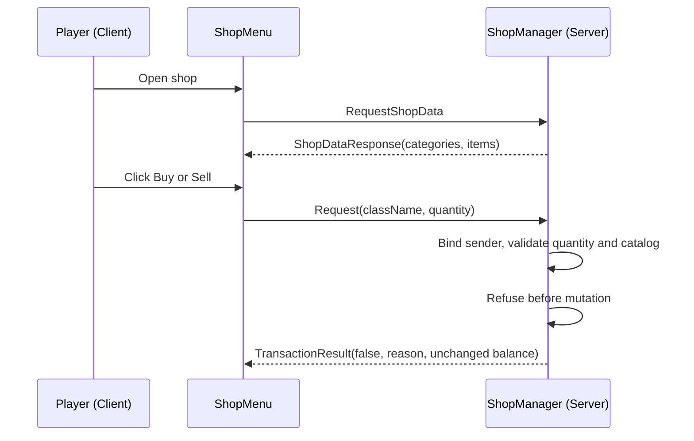

# Shop UI, Catalog RPC, and Safe Refusal


---

> **Summary:** Build a non-transactional shop prototype with JSON catalog data, a categorized UI, server-owned validation, and buy/sell requests that intentionally refuse before inventory or currency changes. This chapter teaches the request/response boundary; it does not implement a working trading transaction.

---

## Table of Contents

- [What We Are Building](#what-we-are-building)
- [Step 1: Data Model (3_Game)](#step-1-data-model-3-game)
- [Step 2: RPC Constants (3_Game)](#step-2-rpc-constants-3-game)
- [Step 3: Server-Side Shop Manager (4_World)](#step-3-server-side-shop-manager-4-world)
- [Step 4: Client-Side Shop UI (5_Mission)](#step-4-client-side-shop-ui-5-mission)
- [Step 5: Layout File](#step-5-layout-file)
- [Step 6: Mission Hook and Keybind](#step-6-mission-hook-and-keybind)
- [Step 7: Currency Item](#step-7-currency-item)
- [Step 8: Shop Config JSON](#step-8-shop-config-json)
- [Step 9: Build and Test](#step-9-build-and-test)
- [Security Considerations](#security-considerations)
- [Provided Code Reference](#provided-code-reference)
- [Best Practices / Common Mistakes / What You Learned](#best-practices)

---

## What We Are Building

Players press F6 to open a shop menu and browse server-supplied categories and items. Buy and sell requests bind to the authenticated sender, validate quantity and the server catalog, and then return a disabled result without changing inventory or currency. The refusal is intentional: this chapter does not provide the persistence, idempotency, compensation, and failure handling required for a working trading system.



```
CLIENT                                SERVER
1. Press F6 -> REQUEST_SHOP_DATA ->   2. Load catalog and count currency
                                          SHOP_DATA_RESPONSE ->
3. Show categories and items
   Click Buy/Sell -> REQUEST ------>  4. Bind sender, validate, refuse
                                          TRANSACTION_RESULT(false) ->
5. Show disabled result; balance and inventory remain unchanged
```

**Key rule:** The client sends `(className, quantity)` only. The server looks up the catalog entry, but the provided handlers never debit, credit, spawn, or delete items.

### Mod Structure

```
ShopDemo/
    mod.cpp
    GUI/layouts/shop_menu.layout
    Scripts/config.cpp
        data/            inputs.xml  stringtable.csv
        3_Game/ShopDemo/  ShopDemoRPC.c  ShopDemoData.c
        4_World/ShopDemo/ ShopDemoManager.c
        5_Mission/ShopDemo/ ShopDemoMenu.c  ShopDemoMission.c  ShopDemoServer.c
```

---

## Step 1: Data Model (3_Game)

### `Scripts/3_Game/ShopDemo/ShopDemoData.c`

```c
class ShopItem
{
    string ClassName;
    string DisplayName;
    int BuyPrice;
    int SellPrice;

    void ShopItem()
    {
        ClassName = "";
        DisplayName = "";
        BuyPrice = 0;
        SellPrice = 0;
    }
};

class ShopCategory
{
    string Name;
    ref array<ref ShopItem> Items;

    void ShopCategory()
    {
        Name = "";
        Items = new array<ref ShopItem>;
    }
};

class ShopConfig
{
    string CurrencyClassName;
    ref array<ref ShopCategory> Categories;

    void ShopConfig()
    {
        // "Rag" is a real, stackable vanilla item, so this config loads and
        // works verbatim. Swap it for any classname you like in the JSON.
        CurrencyClassName = "Rag";
        Categories = new array<ref ShopCategory>;
    }
};
```

Keep `SellPrice < BuyPrice` always to prevent infinite money loops.

> **Verify your classnames.** Every classname in this config (currency, shop items) must be a real, spawnable classname on your server --- a base-game item or one added by another mod you run. `CreateInInventory()` and `CreateObjectEx()` silently return `null` for an unknown class, so a typo means "nothing spawns" with no error. Confirm each name in your config viewer or by test-spawning before shipping. The base-game names used below (`Rag`, `AK74`, `MakarovIJ70`, `Mosin9130`, `SodaCan_Cola`, `TunaCan`, `Apple`, `BandageDressing`, `Morphine`, `SalineBagIV`) are all vanilla as of writing.

---

## Step 2: RPC Constants (3_Game)

### `Scripts/3_Game/ShopDemo/ShopDemoRPC.c`

```c
class ShopDemoRPC
{
    static const int REQUEST_SHOP_DATA   = 79101;  // Client -> Server
    static const int BUY_ITEM            = 79102;
    static const int SELL_ITEM           = 79103;
    static const int SHOP_DATA_RESPONSE  = 79201;  // Server -> Client
    static const int TRANSACTION_RESULT  = 79202;
};
```

---

## Step 3: Server-Side Shop Manager (4_World)

### `Scripts/4_World/ShopDemo/ShopDemoManager.c`

```c
class ShopDemoManager
{
    private static ref ShopDemoManager s_Instance;

    static ShopDemoManager Get()
    {
        if (!s_Instance)
            s_Instance = new ShopDemoManager();
        return s_Instance;
    }

    protected ref ShopConfig m_Config;
    protected string m_ConfigPath;

    void ShopDemoManager()
    {
        m_ConfigPath = "$profile:ShopDemo/ShopConfig.json";
    }

    void Init()
    {
        if (FileExist(m_ConfigPath))
        {
            m_Config = new ShopConfig();
            // JsonLoadFile returns void --- it cannot report success. Load into
            // a fresh object, then check the object's state to detect a bad file.
            JsonFileLoader<ShopConfig>.JsonLoadFile(m_ConfigPath, m_Config);
            if (!m_Config.Categories || m_Config.Categories.Count() == 0)
                CreateDefaultConfig();
        }
        else
        {
            CreateDefaultConfig();
        }
        Print("[ShopDemo] Init: " + m_Config.Categories.Count().ToString() + " categories");
    }

    ShopConfig GetConfig() { return m_Config; }

    protected void CreateDefaultConfig()
    {
        m_Config = new ShopConfig();
        m_Config.CurrencyClassName = "Rag";

        ShopCategory c1 = new ShopCategory();
        c1.Name = "Weapons";
        AddItem(c1, "MakarovIJ70", "Makarov IJ70", 50, 25);
        AddItem(c1, "AK74", "AK-74", 200, 100);
        AddItem(c1, "Mosin9130", "Mosin 91/30", 150, 75);
        m_Config.Categories.Insert(c1);

        ShopCategory c2 = new ShopCategory();
        c2.Name = "Food";
        AddItem(c2, "SodaCan_Cola", "Cola", 5, 2);
        AddItem(c2, "TunaCan", "Tuna Can", 8, 4);
        AddItem(c2, "Apple", "Apple", 3, 1);
        m_Config.Categories.Insert(c2);

        ShopCategory c3 = new ShopCategory();
        c3.Name = "Medical";
        AddItem(c3, "BandageDressing", "Bandage", 10, 5);
        AddItem(c3, "Morphine", "Morphine", 30, 15);
        AddItem(c3, "SalineBagIV", "Saline Bag IV", 25, 12);
        m_Config.Categories.Insert(c3);

        SaveConfig();
    }

    protected void AddItem(ShopCategory cat, string cls, string disp, int buy, int sell)
    {
        ShopItem si = new ShopItem();
        si.ClassName = cls;
        si.DisplayName = disp;
        si.BuyPrice = buy;
        si.SellPrice = sell;
        cat.Items.Insert(si);
    }

    protected void SaveConfig()
    {
        MakeDirectory("$profile:ShopDemo");
        // JsonSaveFile also returns void; ensure the directory exists first or
        // it fails silently.
        JsonFileLoader<ShopConfig>.JsonSaveFile(m_ConfigPath, m_Config);
    }

    int CountPlayerCurrency(PlayerBase player)
    {
        if (!player) return 0;
        int total = 0;
        array<EntityAI> items = new array<EntityAI>;
        player.GetInventory().EnumerateInventory(InventoryTraversalType.PREORDER, items);
        for (int i = 0; i < items.Count(); i++)
        {
            EntityAI ent = items.Get(i);
            if (!ent || ent.GetType() != m_Config.CurrencyClassName) continue;
            ItemBase ib = ItemBase.Cast(ent);
            if (ib && ib.HasQuantity()) total = total + ib.GetQuantity();
            else total = total + 1;
        }
        return total;
    }

    // Teaching reference only: the live handlers below never call these helpers.
    // They do not implement rollback or a safe multi-step transaction.
    protected bool RemoveCurrency(PlayerBase player, int amount)
    {
        int remaining = amount;
        array<EntityAI> items = new array<EntityAI>;
        player.GetInventory().EnumerateInventory(InventoryTraversalType.PREORDER, items);
        for (int i = 0; i < items.Count(); i++)
        {
            if (remaining <= 0) break;
            EntityAI ent = items.Get(i);
            if (!ent || ent.GetType() != m_Config.CurrencyClassName) continue;
            ItemBase ib = ItemBase.Cast(ent);
            if (!ib) continue;
            if (ib.HasQuantity())
            {
                int qty = ib.GetQuantity();
                if (qty <= remaining) { remaining = remaining - qty; ib.DeleteSafe(); }
                else { ib.SetQuantity(qty - remaining); remaining = 0; }
            }
            else { remaining = remaining - 1; ib.DeleteSafe(); }
        }
        return (remaining <= 0);
    }

    protected bool GiveCurrency(PlayerBase player, int amount)
    {
        EntityAI spawned = player.GetInventory().CreateInInventory(m_Config.CurrencyClassName);
        if (!spawned)
            spawned = EntityAI.Cast(GetGame().CreateObjectEx(m_Config.CurrencyClassName, player.GetPosition(), ECE_PLACE_ON_SURFACE));
        if (!spawned) return false;
        ItemBase ci = ItemBase.Cast(spawned);
        if (ci && ci.HasQuantity()) ci.SetQuantity(amount);
        return true;
    }

    protected ShopItem FindShopItem(string className)
    {
        for (int c = 0; c < m_Config.Categories.Count(); c++)
            for (int i = 0; i < m_Config.Categories.Get(c).Items.Count(); i++)
                if (m_Config.Categories.Get(c).Items.Get(i).ClassName == className)
                    return m_Config.Categories.Get(c).Items.Get(i);
        return null;
    }

    // Returns a log-safe player name even if the identity is momentarily null
    // (it can be, e.g. during disconnect). Never call id.GetName() unguarded.
    protected string SafeName(PlayerBase player)
    {
        PlayerIdentity id = player.GetIdentity();
        if (!id)
            return "unknown";
        return id.GetName();
    }

    void HandleBuy(PlayerBase player, string className, int quantity)
    {
        int balance = CountPlayerCurrency(player);
        if (quantity <= 0 || quantity > 10)
        {
            SendResult(player, false, "Invalid quantity.", balance);
            return;
        }
        ShopItem si = FindShopItem(className);
        if (!si)
        {
            SendResult(player, false, "Item not in shop.", balance);
            return;
        }
        SendResult(player, false, "Buying is disabled: this tutorial does not implement a safe inventory/currency transaction.", balance);
        Print("[ShopDemo] refused buy for " + SafeName(player));
    }

    void HandleSell(PlayerBase player, string className, int quantity)
    {
        int balance = CountPlayerCurrency(player);
        if (quantity <= 0 || quantity > 10)
        {
            SendResult(player, false, "Invalid quantity.", balance);
            return;
        }
        ShopItem si = FindShopItem(className);
        if (!si || si.SellPrice <= 0)
        {
            SendResult(player, false, "Cannot sell this.", balance);
            return;
        }
        SendResult(player, false, "Selling is disabled: this tutorial does not implement a safe inventory/currency transaction.", balance);
        Print("[ShopDemo] refused sell for " + SafeName(player));
    }

    protected void SendResult(PlayerBase player, bool success, string message, int newBalance)
    {
        if (!player || !player.GetIdentity()) return;
        Param3<bool, string, int> r = new Param3<bool, string, int>(success, message, newBalance);
        GetGame().RPCSingleParam(player, ShopDemoRPC.TRANSACTION_RESULT, r, true, player.GetIdentity());
    }
};

modded class PlayerBase
{
    override void OnRPC(PlayerIdentity sender, int rpc_type, ParamsReadContext ctx)
    {
        super.OnRPC(sender, rpc_type, ctx);
        if (!GetGame().IsServer()) return;
        switch (rpc_type)
        {
            case ShopDemoRPC.REQUEST_SHOP_DATA: OnShopDataReq(sender); break;
            case ShopDemoRPC.BUY_ITEM: OnBuyReq(sender, ctx); break;
            case ShopDemoRPC.SELL_ITEM: OnSellReq(sender, ctx); break;
        }
    }

    protected void OnShopDataReq(PlayerIdentity requestor)
    {
        PlayerBase player = PlayerBase.Cast(requestor.GetPlayer());
        if (!player) return;
        ShopDemoManager mgr = ShopDemoManager.Get();
        ShopConfig cfg = mgr.GetConfig();
        // Serialize: "CatName|cls,name,buy,sell;cls2,...\nCat2|..."
        string payload = "";
        for (int c = 0; c < cfg.Categories.Count(); c++)
        {
            ShopCategory cat = cfg.Categories.Get(c);
            if (c > 0) payload = payload + "\n";
            payload = payload + cat.Name + "|";
            for (int i = 0; i < cat.Items.Count(); i++)
            {
                ShopItem si = cat.Items.Get(i);
                if (i > 0) payload = payload + ";";
                payload = payload + si.ClassName + "," + si.DisplayName + "," + si.BuyPrice.ToString() + "," + si.SellPrice.ToString();
            }
        }
        Param2<int, string> data = new Param2<int, string>(mgr.CountPlayerCurrency(player), payload);
        GetGame().RPCSingleParam(player, ShopDemoRPC.SHOP_DATA_RESPONSE, data, true, requestor);
    }

    protected void OnBuyReq(PlayerIdentity sender, ParamsReadContext ctx)
    {
        Param2<string, int> d = new Param2<string, int>("", 0);
        if (!ctx.Read(d)) return;
        PlayerBase p = PlayerBase.Cast(sender.GetPlayer());
        if (p) ShopDemoManager.Get().HandleBuy(p, d.param1, d.param2);
    }

    protected void OnSellReq(PlayerIdentity sender, ParamsReadContext ctx)
    {
        Param2<string, int> d = new Param2<string, int>("", 0);
        if (!ctx.Read(d)) return;
        PlayerBase p = PlayerBase.Cast(sender.GetPlayer());
        if (p) ShopDemoManager.Get().HandleSell(p, d.param1, d.param2);
    }
};
```

**Safety boundary:** The server binds requests to `sender.GetPlayer()`, checks the quantity bound, and looks up the item in the server catalog, but both handlers refuse before changing inventory. The helper methods remain only to explain the relevant inventory APIs; they are not transaction-safe building blocks. No atomic inventory-and-currency API or runtime-proven compensation protocol is demonstrated here, so do not enable these handlers for live trading without designing and testing that subsystem separately.

> **Warning --- the ad-hoc string payload is fragile.** `OnShopDataReq` packs the shop into one string using `|`, `;`, `,`, and newline as delimiters. If any `DisplayName` (or a category name) contains one of those characters, the payload splits in the wrong place and the client parses garbage --- a display name like `"7,62 Ammo"` or `"Medical; Surgical"` will break the layout silently. Keep display names free of `| ; ,` and newlines, or replace this hand-rolled format with a structured RPC (write each field with `ctx.Write()` / read it back with `ctx.Read()`, or serialize the config object to a JSON string). The string approach is shown here because it is the shortest thing that teaches the round-trip; it is not what you want in production.

### `Scripts/5_Mission/ShopDemo/ShopDemoServer.c`

`ShopDemoManager` lives in `4_World`, but it has to be initialized from the server mission's lifecycle --- and `MissionServer` is a `5_Mission`-only type (it is declared at `5_mission/mission/missionserver.c`). A `modded class MissionServer` therefore **cannot** live in the `4_World` file: the World module compiles *before* the Mission module, so `MissionServer` is not yet a known type when the World file compiles and its base class fails to resolve. This is the same layer rule that forbids naming `PlayerBase` from a `3_Game` file --- a lower layer can never reference a type from a higher one. Put the server hook in its own `5_Mission` file, where `MissionServer` exists and `ShopDemoManager` (a lower layer) is still visible:

```c
modded class MissionServer
{
    override void OnInit()
    {
        super.OnInit();
        ShopDemoManager.Get().Init();
    }
};
```

---

## Step 4: Client-Side Shop UI (5_Mission)

### `Scripts/5_Mission/ShopDemo/ShopDemoMenu.c`

```c
class ShopDemoMenu extends ScriptedWidgetEventHandler
{
    protected Widget m_Root, m_CategoryPanel, m_ItemPanel;
    protected TextWidget m_BalanceText, m_DetailName, m_DetailBuyPrice, m_DetailSellPrice, m_StatusText;
    protected ButtonWidget m_BuyButton, m_SellButton, m_CloseButton;
    protected bool m_IsOpen;
    protected int m_Balance;
    protected string m_SelClass;
    protected ref array<string> m_CatNames;
    protected ref array<ref array<ref ShopItem>> m_CatItems;
    protected ref array<Widget> m_DynWidgets;

    void ShopDemoMenu()
    {
        m_IsOpen = false;
        m_Balance = 0;
        m_SelClass = "";
        m_CatNames = new array<string>;
        m_CatItems = new array<ref array<ref ShopItem>>;
        m_DynWidgets = new array<Widget>;
    }
    void ~ShopDemoMenu() { Close(); }

    void Open()
    {
        if (m_IsOpen) return;
        m_Root = GetGame().GetWorkspace().CreateWidgets("ShopDemo/GUI/layouts/shop_menu.layout");
        if (!m_Root) { Print("[ShopDemo] Layout failed!"); return; }
        m_BalanceText     = TextWidget.Cast(m_Root.FindAnyWidget("BalanceText"));
        m_CategoryPanel   = m_Root.FindAnyWidget("CategoryPanel");
        m_ItemPanel       = m_Root.FindAnyWidget("ItemPanel");
        m_DetailName      = TextWidget.Cast(m_Root.FindAnyWidget("DetailName"));
        m_DetailBuyPrice  = TextWidget.Cast(m_Root.FindAnyWidget("DetailBuyPrice"));
        m_DetailSellPrice = TextWidget.Cast(m_Root.FindAnyWidget("DetailSellPrice"));
        m_StatusText      = TextWidget.Cast(m_Root.FindAnyWidget("StatusText"));
        m_BuyButton       = ButtonWidget.Cast(m_Root.FindAnyWidget("BuyButton"));
        m_SellButton      = ButtonWidget.Cast(m_Root.FindAnyWidget("SellButton"));
        m_CloseButton     = ButtonWidget.Cast(m_Root.FindAnyWidget("CloseButton"));
        if (m_BuyButton) m_BuyButton.SetHandler(this);
        if (m_SellButton) m_SellButton.SetHandler(this);
        if (m_CloseButton) m_CloseButton.SetHandler(this);
        m_Root.Show(true); m_IsOpen = true;
        GetGame().GetMission().PlayerControlDisable(INPUT_EXCLUDE_ALL);
        GetGame().GetUIManager().ShowUICursor(true);
        if (m_StatusText) m_StatusText.SetText("Loading...");
        Man player = GetGame().GetPlayer();
        if (player) { Param1<bool> p = new Param1<bool>(true); GetGame().RPCSingleParam(player, ShopDemoRPC.REQUEST_SHOP_DATA, p, true); }
    }

    void Close()
    {
        if (!m_IsOpen) return;
        for (int i = 0; i < m_DynWidgets.Count(); i++)
        {
            if (m_DynWidgets.Get(i)) m_DynWidgets.Get(i).Unlink();
        }
        m_DynWidgets.Clear();
        if (m_Root) { m_Root.Unlink(); m_Root = null; }
        m_IsOpen = false;
        GetGame().GetMission().PlayerControlEnable(true);
        GetGame().GetUIManager().ShowUICursor(false);
    }

    bool IsOpen() { return m_IsOpen; }
    void Toggle() { if (m_IsOpen) Close(); else Open(); }

    void OnShopDataReceived(int balance, string payload)
    {
        m_Balance = balance;
        if (m_BalanceText) m_BalanceText.SetText("Balance: " + balance.ToString());
        m_CatNames.Clear(); m_CatItems.Clear();
        TStringArray lines = new TStringArray;
        payload.Split("\n", lines);
        for (int c = 0; c < lines.Count(); c++)
        {
            string line = lines.Get(c);
            int pp = line.IndexOf("|");
            if (pp < 0) continue;
            m_CatNames.Insert(line.Substring(0, pp));
            ref array<ref ShopItem> ci = new array<ref ShopItem>;
            TStringArray iStrs = new TStringArray;
            line.Substring(pp + 1, line.Length() - pp - 1).Split(";", iStrs);
            for (int i = 0; i < iStrs.Count(); i++)
            {
                TStringArray parts = new TStringArray;
                iStrs.Get(i).Split(",", parts);
                if (parts.Count() < 4) continue;
                ShopItem si = new ShopItem();
                si.ClassName = parts.Get(0); si.DisplayName = parts.Get(1);
                si.BuyPrice = parts.Get(2).ToInt(); si.SellPrice = parts.Get(3).ToInt();
                ci.Insert(si);
            }
            m_CatItems.Insert(ci);
        }
        // Build category buttons
        if (m_CategoryPanel)
        {
            for (int b = 0; b < m_CatNames.Count(); b++)
            {
                // CreateWidget takes INT pixel coordinates (left, top, width, height) --- never fractional relatives
                ButtonWidget btn = ButtonWidget.Cast(GetGame().GetWorkspace().CreateWidget(WidgetType.ButtonWidgetTypeID, 0, b*34, 180, 30, WidgetFlags.VISIBLE, ARGB(255,60,60,60), 0, m_CategoryPanel));
                if (btn)
                {
                    btn.SetText(m_CatNames.Get(b));
                    btn.SetHandler(this);
                    btn.SetName("CatBtn_" + b.ToString());
                    m_DynWidgets.Insert(btn);
                }
            }
        }
        if (m_CatNames.Count() > 0) SelectCategory(0);
        if (m_StatusText) m_StatusText.SetText("");
    }

    void SelectCategory(int idx)
    {
        if (idx < 0 || idx >= m_CatItems.Count()) return;
        for (int r = m_DynWidgets.Count()-1; r >= 0; r--)
        {
            Widget w = m_DynWidgets.Get(r);
            if (w && w.GetName().IndexOf("ItemBtn_") == 0)
            {
                w.Unlink();
                m_DynWidgets.Remove(r);
            }
        }
        array<ref ShopItem> items = m_CatItems.Get(idx);
        for (int j = 0; j < items.Count(); j++)
        {
            ShopItem si = items.Get(j);
            ButtonWidget ib = ButtonWidget.Cast(GetGame().GetWorkspace().CreateWidget(WidgetType.ButtonWidgetTypeID, 0, j*34, 400, 30, WidgetFlags.VISIBLE, ARGB(255,45,45,50), 0, m_ItemPanel));
            if (ib)
            {
                ib.SetText(si.DisplayName + " [B:" + si.BuyPrice.ToString() + " S:" + si.SellPrice.ToString() + "]");
                ib.SetHandler(this);
                ib.SetName("ItemBtn_" + si.ClassName);
                m_DynWidgets.Insert(ib);
            }
        }
        m_SelClass = "";
        if (m_DetailName) m_DetailName.SetText("Select an item");
    }

    override bool OnClick(Widget w, int x, int y, int button)
    {
        if (w == m_CloseButton) { Close(); return true; }
        if (w == m_BuyButton) { DoBuySell(ShopDemoRPC.BUY_ITEM); return true; }
        if (w == m_SellButton) { DoBuySell(ShopDemoRPC.SELL_ITEM); return true; }
        string wn = w.GetName();
        if (wn.IndexOf("CatBtn_")==0) { SelectCategory(wn.Substring(7,wn.Length()-7).ToInt()); return true; }
        if (wn.IndexOf("ItemBtn_")==0) { SelectItem(wn.Substring(8,wn.Length()-8)); return true; }
        return false;
    }

    void SelectItem(string cls)
    {
        for (int c = 0; c < m_CatItems.Count(); c++)
            for (int i = 0; i < m_CatItems.Get(c).Count(); i++)
            {
                ShopItem si = m_CatItems.Get(c).Get(i);
                if (si.ClassName == cls) {
                    m_SelClass = cls;
                    if (m_DetailName) m_DetailName.SetText(si.DisplayName);
                    if (m_DetailBuyPrice) m_DetailBuyPrice.SetText("Buy: " + si.BuyPrice.ToString());
                    if (m_DetailSellPrice) m_DetailSellPrice.SetText("Sell: " + si.SellPrice.ToString());
                    return;
                }
            }
    }

    protected void DoBuySell(int rpcId)
    {
        if (m_SelClass == "") { if (m_StatusText) m_StatusText.SetText("Select an item first."); return; }
        Man player = GetGame().GetPlayer();
        if (!player) return;
        Param2<string, int> d = new Param2<string, int>(m_SelClass, 1);
        GetGame().RPCSingleParam(player, rpcId, d, true);
        if (m_StatusText) m_StatusText.SetText("Processing...");
    }

    void OnTransactionResult(bool success, string message, int newBalance)
    {
        m_Balance = newBalance;
        if (m_BalanceText) m_BalanceText.SetText("Balance: " + newBalance.ToString());
        if (m_StatusText) m_StatusText.SetText(message);
    }
};
```

---

## Step 5: Layout File

### `GUI/layouts/shop_menu.layout`

Three columns: Categories (left 20%), Items (center 46%), Details (right 26%).

```
FrameWidgetClass ShopMenuRoot {
 size 0.7 0.7 position 0.15 0.15 hexactpos 0 vexactpos 0 hexactsize 0 vexactsize 0
 {
  ImageWidgetClass Background { size 1 1 position 0 0 hexactpos 0 vexactpos 0 hexactsize 0 vexactsize 0 color 0.08 0.08 0.1 0.92 }
  TextWidgetClass ShopTitle { size 0.5 0.06 position 0.02 0.02 hexactpos 0 vexactpos 0 hexactsize 0 vexactsize 0 text "Shop" "text halign" left "text valign" center color 1 0.85 0.3 1 font "gui/fonts/MetronBook" }
  TextWidgetClass BalanceText { size 0.35 0.06 position 0.63 0.02 hexactpos 0 vexactpos 0 hexactsize 0 vexactsize 0 text "Balance: --" "text halign" right "text valign" center color 0.3 1 0.3 1 font "gui/fonts/MetronBook" }
  FrameWidgetClass CategoryPanel { size 0.2 0.82 position 0.02 0.1 hexactpos 0 vexactpos 0 hexactsize 0 vexactsize 0
   { ImageWidgetClass CatBg { size 1 1 position 0 0 hexactpos 0 vexactpos 0 hexactsize 0 vexactsize 0 color 0.12 0.12 0.14 0.8 } }
  }
  FrameWidgetClass ItemPanel { size 0.46 0.82 position 0.24 0.1 hexactpos 0 vexactpos 0 hexactsize 0 vexactsize 0
   { ImageWidgetClass ItemBg { size 1 1 position 0 0 hexactpos 0 vexactpos 0 hexactsize 0 vexactsize 0 color 0.1 0.1 0.12 0.8 } }
  }
  FrameWidgetClass DetailPanel { size 0.26 0.82 position 0.72 0.1 hexactpos 0 vexactpos 0 hexactsize 0 vexactsize 0
   {
    ImageWidgetClass DetailBg { size 1 1 position 0 0 hexactpos 0 vexactpos 0 hexactsize 0 vexactsize 0 color 0.12 0.12 0.14 0.8 }
    TextWidgetClass DetailName { size 0.9 0.08 position 0.05 0.05 hexactpos 0 vexactpos 0 hexactsize 0 vexactsize 0 text "Select an item" "text halign" center "text valign" center color 1 1 1 1 font "gui/fonts/MetronBook" }
    TextWidgetClass DetailBuyPrice { size 0.9 0.06 position 0.05 0.16 hexactpos 0 vexactpos 0 hexactsize 0 vexactsize 0 text "Buy: --" "text halign" left "text valign" center color 0.3 1 0.3 1 font "gui/fonts/MetronBook" }
    TextWidgetClass DetailSellPrice { size 0.9 0.06 position 0.05 0.24 hexactpos 0 vexactpos 0 hexactsize 0 vexactsize 0 text "Sell: --" "text halign" left "text valign" center color 1 0.85 0.3 1 font "gui/fonts/MetronBook" }
    ButtonWidgetClass BuyButton { size 0.8 0.08 position 0.1 0.5 hexactpos 0 vexactpos 0 hexactsize 0 vexactsize 0 text "Buy" "text halign" center "text valign" center color 0.2 0.7 0.2 1.0 }
    ButtonWidgetClass SellButton { size 0.8 0.08 position 0.1 0.62 hexactpos 0 vexactpos 0 hexactsize 0 vexactsize 0 text "Sell" "text halign" center "text valign" center color 0.8 0.6 0.1 1.0 }
    TextWidgetClass StatusText { size 0.9 0.06 position 0.05 0.82 hexactpos 0 vexactpos 0 hexactsize 0 vexactsize 0 text "" "text halign" center "text valign" center color 0.9 0.9 0.9 1 font "gui/fonts/MetronBook" }
   }
  }
  ButtonWidgetClass CloseButton { size 0.05 0.04 position 0.935 0.015 hexactpos 0 vexactpos 0 hexactsize 0 vexactsize 0 text "X" "text halign" center "text valign" center color 1.0 0.3 0.3 1.0 }
 }
}
```

---

## Step 6: Mission Hook and Keybind

The right way to bind a key is `inputs.xml` --- it registers a remappable action that appears in the player's **Settings > Controls** menu. Hardcoding `OnKeyPress` locks players to one key and clashes with any mod bound to the same code. We use `inputs.xml` here; the hardcoded fallback is shown at the end of the step with its caveat. See [inputs.xml --- Custom Keybindings](../05-config-files/02-inputs-xml.md) for the full reference.

### Step 6a: `Scripts/data/inputs.xml`

```xml
<?xml version="1.0" encoding="UTF-8" standalone="yes" ?>
<modded_inputs>
    <inputs>
        <actions>
            <input name="UAShopDemoToggle" loc="STR_SHOPDEMO_TOGGLE" />
        </actions>

        <sorting name="shopdemo" loc="STR_SHOPDEMO_GROUP">
            <input name="UAShopDemoToggle" />
        </sorting>
    </inputs>
    <preset>
        <input name="UAShopDemoToggle">
            <btn name="kF6"/>
        </input>
    </preset>
</modded_inputs>
```

With a matching `stringtable.csv` so the action reads nicely in the Controls menu. Keep the full vanilla column set and the trailing comma on every row -- that is the shape `languagecore/stringtable.csv` and Bohemia's `Test_Stringtable` sample use. Vanilla ships rows with empty language cells (13 rows in `languagecore/stringtable.csv`), so leaving columns blank like this is acceptable; note that vanilla more often repeats the English string in an untranslated column than leaves it empty:

```csv
"Language","original","english","czech","german","russian","polish","hungarian","italian","spanish","french","chinese","japanese","portuguese","chinesesimp",
"STR_SHOPDEMO_GROUP","Shop Demo","Shop Demo","","","","","","","","","","","","",
"STR_SHOPDEMO_TOGGLE","Toggle Shop","Toggle Shop","","","","","","","","","","","","",
```

### Step 6b: Reference the file in `config.cpp`

The engine does not auto-discover `inputs.xml`. Register it by setting the `inputs` property of your mod's `CfgMods` entry to the path of the **file** (not the folder):

```cpp
class CfgMods
{
    class ShopDemo
    {
        dir = "ShopDemo";
        type = "mod";
        inputs = "ShopDemo/Scripts/data/inputs.xml";
        // ... dependencies[], defines[], CfgMods sub-classes ...
    };
};
```

The `inputs` value is a plain string pointing straight at the XML file. See [inputs.xml --- Custom Keybindings](../05-config-files/02-inputs-xml.md) for the full reference.

### Step 6c: `Scripts/5_Mission/ShopDemo/ShopDemoMission.c`

Poll the registered input each frame in `OnUpdate` and toggle the menu on press:

```c
modded class MissionGameplay
{
    protected ref ShopDemoMenu m_ShopDemoMenu;

    override void OnInit()
    {
        super.OnInit();
        m_ShopDemoMenu = new ShopDemoMenu();
    }

    override void OnMissionFinish()
    {
        if (m_ShopDemoMenu)
        {
            m_ShopDemoMenu.Close();
            m_ShopDemoMenu = null;
        }
        super.OnMissionFinish();
    }

    override void OnUpdate(float timeslice)
    {
        super.OnUpdate(timeslice);

        // GetInputByName returns null if inputs.xml is not registered in
        // config.cpp (Step 6b). Guard it, or .LocalPress() crashes.
        UAInput toggle = GetUApi().GetInputByName("UAShopDemoToggle");
        if (toggle && toggle.LocalPress() && m_ShopDemoMenu)
            m_ShopDemoMenu.Toggle();
    }

    // Called from the DayZGame.OnRPC override below. MissionGameplay has no OnRPC of its own.
    void HandleShopRPC(int rpc_type, ParamsReadContext ctx)
    {
        if (rpc_type == ShopDemoRPC.SHOP_DATA_RESPONSE)
        {
            Param2<int, string> d = new Param2<int, string>(0, "");
            if (ctx.Read(d) && m_ShopDemoMenu)
                m_ShopDemoMenu.OnShopDataReceived(d.param1, d.param2);
        }
        if (rpc_type == ShopDemoRPC.TRANSACTION_RESULT)
        {
            Param3<bool, string, int> r = new Param3<bool, string, int>(false, "", 0);
            if (ctx.Read(r) && m_ShopDemoMenu)
                m_ShopDemoMenu.OnTransactionResult(r.param1, r.param2, r.param3);
        }
    }
};

// OnRPC(PlayerIdentity, Object, int, ParamsReadContext) lives on DayZGame, not the Mission
// hierarchy. The server sends with target=player, so DayZGame forwards target.OnRPC to PlayerBase;
// to reach the client menu we hook DayZGame directly and route to the mission.
modded class DayZGame
{
    override void OnRPC(PlayerIdentity sender, Object target, int rpc_type, ParamsReadContext ctx)
    {
        super.OnRPC(sender, target, rpc_type, ctx);
        if (rpc_type != ShopDemoRPC.SHOP_DATA_RESPONSE && rpc_type != ShopDemoRPC.TRANSACTION_RESULT)
            return;
        MissionGameplay mission = MissionGameplay.Cast(GetMission());
        if (mission)
            mission.HandleShopRPC(rpc_type, ctx);
    }
};
```

### Hardcoded fallback (not recommended)

If you skip `inputs.xml` entirely, you can hardcode the key by overriding `OnKeyPress` instead of `OnUpdate`:

```c
override void OnKeyPress(int key)
{
    super.OnKeyPress(key);
    if (key == KeyCode.KC_F6 && m_ShopDemoMenu)
        m_ShopDemoMenu.Toggle();
}
```

The caveat (also covered in [HUD Overlay](08-hud-overlay.md)): a hardcoded `KeyCode` cannot be rebound by players, is invisible in the Controls menu, and fires even when another mod or a vanilla screen owns that key. Use it only for throwaway testing --- ship the `inputs.xml` route.

---

## Step 7: Currency Item

The default `CurrencyClassName` is `"Rag"` --- a splittable vanilla item (`canBeSplit = 1`), so the demo works with no extra content. You can point it at any existing classname in the JSON (for example `"Nail"` or an ammo box) and that item becomes money.

One thing to know before you tune prices: vanilla `Rag` caps at `varQuantityMax = 6` per stack and occupies a 1x3 inventory slot, so a price of 250 is 42 stacks and 126 inventory squares. Keep demo prices small, or pick a currency with a larger quantity ceiling. For a purpose-built coin with the stack size you want, see [Custom Item](02-custom-item.md).

---

## Step 8: Shop Config JSON

The manager writes this file at `$profile:ShopDemo/ShopConfig.json` on first server start if it is missing, then reads it on every later start. Edit prices, add categories and items, restart the server. Keep `SellPrice < BuyPrice` on every entry: an item that sells for more than it costs is an infinite-money loop, and nothing in the engine stops you writing one.

`$profile:` resolves to the folder given by the server's `-profiles=` launch parameter, so the file lives with your server's logs rather than inside the PBO. That is what makes it editable without repacking.

---

## Step 9: Build and Test

1. Pack `ShopDemo/` into a PBO and place it in `@ShopDemo/addons/` on **both** server and client, then add `-mod=@ShopDemo` to both launch lines. The UI is client-side and the manager is server-side, so a one-sided install can leave the menu unable to receive a server response.
2. Spawn currency (default `Rag`), press F6, select a catalog item, and press Buy and Sell once each. Both requests must return the disabled message, and the displayed balance and inventory must remain unchanged.
3. Check the server log for `[ShopDemo] refused` lines to confirm the server received each request.

| Test Case | Expected |
|-----------|----------|
| Valid catalog buy | Disabled message; balance and inventory unchanged |
| Valid sellable catalog item | Disabled message; balance and inventory unchanged |
| Unknown class (crafted RPC) | `Item not in shop.` or `Cannot sell this.` |
| Quantity outside 1-10 (crafted RPC) | `Invalid quantity.` |

---

## Security Considerations

1. **NEVER trust client-sent prices.** Client sends `(className, qty)` only. Server looks up price.
2. **Keep this sample non-transactional.** Both handlers refuse before spawning, changing quantity, or deleting, so the sample itself cannot consume player assets.
3. **Do not confuse ordering with recovery.** Debit-first can lose value and credit-first can duplicate value. Compensation may be possible in a larger design, but it requires explicit failure handling and runtime evidence that this tutorial does not provide.
4. **Log everything.** Print player name, item, amount for every transaction.
5. **Quantity bounds.** Reject `qty <= 0` or `qty > 10`.
6. **Rate limit** in production: 500ms cooldown per player per transaction.

---

## Provided Code Reference

| File | Layer | Purpose |
|------|-------|---------|
| `ShopDemoRPC.c` | 3_Game | RPC ID constants |
| `ShopDemoData.c` | 3_Game | Data classes: ShopItem, ShopCategory, ShopConfig |
| `ShopDemoManager.c` | 4_World | Server: config, request validation/refusal, inventory API examples, RPC handlers |
| `ShopDemoMenu.c` | 5_Mission | Client: UI, dynamic widgets, RPC send/receive |
| `ShopDemoMission.c` | 5_Mission | Client mission hook: keybind polling, RPC routing |
| `ShopDemoServer.c` | 5_Mission | Server mission hook: initializes `ShopDemoManager` |
| `shop_menu.layout` | GUI | 3-panel layout |
| `inputs.xml` | data | Registers the remappable `UAShopDemoToggle` keybind |

---

## Best Practices

- **Server is the single source of truth.** Client is a display terminal.
- **Understand `DeleteSafe()` before reusing the helper.** Vanilla describes it as deletion "synchronized between server and client" and routes held items through player deletion handling, but the method returns `void`; calling it is not proof that a larger trade committed or that compensation completed. (`DeleteSave()` is the misspelled legacy alias.)
- **Data classes in 3_Game.** Visible to both 4_World and 5_Mission.
- **Always call `super` in overrides.** Breaking the chain breaks other mods.
- **Clean up dynamic widgets.** Every `CreateWidget` needs `Unlink` on close.

## Theory vs Practice

| Concept | Theory | Reality |
|---------|--------|---------|
| `JsonFileLoader.JsonLoadFile()` | Loads cleanly, reports errors | Returns `void` --- it cannot signal failure. A malformed file (trailing comma, bad type) leaves the object in a partial/default state with no error. Check the loaded object's state, and validate JSON externally. |
| String RPC serialization | Simple | 500+ items may hit size limits. Paginate for large shops. |
| `CreateInInventory()` | Always works | Returns a created entity or `null`. Always check. |
| Inventory/currency ordering | One order makes a trade safe | Neither order is atomic. A production design can use compensation or recovery, but this sample provides neither and therefore refuses before mutation. |
| Listen server testing | Fast iteration | Hides network bugs. Test on dedicated server. |

## What You Learned

- JSON config loading with `JsonFileLoader<T>` and auto-generation of defaults
- Singleton pattern for server-side game managers
- Inventory enumeration, counting, deletion (`DeleteSafe`), and spawning APIs, with explicit transaction-safety limits
- String serialization of complex data over RPC (categories, items, prices)
- Dynamic widget creation for data-driven UI
- Server-authoritative request binding and validation, followed by a deliberate pre-mutation refusal
- Security principles for multiplayer economy systems

## Common Mistakes

| Mistake | Fix |
|---------|-----|
| Client sends price | Send `(className, qty)` only. Server decides price. |
| Treat either mutation order as a transaction | Design explicit compensation/recovery and prove it under failure; this sample refuses instead. |
| Skip `super.OnRPC()` | Always call super -- other mods need the chain. |
| Treat `DeleteSafe()` as a confirmed debit | It returns `void`; do not infer transaction completion from the call. |
| Ignore creation returns | Check every result, and clean up or compensate without claiming success after partial creation. |
| Redeclare vars in else-if | Declare once before the if-chain (Enforce Script rule). |
