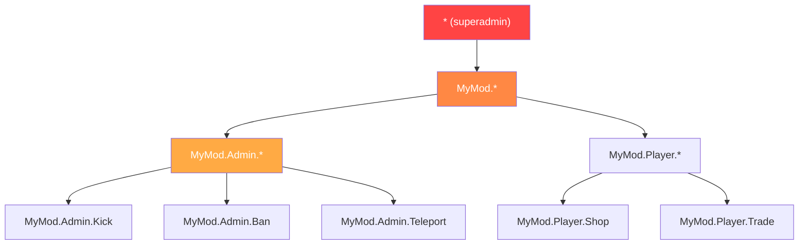

# Capitulo 7.5: Sistemas de Permisos

[Inicio](../../README.md) | [<< Anterior: Persistencia de Configuracion](04-config-persistence.md) | **Sistemas de Permisos** | [Siguiente: Arquitectura Orientada a Eventos >>](06-events.md)

---

## Introduccion

Cada herramienta de administracion, cada accion privilegiada y cada funcion de moderacion en DayZ necesita un sistema de permisos. La pregunta no es si verificar permisos sino como estructurarlos. La comunidad de modding de DayZ se ha establecido en tres patrones principales: permisos jerarquicos separados por punto, asignacion de roles por grupo de usuario (VPP), y acceso basado en roles a nivel de framework (CF/COT). Cada uno tiene diferentes compromisos en granularidad, complejidad y experiencia del operador del servidor.

Este capitulo cubre los tres patrones, el flujo de verificacion de permisos, formatos de almacenamiento y manejo de comodines/superadmin.

---

## Tabla de Contenidos

- [Por que Importan los Permisos](#por-que-importan-los-permisos)
- [Jerarquico Separado por Punto (Patron MyMod)](#jerarquico-separado-por-punto-patron-mymod)
- [Patron UserGroup de VPP](#patron-usergroup-de-vpp)
- [Patron Basado en Roles de CF (COT)](#patron-basado-en-roles-de-cf-cot)
- [Flujo de Verificacion de Permisos](#flujo-de-verificacion-de-permisos)
- [Formatos de Almacenamiento](#formatos-de-almacenamiento)
- [Patrones de Comodin y Superadmin](#patrones-de-comodin-y-superadmin)
- [Migracion Entre Sistemas](#migracion-entre-sistemas)
- [Mejores Practicas](#mejores-practicas)

---

## Por que Importan los Permisos

Sin un sistema de permisos, tienes dos opciones: o cada jugador puede hacer todo (caos), o codificas Steam64 IDs directamente en tus scripts (inmantenible). Un sistema de permisos permite a los operadores de servidor definir quien puede hacer que, sin modificar codigo.

Las tres reglas de seguridad:

1. **Nunca confies en el cliente.** El cliente envia una solicitud; el servidor decide si la honra.
2. **Denegar por defecto.** Si un jugador no tiene explicitamente concedido un permiso, no lo tiene.
3. **Fallar cerrado.** Si la verificacion de permisos en si falla (identidad null, datos corruptos), deniega la accion.

---

## Jerarquico Separado por Punto (Patron MyMod)

MyMod usa strings de permisos separados por puntos organizados en una jerarquia de arbol. Cada permiso es una ruta como `"MyMod.Admin.Teleport"` o `"MyMod.Missions.Start"`. Los comodines permiten conceder subarboles enteros.

### Formato de Permisos

```
MyMod                           (namespace raiz)
+-- Admin                       (herramientas de admin)
|   +-- Panel                   (abrir panel de admin)
|   +-- Teleport                (teletransportar a si mismo/otros)
|   +-- Kick                    (expulsar jugadores)
|   +-- Ban                     (banear jugadores)
|   +-- Weather                 (cambiar clima)
+-- Missions                    (sistema de misiones)
|   +-- Start                   (iniciar misiones manualmente)
|   +-- Stop                    (detener misiones)
+-- AI                          (sistema de IA)
    +-- Spawn                   (generar IA manualmente)
    +-- Config                  (editar config de IA)
```

### Modelo de Datos

Cada jugador (identificado por Steam64 ID) tiene un array de strings de permisos concedidos:

```c
class MyPermissionsData
{
    // clave: Steam64 ID, valor: array de strings de permisos
    ref map<string, ref TStringArray> Admins;

    void MyPermissionsData()
    {
        Admins = new map<string, ref TStringArray>();
    }
};
```

### Verificacion de Permisos

La verificacion recorre los permisos concedidos del jugador y soporta tres tipos de coincidencia: coincidencia exacta, comodin completo (`"*"`) y comodin de prefijo (`"MyMod.Admin.*"`):

```c
bool HasPermission(string plainId, string permission)
{
    if (plainId == "" || permission == "")
        return false;

    TStringArray perms;
    if (!m_Permissions.Find(plainId, perms))
        return false;

    for (int i = 0; i < perms.Count(); i++)
    {
        string granted = perms[i];

        // Comodin completo: superadmin
        if (granted == "*")
            return true;

        // Coincidencia exacta
        if (granted == permission)
            return true;

        // Comodin de prefijo: "MyMod.Admin.*" coincide con "MyMod.Admin.Teleport"
        if (granted.IndexOf("*") > 0)
        {
            string prefix = granted.Substring(0, granted.Length() - 1);
            if (permission.IndexOf(prefix) == 0)
                return true;
        }
    }

    return false;
}
```

### Almacenamiento JSON

```json
{
    "Admins": {
        "76561198000000001": ["*"],
        "76561198000000002": ["MyMod.Admin.Panel", "MyMod.Admin.Teleport"],
        "76561198000000003": ["MyMod.Missions.*"],
        "76561198000000004": ["MyMod.Admin.Kick", "MyMod.Admin.Ban"]
    }
}
```

### Fortalezas

- **Granular:** puedes conceder exactamente los permisos que cada admin necesita
- **Jerarquico:** los comodines conceden subarboles enteros sin listar cada permiso
- **Auto-documentado:** el string del permiso dice lo que controla
- **Extensible:** nuevos permisos son solo nuevos strings --- sin cambios de esquema

### Debilidades

- **Sin roles nombrados:** si 10 admins necesitan el mismo conjunto, lo listas 10 veces
- **Basado en strings:** errores tipograficos en strings de permisos fallan silenciosamente (simplemente no coinciden)

---

## Patron UserGroup de VPP

VPP Admin Tools usa un sistema basado en grupos. Defines grupos nombrados (roles) con conjuntos de permisos, luego asignas jugadores a grupos.

### Concepto

```
Grupos:
  "SuperAdmin"  -> [todos los permisos]
  "Moderator"   -> [kick, ban, mute, teleport]
  "Builder"     -> [generar objetos, teleport, ESP]

Jugadores:
  "76561198000000001" -> "SuperAdmin"
  "76561198000000002" -> "Moderator"
  "76561198000000003" -> "Builder"
```

### Patron de Implementacion

```c
class VPPUserGroup
{
    string GroupName;
    ref array<string> Permissions;
    ref array<string> Members;  // Steam64 IDs

    bool HasPermission(string permission)
    {
        if (!Permissions) return false;

        for (int i = 0; i < Permissions.Count(); i++)
        {
            if (Permissions[i] == permission)
                return true;
            if (Permissions[i] == "*")
                return true;
        }
        return false;
    }
};

class VPPPermissionManager
{
    ref array<ref VPPUserGroup> m_Groups;

    bool PlayerHasPermission(string plainId, string permission)
    {
        for (int i = 0; i < m_Groups.Count(); i++)
        {
            VPPUserGroup group = m_Groups[i];

            // Verificar si el jugador esta en este grupo
            if (group.Members.Find(plainId) == -1)
                continue;

            if (group.HasPermission(permission))
                return true;
        }
        return false;
    }
};
```

### Almacenamiento JSON

```json
{
    "Groups": [
        {
            "GroupName": "SuperAdmin",
            "Permissions": ["*"],
            "Members": ["76561198000000001"]
        },
        {
            "GroupName": "Moderator",
            "Permissions": [
                "admin.kick",
                "admin.ban",
                "admin.mute",
                "admin.teleport"
            ],
            "Members": [
                "76561198000000002",
                "76561198000000003"
            ]
        },
        {
            "GroupName": "Builder",
            "Permissions": [
                "admin.spawn",
                "admin.teleport",
                "admin.esp"
            ],
            "Members": [
                "76561198000000004"
            ]
        }
    ]
}
```

### Fortalezas

- **Basado en roles:** define un rol una vez, asignalo a muchos jugadores
- **Familiar:** los operadores de servidor entienden sistemas de grupo/rol de otros juegos
- **Cambios masivos faciles:** cambia los permisos de un grupo y todos los miembros se actualizan

### Debilidades

- **Menos granular sin trabajo extra:** dar a un admin especifico un permiso extra significa crear un nuevo grupo o agregar sobreescrituras por jugador
- **La herencia de grupos es compleja:** VPP no soporta nativamente jerarquia de grupos (ej., "Admin" hereda todos los permisos de "Moderator")

---

## Patron Basado en Roles de CF (COT)

Community Framework / COT usa un sistema de roles y permisos donde los roles se definen con conjuntos de permisos explicitos, y los jugadores se asignan a roles.

### Concepto

El sistema de permisos de CF es similar a los grupos de VPP pero integrado en la capa del framework, haciendolo disponible para todos los mods basados en CF:

```c
// Patron COT (simplificado)
// Los roles se definen en AuthFile.json
// Cada rol tiene un nombre y un array de permisos
// Los jugadores se asignan a roles por Steam64 ID

class CF_Permission
{
    string m_Name;
    ref array<ref CF_Permission> m_Children;
    int m_State;  // ALLOW, DENY, INHERIT
};
```

### Arbol de Permisos

CF representa permisos como una estructura de arbol, donde cada nodo puede ser explicitamente permitido, denegado o heredar de su padre:

```
Root
+-- Admin [ALLOW]
|   +-- Kick [INHERIT -> ALLOW]
|   +-- Ban [INHERIT -> ALLOW]
|   +-- Teleport [DENY]        <- Explicitamente denegado aunque Admin es ALLOW
+-- ESP [ALLOW]
```

Este sistema de tres estados (permitir/denegar/heredar) es mas expresivo que los sistemas binarios (concedido/no concedido) usados por MyMod y VPP. Te permite conceder una categoria amplia y luego crear excepciones.

### Almacenamiento JSON

```json
{
    "Roles": {
        "Moderator": {
            "admin": {
                "kick": 2,
                "ban": 2,
                "teleport": 1
            }
        }
    },
    "Players": {
        "76561198000000001": {
            "Role": "SuperAdmin"
        }
    }
}
```

(Donde `2 = ALLOW`, `1 = DENY`, `0 = INHERIT`)

### Fortalezas

- **Permisos de tres estados:** permitir, denegar, heredar da maxima flexibilidad
- **Estructura de arbol:** refleja la naturaleza jerarquica de las rutas de permisos
- **Nivel de framework:** todos los mods CF comparten el mismo sistema de permisos

### Debilidades

- **Complejidad:** tres estados son mas dificiles de entender para los operadores de servidor que un simple "concedido"
- **Dependencia de CF:** solo funciona con Community Framework

---

## Flujo de Verificacion de Permisos

Independientemente del sistema que uses, la verificacion de permisos del lado del servidor sigue el mismo patron:

```
El cliente envia solicitud RPC
        |
        v
El manejador RPC del servidor la recibe
        |
        v
    +----------------------------------+
    | Es la identidad del remitente    |
    | no null?                         |
    | (Validacion de nivel de red)     |
    +------------------+---------------+
                       | No -> retornar (descartar silenciosamente)
                       | Si v
    +----------------------------------+
    | Tiene el remitente el permiso    |
    | requerido para esta accion?      |
    +------------------+---------------+
                       | No -> registrar advertencia, opcionalmente enviar error al cliente, retornar
                       | Si v
    +----------------------------------+
    | Validar datos de la solicitud    |
    | (leer parametros, verificar      |
    | limites)                         |
    +------------------+---------------+
                       | Invalido -> enviar error al cliente, retornar
                       | Valido v
    +----------------------------------+
    | Ejecutar la accion privilegiada  |
    | Registrar la accion con ID admin |
    | Enviar respuesta de exito        |
    +----------------------------------+
```

### Implementacion

```c
void OnRPC_KickPlayer(PlayerIdentity sender, Object target, ParamsReadContext ctx)
{
    // Paso 1: Validar remitente
    if (!sender) return;

    // Paso 2: Verificar permiso
    if (!MyPermissions.GetInstance().HasPermission(sender.GetPlainId(), "MyMod.Admin.Kick"))
    {
        MyLog.Warning("Admin", "Intento de kick no autorizado: " + sender.GetName());
        return;
    }

    // Paso 3: Leer y validar datos
    string targetUid;
    if (!ctx.Read(targetUid)) return;

    if (targetUid == sender.GetPlainId())
    {
        // No puedes expulsarte a ti mismo
        SendError(sender, "No puedes expulsarte a ti mismo");
        return;
    }

    // Paso 4: Ejecutar
    PlayerIdentity targetIdentity = FindPlayerByUid(targetUid);
    if (!targetIdentity)
    {
        SendError(sender, "Jugador no encontrado");
        return;
    }

    GetGame().DisconnectPlayer(targetIdentity);

    // Paso 5: Registrar y responder
    MyLog.Info("Admin", sender.GetName() + " expulso a " + targetIdentity.GetName());
    SendSuccess(sender, "Jugador expulsado");
}
```

---

## Formatos de Almacenamiento

Los tres sistemas almacenan permisos en JSON. Las diferencias son estructurales:

### Plano Por Jugador

```json
{
    "Admins": {
        "STEAM64_ID": ["perm.a", "perm.b", "perm.c"]
    }
}
```

**Archivo:** Un archivo para todos los jugadores.
**Ventajas:** Simple, facil de editar a mano.
**Desventajas:** Redundante si muchos jugadores comparten los mismos permisos.

### Archivo Por Jugador (Expansion / Datos de Jugador)

```json
// Archivo: $profile:MyMod/Players/76561198xxxxx.json
{
    "UID": "76561198xxxxx",
    "Permissions": ["perm.a", "perm.b"],
    "LastLogin": "2025-01-15 14:30:00"
}
```

**Ventajas:** Cada jugador es independiente; sin preocupaciones de bloqueo.
**Desventajas:** Muchos archivos pequenos; buscar "quien tiene el permiso X?" requiere escanear todos los archivos.

### Basado en Grupos (VPP)

```json
{
    "Groups": [
        {
            "GroupName": "NombreDelRol",
            "Permissions": ["perm.a", "perm.b"],
            "Members": ["STEAM64_ID_1", "STEAM64_ID_2"]
        }
    ]
}
```

**Ventajas:** Los cambios de rol se propagan a todos los miembros instantaneamente.
**Desventajas:** Un jugador no puede tener facilmente sobreescrituras de permisos por jugador sin un grupo dedicado.

### Elegir un Formato

| Factor | Plano Por Jugador | Archivo Por Jugador | Basado en Grupos |
|--------|----------------|-----------------|-------------|
| **Servidor pequeno (1-5 admins)** | Mejor | Excesivo | Excesivo |
| **Servidor mediano (5-20 admins)** | Bueno | Bueno | Mejor |
| **Comunidad grande (20+ roles)** | Redundante | Los archivos se multiplican | Mejor |
| **Personalizacion por jugador** | Nativo | Nativo | Necesita solucion alternativa |
| **Edicion manual** | Facil | Facil por jugador | Moderado |

---

## Patrones de Comodin y Superadmin



### Comodin Completo: `"*"`

Concede todos los permisos. Este es el patron superadmin. Un jugador con `"*"` puede hacer cualquier cosa.

```c
if (granted == "*")
    return true;
```

**Convencion:** Todo sistema de permisos en la comunidad de modding de DayZ usa `"*"` para superadmin. No inventes una convencion diferente.

### Comodin de Prefijo: `"MyMod.Admin.*"`

Concede todos los permisos que comienzan con `"MyMod.Admin."`. Esto permite conceder un subsistema completo sin listar cada permiso:

```c
// "MyMod.Admin.*" coincide con:
//   "MyMod.Admin.Teleport"  OK
//   "MyMod.Admin.Kick"      OK
//   "MyMod.Admin.Ban"       OK
//   "MyMod.Missions.Start"  X (subarbol diferente)
```

### Implementacion

```c
if (granted.IndexOf("*") > 0)
{
    // "MyMod.Admin.*" -> prefix = "MyMod.Admin."
    string prefix = granted.Substring(0, granted.Length() - 1);
    if (permission.IndexOf(prefix) == 0)
        return true;
}
```

### Sin Permisos Negativos (Separado por Punto / VPP)

Tanto el sistema separado por punto como el de VPP usan permisos solo aditivos. Puedes conceder permisos pero no denegarlos explicitamente. Si un permiso no esta en la lista del jugador, esta denegado.

CF/COT es la excepcion con su sistema de tres estados (ALLOW/DENY/INHERIT), que soporta denegaciones explicitas.

### Escape de Superadmin

Proporciona una forma de verificar si alguien es superadmin sin verificar un permiso especifico. Esto es util para logica de bypass:

```c
bool IsSuperAdmin(string plainId)
{
    return HasPermission(plainId, "*");
}
```

---

## Migracion Entre Sistemas

Si tu mod necesita soportar servidores migrando de un sistema de permisos a otro (ej., de una lista plana de UIDs admin a permisos jerarquicos), implementa migracion automatica al cargar:

```c
void Load()
{
    if (!FileExist(PERMISSIONS_FILE))
    {
        CreateDefaultFile();
        return;
    }

    // Intentar formato nuevo primero
    if (LoadNewFormat())
        return;

    // Caer al formato legacy y migrar
    LoadLegacyAndMigrate();
}

void LoadLegacyAndMigrate()
{
    // Leer formato viejo: { "AdminUIDs": ["uid1", "uid2"] }
    LegacyPermissionData legacyData = new LegacyPermissionData();
    JsonFileLoader<LegacyPermissionData>.JsonLoadFile(PERMISSIONS_FILE, legacyData);

    // Migrar: cada admin legacy se convierte en superadmin en el nuevo sistema
    for (int i = 0; i < legacyData.AdminUIDs.Count(); i++)
    {
        string uid = legacyData.AdminUIDs[i];
        GrantPermission(uid, "*");
    }

    // Guardar en formato nuevo
    Save();
    MyLog.Info("Permissions", "Migrados " + legacyData.AdminUIDs.Count().ToString()
        + " admin(s) desde formato legacy");
}
```

Este es un patron comun utilizado para migrar desde el array plano original `AdminUIDs` al mapa jerarquico `Admins`.

---

## Mejores Practicas

1. **Denegar por defecto.** Si un permiso no esta explicitamente concedido, la respuesta es "no".

2. **Verificar en el servidor, nunca en el cliente.** Las verificaciones de permisos del lado del cliente son solo para conveniencia de UI (ocultar botones). El servidor siempre debe re-verificar.

3. **Usar `"*"` para superadmin.** Es la convencion universal. No inventes `"all"`, `"admin"` o `"root"`.

4. **Registrar cada accion privilegiada denegada.** Esta es tu pista de auditoria de seguridad.

5. **Proporcionar un archivo de permisos por defecto con marcador de posicion.** Los nuevos operadores de servidor deberian ver un ejemplo claro:

```json
{
    "Admins": {
        "PON_STEAM64_ID_AQUI": ["*"]
    }
}
```

6. **Nombrar tus permisos con namespace.** Usa `"TuMod.Categoria.Accion"` para evitar colisiones con otros mods.

7. **Soportar comodines de prefijo.** Los operadores de servidor deberian poder conceder `"TuMod.Admin.*"` en lugar de listar cada permiso de admin individualmente.

8. **Mantener el archivo de permisos editable por humanos.** Los operadores de servidor lo editaran a mano. Usa nombres de clave claros, un permiso por linea en el JSON, y documenta los permisos disponibles en algun lugar de la documentacion de tu mod.

9. **Implementar migracion desde el dia uno.** Cuando tu formato de permisos cambie (y lo hara), la migracion automatica previene tickets de soporte.

10. **Sincronizar permisos al cliente al conectar.** El cliente necesita conocer sus propios permisos para fines de UI (mostrar/ocultar botones de admin). Envia un resumen al conectar; no envies el archivo completo de permisos del servidor.

---

## Compatibilidad e Impacto

- **Multi-Mod:** Cada mod puede definir su propio namespace de permisos (`"ModA.Admin.Kick"`, `"ModB.Build.Spawn"`). El comodin `"*"` concede superadmin a traves de *todos* los mods que comparten el mismo almacen de permisos. Si los mods usan archivos de permisos independientes, `"*"` solo aplica dentro del alcance de ese mod.
- **Orden de Carga:** Los archivos de permisos se cargan una vez durante el inicio del servidor. Sin problemas de orden entre mods mientras cada mod lea su propio archivo. Si un framework compartido (CF/COT) gestiona los permisos, todos los mods usando ese framework comparten el mismo arbol de permisos.
- **Listen Server:** Las verificaciones de permisos siempre deberian ejecutarse del lado del servidor. En listen servers, el codigo del lado del cliente puede llamar `HasPermission()` para limitar la UI (mostrar/ocultar botones de admin), pero la verificacion del lado del servidor es la autoritativa.
- **Rendimiento:** Las verificaciones de permisos son un escaneo lineal de array de strings por jugador. Con conteos tipicos de admins (1--20 admins, 5--30 permisos cada uno), esto es insignificante. Para conjuntos de permisos extremadamente grandes, considera un `set<string>` en lugar de un array para busquedas O(1).
- **Migracion:** Agregar nuevos strings de permisos no es destructivo --- los admins existentes simplemente no tienen el nuevo permiso hasta que se conceda. Renombrar permisos rompe concesiones existentes silenciosamente. Usa versionado de configuracion para auto-migrar strings de permisos renombrados.

---

## Errores Comunes

| Error | Impacto | Solucion |
|---------|--------|-----|
| Confiar en datos de permisos enviados por el cliente | Clientes explotados envian "Soy admin" y el servidor les cree; compromiso total del servidor | Nunca leer permisos de un payload RPC; siempre buscar `sender.GetPlainId()` en el almacen de permisos del servidor |
| Falta denegar por defecto | Una verificacion de permisos faltante concede acceso a todos; escalacion accidental de privilegios | Cada manejador RPC para una accion privilegiada debe verificar `HasPermission()` y retornar temprano en caso de fallo |
| Error tipografico en string de permiso falla silenciosamente | `"MyMod.Amin.Kick"` (typo) nunca coincide --- admin no puede expulsar, no se registra error | Definir strings de permisos como variables `static const`; referenciar la constante, nunca un literal de string crudo |
| Enviar el archivo completo de permisos al cliente | Expone todos los Steam64 IDs de admin y sus conjuntos de permisos a cualquier cliente conectado | Enviar solo la lista de permisos del propio jugador solicitante, nunca el archivo completo del servidor |
| Sin soporte de comodin en HasPermission | Los operadores de servidor deben listar cada permiso individual por admin; tedioso y propenso a errores | Implementar comodines de prefijo (`"MyMod.Admin.*"`) y comodin completo (`"*"`) desde el dia uno |

---

## Teoria vs Practica

| Los Libros Dicen | Realidad en DayZ |
|---------------|-------------|
| Usar RBAC (control de acceso basado en roles) con herencia de grupos | Solo CF/COT soporta permisos de tres estados; la mayoria de los mods usan concesiones planas por jugador por simplicidad |
| Los permisos deberian almacenarse en una base de datos | Sin acceso a base de datos; archivos JSON en `$profile:` son la unica opcion |
| Usar tokens criptograficos para autorizacion | Sin bibliotecas criptograficas en Enforce Script; la confianza se basa en `PlayerIdentity.GetPlainId()` (Steam64 ID) verificado por el motor |

---

[Inicio](../../README.md) | [<< Anterior: Persistencia de Configuracion](04-config-persistence.md) | **Sistemas de Permisos** | [Siguiente: Arquitectura Orientada a Eventos >>](06-events.md)
