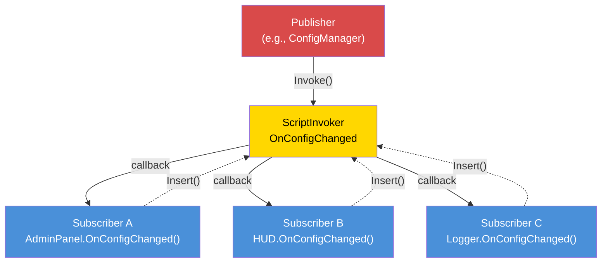

# Capítulo 7.6: Arquitectura Orientada a Eventos

[Inicio](../../README.md) | [<< Anterior: Sistemas de Permisos](05-permissions.md) | **Arquitectura Orientada a Eventos** | [Siguiente: Optimización del Rendimiento >>](07-performance.md)

---

## Introducción

La arquitectura orientada a eventos desacopla al productor de un evento de sus consumidores. Cuando un jugador se conecta, el manejador de conexión no necesita saber sobre el killfeed, el panel de admin, el sistema de misiones o el módulo de registro --- simplemente dispara un evento "jugador conectado", y cada sistema interesado se suscribe independientemente. Esta es la base del diseño extensible de mods: nuevas funcionalidades se suscriben a eventos existentes sin modificar el código que los dispara.

DayZ proporciona `ScriptInvoker` como su primitiva de eventos integrada. Sobre ella, los mods profesionales construyen buses de eventos con temas nombrados, manejadores con tipos y gestión del ciclo de vida. Este capítulo cubre los tres patrones principales y la disciplina crítica de prevención de fugas de memoria.

---

## Tabla de Contenidos

- [Patrón ScriptInvoker](#scriptinvoker-pattern)
- [Patrón EventBus (Temas Enrutados por String)](#eventbus-pattern-string-routed-topics)
- [Patrón CF_EventHandler](#cf_eventhandler-pattern)
- [Cuándo Usar Eventos vs Llamadas Directas](#when-to-use-events-vs-direct-calls)
- [Prevención de Fugas de Memoria](#memory-leak-prevention)
- [Avanzado: Datos de Eventos Personalizados](#advanced-custom-event-data)
- [Mejores Prácticas](#best-practices)

---

## Patrón ScriptInvoker

`ScriptInvoker` es la primitiva pub/sub integrada del motor. Mantiene una lista de callbacks de funciones e invoca todas cuando un evento se dispara. Este es el mecanismo de eventos de nivel más bajo en DayZ.

### Crear un Evento

```c
class WeatherManager
{
    // El evento. Cualquiera puede suscribirse para ser notificado cuando cambie el clima.
    ref ScriptInvoker OnWeatherChanged = new ScriptInvoker();

    protected string m_CurrentWeather;

    void SetWeather(string newWeather)
    {
        m_CurrentWeather = newWeather;

        // Disparar el evento — todos los suscriptores son notificados
        OnWeatherChanged.Invoke(newWeather);
    }
};
```

### Suscribirse a un Evento

```c
class WeatherUI
{
    void Init(WeatherManager mgr)
    {
        // Suscribirse: cuando cambie el clima, llamar a nuestro manejador
        mgr.OnWeatherChanged.Insert(OnWeatherChanged);
    }

    void OnWeatherChanged(string newWeather)
    {
        // Actualizar la UI
        m_WeatherLabel.SetText("Weather: " + newWeather);
    }

    void Cleanup(WeatherManager mgr)
    {
        // CRÍTICO: Desuscribirse al terminar
        mgr.OnWeatherChanged.Remove(OnWeatherChanged);
    }
};
```

### API de ScriptInvoker

| Método | Descripción |
|--------|-------------|
| `Insert(func)` | Agregar un callback a la lista de suscriptores |
| `Remove(func)` | Eliminar un callback específico |
| `Invoke(...)` | Llamar a todos los callbacks suscritos con los argumentos dados |
| `Clear()` | Eliminar todos los suscriptores |

### Patrón Orientado a Eventos



### Cómo Funcionan Insert/Remove

`Insert` agrega una referencia a función a una lista interna. `Remove` busca en la lista y elimina la entrada coincidente. Si llamas `Insert` dos veces con la misma función, se llamará dos veces en cada `Invoke`. Si llamas `Remove` una vez, elimina una entrada.

```c
// Suscribir el mismo manejador dos veces es un error:
mgr.OnWeatherChanged.Insert(OnWeatherChanged);
mgr.OnWeatherChanged.Insert(OnWeatherChanged);  // Ahora se llama 2x por Invoke

// Un Remove solo elimina una entrada:
mgr.OnWeatherChanged.Remove(OnWeatherChanged);
// Aún se llama 1x por Invoke — el segundo Insert sigue ahí
```

### Firmas con Tipos

`ScriptInvoker` no impone tipos de parámetros en tiempo de compilación. La convención es documentar la firma esperada en un comentario:

```c
// Firma: void(string weatherName, float temperature)
ref ScriptInvoker OnWeatherChanged = new ScriptInvoker();
```

Si un suscriptor tiene la firma incorrecta, el comportamiento es indefinido en tiempo de ejecución --- puede crashear, recibir valores basura o silenciosamente no hacer nada. Siempre coincide exactamente con la firma documentada.

### ScriptInvoker en Clases Vanilla

Muchas clases vanilla de DayZ exponen eventos `ScriptInvoker`:

```c
// UIScriptedMenu tiene OnVisibilityChanged
class UIScriptedMenu
{
    ref ScriptInvoker m_OnVisibilityChanged;
};

// MissionBase tiene hooks de eventos
class MissionBase
{
    void OnUpdate(float timeslice);
    void OnEvent(EventType eventTypeId, Param params);
};
```

Puedes suscribirte a estos eventos vanilla desde clases modded para reaccionar a cambios de estado a nivel del motor.

---

## Patrón EventBus (Temas Enrutados por String)

Un `ScriptInvoker` es un canal de evento único. Un EventBus es una colección de canales nombrados, proporcionando un hub central donde cualquier módulo puede publicar o suscribirse a eventos por nombre de tema.

### Patrón de EventBus Personalizado

Este patrón implementa el EventBus como una clase estática con campos `ScriptInvoker` nombrados para eventos bien conocidos, más un canal genérico `OnCustomEvent` para temas ad-hoc:

```c
class MyEventBus
{
    // Eventos de ciclo de vida bien conocidos
    static ref ScriptInvoker OnPlayerConnected;      // void(PlayerIdentity)
    static ref ScriptInvoker OnPlayerDisconnected;    // void(PlayerIdentity)
    static ref ScriptInvoker OnPlayerReady;           // void(PlayerBase, PlayerIdentity)
    static ref ScriptInvoker OnConfigChanged;         // void(string modId, string field, string value)
    static ref ScriptInvoker OnAdminPanelToggled;     // void(bool opened)
    static ref ScriptInvoker OnMissionStarted;        // void(MyInstance)
    static ref ScriptInvoker OnMissionCompleted;      // void(MyInstance, int reason)
    static ref ScriptInvoker OnAdminDataSynced;       // void()

    // Canal de evento personalizado genérico
    static ref ScriptInvoker OnCustomEvent;           // void(string eventName, Param params)

    static void Init() { ... }   // Crea todos los invokers
    static void Cleanup() { ... } // Anula todos los invokers

    // Helper para disparar un evento personalizado
    static void Fire(string eventName, Param params)
    {
        if (!OnCustomEvent) Init();
        OnCustomEvent.Invoke(eventName, params);
    }
};
```

### Suscribirse al EventBus

```c
class MyMissionModule : MyServerModule
{
    override void OnInit()
    {
        super.OnInit();

        // Suscribirse al ciclo de vida del jugador
        MyEventBus.OnPlayerConnected.Insert(OnPlayerJoined);
        MyEventBus.OnPlayerDisconnected.Insert(OnPlayerLeft);

        // Suscribirse a cambios de configuración
        MyEventBus.OnConfigChanged.Insert(OnConfigChanged);
    }

    override void OnMissionFinish()
    {
        // Siempre desuscribirse al apagar
        MyEventBus.OnPlayerConnected.Remove(OnPlayerJoined);
        MyEventBus.OnPlayerDisconnected.Remove(OnPlayerLeft);
        MyEventBus.OnConfigChanged.Remove(OnConfigChanged);
    }

    void OnPlayerJoined(PlayerIdentity identity)
    {
        MyLog.Info("Missions", "Player joined: " + identity.GetName());
    }

    void OnPlayerLeft(PlayerIdentity identity)
    {
        MyLog.Info("Missions", "Player left: " + identity.GetName());
    }

    void OnConfigChanged(string modId, string field, string value)
    {
        if (modId == "MyMod_Missions")
        {
            // Recargar nuestra configuración
            ReloadSettings();
        }
    }
};
```

### Usar Eventos Personalizados

Para eventos puntuales o específicos de un mod que no justifican un campo `ScriptInvoker` dedicado:

```c
// Publicador (ej., en el sistema de loot):
MyEventBus.Fire("LootRespawned", new Param1<int>(spawnedCount));

// Suscriptor (ej., en un módulo de registro):
MyEventBus.OnCustomEvent.Insert(OnCustomEvent);

void OnCustomEvent(string eventName, Param params)
{
    if (eventName == "LootRespawned")
    {
        Param1<int> data;
        if (Class.CastTo(data, params))
        {
            MyLog.Info("Loot", "Respawned " + data.param1.ToString() + " items");
        }
    }
}
```

### Cuándo Usar Campos Nombrados vs Eventos Personalizados

| Enfoque | Usar Cuando |
|---------|------------|
| Campo `ScriptInvoker` nombrado | El evento es bien conocido, usado frecuentemente y tiene una firma estable |
| `OnCustomEvent` + nombre string | El evento es específico del mod, experimental o usado por un solo suscriptor |

Los campos nombrados son seguros en tipos por convención y descubribles al leer la clase. Los eventos personalizados son flexibles pero requieren coincidencia de strings y casting.

---

## Patrón CF_EventHandler

Community Framework proporciona `CF_EventHandler` como un sistema de eventos más estructurado con argumentos de evento con tipos seguros.

### Concepto

```c
// Patrón de event handler de CF (simplificado):
class CF_EventArgs
{
    // Clase base para todos los argumentos de eventos
};

class CF_EventPlayerArgs : CF_EventArgs
{
    PlayerIdentity Identity;
    PlayerBase Player;
};

// Los módulos sobreescriben métodos del manejador de eventos:
class MyModule : CF_ModuleWorld
{
    override void OnEvent(Class sender, CF_EventArgs args)
    {
        // Manejar eventos genéricos
    }

    override void OnClientReady(Class sender, CF_EventArgs args)
    {
        // El cliente está listo, se puede crear la UI
    }
};
```

### Diferencias Clave con ScriptInvoker

| Característica | ScriptInvoker | CF_EventHandler |
|---------|--------------|-----------------|
| **Seguridad de tipos** | Solo por convención | Clases EventArgs con tipos |
| **Descubrimiento** | Leer comentarios | Sobreescribir métodos nombrados |
| **Suscripción** | `Insert()` / `Remove()` | Sobreescribir métodos virtuales |
| **Datos personalizados** | Wrappers Param | Subclases de EventArgs personalizadas |
| **Limpieza** | `Remove()` manual | Automática (sobreescritura de método, sin registro) |

El enfoque de CF elimina la necesidad de suscribirse y desuscribirse manualmente --- simplemente sobreescribes el método manejador. Esto elimina toda una clase de bugs (llamadas a `Remove()` olvidadas) a costa de requerir CF como dependencia.

---

## Cuándo Usar Eventos vs Llamadas Directas

### Usar Eventos Cuando:

1. **Múltiples consumidores independientes** necesitan reaccionar a la misma ocurrencia. ¿Un jugador se conecta? Al killfeed, al panel de admin, al sistema de misiones y al logger les importa a todos.

2. **El productor no debería conocer a los consumidores.** El manejador de conexión no debería importar el módulo de killfeed.

3. **El conjunto de consumidores cambia en tiempo de ejecución.** Los módulos pueden suscribirse y desuscribirse dinámicamente.

4. **Comunicación entre mods.** El Mod A dispara un evento; el Mod B se suscribe. Ninguno importa al otro.

### Usar Llamadas Directas Cuando:

1. **Hay exactamente un consumidor** y es conocido en tiempo de compilación. Si solo al sistema de salud le importa un cálculo de daño, llámalo directamente.

2. **Se necesitan valores de retorno.** Los eventos son disparar-y-olvidar. Si necesitas una respuesta ("¿debería permitirse esta acción?"), usa una llamada directa a método.

3. **El orden importa.** Los suscriptores de eventos se llaman en orden de inserción, pero depender de este orden es frágil. Si el paso B debe ocurrir después del paso A, llama A y luego B explícitamente.

4. **El rendimiento es crítico.** Los eventos tienen sobrecarga (iterar la lista de suscriptores, llamar vía reflexión). Para lógica por-frame y por-entidad, las llamadas directas son más rápidas.

### Guía de Decisión

```
                    ¿El productor necesita un valor de retorno?
                         /                    \
                        SÍ                     NO
                        |                       |
                   Llamada directa      ¿Cuántos consumidores?
                                       /              \
                                     UNO            MÚLTIPLES
                                      |                |
                                 Llamada directa     EVENTO
```

---

## Prevención de Fugas de Memoria

El aspecto más peligroso de la arquitectura orientada a eventos en Enforce Script son las **fugas de suscriptores**. Si un objeto se suscribe a un evento y luego se destruye sin desuscribirse, ocurre una de dos cosas:

1. **Si el objeto extiende `Managed`:** La referencia débil en el invoker se anula automáticamente. El invoker llamará a una función null --- lo cual no hace nada, pero desperdicia ciclos iterando entradas muertas.

2. **Si el objeto NO extiende `Managed`:** El invoker mantiene un puntero a función colgante. Cuando el evento se dispara, llama a memoria liberada. **Crash.**

### La Regla de Oro

**Cada `Insert()` debe tener un `Remove()` correspondiente.** Sin excepciones.

### Patrón: Suscribir en OnInit, Desuscribir en OnMissionFinish

```c
class MyModule : MyServerModule
{
    override void OnInit()
    {
        super.OnInit();
        MyEventBus.OnPlayerConnected.Insert(HandlePlayerConnect);
    }

    override void OnMissionFinish()
    {
        MyEventBus.OnPlayerConnected.Remove(HandlePlayerConnect);
        // Luego llamar a super u otra limpieza
    }

    void HandlePlayerConnect(PlayerIdentity identity) { ... }
};
```

### Patrón: Suscribir en Constructor, Desuscribir en Destructor

Para objetos con un ciclo de vida de propiedad claro:

```c
class PlayerTracker : Managed
{
    void PlayerTracker()
    {
        MyEventBus.OnPlayerConnected.Insert(OnPlayerConnected);
        MyEventBus.OnPlayerDisconnected.Insert(OnPlayerDisconnected);
    }

    void ~PlayerTracker()
    {
        if (MyEventBus.OnPlayerConnected)
            MyEventBus.OnPlayerConnected.Remove(OnPlayerConnected);
        if (MyEventBus.OnPlayerDisconnected)
            MyEventBus.OnPlayerDisconnected.Remove(OnPlayerDisconnected);
    }

    void OnPlayerConnected(PlayerIdentity identity) { ... }
    void OnPlayerDisconnected(PlayerIdentity identity) { ... }
};
```

**Nota las verificaciones de null en el destructor.** Durante el apagado, `MyEventBus.Cleanup()` puede haberse ejecutado ya, estableciendo todos los invokers a `null`. Llamar a `Remove()` en un invoker `null` causa un crash.

### Patrón: La Limpieza del EventBus Anula Todo

El método `MyEventBus.Cleanup()` establece todos los invokers a `null`, lo que descarta todas las referencias de suscriptores de una vez. Esta es la opción nuclear --- garantiza que ningún suscriptor obsoleto sobreviva a los reinicios de misión:

```c
static void Cleanup()
{
    OnPlayerConnected    = null;
    OnPlayerDisconnected = null;
    OnConfigChanged      = null;
    // ... todos los demás invokers
    s_Initialized = false;
}
```

Esto se llama desde `MyFramework.ShutdownAll()` durante `OnMissionFinish`. Los módulos aún deberían hacer `Remove()` de sus propias suscripciones por corrección, pero la limpieza del EventBus actúa como red de seguridad.

### Anti-Patrón: Funciones Anónimas

```c
// MAL: No puedes hacer Remove de una función anónima
MyEventBus.OnPlayerConnected.Insert(function(PlayerIdentity id) {
    Print("Connected: " + id.GetName());
});
// ¿Cómo haces Remove de esto? No puedes referenciarlo.
```

Siempre usa métodos con nombre para poder desuscribirte después.

---

## Avanzado: Datos de Eventos Personalizados

Para eventos que llevan payloads complejos, usa wrappers `Param`:

### Clases Param

DayZ proporciona `Param1<T>` hasta `Param4<T1, T2, T3, T4>` para envolver datos con tipos:

```c
// Disparar con datos estructurados:
Param2<string, int> data = new Param2<string, int>("AK74", 5);
MyEventBus.Fire("ItemSpawned", data);

// Recibir:
void OnCustomEvent(string eventName, Param params)
{
    if (eventName == "ItemSpawned")
    {
        Param2<string, int> data;
        if (Class.CastTo(data, params))
        {
            string className = data.param1;
            int quantity = data.param2;
        }
    }
}
```

### Clase de Datos de Evento Personalizada

Para eventos con muchos campos, crea una clase de datos dedicada:

```c
class KillEventData : Managed
{
    string KillerName;
    string VictimName;
    string WeaponName;
    float Distance;
    vector KillerPos;
    vector VictimPos;
};

// Disparar:
KillEventData killData = new KillEventData();
killData.KillerName = killer.GetIdentity().GetName();
killData.VictimName = victim.GetIdentity().GetName();
killData.WeaponName = weapon.GetType();
killData.Distance = vector.Distance(killer.GetPosition(), victim.GetPosition());
OnKillEvent.Invoke(killData);
```

---

## Mejores Prácticas

1. **Cada `Insert()` debe tener un `Remove()` correspondiente.** Audita tu código: busca cada llamada a `Insert` y verifica que tenga un `Remove` correspondiente en la ruta de limpieza.

2. **Verifica null en el invoker antes de `Remove()` en destructores.** Durante el apagado, el EventBus puede haber sido limpiado ya.

3. **Documenta las firmas de los eventos.** Sobre cada declaración de `ScriptInvoker`, escribe un comentario con la firma esperada del callback:
   ```c
   // Firma: void(PlayerBase player, float damage, string source)
   static ref ScriptInvoker OnPlayerDamaged;
   ```

4. **No dependas del orden de ejecución de suscriptores.** Si el orden importa, usa llamadas directas en su lugar.

5. **Mantén los manejadores de eventos rápidos.** Si un manejador necesita hacer trabajo costoso, prográmalo para el siguiente tick en lugar de bloquear a todos los demás suscriptores.

6. **Usa eventos nombrados para APIs estables, eventos personalizados para experimentos.** Los campos `ScriptInvoker` nombrados son descubribles y documentados. Los eventos personalizados enrutados por string son flexibles pero más difíciles de encontrar.

7. **Inicializa el EventBus temprano.** Los eventos pueden dispararse antes de `OnMissionStart()`. Llama a `Init()` durante `OnInit()` o usa el patrón lazy (verificar `null` antes de `Insert`).

8. **Limpia el EventBus al finalizar la misión.** Anula todos los invokers para prevenir referencias obsoletas entre reinicios de misión.

9. **Nunca uses funciones anónimas como suscriptores de eventos.** No puedes desuscribirlas.

10. **Prefiere eventos sobre polling.** En lugar de verificar "¿ha cambiado la configuración?" cada frame, suscríbete a `OnConfigChanged` y reacciona solo cuando se dispara.

---

## Compatibilidad e Impacto

- **Multi-Mod:** Múltiples mods pueden suscribirse a los mismos temas del EventBus sin conflicto. Cada suscriptor se llama independientemente. Sin embargo, si un suscriptor lanza un error irrecuperable (ej., referencia null), los suscriptores posteriores en ese invoker pueden no ejecutarse.
- **Orden de Carga:** El orden de suscripción es igual al orden de llamada en `Invoke()`. Los mods que cargan primero se registran primero y reciben eventos primero. No dependas de este orden --- si el orden de ejecución importa, usa llamadas directas en su lugar.
- **Listen Server:** En listen servers, los eventos disparados desde código del servidor son visibles para suscriptores del lado del cliente si comparten el mismo `ScriptInvoker` estático. Usa campos separados del EventBus para eventos solo-servidor y solo-cliente, o protege los manejadores con `GetGame().IsServer()` / `GetGame().IsClient()`.
- **Rendimiento:** `ScriptInvoker.Invoke()` itera todos los suscriptores linealmente. Con 5--15 suscriptores por evento, esto es insignificante. Evita suscribir por-entidad (100+ entidades cada una suscribiéndose al mismo evento) --- usa un patrón de manager en su lugar.
- **Migración:** `ScriptInvoker` es una API vanilla estable que probablemente no cambiará entre versiones de DayZ. Los wrappers personalizados de EventBus son tu propio código y migran con tu mod.

---

## Errores Comunes

| Error | Impacto | Solución |
|---------|--------|-----|
| Suscribirse con `Insert()` pero nunca llamar a `Remove()` | Fuga de memoria: el invoker mantiene referencia al objeto muerto; al hacer `Invoke()`, llama a memoria liberada (crash) o no-ops con iteración desperdiciada | Emparejar cada `Insert()` con un `Remove()` en `OnMissionFinish` o el destructor |
| Llamar a `Remove()` en un invoker null del EventBus durante el apagado | `MyEventBus.Cleanup()` puede haber anulado ya el invoker; llamar `.Remove()` en null causa crash | Siempre verificar null en el invoker antes de `Remove()`: `if (MyEventBus.OnPlayerConnected) MyEventBus.OnPlayerConnected.Remove(handler);` |
| Doble `Insert()` del mismo manejador | El manejador se llama dos veces por `Invoke()`; un `Remove()` solo elimina una entrada, dejando una suscripción obsoleta | Verificar antes de insertar, o asegurar que `Insert()` solo se llame una vez (ej., en `OnInit` con una bandera de guardia) |
| Usar funciones anónimas/lambda como manejadores | No se pueden eliminar porque no hay referencia para pasar a `Remove()` | Siempre usar métodos con nombre como manejadores de eventos |
| Disparar eventos con firmas de argumentos no coincidentes | Los suscriptores reciben datos basura o crashean en tiempo de ejecución; sin verificación en compilación | Documentar la firma esperada sobre cada declaración de `ScriptInvoker` y coincidir exactamente en todos los manejadores |

---

[Inicio](../../README.md) | [<< Anterior: Sistemas de Permisos](05-permissions.md) | **Arquitectura Orientada a Eventos** | [Siguiente: Optimización del Rendimiento >>](07-performance.md)
