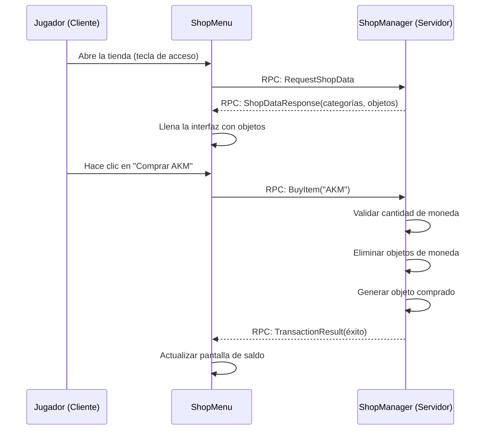

# Capítulo 8.12: Construyendo un Sistema de Comercio

[Inicio](../../README.md) | [<< Anterior: Creando Ropa Personalizada](11-clothing-mod.md) | **Construyendo un Sistema de Comercio** | [Siguiente: El Menú de Diagnóstico >>](13-diag-menu.md)

---

> **Resumen:** Construye un sistema de tienda completo sin NPCs: configuración JSON, compra/venta validada por el servidor, interfaz categorizada, transacciones basadas en moneda. El tutorial más complejo de esta wiki -- cubre modelado de datos, viajes de ida y vuelta de RPC, manipulación de inventario y principios anti-trampas.

---

## Tabla de Contenidos

- [Qué Vamos a Construir](#qué-vamos-a-construir)
- [Paso 1: Modelo de Datos (3_Game)](#paso-1-modelo-de-datos-3_game)
- [Paso 2: Constantes RPC (3_Game)](#paso-2-constantes-rpc-3_game)
- [Paso 3: Administrador de Tienda del Lado del Servidor (4_World)](#paso-3-administrador-de-tienda-del-lado-del-servidor-4_world)
- [Paso 4: Interfaz de Tienda del Lado del Cliente (5_Mission)](#paso-4-interfaz-de-tienda-del-lado-del-cliente-5_mission)
- [Paso 5: Archivo de Layout](#paso-5-archivo-de-layout)
- [Paso 6: Hook de Misión y Tecla de Acceso](#paso-6-hook-de-misión-y-tecla-de-acceso)
- [Paso 7: Objeto de Moneda](#paso-7-objeto-de-moneda)
- [Paso 8: JSON de Configuración de la Tienda](#paso-8-json-de-configuración-de-la-tienda)
- [Paso 9: Compilar y Probar](#paso-9-compilar-y-probar)
- [Consideraciones de Seguridad](#consideraciones-de-seguridad)
- [Referencia Completa del Código](#referencia-completa-del-código)
- [Buenas Prácticas / Errores Comunes / Qué Aprendiste](#buenas-prácticas)

---

## Qué Vamos a Construir

Los jugadores presionan F6 para abrir un menú de tienda, navegan por los objetos por categoría (Armas, Comida, Médico) y compran/venden usando un objeto de moneda. El servidor valida cada transacción -- el cliente nunca decide los precios ni genera objetos.



```
CLIENTE                                SERVIDOR
1. Presionar F6 --> REQUEST_SHOP_DATA ->  2. Cargar config, contar moneda
                                         SHOP_DATA_RESPONSE ->
3. Mostrar categorías + objetos
   Clic Comprar --> BUY_ITEM (cls,qty) -> 4. Validar, remover moneda, generar
                                         TRANSACTION_RESULT ->
5. Mostrar resultado, actualizar saldo
```

**Regla clave:** El cliente envía solo `(className, quantity)`. El servidor busca el precio.

### Estructura del Mod

```
ShopDemo/
    mod.cpp
    GUI/layouts/shop_menu.layout
    Scripts/config.cpp
        3_Game/ShopDemo/  ShopDemoRPC.c  ShopDemoData.c
        4_World/ShopDemo/ ShopDemoManager.c
        5_Mission/ShopDemo/ ShopDemoMenu.c  ShopDemoMission.c
```

---

## Paso 1: Modelo de Datos (3_Game)

### `Scripts/3_Game/ShopDemo/ShopDemoData.c`

```c
class ShopItem
{
    string ClassName;
    string DisplayName;
    int BuyPrice;
    int SellPrice;
    void ShopItem() { ClassName = ""; DisplayName = ""; BuyPrice = 0; SellPrice = 0; }
};

class ShopCategory
{
    string Name;
    ref array<ref ShopItem> Items;
    void ShopCategory() { Name = ""; Items = new array<ref ShopItem>; }
};

class ShopConfig
{
    string CurrencyClassName;
    ref array<ref ShopCategory> Categories;
    void ShopConfig() { CurrencyClassName = "GoldCoin"; Categories = new array<ref ShopCategory>; }
};
```

Mantén siempre `SellPrice < BuyPrice` para prevenir bucles de dinero infinito.

---

## Paso 2: Constantes RPC (3_Game)

### `Scripts/3_Game/ShopDemo/ShopDemoRPC.c`

```c
class ShopDemoRPC
{
    static const int REQUEST_SHOP_DATA   = 79101;  // Cliente -> Servidor
    static const int BUY_ITEM            = 79102;
    static const int SELL_ITEM           = 79103;
    static const int SHOP_DATA_RESPONSE  = 79201;  // Servidor -> Cliente
    static const int TRANSACTION_RESULT  = 79202;
};
```

---

## Paso 3: Administrador de Tienda del Lado del Servidor (4_World)

### `Scripts/4_World/ShopDemo/ShopDemoManager.c`

```c
class ShopDemoManager
{
    private static ref ShopDemoManager s_Instance;
    static ShopDemoManager Get() { if (!s_Instance) s_Instance = new ShopDemoManager(); return s_Instance; }

    protected ref ShopConfig m_Config;
    protected string m_ConfigPath;
    void ShopDemoManager() { m_ConfigPath = "$profile:ShopDemo/ShopConfig.json"; }

    void Init()
    {
        m_Config = new ShopConfig();
        if (FileExist(m_ConfigPath))
        {
            string err;
            if (!JsonFileLoader<ShopConfig>.LoadFile(m_ConfigPath, m_Config, err))
                CreateDefaultConfig();
        }
        else CreateDefaultConfig();
        Print("[ShopDemo] Init: " + m_Config.Categories.Count().ToString() + " categories");
    }

    ShopConfig GetConfig() { return m_Config; }

    protected void CreateDefaultConfig()
    {
        m_Config = new ShopConfig();
        m_Config.CurrencyClassName = "GoldCoin";
        ShopCategory c1 = new ShopCategory(); c1.Name = "Weapons";
        AddItem(c1, "IJ70", "IJ-70 Pistol", 50, 25);
        AddItem(c1, "KA74", "KA-74", 200, 100);
        AddItem(c1, "Mosin9130", "Mosin 91/30", 150, 75);
        m_Config.Categories.Insert(c1);
        ShopCategory c2 = new ShopCategory(); c2.Name = "Food";
        AddItem(c2, "SodaCan_Cola", "Cola", 5, 2);
        AddItem(c2, "TunaCan", "Tuna Can", 8, 4);
        AddItem(c2, "Apple", "Apple", 3, 1);
        m_Config.Categories.Insert(c2);
        ShopCategory c3 = new ShopCategory(); c3.Name = "Medical";
        AddItem(c3, "BandageDressing", "Bandage", 10, 5);
        AddItem(c3, "Morphine", "Morphine", 30, 15);
        AddItem(c3, "SalineBagIV", "Saline Bag IV", 25, 12);
        m_Config.Categories.Insert(c3);
        SaveConfig();
    }

    protected void AddItem(ShopCategory cat, string cls, string disp, int buy, int sell)
    {
        ShopItem si = new ShopItem();
        si.ClassName = cls; si.DisplayName = disp; si.BuyPrice = buy; si.SellPrice = sell;
        cat.Items.Insert(si);
    }

    protected void SaveConfig()
    {
        MakeDirectory("$profile:ShopDemo");
        string err;
        JsonFileLoader<ShopConfig>.SaveFile(m_ConfigPath, m_Config, err);
    }

    int CountPlayerCurrency(PlayerBase player)
    {
        if (!player) return 0;
        int total = 0;
        array<EntityAI> items = new array<EntityAI>;
        player.GetInventory().EnumerateInventory(InventoryTraversalType.PREORDER, items);
        for (int i = 0; i < items.Count(); i++)
        {
            EntityAI ent = items.Get(i);
            if (!ent || ent.GetType() != m_Config.CurrencyClassName) continue;
            ItemBase ib = ItemBase.Cast(ent);
            if (ib && ib.HasQuantity()) total = total + ib.GetQuantity();
            else total = total + 1;
        }
        return total;
    }

    protected bool RemoveCurrency(PlayerBase player, int amount)
    {
        int remaining = amount;
        array<EntityAI> items = new array<EntityAI>;
        player.GetInventory().EnumerateInventory(InventoryTraversalType.PREORDER, items);
        for (int i = 0; i < items.Count(); i++)
        {
            if (remaining <= 0) break;
            EntityAI ent = items.Get(i);
            if (!ent || ent.GetType() != m_Config.CurrencyClassName) continue;
            ItemBase ib = ItemBase.Cast(ent);
            if (!ib) continue;
            if (ib.HasQuantity())
            {
                int qty = ib.GetQuantity();
                if (qty <= remaining) { remaining = remaining - qty; ib.DeleteSafe(); }
                else { ib.SetQuantity(qty - remaining); remaining = 0; }
            }
            else { remaining = remaining - 1; ib.DeleteSafe(); }
        }
        return (remaining <= 0);
    }

    protected bool GiveCurrency(PlayerBase player, int amount)
    {
        EntityAI spawned = player.GetInventory().CreateInInventory(m_Config.CurrencyClassName);
        if (!spawned)
            spawned = EntityAI.Cast(GetGame().CreateObjectEx(m_Config.CurrencyClassName, player.GetPosition(), ECE_PLACE_ON_SURFACE));
        if (!spawned) return false;
        ItemBase ci = ItemBase.Cast(spawned);
        if (ci && ci.HasQuantity()) ci.SetQuantity(amount);
        return true;
    }

    protected ShopItem FindShopItem(string className)
    {
        for (int c = 0; c < m_Config.Categories.Count(); c++)
            for (int i = 0; i < m_Config.Categories.Get(c).Items.Count(); i++)
                if (m_Config.Categories.Get(c).Items.Get(i).ClassName == className)
                    return m_Config.Categories.Get(c).Items.Get(i);
        return null;
    }

    void HandleBuy(PlayerBase player, string className, int quantity)
    {
        PlayerIdentity id = player.GetIdentity();
        if (quantity <= 0 || quantity > 10) { SendResult(player, false, "Invalid quantity.", 0); return; }
        ShopItem si = FindShopItem(className);
        if (!si) { SendResult(player, false, "Item not in shop.", 0); return; }
        int cost = si.BuyPrice * quantity;
        int balance = CountPlayerCurrency(player);
        if (balance < cost) { SendResult(player, false, "Need " + cost.ToString() + ", have " + balance.ToString(), balance); return; }
        if (!RemoveCurrency(player, cost)) { SendResult(player, false, "Currency removal failed.", CountPlayerCurrency(player)); return; }
        for (int i = 0; i < quantity; i++)
        {
            EntityAI sp = player.GetInventory().CreateInInventory(className);
            if (!sp) sp = EntityAI.Cast(GetGame().CreateObjectEx(className, player.GetPosition(), ECE_PLACE_ON_SURFACE));
        }
        int nb = CountPlayerCurrency(player);
        SendResult(player, true, "Bought " + quantity.ToString() + "x " + si.DisplayName + " for " + cost.ToString(), nb);
        Print("[ShopDemo] " + id.GetName() + " bought " + quantity.ToString() + "x " + className);
    }

    void HandleSell(PlayerBase player, string className, int quantity)
    {
        PlayerIdentity id = player.GetIdentity();
        if (quantity <= 0 || quantity > 10) { SendResult(player, false, "Invalid quantity.", 0); return; }
        ShopItem si = FindShopItem(className);
        if (!si || si.SellPrice <= 0) { SendResult(player, false, "Cannot sell this.", 0); return; }
        int removed = 0;
        array<EntityAI> items = new array<EntityAI>;
        player.GetInventory().EnumerateInventory(InventoryTraversalType.PREORDER, items);
        for (int i = 0; i < items.Count(); i++)
        {
            if (removed >= quantity) break;
            EntityAI ent = items.Get(i);
            if (ent && ent.GetType() == className) { ent.DeleteSafe(); removed = removed + 1; }
        }
        if (removed <= 0) { SendResult(player, false, "You don't have that item.", CountPlayerCurrency(player)); return; }
        int payout = si.SellPrice * removed;
        GiveCurrency(player, payout);
        SendResult(player, true, "Sold " + removed.ToString() + "x " + si.DisplayName + " for " + payout.ToString(), CountPlayerCurrency(player));
        Print("[ShopDemo] " + id.GetName() + " sold " + removed.ToString() + "x " + className);
    }

    protected void SendResult(PlayerBase player, bool success, string message, int newBalance)
    {
        if (!player || !player.GetIdentity()) return;
        Param3<bool, string, int> r = new Param3<bool, string, int>(success, message, newBalance);
        GetGame().RPCSingleParam(player, ShopDemoRPC.TRANSACTION_RESULT, r, true, player.GetIdentity());
    }
};

modded class PlayerBase
{
    override void OnRPC(PlayerIdentity sender, int rpc_type, ParamsReadContext ctx)
    {
        super.OnRPC(sender, rpc_type, ctx);
        if (!GetGame().IsServer()) return;
        switch (rpc_type)
        {
            case ShopDemoRPC.REQUEST_SHOP_DATA: OnShopDataReq(sender); break;
            case ShopDemoRPC.BUY_ITEM: OnBuyReq(sender, ctx); break;
            case ShopDemoRPC.SELL_ITEM: OnSellReq(sender, ctx); break;
        }
    }

    protected void OnShopDataReq(PlayerIdentity requestor)
    {
        PlayerBase player = PlayerBase.GetPlayerByUID(requestor.GetId());
        if (!player) return;
        ShopDemoManager mgr = ShopDemoManager.Get();
        ShopConfig cfg = mgr.GetConfig();
        // Serializar: "CatName|cls,name,buy,sell;cls2,...\nCat2|..."
        string payload = "";
        for (int c = 0; c < cfg.Categories.Count(); c++)
        {
            ShopCategory cat = cfg.Categories.Get(c);
            if (c > 0) payload = payload + "\n";
            payload = payload + cat.Name + "|";
            for (int i = 0; i < cat.Items.Count(); i++)
            {
                ShopItem si = cat.Items.Get(i);
                if (i > 0) payload = payload + ";";
                payload = payload + si.ClassName + "," + si.DisplayName + "," + si.BuyPrice.ToString() + "," + si.SellPrice.ToString();
            }
        }
        Param2<int, string> data = new Param2<int, string>(mgr.CountPlayerCurrency(player), payload);
        GetGame().RPCSingleParam(player, ShopDemoRPC.SHOP_DATA_RESPONSE, data, true, requestor);
    }

    protected void OnBuyReq(PlayerIdentity sender, ParamsReadContext ctx)
    {
        Param2<string, int> d = new Param2<string, int>("", 0);
        if (!ctx.Read(d)) return;
        PlayerBase p = PlayerBase.GetPlayerByUID(sender.GetId());
        if (p) ShopDemoManager.Get().HandleBuy(p, d.param1, d.param2);
    }

    protected void OnSellReq(PlayerIdentity sender, ParamsReadContext ctx)
    {
        Param2<string, int> d = new Param2<string, int>("", 0);
        if (!ctx.Read(d)) return;
        PlayerBase p = PlayerBase.GetPlayerByUID(sender.GetId());
        if (p) ShopDemoManager.Get().HandleSell(p, d.param1, d.param2);
    }
};

modded class MissionServer
{
    override void OnInit() { super.OnInit(); ShopDemoManager.Get().Init(); }
};
```

**Decisiones clave:** La moneda se elimina *antes* de generar los objetos (previene duplicación). Siempre usa `DeleteSafe()` para objetos en red. La cantidad se limita a 1-10 para prevenir abuso.

---

## Paso 4: Interfaz de Tienda del Lado del Cliente (5_Mission)

### `Scripts/5_Mission/ShopDemo/ShopDemoMenu.c`

```c
class ShopDemoMenu extends ScriptedWidgetEventHandler
{
    protected Widget m_Root, m_CategoryPanel, m_ItemPanel;
    protected TextWidget m_BalanceText, m_DetailName, m_DetailBuyPrice, m_DetailSellPrice, m_StatusText;
    protected ButtonWidget m_BuyButton, m_SellButton, m_CloseButton;
    protected bool m_IsOpen;
    protected int m_Balance;
    protected string m_SelClass;
    protected ref array<string> m_CatNames;
    protected ref array<ref array<ref ShopItem>> m_CatItems;
    protected ref array<Widget> m_DynWidgets;

    void ShopDemoMenu()
    {
        m_IsOpen = false; m_Balance = 0; m_SelClass = "";
        m_CatNames = new array<string>; m_CatItems = new array<ref array<ref ShopItem>>;
        m_DynWidgets = new array<Widget>;
    }
    void ~ShopDemoMenu() { Close(); }

    void Open()
    {
        if (m_IsOpen) return;
        m_Root = GetGame().GetWorkspace().CreateWidgets("ShopDemo/GUI/layouts/shop_menu.layout");
        if (!m_Root) { Print("[ShopDemo] Layout failed!"); return; }
        m_BalanceText     = TextWidget.Cast(m_Root.FindAnyWidget("BalanceText"));
        m_CategoryPanel   = m_Root.FindAnyWidget("CategoryPanel");
        m_ItemPanel       = m_Root.FindAnyWidget("ItemPanel");
        m_DetailName      = TextWidget.Cast(m_Root.FindAnyWidget("DetailName"));
        m_DetailBuyPrice  = TextWidget.Cast(m_Root.FindAnyWidget("DetailBuyPrice"));
        m_DetailSellPrice = TextWidget.Cast(m_Root.FindAnyWidget("DetailSellPrice"));
        m_StatusText      = TextWidget.Cast(m_Root.FindAnyWidget("StatusText"));
        m_BuyButton       = ButtonWidget.Cast(m_Root.FindAnyWidget("BuyButton"));
        m_SellButton      = ButtonWidget.Cast(m_Root.FindAnyWidget("SellButton"));
        m_CloseButton     = ButtonWidget.Cast(m_Root.FindAnyWidget("CloseButton"));
        if (m_BuyButton) m_BuyButton.SetHandler(this);
        if (m_SellButton) m_SellButton.SetHandler(this);
        if (m_CloseButton) m_CloseButton.SetHandler(this);
        m_Root.Show(true); m_IsOpen = true;
        GetGame().GetMission().PlayerControlDisable(INPUT_EXCLUDE_ALL);
        GetGame().GetUIManager().ShowUICursor(true);
        if (m_StatusText) m_StatusText.SetText("Loading...");
        Man player = GetGame().GetPlayer();
        if (player) { Param1<bool> p = new Param1<bool>(true); GetGame().RPCSingleParam(player, ShopDemoRPC.REQUEST_SHOP_DATA, p, true); }
    }

    void Close()
    {
        if (!m_IsOpen) return;
        for (int i = 0; i < m_DynWidgets.Count(); i++) if (m_DynWidgets.Get(i)) m_DynWidgets.Get(i).Unlink();
        m_DynWidgets.Clear();
        if (m_Root) { m_Root.Unlink(); m_Root = null; }
        m_IsOpen = false;
        GetGame().GetMission().PlayerControlEnable(true);
        GetGame().GetUIManager().ShowUICursor(false);
    }

    bool IsOpen() { return m_IsOpen; }
    void Toggle() { if (m_IsOpen) Close(); else Open(); }

    void OnShopDataReceived(int balance, string payload)
    {
        m_Balance = balance;
        if (m_BalanceText) m_BalanceText.SetText("Balance: " + balance.ToString());
        m_CatNames.Clear(); m_CatItems.Clear();
        TStringArray lines = new TStringArray;
        payload.Split("\n", lines);
        for (int c = 0; c < lines.Count(); c++)
        {
            string line = lines.Get(c);
            int pp = line.IndexOf("|");
            if (pp < 0) continue;
            m_CatNames.Insert(line.Substring(0, pp));
            ref array<ref ShopItem> ci = new array<ref ShopItem>;
            TStringArray iStrs = new TStringArray;
            line.Substring(pp + 1, line.Length() - pp - 1).Split(";", iStrs);
            for (int i = 0; i < iStrs.Count(); i++)
            {
                TStringArray parts = new TStringArray;
                iStrs.Get(i).Split(",", parts);
                if (parts.Count() < 4) continue;
                ShopItem si = new ShopItem();
                si.ClassName = parts.Get(0); si.DisplayName = parts.Get(1);
                si.BuyPrice = parts.Get(2).ToInt(); si.SellPrice = parts.Get(3).ToInt();
                ci.Insert(si);
            }
            m_CatItems.Insert(ci);
        }
        // Construir botones de categoría
        if (m_CategoryPanel)
        {
            for (int b = 0; b < m_CatNames.Count(); b++)
            {
                ButtonWidget btn = ButtonWidget.Cast(GetGame().GetWorkspace().CreateWidget(WidgetType.ButtonWidgetTypeID, 0, b*0.12, 1, 0.10, WidgetFlags.VISIBLE, ARGB(255,60,60,60), 0, m_CategoryPanel));
                if (btn) { btn.SetText(m_CatNames.Get(b)); btn.SetHandler(this); btn.SetName("CatBtn_"+b.ToString()); m_DynWidgets.Insert(btn); }
            }
        }
        if (m_CatNames.Count() > 0) SelectCategory(0);
        if (m_StatusText) m_StatusText.SetText("");
    }

    void SelectCategory(int idx)
    {
        if (idx < 0 || idx >= m_CatItems.Count()) return;
        for (int r = m_DynWidgets.Count()-1; r >= 0; r--)
        { Widget w = m_DynWidgets.Get(r); if (w && w.GetName().IndexOf("ItemBtn_")==0) { w.Unlink(); m_DynWidgets.Remove(r); } }
        array<ref ShopItem> items = m_CatItems.Get(idx);
        for (int j = 0; j < items.Count(); j++)
        {
            ShopItem si = items.Get(j);
            ButtonWidget ib = ButtonWidget.Cast(GetGame().GetWorkspace().CreateWidget(WidgetType.ButtonWidgetTypeID, 0, j*0.08, 1, 0.07, WidgetFlags.VISIBLE, ARGB(255,45,45,50), 0, m_ItemPanel));
            if (ib) { ib.SetText(si.DisplayName+" [B:"+si.BuyPrice.ToString()+" S:"+si.SellPrice.ToString()+"]"); ib.SetHandler(this); ib.SetName("ItemBtn_"+si.ClassName); m_DynWidgets.Insert(ib); }
        }
        m_SelClass = "";
        if (m_DetailName) m_DetailName.SetText("Select an item");
    }

    override bool OnClick(Widget w, int x, int y, int button)
    {
        if (w == m_CloseButton) { Close(); return true; }
        if (w == m_BuyButton) { DoBuySell(ShopDemoRPC.BUY_ITEM); return true; }
        if (w == m_SellButton) { DoBuySell(ShopDemoRPC.SELL_ITEM); return true; }
        string wn = w.GetName();
        if (wn.IndexOf("CatBtn_")==0) { SelectCategory(wn.Substring(7,wn.Length()-7).ToInt()); return true; }
        if (wn.IndexOf("ItemBtn_")==0) { SelectItem(wn.Substring(8,wn.Length()-8)); return true; }
        return false;
    }

    void SelectItem(string cls)
    {
        for (int c = 0; c < m_CatItems.Count(); c++)
            for (int i = 0; i < m_CatItems.Get(c).Count(); i++)
            {
                ShopItem si = m_CatItems.Get(c).Get(i);
                if (si.ClassName == cls) {
                    m_SelClass = cls;
                    if (m_DetailName) m_DetailName.SetText(si.DisplayName);
                    if (m_DetailBuyPrice) m_DetailBuyPrice.SetText("Buy: " + si.BuyPrice.ToString());
                    if (m_DetailSellPrice) m_DetailSellPrice.SetText("Sell: " + si.SellPrice.ToString());
                    return;
                }
            }
    }

    protected void DoBuySell(int rpcId)
    {
        if (m_SelClass == "") { if (m_StatusText) m_StatusText.SetText("Select an item first."); return; }
        Man player = GetGame().GetPlayer();
        if (!player) return;
        Param2<string, int> d = new Param2<string, int>(m_SelClass, 1);
        GetGame().RPCSingleParam(player, rpcId, d, true);
        if (m_StatusText) m_StatusText.SetText("Processing...");
    }

    void OnTransactionResult(bool success, string message, int newBalance)
    {
        m_Balance = newBalance;
        if (m_BalanceText) m_BalanceText.SetText("Balance: " + newBalance.ToString());
        if (m_StatusText) m_StatusText.SetText(message);
    }
};
```

---

## Paso 5: Archivo de Layout

### `GUI/layouts/shop_menu.layout`

Tres columnas: Categorías (izquierda 20%), Objetos (centro 46%), Detalles (derecha 26%).

```
FrameWidgetClass ShopMenuRoot {
 size 0.7 0.7 position 0.15 0.15 hexactpos 0 vexactpos 0 hexactsize 0 vexactsize 0
 {
  ImageWidgetClass Background { size 1 1 position 0 0 hexactpos 0 vexactpos 0 hexactsize 0 vexactsize 0 color 0.08 0.08 0.1 0.92 }
  TextWidgetClass ShopTitle { size 0.5 0.06 position 0.02 0.02 hexactpos 0 vexactpos 0 hexactsize 0 vexactsize 0 text "Shop" "text halign" left "text valign" center color 1 0.85 0.3 1 font "gui/fonts/MetronBook" }
  TextWidgetClass BalanceText { size 0.35 0.06 position 0.63 0.02 hexactpos 0 vexactpos 0 hexactsize 0 vexactsize 0 text "Balance: --" "text halign" right "text valign" center color 0.3 1 0.3 1 font "gui/fonts/MetronBook" }
  FrameWidgetClass CategoryPanel { size 0.2 0.82 position 0.02 0.1 hexactpos 0 vexactpos 0 hexactsize 0 vexactsize 0
   { ImageWidgetClass CatBg { size 1 1 position 0 0 hexactpos 0 vexactpos 0 hexactsize 0 vexactsize 0 color 0.12 0.12 0.14 0.8 } }
  }
  FrameWidgetClass ItemPanel { size 0.46 0.82 position 0.24 0.1 hexactpos 0 vexactpos 0 hexactsize 0 vexactsize 0
   { ImageWidgetClass ItemBg { size 1 1 position 0 0 hexactpos 0 vexactpos 0 hexactsize 0 vexactsize 0 color 0.1 0.1 0.12 0.8 } }
  }
  FrameWidgetClass DetailPanel { size 0.26 0.82 position 0.72 0.1 hexactpos 0 vexactpos 0 hexactsize 0 vexactsize 0
   {
    ImageWidgetClass DetailBg { size 1 1 position 0 0 hexactpos 0 vexactpos 0 hexactsize 0 vexactsize 0 color 0.12 0.12 0.14 0.8 }
    TextWidgetClass DetailName { size 0.9 0.08 position 0.05 0.05 hexactpos 0 vexactpos 0 hexactsize 0 vexactsize 0 text "Select an item" "text halign" center "text valign" center color 1 1 1 1 font "gui/fonts/MetronBook" }
    TextWidgetClass DetailBuyPrice { size 0.9 0.06 position 0.05 0.16 hexactpos 0 vexactpos 0 hexactsize 0 vexactsize 0 text "Buy: --" "text halign" left "text valign" center color 0.3 1 0.3 1 font "gui/fonts/MetronBook" }
    TextWidgetClass DetailSellPrice { size 0.9 0.06 position 0.05 0.24 hexactpos 0 vexactpos 0 hexactsize 0 vexactsize 0 text "Sell: --" "text halign" left "text valign" center color 1 0.85 0.3 1 font "gui/fonts/MetronBook" }
    ButtonWidgetClass BuyButton { size 0.8 0.08 position 0.1 0.5 hexactpos 0 vexactpos 0 hexactsize 0 vexactsize 0 text "Buy" "text halign" center "text valign" center color 0.2 0.7 0.2 1.0 }
    ButtonWidgetClass SellButton { size 0.8 0.08 position 0.1 0.62 hexactpos 0 vexactpos 0 hexactsize 0 vexactsize 0 text "Sell" "text halign" center "text valign" center color 0.8 0.6 0.1 1.0 }
    TextWidgetClass StatusText { size 0.9 0.06 position 0.05 0.82 hexactpos 0 vexactpos 0 hexactsize 0 vexactsize 0 text "" "text halign" center "text valign" center color 0.9 0.9 0.9 1 font "gui/fonts/MetronBook" }
   }
  }
  ButtonWidgetClass CloseButton { size 0.05 0.04 position 0.935 0.015 hexactpos 0 vexactpos 0 hexactsize 0 vexactsize 0 text "X" "text halign" center "text valign" center color 1.0 0.3 0.3 1.0 }
 }
}
```

---

## Paso 6: Hook de Misión y Tecla de Acceso

### `Scripts/5_Mission/ShopDemo/ShopDemoMission.c`

```c
modded class MissionGameplay
{
    protected ref ShopDemoMenu m_ShopDemoMenu;

    override void OnInit() { super.OnInit(); m_ShopDemoMenu = new ShopDemoMenu(); }

    override void OnMissionFinish()
    {
        if (m_ShopDemoMenu) { m_ShopDemoMenu.Close(); m_ShopDemoMenu = null; }
        super.OnMissionFinish();
    }

    override void OnKeyPress(int key)
    {
        super.OnKeyPress(key);
        if (key == KeyCode.KC_F6 && m_ShopDemoMenu) m_ShopDemoMenu.Toggle();
    }

    override void OnRPC(PlayerIdentity sender, Object target, int rpc_type, ParamsReadContext ctx)
    {
        super.OnRPC(sender, target, rpc_type, ctx);
        if (rpc_type == ShopDemoRPC.SHOP_DATA_RESPONSE)
        {
            Param2<int, string> d = new Param2<int, string>(0, "");
            if (ctx.Read(d) && m_ShopDemoMenu) m_ShopDemoMenu.OnShopDataReceived(d.param1, d.param2);
        }
        if (rpc_type == ShopDemoRPC.TRANSACTION_RESULT)
        {
            Param3<bool, string, int> r = new Param3<bool, string, int>(false, "", 0);
            if (ctx.Read(r) && m_ShopDemoMenu) m_ShopDemoMenu.OnTransactionResult(r.param1, r.param2, r.param3);
        }
    }
};
```

Para mods publicados, usa `inputs.xml` para que los jugadores puedan reconfigurar la tecla:

```xml
<?xml version="1.0" encoding="UTF-8"?>
<modded>
 <inputs><actions>
  <input name="UAShopToggle" loc="Toggle Shop" type="button" default="Keyboard:KC_F6" group="modded" />
 </actions></inputs>
</modded>
```

---

## Paso 7: Objeto de Moneda

Puedes usar cualquier objeto existente -- configura `CurrencyClassName` como `"Rag"` en el JSON y los trapos se convierten en dinero. Para una moneda personalizada, consulta el [Capítulo 8.2: Objeto Personalizado](02-custom-item.md).

---

## Paso 8: JSON de Configuración de la Tienda

Se genera automáticamente en `$profile:ShopDemo/ShopConfig.json` en el primer inicio del servidor. Edita los precios, agrega categorías/objetos, reinicia el servidor. Siempre mantén `SellPrice < BuyPrice`.

---

## Paso 9: Compilar y Probar

1. Empaqueta `ShopDemo/` en PBO, agrégalo al servidor+cliente `@ShopDemo/addons/`, añade `-mod=@ShopDemo`
2. Genera moneda, presiona F6, navega, compra/vende
3. Revisa el log del servidor buscando líneas `[ShopDemo]`

| Caso de Prueba | Esperado |
|----------------|----------|
| Comprar sin moneda | "Need X, have 0" |
| Comprar clase desconocida (hackeada) | "Item not in shop" |
| Vender objeto que no se posee | "You don't have that item" |
| Inventario lleno al comprar | El objeto cae al suelo |

---

## Consideraciones de Seguridad

1. **NUNCA confíes en los precios enviados por el cliente.** El cliente envía solo `(className, qty)`. El servidor busca el precio.
2. **Eliminar antes de generar.** Remueve la moneda primero, luego crea los objetos. Previene duplicación.
3. **Validar existencia.** Confirma que el objeto está en el inventario antes de dar moneda de venta.
4. **Registrar todo.** Imprime el nombre del jugador, objeto, cantidad para cada transacción.
5. **Límites de cantidad.** Rechaza `qty <= 0` o `qty > 10`.
6. **Limitar la tasa** en producción: 500ms de enfriamiento por jugador por transacción.

---

## Referencia Completa del Código

| Archivo | Capa | Propósito |
|---------|------|-----------|
| `ShopDemoRPC.c` | 3_Game | Constantes de ID RPC |
| `ShopDemoData.c` | 3_Game | Clases de datos: ShopItem, ShopCategory, ShopConfig |
| `ShopDemoManager.c` | 4_World | Servidor: configuración, lógica de compra/venta, inventario, handlers RPC |
| `ShopDemoMenu.c` | 5_Mission | Cliente: interfaz, widgets dinámicos, envío/recepción RPC |
| `ShopDemoMission.c` | 5_Mission | Hook de misión: init, tecla de acceso, enrutamiento RPC |
| `shop_menu.layout` | GUI | Layout de 3 paneles |

---

## Buenas Prácticas

- **El servidor es la única fuente de verdad.** El cliente es una terminal de visualización.
- **Usa `DeleteSafe()` no `Delete()`.** Maneja la sincronización de red y los slots bloqueados.
- **Clases de datos en 3_Game.** Visibles tanto para 4_World como para 5_Mission.
- **Siempre llama a `super` en los overrides.** Romper la cadena rompe otros mods.
- **Limpia los widgets dinámicos.** Cada `CreateWidget` necesita `Unlink` al cerrar.

## Teoría vs Práctica

| Concepto | Teoría | Realidad |
|----------|--------|----------|
| `JsonFileLoader.LoadFile()` | Carga limpiamente | Las comas finales causan fallos silenciosos. Valida el JSON externamente. |
| Serialización de cadenas por RPC | Simple | Más de 500 objetos pueden alcanzar límites de tamaño. Pagina para tiendas grandes. |
| `CreateInInventory()` | Siempre funciona | Retorna null si el inventario está lleno. Siempre verifica. |
| Pruebas en listen server | Iteración rápida | Oculta errores de red. Prueba en servidor dedicado. |

## Qué Aprendiste

- Carga de configuración JSON con `JsonFileLoader<T>` y generación automática de valores por defecto
- Patrón singleton para administradores de juego del lado del servidor
- Enumeración de inventario, conteo, eliminación (`DeleteSafe`) y generación de objetos
- Serialización de cadenas de datos complejos por RPC (categorías, objetos, precios)
- Creación dinámica de widgets para interfaces impulsadas por datos
- Flujo completo de transacción de compra/venta con autoridad exclusiva del servidor
- Principios de seguridad para sistemas de economía multijugador

## Errores Comunes

| Error | Solución |
|-------|----------|
| El cliente envía el precio | Envía solo `(className, qty)`. El servidor decide el precio. |
| Generar antes de pagar | Remueve la moneda primero, luego crea los objetos. |
| Omitir `super.OnRPC()` | Siempre llama a super -- otros mods necesitan la cadena. |
| `Delete()` en objetos en red | Usa `DeleteSafe()`. |
| Ignorar el retorno de `CreateInInventory` | Verifica null, recurre a generación en el suelo. |
| Redeclarar variables en else-if | Declara una vez antes de la cadena if (regla de Enforce Script). |

---

**Anterior:** [Capítulo 8.11: Mod de Ropa](11-clothing-mod.md)
