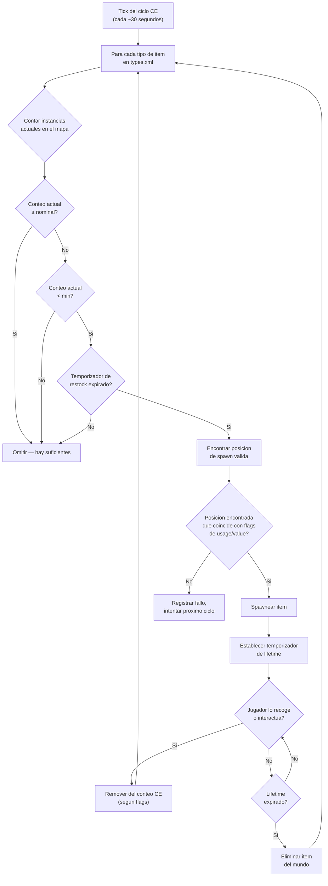

# Capitulo 9.4: Economia de Loot en Profundidad

[Inicio](../README.md) | [<< Anterior: Referencia de serverDZ.cfg](03-server-cfg.md) | **Economia de Loot en Profundidad**

---

> **Resumen:** La Economia Central (CE) es el sistema que controla cada spawn de items en DayZ -- desde una lata de frijoles en un estante hasta un AKM en un cuartel militar. Este capitulo explica el ciclo completo de spawn, documenta cada campo en `types.xml`, `globals.xml`, `events.xml` y `cfgspawnabletypes.xml` con ejemplos reales de los archivos vanilla del servidor, y cubre los errores de economia mas comunes.

---

## Tabla de Contenidos

- [Como funciona la Economia Central](#como-funciona-la-economia-central)
- [El ciclo de spawn](#el-ciclo-de-spawn)
- [types.xml -- Definiciones de spawn de items](#typesxml----definiciones-de-spawn-de-items)
- [Ejemplos reales de types.xml](#ejemplos-reales-de-typesxml)
- [Referencia de campos de types.xml](#referencia-de-campos-de-typesxml)
- [globals.xml -- Parametros de la economia](#globalsxml----parametros-de-la-economia)
- [events.xml -- Eventos dinamicos](#eventsxml----eventos-dinamicos)
- [cfgspawnabletypes.xml -- Accesorios y carga](#cfgspawnabletypesxml----accesorios-y-carga)
- [La relacion nominal/restock](#la-relacion-nominalrestock)
- [Errores comunes de la economia](#errores-comunes-de-la-economia)

---

## Como funciona la Economia Central

La Economia Central (CE) es un sistema del lado del servidor que se ejecuta en un ciclo continuo. Su trabajo es mantener la poblacion de items del mundo en los niveles definidos en tus archivos de configuracion.

La CE **no** coloca items cuando un jugador entra a un edificio. En cambio, se ejecuta con un temporizador global y spawnea items por todo el mapa, independientemente de la proximidad de los jugadores. Los items tienen un **tiempo de vida** -- cuando ese temporizador expira y ningun jugador ha interactuado con el item, la CE lo elimina. Entonces, en el siguiente ciclo, detecta que el conteo esta por debajo del objetivo y spawnea un reemplazo en otro lugar.

Conceptos clave:

- **Nominal** -- el numero objetivo de copias de un item que deben existir en el mapa
- **Min** -- el umbral por debajo del cual la CE intentara respawnear el item
- **Lifetime** -- cuanto tiempo (en segundos) persiste un item sin tocar antes de la limpieza
- **Restock** -- tiempo minimo (en segundos) antes de que la CE pueda respawnear un item despues de que fue tomado/destruido
- **Flags** -- que cuenta para el total (en el mapa, en carga, en inventario del jugador, en escondites)

---

## El ciclo de spawn



En resumen: la CE cuenta cuantos de cada item existen, los compara contra los objetivos nominal/min, y spawnea reemplazos cuando el conteo cae por debajo de `min` y el temporizador de `restock` ha transcurrido.

---

## types.xml -- Definiciones de spawn de items

Este es el archivo de economia mas importante. Cada item que puede spawnear en el mundo necesita una entrada aqui. El `types.xml` vanilla para Chernarus contiene aproximadamente 23,000 lineas que cubren miles de items.

### Ejemplos reales de types.xml

**Arma -- AKM**

```xml
<type name="AKM">
    <nominal>3</nominal>
    <lifetime>7200</lifetime>
    <restock>3600</restock>
    <min>2</min>
    <quantmin>30</quantmin>
    <quantmax>80</quantmax>
    <cost>100</cost>
    <flags count_in_cargo="0" count_in_hoarder="0" count_in_map="1" count_in_player="0" crafted="0" deloot="0"/>
    <category name="weapons"/>
    <usage name="Military"/>
    <value name="Tier4"/>
</type>
```

El AKM es un arma rara de alto nivel. Solo 3 pueden existir en el mapa a la vez (`nominal`). Spawnea en edificios militares en areas de Tier 4 (noroeste). Cuando un jugador recoge uno, la CE ve que el conteo en el mapa cae por debajo de `min=2` y spawneara un reemplazo despues de al menos 3600 segundos (1 hora). El arma spawnea con 30-80% de municion en su cargador interno (`quantmin`/`quantmax`).

**Comida -- BakedBeansCan**

```xml
<type name="BakedBeansCan">
    <nominal>15</nominal>
    <lifetime>14400</lifetime>
    <restock>0</restock>
    <min>12</min>
    <quantmin>-1</quantmin>
    <quantmax>-1</quantmax>
    <cost>100</cost>
    <flags count_in_cargo="0" count_in_hoarder="0" count_in_map="1" count_in_player="0" crafted="0" deloot="0"/>
    <category name="food"/>
    <tag name="shelves"/>
    <usage name="Town"/>
    <usage name="Village"/>
    <value name="Tier1"/>
    <value name="Tier2"/>
    <value name="Tier3"/>
</type>
```

Los frijoles horneados son comida comun. 15 latas deben existir en cualquier momento. Spawnean en estantes en edificios de Town y Village a traves de los Tiers 1-3 (costa a mitad del mapa). `restock=0` significa elegibilidad de respawn instantanea. `quantmin=-1` y `quantmax=-1` significan que el item no usa el sistema de cantidad (no es un contenedor de liquido o municion).

**Ropa -- RidersJacket_Black**

```xml
<type name="RidersJacket_Black">
    <nominal>14</nominal>
    <lifetime>28800</lifetime>
    <restock>0</restock>
    <min>10</min>
    <quantmin>-1</quantmin>
    <quantmax>-1</quantmax>
    <cost>100</cost>
    <flags count_in_cargo="0" count_in_hoarder="0" count_in_map="1" count_in_player="0" crafted="0" deloot="0"/>
    <category name="clothes"/>
    <usage name="Town"/>
    <value name="Tier1"/>
    <value name="Tier2"/>
</type>
```

Una chaqueta civil comun. 14 copias en el mapa, encontrada en edificios de Town cerca de la costa (Tiers 1-2). Un lifetime de 28800 segundos (8 horas) significa que persiste mucho tiempo si nadie la recoge.

**Medico -- BandageDressing**

```xml
<type name="BandageDressing">
    <nominal>40</nominal>
    <lifetime>14400</lifetime>
    <restock>0</restock>
    <min>30</min>
    <quantmin>-1</quantmin>
    <quantmax>-1</quantmax>
    <cost>100</cost>
    <flags count_in_cargo="0" count_in_hoarder="0" count_in_map="1" count_in_player="0" crafted="0" deloot="0"/>
    <category name="tools"/>
    <tag name="shelves"/>
    <usage name="Medic"/>
</type>
```

Los vendajes son muy comunes (40 nominal). Spawnean en edificios Medic (hospitales, clinicas) en todos los tiers (ninguna etiqueta `<value>` significa todos los tiers). Nota que la categoria es `"tools"`, no `"medical"` -- DayZ no tiene una categoria medica; los items medicos usan la categoria tools.

**Item desactivado (variante crafteada)**

```xml
<type name="AK101_Black">
    <nominal>0</nominal>
    <lifetime>28800</lifetime>
    <restock>0</restock>
    <min>0</min>
    <quantmin>-1</quantmin>
    <quantmax>-1</quantmax>
    <cost>100</cost>
    <flags count_in_cargo="0" count_in_hoarder="0" count_in_map="1" count_in_player="0" crafted="1" deloot="0"/>
    <category name="weapons"/>
</type>
```

`nominal=0` y `min=0` significa que la CE nunca spawneara este item. `crafted=1` indica que solo se puede obtener mediante crafteo (pintando un arma). Aun tiene un lifetime para que las instancias persistidas eventualmente se limpien.

---

## Referencia de campos de types.xml

### Campos principales

| Campo | Tipo | Rango | Descripcion |
|-------|------|-------|-------------|
| `name` | string | -- | Nombre de clase del item. Debe coincidir exactamente con el nombre de clase del juego. |
| `nominal` | int | 0+ | Numero objetivo de este item en el mapa. Pon 0 para prevenir el spawn. |
| `min` | int | 0+ | Cuando el conteo cae a este valor o por debajo, la CE intentara spawnear mas. |
| `lifetime` | int | segundos | Cuanto tiempo existe un item sin tocar antes de que la CE lo elimine. |
| `restock` | int | segundos | Tiempo de enfriamiento minimo antes de que la CE pueda spawnear un reemplazo. 0 = inmediato. |
| `quantmin` | int | -1 a 100 | Porcentaje de cantidad minima al spawnear (% municion, % liquido). -1 = no aplica. |
| `quantmax` | int | -1 a 100 | Porcentaje de cantidad maxima al spawnear. -1 = no aplica. |
| `cost` | int | 0+ | Peso de prioridad para la seleccion de spawn. Actualmente todos los items vanilla usan 100. |

### Flags

```xml
<flags count_in_cargo="0" count_in_hoarder="0" count_in_map="1" count_in_player="0" crafted="0" deloot="0"/>
```

| Flag | Valores | Descripcion |
|------|--------|-------------|
| `count_in_map` | 0, 1 | Contar items en el suelo o en puntos de spawn de edificios. **Casi siempre 1.** |
| `count_in_cargo` | 0, 1 | Contar items dentro de otros contenedores (mochilas, tiendas). |
| `count_in_hoarder` | 0, 1 | Contar items en escondites, barriles, contenedores enterrados, tiendas. |
| `count_in_player` | 0, 1 | Contar items en el inventario del jugador (en el cuerpo o en las manos). |
| `crafted` | 0, 1 | Cuando es 1, este item solo se obtiene mediante crafteo, no spawn de la CE. |
| `deloot` | 0, 1 | Loot de evento dinamico. Cuando es 1, el item solo spawnea en ubicaciones de eventos dinamicos (choques de helicopteros, etc.). |

**La estrategia de flags importa.** Si `count_in_player=1`, cada AKM que un jugador lleva cuenta para el nominal. Esto significa que recoger un AKM no activaria un respawn porque el conteo no cambio. La mayoria de items vanilla usan `count_in_player=0` para que los items que llevan los jugadores no bloqueen los respawns.

### Etiquetas

| Elemento | Proposito | Definido en |
|---------|---------|-----------|
| `<category name="..."/>` | Categoria del item para coincidencia de puntos de spawn | `cfglimitsdefinition.xml` |
| `<usage name="..."/>` | Tipo de edificio donde este item puede spawnear | `cfglimitsdefinition.xml` |
| `<value name="..."/>` | Zona de tier del mapa donde este item puede spawnear | `cfglimitsdefinition.xml` |
| `<tag name="..."/>` | Tipo de posicion de spawn dentro de un edificio | `cfglimitsdefinition.xml` |

**Categorias validas:** `tools`, `containers`, `clothes`, `food`, `weapons`, `books`, `explosives`, `lootdispatch`

**Flags de uso validos:** `Military`, `Police`, `Medic`, `Firefighter`, `Industrial`, `Farm`, `Coast`, `Town`, `Village`, `Hunting`, `Office`, `School`, `Prison`, `Lunapark`, `SeasonalEvent`, `ContaminatedArea`, `Historical`

**Flags de valor validos:** `Tier1`, `Tier2`, `Tier3`, `Tier4`, `Unique`

**Etiquetas validas:** `floor`, `shelves`, `ground`

Un item puede tener **multiples** etiquetas `<usage>` y `<value>`. Multiples usages significan que puede spawnear en cualquiera de esos tipos de edificio. Multiples values significan que puede spawnear en cualquiera de esos tiers.

Si omites `<value>` por completo, el item spawnea en **todos** los tiers. Si omites `<usage>`, el item no tiene ubicacion de spawn valida y **no spawneara**.

---

## globals.xml -- Parametros de la economia

Este archivo controla el comportamiento global de la CE. Cada parametro del archivo vanilla:

```xml
<variables>
    <var name="AnimalMaxCount" type="0" value="200"/>
    <var name="CleanupAvoidance" type="0" value="100"/>
    <var name="CleanupLifetimeDeadAnimal" type="0" value="1200"/>
    <var name="CleanupLifetimeDeadInfected" type="0" value="330"/>
    <var name="CleanupLifetimeDeadPlayer" type="0" value="3600"/>
    <var name="CleanupLifetimeDefault" type="0" value="45"/>
    <var name="CleanupLifetimeLimit" type="0" value="50"/>
    <var name="CleanupLifetimeRuined" type="0" value="330"/>
    <var name="FlagRefreshFrequency" type="0" value="432000"/>
    <var name="FlagRefreshMaxDuration" type="0" value="3456000"/>
    <var name="FoodDecay" type="0" value="1"/>
    <var name="IdleModeCountdown" type="0" value="60"/>
    <var name="IdleModeStartup" type="0" value="1"/>
    <var name="InitialSpawn" type="0" value="100"/>
    <var name="LootDamageMax" type="1" value="0.82"/>
    <var name="LootDamageMin" type="1" value="0.0"/>
    <var name="LootProxyPlacement" type="0" value="1"/>
    <var name="LootSpawnAvoidance" type="0" value="100"/>
    <var name="RespawnAttempt" type="0" value="2"/>
    <var name="RespawnLimit" type="0" value="20"/>
    <var name="RespawnTypes" type="0" value="12"/>
    <var name="RestartSpawn" type="0" value="0"/>
    <var name="SpawnInitial" type="0" value="1200"/>
    <var name="TimeHopping" type="0" value="60"/>
    <var name="TimeLogin" type="0" value="15"/>
    <var name="TimeLogout" type="0" value="15"/>
    <var name="TimePenalty" type="0" value="20"/>
    <var name="WorldWetTempUpdate" type="0" value="1"/>
    <var name="ZombieMaxCount" type="0" value="1000"/>
    <var name="ZoneSpawnDist" type="0" value="300"/>
</variables>
```

El atributo `type` indica el tipo de dato: `0` = entero, `1` = flotante.

### Referencia completa de parametros

| Parametro | Tipo | Predeterminado | Descripcion |
|-----------|------|---------|-------------|
| **AnimalMaxCount** | int | 200 | Numero maximo de animales vivos en el mapa a la vez. |
| **CleanupAvoidance** | int | 100 | Distancia en metros desde un jugador donde la CE NO limpiara items. Los items dentro de este radio estan protegidos de la expiracion de lifetime. |
| **CleanupLifetimeDeadAnimal** | int | 1200 | Segundos antes de que un cadaver de animal sea removido. (20 minutos) |
| **CleanupLifetimeDeadInfected** | int | 330 | Segundos antes de que un cadaver de zombi sea removido. (5.5 minutos) |
| **CleanupLifetimeDeadPlayer** | int | 3600 | Segundos antes de que un cuerpo de jugador muerto sea removido. (1 hora) |
| **CleanupLifetimeDefault** | int | 45 | Tiempo de limpieza predeterminado en segundos para items sin un lifetime especifico. |
| **CleanupLifetimeLimit** | int | 50 | Numero maximo de items procesados por ciclo de limpieza. |
| **CleanupLifetimeRuined** | int | 330 | Segundos antes de que los items arruinados sean limpiados. (5.5 minutos) |
| **FlagRefreshFrequency** | int | 432000 | Con que frecuencia un poste de bandera debe ser "refrescado" por interaccion para prevenir la degradacion de la base, en segundos. (5 dias) |
| **FlagRefreshMaxDuration** | int | 3456000 | Tiempo de vida maximo de un poste de bandera incluso con refresco regular, en segundos. (40 dias) |
| **FoodDecay** | int | 1 | Activar (1) o desactivar (0) la descomposicion de alimentos con el tiempo. |
| **IdleModeCountdown** | int | 60 | Segundos antes de que el servidor entre en modo inactivo cuando no hay jugadores conectados. |
| **IdleModeStartup** | int | 1 | Si el servidor inicia en modo inactivo (1) o modo activo (0). |
| **InitialSpawn** | int | 100 | Porcentaje de valores nominales a spawnear en el primer inicio del servidor (0-100). |
| **LootDamageMax** | float | 0.82 | Estado de dano maximo para loot spawneado aleatoriamente (0.0 = pristine, 1.0 = arruinado). |
| **LootDamageMin** | float | 0.0 | Estado de dano minimo para loot spawneado aleatoriamente. |
| **LootProxyPlacement** | int | 1 | Activar (1) la colocacion visual de items en estantes/mesas vs caidas aleatorias al suelo. |
| **LootSpawnAvoidance** | int | 100 | Distancia en metros desde un jugador donde la CE NO spawneara nuevo loot. Previene que los items aparezcan frente a los jugadores. |
| **RespawnAttempt** | int | 2 | Numero de intentos de posicion de spawn por item por ciclo de la CE antes de rendirse. |
| **RespawnLimit** | int | 20 | Numero maximo de items que la CE respawneara por ciclo. |
| **RespawnTypes** | int | 12 | Numero maximo de tipos de items diferentes procesados por ciclo de respawn. |
| **RestartSpawn** | int | 0 | Cuando es 1, re-aleatoriza todas las posiciones de loot al reiniciar el servidor. Cuando es 0, carga desde la persistencia. |
| **SpawnInitial** | int | 1200 | Numero de items a spawnear durante la poblacion inicial de la economia en el primer inicio. |
| **TimeHopping** | int | 60 | Tiempo de enfriamiento en segundos que previene a un jugador de reconectarse al mismo servidor (anti-server-hop). |
| **TimeLogin** | int | 15 | Temporizador de cuenta regresiva de login en segundos (el temporizador "Por favor espera" al conectarse). |
| **TimeLogout** | int | 15 | Temporizador de cuenta regresiva de logout en segundos. El jugador permanece en el mundo durante este tiempo. |
| **TimePenalty** | int | 20 | Tiempo de penalizacion extra en segundos agregado al temporizador de logout si el jugador se desconecta incorrectamente (Alt+F4). |
| **WorldWetTempUpdate** | int | 1 | Activar (1) o desactivar (0) las actualizaciones de simulacion de temperatura y humedad del mundo. |
| **ZombieMaxCount** | int | 1000 | Numero maximo de zombis vivos en el mapa a la vez. |
| **ZoneSpawnDist** | int | 300 | Distancia en metros desde un jugador a la cual las zonas de spawn de zombis se activan. |

### Ajustes comunes de calibracion

**Mas loot (servidor PvP):**
```xml
<var name="InitialSpawn" type="0" value="100"/>
<var name="RespawnLimit" type="0" value="50"/>
<var name="RespawnTypes" type="0" value="30"/>
<var name="RespawnAttempt" type="0" value="4"/>
```

**Cuerpos muertos mas duraderos (mas tiempo para lootear kills):**
```xml
<var name="CleanupLifetimeDeadPlayer" type="0" value="7200"/>
```

**Degradacion de bases mas rapida (borrar bases inactivas mas rapido):**
```xml
<var name="FlagRefreshFrequency" type="0" value="259200"/>
<var name="FlagRefreshMaxDuration" type="0" value="1728000"/>
```

---

## events.xml -- Eventos dinamicos

Los eventos definen spawns para entidades que necesitan manejo especial: animales, vehiculos y choques de helicopteros. A diferencia de los items de `types.xml` que spawnean dentro de edificios, los eventos spawnean en posiciones predefinidas del mundo listadas en `cfgeventspawns.xml`.

### Ejemplo real de evento de vehiculo

```xml
<event name="VehicleCivilianSedan">
    <nominal>8</nominal>
    <min>5</min>
    <max>11</max>
    <lifetime>300</lifetime>
    <restock>0</restock>
    <saferadius>500</saferadius>
    <distanceradius>500</distanceradius>
    <cleanupradius>200</cleanupradius>
    <flags deletable="0" init_random="0" remove_damaged="1"/>
    <position>fixed</position>
    <limit>mixed</limit>
    <active>1</active>
    <children>
        <child lootmax="0" lootmin="0" max="5" min="3" type="CivilianSedan"/>
        <child lootmax="0" lootmin="0" max="5" min="3" type="CivilianSedan_Black"/>
        <child lootmax="0" lootmin="0" max="5" min="3" type="CivilianSedan_Wine"/>
    </children>
</event>
```

### Ejemplo real de evento de animales

```xml
<event name="AnimalBear">
    <nominal>0</nominal>
    <min>2</min>
    <max>2</max>
    <lifetime>180</lifetime>
    <restock>0</restock>
    <saferadius>200</saferadius>
    <distanceradius>0</distanceradius>
    <cleanupradius>0</cleanupradius>
    <flags deletable="0" init_random="0" remove_damaged="1"/>
    <position>fixed</position>
    <limit>custom</limit>
    <active>1</active>
    <children>
        <child lootmax="0" lootmin="0" max="1" min="1" type="Animal_UrsusArctos"/>
    </children>
</event>
```

### Referencia de campos de eventos

| Campo | Descripcion |
|-------|-------------|
| `name` | Identificador del evento. Debe coincidir con una entrada en `cfgeventspawns.xml` para eventos con `position="fixed"`. |
| `nominal` | Numero objetivo de grupos de eventos activos en el mapa. |
| `min` | Miembros minimos del grupo por punto de spawn. |
| `max` | Miembros maximos del grupo por punto de spawn. |
| `lifetime` | Segundos antes de que el evento sea limpiado y respawneado. Para vehiculos, este es el intervalo de verificacion de respawn, no el lifetime de persistencia del vehiculo. |
| `restock` | Segundos minimos entre respawns. |
| `saferadius` | Distancia minima en metros desde un jugador para que el evento spawnee. |
| `distanceradius` | Distancia minima entre dos instancias del mismo evento. |
| `cleanupradius` | Distancia desde cualquier jugador por debajo de la cual el evento NO sera limpiado. |
| `deletable` | Si el evento puede ser eliminado por la CE (0 = no). |
| `init_random` | Aleatorizar posiciones iniciales (0 = usar posiciones fijas). |
| `remove_damaged` | Remover la entidad del evento si se dana/arruina (1 = si). |
| `position` | `"fixed"` = usar posiciones de `cfgeventspawns.xml`. `"player"` = spawnear cerca de jugadores. |
| `limit` | `"child"` = limite por tipo hijo. `"mixed"` = limite entre todos los hijos. `"custom"` = comportamiento especial. |
| `active` | 1 = activado, 0 = desactivado. |

### Hijos

Cada elemento `<child>` define una variante que puede spawnear:

| Atributo | Descripcion |
|-----------|-------------|
| `type` | Nombre de clase de la entidad a spawnear. |
| `min` | Instancias minimas de esta variante (para `limit="child"`). |
| `max` | Instancias maximas de esta variante (para `limit="child"`). |
| `lootmin` | Numero minimo de items de loot spawneados dentro/sobre la entidad. |
| `lootmax` | Numero maximo de items de loot spawneados dentro/sobre la entidad. |

---

## cfgspawnabletypes.xml -- Accesorios y carga

Este archivo define que accesorios, carga y estado de dano tiene un item cuando spawnea. Sin una entrada aqui, los items spawnean vacios y con dano aleatorio (dentro de `LootDamageMin`/`LootDamageMax` de `globals.xml`).

### Arma con accesorios -- AKM

```xml
<type name="AKM">
    <damage min="0.45" max="0.85" />
    <attachments chance="1.00">
        <item name="AK_PlasticBttstck" chance="1.00" />
    </attachments>
    <attachments chance="1.00">
        <item name="AK_PlasticHndgrd" chance="1.00" />
    </attachments>
    <attachments chance="0.50">
        <item name="KashtanOptic" chance="0.30" />
        <item name="PSO11Optic" chance="0.20" />
    </attachments>
    <attachments chance="0.05">
        <item name="AK_Suppressor" chance="1.00" />
    </attachments>
    <attachments chance="0.30">
        <item name="Mag_AKM_30Rnd" chance="1.00" />
    </attachments>
</type>
```

Leyendo esta entrada:

1. El AKM spawnea con dano entre 45-85% (desgastado a muy danado)
2. **Siempre** (100%) recibe una culata y guardamanos de plastico
3. 50% de probabilidad de que el slot de optica se llene -- si se llena, 30% de probabilidad para Kashtan, 20% para PSO-11
4. 5% de probabilidad de un supresor
5. 30% de probabilidad de un cargador cargado

Cada bloque `<attachments>` representa un slot de accesorio. El `chance` en el bloque es la probabilidad de que ese slot se llene. El `chance` en cada `<item>` dentro es el peso de seleccion relativa -- la CE elige un item de la lista usando estos como pesos.

### Arma con accesorios -- M4A1

```xml
<type name="M4A1">
    <damage min="0.45" max="0.85" />
    <attachments chance="1.00">
        <item name="M4_OEBttstck" chance="1.00" />
    </attachments>
    <attachments chance="1.00">
        <item name="M4_PlasticHndgrd" chance="1.00" />
    </attachments>
    <attachments chance="1.00">
        <item name="BUISOptic" chance="0.50" />
        <item name="M4_CarryHandleOptic" chance="1.00" />
    </attachments>
    <attachments chance="0.30">
        <item name="Mag_CMAG_40Rnd" chance="0.15" />
        <item name="Mag_CMAG_10Rnd" chance="0.50" />
        <item name="Mag_CMAG_20Rnd" chance="0.70" />
        <item name="Mag_CMAG_30Rnd" chance="1.00" />
    </attachments>
</type>
```

### Chaleco con bolsillos -- PlateCarrierVest_Camo

```xml
<type name="PlateCarrierVest_Camo">
    <damage min="0.1" max="0.6" />
    <attachments chance="0.85">
        <item name="PlateCarrierHolster_Camo" chance="1.00" />
    </attachments>
    <attachments chance="0.85">
        <item name="PlateCarrierPouches_Camo" chance="1.00" />
    </attachments>
</type>
```

### Mochila con carga

```xml
<type name="AssaultBag_Ttsko">
    <cargo preset="mixArmy" />
    <cargo preset="mixArmy" />
    <cargo preset="mixArmy" />
</type>
```

El atributo `preset` referencia un pool de loot definido en `cfgrandompresets.xml`. Cada linea `<cargo>` es una tirada -- esta mochila obtiene 3 tiradas del pool `mixArmy`. El propio valor de `chance` del pool determina si cada tirada realmente produce un item.

### Items solo de hoarder

```xml
<type name="Barrel_Blue">
    <hoarder />
</type>
<type name="SeaChest">
    <hoarder />
</type>
```

La etiqueta `<hoarder />` marca items como contenedores de hoarder. La CE cuenta los items dentro de estos por separado usando el flag `count_in_hoarder` de `types.xml`.

### Sobreescritura de dano de spawn

```xml
<type name="BandageDressing">
    <damage min="0.0" max="0.0" />
</type>
```

Fuerza a los vendajes a siempre spawnear en condicion Pristine, sobreescribiendo los `LootDamageMin`/`LootDamageMax` globales de `globals.xml`.

---

## La relacion nominal/restock

Entender como `nominal`, `min` y `restock` trabajan juntos es critico para calibrar tu economia.

### La matematica

```
SI (conteo_actual < min) Y (tiempo_desde_ultimo_spawn > restock):
    spawnear nuevo item (hasta nominal)
```

**Ejemplo con el AKM:**
- `nominal = 3`, `min = 2`, `restock = 3600`
- El servidor inicia: la CE spawnea 3 AKMs por el mapa
- Un jugador recoge 1 AKM: el conteo del mapa baja a 2
- El conteo (2) NO es menor que min (2), asi que no hay respawn todavia
- Un jugador recoge otro AKM: el conteo del mapa baja a 1
- El conteo (1) SI es menor que min (2), y el temporizador de restock (3600s = 1 hora) comienza
- Despues de 1 hora, la CE spawnea 2 nuevos AKMs para alcanzar el nominal (3) de nuevo

**Ejemplo con BakedBeansCan:**
- `nominal = 15`, `min = 12`, `restock = 0`
- Un jugador come una lata: el conteo del mapa baja a 14
- El conteo (14) NO es menor que min (12), asi que no hay respawn
- 3 latas mas comidas: el conteo baja a 11
- El conteo (11) SI es menor que min (12), restock es 0 (instantaneo)
- Proximo ciclo de la CE: spawnea 4 latas para alcanzar el nominal (15)

### Ideas clave

- **La brecha entre nominal y min** determina cuantos items pueden ser "consumidos" antes de que la CE reaccione. Una brecha pequena (como el AKM: 3/2) significa que la CE reacciona despues de solo 2 recogidas. Una brecha grande significa que mas items pueden salir de la economia antes de que el respawn se active.

- **restock = 0** hace que el respawn sea efectivamente instantaneo (proximo ciclo de la CE). Valores altos de restock crean escasez -- la CE sabe que necesita spawnear mas pero debe esperar.

- El **lifetime** es independiente de nominal/min. Incluso si la CE ha spawneado un item para alcanzar el nominal, el item sera eliminado cuando su lifetime expire si nadie lo toca. Esto crea una "rotacion" constante de items apareciendo y desapareciendo por el mapa.

- Los items que los jugadores recogen pero luego sueltan (en una ubicacion diferente) siguen contando si el flag relevante esta activado. Un AKM soltado en el suelo sigue contando para el total del mapa porque `count_in_map=1`.

---

## Errores comunes de la economia

### El item tiene una entrada en types.xml pero no spawnea

**Verifica en orden:**

1. Es `nominal` mayor que 0?
2. Tiene el item al menos una etiqueta `<usage>`? (Sin usage = sin ubicacion de spawn valida)
3. Esta la etiqueta `<usage>` definida en `cfglimitsdefinition.xml`?
4. Esta la etiqueta `<value>` (si esta presente) definida en `cfglimitsdefinition.xml`?
5. Es la etiqueta `<category>` valida?
6. Esta el item listado en `cfgignorelist.xml`? (Los items ahi estan bloqueados)
7. Esta el flag `crafted` puesto en 1? (Los items crafteados nunca spawnean naturalmente)
8. Esta `RestartSpawn` en `globals.xml` puesto en 0 con persistencia existente? (La persistencia antigua puede bloquear el spawn de nuevos items hasta un wipe)

### Los items spawnean pero desaparecen inmediatamente

El valor de `lifetime` es demasiado bajo. Un lifetime de 45 segundos (el `CleanupLifetimeDefault`) significa que el item se limpia casi inmediatamente. Las armas deben tener lifetimes de 7200-28800 segundos.

### Demasiados/muy pocos de un item

Ajusta `nominal` y `min` juntos. Si pones `nominal=100` pero `min=1`, la CE no spawneara reemplazos hasta que 99 items hayan sido tomados. Si quieres un suministro constante, manten `min` cerca de `nominal` (por ejemplo, `nominal=20, min=15`).

### Los items solo spawnean en una area

Verifica tus etiquetas `<value>`. Si un item solo tiene `<value name="Tier4"/>`, solo spawneara en el area militar del noroeste de Chernarus. Agrega mas tiers para distribuirlo por el mapa:

```xml
<value name="Tier1"/>
<value name="Tier2"/>
<value name="Tier3"/>
<value name="Tier4"/>
```

### Items de mods que no spawnean

Al agregar items de un mod a `types.xml`:

1. Asegurate de que el mod este cargado (listado en el parametro `-mod=`)
2. Verifica que el nombre de clase sea **exactamente** correcto (sensible a mayusculas/minusculas)
3. Agrega las etiquetas de category/usage/value del item -- solo tener una entrada en `types.xml` no es suficiente
4. Si el mod agrega nuevas etiquetas de usage o value, agregalas a `cfglimitsdefinitionuser.xml`
5. Revisa el log de scripts en busca de advertencias sobre nombres de clase desconocidos

### Las partes de vehiculos no spawnean dentro de vehiculos

Las partes de vehiculos spawnean a traves de `cfgspawnabletypes.xml`, no `types.xml`. Si un vehiculo spawnea sin ruedas o bateria, verifica que el vehiculo tenga una entrada en `cfgspawnabletypes.xml` con las definiciones de accesorios apropiadas.

### Todo el loot es Pristine o todo el loot esta arruinado

Verifica `LootDamageMin` y `LootDamageMax` en `globals.xml`. Los valores vanilla son `0.0` y `0.82`. Poner ambos en `0.0` hace todo pristine. Poner ambos en `1.0` hace todo arruinado. Tambien verifica las sobreescrituras por item en `cfgspawnabletypes.xml`.

### La economia se siente "atascada" despues de editar types.xml

Despues de editar archivos de economia, haz una de estas opciones:
- Elimina `storage_1/` para un wipe completo e inicio limpio de la economia
- Pon `RestartSpawn` a `1` en `globals.xml` para un reinicio para re-aleatorizar el loot, luego ponlo de vuelta a `0`
- Espera a que los lifetimes de los items expiren naturalmente (puede tomar horas)

---

**Anterior:** [Referencia de serverDZ.cfg](03-server-cfg.md) | [Inicio](../README.md) | **Siguiente:** [Spawn de Vehiculos y Eventos Dinamicos](05-vehicle-spawning.md)
