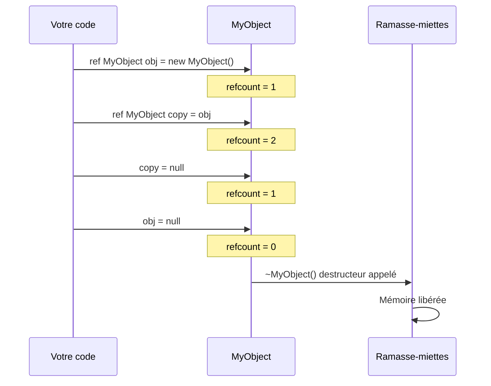
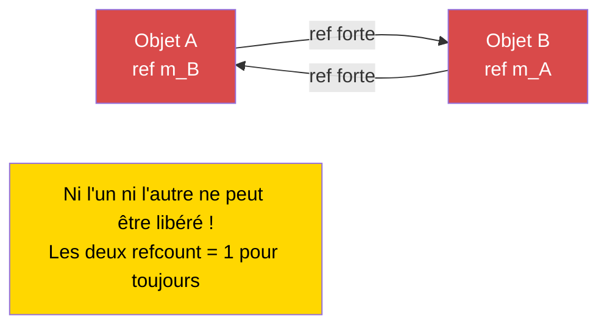

# Chapitre 1.8 : Gestion de la mémoire

[Accueil](../../README.md) | [<< Précédent : Math & Vecteurs](07-math-vectors.md) | **Gestion de la mémoire** | [Suivant : Casting & Réflexion >>](09-casting-reflection.md)

---

## Introduction

Enforce Script utilise le **comptage automatique de références (ARC)** pour la gestion de la mémoire -- pas un ramasse-miettes au sens traditionnel. Comprendre comment fonctionnent `ref`, `autoptr` et les pointeurs bruts est essentiel pour écrire des mods DayZ stables. Si vous vous trompez, vous allez soit fuir de la mémoire (votre serveur consomme progressivement plus de RAM jusqu'au crash) soit accéder à des objets supprimés (crash instantané sans message d'erreur utile). Ce chapitre explique chaque type de pointeur, quand les utiliser et comment éviter le piège le plus dangereux : les cycles de références.

---

## Les trois types de pointeurs

Enforce Script offre trois façons de maintenir une référence vers un objet :

| Type de pointeur | Mot-clé | Garde l'objet vivant ? | Mis à zéro à la suppression ? | Utilisation principale |
|-----------------|---------|----------------------|------------------------------|----------------------|
| **Pointeur brut** | *(aucun)* | Non (référence faible) | Seulement si la classe étend `Managed` | Rétro-références, observateurs, caches |
| **Référence forte** | `ref` | Oui | Oui | Membres possédés, collections |
| **Pointeur auto** | `autoptr` | Oui, supprimé en fin de portée | Oui | Variables locales |

### Comment fonctionne l'ARC

Chaque objet a un **compteur de références** -- le nombre de références fortes (`ref`, `autoptr`, variables locales, arguments de fonction) pointant vers lui. Quand le compteur tombe à zéro, l'objet est automatiquement détruit et son destructeur est appelé.

Les **références faibles** (pointeurs bruts) n'incrémentent PAS le compteur de références. Elles observent l'objet sans le garder vivant.

---

## Pointeurs bruts (Références faibles)

Un pointeur brut est toute variable déclarée sans `ref` ni `autoptr`. Pour les membres de classe, cela crée une **référence faible** : elle pointe vers l'objet mais ne le garde PAS vivant.

```c
class Observer
{
    PlayerBase m_WatchedPlayer;  // Référence faible -- ne garde PAS le joueur vivant

    void Watch(PlayerBase player)
    {
        m_WatchedPlayer = player;
    }

    void Report()
    {
        if (m_WatchedPlayer) // TOUJOURS vérifier null sur les références faibles
        {
            Print("Watching: " + m_WatchedPlayer.GetIdentity().GetName());
        }
        else
        {
            Print("Player no longer exists");
        }
    }
}
```

### Classes Managed vs Non-Managed

La sûreté des références faibles dépend de si la classe de l'objet étend `Managed` :

- **Classes Managed** (la plupart des classes de gameplay DayZ) : Quand l'objet est supprimé, toutes les références faibles sont automatiquement mises à `null`. C'est sûr.
- **Classes Non-Managed** (simple `class` sans hériter de `Managed`) : Quand l'objet est supprimé, les références faibles deviennent des **pointeurs pendants** -- elles contiennent encore l'ancienne adresse mémoire. Y accéder cause un crash.

```c
// SÛR -- Classe Managed, les refs faibles sont mises à zéro
class SafeData : Managed
{
    int m_Value;
}

void TestManaged()
{
    SafeData data = new SafeData();
    SafeData weakRef = data;
    delete data;

    if (weakRef) // false -- weakRef a été automatiquement mis à null
    {
        Print(weakRef.m_Value); // Jamais atteint
    }
}
```

```c
// DANGEREUX -- Classe Non-Managed, les refs faibles deviennent pendantes
class UnsafeData
{
    int m_Value;
}

void TestNonManaged()
{
    UnsafeData data = new UnsafeData();
    UnsafeData weakRef = data;
    delete data;

    if (weakRef) // TRUE -- weakRef contient encore l'ancienne adresse !
    {
        Print(weakRef.m_Value); // CRASH ! Accès à de la mémoire supprimée
    }
}
```

> **Règle :** Si vous écrivez vos propres classes, étendez toujours `Managed` pour la sûreté. La plupart des classes moteur DayZ (EntityAI, ItemBase, PlayerBase, etc.) héritent déjà de `Managed`.

---

## ref (Référence forte)

Le mot-clé `ref` marque une variable comme **référence forte**. L'objet reste vivant tant qu'au moins une référence forte existe. Quand la dernière référence forte est détruite ou écrasée, l'objet est supprimé.

### Membres de classe

Utilisez `ref` pour les objets que votre classe **possède** et est responsable de créer et détruire.

```c
class MissionManager
{
    protected ref array<ref MissionBase> m_ActiveMissions;
    protected ref map<string, ref MissionConfig> m_Configs;
    protected ref MyLog m_Logger;

    void MissionManager()
    {
        m_ActiveMissions = new array<ref MissionBase>;
        m_Configs = new map<string, ref MissionConfig>;
        m_Logger = new MyLog;
    }

    // Pas de destructeur nécessaire ! Quand MissionManager est supprimé :
    // 1. La ref m_Logger est relâchée -> MyLog est supprimé
    // 2. La ref m_Configs est relâchée -> map est supprimée -> chaque MissionConfig est supprimé
    // 3. La ref m_ActiveMissions est relâchée -> array est supprimé -> chaque MissionBase est supprimé
}
```

### Collections d'objets possédés

Quand vous stockez des objets dans un array ou une map et voulez que la collection les possède, utilisez `ref` sur la collection ET les éléments :

```c
class ZoneManager
{
    // Le tableau est possédé (ref), et chaque zone à l'intérieur est possédée (ref)
    protected ref array<ref SafeZone> m_Zones;

    void ZoneManager()
    {
        m_Zones = new array<ref SafeZone>;
    }

    void AddZone(vector center, float radius)
    {
        ref SafeZone zone = new SafeZone(center, radius);
        m_Zones.Insert(zone);
    }
}
```

**Distinction critique :** Un `array<SafeZone>` contient des références **faibles**. Un `array<ref SafeZone>` contient des références **fortes**. Si vous utilisez la version faible, les objets insérés dans le tableau peuvent être immédiatement supprimés car aucune référence forte ne les garde vivants.

```c
// FAUX -- Les objets sont supprimés immédiatement après insertion !
ref array<MyClass> weakArray = new array<MyClass>;
weakArray.Insert(new MyClass()); // Objet créé, inséré comme ref faible,
                                  // aucune ref forte n'existe -> IMMÉDIATEMENT supprimé

// CORRECT -- Les objets sont gardés vivants par le tableau
ref array<ref MyClass> strongArray = new array<ref MyClass>;
strongArray.Insert(new MyClass()); // L'objet vit tant qu'il est dans le tableau
```

---

## autoptr (Référence forte de portée)

`autoptr` est identique à `ref` mais est destiné aux **variables locales**. L'objet est automatiquement supprimé quand la variable sort de la portée (quand la fonction retourne).

```c
void ProcessData()
{
    autoptr JsonSerializer serializer = new JsonSerializer;
    // Utiliser serializer...

    // serializer est automatiquement supprimé ici quand la fonction se termine
}
```

### Quand utiliser autoptr

En pratique, **les variables locales sont déjà des références fortes par défaut** en Enforce Script. Le mot-clé `autoptr` rend cela explicite et auto-documenté. Vous pouvez utiliser l'un ou l'autre :

```c
void Example()
{
    // Ce sont fonctionnellement équivalents :
    MyClass a = new MyClass();       // Variable locale = ref forte (implicite)
    autoptr MyClass b = new MyClass(); // Variable locale = ref forte (explicite)

    // a et b sont tous deux supprimés quand cette fonction se termine
}
```

> **Convention dans le modding DayZ :** La plupart des bases de code utilisent `ref` pour les membres de classe et omettent `autoptr` pour les variables locales (s'appuyant sur le comportement de référence forte implicite). Le CLAUDE.md de ce projet note : « **`autoptr` n'est PAS utilisé** -- utilisez `ref` explicite. » Suivez la convention que votre projet établit.

---

## Modificateur de paramètre notnull

Le modificateur `notnull` sur un paramètre de fonction dit au compilateur que null n'est pas un argument valide. Le compilateur impose cela aux sites d'appel.

```c
void ProcessPlayer(notnull PlayerBase player)
{
    // Pas besoin de vérifier null -- le compilateur le garantit
    string name = player.GetIdentity().GetName();
    Print("Processing: " + name);
}

void CallExample(PlayerBase maybeNull)
{
    if (maybeNull)
    {
        ProcessPlayer(maybeNull); // OK -- nous avons vérifié d'abord
    }

    // ProcessPlayer(null); // ERREUR DE COMPILATION : impossible de passer null à un paramètre notnull
}
```

Utilisez `notnull` sur les paramètres où null serait toujours une erreur de programmation. Cela attrape les bugs à la compilation plutôt que de causer des crashs à l'exécution.

---

## Cycles de références (ATTENTION FUITE MÉMOIRE)

Un cycle de références se produit quand deux objets maintiennent des références fortes (`ref`) l'un vers l'autre. Aucun objet ne peut jamais être supprimé car chacun garde l'autre vivant. C'est la source la plus courante de fuites mémoire dans les mods DayZ.

### Le problème

```c
class Parent
{
    ref Child m_Child; // Référence forte vers Child
}

class Child
{
    ref Parent m_Parent; // Référence forte vers Parent -- CYCLE !
}

void CreateCycle()
{
    ref Parent parent = new Parent();
    ref Child child = new Child();

    parent.m_Child = child;
    child.m_Parent = parent;

    // Quand cette fonction se termine :
    // - La ref locale 'parent' est relâchée, mais child.m_Parent garde parent vivant
    // - La ref locale 'child' est relâchée, mais parent.m_Child garde child vivant
    // AUCUN objet n'est jamais supprimé ! C'est une fuite mémoire permanente.
}
```

### La solution : Un côté doit être une référence brute (faible)

Cassez le cycle en rendant un côté une référence faible. L'« enfant » devrait maintenir une référence faible vers son « parent » :

```c
class Parent
{
    ref Child m_Child; // Forte -- le parent POSSÈDE l'enfant
}

class Child
{
    Parent m_Parent; // Faible (brute) -- l'enfant OBSERVE le parent
}

void NoCycle()
{
    ref Parent parent = new Parent();
    ref Child child = new Child();

    parent.m_Child = child;
    child.m_Parent = parent;

    // Quand cette fonction se termine :
    // - La ref locale 'parent' est relâchée -> compteur de ref du parent = 0 -> SUPPRIMÉ
    // - Le destructeur de Parent relâche m_Child -> compteur de ref de child = 0 -> SUPPRIMÉ
    // Les deux objets sont correctement nettoyés !
}
```

### Exemple du monde réel : Panneaux UI

Un pattern courant dans le code UI de DayZ est un panneau qui contient des widgets, où les widgets ont besoin d'une référence vers le panneau. Le panneau possède les widgets (ref forte), et les widgets observent le panneau (ref faible).

```c
class AdminPanel
{
    protected ref array<ref AdminPanelTab> m_Tabs; // Possède les onglets

    void AdminPanel()
    {
        m_Tabs = new array<ref AdminPanelTab>;
    }

    void AddTab(string name)
    {
        ref AdminPanelTab tab = new AdminPanelTab(name, this);
        m_Tabs.Insert(tab);
    }
}

class AdminPanelTab
{
    protected string m_Name;
    protected AdminPanel m_Owner; // FAIBLE -- évite le cycle

    void AdminPanelTab(string name, AdminPanel owner)
    {
        m_Name = name;
        m_Owner = owner; // Référence faible vers le parent
    }

    AdminPanel GetOwner()
    {
        return m_Owner; // Peut être null si le panneau a été supprimé
    }
}
```

### Cycle de vie du comptage de références



### Cycle de références (Fuite mémoire)



---

## Le mot-clé delete

Vous pouvez supprimer manuellement un objet à tout moment avec `delete`. Cela détruit l'objet **immédiatement**, indépendamment de son compteur de références. Toutes les références (fortes et faibles, sur les classes Managed) sont mises à null.

```c
void ManualDelete()
{
    ref MyClass obj = new MyClass();
    ref MyClass anotherRef = obj;

    Print(obj != null);        // true
    Print(anotherRef != null); // true

    delete obj;

    Print(obj != null);        // false
    Print(anotherRef != null); // false (aussi mis à null, sur les classes Managed)
}
```

### Quand utiliser delete

- Quand vous devez libérer une ressource **immédiatement** (sans attendre l'ARC)
- Lors du nettoyage dans une méthode shutdown/destroy
- Lors de la suppression d'objets du monde de jeu (`GetGame().ObjectDelete(obj)` pour les entités de jeu)

### Quand NE PAS utiliser delete

- Sur des objets possédés par quelqu'un d'autre (la `ref` du propriétaire deviendra null de façon inattendue)
- Sur des objets encore utilisés par d'autres systèmes (timers, callbacks, UI)
- Sur des entités gérées par le moteur sans passer par les canaux appropriés

---

## Comportement du ramasse-miettes

Enforce Script n'a PAS de ramasse-miettes traditionnel qui scanne périodiquement les objets inaccessibles. À la place, il utilise le **comptage de références déterministe :**

1. Quand une référence forte est créée (assignation à `ref`, variable locale, argument de fonction), le compteur de références de l'objet augmente.
2. Quand une référence forte sort de la portée ou est écrasée, le compteur de références diminue.
3. Quand le compteur de références atteint zéro, l'objet est **immédiatement** détruit (le destructeur est appelé, la mémoire est libérée).
4. `delete` contourne le compteur de références et détruit l'objet immédiatement.

Cela signifie :
- Les durées de vie des objets sont prévisibles et déterministes
- Il n'y a pas de « pauses GC » ou de délais imprévisibles
- Les cycles de références ne sont JAMAIS collectés -- ce sont des fuites permanentes
- L'ordre de destruction est bien défini : les objets sont détruits dans l'ordre inverse du relâchement de leur dernière référence

---

## Exemple du monde réel : Classe Manager correcte

Voici un exemple complet montrant les patterns de gestion mémoire corrects pour un gestionnaire de mod DayZ typique :

```c
class MyZoneManager
{
    // Instance singleton -- la seule ref forte gardant ceci vivant
    private static ref MyZoneManager s_Instance;

    // Collections possédées -- le gestionnaire est responsable de celles-ci
    protected ref array<ref MyZone> m_Zones;
    protected ref map<string, ref MyZoneConfig> m_Configs;

    // Référence faible vers un système externe -- nous ne possédons pas ceci
    protected PlayerBase m_LastEditor;

    void MyZoneManager()
    {
        m_Zones = new array<ref MyZone>;
        m_Configs = new map<string, ref MyZoneConfig>;
    }

    void ~MyZoneManager()
    {
        // Nettoyage explicite (optionnel -- l'ARC s'en occupe, mais bonne pratique)
        m_Zones.Clear();
        m_Configs.Clear();
        m_LastEditor = null;

        Print("[MyZoneManager] Destroyed");
    }

    static MyZoneManager GetInstance()
    {
        if (!s_Instance)
        {
            s_Instance = new MyZoneManager();
        }
        return s_Instance;
    }

    static void DestroyInstance()
    {
        s_Instance = null; // Relâche la ref forte, déclenche le destructeur
    }

    void CreateZone(string name, vector center, float radius, PlayerBase editor)
    {
        ref MyZoneConfig config = new MyZoneConfig(name, center, radius);
        m_Configs.Set(name, config);

        ref MyZone zone = new MyZone(config);
        m_Zones.Insert(zone);

        m_LastEditor = editor; // Référence faible -- nous ne possédons pas le joueur
    }

    void RemoveZone(int index)
    {
        if (!m_Zones.IsValidIndex(index))
            return;

        MyZone zone = m_Zones.Get(index);
        string name = zone.GetName();

        m_Zones.RemoveOrdered(index); // Ref forte relâchée, la zone peut être supprimée
        m_Configs.Remove(name);       // Ref de config relâchée, config supprimé
    }

    MyZone FindZoneAtPosition(vector pos)
    {
        foreach (MyZone zone : m_Zones)
        {
            if (zone.ContainsPosition(pos))
                return zone; // Retourne une référence faible à l'appelant
        }
        return null;
    }
}

class MyZone
{
    protected string m_Name;
    protected vector m_Center;
    protected float m_Radius;
    protected MyZoneConfig m_Config; // Faible -- la config est possédée par le gestionnaire

    void MyZone(MyZoneConfig config)
    {
        m_Config = config; // Référence faible
        m_Name = config.GetName();
        m_Center = config.GetCenter();
        m_Radius = config.GetRadius();
    }

    string GetName() { return m_Name; }

    bool ContainsPosition(vector pos)
    {
        return vector.Distance(m_Center, pos) <= m_Radius;
    }
}

class MyZoneConfig
{
    protected string m_Name;
    protected vector m_Center;
    protected float m_Radius;

    void MyZoneConfig(string name, vector center, float radius)
    {
        m_Name = name;
        m_Center = center;
        m_Radius = radius;
    }

    string GetName() { return m_Name; }
    vector GetCenter() { return m_Center; }
    float GetRadius() { return m_Radius; }
}
```

### Diagramme de propriété mémoire pour cet exemple

```
MyZoneManager (singleton, possédé par static s_Instance)
  |
  |-- ref array<ref MyZone>   m_Zones     [FORTE -> éléments FORTS]
  |     |
  |     +-- MyZone
  |           |-- MyZoneConfig m_Config    [FAIBLE -- possédé par m_Configs]
  |
  |-- ref map<string, ref MyZoneConfig> m_Configs  [FORTE -> éléments FORTS]
  |     |
  |     +-- MyZoneConfig                   [POSSÉDÉ ici]
  |
  +-- PlayerBase m_LastEditor                [FAIBLE -- possédé par le moteur]
```

Quand `DestroyInstance()` est appelé :
1. `s_Instance` est mis à null, relâchant la référence forte
2. Le destructeur de `MyZoneManager` s'exécute
3. `m_Zones` est relâché -> le tableau est supprimé -> chaque `MyZone` est supprimé
4. `m_Configs` est relâché -> la map est supprimée -> chaque `MyZoneConfig` est supprimé
5. `m_LastEditor` est une référence faible, rien à nettoyer
6. Toute la mémoire est libérée. Pas de fuites.

---

## Bonnes pratiques

- Utilisez `ref` pour les membres de classe que votre classe crée et possède ; utilisez des pointeurs bruts (pas de mot-clé) pour les rétro-références et les observations externes.
- Étendez toujours `Managed` pour les classes purement script -- cela garantit que les références faibles sont mises à zéro à la suppression, empêchant les crashs de pointeurs pendants.
- Cassez les cycles de références en faisant en sorte que l'enfant maintienne un pointeur brut vers son parent : le parent possède l'enfant (`ref`), l'enfant observe le parent (brut).
- Utilisez `array<ref MyClass>` quand la collection possède ses éléments ; `array<MyClass>` contient des références faibles qui ne garderont pas les objets vivants.
- Préférez le nettoyage piloté par l'ARC au `delete` manuel -- laissez le relâchement de la dernière `ref` déclencher le destructeur naturellement.

---

## Observé dans les mods réels

> Patterns confirmés par l'étude du code source de mods DayZ professionnels.

| Pattern | Mod | Détail |
|---------|-----|--------|
| Parent `ref` + rétro-pointeur brut de l'enfant | COT / Expansion UI | Les panneaux possèdent les onglets avec `ref`, les onglets maintiennent un pointeur brut vers le panneau parent pour éviter les cycles |
| Singleton `static ref` + mise à null dans `Destroy()` | Dabs / VPP | Tous les singletons utilisent `s_Instance = null` dans un `Destroy()` statique pour déclencher le nettoyage |
| `ref array<ref T>` pour les collections gérées | Expansion Market | Le tableau et ses éléments sont tous deux `ref` pour assurer une propriété correcte |
| Pointeur brut pour les entités moteur (joueurs, objets) | COT Admin | Les références aux joueurs sont stockées comme pointeurs bruts car le moteur gère la durée de vie des entités |

---

## Théorie vs Pratique

| Concept | Théorie | Réalité |
|---------|---------|---------|
| `autoptr` pour les variables locales | Devrait auto-supprimer en sortie de portée | Les variables locales sont déjà implicitement des références fortes ; `autoptr` est rarement utilisé en pratique |
| L'ARC gère tout le nettoyage | Les objets libérés quand le refcount atteint zéro | Les cycles de références ne sont jamais collectés -- ils fuient en permanence jusqu'au redémarrage du serveur |
| `delete` pour le nettoyage immédiat | Détruit l'objet tout de suite | Peut mettre à null des références détenues par d'autres systèmes de façon inattendue -- préférez laisser l'ARC s'en occuper |

---

## Erreurs courantes

| Erreur | Problème | Solution |
|--------|----------|----------|
| Deux objets avec `ref` l'un vers l'autre | Cycle de références, fuite mémoire permanente | Un côté doit être une référence brute (faible) |
| `array<MyClass>` au lieu de `array<ref MyClass>` | Les éléments sont des références faibles, les objets peuvent être immédiatement supprimés | Utilisez `array<ref MyClass>` pour les éléments possédés |
| Accéder à un pointeur brut après la suppression de l'objet | Crash (pointeur pendant sur les classes non-Managed) | Étendez `Managed` et vérifiez toujours null sur les références faibles |
| Ne pas vérifier null sur les références faibles | Crash quand l'objet référencé a été supprimé | Toujours : `if (weakRef) { weakRef.DoThing(); }` |
| Utiliser `delete` sur des objets possédés par un autre système | La `ref` du propriétaire devient null de façon inattendue | Laissez le propriétaire relâcher l'objet via l'ARC |
| Stocker `ref` vers des entités moteur (joueurs, objets) | Peut entrer en conflit avec la gestion de durée de vie du moteur | Utilisez des pointeurs bruts pour les entités moteur |
| Oublier `ref` sur les collections membres de classe | La collection est une référence faible, peut être collectée | Toujours : `protected ref array<...> m_List;` |
| Parent-enfant circulaire avec `ref` des deux côtés | Cycle classique ; ni parent ni enfant n'est jamais libéré | Le parent possède l'enfant (`ref`), l'enfant observe le parent (brut) |

---

## Guide de décision : Quel type de pointeur ?

```
Est-ce un membre de classe que cette classe CRÉE et POSSÈDE ?
  -> OUI : Utilisez ref
  -> NON : Est-ce une rétro-référence ou une observation externe ?
    -> OUI : Utilisez un pointeur brut (pas de mot-clé), vérifiez toujours null
    -> NON : Est-ce une variable locale dans une fonction ?
      -> OUI : Brut suffit (les variables locales sont implicitement fortes)
      -> autoptr explicite est optionnel pour la clarté

Stocker des objets dans une collection (array/map) ?
  -> Objets POSSÉDÉS par la collection : array<ref MyClass>
  -> Objets OBSERVÉS par la collection : array<MyClass>

Paramètre de fonction qui ne doit jamais être null ?
  -> Utilisez le modificateur notnull
```

---

## Référence rapide

```c
// Pointeur brut (référence faible pour les membres de classe)
MyClass m_Observer;              // Ne garde PAS l'objet vivant
                                 // Mis à null à la suppression (Managed uniquement)

// Référence forte (garde l'objet vivant)
ref MyClass m_Owned;             // L'objet vit jusqu'à ce que la ref soit relâchée
ref array<ref MyClass> m_List;   // Le tableau ET les éléments sont fortement tenus

// Pointeur auto (référence forte de portée)
autoptr MyClass local;           // Supprimé quand la portée se termine

// notnull (garde null à la compilation)
void Func(notnull MyClass obj);  // Le compilateur rejette les arguments null

// Suppression manuelle (immédiate, contourne l'ARC)
delete obj;                      // Détruit immédiatement, met à null toutes les refs (Managed)

// Casser les cycles de références : un côté doit être faible
class Parent { ref Child m_Child; }      // Forte -- le parent possède l'enfant
class Child  { Parent m_Parent; }        // Faible -- l'enfant observe le parent
```

---

[<< 1.7 : Math & Vecteurs](07-math-vectors.md) | [Accueil](../../README.md) | [1.9 : Casting & Réflexion >>](09-casting-reflection.md)
