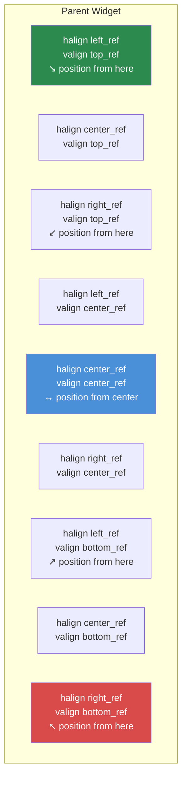

# Chapitre 3.3 : Dimensionnement et positionnement

[Accueil](../../README.md) | [<< Précédent : Format des fichiers layout](02-layout-files.md) | **Dimensionnement et positionnement** | [Suivant : Widgets conteneurs >>](04-containers.md)

---

Le système de layout de DayZ utilise un **mode de coordonnées double** -- chaque dimension peut être soit proportionnelle (relative au parent) soit en pixels (pixels absolus de l'écran). Une mauvaise compréhension de ce système est la cause numéro un des bugs de layout. Ce chapitre l'explique en détail.

---

## Le concept fondamental : proportionnel vs pixel

Chaque widget possède une position (`x, y`) et une taille (`width, height`). Chacune de ces quatre valeurs peut indépendamment être soit :

- **Proportionnelle** (0.0 à 1.0) -- relative aux dimensions du widget parent
- **En pixels** (tout nombre positif) -- pixels absolus de l'écran

Le mode de chaque axe est contrôlé par quatre drapeaux :

| Drapeau | Contrôle | `0` = Proportionnel | `1` = Pixel |
|---|---|---|---|
| `hexactpos` | Position X | Fraction de la largeur du parent | Pixels depuis la gauche |
| `vexactpos` | Position Y | Fraction de la hauteur du parent | Pixels depuis le haut |
| `hexactsize` | Largeur | Fraction de la largeur du parent | Largeur en pixels |
| `vexactsize` | Hauteur | Fraction de la hauteur du parent | Hauteur en pixels |

Cela signifie que vous pouvez mélanger les modes librement. Par exemple, un widget peut avoir une largeur proportionnelle mais une hauteur en pixels -- un patron très courant pour les lignes et les barres.

---

## Comprendre le mode proportionnel

Lorsqu'un drapeau est à `0` (proportionnel), la valeur représente une **fraction de la dimension du parent** :

- `size 1 1` avec `hexactsize 0` et `vexactsize 0` signifie « 100% de la largeur du parent, 100% de la hauteur du parent » -- l'enfant remplit le parent.
- `size 0.5 0.3` signifie « 50% de la largeur du parent, 30% de la hauteur du parent. »
- `position 0.5 0` avec `hexactpos 0` signifie « commencer à 50% de la largeur du parent depuis la gauche. »

Le mode proportionnel est indépendant de la résolution. Le widget se redimensionne automatiquement lorsque le parent change de taille ou lorsque le jeu tourne à une résolution différente.

```
// Un widget qui remplit la moitié gauche de son parent
FrameWidgetClass LeftHalf {
 position 0 0
 size 0.5 1
 hexactpos 0
 vexactpos 0
 hexactsize 0
 vexactsize 0
}
```

---

## Comprendre le mode pixel

Lorsqu'un drapeau est à `1` (pixel/exact), la valeur est en **pixels écran** :

- `size 200 40` avec `hexactsize 1` et `vexactsize 1` signifie « 200 pixels de large, 40 pixels de haut. »
- `position 10 10` avec `hexactpos 1` et `vexactpos 1` signifie « 10 pixels depuis le bord gauche du parent, 10 pixels depuis le bord supérieur du parent. »

Le mode pixel vous donne un contrôle exact mais ne se redimensionne PAS automatiquement avec la résolution.

```
// Un bouton de taille fixe : 120x30 pixels
ButtonWidgetClass MyButton {
 position 10 10
 size 120 30
 hexactpos 1
 vexactpos 1
 hexactsize 1
 vexactsize 1
 text "Click Me"
}
```

---

## Mélanger les modes : le patron le plus courant

La vraie puissance vient du mélange des modes proportionnel et pixel. Le patron le plus courant dans les mods DayZ professionnels est :

**Largeur proportionnelle, hauteur en pixels** -- pour les barres, les lignes et les en-têtes.

```
// Ligne pleine largeur, exactement 30 pixels de haut
FrameWidgetClass Row {
 position 0 0
 size 1 30
 hexactpos 0
 vexactpos 0
 hexactsize 0        // Largeur : proportionnelle (100% du parent)
 vexactsize 1        // Hauteur : pixel (30px)
}
```

**Largeur et hauteur proportionnelles, position en pixels** -- pour les panneaux centrés décalés d'un montant fixe.

```
// Panneau 60% x 70%, décalé de 0px du centre
FrameWidgetClass Dialog {
 position 0 0
 size 0.6 0.7
 halign center_ref
 valign center_ref
 hexactpos 1         // Position : pixel (décalage de 0px du centre)
 vexactpos 1
 hexactsize 0        // Taille : proportionnelle (60% x 70%)
 vexactsize 0
}
```

---

## Références d'alignement : halign et valign

Les attributs `halign` et `valign` changent le **point de référence** pour le positionnement :

| Valeur | Effet |
|---|---|
| `left_ref` (défaut) | La position est mesurée depuis le bord gauche du parent |
| `center_ref` | La position est mesurée depuis le centre du parent |
| `right_ref` | La position est mesurée depuis le bord droit du parent |
| `top_ref` (défaut) | La position est mesurée depuis le bord supérieur du parent |
| `center_ref` | La position est mesurée depuis le centre du parent |
| `bottom_ref` | La position est mesurée depuis le bord inférieur du parent |

### Points de référence d'alignement



Combinées avec une position en pixels (`hexactpos 1`), les références d'alignement rendent le centrage trivial :

```
// Centré à l'écran sans décalage
FrameWidgetClass CenteredDialog {
 position 0 0
 size 0.4 0.5
 halign center_ref
 valign center_ref
 hexactpos 1
 vexactpos 1
 hexactsize 0
 vexactsize 0
}
```

Avec `center_ref`, une position de `0 0` signifie « centré dans le parent. » Une position de `10 0` signifie « 10 pixels à droite du centre. »

### Éléments alignés à droite

```
// Icône épinglée au bord droit, à 5px du bord
ImageWidgetClass StatusIcon {
 position 5 5
 size 24 24
 halign right_ref
 valign top_ref
 hexactpos 1
 vexactpos 1
 hexactsize 1
 vexactsize 1
}
```

### Éléments alignés en bas

```
// Barre d'état en bas de son parent
FrameWidgetClass StatusBar {
 position 0 0
 size 1 30
 halign left_ref
 valign bottom_ref
 hexactpos 1
 vexactpos 1
 hexactsize 0
 vexactsize 1
}
```

---

## CRITIQUE : pas de valeurs de taille négatives

**N'utilisez jamais de valeurs négatives pour la taille d'un widget dans les fichiers layout.** Les tailles négatives provoquent un comportement indéfini -- les widgets peuvent devenir invisibles, s'afficher incorrectement ou faire planter le système d'interface. Si vous avez besoin qu'un widget soit masqué, utilisez `visible 0` à la place.

C'est l'une des erreurs de layout les plus courantes. Si votre widget ne s'affiche pas, vérifiez que vous n'avez pas accidentellement défini une valeur de taille négative.

---

## Patrons de dimensionnement courants

### Superposition plein écran

```
FrameWidgetClass Overlay {
 position 0 0
 size 1 1
 hexactpos 0
 vexactpos 0
 hexactsize 0
 vexactsize 0
}
```

### Dialogue centré (60% x 70%)

```
FrameWidgetClass Dialog {
 position 0 0
 size 0.6 0.7
 halign center_ref
 valign center_ref
 hexactpos 1
 vexactpos 1
 hexactsize 0
 vexactsize 0
}
```

### Panneau latéral aligné à droite (25% de largeur)

```
FrameWidgetClass SidePanel {
 position 0 0
 size 0.25 1
 halign right_ref
 hexactpos 1
 vexactpos 0
 hexactsize 0
 vexactsize 0
}
```

### Barre supérieure (pleine largeur, hauteur fixe)

```
FrameWidgetClass TopBar {
 position 0 0
 size 1 40
 hexactpos 0
 vexactpos 0
 hexactsize 0
 vexactsize 1
}
```

### Badge en bas à droite

```
FrameWidgetClass Badge {
 position 10 10
 size 80 24
 halign right_ref
 valign bottom_ref
 hexactpos 1
 vexactpos 1
 hexactsize 1
 vexactsize 1
}
```

### Icône centrée de taille fixe

```
ImageWidgetClass Icon {
 position 0 0
 size 64 64
 halign center_ref
 valign center_ref
 hexactpos 1
 vexactpos 1
 hexactsize 1
 vexactsize 1
}
```

---

## Position et taille programmatiques

En code, vous pouvez lire et définir la position et la taille en utilisant à la fois les coordonnées proportionnelles et en pixels (écran) :

```c
// Coordonnées proportionnelles (plage 0-1)
float x, y, w, h;
widget.GetPos(x, y);           // Lire la position proportionnelle
widget.SetPos(0.5, 0.1);      // Définir la position proportionnelle
widget.GetSize(w, h);          // Lire la taille proportionnelle
widget.SetSize(0.3, 0.2);     // Définir la taille proportionnelle

// Coordonnées en pixels/écran
widget.GetScreenPos(x, y);     // Lire la position en pixels
widget.SetScreenPos(100, 50);  // Définir la position en pixels
widget.GetScreenSize(w, h);    // Lire la taille en pixels
widget.SetScreenSize(400, 300);// Définir la taille en pixels
```

Pour centrer un widget à l'écran programmatiquement :

```c
int screen_w, screen_h;
GetScreenSize(screen_w, screen_h);

float w, h;
widget.GetScreenSize(w, h);
widget.SetScreenPos((screen_w - w) / 2, (screen_h - h) / 2);
```

---

## L'attribut `scaled`

Lorsque `scaled 1` est défini, le widget respecte le paramètre de mise à l'échelle de l'interface de DayZ (Options > Vidéo > Taille du HUD). C'est important pour les éléments de HUD qui doivent s'adapter à la préférence de l'utilisateur.

Sans `scaled`, les widgets dimensionnés en pixels auront la même taille physique quel que soit le paramètre de mise à l'échelle de l'interface.

---

## L'attribut `fixaspect`

Utilisez `fixaspect` pour maintenir le rapport d'aspect d'un widget :

- `fixaspect fixwidth` -- La hauteur s'ajuste pour maintenir le rapport d'aspect en fonction de la largeur
- `fixaspect fixheight` -- La largeur s'ajuste pour maintenir le rapport d'aspect en fonction de la hauteur

Ceci est principalement utile pour `ImageWidget` afin d'empêcher la déformation de l'image.

---

## Ordre Z et priorité

L'attribut `priority` contrôle quels widgets s'affichent au-dessus lorsqu'ils se chevauchent. Les valeurs plus élevées s'affichent au-dessus des valeurs plus basses.

| Plage de priorité | Utilisation typique |
|----------------|-------------|
| 0-5 | Éléments d'arrière-plan, panneaux décoratifs |
| 10-50 | Éléments d'interface normaux, composants de HUD |
| 50-100 | Éléments de superposition, panneaux flottants |
| 100-200 | Notifications, infobulles |
| 998-999 | Dialogues modaux, superpositions bloquantes |

```
FrameWidget myBackground {
    priority 1
    // ...
}

FrameWidget myDialog {
    priority 999
    // ...
}
```

**Important :** La priorité n'affecte l'ordre de rendu qu'entre les éléments frères au sein du même parent. Les enfants imbriqués sont toujours dessinés au-dessus de leur parent, indépendamment des valeurs de priorité.

---

## Débogage des problèmes de dimensionnement

Lorsqu'un widget n'apparaît pas là où vous l'attendez :

1. **Vérifiez les drapeaux exact** -- `hexactsize` est-il défini à `0` alors que vous vouliez des pixels ? Une valeur de `200` en mode proportionnel signifie 200x la largeur du parent (bien au-delà de l'écran).
2. **Vérifiez les tailles négatives** -- Toute valeur négative dans `size` causera des problèmes.
3. **Vérifiez la taille du parent** -- Un enfant proportionnel d'un parent de taille zéro est de taille zéro.
4. **Vérifiez `visible`** -- Les widgets sont visibles par défaut, mais si un parent est masqué, tous les enfants le sont aussi.
5. **Vérifiez `priority`** -- Un widget avec une priorité plus basse peut être caché derrière un autre.
6. **Utilisez `clipchildren`** -- Si un parent a `clipchildren 1`, les enfants en dehors de ses limites ne sont pas visibles.

---

## Bonnes pratiques

- Spécifiez toujours les quatre drapeaux exact explicitement (`hexactpos`, `vexactpos`, `hexactsize`, `vexactsize`). Les omettre conduit à un comportement imprévisible car les valeurs par défaut varient selon les types de widgets.
- Utilisez le patron largeur proportionnelle + hauteur en pixels pour les lignes et les barres. C'est la combinaison la plus sûre pour la résolution et le standard dans les mods professionnels.
- Centrez les dialogues avec `halign center_ref` + `valign center_ref` + position en pixels `0 0`, et non avec une position proportionnelle `0.5 0.5`. L'approche par référence d'alignement reste centrée quelle que soit la taille du widget.
- Évitez les tailles en pixels pour les éléments plein écran ou quasi plein écran. Utilisez le dimensionnement proportionnel pour que l'interface s'adapte à toute résolution (1080p, 1440p, 4K).
- Lorsque vous utilisez `SetScreenPos()` / `SetScreenSize()` en code, appelez-les après que le widget est attaché à son parent. Les appeler avant l'attachement peut produire des coordonnées incorrectes.

---

## Théorie vs pratique

> Ce que la documentation dit par rapport à ce qui se passe réellement à l'exécution.

| Concept | Théorie | Réalité |
|---------|--------|---------|
| Dimensionnement proportionnel | Les valeurs 0.0-1.0 se redimensionnent relativement au parent | Si le parent a une taille en pixels, les valeurs proportionnelles de l'enfant sont relatives à cette valeur en pixels, pas à l'écran -- un enfant d'un parent de 200px de large avec `size 0.5` fait 100px |
| Alignement `center_ref` | Le widget se centre dans son parent | Le coin supérieur gauche du widget est placé au point central -- le widget déborde à droite et en bas du centre à moins que la position soit `0 0` en mode pixel |
| Ordre Z avec `priority` | Les valeurs plus élevées s'affichent au-dessus | La priorité n'affecte que les éléments frères au sein du même parent. Un enfant s'affiche toujours au-dessus de son parent indépendamment des valeurs de priorité |
| Attribut `scaled` | Le widget respecte le paramètre de taille du HUD | N'affecte que les dimensions en mode pixel. Les dimensions proportionnelles se redimensionnent déjà avec le parent et ignorent le drapeau `scaled` |
| Valeurs de position négatives | Devraient décaler dans la direction inverse | Fonctionne pour la position (décalage à gauche/en haut depuis la référence), mais les valeurs de taille négatives provoquent un comportement de rendu indéfini -- ne les utilisez jamais |

---

## Compatibilité et impact

- **Multi-Mod :** Le dimensionnement et le positionnement sont par widget et ne peuvent pas entrer en conflit entre les mods. Cependant, les mods qui utilisent des superpositions plein écran (`size 1 1` sur la racine) avec `priority 999` peuvent bloquer les éléments d'interface des autres mods pour la réception des entrées.
- **Performance :** Le dimensionnement proportionnel nécessite un recalcul relatif au parent à chaque frame pour les widgets animés ou dynamiques. Pour les layouts statiques, il n'y a aucune différence mesurable entre les modes proportionnel et pixel.
- **Version :** Le système de coordonnées double (proportionnel vs pixel) est stable depuis DayZ 0.63 Experimental. Le comportement de l'attribut `scaled` a été affiné dans DayZ 1.14 pour mieux respecter le curseur de taille du HUD.

---

## Prochaines étapes

- [3.4 Widgets conteneurs](04-containers.md) -- Comment les spacers et les widgets de défilement gèrent automatiquement le layout
- [3.5 Création programmatique de widgets](05-programmatic-widgets.md) -- Définir la taille et la position depuis le code
