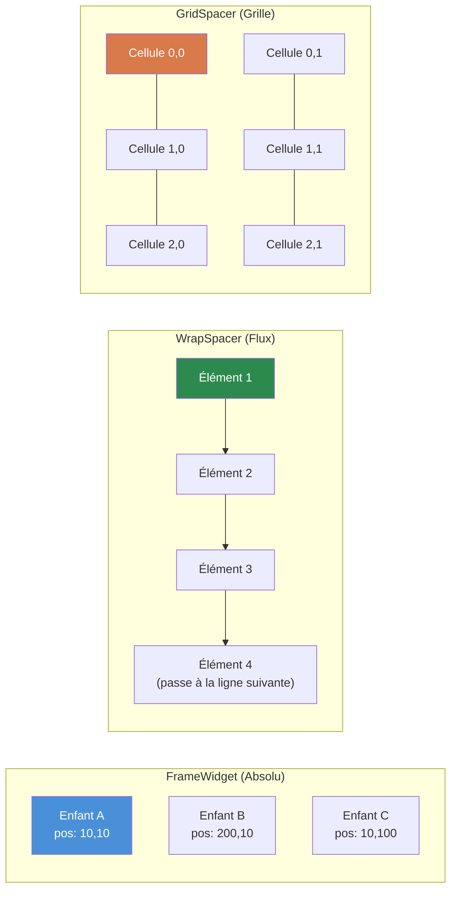
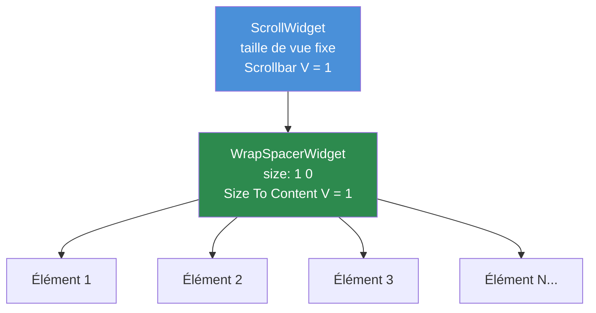

# Chapitre 3.4 : Widgets conteneurs

[Accueil](../../README.md) | [<< Précédent : Dimensionnement et positionnement](03-sizing-positioning.md) | **Widgets conteneurs** | [Suivant : Création programmatique de widgets >>](05-programmatic-widgets.md)

---

Les widgets conteneurs organisent les widgets enfants à l'intérieur d'eux. Tandis que `FrameWidget` est le plus simple (boîte invisible, positionnement manuel), DayZ fournit trois conteneurs spécialisés qui gèrent automatiquement le layout : `WrapSpacerWidget`, `GridSpacerWidget` et `ScrollWidget`.

### Comparaison des conteneurs



---

## FrameWidget -- Conteneur structurel

`FrameWidget` est le conteneur le plus basique. Il ne dessine rien à l'écran et n'arrange pas ses enfants -- vous devez positionner chaque enfant manuellement.

**Quand utiliser :**
- Regrouper des widgets associés pour pouvoir les afficher/masquer ensemble
- Widget racine d'un panneau ou d'un dialogue
- Tout regroupement structurel où vous gérez le positionnement vous-même

```
FrameWidgetClass MyPanel {
 size 0.5 0.5
 halign center_ref
 valign center_ref
 hexactpos 1
 vexactpos 1
 hexactsize 0
 vexactsize 0
 {
  TextWidgetClass Header {
   position 0 0
   size 1 0.1
   text "Panel Title"
   "text halign" center
  }
  PanelWidgetClass Divider {
   position 0 0.1
   size 1 2
   hexactsize 0
   vexactsize 1
   color 1 1 1 0.3
  }
  FrameWidgetClass Content {
   position 0 0.12
   size 1 0.88
  }
 }
}
```

**Caractéristiques principales :**
- Aucune apparence visuelle (transparent)
- Les enfants sont positionnés relativement aux limites du frame
- Pas de layout automatique -- chaque enfant a besoin d'une position/taille explicite
- Léger -- aucun coût de rendu au-delà de ses enfants

---

## WrapSpacerWidget -- Layout en flux

`WrapSpacerWidget` arrange automatiquement ses enfants dans une séquence de flux. Les enfants sont placés les uns après les autres horizontalement, passant à la ligne suivante lorsqu'ils dépassent la largeur disponible. C'est le widget à utiliser pour les listes dynamiques où le nombre d'enfants change à l'exécution.

### Attributs de layout

| Attribut | Valeurs | Description |
|---|---|---|
| `Padding` | entier (pixels) | Espace entre le bord du spacer et ses enfants |
| `Margin` | entier (pixels) | Espace entre les enfants individuels |
| `"Size To Content H"` | `0` ou `1` | Redimensionner la largeur pour contenir tous les enfants |
| `"Size To Content V"` | `0` ou `1` | Redimensionner la hauteur pour contenir tous les enfants |
| `content_halign` | `left`, `center`, `right` | Alignement horizontal du groupe d'enfants |
| `content_valign` | `top`, `center`, `bottom` | Alignement vertical du groupe d'enfants |

### Layout en flux basique

```
WrapSpacerWidgetClass TagList {
 size 1 0
 hexactsize 0
 "Size To Content V" 1
 Padding 5
 Margin 3
 {
  ButtonWidgetClass Tag1 {
   size 80 24
   hexactsize 1
   vexactsize 1
   text "Weapons"
  }
  ButtonWidgetClass Tag2 {
   size 60 24
   hexactsize 1
   vexactsize 1
   text "Food"
  }
  ButtonWidgetClass Tag3 {
   size 90 24
   hexactsize 1
   vexactsize 1
   text "Medical"
  }
 }
}
```

Dans cet exemple :
- Le spacer fait toute la largeur du parent (`size 1`), mais sa hauteur s'ajuste pour contenir les enfants (`"Size To Content V" 1`).
- Les enfants sont des boutons de 80px, 60px et 90px de large.
- Si la largeur disponible ne peut pas contenir les trois sur une seule ligne, le spacer les fait passer à la ligne suivante.
- `Padding 5` ajoute 5px d'espace à l'intérieur des bords du spacer.
- `Margin 3` ajoute 3px entre chaque enfant.

### Liste verticale avec WrapSpacer

Pour créer une liste verticale (un élément par ligne), rendez les enfants en pleine largeur :

```
WrapSpacerWidgetClass ItemList {
 size 1 0
 hexactsize 0
 "Size To Content V" 1
 Margin 2
 {
  FrameWidgetClass Item1 {
   size 1 30
   hexactsize 0
   vexactsize 1
  }
  FrameWidgetClass Item2 {
   size 1 30
   hexactsize 0
   vexactsize 1
  }
 }
}
```

Chaque enfant fait 100% de la largeur (`size 1` avec `hexactsize 0`), donc un seul tient par ligne, créant un empilement vertical.

### Enfants dynamiques

`WrapSpacerWidget` est idéal pour les enfants ajoutés programmatiquement. Lorsque vous ajoutez ou supprimez des enfants, appelez `Update()` sur le spacer pour déclencher un recalcul du layout :

```c
WrapSpacerWidget spacer;

// Ajouter un enfant depuis un fichier layout
Widget child = GetGame().GetWorkspace().CreateWidgets("MyMod/gui/layouts/ListItem.layout", spacer);

// Forcer le spacer à recalculer
spacer.Update();
```

---

## GridSpacerWidget -- Layout en grille

`GridSpacerWidget` arrange les enfants dans une grille uniforme. Vous définissez le nombre de colonnes et de lignes, et chaque cellule obtient un espace égal.

### Attributs de layout

| Attribut | Valeurs | Description |
|---|---|---|
| `Columns` | entier | Nombre de colonnes de la grille |
| `Rows` | entier | Nombre de lignes de la grille |
| `Margin` | entier (pixels) | Espace entre les cellules de la grille |
| `"Size To Content V"` | `0` ou `1` | Redimensionner la hauteur pour contenir le contenu |

### Grille basique

```
GridSpacerWidgetClass InventoryGrid {
 size 0.5 0.5
 hexactsize 0
 vexactsize 0
 Columns 4
 Rows 3
 Margin 2
 {
  // 12 cellules (4 colonnes x 3 lignes)
  // Les enfants sont placés dans l'ordre : de gauche à droite, de haut en bas
  FrameWidgetClass Slot1 { }
  FrameWidgetClass Slot2 { }
  FrameWidgetClass Slot3 { }
  FrameWidgetClass Slot4 { }
  FrameWidgetClass Slot5 { }
  FrameWidgetClass Slot6 { }
  FrameWidgetClass Slot7 { }
  FrameWidgetClass Slot8 { }
  FrameWidgetClass Slot9 { }
  FrameWidgetClass Slot10 { }
  FrameWidgetClass Slot11 { }
  FrameWidgetClass Slot12 { }
 }
}
```

### Grille à une seule colonne (liste verticale)

Définir `Columns 1` crée un simple empilement vertical où chaque enfant obtient toute la largeur :

```
GridSpacerWidgetClass SettingsList {
 size 1 0
 hexactsize 0
 "Size To Content V" 1
 Columns 1
 {
  FrameWidgetClass Setting1 {
   size 150 30
   hexactsize 1
   vexactsize 1
  }
  FrameWidgetClass Setting2 {
   size 150 30
   hexactsize 1
   vexactsize 1
  }
  FrameWidgetClass Setting3 {
   size 150 30
   hexactsize 1
   vexactsize 1
  }
 }
}
```

### GridSpacer vs WrapSpacer

| Fonctionnalité | GridSpacer | WrapSpacer |
|---|---|---|
| Taille des cellules | Uniforme (égale) | Chaque enfant conserve sa propre taille |
| Mode de layout | Grille fixe (colonnes x lignes) | Flux avec retour à la ligne |
| Idéal pour | Emplacements d'inventaire, galeries uniformes | Listes dynamiques, nuages de tags |
| Dimensionnement des enfants | Ignoré (la grille le contrôle) | Respecté (la taille de l'enfant compte) |

---

## ScrollWidget -- Zone de défilement

`ScrollWidget` enveloppe du contenu qui peut être plus grand (ou plus large) que la zone visible, en fournissant des barres de défilement pour la navigation.

### Attributs de layout

| Attribut | Valeurs | Description |
|---|---|---|
| `"Scrollbar V"` | `0` ou `1` | Afficher la barre de défilement verticale |
| `"Scrollbar H"` | `0` ou `1` | Afficher la barre de défilement horizontale |

### API script

```c
ScrollWidget sw;
sw.VScrollToPos(float pos);     // Défiler vers une position verticale (0 = haut)
sw.GetVScrollPos();             // Obtenir la position actuelle du défilement
sw.GetContentHeight();          // Obtenir la hauteur totale du contenu
sw.VScrollStep(int step);       // Défiler d'un montant défini
```

### Liste déroulante basique

```
ScrollWidgetClass ListScroll {
 size 1 300
 hexactsize 0
 vexactsize 1
 "Scrollbar V" 1
 {
  WrapSpacerWidgetClass ListContent {
   size 1 0
   hexactsize 0
   "Size To Content V" 1
   {
    // Beaucoup d'enfants ici...
    FrameWidgetClass Item1 {
     size 1 30
     hexactsize 0
     vexactsize 1
    }
    FrameWidgetClass Item2 {
     size 1 30
     hexactsize 0
     vexactsize 1
    }
    // ... plus d'éléments
   }
  }
 }
}
```

---

## Le patron ScrollWidget + WrapSpacer

### Patron ScrollWidget + WrapSpacer



C'est **le** patron pour les listes dynamiques défilables dans les mods DayZ. Il combine un `ScrollWidget` de hauteur fixe avec un `WrapSpacerWidget` qui grandit pour contenir ses enfants.

```
// Zone de défilement à hauteur fixe
ScrollWidgetClass DialogScroll {
 size 0.97 235
 hexactsize 0
 vexactsize 1
 "Scrollbar V" 1
 {
  // Le contenu grandit verticalement pour contenir tous les enfants
  WrapSpacerWidgetClass DialogContent {
   size 1 0
   hexactsize 0
   "Size To Content V" 1
  }
 }
}
```

Comment ça fonctionne :

1. Le `ScrollWidget` a une hauteur **fixe** (235 pixels dans cet exemple).
2. À l'intérieur, le `WrapSpacerWidget` a `"Size To Content V" 1`, donc sa hauteur grandit à mesure que des enfants sont ajoutés.
3. Lorsque le contenu du spacer dépasse 235 pixels, la barre de défilement apparaît et l'utilisateur peut défiler.

Ce patron est présent dans DabsFramework, DayZ Editor, Expansion et pratiquement tous les mods DayZ professionnels.

### Ajouter des éléments programmatiquement

```c
ScrollWidget m_Scroll;
WrapSpacerWidget m_Content;

void AddItem(string text)
{
    // Créer un nouvel enfant à l'intérieur du WrapSpacer
    Widget item = GetGame().GetWorkspace().CreateWidgets(
        "MyMod/gui/layouts/ListItem.layout", m_Content);

    // Configurer le nouvel élément
    TextWidget tw = TextWidget.Cast(item.FindAnyWidget("Label"));
    tw.SetText(text);

    // Forcer le recalcul du layout
    m_Content.Update();
}

void ScrollToBottom()
{
    m_Scroll.VScrollToPos(m_Scroll.GetContentHeight());
}

void ClearAll()
{
    // Supprimer tous les enfants
    Widget child = m_Content.GetChildren();
    while (child)
    {
        Widget next = child.GetSibling();
        child.Unlink();
        child = next;
    }
    m_Content.Update();
}
```

---

## Règles d'imbrication

Les conteneurs peuvent être imbriqués pour créer des layouts complexes. Quelques directives :

1. **FrameWidget dans n'importe quoi** -- Fonctionne toujours. Utilisez des frames pour regrouper des sous-sections dans des spacers ou des grilles.

2. **WrapSpacer dans ScrollWidget** -- Le patron standard pour les listes défilables. Le spacer grandit ; le scroll découpe.

3. **GridSpacer dans WrapSpacer** -- Fonctionne. Utile pour placer une grille fixe comme un élément dans un layout en flux.

4. **ScrollWidget dans WrapSpacer** -- Possible mais nécessite une hauteur fixe sur le widget de défilement (`vexactsize 1`). Sans hauteur fixe, le widget de défilement essaiera de grandir pour contenir son contenu (annulant l'intérêt du défilement).

5. **Évitez l'imbrication profonde** -- Chaque niveau d'imbrication ajoute un coût de calcul de layout. Trois ou quatre niveaux de profondeur sont typiques pour les interfaces complexes ; au-delà de six niveaux, le layout devrait être restructuré.

---

## Quand utiliser chaque conteneur

| Scénario | Meilleur conteneur |
|---|---|
| Panneau statique avec des éléments positionnés manuellement | `FrameWidget` |
| Liste dynamique d'éléments de tailles variables | `WrapSpacerWidget` |
| Grille uniforme (inventaire, galerie) | `GridSpacerWidget` |
| Liste verticale avec un élément par ligne | `WrapSpacerWidget` (enfants en pleine largeur) ou `GridSpacerWidget` (`Columns 1`) |
| Contenu plus grand que l'espace disponible | `ScrollWidget` enveloppant un spacer |
| Zone de contenu d'onglet | `FrameWidget` (alterner la visibilité des enfants) |
| Boutons de barre d'outils | `WrapSpacerWidget` ou `GridSpacerWidget` |

---

## Exemple complet : panneau de paramètres défilable

Un panneau de paramètres avec une barre de titre, une zone de contenu défilable contenant des options arrangées en grille, et une barre de boutons en bas :

```
FrameWidgetClass SettingsPanel {
 size 0.4 0.6
 halign center_ref
 valign center_ref
 hexactpos 1
 vexactpos 1
 hexactsize 0
 vexactsize 0
 {
  // Barre de titre
  PanelWidgetClass TitleBar {
   position 0 0
   size 1 30
   hexactsize 0
   vexactsize 1
   color 0.2 0.4 0.8 1
  }

  // Zone de paramètres défilable
  ScrollWidgetClass SettingsScroll {
   position 0 30
   size 1 0
   hexactpos 0
   vexactpos 1
   hexactsize 0
   vexactsize 0
   "Scrollbar V" 1
   {
    GridSpacerWidgetClass SettingsGrid {
     size 1 0
     hexactsize 0
     "Size To Content V" 1
     Columns 1
     Margin 2
    }
   }
  }

  // Barre de boutons en bas
  FrameWidgetClass ButtonBar {
   size 1 40
   halign left_ref
   valign bottom_ref
   hexactpos 0
   vexactpos 1
   hexactsize 0
   vexactsize 1
  }
 }
}
```

---

## Bonnes pratiques

- Appelez toujours `Update()` sur un `WrapSpacerWidget` ou un `GridSpacerWidget` après avoir ajouté ou supprimé des enfants programmatiquement. Sans cet appel, le spacer ne recalcule pas son layout et les enfants peuvent se chevaucher ou être invisibles.
- Utilisez `ScrollWidget` + `WrapSpacerWidget` comme patron standard pour toute liste dynamique. Définissez le scroll à une hauteur fixe en pixels et le spacer intérieur à `"Size To Content V" 1`.
- Préférez `WrapSpacerWidget` avec des enfants en pleine largeur à `GridSpacerWidget Columns 1` pour les listes verticales où les éléments ont des hauteurs variables. GridSpacer force des tailles de cellules uniformes.
- Définissez toujours `clipchildren 1` sur le `ScrollWidget`. Sans cela, le contenu débordant s'affiche en dehors des limites de la zone de défilement.
- Évitez d'imbriquer plus de 4-5 niveaux de conteneurs en profondeur. Chaque niveau ajoute un coût de calcul de layout et rend le débogage considérablement plus difficile.

---

## Théorie vs pratique

> Ce que la documentation dit par rapport à ce qui se passe réellement à l'exécution.

| Concept | Théorie | Réalité |
|---------|--------|---------|
| `WrapSpacerWidget.Update()` | Le layout se recalcule automatiquement quand les enfants changent | Vous devez appeler `Update()` manuellement après `CreateWidgets()` ou `Unlink()`. Oublier ceci est le bug de spacer le plus courant |
| `"Size To Content V"` | Le spacer grandit pour contenir les enfants | Ne fonctionne que si les enfants ont des tailles explicites (hauteur en pixels ou parent proportionnel connu). Si les enfants utilisent aussi `Size To Content`, vous obtenez une hauteur de zéro |
| Dimensionnement des cellules de `GridSpacerWidget` | La grille contrôle la taille des cellules uniformément | Les attributs de taille propres aux enfants sont ignorés -- la grille les remplace. Définir `size` sur un enfant de grille n'a aucun effet |
| Position de défilement de `ScrollWidget` | `VScrollToPos(0)` défile vers le haut | Après l'ajout d'enfants, vous devrez peut-être différer `VScrollToPos()` d'une frame (via `CallLater`) car la hauteur du contenu n'a pas encore été recalculée |
| Spacers imbriqués | Les spacers peuvent s'imbriquer librement | Un `WrapSpacer` dans un `WrapSpacer` fonctionne, mais `Size To Content` aux deux niveaux peut provoquer des boucles de layout infinies qui gèlent l'interface |

---

## Compatibilité et impact

- **Multi-Mod :** Les widgets conteneurs sont par layout et n'entrent pas en conflit entre les mods. Cependant, si deux mods injectent des enfants dans le même `ScrollWidget` vanilla (via `modded class`), l'ordre des enfants est imprévisible.
- **Performance :** `WrapSpacerWidget.Update()` recalcule les positions de tous les enfants. Pour les listes de 100+ éléments, appelez `Update()` une fois après les opérations par lot, pas après chaque ajout individuel. GridSpacer est plus rapide pour les grilles uniformes car les positions des cellules sont calculées arithmétiquement.
- **Version :** `WrapSpacerWidget` et `GridSpacerWidget` sont disponibles depuis DayZ 1.0. Les attributs `"Size To Content H/V"` étaient présents depuis le début mais leur comportement avec les layouts profondément imbriqués a été stabilisé autour de DayZ 1.10.

---

## Observé dans les mods réels

| Patron | Mod | Détail |
|---------|-----|--------|
| `ScrollWidget` + `WrapSpacerWidget` pour les listes dynamiques | DabsFramework, Expansion, COT | Zone de défilement à hauteur fixe avec spacer intérieur à croissance automatique -- le patron universel de liste défilable |
| `GridSpacerWidget Columns 10` pour l'inventaire | DayZ vanilla | La grille d'inventaire utilise GridSpacer avec un nombre de colonnes fixe correspondant à la disposition des emplacements |
| Enfants regroupés dans WrapSpacer | VPP Admin Tools | Pré-crée un pool de widgets d'éléments de liste, les affiche/masque au lieu de les créer/détruire pour éviter le surcoût de `Update()` |
| `WrapSpacerWidget` comme racine de dialogue | COT, DayZ Editor | La racine du dialogue utilise `Size To Content V/H` pour que le dialogue s'adapte automatiquement à son contenu sans dimensions codées en dur |

---

## Prochaines étapes

- [3.5 Création programmatique de widgets](05-programmatic-widgets.md) -- Créer des widgets depuis le code
- [3.6 Gestion des événements](06-event-handling.md) -- Répondre aux clics, changements et autres événements
