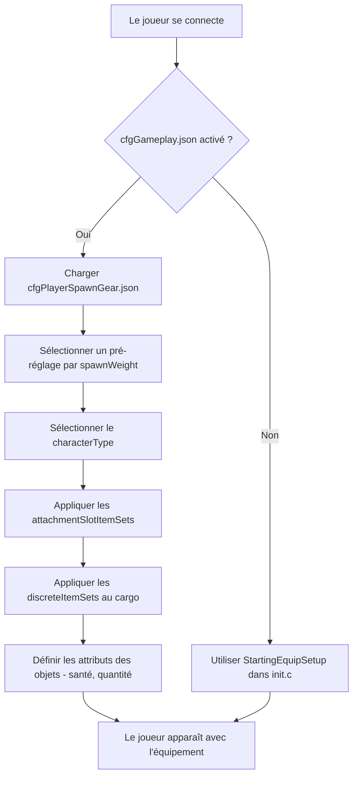

# Chapitre 5.6 : Configuration de l'équipement d'apparition

[Accueil](../../README.md) | [<< Précédent : Fichiers de configuration serveur](05-server-configs.md) | **Configuration de l'équipement d'apparition**

---

> **Résumé :** DayZ dispose de deux systèmes complémentaires qui contrôlent comment les joueurs entrent dans le monde : les **points d'apparition** déterminent *où* un personnage apparaît sur la carte, et l'**équipement d'apparition** détermine *quel équipement* il porte. Ce chapitre couvre les deux systèmes en profondeur, incluant la structure des fichiers, la référence des champs, les pré-réglages pratiques et l'intégration avec les mods.

---

## Table des matières

- [Vue d'ensemble](#vue-densemble)
- [Les deux systèmes](#les-deux-systèmes)
- [Équipement d'apparition : cfgPlayerSpawnGear.json](#équipement-dapparition--cfgplayerspawngearjson)
  - [Activer les pré-réglages d'équipement](#activer-les-pré-réglages-déquipement)
  - [Structure d'un pré-réglage](#structure-dun-pré-réglage)
  - [attachmentSlotItemSets](#attachmentslotitemsets)
  - [DiscreteItemSets](#discreteitemsets)
  - [discreteUnsortedItemSets](#discreteunsorteditemsets)
  - [ComplexChildrenTypes](#complexchildrentypes)
  - [SimpleChildrenTypes](#simplechildrentypes)
  - [Attributes](#attributes)
- [Points d'apparition : cfgplayerspawnpoints.xml](#points-dapparition--cfgplayerspawnpointsxml)
  - [Structure du fichier](#structure-du-fichier)
  - [spawn_params](#spawn_params)
  - [generator_params](#generator_params)
  - [Groupes d'apparition](#groupes-dapparition)
  - [Configs spécifiques aux cartes](#configs-spécifiques-aux-cartes)
- [Exemples pratiques](#exemples-pratiques)
  - [Équipement par défaut du survivant](#équipement-par-défaut-du-survivant)
  - [Kit d'apparition militaire](#kit-dapparition-militaire)
  - [Kit d'apparition médical](#kit-dapparition-médical)
  - [Sélection aléatoire d'équipement](#sélection-aléatoire-déquipement)
- [Intégration avec les mods](#intégration-avec-les-mods)
- [Bonnes pratiques](#bonnes-pratiques)
- [Erreurs courantes](#erreurs-courantes)

---

## Vue d'ensemble



Quand un joueur apparaît en tant que nouveau personnage dans DayZ, deux questions reçoivent une réponse du serveur :

1. **Où le personnage apparaît-il ?** --- Contrôlé par `cfgplayerspawnpoints.xml`.
2. **Que porte le personnage ?** --- Contrôlé par les fichiers JSON de pré-réglages d'équipement, enregistrés via `cfggameplay.json`.

Les deux systèmes sont uniquement côté serveur. Les clients ne voient jamais ces fichiers de configuration et ne peuvent pas les altérer. Le système d'équipement d'apparition a été introduit comme alternative au scriptage des chargements dans `init.c`, permettant aux administrateurs serveur de définir plusieurs pré-réglages pondérés en JSON sans écrire de code Enforce Script.

> **Important :** Le système de pré-réglages d'équipement **surcharge complètement** la méthode `StartingEquipSetup()` dans le `init.c` de votre mission. Si vous activez les pré-réglages d'équipement dans `cfggameplay.json`, votre code de chargement scripté sera ignoré. De même, les types de personnages définis dans les pré-réglages surchargent le modèle de personnage choisi dans le menu principal.

---

## Les deux systèmes

| Système | Fichier | Format | Contrôle |
|---------|--------|--------|----------|
| Points d'apparition | `cfgplayerspawnpoints.xml` | XML | **Où** --- positions sur la carte, scoring de distance, groupes d'apparition |
| Équipement d'apparition | Fichiers JSON de pré-réglages | JSON | **Quoi** --- modèle de personnage, vêtements, armes, cargo, barre rapide |

Les deux systèmes sont indépendants. Vous pouvez utiliser des points d'apparition personnalisés avec l'équipement vanilla, un équipement personnalisé avec les points d'apparition vanilla, ou personnaliser les deux.

---

## Équipement d'apparition : cfgPlayerSpawnGear.json

### Activer les pré-réglages d'équipement

Les pré-réglages d'équipement ne sont **pas** activés par défaut. Pour les utiliser, vous devez :

1. Créer un ou plusieurs fichiers JSON de pré-réglages dans votre dossier de mission (ex. `mpmissions/dayzOffline.chernarusplus/`).
2. Les enregistrer dans `cfggameplay.json` sous `PlayerData.spawnGearPresetFiles`.
3. S'assurer que `enableCfgGameplayFile = 1` est défini dans `serverDZ.cfg`.

```json
{
  "version": 122,
  "PlayerData": {
    "spawnGearPresetFiles": [
      "survivalist.json",
      "casual.json",
      "military.json"
    ]
  }
}
```

Les fichiers de pré-réglages peuvent être imbriqués dans des sous-répertoires du dossier de mission :

```json
"spawnGearPresetFiles": [
  "custom/survivalist.json",
  "custom/casual.json",
  "custom/military.json"
]
```

Chaque fichier JSON contient un seul objet de pré-réglage. Tous les pré-réglages enregistrés sont regroupés, et le serveur en sélectionne un basé sur `spawnWeight` chaque fois qu'un nouveau personnage apparaît.

### Structure d'un pré-réglage

Un pré-réglage est l'objet JSON de niveau supérieur avec ces champs :

| Champ | Type | Description |
|-------|------|-------------|
| `name` | string | Nom lisible du pré-réglage (toute chaîne, utilisé uniquement pour l'identification) |
| `spawnWeight` | integer | Poids pour la sélection aléatoire. Minimum `1`. Des valeurs plus élevées rendent ce pré-réglage plus susceptible d'être choisi |
| `characterTypes` | array | Tableau de noms de classes de types de personnages (ex. `"SurvivorM_Mirek"`). Un est choisi au hasard quand ce pré-réglage est sélectionné |
| `attachmentSlotItemSets` | array | Tableau de structures `AttachmentSlots` définissant ce que le personnage porte (vêtements, armes sur les épaules, etc.) |
| `discreteUnsortedItemSets` | array | Tableau de structures `DiscreteUnsortedItemSets` définissant les objets de cargo placés dans n'importe quel espace d'inventaire disponible |

> **Note :** Si `characterTypes` est vide ou omis, le modèle de personnage sélectionné en dernier dans l'écran de création de personnage du menu principal sera utilisé pour ce pré-réglage.

Exemple minimal :

```json
{
  "spawnWeight": 1,
  "name": "Basic Survivor",
  "characterTypes": [
    "SurvivorM_Mirek",
    "SurvivorF_Eva"
  ],
  "attachmentSlotItemSets": [],
  "discreteUnsortedItemSets": []
}
```

### attachmentSlotItemSets

Ce tableau définit les objets qui vont dans des slots d'attachement de personnage spécifiques --- corps, jambes, pieds, tête, dos, gilet, épaules, lunettes, etc.

Chaque entrée cible un slot :

| Champ | Type | Description |
|-------|------|-------------|
| `slotName` | string | Le nom du slot d'attachement. Dérivé de CfgSlots. Valeurs courantes : `"Body"`, `"Legs"`, `"Feet"`, `"Head"`, `"Back"`, `"Vest"`, `"Eyewear"`, `"Gloves"`, `"Hips"`, `"shoulderL"`, `"shoulderR"` |
| `discreteItemSets` | array | Tableau de variantes d'objets pouvant remplir ce slot (un est choisi basé sur `spawnWeight`) |

> **Raccourcis d'épaules :** Vous pouvez utiliser `"shoulderL"` et `"shoulderR"` comme noms de slots. Le moteur les traduit automatiquement en noms internes CfgSlots corrects.

```json
{
  "slotName": "Body",
  "discreteItemSets": [
    {
      "itemType": "TShirt_Beige",
      "spawnWeight": 1,
      "attributes": {
        "healthMin": 0.45,
        "healthMax": 0.65,
        "quantityMin": 1.0,
        "quantityMax": 1.0
      },
      "quickBarSlot": -1
    },
    {
      "itemType": "TShirt_Black",
      "spawnWeight": 1,
      "attributes": {
        "healthMin": 0.45,
        "healthMax": 0.65,
        "quantityMin": 1.0,
        "quantityMax": 1.0
      },
      "quickBarSlot": -1
    }
  ]
}
```

### DiscreteItemSets

Chaque entrée dans `discreteItemSets` représente un objet possible pour ce slot. Le serveur choisit une entrée au hasard, pondérée par `spawnWeight`. Cette structure est utilisée à l'intérieur des `attachmentSlotItemSets` (pour les objets basés sur les slots) et est le mécanisme de sélection aléatoire.

| Champ | Type | Description |
|-------|------|-------------|
| `itemType` | string | Nom de classe de l'objet (typename). Utilisez `""` (chaîne vide) pour représenter « rien » --- le slot reste vide |
| `spawnWeight` | integer | Poids pour la sélection. Minimum `1`. Plus élevé = plus probable |
| `attributes` | object | Plages de santé et de quantité pour cet objet. Voir [Attributes](#attributes) |
| `quickBarSlot` | integer | Attribution de slot de barre rapide (base 0). Utilisez `-1` pour pas d'attribution |
| `complexChildrenTypes` | array | Objets à faire apparaître imbriqués dans cet objet. Voir [ComplexChildrenTypes](#complexchildrentypes) |
| `simpleChildrenTypes` | array | Noms de classes d'objets à faire apparaître dans cet objet en utilisant les attributs par défaut ou du parent |
| `simpleChildrenUseDefaultAttributes` | bool | Si `true`, les enfants simples utilisent les `attributes` du parent. Si `false`, ils utilisent les valeurs par défaut de la configuration |

**Astuce de l'objet vide :** Pour donner à un slot une chance 50/50 d'être vide ou rempli, utilisez un `itemType` vide :

```json
{
  "slotName": "Eyewear",
  "discreteItemSets": [
    {
      "itemType": "AviatorGlasses",
      "spawnWeight": 1,
      "attributes": {
        "healthMin": 1.0,
        "healthMax": 1.0
      },
      "quickBarSlot": -1
    },
    {
      "itemType": "",
      "spawnWeight": 1
    }
  ]
}
```

### discreteUnsortedItemSets

Ce tableau de niveau supérieur définit les objets qui vont dans le **cargo** du personnage --- tout espace d'inventaire disponible à travers tous les vêtements et conteneurs attachés. Contrairement aux `attachmentSlotItemSets`, ces objets ne sont pas placés dans un slot spécifique ; le moteur trouve de la place automatiquement.

Chaque entrée représente une variante de cargo, et le serveur en sélectionne une basée sur `spawnWeight`.

| Champ | Type | Description |
|-------|------|-------------|
| `name` | string | Nom lisible (pour identification uniquement) |
| `spawnWeight` | integer | Poids pour la sélection. Minimum `1` |
| `attributes` | object | Plages de santé/quantité par défaut. Utilisées par les enfants quand `simpleChildrenUseDefaultAttributes` est `true` |
| `complexChildrenTypes` | array | Objets à faire apparaître dans le cargo, chacun avec ses propres attributs et imbrication |
| `simpleChildrenTypes` | array | Noms de classes d'objets à faire apparaître dans le cargo |
| `simpleChildrenUseDefaultAttributes` | bool | Si `true`, les enfants simples utilisent les `attributes` de cette structure. Si `false`, ils utilisent les valeurs par défaut de la configuration |

### ComplexChildrenTypes

Les enfants complexes sont des objets apparus **à l'intérieur** d'un objet parent avec un contrôle total sur leurs attributs, leur attribution de barre rapide et leurs propres enfants imbriqués. Le cas d'utilisation principal est de faire apparaître des objets avec du contenu --- par exemple, une arme avec des accessoires, ou une marmite avec de la nourriture à l'intérieur.

| Champ | Type | Description |
|-------|------|-------------|
| `itemType` | string | Nom de classe de l'objet |
| `attributes` | object | Plages de santé/quantité pour cet objet spécifique |
| `quickBarSlot` | integer | Attribution de slot de barre rapide. `-1` = ne pas assigner |
| `simpleChildrenUseDefaultAttributes` | bool | Si les enfants simples héritent de ces attributs |
| `simpleChildrenTypes` | array | Noms de classes d'objets à faire apparaître dans cet objet |

Exemple --- une arme avec accessoires et chargeur :

```json
{
  "itemType": "AKM",
  "attributes": {
    "healthMin": 0.5,
    "healthMax": 1.0,
    "quantityMin": 1.0,
    "quantityMax": 1.0
  },
  "quickBarSlot": 1,
  "complexChildrenTypes": [
    {
      "itemType": "AK_PlasticBttstck",
      "attributes": {
        "healthMin": 0.4,
        "healthMax": 0.6
      },
      "quickBarSlot": -1
    },
    {
      "itemType": "PSO1Optic",
      "attributes": {
        "healthMin": 0.1,
        "healthMax": 0.2
      },
      "quickBarSlot": -1,
      "simpleChildrenUseDefaultAttributes": true,
      "simpleChildrenTypes": [
        "Battery9V"
      ]
    },
    {
      "itemType": "Mag_AKM_30Rnd",
      "attributes": {
        "healthMin": 0.5,
        "healthMax": 0.5,
        "quantityMin": 1.0,
        "quantityMax": 1.0
      },
      "quickBarSlot": -1
    }
  ],
  "simpleChildrenUseDefaultAttributes": false,
  "simpleChildrenTypes": [
    "AK_PlasticHndgrd",
    "AK_Bayonet"
  ]
}
```

Dans cet exemple, l'AKM apparaît avec une crosse, une lunette (avec une pile à l'intérieur) et un chargeur plein comme enfants complexes, plus un garde-main et une baïonnette comme enfants simples. Les enfants simples utilisent les valeurs par défaut de la configuration car `simpleChildrenUseDefaultAttributes` est `false`.

### SimpleChildrenTypes

Les enfants simples sont un raccourci pour faire apparaître des objets à l'intérieur d'un parent sans spécifier d'attributs individuels. C'est un tableau de noms de classes d'objets (chaînes).

Leurs attributs sont déterminés par le drapeau `simpleChildrenUseDefaultAttributes` :

- **`true`** --- Les objets utilisent les `attributes` définis sur la structure parent.
- **`false`** --- Les objets utilisent les valeurs par défaut de la configuration du moteur (typiquement santé et quantité complètes).

Les enfants simples ne peuvent pas avoir leurs propres enfants imbriqués ou attributions de barre rapide. Pour ces capacités, utilisez `complexChildrenTypes` à la place.

### Attributes

Les attributs contrôlent l'état et la quantité des objets apparus. Toutes les valeurs sont des flottants entre `0.0` et `1.0` :

| Champ | Type | Description |
|-------|------|-------------|
| `healthMin` | float | Pourcentage minimum de santé. `1.0` = impeccable, `0.0` = ruiné |
| `healthMax` | float | Pourcentage maximum de santé. Une valeur aléatoire entre min et max est appliquée |
| `quantityMin` | float | Pourcentage minimum de quantité. Pour les chargeurs : niveau de remplissage. Pour la nourriture : bouchées restantes |
| `quantityMax` | float | Pourcentage maximum de quantité |

Quand min et max sont tous deux spécifiés, le moteur choisit une valeur aléatoire dans cette plage. Cela crée une variation naturelle --- par exemple, une santé entre `0.45` et `0.65` signifie que les objets apparaissent en état usé à endommagé.

```json
"attributes": {
  "healthMin": 0.45,
  "healthMax": 0.65,
  "quantityMin": 1.0,
  "quantityMax": 1.0
}
```

---

## Points d'apparition : cfgplayerspawnpoints.xml

Ce fichier XML définit où les joueurs apparaissent sur la carte. Il est situé dans le dossier de mission (ex. `mpmissions/dayzOffline.chernarusplus/cfgplayerspawnpoints.xml`).

### Structure du fichier

L'élément racine contient jusqu'à trois sections :

| Section | Objectif |
|---------|----------|
| `<fresh>` | **Requis.** Points d'apparition pour les personnages nouvellement créés |
| `<hop>` | Points d'apparition pour les joueurs changeant de serveur sur la même carte (serveurs officiels uniquement) |
| `<travel>` | Points d'apparition pour les joueurs voyageant depuis une autre carte (serveurs officiels uniquement) |

Chaque section contient les mêmes trois sous-éléments : `<spawn_params>`, `<generator_params>` et `<generator_posbubbles>`.

```xml
<?xml version="1.0" encoding="UTF-8" standalone="yes" ?>
<playerspawnpoints>
    <fresh>
        <spawn_params>...</spawn_params>
        <generator_params>...</generator_params>
        <generator_posbubbles>...</generator_posbubbles>
    </fresh>
</playerspawnpoints>
```

### spawn_params

Paramètres d'exécution qui évaluent les points d'apparition candidats par rapport aux entités proches. Les points en dessous de `min_dist` sont invalidés. Les points entre `min_dist` et `max_dist` sont préférés par rapport aux points au-delà de `max_dist`.

```xml
<spawn_params>
    <min_dist_infected>30</min_dist_infected>
    <max_dist_infected>70</max_dist_infected>
    <min_dist_player>65</min_dist_player>
    <max_dist_player>150</max_dist_player>
    <min_dist_static>0</min_dist_static>
    <max_dist_static>2</max_dist_static>
</spawn_params>
```

| Paramètre | Description |
|-----------|-------------|
| `min_dist_infected` | Mètres minimum depuis les infectés. Les points plus proches sont pénalisés |
| `max_dist_infected` | Distance maximum de scoring depuis les infectés |
| `min_dist_player` | Mètres minimum depuis les autres joueurs. Empêche les nouvelles apparitions d'apparaître sur les joueurs existants |
| `max_dist_player` | Distance maximum de scoring depuis les autres joueurs |
| `min_dist_static` | Mètres minimum depuis les bâtiments/objets |
| `max_dist_static` | Distance maximum de scoring depuis les bâtiments/objets |

### generator_params

Contrôle comment la grille de points d'apparition candidats est générée autour de chaque bulle de position :

```xml
<generator_params>
    <grid_density>4</grid_density>
    <grid_width>200</grid_width>
    <grid_height>200</grid_height>
    <min_dist_static>0</min_dist_static>
    <max_dist_static>2</max_dist_static>
    <min_steepness>-45</min_steepness>
    <max_steepness>45</max_steepness>
</generator_params>
```

| Paramètre | Description |
|-----------|-------------|
| `grid_density` | Fréquence d'échantillonnage. `4` signifie une grille 4x4 de points candidats. Plus élevé = plus de candidats, plus de coût CPU. Doit être au moins `1` |
| `grid_width` | Largeur totale du rectangle d'échantillonnage en mètres |
| `grid_height` | Hauteur totale du rectangle d'échantillonnage en mètres |
| `min_steepness` | Pente minimum du terrain en degrés. Les points sur un terrain plus raide sont éliminés |
| `max_steepness` | Pente maximum du terrain en degrés |

### Groupes d'apparition

Les groupes vous permettent de regrouper les points d'apparition et de les faire tourner dans le temps. Cela empêche tous les joueurs d'apparaître toujours aux mêmes emplacements.

```xml
<group_params>
    <enablegroups>true</enablegroups>
    <groups_as_regular>true</groups_as_regular>
    <lifetime>240</lifetime>
    <counter>-1</counter>
</group_params>
```

| Paramètre | Description |
|-----------|-------------|
| `enablegroups` | `true` pour activer la rotation de groupes, `false` pour une liste plate de points |
| `groups_as_regular` | Quand `enablegroups` est `false`, traiter les points de groupe comme des points d'apparition réguliers au lieu de les ignorer |
| `lifetime` | Secondes pendant lesquelles un groupe reste actif avant de passer à un autre. Utilisez `-1` pour désactiver la minuterie |
| `counter` | Nombre d'apparitions qui réinitialisent la durée de vie. Utilisez `-1` pour désactiver le compteur |

Les positions sont organisées en groupes nommés dans `<generator_posbubbles>` :

```xml
<generator_posbubbles>
    <group name="WestCherno">
        <pos x="6063.018555" z="1931.907227" />
        <pos x="5933.964844" z="2171.072998" />
    </group>
    <group name="EastCherno">
        <pos x="8040.858398" z="3332.236328" />
    </group>
</generator_posbubbles>
```

> **Format de position :** Les attributs `x` et `z` utilisent les coordonnées du monde DayZ. `x` est est-ouest, `z` est nord-sud. La coordonnée `y` (hauteur) n'est pas spécifiée --- le moteur place le point sur la surface du terrain.

### Configs spécifiques aux cartes

Chaque carte a son propre `cfgplayerspawnpoints.xml` dans son dossier de mission :

| Carte | Dossier de mission | Notes |
|-------|-------------------|-------|
| Chernarus | `dayzOffline.chernarusplus/` | Apparitions côtières : Cherno, Elektro, Kamyshovo, Berezino, Svetlojarsk |
| Livonia | `dayzOffline.enoch/` | Répartis sur la carte avec différents noms de groupes |
| Sakhal | `dayzOffline.sakhal/` | Ajout des paramètres `min_dist_trigger`/`max_dist_trigger` |

---

## Exemples pratiques

### Équipement par défaut du survivant

Le pré-réglage vanilla donne aux nouveaux personnages un t-shirt aléatoire, un pantalon en toile, des chaussures de sport, plus un cargo contenant un bandage, un bâton lumineux (couleur aléatoire) et un fruit (aléatoire entre poire, prune ou pomme). Tous les objets apparaissent en état usé à endommagé.

```json
{
  "spawnWeight": 1,
  "name": "Player",
  "characterTypes": [
    "SurvivorM_Mirek",
    "SurvivorM_Boris",
    "SurvivorM_Denis",
    "SurvivorF_Eva",
    "SurvivorF_Frida",
    "SurvivorF_Gabi"
  ],
  "attachmentSlotItemSets": [
    {
      "slotName": "Body",
      "discreteItemSets": [
        {
          "itemType": "TShirt_Beige",
          "spawnWeight": 1,
          "attributes": { "healthMin": 0.45, "healthMax": 0.65, "quantityMin": 1.0, "quantityMax": 1.0 },
          "quickBarSlot": -1
        },
        {
          "itemType": "TShirt_Black",
          "spawnWeight": 1,
          "attributes": { "healthMin": 0.45, "healthMax": 0.65, "quantityMin": 1.0, "quantityMax": 1.0 },
          "quickBarSlot": -1
        }
      ]
    }
  ],
  "discreteUnsortedItemSets": [
    {
      "name": "Cargo1",
      "spawnWeight": 1,
      "attributes": { "healthMin": 1.0, "healthMax": 1.0, "quantityMin": 1.0, "quantityMax": 1.0 },
      "complexChildrenTypes": [
        {
          "itemType": "BandageDressing",
          "attributes": { "healthMin": 1.0, "healthMax": 1.0, "quantityMin": 1.0, "quantityMax": 1.0 },
          "quickBarSlot": 2
        },
        {
          "itemType": "Pear",
          "attributes": { "healthMin": 1.0, "healthMax": 1.0, "quantityMin": 1.0, "quantityMax": 1.0 },
          "quickBarSlot": 3
        }
      ]
    }
  ]
}
```

### Sélection aléatoire d'équipement

Vous pouvez créer des chargements randomisés en utilisant plusieurs pré-réglages avec différents poids :

```json
"spawnGearPresetFiles": [
  "presets/common_survivor.json",
  "presets/rare_military.json",
  "presets/uncommon_hunter.json"
]
```

**Exemple de calcul de probabilité :**

| Fichier de pré-réglage | spawnWeight | Chance |
|------------------------|------------|--------|
| `common_survivor.json` | 5 | 5/8 = 62,5% |
| `uncommon_hunter.json` | 2 | 2/8 = 25,0% |
| `rare_military.json` | 1 | 1/8 = 12,5% |

Dans chaque pré-réglage, chaque slot a aussi sa propre randomisation. Si le slot Body a trois options de t-shirt avec `spawnWeight: 1` chacune, chacune a 33% de chance.

---

## Intégration avec les mods

### Utiliser le système de pré-réglages JSON depuis les mods

Le système de pré-réglages d'équipement est conçu pour la configuration au niveau de la mission. Les mods qui veulent fournir des chargements personnalisés devraient :

1. **Livrer un fichier JSON modèle** avec la documentation du mod, pas intégré dans le PBO.
2. **Documenter les noms de classes** pour que les administrateurs serveur puissent ajouter les objets du mod à leurs propres fichiers de pré-réglages.
3. Laisser les administrateurs serveur enregistrer le fichier de pré-réglage via leur `cfggameplay.json`.

### Surcharger avec init.c

Si vous avez besoin d'un contrôle programmatique sur l'apparition (ex. sélection de rôle, chargements basés sur une base de données ou équipement conditionnel basé sur l'état du joueur), surchargez `StartingEquipSetup()` dans `init.c` à la place :

```c
override void StartingEquipSetup(PlayerBase player, bool clothesChosen)
{
    player.RemoveAllItems();

    EntityAI jacket = player.GetInventory().CreateInInventory("GorkaEJacket_Flat");
    player.GetInventory().CreateInInventory("GorkaPants_Flat");
    player.GetInventory().CreateInInventory("MilitaryBoots_Bluerock");

    if (jacket)
    {
        jacket.GetInventory().CreateInInventory("BandageDressing");
        jacket.GetInventory().CreateInInventory("Rag");
    }

    EntityAI weapon = player.GetHumanInventory().CreateInHands("AKM");
    if (weapon)
    {
        weapon.GetInventory().CreateInInventory("Mag_AKM_30Rnd");
        weapon.GetInventory().CreateInInventory("AK_PlasticBttstck");
        weapon.GetInventory().CreateInInventory("AK_PlasticHndgrd");
    }
}
```

> **Rappel :** Si `spawnGearPresetFiles` est configuré dans `cfggameplay.json`, les pré-réglages JSON ont la priorité et `StartingEquipSetup()` ne sera pas appelé.

### Objets moddés dans les pré-réglages

Les objets moddés fonctionnent de manière identique aux objets vanilla dans les fichiers de pré-réglages. Utilisez le nom de classe de l'objet tel que défini dans le `config.cpp` du mod :

```json
{
  "itemType": "MyMod_CustomRifle",
  "spawnWeight": 1,
  "attributes": { "healthMin": 1.0, "healthMax": 1.0 },
  "quickBarSlot": 1,
  "simpleChildrenUseDefaultAttributes": false,
  "simpleChildrenTypes": [
    "MyMod_CustomMag_30Rnd",
    "MyMod_CustomOptic"
  ]
}
```

Si le mod n'est pas chargé sur le serveur, les objets avec des noms de classes inconnus échoueront silencieusement à apparaître. Le reste du pré-réglage s'applique toujours.

---

## Bonnes pratiques

1. **Partez du vanilla.** Copiez le pré-réglage vanilla de la documentation officielle comme base et modifiez-le, plutôt que d'écrire à partir de zéro.

2. **Utilisez plusieurs fichiers de pré-réglages.** Séparez les pré-réglages par thème (survivant, militaire, médecin) dans des fichiers JSON individuels.

3. **Testez incrémentalement.** Ajoutez un pré-réglage à la fois et vérifiez en jeu. Une erreur de syntaxe JSON dans n'importe quel fichier de pré-réglage fera échouer silencieusement tous les pré-réglages.

4. **Validez la syntaxe JSON.** Utilisez un validateur JSON avant le déploiement. Le moteur DayZ ne fournit pas de messages d'erreur utiles pour le JSON malformé --- il ignore simplement le fichier.

5. **Assignez les slots de barre rapide intentionnellement.** Les slots de barre rapide sont indexés à partir de 0. Assigner plusieurs objets au même slot les écrasera. Utilisez `-1` pour les objets qui ne devraient pas être sur la barre rapide.

6. **Gardez les points d'apparition éloignés de l'eau.** Le générateur élimine les points dans l'eau, mais les points très proches du rivage peuvent placer les joueurs dans des positions inconfortables.

7. **Faites correspondre les vêtements et la capacité de cargo.** Les objets de cargo non triés ne peuvent apparaître que si le joueur a de l'espace d'inventaire. Si vous définissez trop d'objets de cargo mais ne donnez au joueur qu'un t-shirt (petit inventaire), les objets en excès n'apparaîtront pas.

---

## Erreurs courantes

| Erreur | Conséquence | Correction |
|--------|-------------|------------|
| Oublier `enableCfgGameplayFile = 1` dans `serverDZ.cfg` | `cfggameplay.json` n'est pas chargé, les pré-réglages sont ignorés | Ajoutez le drapeau et redémarrez le serveur |
| Syntaxe JSON invalide (virgule finale, crochet manquant) | Tous les pré-réglages dans ce fichier échouent silencieusement | Validez le JSON avec un outil externe avant le déploiement |
| Définir `spawnWeight: 0` | Valeur en dessous du minimum. Comportement indéfini | Utilisez toujours `spawnWeight: 1` ou plus |
| Référencer un nom de classe qui n'existe pas | Cet objet spécifique échoue silencieusement à apparaître, mais le reste du pré-réglage fonctionne | Vérifiez les noms de classes par rapport au `config.cpp` du mod ou au types.xml |
| Assigner un objet à un slot qu'il ne peut pas occuper | L'objet n'apparaît pas. Pas d'erreur loggée | Vérifiez que l'`inventorySlot[]` de l'objet dans config.cpp correspond au `slotName` |
| Faire apparaître trop d'objets de cargo pour l'espace d'inventaire disponible | Les objets en excès sont silencieusement éliminés (pas apparus) | Assurez-vous que les vêtements ont une capacité suffisante, ou réduisez le nombre d'objets de cargo |
| Mélanger les coordonnées `x`/`z` dans les points d'apparition | Les joueurs apparaissent à de mauvais emplacements sur la carte | `x` = est-ouest, `z` = nord-sud. Il n'y a pas de `y` (vertical) dans les définitions de points d'apparition |

---

## Résumé du flux de données

```
serverDZ.cfg
  └─ enableCfgGameplayFile = 1
       └─ cfggameplay.json
            └─ PlayerData.spawnGearPresetFiles: ["preset1.json", "preset2.json"]
                 ├─ preset1.json  (spawnWeight: 3)  ── 75% de chance
                 └─ preset2.json  (spawnWeight: 1)  ── 25% de chance
                      ├─ characterTypes[]         → modèle de personnage aléatoire
                      ├─ attachmentSlotItemSets[] → équipement par slot
                      │    └─ discreteItemSets[]  → aléatoire pondéré par slot
                      │         ├─ complexChildrenTypes[] → objets imbriqués avec attributs
                      │         └─ simpleChildrenTypes[]  → objets imbriqués, simples
                      └─ discreteUnsortedItemSets[] → objets de cargo
                           ├─ complexChildrenTypes[]
                           └─ simpleChildrenTypes[]

cfgplayerspawnpoints.xml
  ├─ <fresh>   → nouveaux personnages (requis)
  ├─ <hop>     → changements de serveur (officiel uniquement)
  └─ <travel>  → voyageurs de carte (officiel uniquement)
       ├─ spawn_params   → scoring vs infectés/joueurs/bâtiments
       ├─ generator_params → densité de grille, taille, limites de pente
       └─ generator_posbubbles → positions (optionnellement en groupes nommés)
```

---

[Accueil](../../README.md) | [<< Précédent : Fichiers de configuration serveur](05-server-configs.md) | **Configuration de l'équipement d'apparition**
