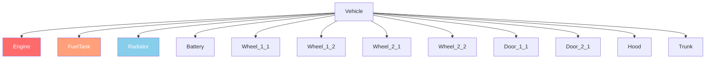

# Chapitre 6.2: Vehicle System

[Accueil](../../README.md) | [<< Précédent : Entity System](01-entity-system.md) | **Vehicles** | [Suivant : Weather >>](03-weather.md)

---

## Introduction

DayZ vehicles are entities that extend the transport system. Cars extend `CarScript`, boats extend `BoatScript`, and both inherit from `Transport`. Vehicles have fluid systems, parts with independent health, gear simulation, and physics managed by le moteur. Ce chapitre couvre the API methods you need to interact with vehicles in scripts.

---

## Hiérarchie des classes

```
EntityAI
└── Transport                    // 3_Game - base for all vehicles
    ├── Car                      // 3_Game - engine-native car physics
    │   └── CarScript            // 4_World - scriptable car base
    │       ├── CivilianSedan
    │       ├── OffroadHatchback
    │       ├── Hatchback_02
    │       ├── Sedan_02
    │       ├── Truck_01_Base
    │       └── ...
    └── Boat                     // 3_Game - engine-native boat physics
        └── BoatScript           // 4_World - scriptable boat base
```

---

## Transport (Base)

**Fichier :** `3_Game/entities/transport.c`

The abstract base for all vehicles. Provides seat management and crew access.

### Crew Management

```c
proto native int   CrewSize();                          // Nombre total de sièges
proto native int   CrewMemberIndex(Human crew_member);  // Obtenir l'index du siège of a human
proto native Human CrewMember(int posIdx);              // Obtenir l'humain au siège index
proto native void  CrewGetOut(int posIdx);              // Forcer le membre d'équipage à sortir of seat
proto native void  CrewDeath(int posIdx);               // Tuer le membre d'équipage in seat
```

### Crew Entry

```c
proto native int  GetAnimInstance();
proto native int  CrewPositionIndex(int componentIdx);  // Component to seat index
proto native vector CrewEntryPoint(int posIdx);         // World entry position for seat
```

**Exemple --- eject all passengers:**

```c
void EjectAllCrew(Transport vehicle)
{
    for (int i = 0; i < vehicle.CrewSize(); i++)
    {
        Human crew = vehicle.CrewMember(i);
        if (crew)
        {
            vehicle.CrewGetOut(i);
        }
    }
}
```

---

## Car (Engine Native)

**Fichier :** `3_Game/entities/car.c`

Engine-level car physics. All `proto native` methods that drive the vehicle simulation.

### Engine

```c
proto native bool  EngineIsOn();
proto native void  EngineStart();
proto native void  EngineStop();
proto native float EngineGetRPM();
proto native float EngineGetRPMRedline();
proto native float EngineGetRPMMax();
proto native int   GetGear();
```

### Fluids

DayZ vehicles have four fluid types defined in the `CarFluid` enum:

```c
enum CarFluid
{
    FUEL,
    OIL,
    BRAKE,
    COOLANT
}
```

```c
proto native float GetFluidCapacity(CarFluid fluid);
proto native float GetFluidFraction(CarFluid fluid);     // 0.0 - 1.0
proto native void  Fill(CarFluid fluid, float amount);
proto native void  Leak(CarFluid fluid, float amount);
proto native void  LeakAll(CarFluid fluid);
```

**Exemple --- refuel a vehicle:**

```c
void RefuelVehicle(Car car)
{
    float capacity = car.GetFluidCapacity(CarFluid.FUEL);
    float current = car.GetFluidFraction(CarFluid.FUEL) * capacity;
    float needed = capacity - current;
    car.Fill(CarFluid.FUEL, needed);
}
```

### Speed

```c
proto native float GetSpeedometer();    // Vitesse en km/h (absolute value)
```

### Controls (Simulation)

```c
proto native void  SetBrake(float value, int wheel = -1);    // 0.0 - 1.0, -1 = all wheels
proto native void  SetHandbrake(float value);                 // 0.0 - 1.0
proto native void  SetSteering(float value, bool analog = true);
proto native void  SetThrust(float value, int wheel = -1);    // 0.0 - 1.0
proto native void  SetClutchState(bool engaged);
```

### Wheels

```c
proto native int   WheelCount();
proto native bool  WheelIsAnyLocked();
proto native float WheelGetSurface(int wheelIdx);
```

### Callbacks (Override in CarScript)

```c
void OnEngineStart();
void OnEngineStop();
void OnContact(string zoneName, vector localPos, IEntity other, Contact data);
void OnFluidChanged(CarFluid fluid, float newValue, float oldValue);
void OnGearChanged(int newGear, int oldGear);
void OnSound(CarSoundCtrl ctrl, float oldValue);
```

---

## CarScript

**Fichier :** `4_World/entities/vehicles/carscript.c`

The scriptable car class that most vehicle mods extend. Adds parts, doors, lights, and sound management.

### Part Health

CarScript uses zones de dégâts to represent vehicle parts. Each part can be independently damaged:

```c
// Check part health via the standard EntityAI API
float engineHP = car.GetHealth("Engine", "Health");
float fuelTankHP = car.GetHealth("FuelTank", "Health");

// Set part health
car.SetHealth("Engine", "Health", 0);       // Détruire le moteur
car.SetHealth("FuelTank", "Health", 100);   // Réparer le réservoir
```

### Damage Zone Diagram



Common zones de dégâts for vehicles:

| Zone | Description |
|------|-------------|
| `""` (global) | Overall vehicle health |
| `"Engine"` | Engine part |
| `"FuelTank"` | Fuel tank |
| `"Radiator"` | Radiator (coolant) |
| `"Battery"` | Battery |
| `"SparkPlug"` | Spark plug |
| `"FrontLeft"` / `"FrontRight"` | Front wheels |
| `"RearLeft"` / `"RearRight"` | Rear wheels |
| `"DriverDoor"` / `"CoDriverDoor"` | Front doors |
| `"Hood"` / `"Trunk"` | Hood and trunk |

### Lights

```c
void SetLightsState(int state);   // 0 = off, 1 = on
int  GetLightsState();
```

### Door Control

```c
bool IsDoorOpen(string doorSource);
void OpenDoor(string doorSource);
void CloseDoor(string doorSource);
```

### Key Overrides for Custom Vehicles

```c
override void EEInit();                    // Initialize vehicle parts, fluids
override void OnEngineStart();             // Custom engine start behavior
override void OnEngineStop();              // Custom engine stop behavior
override void EOnSimulate(IEntity other, float dt);  // Per-tick simulation
override bool CanObjectAttachWeapon(string slot_name);
```

**Exemple --- create a vehicle with full fluids:**

```c
void SpawnReadyVehicle(vector pos)
{
    Car car = Car.Cast(GetGame().CreateObjectEx("CivilianSedan", pos,
                        ECE_PLACE_ON_SURFACE | ECE_INITAI | ECE_CREATEPHYSICS));
    if (!car)
        return;

    // Remplir tous les fluides
    car.Fill(CarFluid.FUEL, car.GetFluidCapacity(CarFluid.FUEL));
    car.Fill(CarFluid.OIL, car.GetFluidCapacity(CarFluid.OIL));
    car.Fill(CarFluid.BRAKE, car.GetFluidCapacity(CarFluid.BRAKE));
    car.Fill(CarFluid.COOLANT, car.GetFluidCapacity(CarFluid.COOLANT));

    // Générer les pièces requises
    EntityAI carEntity = EntityAI.Cast(car);
    carEntity.GetInventory().CreateAttachment("CarBattery");
    carEntity.GetInventory().CreateAttachment("SparkPlug");
    carEntity.GetInventory().CreateAttachment("CarRadiator");
    carEntity.GetInventory().CreateAttachment("HatchbackWheel");
}
```

---

## BoatScript

**Fichier :** `4_World/entities/vehicles/boatscript.c`

Scriptable base for boat entities. Similar API to CarScript but with propeller-based physics.

### Engine & Propulsion

```c
proto native bool  EngineIsOn();
proto native void  EngineStart();
proto native void  EngineStop();
proto native float EngineGetRPM();
```

### Fluids

Boats use the same `CarFluid` enum but typically only use `FUEL`:

```c
float fuel = boat.GetFluidFraction(CarFluid.FUEL);
boat.Fill(CarFluid.FUEL, boat.GetFluidCapacity(CarFluid.FUEL));
```

### Speed

```c
proto native float GetSpeedometer();   // Vitesse en km/h
```

**Exemple --- apparition a boat:**

```c
void SpawnBoat(vector waterPos)
{
    BoatScript boat = BoatScript.Cast(
        GetGame().CreateObjectEx("Boat_01", waterPos,
                                  ECE_CREATEPHYSICS | ECE_INITAI)
    );
    if (boat)
    {
        boat.Fill(CarFluid.FUEL, boat.GetFluidCapacity(CarFluid.FUEL));
    }
}
```

---

## Vérifications d'interaction avec les véhicules

### Checking if a Player is in a Vehicle

```c
PlayerBase player;
if (player.IsInVehicle())
{
    EntityAI vehicle = player.GetDrivingVehicle();
    CarScript car;
    if (Class.CastTo(car, vehicle))
    {
        float speed = car.GetSpeedometer();
        Print(string.Format("Driving at %1 km/h", speed));
    }
}
```

### Finding All Vehicles in the World

```c
void FindAllVehicles(out array<Transport> vehicles)
{
    vehicles = new array<Transport>;
    array<Object> objects = new array<Object>;
    array<CargoBase> proxyCargos = new array<CargoBase>;

    // Use a large radius from center of map
    GetGame().GetObjectsAtPosition(Vector(7500, 0, 7500), 15000, objects, proxyCargos);

    foreach (Object obj : objects)
    {
        Transport transport;
        if (Class.CastTo(transport, obj))
        {
            vehicles.Insert(transport);
        }
    }
}
```

---

## Résumé

| Concept | Point clé |
|---------|-----------|
| Hierarchy | `Transport` > `Car`/`Boat` > `CarScript`/`BoatScript` |
| Engine | `EngineStart()`, `EngineStop()`, `EngineIsOn()`, `EngineGetRPM()` |
| Fluids | `CarFluid` enum: `FUEL`, `OIL`, `BRAKE`, `COOLANT` |
| Fill/Leak | `Fill(fluid, amount)`, `Leak(fluid, amount)`, `GetFluidFraction(fluid)` |
| Speed | `GetSpeedometer()` returns km/h |
| Crew | `CrewSize()`, `CrewMember(idx)`, `CrewGetOut(idx)` |
| Parts | Standard zones de dégâts: `"Engine"`, `"FuelTank"`, `"Radiator"`, etc. |
| Creation | `CreateObjectEx` with `ECE_PLACE_ON_SURFACE \| ECE_INITAI \| ECE_CREATEPHYSICS` |

---

## Bonnes pratiques

- **Always include `ECE_CREATEPHYSICS | ECE_INITAI` when apparition vehicles.** Without physics, the vehicle falls through the ground. Without AI init, le moteur simulation does not start and the vehicle cannot be driven.
- **Fill all four fluids after apparition.** A vehicle missing oil, brake fluid, or coolant will damage itself immediately when le moteur starts. Use `GetFluidCapacity()` to get correct max values per vehicle type.
- **Null-check `CrewMember()` before operating on crew.** Empty seats return `null`. Iterating `CrewSize()` without checking each index causes crashes when seats are unoccupied.
- **Use `GetSpeedometer()` instead of computing velocity manually.** Le moteur's speedometer accounts for wheel contact, transmission state, and physics correctly. Manual velocity calculations from position deltas are unreliable.

---

## Compatibilité et impact

> **Compatibilité des mods :** Vehicle mods commonly extend `CarScript` with modded classes. Conflicts arise when multiple mods override the same callbacks like `OnEngineStart()` or `EOnSimulate()`.

- **Ordre de chargement :** If two mods both `modded class CarScript` and override `OnEngineStart()`, only the last-loaded mod runs unless both call `super`. Vehicle overhaul mods should always call `super` in every callback.
- **Conflits de classes moddées :** Expansion Vehicles and vanilla vehicle mods frequently conflict on `EEInit()` and fluid initialization. Test with both loaded.
- **Impact sur la performance :** `EOnSimulate()` runs every physics tick for each active vehicle. Keep logic minimal in this callback; use timer accumulators for expensive operations.
- **Serveur/Client :** `EngineStart()`, `EngineStop()`, `Fill()`, `Leak()`, and `CrewGetOut()` are server-authoritative. `GetSpeedometer()`, `EngineIsOn()`, and `GetFluidFraction()` are safe to read on both sides.

---

## Observé dans les mods réels

> Ces patrons ont été confirmés par l'étude du code source de mods DayZ professionnels.

| Patron | Mod | Fichier/Emplacement |
|---------|-----|---------------|
| Override `EEInit()` to set custom fluid capacities and apparition parts | Expansion Vehicles | `CarScript` subclasses |
| `EOnSimulate` accumulator for periodic fuel consumption checks | Vanilla+ vehicle mods | `CarScript` overrides |
| `CrewGetOut()` loop in admin eject-all command | VPP Admin Tools | Vehicle management module |
| Custom `OnContact()` override for collision damage tuning | Expansion | `ExpansionCarScript` |

---

[Accueil](../../README.md) | [<< Précédent : Entity System](01-entity-system.md) | **Vehicles** | [Suivant : Weather >>](03-weather.md)
