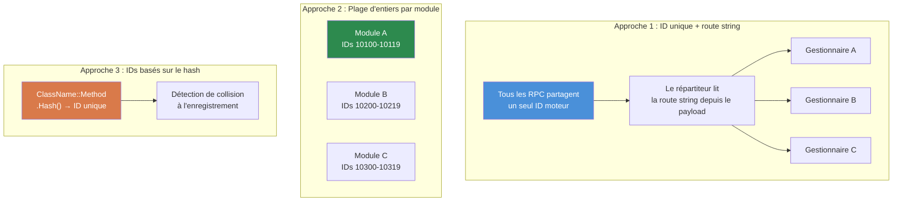

# Chapitre 7.3 : Patrons de communication RPC

[Accueil](../../README.md) | [<< Précédent : Systèmes de modules](02-module-systems.md) | **Patrons de communication RPC** | [Suivant : Persistance de la configuration >>](04-config-persistence.md)

---

## Introduction

Les appels de procédure distante (RPC) sont le seul moyen d'envoyer des données entre le client et le serveur dans DayZ. Chaque panneau d'administration, chaque interface synchronisée, chaque notification serveur-vers-client et chaque demande d'action client-vers-serveur transite par les RPC. Comprendre comment les construire correctement --- avec un ordre de sérialisation approprié, des vérifications de permissions et une gestion des erreurs --- est essentiel pour tout mod qui fait plus qu'ajouter des objets à CfgVehicles.

Ce chapitre couvre le patron fondamental `ScriptRPC`, le cycle de vie aller-retour client-serveur, la gestion des erreurs, puis compare les trois principales approches de routage RPC utilisées dans la communauté de modding DayZ.

---

## Table des matières

- [Fondamentaux de ScriptRPC](#fondamentaux-de-scriptrpc)
- [Aller-retour client vers serveur vers client](#aller-retour-client-vers-serveur-vers-client)
- [Vérification des permissions avant exécution](#vérification-des-permissions-avant-exécution)
- [Gestion des erreurs et notifications](#gestion-des-erreurs-et-notifications)
- [Sérialisation : le contrat lecture/écriture](#sérialisation--le-contrat-lectureécriture)
- [Trois approches RPC comparées](#trois-approches-rpc-comparées)
- [Erreurs courantes](#erreurs-courantes)
- [Bonnes pratiques](#bonnes-pratiques)

---

## Fondamentaux de ScriptRPC

Chaque RPC dans DayZ utilise la classe `ScriptRPC`. Le patron est toujours le même : créer, écrire les données, envoyer.

### Côté émetteur

```c
void SendDamageReport(PlayerIdentity target, string weaponName, float damage)
{
    ScriptRPC rpc = new ScriptRPC();

    // Écrire les champs dans un ordre spécifique
    rpc.Write(weaponName);    // champ 1 : string
    rpc.Write(damage);        // champ 2 : float

    // Envoyer via le moteur
    // Paramètres : objet cible, ID RPC, livraison garantie, destinataire
    rpc.Send(null, MY_RPC_ID, true, target);
}
```

### Côté récepteur

Le récepteur lit les champs dans le **même ordre exact** qu'ils ont été écrits :

```c
void OnRPC_DamageReport(PlayerIdentity sender, Object target, ParamsReadContext ctx)
{
    string weaponName;
    if (!ctx.Read(weaponName)) return;  // champ 1 : string

    float damage;
    if (!ctx.Read(damage)) return;      // champ 2 : float

    // Utiliser les données
    Print("Touché par " + weaponName + " pour " + damage.ToString() + " dégâts");
}
```

### Paramètres de Send expliqués

```c
rpc.Send(object, rpcId, guaranteed, identity);
```

| Paramètre | Type | Description |
|-----------|------|-------------|
| `object` | `Object` | L'entité cible (ex. un joueur ou véhicule). Utilisez `null` pour les RPC globaux. |
| `rpcId` | `int` | Entier identifiant ce type de RPC. Doit correspondre des deux côtés. |
| `guaranteed` | `bool` | `true` = fiable (type TCP, retransmission en cas de perte). `false` = non fiable (fire-and-forget). |
| `identity` | `PlayerIdentity` | Destinataire. `null` depuis le client = envoyer au serveur. `null` depuis le serveur = diffuser à tous les clients. Identité spécifique = envoyer uniquement à ce client. |

### Quand utiliser `guaranteed`

- **`true` (fiable) :** Changements de configuration, attribution de permissions, commandes de téléportation, actions de bannissement --- tout ce où un paquet perdu laisserait le client et le serveur désynchronisés.
- **`false` (non fiable) :** Mises à jour rapides de position, effets visuels, état du HUD qui se rafraîchit de toute façon toutes les quelques secondes. Moins de surcharge, pas de file de retransmission.

---

## Aller-retour client vers serveur vers client

Le patron RPC le plus courant est l'aller-retour : le client demande une action, le serveur valide et exécute, le serveur renvoie le résultat.

```
CLIENT                          SERVEUR
  │                               │
  │  1. RPC de demande ─────────► │
  │     (action + paramètres)     │
  │                               │  2. Valider la permission
  │                               │  3. Exécuter l'action
  │                               │  4. Préparer la réponse
  │  ◄─────────── 5. RPC réponse  │
  │     (résultat + données)      │
  │                               │
  │  6. Mettre à jour l'interface │
```

### Exemple complet : demande de téléportation

**Le client envoie la demande :**

```c
class TeleportClient
{
    void RequestTeleport(vector position)
    {
        ScriptRPC rpc = new ScriptRPC();
        rpc.Write(position);
        rpc.Send(null, MY_RPC_TELEPORT, true, null);  // identity null = envoyer au serveur
    }
};
```

**Le serveur reçoit, valide, exécute, répond :**

```c
class TeleportServer
{
    void OnRPC_TeleportRequest(PlayerIdentity sender, Object target, ParamsReadContext ctx)
    {
        // 1. Lire les données de la demande
        vector position;
        if (!ctx.Read(position)) return;

        // 2. Valider la permission
        if (!MyPermissions.GetInstance().HasPermission(sender.GetPlainId(), "MyMod.Admin.Teleport"))
        {
            SendError(sender, "Pas de permission pour téléporter");
            return;
        }

        // 3. Valider les données
        if (position[1] < 0 || position[1] > 1000)
        {
            SendError(sender, "Hauteur de téléportation invalide");
            return;
        }

        // 4. Exécuter l'action
        PlayerBase player = PlayerBase.Cast(sender.GetPlayer());
        if (!player) return;

        player.SetPosition(position);

        // 5. Envoyer la réponse de succès
        ScriptRPC response = new ScriptRPC();
        response.Write(true);           // drapeau de succès
        response.Write(position);       // renvoyer la position
        response.Send(null, MY_RPC_TELEPORT_RESULT, true, sender);
    }
};
```

**Le client reçoit la réponse :**

```c
class TeleportClient
{
    void OnRPC_TeleportResult(PlayerIdentity sender, Object target, ParamsReadContext ctx)
    {
        bool success;
        if (!ctx.Read(success)) return;

        vector position;
        if (!ctx.Read(position)) return;

        if (success)
        {
            // Mettre à jour l'interface : "Téléporté à X, Y, Z"
        }
    }
};
```

---

## Vérification des permissions avant exécution

Chaque gestionnaire RPC côté serveur qui effectue une action privilégiée **doit** vérifier les permissions avant d'exécuter. Ne faites jamais confiance au client.

### Le patron

```c
void OnRPC_AdminAction(PlayerIdentity sender, Object target, ParamsReadContext ctx)
{
    // RÈGLE 1 : Toujours valider que l'émetteur existe
    if (!sender) return;

    // RÈGLE 2 : Vérifier la permission avant de lire les données
    if (!MyPermissions.GetInstance().HasPermission(sender.GetPlainId(), "MyMod.Admin.Ban"))
    {
        MyLog.Warning("BanRPC", "Tentative de bannissement non autorisée de " + sender.GetName());
        return;
    }

    // RÈGLE 3 : Seulement maintenant lire et exécuter
    string targetUid;
    if (!ctx.Read(targetUid)) return;

    // ... exécuter le bannissement
}
```

### Pourquoi vérifier avant de lire ?

Lire les données d'un client non autorisé gaspille des cycles serveur. Plus important encore, des données malformées d'un client malveillant pourraient causer des erreurs d'analyse. Vérifier la permission d'abord est une garde peu coûteuse qui rejette immédiatement les acteurs malveillants.

### Logger les tentatives non autorisées

Loggez toujours les vérifications de permissions échouées. Cela crée une piste d'audit et aide les propriétaires de serveurs à détecter les tentatives d'exploit :

```c
if (!HasPermission(sender, "MyMod.Spawn"))
{
    MyLog.Warning("SpawnRPC", "Demande d'apparition refusée de "
        + sender.GetName() + " (" + sender.GetPlainId() + ")");
    return;
}
```

---

## Gestion des erreurs et notifications

Les RPC peuvent échouer de multiples façons : perte réseau, données malformées, échecs de validation côté serveur. Les mods robustes gèrent tous ces cas.

### Échecs de lecture

Chaque `ctx.Read()` peut échouer. Vérifiez toujours la valeur de retour :

```c
// MAUVAIS : Ignorer les échecs de lecture
string name;
ctx.Read(name);     // Si cela échoue, name est "" — corruption silencieuse
int count;
ctx.Read(count);    // Ceci lit les mauvais octets — tout après est des ordures

// BON : Retour anticipé sur tout échec de lecture
string name;
if (!ctx.Read(name)) return;
int count;
if (!ctx.Read(count)) return;
```

### Patron de réponse d'erreur

Quand le serveur rejette une demande, renvoyez une erreur structurée au client pour que l'interface puisse l'afficher :

```c
// Serveur : envoyer l'erreur
void SendError(PlayerIdentity target, string errorMsg)
{
    ScriptRPC rpc = new ScriptRPC();
    rpc.Write(false);        // success = false
    rpc.Write(errorMsg);     // raison
    rpc.Send(null, MY_RPC_RESPONSE_ID, true, target);
}

// Client : gérer l'erreur
void OnRPC_Response(PlayerIdentity sender, Object target, ParamsReadContext ctx)
{
    bool success;
    if (!ctx.Read(success)) return;

    if (!success)
    {
        string errorMsg;
        if (!ctx.Read(errorMsg)) return;

        // Afficher l'erreur dans l'interface
        MyLog.Warning("MyMod", "Erreur serveur : " + errorMsg);
        return;
    }

    // Gérer le succès...
}
```

### Diffusions de notifications

Pour les événements que tous les clients devraient voir (killfeed, annonces, changements météo), le serveur diffuse avec `identity = null` :

```c
// Serveur : diffuser à tous les clients
void BroadcastAnnouncement(string message)
{
    ScriptRPC rpc = new ScriptRPC();
    rpc.Write(message);
    rpc.Send(null, RPC_ANNOUNCEMENT, true, null);  // null = tous les clients
}
```

---

## Sérialisation : le contrat lecture/écriture

La règle la plus importante des RPC DayZ : **l'ordre de lecture doit correspondre exactement à l'ordre d'écriture, type pour type.**

### Le contrat

```c
// L'ÉMETTEUR écrit :
rpc.Write("hello");      // 1. string
rpc.Write(42);           // 2. int
rpc.Write(3.14);         // 3. float
rpc.Write(true);         // 4. bool

// Le RÉCEPTEUR lit dans le MÊME ordre :
string s;   ctx.Read(s);     // 1. string
int i;      ctx.Read(i);     // 2. int
float f;    ctx.Read(f);     // 3. float
bool b;     ctx.Read(b);     // 4. bool
```

### Ce qui arrive quand l'ordre ne correspond pas

Si vous inversez l'ordre de lecture, le désérialiseur interprète les octets prévus pour un type comme un autre. Un `int` lu là où un `string` a été écrit produira des données aléatoires, et chaque lecture suivante sera décalée --- corrompant tous les champs restants. Le moteur ne lance pas d'exception ; il retourne silencieusement des données erronées ou fait que `Read()` retourne `false`.

### Types supportés

| Type | Notes |
|------|-------|
| `int` | 32 bits signé |
| `float` | 32 bits IEEE 754 |
| `bool` | Un seul octet |
| `string` | UTF-8 avec préfixe de longueur |
| `vector` | Trois floats (x, y, z) |
| `Object` (comme paramètre cible) | Référence d'entité, résolue par le moteur |

### Sérialisation des collections

Il n'y a pas de sérialisation de tableau intégrée. Écrivez le compteur d'abord, puis chaque élément :

```c
// ÉMETTEUR
array<string> names = {"Alice", "Bob", "Charlie"};
rpc.Write(names.Count());
for (int i = 0; i < names.Count(); i++)
{
    rpc.Write(names[i]);
}

// RÉCEPTEUR
int count;
if (!ctx.Read(count)) return;

array<string> names = new array<string>();
for (int i = 0; i < count; i++)
{
    string name;
    if (!ctx.Read(name)) return;
    names.Insert(name);
}
```

### Sérialisation d'objets complexes

Pour les données complexes, sérialisez champ par champ. N'essayez pas de passer des objets directement via `Write()` :

```c
// ÉMETTEUR : aplatir l'objet en primitives
rpc.Write(player.GetName());
rpc.Write(player.GetHealth());
rpc.Write(player.GetPosition());

// RÉCEPTEUR : reconstruire
string name;    ctx.Read(name);
float health;   ctx.Read(health);
vector pos;     ctx.Read(pos);
```

---

## Trois approches RPC comparées

La communauté de modding DayZ utilise trois approches fondamentalement différentes pour le routage RPC. Chacune a ses compromis.

### Comparaison des trois approches RPC



### 1. RPC nommés CF

Community Framework fournit `GetRPCManager()` qui route les RPC par noms de chaînes groupés par espace de noms de mod.

```c
// Enregistrement (dans OnInit) :
GetRPCManager().AddRPC("MyMod", "RPC_SpawnItem", this, SingleplayerExecutionType.Server);

// Envoi depuis le client :
GetRPCManager().SendRPC("MyMod", "RPC_SpawnItem", new Param1<string>("AK74"), true);

// Le gestionnaire reçoit :
void RPC_SpawnItem(CallType type, ParamsReadContext ctx, PlayerIdentity sender, Object target)
{
    if (type != CallType.Server) return;

    Param1<string> data;
    if (!ctx.Read(data)) return;

    string className = data.param1;
    // ... faire apparaître l'objet
}
```

**Avantages :**
- Le routage par chaînes est lisible et sans collision
- Le regroupement par espace de noms (`"MyMod"`) empêche les conflits de noms entre mods
- Largement utilisé --- si vous intégrez avec COT/Expansion, vous utilisez ceci

**Inconvénients :**
- Nécessite CF comme dépendance
- Utilise des enveloppes `Param` qui sont verbeuses pour les payloads complexes
- Comparaison de chaînes à chaque répartition (surcharge mineure)

### 2. RPC à plage d'entiers COT / Vanilla

DayZ vanilla et certaines parties de COT utilisent des IDs RPC entiers bruts. Chaque mod revendique une plage d'entiers et répartit dans un `OnRPC` moddé surchargé.

```c
// Définir vos IDs RPC (choisir une plage unique pour éviter les collisions)
const int MY_RPC_SPAWN_ITEM     = 90001;
const int MY_RPC_DELETE_ITEM    = 90002;
const int MY_RPC_TELEPORT       = 90003;

// Envoi :
ScriptRPC rpc = new ScriptRPC();
rpc.Write("AK74");
rpc.Send(null, MY_RPC_SPAWN_ITEM, true, null);

// Réception (dans DayZGame moddé ou entité) :
modded class DayZGame
{
    override void OnRPC(PlayerIdentity sender, Object target, int rpc_type, ParamsReadContext ctx)
    {
        switch (rpc_type)
        {
            case MY_RPC_SPAWN_ITEM:
                HandleSpawnItem(sender, ctx);
                return;
            case MY_RPC_DELETE_ITEM:
                HandleDeleteItem(sender, ctx);
                return;
        }

        super.OnRPC(sender, target, rpc_type, ctx);
    }
};
```

**Avantages :**
- Aucune dépendance --- fonctionne avec DayZ vanilla
- La comparaison d'entiers est rapide
- Contrôle total sur le pipeline RPC

**Inconvénients :**
- **Risque de collision d'IDs** : deux mods choisissant la même plage d'entiers intercepteront silencieusement les RPC de l'autre
- La logique de répartition manuelle (switch/case) devient lourde avec de nombreux RPC
- Pas d'isolation d'espace de noms
- Pas de registre intégré ni de découvrabilité

### 3. RPC à routage par chaînes personnalisé

Un système à routage par chaînes personnalisé utilise un seul ID RPC moteur et multiplexe en écrivant un nom de mod + nom de fonction comme en-tête de chaîne dans chaque RPC. Tout le routage se fait à l'intérieur d'une classe gestionnaire statique (`MyRPC` dans cet exemple).

```c
// Enregistrement :
MyRPC.Register("MyMod", "RPC_SpawnItem", this, MyRPCSide.SERVER);

// Envoi (en-tête uniquement, sans payload) :
MyRPC.Send("MyMod", "RPC_SpawnItem", null, true, null);

// Envoi (avec payload) :
ScriptRPC rpc = MyRPC.CreateRPC("MyMod", "RPC_SpawnItem");
rpc.Write("AK74");
rpc.Write(5);    // quantité
rpc.Send(null, MyRPC.FRAMEWORK_RPC_ID, true, null);

// Gestionnaire :
void RPC_SpawnItem(PlayerIdentity sender, Object target, ParamsReadContext ctx)
{
    string className;
    if (!ctx.Read(className)) return;

    int quantity;
    if (!ctx.Read(quantity)) return;

    // ... faire apparaître les objets
}
```

**Avantages :**
- Zéro risque de collision --- espace de noms de chaîne + nom de fonction est globalement unique
- Zéro dépendance à CF (mais peut optionnellement pont vers le `GetRPCManager()` de CF quand CF est présent)
- Un seul ID moteur signifie une empreinte de hook minimale
- L'aide `CreateRPC()` pré-écrit l'en-tête de routage pour que vous n'écriviez que le payload
- Signature de gestionnaire propre : `(PlayerIdentity, Object, ParamsReadContext)`

**Inconvénients :**
- Deux lectures de chaînes supplémentaires par RPC (l'en-tête de routage) --- surcharge minimale en pratique
- Un système personnalisé signifie que les autres mods ne peuvent pas découvrir vos RPC via le registre de CF
- Ne répartit que via la réflexion `CallFunctionParams`, qui est légèrement plus lente qu'un appel de méthode direct

### Tableau comparatif

| Fonctionnalité | CF nommé | Plage d'entiers | Routage string personnalisé |
|----------------|----------|-----------------|----------------------------|
| **Risque de collision** | Aucun (espace de noms) | Élevé | Aucun (espace de noms) |
| **Dépendances** | Nécessite CF | Aucune | Aucune |
| **Signature du gestionnaire** | `(CallType, ctx, sender, target)` | Personnalisée | `(sender, target, ctx)` |
| **Découvrabilité** | Registre CF | Aucune | `MyRPC.s_Handlers` |
| **Surcharge de répartition** | Recherche de chaîne | Switch d'entier | Recherche de chaîne |
| **Style de payload** | Enveloppes Param | Write/Read brut | Write/Read brut |
| **Pont CF** | Natif | Manuel | Automatique (`#ifdef`) |

### Lequel utiliser ?

- **Votre mod dépend déjà de CF** (intégration COT/Expansion) : utilisez les RPC nommés CF
- **Mod autonome, dépendances minimales** : utilisez la plage d'entiers ou construisez un système à routage par chaînes
- **Construction d'un framework** : envisagez un système à routage par chaînes comme le patron `MyRPC` personnalisé ci-dessus
- **Apprentissage / prototypage** : la plage d'entiers est la plus simple à comprendre

---

## Erreurs courantes

### 1. Oublier d'enregistrer le gestionnaire

Vous envoyez un RPC mais rien ne se passe de l'autre côté. Le gestionnaire n'a jamais été enregistré.

```c
// FAUX : Pas d'enregistrement — le serveur ne connaît jamais ce gestionnaire
class MyModule
{
    void RPC_DoThing(PlayerIdentity sender, Object target, ParamsReadContext ctx) { ... }
};

// CORRECT : Enregistrer dans OnInit
class MyModule
{
    void OnInit()
    {
        MyRPC.Register("MyMod", "RPC_DoThing", this, MyRPCSide.SERVER);
    }

    void RPC_DoThing(PlayerIdentity sender, Object target, ParamsReadContext ctx) { ... }
};
```

### 2. Inadéquation de l'ordre lecture/écriture

Le bug RPC le plus courant. L'émetteur écrit `(string, int, float)` mais le récepteur lit `(string, float, int)`. Pas de message d'erreur --- juste des données aléatoires.

**Correction :** Écrivez un bloc de commentaire documentant l'ordre des champs aux sites d'envoi et de réception :

```c
// Format fil : [string weaponName] [int damage] [float distance]
```

### 3. Envoyer des données client-uniquement au serveur

Le serveur ne peut pas lire l'état des widgets client, l'état des entrées ou les variables locales. Si vous devez envoyer une sélection d'interface au serveur, sérialisez la valeur pertinente (une chaîne, un index, un ID) --- pas l'objet widget lui-même.

### 4. Diffuser quand vous vouliez un envoi unique

```c
// FAUX : Envoie à TOUS les clients quand vous vouliez envoyer à un seul
rpc.Send(null, MY_RPC_ID, true, null);

// CORRECT : Envoyer au client spécifique
rpc.Send(null, MY_RPC_ID, true, targetIdentity);
```

### 5. Ne pas gérer les gestionnaires périmés entre les redémarrages de mission

Si un module enregistre un gestionnaire RPC puis est détruit en fin de mission, le gestionnaire pointe encore vers l'objet mort. La prochaine répartition RPC crashera.

**Correction :** Désenregistrez toujours ou nettoyez les gestionnaires en fin de mission :

```c
override void OnMissionFinish()
{
    MyRPC.Unregister("MyMod", "RPC_DoThing");
}
```

Ou utilisez un `Cleanup()` centralisé qui vide toute la map de gestionnaires (comme le fait `MyRPC.Cleanup()`).

---

## Bonnes pratiques

1. **Vérifiez toujours les valeurs de retour de `ctx.Read()`.** Chaque lecture peut échouer. Retournez immédiatement en cas d'échec.

2. **Validez toujours l'émetteur sur le serveur.** Vérifiez que `sender` est non-null et a la permission requise avant de faire quoi que ce soit.

3. **Documentez le format fil.** Aux sites d'envoi et de réception, écrivez un commentaire listant les champs dans l'ordre avec leurs types.

4. **Utilisez la livraison fiable pour les changements d'état.** La livraison non fiable n'est appropriée que pour les mises à jour rapides et éphémères (position, effets).

5. **Gardez les payloads petits.** DayZ a une limite pratique de taille par RPC. Pour les grosses données (synchronisation de config, listes de joueurs), divisez en plusieurs RPC ou utilisez la pagination.

6. **Enregistrez les gestionnaires tôt.** `OnInit()` est l'endroit le plus sûr. Les clients peuvent se connecter avant que `OnMissionStart()` ne se termine.

7. **Nettoyez les gestionnaires à l'arrêt.** Soit désenregistrez individuellement, soit videz le registre entier dans `OnMissionFinish()`.

8. **Utilisez `CreateRPC()` pour les payloads, `Send()` pour les signaux.** Si vous n'avez pas de données à envoyer (juste un signal « faites-le »), utilisez `Send()` en-tête uniquement. Si vous avez des données, utilisez `CreateRPC()` + écritures manuelles + `rpc.Send()` manuel.

---

## Compatibilité et impact

- **Multi-Mod :** Les RPC à plage d'entiers sont sujets aux collisions --- deux mods choisissant le même ID interceptent silencieusement les messages de l'autre. Les RPC à routage par chaînes ou nommés CF évitent cela en utilisant l'espace de noms + nom de fonction comme clé.
- **Ordre de chargement :** L'ordre d'enregistrement des gestionnaires RPC n'importe que lorsque plusieurs mods font `modded class DayZGame` et surchargent `OnRPC`. Chacun doit appeler `super.OnRPC()` pour les IDs non gérés, sinon les mods en aval ne reçoivent jamais leurs RPC. Les systèmes à routage par chaînes évitent cela en utilisant un seul ID moteur.
- **Listen Server :** Sur les listen servers, client et serveur s'exécutent dans le même processus. Un RPC envoyé avec `identity = null` depuis le côté serveur sera aussi reçu localement. Protégez les gestionnaires avec `if (type != CallType.Server) return;` ou vérifiez `GetGame().IsServer()` / `GetGame().IsClient()` selon le cas.
- **Performance :** La surcharge de répartition RPC est minimale (recherche de chaîne ou switch d'entier). Le goulot d'étranglement est la taille du payload --- DayZ a une limite pratique par RPC (~64 Ko). Pour les grosses données (synchronisation de config), paginez à travers plusieurs RPC.
- **Migration :** Les IDs RPC sont un détail interne du mod et ne sont pas affectés par les mises à jour de version de DayZ. Si vous changez votre format fil RPC (ajout/suppression de champs), les anciens clients parlant à un nouveau serveur se désynchroniseront silencieusement. Versionnez vos payloads RPC ou forcez les mises à jour des clients.

---

## Théorie vs pratique

| Ce que dit la théorie | La réalité DayZ |
|----------------------|-----------------|
| Utilisez des protocol buffers ou une sérialisation basée sur un schéma | Enforce Script n'a pas de support protobuf ; vous faites manuellement `Write`/`Read` de primitives dans l'ordre correspondant |
| Validez toutes les entrées avec un schéma | Aucune validation de schéma n'existe ; chaque valeur de retour de `ctx.Read()` doit être vérifiée individuellement |
| Les RPC devraient être idempotents | Pratique dans DayZ uniquement pour les RPC de requête ; les RPC de mutation (apparition, suppression, téléportation) sont intrinsèquement non-idempotents --- protégez-les avec des vérifications de permissions |

---

[Accueil](../../README.md) | [<< Précédent : Systèmes de modules](02-module-systems.md) | **Patrons de communication RPC** | [Suivant : Persistance de la configuration >>](04-config-persistence.md)
