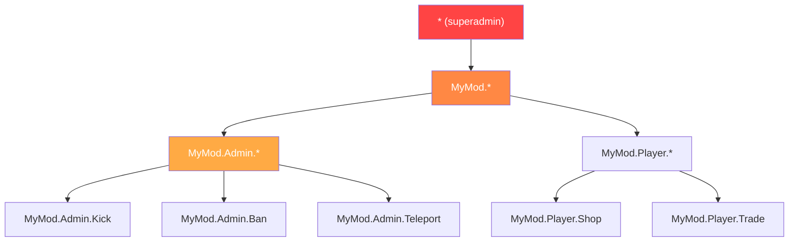

# Chapitre 7.5 : Systèmes de permissions

[Accueil](../../README.md) | [<< Précédent : Persistance de configuration](04-config-persistence.md) | **Systèmes de permissions** | [Suivant : Architecture événementielle >>](06-events.md)

---

## Introduction

Chaque outil d'administration, chaque action privilégiée et chaque fonctionnalité de modération dans DayZ nécessite un système de permissions. La question n'est pas de savoir s'il faut vérifier les permissions, mais comment les structurer. La communauté de modding DayZ s'est stabilisée autour de trois patrons majeurs : les permissions hiérarchiques séparées par des points, l'attribution de rôles par groupes d'utilisateurs (VPP) et le contrôle d'accès basé sur les rôles au niveau du framework (CF/COT). Chacun présente des compromis différents en termes de granularité, de complexité et d'expérience pour les propriétaires de serveurs.

Ce chapitre couvre les trois patrons, le flux de vérification des permissions, les formats de stockage et la gestion des wildcards/superadmin.

---

## Table des matières

- [Pourquoi les permissions sont importantes](#pourquoi-les-permissions-sont-importantes)
- [Hiérarchie séparée par des points (patron MyMod)](#hiérarchie-séparée-par-des-points-patron-mymod)
- [Patron UserGroup VPP](#patron-usergroup-vpp)
- [Patron basé sur les rôles CF (COT)](#patron-basé-sur-les-rôles-cf-cot)
- [Flux de vérification des permissions](#flux-de-vérification-des-permissions)
- [Formats de stockage](#formats-de-stockage)
- [Patrons wildcard et superadmin](#patrons-wildcard-et-superadmin)
- [Migration entre systèmes](#migration-entre-systèmes)
- [Bonnes pratiques](#bonnes-pratiques)

---

## Pourquoi les permissions sont importantes

Sans système de permissions, vous avez deux options : soit chaque joueur peut tout faire (le chaos), soit vous codez en dur les Steam64 ID dans vos scripts (inmaintenable). Un système de permissions permet aux propriétaires de serveurs de définir qui peut faire quoi, sans modifier le code.

Les trois règles de sécurité :

1. **Ne jamais faire confiance au client.** Le client envoie une requête ; le serveur décide s'il l'honore.
2. **Refuser par défaut.** Si un joueur n'a pas reçu explicitement une permission, il ne l'a pas.
3. **Échouer de manière fermée.** Si la vérification de permission elle-même échoue (identité null, données corrompues), refuser l'action.

---

## Hiérarchie séparée par des points (patron MyMod)

MyMod utilise des chaînes de permission séparées par des points, organisées en arborescence hiérarchique. Chaque permission est un chemin comme `"MyMod.Admin.Teleport"` ou `"MyMod.Missions.Start"`. Les wildcards permettent d'accorder des sous-arbres entiers.

### Format des permissions

```
MyMod                           (espace de noms racine)
├── Admin                        (outils d'administration)
│   ├── Panel                    (ouvrir le panneau admin)
│   ├── Teleport                 (se téléporter soi/autres)
│   ├── Kick                     (expulser des joueurs)
│   ├── Ban                      (bannir des joueurs)
│   └── Weather                  (changer la météo)
├── Missions                     (système de missions)
│   ├── Start                    (démarrer des missions manuellement)
│   └── Stop                     (arrêter des missions)
└── AI                           (système d'IA)
    ├── Spawn                    (faire apparaître de l'IA manuellement)
    └── Config                   (modifier la config IA)
```

### Modèle de données

Chaque joueur (identifié par son Steam64 ID) possède un tableau de chaînes de permissions accordées :

```c
class MyPermissionsData
{
    // clé : Steam64 ID, valeur : tableau de chaînes de permissions
    ref map<string, ref TStringArray> Admins;

    void MyPermissionsData()
    {
        Admins = new map<string, ref TStringArray>();
    }
};
```

### Vérification des permissions

La vérification parcourt les permissions accordées au joueur et supporte trois types de correspondance : correspondance exacte, wildcard complet (`"*"`) et wildcard de préfixe (`"MyMod.Admin.*"`) :

```c
bool HasPermission(string plainId, string permission)
{
    if (plainId == "" || permission == "")
        return false;

    TStringArray perms;
    if (!m_Permissions.Find(plainId, perms))
        return false;

    for (int i = 0; i < perms.Count(); i++)
    {
        string granted = perms[i];

        // Wildcard complet : superadmin
        if (granted == "*")
            return true;

        // Correspondance exacte
        if (granted == permission)
            return true;

        // Wildcard de préfixe : "MyMod.Admin.*" correspond à "MyMod.Admin.Teleport"
        if (granted.IndexOf("*") > 0)
        {
            string prefix = granted.Substring(0, granted.Length() - 1);
            if (permission.IndexOf(prefix) == 0)
                return true;
        }
    }

    return false;
}
```

### Stockage JSON

```json
{
    "Admins": {
        "76561198000000001": ["*"],
        "76561198000000002": ["MyMod.Admin.Panel", "MyMod.Admin.Teleport"],
        "76561198000000003": ["MyMod.Missions.*"],
        "76561198000000004": ["MyMod.Admin.Kick", "MyMod.Admin.Ban"]
    }
}
```

### Points forts

- **Granulaire :** vous pouvez accorder exactement les permissions dont chaque admin a besoin
- **Hiérarchique :** les wildcards accordent des sous-arbres entiers sans lister chaque permission
- **Auto-documenté :** la chaîne de permission indique ce qu'elle contrôle
- **Extensible :** les nouvelles permissions sont simplement de nouvelles chaînes --- aucun changement de schéma

### Points faibles

- **Pas de rôles nommés :** si 10 admins ont besoin du même ensemble, vous le listez 10 fois
- **Basé sur des chaînes :** les fautes de frappe dans les chaînes de permission échouent silencieusement (elles ne correspondent tout simplement pas)

---

## Patron UserGroup VPP

VPP Admin Tools utilise un système basé sur les groupes. Vous définissez des groupes nommés (rôles) avec des ensembles de permissions, puis vous assignez les joueurs aux groupes.

### Concept

```
Groupes :
  "SuperAdmin"  → [toutes les permissions]
  "Moderator"   → [kick, ban, mute, teleport]
  "Builder"     → [spawn objects, teleport, ESP]

Joueurs :
  "76561198000000001" → "SuperAdmin"
  "76561198000000002" → "Moderator"
  "76561198000000003" → "Builder"
```

### Patron d'implémentation

```c
class VPPUserGroup
{
    string GroupName;
    ref array<string> Permissions;
    ref array<string> Members;  // Steam64 IDs

    bool HasPermission(string permission)
    {
        if (!Permissions) return false;

        for (int i = 0; i < Permissions.Count(); i++)
        {
            if (Permissions[i] == permission)
                return true;
            if (Permissions[i] == "*")
                return true;
        }
        return false;
    }
};

class VPPPermissionManager
{
    ref array<ref VPPUserGroup> m_Groups;

    bool PlayerHasPermission(string plainId, string permission)
    {
        for (int i = 0; i < m_Groups.Count(); i++)
        {
            VPPUserGroup group = m_Groups[i];

            // Vérifier si le joueur est dans ce groupe
            if (group.Members.Find(plainId) == -1)
                continue;

            if (group.HasPermission(permission))
                return true;
        }
        return false;
    }
};
```

### Stockage JSON

```json
{
    "Groups": [
        {
            "GroupName": "SuperAdmin",
            "Permissions": ["*"],
            "Members": ["76561198000000001"]
        },
        {
            "GroupName": "Moderator",
            "Permissions": [
                "admin.kick",
                "admin.ban",
                "admin.mute",
                "admin.teleport"
            ],
            "Members": [
                "76561198000000002",
                "76561198000000003"
            ]
        },
        {
            "GroupName": "Builder",
            "Permissions": [
                "admin.spawn",
                "admin.teleport",
                "admin.esp"
            ],
            "Members": [
                "76561198000000004"
            ]
        }
    ]
}
```

### Points forts

- **Basé sur les rôles :** définir un rôle une fois, l'assigner à plusieurs joueurs
- **Familier :** les propriétaires de serveurs comprennent les systèmes de groupes/rôles d'autres jeux
- **Modifications en masse faciles :** modifier les permissions d'un groupe et tous les membres sont mis à jour

### Points faibles

- **Moins granulaire sans travail supplémentaire :** donner à un admin spécifique une permission supplémentaire signifie créer un nouveau groupe ou ajouter des remplacements par joueur
- **L'héritage de groupes est complexe :** VPP ne supporte pas nativement la hiérarchie de groupes (par ex., "Admin" hérite de toutes les permissions "Moderator")

---

## Patron basé sur les rôles CF (COT)

Community Framework / COT utilise un système de rôles et de permissions où les rôles sont définis avec des ensembles de permissions explicites, et les joueurs sont assignés à des rôles.

### Concept

Le système de permissions de CF est similaire aux groupes de VPP mais intégré au niveau du framework, le rendant disponible pour tous les mods basés sur CF :

```c
// Patron COT (simplifié)
// Les rôles sont définis dans AuthFile.json
// Chaque rôle a un nom et un tableau de permissions
// Les joueurs sont assignés aux rôles par Steam64 ID

class CF_Permission
{
    string m_Name;
    ref array<ref CF_Permission> m_Children;
    int m_State;  // ALLOW, DENY, INHERIT
};
```

### Arbre de permissions

CF représente les permissions sous forme d'arbre, où chaque nœud peut être explicitement autorisé, refusé ou hériter de son parent :

```
Root
├── Admin [ALLOW]
│   ├── Kick [INHERIT → ALLOW]
│   ├── Ban [INHERIT → ALLOW]
│   └── Teleport [DENY]        ← Explicitement refusé même si Admin est ALLOW
└── ESP [ALLOW]
```

Ce système à trois états (autoriser/refuser/hériter) est plus expressif que les systèmes binaires (accordé/non accordé) utilisés par MyMod et VPP. Il vous permet d'accorder une catégorie large puis de découper des exceptions.

### Stockage JSON

```json
{
    "Roles": {
        "Moderator": {
            "admin": {
                "kick": 2,
                "ban": 2,
                "teleport": 1
            }
        }
    },
    "Players": {
        "76561198000000001": {
            "Role": "SuperAdmin"
        }
    }
}
```

(Où `2 = ALLOW`, `1 = DENY`, `0 = INHERIT`)

### Points forts

- **Permissions à trois états :** autoriser, refuser, hériter offre une flexibilité maximale
- **Structure arborescente :** reflète la nature hiérarchique des chemins de permissions
- **Au niveau du framework :** tous les mods CF partagent le même système de permissions

### Points faibles

- **Complexité :** trois états sont plus difficiles à comprendre pour les propriétaires de serveurs qu'un simple "accordé"
- **Dépendance à CF :** fonctionne uniquement avec Community Framework

---

## Flux de vérification des permissions

Quel que soit le système utilisé, la vérification de permission côté serveur suit le même patron :

```
Le client envoie une requête RPC
        │
        ▼
Le gestionnaire RPC du serveur la reçoit
        │
        ▼
    ┌─────────────────────────────────┐
    │ L'identité de l'expéditeur est  │
    │ non-null ? (Validation réseau)  │
    └───────────┬─────────────────────┘
                │ Non → return (ignorer silencieusement)
                │ Oui ▼
    ┌─────────────────────────────────┐
    │ L'expéditeur a-t-il la         │
    │ permission requise pour cette   │
    │ action ?                        │
    └───────────┬─────────────────────┘
                │ Non → journaliser l'avertissement, optionnellement envoyer l'erreur au client, return
                │ Oui ▼
    ┌─────────────────────────────────┐
    │ Valider les données de la       │
    │ requête (lire les paramètres,   │
    │ vérifier les limites)           │
    └───────────┬─────────────────────┘
                │ Invalide → envoyer l'erreur au client, return
                │ Valide ▼
    ┌─────────────────────────────────┐
    │ Exécuter l'action privilégiée   │
    │ Journaliser l'action avec       │
    │ l'ID admin                      │
    │ Envoyer la réponse de succès    │
    └─────────────────────────────────┘
```

### Implémentation

```c
void OnRPC_KickPlayer(PlayerIdentity sender, Object target, ParamsReadContext ctx)
{
    // Étape 1 : Valider l'expéditeur
    if (!sender) return;

    // Étape 2 : Vérifier la permission
    if (!MyPermissions.GetInstance().HasPermission(sender.GetPlainId(), "MyMod.Admin.Kick"))
    {
        MyLog.Warning("Admin", "Tentative d'expulsion non autorisée : " + sender.GetName());
        return;
    }

    // Étape 3 : Lire et valider les données
    string targetUid;
    if (!ctx.Read(targetUid)) return;

    if (targetUid == sender.GetPlainId())
    {
        // Impossible de s'expulser soi-même
        SendError(sender, "Cannot kick yourself");
        return;
    }

    // Étape 4 : Exécuter
    PlayerIdentity targetIdentity = FindPlayerByUid(targetUid);
    if (!targetIdentity)
    {
        SendError(sender, "Player not found");
        return;
    }

    GetGame().DisconnectPlayer(targetIdentity);

    // Étape 5 : Journaliser et répondre
    MyLog.Info("Admin", sender.GetName() + " kicked " + targetIdentity.GetName());
    SendSuccess(sender, "Player kicked");
}
```

---

## Formats de stockage

Les trois systèmes stockent les permissions en JSON. Les différences sont structurelles :

### Plat par joueur

```json
{
    "Admins": {
        "STEAM64_ID": ["perm.a", "perm.b", "perm.c"]
    }
}
```

**Fichier :** Un seul fichier pour tous les joueurs.
**Avantages :** Simple, facile à éditer à la main.
**Inconvénients :** Redondant si de nombreux joueurs partagent les mêmes permissions.

### Fichier par joueur (Expansion / Données joueur)

```json
// Fichier : $profile:MyMod/Players/76561198xxxxx.json
{
    "UID": "76561198xxxxx",
    "Permissions": ["perm.a", "perm.b"],
    "LastLogin": "2025-01-15 14:30:00"
}
```

**Avantages :** Chaque joueur est indépendant ; pas de problème de verrouillage.
**Inconvénients :** Beaucoup de petits fichiers ; rechercher "qui a la permission X ?" nécessite de parcourir tous les fichiers.

### Basé sur les groupes (VPP)

```json
{
    "Groups": [
        {
            "GroupName": "RoleName",
            "Permissions": ["perm.a", "perm.b"],
            "Members": ["STEAM64_ID_1", "STEAM64_ID_2"]
        }
    ]
}
```

**Avantages :** Les changements de rôle se propagent instantanément à tous les membres.
**Inconvénients :** Un joueur ne peut pas facilement avoir de remplacements de permission par joueur sans un groupe dédié.

### Choisir un format

| Facteur | Plat par joueur | Fichier par joueur | Basé sur les groupes |
|--------|----------------|-----------------|-------------|
| **Petit serveur (1-5 admins)** | Meilleur | Excessif | Excessif |
| **Serveur moyen (5-20 admins)** | Bon | Bon | Meilleur |
| **Grande communauté (20+ rôles)** | Redondant | Les fichiers se multiplient | Meilleur |
| **Personnalisation par joueur** | Natif | Natif | Nécessite un contournement |
| **Édition manuelle** | Facile | Facile par joueur | Modéré |

---

## Patrons wildcard et superadmin



### Wildcard complet : `"*"`

Accorde toutes les permissions. C'est le patron superadmin. Un joueur avec `"*"` peut tout faire.

```c
if (granted == "*")
    return true;
```

**Convention :** Chaque système de permissions dans la communauté de modding DayZ utilise `"*"` pour le superadmin. N'inventez pas une convention différente.

### Wildcard de préfixe : `"MyMod.Admin.*"`

Accorde toutes les permissions commençant par `"MyMod.Admin."`. Cela permet d'accorder un sous-système entier sans lister chaque permission :

```c
// "MyMod.Admin.*" correspond à :
//   "MyMod.Admin.Teleport"  ✓
//   "MyMod.Admin.Kick"      ✓
//   "MyMod.Admin.Ban"       ✓
//   "MyMod.Missions.Start"  ✗ (sous-arbre différent)
```

### Implémentation

```c
if (granted.IndexOf("*") > 0)
{
    // "MyMod.Admin.*" → prefix = "MyMod.Admin."
    string prefix = granted.Substring(0, granted.Length() - 1);
    if (permission.IndexOf(prefix) == 0)
        return true;
}
```

### Pas de permissions négatives (séparé par des points / VPP)

Les systèmes séparés par des points et VPP utilisent des permissions additives uniquement. Vous pouvez accorder des permissions mais pas les refuser explicitement. Si une permission n'est pas dans la liste du joueur, elle est refusée.

CF/COT est l'exception avec son système à trois états (ALLOW/DENY/INHERIT), qui supporte les refus explicites.

### Porte de sortie superadmin

Fournissez un moyen de vérifier si quelqu'un est superadmin sans vérifier une permission spécifique. C'est utile pour la logique de contournement :

```c
bool IsSuperAdmin(string plainId)
{
    return HasPermission(plainId, "*");
}
```

---

## Migration entre systèmes

Si votre mod doit supporter les serveurs migrant d'un système de permissions à un autre (par ex., d'une liste plate d'UID admin vers des permissions hiérarchiques), implémentez la migration automatique au chargement :

```c
void Load()
{
    if (!FileExist(PERMISSIONS_FILE))
    {
        CreateDefaultFile();
        return;
    }

    // Essayer le nouveau format d'abord
    if (LoadNewFormat())
        return;

    // Se rabattre sur le format ancien et migrer
    LoadLegacyAndMigrate();
}

void LoadLegacyAndMigrate()
{
    // Lire l'ancien format : { "AdminUIDs": ["uid1", "uid2"] }
    LegacyPermissionData legacyData = new LegacyPermissionData();
    JsonFileLoader<LegacyPermissionData>.JsonLoadFile(PERMISSIONS_FILE, legacyData);

    // Migrer : chaque admin ancien devient un superadmin dans le nouveau système
    for (int i = 0; i < legacyData.AdminUIDs.Count(); i++)
    {
        string uid = legacyData.AdminUIDs[i];
        GrantPermission(uid, "*");
    }

    // Sauvegarder dans le nouveau format
    Save();
    MyLog.Info("Permissions", "Migrated " + legacyData.AdminUIDs.Count().ToString()
        + " admin(s) from legacy format");
}
```

C'est un patron courant utilisé pour migrer depuis le tableau plat `AdminUIDs` original vers la map hiérarchique `Admins`.

---

## Bonnes pratiques

1. **Refuser par défaut.** Si une permission n'est pas explicitement accordée, la réponse est "non".

2. **Vérifier sur le serveur, jamais sur le client.** Les vérifications de permissions côté client sont uniquement pour la commodité de l'interface (masquer les boutons). Le serveur doit toujours re-vérifier.

3. **Utiliser `"*"` pour le superadmin.** C'est la convention universelle. N'inventez pas `"all"`, `"admin"` ou `"root"`.

4. **Journaliser chaque action privilégiée refusée.** C'est votre piste d'audit de sécurité.

5. **Fournir un fichier de permissions par défaut avec un espace réservé.** Les nouveaux propriétaires de serveurs devraient voir un exemple clair :

```json
{
    "Admins": {
        "PUT_STEAM64_ID_HERE": ["*"]
    }
}
```

6. **Nommer vos permissions avec un espace de noms.** Utilisez `"VotreMod.Catégorie.Action"` pour éviter les collisions avec d'autres mods.

7. **Supporter les wildcards de préfixe.** Les propriétaires de serveurs devraient pouvoir accorder `"VotreMod.Admin.*"` au lieu de lister chaque permission admin individuellement.

8. **Garder le fichier de permissions éditable manuellement.** Les propriétaires de serveurs l'éditeront à la main. Utilisez des noms de clés clairs, une permission par ligne dans le JSON, et documentez les permissions disponibles quelque part dans la documentation de votre mod.

9. **Implémenter la migration dès le premier jour.** Quand votre format de permission change (et il changera), la migration automatique évite les tickets de support.

10. **Synchroniser les permissions vers le client à la connexion.** Le client a besoin de connaître ses propres permissions pour l'interface (afficher/masquer les boutons admin). Envoyez un résumé à la connexion ; n'envoyez pas le fichier complet de permissions du serveur.

---

## Compatibilité et impact

- **Multi-Mod :** Chaque mod peut définir son propre espace de noms de permissions (`"ModA.Admin.Kick"`, `"ModB.Build.Spawn"`). Le wildcard `"*"` accorde le superadmin pour *tous* les mods qui partagent le même stockage de permissions. Si les mods utilisent des fichiers de permissions indépendants, `"*"` ne s'applique que dans le périmètre de ce mod.
- **Ordre de chargement :** Les fichiers de permissions sont chargés une fois au démarrage du serveur. Pas de problème d'ordonnancement inter-mods tant que chaque mod lit son propre fichier. Si un framework partagé (CF/COT) gère les permissions, tous les mods utilisant ce framework partagent le même arbre de permissions.
- **Serveur d'écoute :** Les vérifications de permissions doivent toujours s'exécuter côté serveur. Sur les serveurs d'écoute, le code côté client peut appeler `HasPermission()` pour le contrôle de l'interface (afficher/masquer les boutons admin), mais la vérification côté serveur fait autorité.
- **Performance :** Les vérifications de permissions sont un parcours linéaire de tableau de chaînes par joueur. Avec des nombres d'admins typiques (1--20 admins, 5--30 permissions chacun), c'est négligeable. Pour des ensembles de permissions extrêmement grands, envisagez un `set<string>` au lieu d'un tableau pour des recherches O(1).
- **Migration :** Ajouter de nouvelles chaînes de permissions n'est pas cassant --- les admins existants n'ont simplement pas la nouvelle permission tant qu'elle n'est pas accordée. Renommer des permissions casse silencieusement les attributions existantes. Utilisez le versionnage de config pour auto-migrer les chaînes de permissions renommées.

---

## Erreurs courantes

| Erreur | Impact | Correction |
|---------|--------|-----|
| Faire confiance aux données de permission envoyées par le client | Les clients exploités envoient "Je suis admin" et le serveur les croit ; compromission totale du serveur | Ne jamais lire les permissions depuis un payload RPC ; toujours rechercher `sender.GetPlainId()` dans le stockage de permissions côté serveur |
| Absence de refus par défaut | Une vérification de permission manquante accorde l'accès à tout le monde ; escalade de privilèges accidentelle | Chaque gestionnaire RPC pour une action privilégiée doit vérifier `HasPermission()` et retourner tôt en cas d'échec |
| La faute de frappe dans la chaîne de permission échoue silencieusement | `"MyMod.Amin.Kick"` (faute de frappe) ne correspond jamais --- l'admin ne peut pas expulser, aucune erreur n'est journalisée | Définir les chaînes de permissions comme variables `static const` ; référencer la constante, jamais un littéral de chaîne brut |
| Envoyer le fichier complet de permissions au client | Expose tous les Steam64 ID des admins et leurs ensembles de permissions à tout client connecté | Envoyer uniquement la liste de permissions du joueur demandeur, jamais le fichier complet du serveur |
| Pas de support wildcard dans HasPermission | Les propriétaires de serveurs doivent lister chaque permission individuellement par admin ; fastidieux et sujet aux erreurs | Implémenter les wildcards de préfixe (`"MyMod.Admin.*"`) et le wildcard complet (`"*"`) dès le premier jour |

---

## Théorie vs pratique

| Le manuel dit | La réalité DayZ |
|---------------|-------------|
| Utiliser RBAC (contrôle d'accès basé sur les rôles) avec héritage de groupes | Seul CF/COT supporte les permissions à trois états ; la plupart des mods utilisent des attributions plates par joueur pour la simplicité |
| Les permissions devraient être stockées dans une base de données | Pas d'accès base de données ; les fichiers JSON dans `$profile:` sont la seule option |
| Utiliser des jetons cryptographiques pour l'autorisation | Pas de bibliothèques cryptographiques en Enforce Script ; la confiance est basée sur `PlayerIdentity.GetPlainId()` (Steam64 ID) vérifié par le moteur |

---

[Accueil](../../README.md) | [<< Précédent : Persistance de configuration](04-config-persistence.md) | **Systèmes de permissions** | [Suivant : Architecture événementielle >>](06-events.md)
