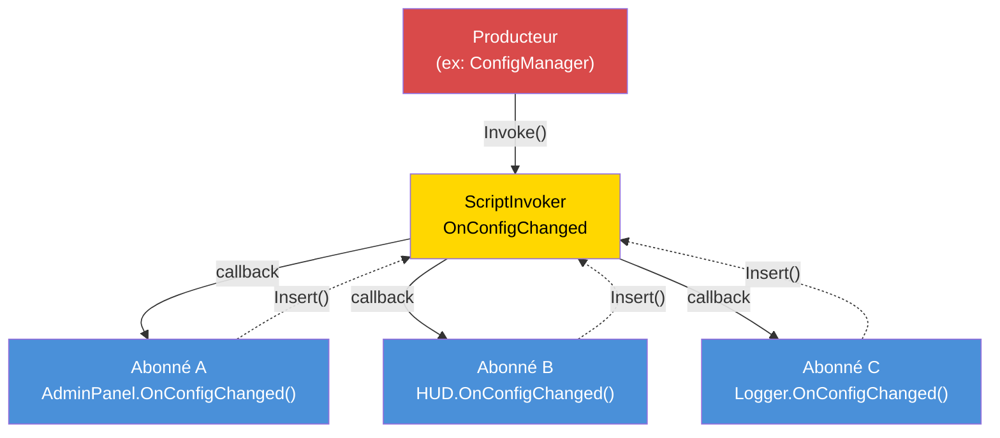

# Chapitre 7.6 : Architecture événementielle

[Accueil](../../README.md) | [<< Précédent : Systèmes de permissions](05-permissions.md) | **Architecture événementielle** | [Suivant : Optimisation des performances >>](07-performance.md)

---

## Introduction

L'architecture événementielle découple le producteur d'un événement de ses consommateurs. Quand un joueur se connecte, le gestionnaire de connexion n'a pas besoin de connaître le killfeed, le panneau admin, le système de missions ou le module de journalisation --- il déclenche un événement "joueur connecté", et chaque système intéressé s'abonne indépendamment. C'est le fondement de la conception de mod extensible : les nouvelles fonctionnalités s'abonnent aux événements existants sans modifier le code qui les déclenche.

DayZ fournit `ScriptInvoker` comme primitive événementielle intégrée. Par-dessus, les mods professionnels construisent des bus d'événements avec des sujets nommés, des gestionnaires typés et une gestion du cycle de vie. Ce chapitre couvre les trois patrons majeurs et la discipline critique de prévention des fuites mémoire.

---

## Table des matières

- [Patron ScriptInvoker](#patron-scriptinvoker)
- [Patron EventBus (sujets routés par chaîne)](#patron-eventbus-sujets-routés-par-chaîne)
- [Patron CF_EventHandler](#patron-cf_eventhandler)
- [Quand utiliser les événements vs les appels directs](#quand-utiliser-les-événements-vs-les-appels-directs)
- [Prévention des fuites mémoire](#prévention-des-fuites-mémoire)
- [Avancé : données d'événement personnalisées](#avancé--données-dévénement-personnalisées)
- [Bonnes pratiques](#bonnes-pratiques)

---

## Patron ScriptInvoker

`ScriptInvoker` est la primitive pub/sub intégrée du moteur. Il contient une liste de callbacks de fonctions et les invoque toutes quand un événement se déclenche. C'est le mécanisme événementiel de plus bas niveau dans DayZ.

### Créer un événement

```c
class WeatherManager
{
    // L'événement. N'importe qui peut s'abonner pour être notifié du changement de météo.
    ref ScriptInvoker OnWeatherChanged = new ScriptInvoker();

    protected string m_CurrentWeather;

    void SetWeather(string newWeather)
    {
        m_CurrentWeather = newWeather;

        // Déclencher l'événement — tous les abonnés sont notifiés
        OnWeatherChanged.Invoke(newWeather);
    }
};
```

### S'abonner à un événement

```c
class WeatherUI
{
    void Init(WeatherManager mgr)
    {
        // S'abonner : quand la météo change, appeler notre gestionnaire
        mgr.OnWeatherChanged.Insert(OnWeatherChanged);
    }

    void OnWeatherChanged(string newWeather)
    {
        // Mettre à jour l'interface
        m_WeatherLabel.SetText("Weather: " + newWeather);
    }

    void Cleanup(WeatherManager mgr)
    {
        // CRITIQUE : Se désabonner quand c'est terminé
        mgr.OnWeatherChanged.Remove(OnWeatherChanged);
    }
};
```

### API ScriptInvoker

| Méthode | Description |
|--------|-------------|
| `Insert(func)` | Ajouter un callback à la liste des abonnés |
| `Remove(func)` | Retirer un callback spécifique |
| `Invoke(...)` | Appeler tous les callbacks abonnés avec les arguments donnés |
| `Clear()` | Retirer tous les abonnés |

### Patron événementiel



### Comment Insert/Remove fonctionnent

`Insert` ajoute une référence de fonction à une liste interne. `Remove` recherche dans la liste et retire l'entrée correspondante. Si vous appelez `Insert` deux fois avec la même fonction, elle sera appelée deux fois à chaque `Invoke`. Si vous appelez `Remove` une fois, cela retire une seule entrée.

```c
// Abonner le même gestionnaire deux fois est un bug :
mgr.OnWeatherChanged.Insert(OnWeatherChanged);
mgr.OnWeatherChanged.Insert(OnWeatherChanged);  // Maintenant appelé 2x par Invoke

// Un seul Remove ne retire qu'une entrée :
mgr.OnWeatherChanged.Remove(OnWeatherChanged);
// Encore appelé 1x par Invoke — le second Insert est toujours là
```

### Signatures typées

`ScriptInvoker` n'applique pas les types de paramètres à la compilation. La convention est de documenter la signature attendue dans un commentaire :

```c
// Signature : void(string weatherName, float temperature)
ref ScriptInvoker OnWeatherChanged = new ScriptInvoker();
```

Si un abonné a la mauvaise signature, le comportement est indéfini à l'exécution --- il peut crasher, recevoir des valeurs aberrantes ou ne rien faire silencieusement. Correspondez toujours exactement à la signature documentée.

### ScriptInvoker sur les classes vanilla

De nombreuses classes vanilla DayZ exposent des événements `ScriptInvoker` :

```c
// UIScriptedMenu a OnVisibilityChanged
class UIScriptedMenu
{
    ref ScriptInvoker m_OnVisibilityChanged;
};

// MissionBase a des hooks d'événements
class MissionBase
{
    void OnUpdate(float timeslice);
    void OnEvent(EventType eventTypeId, Param params);
};
```

Vous pouvez vous abonner à ces événements vanilla depuis des classes moddées pour réagir aux changements d'état au niveau du moteur.

---

## Patron EventBus (sujets routés par chaîne)

Un `ScriptInvoker` est un seul canal d'événement. Un EventBus est une collection de canaux nommés, fournissant un hub central où tout module peut publier ou s'abonner à des événements par nom de sujet.

### Patron EventBus personnalisé

Ce patron implémente l'EventBus comme une classe statique avec des champs `ScriptInvoker` nommés pour les événements bien connus, plus un canal générique `OnCustomEvent` pour les sujets ad-hoc :

```c
class MyEventBus
{
    // Événements de cycle de vie bien connus
    static ref ScriptInvoker OnPlayerConnected;      // void(PlayerIdentity)
    static ref ScriptInvoker OnPlayerDisconnected;    // void(PlayerIdentity)
    static ref ScriptInvoker OnPlayerReady;           // void(PlayerBase, PlayerIdentity)
    static ref ScriptInvoker OnConfigChanged;         // void(string modId, string field, string value)
    static ref ScriptInvoker OnAdminPanelToggled;     // void(bool opened)
    static ref ScriptInvoker OnMissionStarted;        // void(MyInstance)
    static ref ScriptInvoker OnMissionCompleted;      // void(MyInstance, int reason)
    static ref ScriptInvoker OnAdminDataSynced;       // void()

    // Canal d'événement personnalisé générique
    static ref ScriptInvoker OnCustomEvent;           // void(string eventName, Param params)

    static void Init() { ... }   // Crée tous les invokers
    static void Cleanup() { ... } // Nullifie tous les invokers

    // Aide pour déclencher un événement personnalisé
    static void Fire(string eventName, Param params)
    {
        if (!OnCustomEvent) Init();
        OnCustomEvent.Invoke(eventName, params);
    }
};
```

### S'abonner à l'EventBus

```c
class MyMissionModule : MyServerModule
{
    override void OnInit()
    {
        super.OnInit();

        // S'abonner au cycle de vie des joueurs
        MyEventBus.OnPlayerConnected.Insert(OnPlayerJoined);
        MyEventBus.OnPlayerDisconnected.Insert(OnPlayerLeft);

        // S'abonner aux changements de config
        MyEventBus.OnConfigChanged.Insert(OnConfigChanged);
    }

    override void OnMissionFinish()
    {
        // Toujours se désabonner à l'arrêt
        MyEventBus.OnPlayerConnected.Remove(OnPlayerJoined);
        MyEventBus.OnPlayerDisconnected.Remove(OnPlayerLeft);
        MyEventBus.OnConfigChanged.Remove(OnConfigChanged);
    }

    void OnPlayerJoined(PlayerIdentity identity)
    {
        MyLog.Info("Missions", "Player joined: " + identity.GetName());
    }

    void OnPlayerLeft(PlayerIdentity identity)
    {
        MyLog.Info("Missions", "Player left: " + identity.GetName());
    }

    void OnConfigChanged(string modId, string field, string value)
    {
        if (modId == "MyMod_Missions")
        {
            // Recharger notre config
            ReloadSettings();
        }
    }
};
```

### Utiliser les événements personnalisés

Pour les événements ponctuels ou spécifiques à un mod qui ne justifient pas un champ `ScriptInvoker` dédié :

```c
// Producteur (ex: dans le système de butin) :
MyEventBus.Fire("LootRespawned", new Param1<int>(spawnedCount));

// Abonné (ex: dans un module de journalisation) :
MyEventBus.OnCustomEvent.Insert(OnCustomEvent);

void OnCustomEvent(string eventName, Param params)
{
    if (eventName == "LootRespawned")
    {
        Param1<int> data;
        if (Class.CastTo(data, params))
        {
            MyLog.Info("Loot", "Respawned " + data.param1.ToString() + " items");
        }
    }
}
```

### Quand utiliser les champs nommés vs les événements personnalisés

| Approche | Quand l'utiliser |
|----------|----------|
| Champ `ScriptInvoker` nommé | L'événement est bien connu, fréquemment utilisé et a une signature stable |
| `OnCustomEvent` + nom de chaîne | L'événement est spécifique au mod, expérimental ou utilisé par un seul abonné |

Les champs nommés sont type-safe par convention et découvrables en lisant la classe. Les événements personnalisés sont flexibles mais nécessitent une correspondance de chaînes et du casting.

---

## Patron CF_EventHandler

Community Framework fournit `CF_EventHandler` comme un système d'événements plus structuré avec des arguments d'événements typés.

### Concept

```c
// Patron du gestionnaire d'événements CF (simplifié) :
class CF_EventArgs
{
    // Classe de base pour tous les arguments d'événement
};

class CF_EventPlayerArgs : CF_EventArgs
{
    PlayerIdentity Identity;
    PlayerBase Player;
};

// Les modules surchargent les méthodes de gestionnaire d'événements :
class MyModule : CF_ModuleWorld
{
    override void OnEvent(Class sender, CF_EventArgs args)
    {
        // Gérer les événements génériques
    }

    override void OnClientReady(Class sender, CF_EventArgs args)
    {
        // Le client est prêt, l'interface peut être créée
    }
};
```

### Différences clés avec ScriptInvoker

| Fonctionnalité | ScriptInvoker | CF_EventHandler |
|---------|--------------|-----------------|
| **Sécurité de type** | Par convention uniquement | Classes EventArgs typées |
| **Découverte** | Lire les commentaires | Surcharger des méthodes nommées |
| **Abonnement** | `Insert()` / `Remove()` | Surcharger des méthodes virtuelles |
| **Données personnalisées** | Wrappers Param | Sous-classes EventArgs personnalisées |
| **Nettoyage** | `Remove()` manuel | Automatique (surcharge de méthode, pas d'inscription) |

L'approche de CF élimine le besoin de s'abonner et se désabonner manuellement --- vous surchargez simplement la méthode du gestionnaire. Cela supprime toute une catégorie de bugs (appels `Remove()` oubliés) au prix de nécessiter CF comme dépendance.

---

## Quand utiliser les événements vs les appels directs

### Utiliser les événements quand :

1. **Plusieurs consommateurs indépendants** doivent réagir à la même occurrence. Un joueur se connecte ? Le killfeed, le panneau admin, le système de missions et le logger sont tous concernés.

2. **Le producteur ne devrait pas connaître les consommateurs.** Le gestionnaire de connexion ne devrait pas importer le module killfeed.

3. **L'ensemble des consommateurs change à l'exécution.** Les modules peuvent s'abonner et se désabonner dynamiquement.

4. **Communication inter-mods.** Le Mod A déclenche un événement ; le Mod B s'y abonne. Aucun n'importe l'autre.

### Utiliser les appels directs quand :

1. **Il y a exactement un consommateur** et il est connu à la compilation. Si seul le système de santé se soucie d'un calcul de dommages, appelez-le directement.

2. **Des valeurs de retour sont nécessaires.** Les événements sont fire-and-forget. Si vous avez besoin d'une réponse ("cette action devrait-elle être autorisée ?"), utilisez un appel de méthode direct.

3. **L'ordre compte.** Les abonnés aux événements sont appelés dans l'ordre d'insertion, mais dépendre de cet ordre est fragile. Si l'étape B doit se produire après l'étape A, appelez A puis B explicitement.

4. **La performance est critique.** Les événements ont un surcoût (itération de la liste d'abonnés, appel par réflexion). Pour la logique par frame, par entité, les appels directs sont plus rapides.

### Guide de décision

```
                    Le producteur a-t-il besoin d'une valeur de retour ?
                         /                    \
                       OUI                     NON
                        |                       |
                   Appel direct          Combien de consommateurs ?
                                       /              \
                                     UN            PLUSIEURS
                                      |                |
                                 Appel direct       ÉVÉNEMENT
```

---

## Prévention des fuites mémoire

L'aspect le plus dangereux de l'architecture événementielle en Enforce Script est les **fuites d'abonnés**. Si un objet s'abonne à un événement puis est détruit sans se désabonner, deux choses peuvent se produire :

1. **Si l'objet étend `Managed` :** La référence faible dans l'invoker est automatiquement annulée. L'invoker appellera une fonction null --- ce qui ne fait rien, mais gaspille des cycles à itérer des entrées mortes.

2. **Si l'objet N'étend PAS `Managed` :** L'invoker détient un pointeur de fonction pendant. Quand l'événement se déclenche, il appelle de la mémoire libérée. **Crash.**

### La règle d'or

**Chaque `Insert()` doit avoir un `Remove()` correspondant.** Sans exception.

### Patron : S'abonner dans OnInit, se désabonner dans OnMissionFinish

```c
class MyModule : MyServerModule
{
    override void OnInit()
    {
        super.OnInit();
        MyEventBus.OnPlayerConnected.Insert(HandlePlayerConnect);
    }

    override void OnMissionFinish()
    {
        MyEventBus.OnPlayerConnected.Remove(HandlePlayerConnect);
        // Puis appeler super ou faire d'autres nettoyages
    }

    void HandlePlayerConnect(PlayerIdentity identity) { ... }
};
```

### Patron : S'abonner dans le constructeur, se désabonner dans le destructeur

Pour les objets avec un cycle de vie de propriété clair :

```c
class PlayerTracker : Managed
{
    void PlayerTracker()
    {
        MyEventBus.OnPlayerConnected.Insert(OnPlayerConnected);
        MyEventBus.OnPlayerDisconnected.Insert(OnPlayerDisconnected);
    }

    void ~PlayerTracker()
    {
        if (MyEventBus.OnPlayerConnected)
            MyEventBus.OnPlayerConnected.Remove(OnPlayerConnected);
        if (MyEventBus.OnPlayerDisconnected)
            MyEventBus.OnPlayerDisconnected.Remove(OnPlayerDisconnected);
    }

    void OnPlayerConnected(PlayerIdentity identity) { ... }
    void OnPlayerDisconnected(PlayerIdentity identity) { ... }
};
```

**Notez les vérifications null dans le destructeur.** Pendant l'arrêt, `MyEventBus.Cleanup()` peut avoir déjà été exécuté, mettant tous les invokers à `null`. Appeler `Remove()` sur un invoker `null` crash.

### Patron : Le nettoyage de l'EventBus annule tout

La méthode `MyEventBus.Cleanup()` met tous les invokers à `null`, ce qui libère toutes les références d'abonnés d'un coup. C'est l'option nucléaire --- elle garantit qu'aucun abonné périmé ne survit aux redémarrages de mission :

```c
static void Cleanup()
{
    OnPlayerConnected    = null;
    OnPlayerDisconnected = null;
    OnConfigChanged      = null;
    // ... tous les autres invokers
    s_Initialized = false;
}
```

Cela est appelé depuis `MyFramework.ShutdownAll()` pendant `OnMissionFinish`. Les modules devraient quand même `Remove()` leurs propres abonnements pour la correction, mais le nettoyage de l'EventBus agit comme un filet de sécurité.

### Anti-patron : Fonctions anonymes

```c
// MAUVAIS : Vous ne pouvez pas Remove une fonction anonyme
MyEventBus.OnPlayerConnected.Insert(function(PlayerIdentity id) {
    Print("Connected: " + id.GetName());
});
// Comment retirer ceci ? Vous ne pouvez pas la référencer.
```

Utilisez toujours des méthodes nommées pour pouvoir vous désabonner ultérieurement.

---

## Avancé : données d'événement personnalisées

Pour les événements qui transportent des charges utiles complexes, utilisez les wrappers `Param` :

### Classes Param

DayZ fournit `Param1<T>` jusqu'à `Param4<T1, T2, T3, T4>` pour encapsuler des données typées :

```c
// Déclencher avec des données structurées :
Param2<string, int> data = new Param2<string, int>("AK74", 5);
MyEventBus.Fire("ItemSpawned", data);

// Recevoir :
void OnCustomEvent(string eventName, Param params)
{
    if (eventName == "ItemSpawned")
    {
        Param2<string, int> data;
        if (Class.CastTo(data, params))
        {
            string className = data.param1;
            int quantity = data.param2;
        }
    }
}
```

### Classe de données d'événement personnalisée

Pour les événements avec beaucoup de champs, créez une classe de données dédiée :

```c
class KillEventData : Managed
{
    string KillerName;
    string VictimName;
    string WeaponName;
    float Distance;
    vector KillerPos;
    vector VictimPos;
};

// Déclencher :
KillEventData killData = new KillEventData();
killData.KillerName = killer.GetIdentity().GetName();
killData.VictimName = victim.GetIdentity().GetName();
killData.WeaponName = weapon.GetType();
killData.Distance = vector.Distance(killer.GetPosition(), victim.GetPosition());
OnKillEvent.Invoke(killData);
```

---

## Bonnes pratiques

1. **Chaque `Insert()` doit avoir un `Remove()` correspondant.** Auditez votre code : recherchez chaque appel `Insert` et vérifiez qu'il a un `Remove` correspondant dans le chemin de nettoyage.

2. **Vérifier null sur l'invoker avant `Remove()` dans les destructeurs.** Pendant l'arrêt, l'EventBus peut avoir déjà été nettoyé.

3. **Documenter les signatures d'événements.** Au-dessus de chaque déclaration `ScriptInvoker`, écrivez un commentaire avec la signature de callback attendue :
   ```c
   // Signature : void(PlayerBase player, float damage, string source)
   static ref ScriptInvoker OnPlayerDamaged;
   ```

4. **Ne pas dépendre de l'ordre d'exécution des abonnés.** Si l'ordre compte, utilisez des appels directs à la place.

5. **Garder les gestionnaires d'événements rapides.** Si un gestionnaire doit faire un travail coûteux, planifiez-le pour le tick suivant plutôt que de bloquer tous les autres abonnés.

6. **Utiliser les événements nommés pour les API stables, les événements personnalisés pour les expériences.** Les champs `ScriptInvoker` nommés sont découvrables et documentés. Les événements personnalisés routés par chaîne sont flexibles mais plus difficiles à trouver.

7. **Initialiser l'EventBus tôt.** Les événements peuvent se déclencher avant `OnMissionStart()`. Appelez `Init()` pendant `OnInit()` ou utilisez le patron paresseux (vérifier `null` avant `Insert`).

8. **Nettoyer l'EventBus à la fin de mission.** Annulez tous les invokers pour éviter les références périmées entre les redémarrages de mission.

9. **Ne jamais utiliser de fonctions anonymes comme abonnés d'événements.** Vous ne pouvez pas vous en désabonner.

10. **Préférer les événements au polling.** Au lieu de vérifier "est-ce que la config a changé ?" à chaque frame, abonnez-vous à `OnConfigChanged` et réagissez uniquement quand il se déclenche.

---

## Compatibilité et impact

- **Multi-Mod :** Plusieurs mods peuvent s'abonner aux mêmes sujets EventBus sans conflit. Chaque abonné est appelé indépendamment. Cependant, si un abonné lance une erreur irrécupérable (ex: référence null), les abonnés suivants sur cet invoker peuvent ne pas s'exécuter.
- **Ordre de chargement :** L'ordre d'abonnement égale l'ordre d'appel sur `Invoke()`. Les mods qui chargent plus tôt s'inscrivent en premier et reçoivent les événements en premier. Ne dépendez pas de cet ordre --- si l'ordre d'exécution compte, utilisez des appels directs à la place.
- **Serveur d'écoute :** Sur les serveurs d'écoute, les événements déclenchés depuis le code côté serveur sont visibles pour les abonnés côté client s'ils partagent le même `ScriptInvoker` statique. Utilisez des champs EventBus séparés pour les événements serveur-uniquement et client-uniquement, ou protégez les gestionnaires avec `GetGame().IsServer()` / `GetGame().IsClient()`.
- **Performance :** `ScriptInvoker.Invoke()` itère tous les abonnés linéairement. Avec 5--15 abonnés par événement, c'est négligeable. Évitez de vous abonner par entité (100+ entités chacune s'abonnant au même événement) --- utilisez un patron de gestionnaire à la place.
- **Migration :** `ScriptInvoker` est une API vanilla stable peu susceptible de changer entre les versions de DayZ. Les wrappers EventBus personnalisés sont votre propre code et migrent avec votre mod.

---

## Erreurs courantes

| Erreur | Impact | Correction |
|---------|--------|-----|
| S'abonner avec `Insert()` mais ne jamais appeler `Remove()` | Fuite mémoire : l'invoker détient une référence à l'objet mort ; sur `Invoke()`, appelle de la mémoire libérée (crash) ou no-ops avec de l'itération gaspillée | Associer chaque `Insert()` avec un `Remove()` dans `OnMissionFinish` ou le destructeur |
| Appeler `Remove()` sur un invoker EventBus null pendant l'arrêt | `MyEventBus.Cleanup()` peut avoir déjà annulé l'invoker ; appeler `.Remove()` sur null crash | Toujours vérifier null sur l'invoker avant `Remove()` : `if (MyEventBus.OnPlayerConnected) MyEventBus.OnPlayerConnected.Remove(handler);` |
| Double `Insert()` du même gestionnaire | Le gestionnaire est appelé deux fois par `Invoke()` ; un `Remove()` ne retire qu'une entrée, laissant un abonnement périmé | Vérifier avant d'insérer, ou s'assurer que `Insert()` n'est appelé qu'une fois (ex: dans `OnInit` avec un drapeau de garde) |
| Utiliser des fonctions anonymes/lambda comme gestionnaires | Ne peuvent pas être retirées car il n'y a pas de référence à passer à `Remove()` | Toujours utiliser des méthodes nommées comme gestionnaires d'événements |
| Déclencher des événements avec des signatures d'arguments incompatibles | Les abonnés reçoivent des données aberrantes ou crashent à l'exécution ; pas de vérification de type à la compilation | Documenter la signature attendue au-dessus de chaque déclaration `ScriptInvoker` et la respecter exactement dans tous les gestionnaires |

---

[Accueil](../../README.md) | [<< Précédent : Systèmes de permissions](05-permissions.md) | **Architecture événementielle** | [Suivant : Optimisation des performances >>](07-performance.md)
