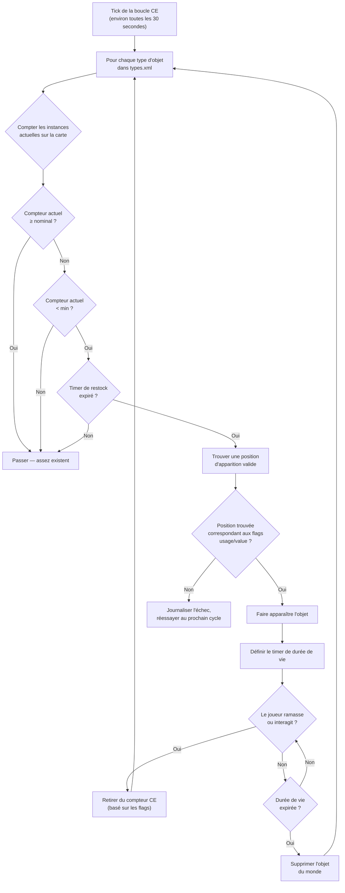

# Chapter 9.4 : Économie du loot en profondeur

[Accueil](../README.md) | [<< Précédent : Référence serverDZ.cfg](03-server-cfg.md) | **Économie du loot en profondeur**

---

> **Résumé :** L'Économie Centrale (CE) est le système qui contrôle chaque apparition d'objet dans DayZ -- d'une boîte de haricots sur une étagère à un AKM dans une caserne militaire. Ce chapitre explique le cycle complet d'apparition, documente chaque champ de `types.xml`, `globals.xml`, `events.xml` et `cfgspawnabletypes.xml` avec des exemples réels tirés des fichiers vanilla du serveur, et couvre les erreurs d'économie les plus courantes.

---

## Table des matières

- [Comment fonctionne l'Économie Centrale](#comment-fonctionne-léconomie-centrale)
- [Le cycle d'apparition](#le-cycle-dapparition)
- [types.xml -- Définitions d'apparition des objets](#typesxml----définitions-dapparition-des-objets)
- [Exemples réels de types.xml](#exemples-réels-de-typesxml)
- [Référence des champs de types.xml](#référence-des-champs-de-typesxml)
- [globals.xml -- Paramètres de l'économie](#globalsxml----paramètres-de-léconomie)
- [events.xml -- Événements dynamiques](#eventsxml----événements-dynamiques)
- [cfgspawnabletypes.xml -- Attachements et cargaison](#cfgspawnabletypesxml----attachements-et-cargaison)
- [La relation Nominal/Restock](#la-relation-nominalrestock)
- [Erreurs d'économie courantes](#erreurs-déconomie-courantes)

---

## Comment fonctionne l'Économie Centrale

L'Économie Centrale (CE) est un système côté serveur qui fonctionne en boucle continue. Son travail est de maintenir la population d'objets du monde aux niveaux définis dans vos fichiers de configuration.

Le CE ne place **pas** les objets quand un joueur entre dans un bâtiment. Au lieu de cela, il fonctionne sur un timer global et fait apparaître les objets sur toute la carte, indépendamment de la proximité des joueurs. Les objets ont une **durée de vie** -- quand ce timer expire et qu'aucun joueur n'a interagi avec l'objet, le CE le supprime. Puis, au cycle suivant, il détecte que le compteur est en dessous de la cible et fait apparaître un remplacement ailleurs.

Concepts clés :

- **Nominal** -- le nombre cible de copies d'un objet qui doivent exister sur la carte
- **Min** -- le seuil en dessous duquel le CE tentera de faire réapparaître l'objet
- **Lifetime** -- combien de temps (en secondes) un objet non touché persiste avant nettoyage
- **Restock** -- temps minimum (en secondes) avant que le CE puisse faire réapparaître un objet après qu'il a été pris/détruit
- **Flags** -- ce qui compte dans le total (sur la carte, dans la cargaison, dans l'inventaire du joueur, dans les caches)

---

## Le cycle d'apparition



En résumé : le CE compte combien de chaque objet existent, compare avec les cibles nominal/min, et fait apparaître des remplacements quand le compteur tombe en dessous de `min` et que le timer `restock` est écoulé.

---

## types.xml -- Définitions d'apparition des objets

C'est le fichier d'économie le plus important. Chaque objet pouvant apparaître dans le monde a besoin d'une entrée ici. Le `types.xml` vanilla pour Chernarus contient environ 23 000 lignes couvrant des milliers d'objets.

### Exemples réels de types.xml

**Arme -- AKM**

```xml
<type name="AKM">
    <nominal>3</nominal>
    <lifetime>7200</lifetime>
    <restock>3600</restock>
    <min>2</min>
    <quantmin>30</quantmin>
    <quantmax>80</quantmax>
    <cost>100</cost>
    <flags count_in_cargo="0" count_in_hoarder="0" count_in_map="1" count_in_player="0" crafted="0" deloot="0"/>
    <category name="weapons"/>
    <usage name="Military"/>
    <value name="Tier4"/>
</type>
```

L'AKM est une arme rare de haut niveau. Seulement 3 peuvent exister sur la carte en même temps (`nominal`). Il apparaît dans les bâtiments militaires des zones Tier 4 (nord-ouest). Quand un joueur en ramasse un, le CE voit le compteur de la carte tomber en dessous de `min=2` et fera apparaître un remplacement après au moins 3600 secondes (1 heure). L'arme apparaît avec 30-80% de munitions dans son chargeur interne (`quantmin`/`quantmax`).

**Nourriture -- BakedBeansCan**

```xml
<type name="BakedBeansCan">
    <nominal>15</nominal>
    <lifetime>14400</lifetime>
    <restock>0</restock>
    <min>12</min>
    <quantmin>-1</quantmin>
    <quantmax>-1</quantmax>
    <cost>100</cost>
    <flags count_in_cargo="0" count_in_hoarder="0" count_in_map="1" count_in_player="0" crafted="0" deloot="0"/>
    <category name="food"/>
    <tag name="shelves"/>
    <usage name="Town"/>
    <usage name="Village"/>
    <value name="Tier1"/>
    <value name="Tier2"/>
    <value name="Tier3"/>
</type>
```

Les haricots sont de la nourriture courante. 15 boîtes doivent exister à tout moment. Ils apparaissent sur les étagères dans les bâtiments de type Town et Village à travers les Tiers 1-3 (côte jusqu'au milieu de la carte). `restock=0` signifie éligibilité instantanée à la réapparition. `quantmin=-1` et `quantmax=-1` signifient que l'objet n'utilise pas le système de quantité (ce n'est pas un conteneur de liquide ou de munitions).

**Vêtement -- RidersJacket_Black**

```xml
<type name="RidersJacket_Black">
    <nominal>14</nominal>
    <lifetime>28800</lifetime>
    <restock>0</restock>
    <min>10</min>
    <quantmin>-1</quantmin>
    <quantmax>-1</quantmax>
    <cost>100</cost>
    <flags count_in_cargo="0" count_in_hoarder="0" count_in_map="1" count_in_player="0" crafted="0" deloot="0"/>
    <category name="clothes"/>
    <usage name="Town"/>
    <value name="Tier1"/>
    <value name="Tier2"/>
</type>
```

Une veste civile courante. 14 copies sur la carte, trouvée dans les bâtiments de type Town près de la côte (Tiers 1-2). Une durée de vie de 28800 secondes (8 heures) signifie qu'elle persiste longtemps si personne ne la ramasse.

**Médical -- BandageDressing**

```xml
<type name="BandageDressing">
    <nominal>40</nominal>
    <lifetime>14400</lifetime>
    <restock>0</restock>
    <min>30</min>
    <quantmin>-1</quantmin>
    <quantmax>-1</quantmax>
    <cost>100</cost>
    <flags count_in_cargo="0" count_in_hoarder="0" count_in_map="1" count_in_player="0" crafted="0" deloot="0"/>
    <category name="tools"/>
    <tag name="shelves"/>
    <usage name="Medic"/>
</type>
```

Les bandages sont très courants (40 nominal). Ils apparaissent dans les bâtiments de type Medic (hôpitaux, cliniques) à travers tous les tiers (aucun tag `<value>` signifie tous les tiers). Notez que la catégorie est `"tools"`, pas `"medical"` -- DayZ n'a pas de catégorie medical ; les objets médicaux utilisent la catégorie tools.

**Objet désactivé (variante artisanale)**

```xml
<type name="AK101_Black">
    <nominal>0</nominal>
    <lifetime>28800</lifetime>
    <restock>0</restock>
    <min>0</min>
    <quantmin>-1</quantmin>
    <quantmax>-1</quantmax>
    <cost>100</cost>
    <flags count_in_cargo="0" count_in_hoarder="0" count_in_map="1" count_in_player="0" crafted="1" deloot="0"/>
    <category name="weapons"/>
</type>
```

`nominal=0` et `min=0` signifient que le CE ne fera jamais apparaître cet objet. `crafted=1` indique qu'il ne peut être obtenu que par l'artisanat (peindre une arme). Il a quand même une durée de vie pour que les instances persistées finissent par être nettoyées.

---

## Référence des champs de types.xml

### Champs principaux

| Champ | Type | Plage | Description |
|-------|------|-------|-------------|
| `name` | string | -- | Nom de classe de l'objet. Doit correspondre exactement au nom de classe du jeu. |
| `nominal` | int | 0+ | Nombre cible de cet objet sur la carte. Mettez à 0 pour empêcher l'apparition. |
| `min` | int | 0+ | Quand le compteur tombe à cette valeur ou en dessous, le CE tentera d'en faire apparaître davantage. |
| `lifetime` | int | secondes | Combien de temps un objet non touché existe avant que le CE le supprime. |
| `restock` | int | secondes | Délai minimum avant que le CE puisse faire apparaître un remplacement. 0 = immédiat. |
| `quantmin` | int | -1 à 100 | Pourcentage de quantité minimum à l'apparition (% munitions, % liquide). -1 = non applicable. |
| `quantmax` | int | -1 à 100 | Pourcentage de quantité maximum à l'apparition. -1 = non applicable. |
| `cost` | int | 0+ | Poids de priorité pour la sélection d'apparition. Actuellement tous les objets vanilla utilisent 100. |

### Flags

```xml
<flags count_in_cargo="0" count_in_hoarder="0" count_in_map="1" count_in_player="0" crafted="0" deloot="0"/>
```

| Flag | Valeurs | Description |
|------|---------|-------------|
| `count_in_map` | 0, 1 | Compter les objets posés au sol ou dans les points d'apparition des bâtiments. **Presque toujours 1.** |
| `count_in_cargo` | 0, 1 | Compter les objets à l'intérieur d'autres conteneurs (sacs à dos, tentes). |
| `count_in_hoarder` | 0, 1 | Compter les objets dans les caches, barils, conteneurs enterrés, tentes. |
| `count_in_player` | 0, 1 | Compter les objets dans l'inventaire du joueur (sur le corps ou en main). |
| `crafted` | 0, 1 | À 1, cet objet ne peut être obtenu que par l'artisanat, pas par le CE. |
| `deloot` | 0, 1 | Loot d'événement dynamique. À 1, l'objet n'apparaît qu'aux emplacements d'événements dynamiques (crashs d'hélicoptères, etc.). |

**La stratégie des flags est importante.** Si `count_in_player=1`, chaque AKM qu'un joueur porte compte dans le nominal. Cela signifie que ramasser un AKM ne déclencherait pas de réapparition car le compteur n'a pas changé. La plupart des objets vanilla utilisent `count_in_player=0` pour que les objets portés par les joueurs ne bloquent pas les réapparitions.

### Tags

| Élément | Objectif | Défini dans |
|---------|----------|-------------|
| `<category name="..."/>` | Catégorie de l'objet pour le matching des points d'apparition | `cfglimitsdefinition.xml` |
| `<usage name="..."/>` | Type de bâtiment où cet objet peut apparaître | `cfglimitsdefinition.xml` |
| `<value name="..."/>` | Zone de tier de la carte où cet objet peut apparaître | `cfglimitsdefinition.xml` |
| `<tag name="..."/>` | Type de position d'apparition dans un bâtiment | `cfglimitsdefinition.xml` |

**Catégories valides :** `tools`, `containers`, `clothes`, `food`, `weapons`, `books`, `explosives`, `lootdispatch`

**Flags d'usage valides :** `Military`, `Police`, `Medic`, `Firefighter`, `Industrial`, `Farm`, `Coast`, `Town`, `Village`, `Hunting`, `Office`, `School`, `Prison`, `Lunapark`, `SeasonalEvent`, `ContaminatedArea`, `Historical`

**Flags de valeur valides :** `Tier1`, `Tier2`, `Tier3`, `Tier4`, `Unique`

**Tags valides :** `floor`, `shelves`, `ground`

Un objet peut avoir **plusieurs** tags `<usage>` et `<value>`. Plusieurs usages signifient qu'il peut apparaître dans n'importe lequel de ces types de bâtiments. Plusieurs valeurs signifient qu'il peut apparaître dans n'importe lequel de ces tiers.

Si vous omettez entièrement `<value>`, l'objet apparaît dans **tous** les tiers. Si vous omettez `<usage>`, l'objet n'a aucun emplacement d'apparition valide et **n'apparaîtra pas**.

---

## globals.xml -- Paramètres de l'économie

Ce fichier contrôle le comportement global du CE. Tous les paramètres du fichier vanilla :

```xml
<variables>
    <var name="AnimalMaxCount" type="0" value="200"/>
    <var name="CleanupAvoidance" type="0" value="100"/>
    <var name="CleanupLifetimeDeadAnimal" type="0" value="1200"/>
    <var name="CleanupLifetimeDeadInfected" type="0" value="330"/>
    <var name="CleanupLifetimeDeadPlayer" type="0" value="3600"/>
    <var name="CleanupLifetimeDefault" type="0" value="45"/>
    <var name="CleanupLifetimeLimit" type="0" value="50"/>
    <var name="CleanupLifetimeRuined" type="0" value="330"/>
    <var name="FlagRefreshFrequency" type="0" value="432000"/>
    <var name="FlagRefreshMaxDuration" type="0" value="3456000"/>
    <var name="FoodDecay" type="0" value="1"/>
    <var name="IdleModeCountdown" type="0" value="60"/>
    <var name="IdleModeStartup" type="0" value="1"/>
    <var name="InitialSpawn" type="0" value="100"/>
    <var name="LootDamageMax" type="1" value="0.82"/>
    <var name="LootDamageMin" type="1" value="0.0"/>
    <var name="LootProxyPlacement" type="0" value="1"/>
    <var name="LootSpawnAvoidance" type="0" value="100"/>
    <var name="RespawnAttempt" type="0" value="2"/>
    <var name="RespawnLimit" type="0" value="20"/>
    <var name="RespawnTypes" type="0" value="12"/>
    <var name="RestartSpawn" type="0" value="0"/>
    <var name="SpawnInitial" type="0" value="1200"/>
    <var name="TimeHopping" type="0" value="60"/>
    <var name="TimeLogin" type="0" value="15"/>
    <var name="TimeLogout" type="0" value="15"/>
    <var name="TimePenalty" type="0" value="20"/>
    <var name="WorldWetTempUpdate" type="0" value="1"/>
    <var name="ZombieMaxCount" type="0" value="1000"/>
    <var name="ZoneSpawnDist" type="0" value="300"/>
</variables>
```

L'attribut `type` indique le type de données : `0` = entier, `1` = flottant.

### Référence complète des paramètres

| Paramètre | Type | Défaut | Description |
|-----------|------|--------|-------------|
| **AnimalMaxCount** | int | 200 | Nombre maximum d'animaux vivants sur la carte en même temps. |
| **CleanupAvoidance** | int | 100 | Distance en mètres d'un joueur où le CE ne nettoiera PAS les objets. Les objets dans ce rayon sont protégés de l'expiration de durée de vie. |
| **CleanupLifetimeDeadAnimal** | int | 1200 | Secondes avant qu'un cadavre d'animal soit supprimé. (20 minutes) |
| **CleanupLifetimeDeadInfected** | int | 330 | Secondes avant qu'un cadavre de zombie soit supprimé. (5,5 minutes) |
| **CleanupLifetimeDeadPlayer** | int | 3600 | Secondes avant qu'un corps de joueur mort soit supprimé. (1 heure) |
| **CleanupLifetimeDefault** | int | 45 | Temps de nettoyage par défaut en secondes pour les objets sans durée de vie spécifique. |
| **CleanupLifetimeLimit** | int | 50 | Nombre maximum d'objets traités par cycle de nettoyage. |
| **CleanupLifetimeRuined** | int | 330 | Secondes avant que les objets ruinés soient nettoyés. (5,5 minutes) |
| **FlagRefreshFrequency** | int | 432000 | Fréquence à laquelle un mât de drapeau doit être "rafraîchi" par interaction pour empêcher la dégradation de la base, en secondes. (5 jours) |
| **FlagRefreshMaxDuration** | int | 3456000 | Durée de vie maximale d'un mât de drapeau même avec un rafraîchissement régulier, en secondes. (40 jours) |
| **FoodDecay** | int | 1 | Activer (1) ou désactiver (0) la détérioration de la nourriture au fil du temps. |
| **IdleModeCountdown** | int | 60 | Secondes avant que le serveur entre en mode veille quand aucun joueur n'est connecté. |
| **IdleModeStartup** | int | 1 | Si le serveur démarre en mode veille (1) ou en mode actif (0). |
| **InitialSpawn** | int | 100 | Pourcentage des valeurs nominales à faire apparaître au premier démarrage du serveur (0-100). |
| **LootDamageMax** | float | 0.82 | État de dégâts maximum pour le loot apparu aléatoirement (0.0 = impeccable, 1.0 = ruiné). |
| **LootDamageMin** | float | 0.0 | État de dégâts minimum pour le loot apparu aléatoirement. |
| **LootProxyPlacement** | int | 1 | Activer (1) le placement visuel des objets sur étagères/tables vs les drops aléatoires au sol. |
| **LootSpawnAvoidance** | int | 100 | Distance en mètres d'un joueur où le CE ne fera PAS apparaître de nouveau loot. Empêche les objets d'apparaître devant les joueurs. |
| **RespawnAttempt** | int | 2 | Nombre de tentatives de position d'apparition par objet par cycle CE avant d'abandonner. |
| **RespawnLimit** | int | 20 | Nombre maximum d'objets que le CE fera réapparaître par cycle. |
| **RespawnTypes** | int | 12 | Nombre maximum de types d'objets différents traités par cycle de réapparition. |
| **RestartSpawn** | int | 0 | À 1, re-randomise toutes les positions de loot au redémarrage du serveur. À 0, charge depuis la persistance. |
| **SpawnInitial** | int | 1200 | Nombre d'objets à faire apparaître lors de la population initiale de l'économie au premier démarrage. |
| **TimeHopping** | int | 60 | Délai en secondes empêchant un joueur de se reconnecter au même serveur (anti-server-hop). |
| **TimeLogin** | int | 15 | Timer de compte à rebours de connexion en secondes (le timer "Veuillez patienter" à la connexion). |
| **TimeLogout** | int | 15 | Timer de compte à rebours de déconnexion en secondes. Le joueur reste dans le monde pendant ce temps. |
| **TimePenalty** | int | 20 | Temps de pénalité supplémentaire en secondes ajouté au timer de déconnexion si le joueur se déconnecte de manière incorrecte (Alt+F4). |
| **WorldWetTempUpdate** | int | 1 | Activer (1) ou désactiver (0) les mises à jour de simulation de température et d'humidité du monde. |
| **ZombieMaxCount** | int | 1000 | Nombre maximum de zombies vivants sur la carte en même temps. |
| **ZoneSpawnDist** | int | 300 | Distance en mètres d'un joueur à laquelle les zones d'apparition de zombies deviennent actives. |

### Ajustements de réglage courants

**Plus de loot (serveur PvP) :**
```xml
<var name="InitialSpawn" type="0" value="100"/>
<var name="RespawnLimit" type="0" value="50"/>
<var name="RespawnTypes" type="0" value="30"/>
<var name="RespawnAttempt" type="0" value="4"/>
```

**Corps morts plus longtemps (plus de temps pour looter les kills) :**
```xml
<var name="CleanupLifetimeDeadPlayer" type="0" value="7200"/>
```

**Dégradation des bases plus rapide (nettoyer les bases inactives plus vite) :**
```xml
<var name="FlagRefreshFrequency" type="0" value="259200"/>
<var name="FlagRefreshMaxDuration" type="0" value="1728000"/>
```

---

## events.xml -- Événements dynamiques

Les événements définissent les apparitions pour les entités nécessitant un traitement spécial : animaux, véhicules et crashs d'hélicoptères. Contrairement aux objets de `types.xml` qui apparaissent à l'intérieur des bâtiments, les événements apparaissent à des positions mondiales prédéfinies listées dans `cfgeventspawns.xml`.

### Exemple réel d'événement de véhicule

```xml
<event name="VehicleCivilianSedan">
    <nominal>8</nominal>
    <min>5</min>
    <max>11</max>
    <lifetime>300</lifetime>
    <restock>0</restock>
    <saferadius>500</saferadius>
    <distanceradius>500</distanceradius>
    <cleanupradius>200</cleanupradius>
    <flags deletable="0" init_random="0" remove_damaged="1"/>
    <position>fixed</position>
    <limit>mixed</limit>
    <active>1</active>
    <children>
        <child lootmax="0" lootmin="0" max="5" min="3" type="CivilianSedan"/>
        <child lootmax="0" lootmin="0" max="5" min="3" type="CivilianSedan_Black"/>
        <child lootmax="0" lootmin="0" max="5" min="3" type="CivilianSedan_Wine"/>
    </children>
</event>
```

### Exemple réel d'événement animal

```xml
<event name="AnimalBear">
    <nominal>0</nominal>
    <min>2</min>
    <max>2</max>
    <lifetime>180</lifetime>
    <restock>0</restock>
    <saferadius>200</saferadius>
    <distanceradius>0</distanceradius>
    <cleanupradius>0</cleanupradius>
    <flags deletable="0" init_random="0" remove_damaged="1"/>
    <position>fixed</position>
    <limit>custom</limit>
    <active>1</active>
    <children>
        <child lootmax="0" lootmin="0" max="1" min="1" type="Animal_UrsusArctos"/>
    </children>
</event>
```

### Référence des champs d'événement

| Champ | Description |
|-------|-------------|
| `name` | Identifiant de l'événement. Doit correspondre à une entrée dans `cfgeventspawns.xml` pour les événements `position="fixed"`. |
| `nominal` | Nombre cible de groupes d'événements actifs sur la carte. |
| `min` | Nombre minimum de membres du groupe par point d'apparition. |
| `max` | Nombre maximum de membres du groupe par point d'apparition. |
| `lifetime` | Secondes avant que l'événement soit nettoyé et réapparu. Pour les véhicules, c'est l'intervalle de vérification de réapparition, pas la durée de vie de persistance du véhicule. |
| `restock` | Secondes minimum entre les réapparitions. |
| `saferadius` | Distance minimum en mètres d'un joueur pour que l'événement apparaisse. |
| `distanceradius` | Distance minimum entre deux instances du même événement. |
| `cleanupradius` | Distance d'un joueur en dessous de laquelle l'événement ne sera PAS nettoyé. |
| `deletable` | Si l'événement peut être supprimé par le CE (0 = non). |
| `init_random` | Randomiser les positions initiales (0 = utiliser les positions fixes). |
| `remove_damaged` | Supprimer l'entité de l'événement si elle devient endommagée/ruinée (1 = oui). |
| `position` | `"fixed"` = utiliser les positions de `cfgeventspawns.xml`. `"player"` = apparaître près des joueurs. |
| `limit` | `"child"` = limite par type d'enfant. `"mixed"` = limite partagée entre tous les enfants. `"custom"` = comportement spécial. |
| `active` | 1 = activé, 0 = désactivé. |

### Enfants

Chaque élément `<child>` définit une variante qui peut apparaître :

| Attribut | Description |
|----------|-------------|
| `type` | Nom de classe de l'entité à faire apparaître. |
| `min` | Nombre minimum d'instances de cette variante (pour `limit="child"`). |
| `max` | Nombre maximum d'instances de cette variante (pour `limit="child"`). |
| `lootmin` | Nombre minimum d'objets de loot apparus à l'intérieur/sur l'entité. |
| `lootmax` | Nombre maximum d'objets de loot apparus à l'intérieur/sur l'entité. |

---

## cfgspawnabletypes.xml -- Attachements et cargaison

Ce fichier définit quels attachements, cargaison et état de dégâts un objet a quand il apparaît. Sans entrée ici, les objets apparaissent vides et avec des dégâts aléatoires (dans la plage `LootDamageMin`/`LootDamageMax` de `globals.xml`).

### Arme avec attachements -- AKM

```xml
<type name="AKM">
    <damage min="0.45" max="0.85" />
    <attachments chance="1.00">
        <item name="AK_PlasticBttstck" chance="1.00" />
    </attachments>
    <attachments chance="1.00">
        <item name="AK_PlasticHndgrd" chance="1.00" />
    </attachments>
    <attachments chance="0.50">
        <item name="KashtanOptic" chance="0.30" />
        <item name="PSO11Optic" chance="0.20" />
    </attachments>
    <attachments chance="0.05">
        <item name="AK_Suppressor" chance="1.00" />
    </attachments>
    <attachments chance="0.30">
        <item name="Mag_AKM_30Rnd" chance="1.00" />
    </attachments>
</type>
```

Lecture de cette entrée :

1. L'AKM apparaît avec des dégâts entre 45-85% (usé à très endommagé)
2. Il reçoit **toujours** (100%) une crosse plastique et un garde-main
3. 50% de chance qu'un emplacement optique soit rempli -- si oui, 30% de chance pour Kashtan, 20% pour PSO-11
4. 5% de chance d'un silencieux
5. 30% de chance d'un chargeur chargé

Chaque bloc `<attachments>` représente un emplacement d'attachement. Le `chance` sur le bloc est la probabilité que cet emplacement soit rempli. Le `chance` sur chaque `<item>` à l'intérieur est le poids de sélection relatif -- le CE choisit un objet de la liste en utilisant ces valeurs comme poids.

### Arme avec attachements -- M4A1

```xml
<type name="M4A1">
    <damage min="0.45" max="0.85" />
    <attachments chance="1.00">
        <item name="M4_OEBttstck" chance="1.00" />
    </attachments>
    <attachments chance="1.00">
        <item name="M4_PlasticHndgrd" chance="1.00" />
    </attachments>
    <attachments chance="1.00">
        <item name="BUISOptic" chance="0.50" />
        <item name="M4_CarryHandleOptic" chance="1.00" />
    </attachments>
    <attachments chance="0.30">
        <item name="Mag_CMAG_40Rnd" chance="0.15" />
        <item name="Mag_CMAG_10Rnd" chance="0.50" />
        <item name="Mag_CMAG_20Rnd" chance="0.70" />
        <item name="Mag_CMAG_30Rnd" chance="1.00" />
    </attachments>
</type>
```

### Gilet avec pochettes -- PlateCarrierVest_Camo

```xml
<type name="PlateCarrierVest_Camo">
    <damage min="0.1" max="0.6" />
    <attachments chance="0.85">
        <item name="PlateCarrierHolster_Camo" chance="1.00" />
    </attachments>
    <attachments chance="0.85">
        <item name="PlateCarrierPouches_Camo" chance="1.00" />
    </attachments>
</type>
```

### Sac à dos avec cargaison

```xml
<type name="AssaultBag_Ttsko">
    <cargo preset="mixArmy" />
    <cargo preset="mixArmy" />
    <cargo preset="mixArmy" />
</type>
```

L'attribut `preset` référence un pool de loot défini dans `cfgrandompresets.xml`. Chaque ligne `<cargo>` est un tirage -- ce sac à dos obtient 3 tirages du pool `mixArmy`. La valeur `chance` propre au pool détermine si chaque tirage produit effectivement un objet.

### Objets de type Hoarder uniquement

```xml
<type name="Barrel_Blue">
    <hoarder />
</type>
<type name="SeaChest">
    <hoarder />
</type>
```

Le tag `<hoarder />` marque les objets comme conteneurs de cache. Le CE compte les objets à l'intérieur de ceux-ci séparément en utilisant le flag `count_in_hoarder` de `types.xml`.

### Remplacement des dégâts d'apparition

```xml
<type name="BandageDressing">
    <damage min="0.0" max="0.0" />
</type>
```

Force les bandages à toujours apparaître en état Impeccable, remplaçant les valeurs globales `LootDamageMin`/`LootDamageMax` de `globals.xml`.

---

## La relation Nominal/Restock

Comprendre comment `nominal`, `min` et `restock` fonctionnent ensemble est essentiel pour régler votre économie.

### Le calcul

```
SI (compteur_actuel < min) ET (temps_depuis_derniere_apparition > restock):
    faire apparaître un nouvel objet (jusqu'à nominal)
```

**Exemple avec l'AKM :**
- `nominal = 3`, `min = 2`, `restock = 3600`
- Le serveur démarre : le CE fait apparaître 3 AKM sur la carte
- Un joueur ramasse 1 AKM : le compteur de la carte tombe à 2
- Le compteur (2) n'est PAS inférieur à min (2), donc pas de réapparition encore
- Un joueur ramasse un autre AKM : le compteur de la carte tombe à 1
- Le compteur (1) EST inférieur à min (2), et le timer de restock (3600s = 1 heure) démarre
- Après 1 heure, le CE fait apparaître 2 nouveaux AKM pour atteindre le nominal (3) à nouveau

**Exemple avec BakedBeansCan :**
- `nominal = 15`, `min = 12`, `restock = 0`
- Un joueur mange une boîte : le compteur de la carte tombe à 14
- Le compteur (14) n'est PAS inférieur à min (12), donc pas de réapparition
- 3 autres boîtes mangées : le compteur tombe à 11
- Le compteur (11) EST inférieur à min (12), restock est 0 (instantané)
- Prochain cycle CE : fait apparaître 4 boîtes pour atteindre le nominal (15)

### Points clés

- **L'écart entre nominal et min** détermine combien d'objets peuvent être "consommés" avant que le CE réagisse. Un petit écart (comme AKM : 3/2) signifie que le CE réagit après seulement 2 ramassages. Un grand écart signifie que plus d'objets peuvent quitter l'économie avant que la réapparition ne se déclenche.

- **restock = 0** rend la réapparition effectivement instantanée (prochain cycle CE). Des valeurs de restock élevées créent de la rareté -- le CE sait qu'il doit en faire apparaître plus mais doit attendre.

- **Lifetime** est indépendant de nominal/min. Même si le CE a fait apparaître un objet pour atteindre le nominal, l'objet sera supprimé quand sa durée de vie expire si personne ne le touche. Cela crée un "roulement" constant d'objets apparaissant et disparaissant sur la carte.

- Les objets que les joueurs ramassent puis déposent (à un emplacement différent) comptent toujours si le flag correspondant est défini. Un AKM déposé au sol compte toujours dans le total de la carte car `count_in_map=1`.

---

## Erreurs d'économie courantes

### L'objet a une entrée types.xml mais n'apparaît pas

**Vérifiez dans l'ordre :**

1. Le `nominal` est-il supérieur à 0 ?
2. L'objet a-t-il au moins un tag `<usage>` ? (Pas d'usage = pas d'emplacement d'apparition valide)
3. Le tag `<usage>` est-il défini dans `cfglimitsdefinition.xml` ?
4. Le tag `<value>` (si présent) est-il défini dans `cfglimitsdefinition.xml` ?
5. Le tag `<category>` est-il valide ?
6. L'objet est-il listé dans `cfgignorelist.xml` ? (Les objets là-dedans sont bloqués)
7. Le flag `crafted` est-il à 1 ? (Les objets artisanaux n'apparaissent jamais naturellement)
8. `RestartSpawn` dans `globals.xml` est-il à 0 avec une persistance existante ? (L'ancienne persistance peut empêcher les nouveaux objets d'apparaître jusqu'à un wipe)

### Les objets apparaissent mais disparaissent immédiatement

La valeur `lifetime` est trop basse. Une durée de vie de 45 secondes (le `CleanupLifetimeDefault`) signifie que l'objet est nettoyé presque immédiatement. Les armes devraient avoir des durées de vie de 7200-28800 secondes.

### Trop ou pas assez d'un objet

Ajustez `nominal` et `min` ensemble. Si vous mettez `nominal=100` mais `min=1`, le CE ne fera pas réapparaître de remplacements tant que 99 objets n'auront pas été pris. Si vous voulez un approvisionnement régulier, gardez `min` proche de `nominal` (par ex. `nominal=20, min=15`).

### Les objets n'apparaissent que dans une zone

Vérifiez vos tags `<value>`. Si un objet n'a que `<value name="Tier4"/>`, il n'apparaîtra que dans la zone militaire nord-ouest de Chernarus. Ajoutez plus de tiers pour le répartir sur la carte :

```xml
<value name="Tier1"/>
<value name="Tier2"/>
<value name="Tier3"/>
<value name="Tier4"/>
```

### Les objets moddés n'apparaissent pas

Lors de l'ajout d'objets d'un mod à `types.xml` :

1. Assurez-vous que le mod est chargé (listé dans le paramètre `-mod=`)
2. Vérifiez que le nom de classe est **exactement** correct (sensible à la casse)
3. Ajoutez les tags catégorie/usage/valeur de l'objet -- avoir seulement une entrée `types.xml` ne suffit pas
4. Si le mod ajoute de nouveaux tags d'usage ou de valeur, ajoutez-les à `cfglimitsdefinitionuser.xml`
5. Vérifiez le log de scripts pour les avertissements sur les noms de classe inconnus

### Les pièces de véhicule n'apparaissent pas à l'intérieur des véhicules

Les pièces de véhicule apparaissent via `cfgspawnabletypes.xml`, pas `types.xml`. Si un véhicule apparaît sans roues ou batterie, vérifiez que le véhicule a une entrée dans `cfgspawnabletypes.xml` avec les définitions d'attachement appropriées.

### Tout le loot est Impeccable ou tout le loot est Ruiné

Vérifiez `LootDamageMin` et `LootDamageMax` dans `globals.xml`. Les valeurs vanilla sont `0.0` et `0.82`. Mettre les deux à `0.0` rend tout impeccable. Mettre les deux à `1.0` rend tout ruiné. Vérifiez aussi les remplacements par objet dans `cfgspawnabletypes.xml`.

### L'économie semble "bloquée" après modification de types.xml

Après la modification des fichiers d'économie, faites l'une de ces actions :
- Supprimez `storage_1/` pour un wipe complet et un nouveau départ de l'économie
- Mettez `RestartSpawn` à `1` dans `globals.xml` pour un redémarrage afin de re-randomiser le loot, puis remettez-le à `0`
- Attendez que les durées de vie des objets expirent naturellement (peut prendre des heures)

---

**Précédent :** [Référence serverDZ.cfg](03-server-cfg.md) | [Accueil](../README.md) | **Suivant :** [Apparition des véhicules et événements dynamiques](05-vehicle-spawning.md)
