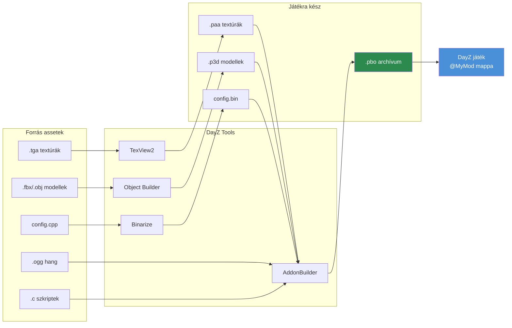

# 4.5. fejezet: DayZ Tools munkafolyamat

[Főoldal](../../README.md) | [<< Előző: Hang](04-audio.md) | **DayZ Tools** | [Következő: PBO csomagolás >>](06-pbo-packing.md)

---

## Bevezetés

A DayZ Tools a Bohemia Interactive által a modderek számára biztosított, Steamen keresztül terjesztett, ingyenes fejlesztői alkalmazáscsomag. Mindent tartalmaz, ami a játék assetek létrehozásához, konvertálásához és csomagolásához szükséges: 3D modellszerkesztő, textúra megjelenítő, terep szerkesztő, szkript hibakereső, és a binarizálási pipeline, amely az ember által olvasható forrásfájlokat optimalizált, játékra kész formátumokká alakítja. Egyetlen DayZ mod sem készíthető el ezen eszközök legalább némelyikének használata nélkül.

Ez a fejezet áttekintést nyújt a csomag minden eszközéről, elmagyarázza a P: meghajtó (workdrive) rendszert, amely az egész munkafolyamat alapját képezi, kitér a fájl javítás (file patching) módra a gyors fejlesztési iterációhoz, és végigvezeti a teljes asset pipeline-t a forrásfájloktól a játszható modig.

---

## Tartalomjegyzék

- [DayZ Tools csomag áttekintés](#dayz-tools-suite-overview)
- [Telepítés és beállítás](#installation-and-setup)
- [P: meghajtó (Workdrive)](#p-drive-workdrive)
- [Object Builder](#object-builder)
- [TexView2](#texview2)
- [Terrain Builder](#terrain-builder)
- [Binarize](#binarize)
- [AddonBuilder](#addonbuilder)
- [Workbench](#workbench)
- [File Patching mód](#file-patching-mode)
- [Teljes munkafolyamat: forrástól a játékig](#complete-workflow-source-to-game)
- [Gyakori hibák](#common-mistakes)
- [Bevált gyakorlatok](#best-practices)

---

## DayZ Tools csomag áttekintés

A DayZ Tools ingyenesen letölthető a Steamen az **Eszközök** kategóriában. Alkalmazások gyűjteményét telepíti, amelyek mindegyike meghatározott szerepet tölt be a modding pipeline-ban.

| Eszköz | Cél | Elsődleges felhasználók |
|--------|-----|------------------------|
| **Object Builder** | 3D modell készítés és szerkesztés (.p3d) | 3D művészek, modellezők |
| **TexView2** | Textúra megjelenítés és konvertálás (.paa, .tga, .png) | Textúra művészek, minden modder |
| **Terrain Builder** | Terep/térkép készítés és szerkesztés | Térkép készítők |
| **Binarize** | Forrásból játékformátumba konvertálás | Build pipeline (általában automatizált) |
| **AddonBuilder** | PBO csomagolás opcionális binarizálással | Minden modder |
| **Workbench** | Szkript hibakeresés, tesztelés, profilozás | Szkriptelők |
| **DayZ Tools Launcher** | Központi hub az eszközök indításához és a P: meghajtó konfigurálásához | Minden modder |

### Hol találhatók a lemezen

A Steam telepítés után az eszközök jellemzően itt találhatók:

```
C:\Program Files (x86)\Steam\steamapps\common\DayZ Tools\
  Bin\
    AddonBuilder\
      AddonBuilder.exe          <-- PBO csomagoló
    Binarize\
      Binarize.exe              <-- Asset konvertáló
    TexView2\
      TexView2.exe              <-- Textúra eszköz
    ObjectBuilder\
      ObjectBuilder.exe         <-- 3D modell szerkesztő
    Workbench\
      workbenchApp.exe          <-- Szkript hibakereső
  TerrainBuilder\
    TerrainBuilder.exe          <-- Terep szerkesztő
```

---

## Telepítés és beállítás

### 1. lépés: DayZ Tools telepítése a Steamről

1. Nyisd meg a Steam Könyvtárat.
2. Engedélyezd az **Eszközök** szűrőt a legördülőben.
3. Keress rá: "DayZ Tools".
4. Telepítsd (ingyenes, körülbelül 2 GB).

### 2. lépés: DayZ Tools indítása

1. Indítsd el a "DayZ Tools"-t a Steamről.
2. Megnyílik a DayZ Tools Launcher -- egy központi hub alkalmazás.
3. Innen bármely egyedi eszközt elindíthatod és beállításokat konfigurálhatsz.

### 3. lépés: P: meghajtó beállítása

Az indító biztosít egy gombot a P: meghajtó (workdrive) létrehozásához és csatolásához. Ez az a virtuális meghajtó, amelyet az összes DayZ eszköz gyökér elérési útként használ.

1. Kattints a **Setup Workdrive** (vagy a P: meghajtó konfigurációs gomb) gombra.
2. Az eszköz létrehoz egy subst-leképezett P: meghajtót, amely a valódi lemezeden lévő könyvtárra mutat.
3. Másold ki vagy hozz létre szimbolikus linket a vanilla DayZ adatokhoz a P:-n, hogy az eszközök hivatkozhassanak a játék assetekre.

---

## P: meghajtó (Workdrive)

A **P: meghajtó** egy Windows virtuális meghajtó (amelyet `subst` vagy junction segítségével hoznak létre), amely egységes gyökér elérési útként szolgál az összes DayZ modding tevékenységhez. A P3D modellekben, RVMAT anyagokban, config.cpp hivatkozásokban és build szkriptekben minden elérési út P:-hoz képest relatív.

### Miért létezik a P: meghajtó

A DayZ asset pipeline-ját egy rögzített gyökér elérési út köré tervezték. Amikor egy anyag hivatkozik a `MyMod\data\texture_co.paa` fájlra, a motor a `P:\MyMod\data\texture_co.paa` helyen keresi. Ez a konvenció biztosítja:

- Minden eszköz egyetért abban, hol vannak a fájlok.
- A csomagolt PBO-kban lévő elérési utak megegyeznek a fejlesztés alatti elérési utakkal.
- Több mod egymás mellett létezhet egyetlen gyökér alatt.

### Struktúra

```
P:\
  DZ\                          <-- Vanilla DayZ kicsomagolt adatok
    characters\
    weapons\
    data\
    ...
  DayZ Tools\                  <-- Eszközök telepítése (vagy symlink)
  MyMod\                       <-- A mod forráskódja
    config.cpp
    Scripts\
    data\
  AnotherMod\                  <-- Egy másik mod forrása
    ...
```

### SetupWorkdrive.bat

Sok mod projekt tartalmaz egy `SetupWorkdrive.bat` szkriptet, amely automatizálja a P: meghajtó létrehozását és a junction beállítást. Egy tipikus szkript:

```batch
@echo off
REM P: meghajtó létrehozása a munkaterületre mutatva
subst P: "D:\DayZModding"

REM Junction-ök létrehozása a vanilla játék adatokhoz
mklink /J "P:\DZ" "C:\Program Files (x86)\Steam\steamapps\common\DayZ\dta"

REM Junction létrehozása az eszközökhöz
mklink /J "P:\DayZ Tools" "C:\Program Files (x86)\Steam\steamapps\common\DayZ Tools"

echo Workdrive P: konfigurálva.
pause
```

> **Tipp:** A workdrive-ot csatolni kell bármely DayZ eszköz indítása előtt. Ha az Object Builder vagy a Binarize nem talál fájlokat, az első ellenőrizendő dolog, hogy a P: csatolva van-e.

---

## Object Builder

Az Object Builder a P3D fájlok 3D modell szerkesztője. Részletesen a [4.2. fejezet: 3D modellek](02-models.md) tárgyalja. Itt összefoglaljuk a szerepét az eszközláncban.

### Fő képességek

- P3D modell fájlok készítése és szerkesztése.
- LOD-ok (részletességi szintek) definiálása vizuális, ütközési és árnyék hálókhoz.
- Anyagok (RVMAT) és textúrák (PAA) hozzárendelése a modell felületekhez.
- Elnevezett szelekciók létrehozása animációkhoz és textúra cserékhez.
- Memória pontok és proxy objektumok elhelyezése.
- Geometria importálása FBX, OBJ és 3DS formátumokból.
- Modellek validálása motor kompatibilitásra.

### Indítás

```
DayZ Tools Launcher --> Object Builder
```

Vagy közvetlenül: `P:\DayZ Tools\Bin\ObjectBuilder\ObjectBuilder.exe`

### Integráció más eszközökkel

- **A TexView2-t használja** textúra előnézetekhez (dupla kattintás egy textúrára a felület tulajdonságokban).
- **P3D fájlokat állít elő**, amelyeket a Binarize és az AddonBuilder használ.
- **P3D fájlokat olvas** a P: meghajtón lévő vanilla adatokból referenciaként.

---

## TexView2

A TexView2 a textúra megjelenítő és konvertáló segédprogram. Kezeli az összes textúra formátum konverziót, amely a DayZ moddinghoz szükséges.

### Fő képességek

- PAA, TGA, PNG, EDDS és DDS fájlok megnyitása és előnézete.
- Formátumok közötti konvertálás (TGA/PNG-ről PAA-ra, PAA-ról TGA-ra, stb.).
- Egyedi csatornák (R, G, B, A) külön megtekintése.
- Mipmap szintek megjelenítése.
- Textúra méretek és tömörítési típus megjelenítése.
- Kötegelt konvertálás parancssorból.

### Indítás

```
DayZ Tools Launcher --> TexView2
```

Vagy közvetlenül: `P:\DayZ Tools\Bin\TexView2\TexView2.exe`

### Gyakori műveletek

**TGA konvertálása PAA-ra:**
1. File --> Open --> válaszd ki a TGA fájlodat.
2. Ellenőrizd, hogy a kép helyesen néz ki.
3. File --> Save As --> válaszd a PAA formátumot.
4. Válaszd ki a tömörítést (DXT1 átlátszatlanhoz, DXT5 alfa csatornáshoz).
5. Mentés.

**Vanilla PAA textúra vizsgálata:**
1. File --> Open --> navigálj a `P:\DZ\...`-hez és válassz ki egy PAA fájlt.
2. Nézd meg a képet. Kattints a csatorna gombokra (R, G, B, A) az egyedi csatornák vizsgálatához.
3. Jegyezd meg a méreteket és tömörítési típust az állapotsávban.

**Parancssori konvertálás:**
```bash
TexView2.exe -i "P:\MyMod\data\texture_co.tga" -o "P:\MyMod\data\texture_co.paa"
```

---

## Terrain Builder

A Terrain Builder egy speciális eszköz egyéni térképek (terepek) készítéséhez. A térkép készítés a DayZ modding egyik legösszetettebb feladata, amely műholdképeket, magassági térképeket, felszín maszkokat és objektum elhelyezést foglal magában.

### Fő képességek

- Műholdképek és magassági térképek importálása.
- Tereprétek definiálása (fű, föld, szikla, homok, stb.).
- Objektumok (épületek, fák, sziklák) elhelyezése a térképen.
- Felszíni textúrák és anyagok konfigurálása.
- Terep adatok exportálása a Binarize számára.

### Mikor van szükség a Terrain Builderre

- Új térkép készítése a semmiből.
- Meglévő terep módosítása (objektumok hozzáadása/eltávolítása, terep alakjának megváltoztatása).
- A Terrain Builder NEM szükséges tárgy modokhoz, fegyver modokhoz, UI modokhoz vagy csak szkript modokhoz.

### Indítás

```
DayZ Tools Launcher --> Terrain Builder
```

> **Megjegyzés:** A terep készítés egy haladó téma, amely saját dedikált útmutatót igényel. Ez a fejezet a Terrain Buildert csak az eszközök áttekintésének részeként tárgyalja.

---

## Binarize

A Binarize az a központi konverziós motor, amely az ember által olvasható forrásfájlokat optimalizált, játékra kész bináris formátumokká alakítja. A PBO csomagolás során (az AddonBuilderen keresztül) a háttérben fut, de közvetlenül is meghívható.

### Mit konvertál a Binarize

| Forrás formátum | Kimeneti formátum | Leírás |
|-----------------|-------------------|--------|
| MLOD `.p3d` | ODOL `.p3d` | Optimalizált 3D modell |
| `.tga` / `.png` / `.edds` | `.paa` | Tömörített textúra |
| `.cpp` (config) | `.bin` | Binarizált konfiguráció (gyorsabb elemzés) |
| `.rvmat` | `.rvmat` (feldolgozott) | Anyag feloldott elérési utakkal |
| `.wrp` | `.wrp` (optimalizált) | Terep világ |

### Mikor szükséges a binarizálás

| Tartalom típus | Binarizálni? | Ok |
|----------------|-------------|-----|
| Config.cpp CfgVehicles-szel | **Igen** | A motor binarizált konfigot igényel tárgy definíciókhoz |
| Config.cpp (csak szkriptek) | Opcionális | Csak szkript konfigok binarizálatlanul is működnek |
| P3D modellek | **Igen** | Az ODOL gyorsabban töltődik, kisebb, motor-optimalizált |
| Textúrák (TGA/PNG) | **Igen** | A PAA futásidőben szükséges |
| Szkriptek (.c fájlok) | **Nem** | A szkriptek változatlanul (szövegként) töltődnek be |
| Hang (.ogg) | **Nem** | Az OGG már játékra kész |
| Layout-ok (.layout) | **Nem** | Változatlanul töltődnek be |

### Közvetlen meghívás

```bash
Binarize.exe -targetPath="P:\build\MyMod" -sourcePath="P:\MyMod" -noLogs
```

A gyakorlatban ritkán hívod meg közvetlenül a Binarize-t -- az AddonBuilder becsomagolja a PBO csomagolási folyamat részeként.

---

## AddonBuilder

Az AddonBuilder a PBO csomagoló eszköz. Egy forrás könyvtárat vesz és létrehoz egy `.pbo` archívumot, opcionálisan előbb lefuttatva a Binarize-t a tartalmon. Részletesen a [4.6. fejezet: PBO csomagolás](06-pbo-packing.md) tárgyalja.

### Gyors referencia

```bash
# Csomagolás binarizálással (tárgy/fegyver modokhoz konfiggal, modellekkel, textúrákkal)
AddonBuilder.exe "P:\MyMod" "P:\output" -prefix="MyMod" -sign="MyKey"

# Csomagolás binarizálás nélkül (csak szkript modokhoz)
AddonBuilder.exe "P:\MyMod" "P:\output" -prefix="MyMod" -packonly
```

### Indítás

A DayZ Tools Launcherből, vagy közvetlenül:
```
P:\DayZ Tools\Bin\AddonBuilder\AddonBuilder.exe
```

Az AddonBuilder GUI módban és parancssori módban is működik. A GUI vizuális fájlböngészőt és opció jelölőnégyzeteket biztosít. A parancssori módot automatizált build szkriptek használják.

---

## Workbench

A Workbench a DayZ Tools-szal kapott szkript fejlesztői környezet. Szkript szerkesztési, hibakeresési és profilozási képességeket biztosít.

### Fő képességek

- **Szkript szerkesztés** szintaxis kiemeléssel Enforce Scripthez.
- **Hibakeresés** töréspontokkal, lépésenkénti végrehajtással és változó vizsgálattal.
- **Profilozás** a szkriptek teljesítmény szűk keresztmetszeteinek azonosítására.
- **Konzol** kifejezések kiértékeléséhez és kódrészletek teszteléséhez.
- **Erőforrás böngésző** a játék adatok vizsgálatához.

### Indítás

```
DayZ Tools Launcher --> Workbench
```

Vagy közvetlenül: `P:\DayZ Tools\Bin\Workbench\workbenchApp.exe`

### Hibakeresési munkafolyamat

1. Nyisd meg a Workbench-et.
2. Állítsd be a projektet, hogy a modod szkriptjeire mutasson.
3. Állíts be töréspontokat a `.c` fájljaidban.
4. Indítsd el a játékot a Workbenchen keresztül (hibakeresési módban indítja a DayZ-t).
5. Amikor a végrehajtás eléri a töréspontot, a Workbench megállítja a játékot és megjeleníti a hívási vermet, a helyi változókat, és lehetővé teszi a lépésenkénti végrehajtást.

### Korlátozások

- A Workbench Enforce Script támogatásában vannak hiányosságok -- nem minden motor API van teljesen dokumentálva az automatikus kiegészítésében.
- Egyes modderek külső szerkesztőket (VS Code közösségi Enforce Script bővítményekkel) preferálnak a kódíráshoz, és a Workbench-et csak hibakereséshez használják.
- A Workbench instabil lehet nagy modokkal vagy összetett töréspont konfigurációkkal.

---

## File Patching mód

A **file patching** egy fejlesztési gyorsítás, amely lehetővé teszi a játék számára, hogy PBO-kba csomagolás helyett közvetlenül a lemezről töltsön be különálló fájlokat. Ez drámaian felgyorsítja az iterációt a fejlesztés során.

### Hogyan működik a File Patching

Amikor a DayZ-t a `-filePatching` paraméterrel indítják, a motor a PBO-k előtt a P: meghajtón keresi a fájlokat. Ha egy fájl létezik a P:-n, a különálló verzió töltődik be a PBO verzió helyett.

```
Normál mód:      Játék betölt --> PBO --> fájlok
File patching:   Játék betölt --> P: meghajtó (ha létezik a fájl) --> PBO (tartalék)
```

### File Patching engedélyezése

Add hozzá a `-filePatching` indítási paramétert a DayZ-hez:

```bash
# Kliens
DayZDiag_x64.exe -filePatching -mod="MyMod" -connect=127.0.0.1

# Szerver
DayZDiag_x64.exe -filePatching -server -mod="MyMod" -config=serverDZ.cfg
```

> **Fontos:** A file patching a **Diag** (diagnosztikai) futtatható fájlt (`DayZDiag_x64.exe`) igényli, nem a kereskedelmi változatot. A kereskedelmi build biztonsági okokból figyelmen kívül hagyja a `-filePatching`-et.

### Mire képes a File Patching

| Asset típus | File Patching működik? | Megjegyzések |
|-------------|----------------------|--------------|
| Szkriptek (.c) | **Igen** | Leggyorsabb iteráció -- szerkesztés, újraindítás, tesztelés |
| Layout-ok (.layout) | **Igen** | UI módosítások újraépítés nélkül |
| Textúrák (.paa) | **Igen** | Textúrák cseréje újraépítés nélkül |
| Config.cpp | **Részben** | Csak binarizálatlan konfigok |
| Modellek (.p3d) | **Igen** | Csak binarizálatlan MLOD P3D |
| Hang (.ogg) | **Igen** | Hangok cseréje újraépítés nélkül |

### Munkafolyamat File Patching-gel

1. Állítsd be a P: meghajtót a mod forrásfájljaiddal.
2. Indítsd el a szervert és klienst `-filePatching`-gel.
3. Szerkessz egy szkript fájlt a szerkesztődben.
4. Indítsd újra a játékot (vagy csatlakozz újra) a változások átvételéhez.
5. Nincs szükség PBO újraépítésre.

> **Tipp:** Csak szkript módosításoknál a file patching teljesen kiküszöböli az építési lépést. Szerkeszted a `.c` fájlokat, újraindítod és tesztelsz. Ez a leggyorsabb elérhető fejlesztési ciklus.

### Korlátozások

- **Nincs binarizált tartalom.** A `CfgVehicles` bejegyzéseket tartalmazó config.cpp nem feltétlenül működik helyesen binarizálás nélkül. A csak szkript konfigok rendben működnek.
- **Nincs kulcs aláírás.** A file patching-elt tartalom nincs aláírva, ezért csak fejlesztés közben működik (nem nyilvános szervereken).
- **Csak Diag build.** A kereskedelmi futtatható fájl figyelmen kívül hagyja a file patching-et.
- **A P: meghajtónak csatolva kell lennie.** Ha a workdrive nincs csatolva, a file patching-nek nincs honnan olvasnia.

---

## Teljes munkafolyamat: forrástól a játékig

Íme a teljes pipeline a forrás assetek játszható moddá alakításához:

### Teljes asset pipeline



### 1. fázis: Forrás assetek készítése

```
3D szoftver (Blender/3dsMax)     -->  FBX export
Képszerkesztő (Photoshop/GIMP)   -->  TGA/PNG export
Hangszerkesztő (Audacity)        -->  OGG export
Szövegszerkesztő (VS Code)       -->  .c szkriptek, config.cpp, .layout fájlok
```

### 2. fázis: Importálás és konvertálás

```
FBX  -->  Object Builder  -->  P3D (LOD-okkal, szelekciókkal, anyagokkal)
TGA  -->  TexView2         -->  PAA (tömörített textúra)
PNG  -->  TexView2         -->  PAA (tömörített textúra)
OGG  -->  (nincs szükség konvertálásra, játékra kész)
```

### 3. fázis: Szervezés a P: meghajtón

```
P:\MyMod\
  config.cpp                    <-- Mod konfiguráció
  Scripts\
    3_Game\                     <-- Korai betöltésű szkriptek
    4_World\                    <-- Entitás/menedzser szkriptek
    5_Mission\                  <-- UI/küldetés szkriptek
  data\
    models\
      my_item.p3d               <-- 3D modell
    textures\
      my_item_co.paa            <-- Diffúz textúra
      my_item_nohq.paa          <-- Normál térkép
      my_item_smdi.paa          <-- Spekuláris térkép
    materials\
      my_item.rvmat             <-- Anyag definíció
  sound\
    my_sound.ogg                <-- Hangfájl
  GUI\
    layouts\
      my_panel.layout           <-- UI layout
```

### 4. fázis: Tesztelés File Patching-gel (fejlesztés)

```
DayZDiag indítása -filePatching-gel
  |
  |--> A motor különálló fájlokat olvas a P:\MyMod\-ból
  |--> Tesztelés játékon belül
  |--> Fájlok szerkesztése közvetlenül a P:-n
  |--> Újraindítás a változások átvételéhez
  |--> Gyors iteráció
```

### 5. fázis: PBO csomagolás (kiadás)

```
AddonBuilder / build szkript
  |
  |--> Forrás olvasása a P:\MyMod\-ból
  |--> Binarize konvertál: P3D-->ODOL, TGA-->PAA, config.cpp-->.bin
  |--> Mindent a MyMod.pbo-ba csomagol
  |--> Aláírás kulccsal: MyMod.pbo.MyKey.bisign
  |--> Kimenet: @MyMod\addons\MyMod.pbo
```

### 6. fázis: Terjesztés

```
@MyMod\
  addons\
    MyMod.pbo                   <-- A csomagolt mod
    MyMod.pbo.MyKey.bisign      <-- Aláírás szerver ellenőrzéshez
  keys\
    MyKey.bikey                 <-- Nyilvános kulcs szerver adminoknak
  mod.cpp                       <-- Mod metaadatok (név, szerző, stb.)
```

A játékosok feliratkoznak a modra a Steam Workshopon, vagy a szerver adminok kézzel telepítik.

---

## Gyakori hibák

### 1. P: meghajtó nincs csatolva

**Tünet:** Minden eszköz "fájl nem található" hibákat jelez. Az Object Builder üres textúrákat mutat.
**Javítás:** Futtasd a `SetupWorkdrive.bat`-odat, vagy csatold a P:-t a DayZ Tools Launcher-en keresztül bármely eszköz indítása előtt.

### 2. Rossz eszköz a feladathoz

**Tünet:** PAA fájl szerkesztésének kísérlete szövegszerkesztőben, vagy P3D megnyitása Notepadben.
**Javítás:** A PAA bináris -- használd a TexView2-t. A P3D bináris -- használd az Object Buildert. A config.cpp szöveges -- használj bármilyen szövegszerkesztőt.

### 3. Vanilla adatok kicsomagolásának elfelejtése

**Tünet:** Az Object Builder nem tudja megjeleníteni a vanilla textúrákat hivatkozott modelleken. Az anyagok rózsaszín/magenta színnel jelennek meg.
**Javítás:** Csomagold ki a vanilla DayZ adatokat a `P:\DZ\`-be, hogy az eszközök fel tudják oldani a játék tartalomra való kereszthivatkozásokat.

### 4. File Patching kereskedelmi futtatható fájllal

**Tünet:** A P: meghajtón lévő fájlok módosításai nem tükröződnek a játékban.
**Javítás:** Használd a `DayZDiag_x64.exe`-t, ne a `DayZ_x64.exe`-t. Csak a Diag build támogatja a `-filePatching`-et.

### 5. Építés P: meghajtó nélkül

**Tünet:** Az AddonBuilder vagy a Binarize elérési út feloldási hibákkal leáll.
**Javítás:** Csatold a P: meghajtót bármely build eszköz futtatása előtt. A modellekben és anyagokban lévő összes elérési út P:-relatív.

---

## Bevált gyakorlatok

1. **Mindig használd a P: meghajtót.** Állj ellen a kísértésnek, hogy abszolút elérési utakat használj. A P: a szabvány és minden eszköz ezt várja el.

2. **Használj file patching-et fejlesztés közben.** Percekről (PBO újraépítés) másodpercekre (játék újraindítás) csökkenti az iterációs időt. Csak kiadási teszteléshez és terjesztéshez készíts PBO-kat.

3. **Automatizáld a build pipeline-t.** Használj szkripteket (`build_pbos.bat`, `dev.py`) az AddonBuilder meghívásának automatizálásához. A kézi GUI csomagolás hibalehetőségeket rejt és lassú a több-PBO-s modokhoz.

4. **Tartsd külön a forrást és a kimenetet.** A forrásfájlok a P:-n élnek. Az elkészült PBO-k külön kimeneti könyvtárba kerülnek. Soha ne keverd őket.

5. **Tanuld meg a billentyűparancsokat.** Az Object Builder és a TexView2 kiterjedt billentyűparancsokkal rendelkezik, amelyek drámaian felgyorsítják a munkát. Fektess időt a megtanulásukba.

6. **Csomagold ki és tanulmányozd a vanilla adatokat.** A legjobb módja annak, hogy megtanuld, hogyan épülnek fel a DayZ assetek, a meglévők vizsgálata. Csomagold ki a vanilla PBO-kat és nyisd meg a modelleket, anyagokat és textúrákat a megfelelő eszközökben.

7. **Használd a Workbench-et hibakereséshez, külső szerkesztőket íráshoz.** A VS Code Enforce Script bővítményekkel jobb szerkesztést nyújt. A Workbench jobb hibakeresést biztosít. Használd mindkettőt.

---

## Valós modokban megfigyelt minták

| Minta | Mod | Részlet |
|-------|-----|---------|
| P: meghajtó junction-ök `SetupWorkdrive.bat`-tal | COT / Community Online Tools | Batch szkriptet szállít, amely junction linkeket hoz létre a mod forrástól a P: meghajtóra az egységes elérési út feloldáshoz |
| `.gproj` Workbench projekt fájlok | Dabs Framework | Workbench projekt fájlokat tartalmaz az Enforce Script töréspontokkal és változó vizsgálattal történő hibakereséséhez |
| Automatizált `dev.py` build orkesztrátor | StarDZ (minden mod) | Python szkript, amely becsomagolja az AddonBuilder hívásokat, több-PBO buildeket kezel, szervert/klienst indít, és naplókat figyel |

---

## Kompatibilitás és hatás

- **Több mod:** Minden DayZ eszköz megosztja a P: meghajtót. Több mod projekt egymás mellett létezhet a `P:\` alatt konfliktus nélkül, amíg a mappa nevek különböznek. Junction ütközések akkor keletkeznek, ha két mod ugyanazt a P: elérési utat használja.
- **Teljesítmény:** A Binarize CPU-igényes és fájlonként egyszálú. A sok P3D modellt és textúrát tartalmazó nagy modok binarizálása 5-10 percet vehet igénybe. A több PBO-ra bontás és a `-packonly` használata szkriptekhez jelentősen csökkenti az építési időt.
- **Verzió:** A DayZ Tools a nagyobb DayZ frissítésekkel együtt frissül. Az Object Builder és a Binarize alkalmanként kap javításokat, de az általános munkafolyamat stabil a DayZ 1.0 óta. Mindig tartsd frissítve a DayZ Tools-t a Steamen keresztül.

---

## Navigáció

| Előző | Fel | Következő |
|-------|-----|-----------|
| [4.4 Hang](04-audio.md) | [4. rész: Fájlformátumok és DayZ Tools](01-textures.md) | [4.6 PBO csomagolás](06-pbo-packing.md) |
