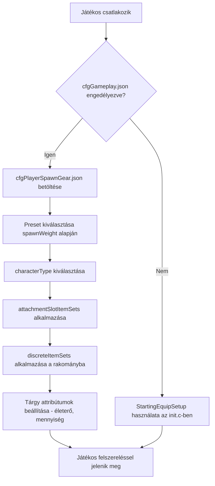

# 5.6. fejezet: Spawn felszerelés konfiguráció

[Főoldal](../../README.md) | [<< Előző: Szerver konfigurációs fájlok](05-server-configs.md) | **Spawn felszerelés konfiguráció**

---

> **Összefoglalás:** A DayZ két egymást kiegészítő rendszerrel rendelkezik, amelyek szabályozzák, hogyan lépnek be a játékosok a világba: a **spawn pontok** határozzák meg, *hol* jelenik meg a karakter a térképen, a **spawn felszerelés** pedig azt, *milyen felszereléssel* rendelkezik. Ez a fejezet mindkét rendszert részletesen tárgyalja, beleértve a fájlstruktúrát, a mezők referenciáját, a gyakorlati preset-eket és a mod integrációt.

---

## Tartalomjegyzék

- [Áttekintés](#overview)
- [A két rendszer](#the-two-systems)
- [Spawn felszerelés: cfgPlayerSpawnGear.json](#spawn-gear-cfgplayerspawngearjson)
  - [Spawn felszerelés preset-ek engedélyezése](#enabling-spawn-gear-presets)
  - [Preset struktúra](#preset-structure)
  - [attachmentSlotItemSets](#attachmentslotitemsets)
  - [DiscreteItemSets](#discreteitemsets)
  - [discreteUnsortedItemSets](#discreteunsorteditemsets)
  - [ComplexChildrenTypes](#complexchildrentypes)
  - [SimpleChildrenTypes](#simplechildrentypes)
  - [Attribútumok](#attributes)
- [Spawn pontok: cfgplayerspawnpoints.xml](#spawn-points-cfgplayerspawnpointsxml)
  - [Fájl struktúra](#file-structure)
  - [spawn_params](#spawn_params)
  - [generator_params](#generator_params)
  - [Spawn csoportok](#spawning-groups)
  - [Térkép-specifikus konfigok](#map-specific-configs)
- [Gyakorlati példák](#practical-examples)
  - [Alapértelmezett túlélő felszerelés](#default-survivor-loadout)
  - [Katonai spawn készlet](#military-spawn-kit)
  - [Orvosi spawn készlet](#medical-spawn-kit)
  - [Véletlenszerű felszerelés kiválasztás](#random-gear-selection)
- [Integráció modokkal](#integration-with-mods)
- [Bevált gyakorlatok](#best-practices)
- [Gyakori hibák](#common-mistakes)

---

## Áttekintés



Amikor egy játékos friss karakterként jelenik meg a DayZ-ben, a szerver két kérdésre válaszol:

1. **Hol jelenik meg a karakter?** --- A `cfgplayerspawnpoints.xml` vezérli.
2. **Mit hord magánál a karakter?** --- A spawn felszerelés preset JSON fájlok vezérlik, amelyeket a `cfggameplay.json`-ban regisztrálnak.

Mindkét rendszer csak szerver oldali. A kliensek soha nem látják ezeket a konfigurációs fájlokat és nem manipulálhatják őket. A spawn felszerelés rendszert az `init.c`-ben történő felszerelés szkriptelés alternatívájaként vezették be, lehetővé téve a szerver adminoknak, hogy több súlyozott preset-et definiáljanak JSON-ban bármilyen Enforce Script kód írása nélkül.

> **Fontos:** A spawn felszerelés preset rendszer **teljesen felülírja** a `StartingEquipSetup()` metódust a küldetés `init.c`-ben. Ha engedélyezed a spawn felszerelés preset-eket a `cfggameplay.json`-ban, a szkriptelt felszerelés kódod figyelmen kívül marad. Hasonlóképpen, a preset-ekben definiált karaktertípusok felülírják a főmenüben választott karakter modellt.

---

## A két rendszer

| Rendszer | Fájl | Formátum | Szabályozza |
|----------|------|----------|-------------|
| Spawn pontok | `cfgplayerspawnpoints.xml` | XML | **Hol** --- térkép pozíciók, távolság pontozás, spawn csoportok |
| Spawn felszerelés | Egyéni preset JSON fájlok | JSON | **Mit** --- karakter modell, ruházat, fegyverek, rakomány, gyorssáv |

A két rendszer független. Használhatsz egyéni spawn pontokat vanilla felszereléssel, egyéni felszerelést vanilla spawn pontokkal, vagy mindkettőt testre szabhatod.

---

## Spawn felszerelés: cfgPlayerSpawnGear.json

### Spawn felszerelés preset-ek engedélyezése

A spawn felszerelés preset-ek alapértelmezés szerint **nincsenek** engedélyezve. Használatukhoz:

1. Hozz létre egy vagy több JSON preset fájlt a küldetés mappádban (pl. `mpmissions/dayzOffline.chernarusplus/`).
2. Regisztráld őket a `cfggameplay.json`-ban a `PlayerData.spawnGearPresetFiles` alatt.
3. Győződj meg, hogy az `enableCfgGameplayFile = 1` be van állítva a `serverDZ.cfg`-ben.

```json
{
  "version": 122,
  "PlayerData": {
    "spawnGearPresetFiles": [
      "survivalist.json",
      "casual.json",
      "military.json"
    ]
  }
}
```

A preset fájlok a küldetés mappa alkönyvtáraiba is beágyazhatók:

```json
"spawnGearPresetFiles": [
  "custom/survivalist.json",
  "custom/casual.json",
  "custom/military.json"
]
```

Minden JSON fájl egyetlen preset objektumot tartalmaz. Az összes regisztrált preset össze van gyűjtve, és a szerver a `spawnWeight` alapján választ egyet minden alkalommal, amikor friss karakter jelenik meg.

### Preset struktúra

A preset a legfelső szintű JSON objektum ezekkel a mezőkkel:

| Mező | Típus | Leírás |
|------|-------|--------|
| `name` | string | Ember által olvasható név a preset-hez (bármilyen sztring, csak azonosításra használt) |
| `spawnWeight` | integer | Súly a véletlenszerű kiválasztáshoz. Minimum `1`. Magasabb értékek nagyobb valószínűséget adnak ennek a preset-nek |
| `characterTypes` | array | Karaktertípus osztálynevek tömbje (pl. `"SurvivorM_Mirek"`). Véletlenszerűen egy kerül kiválasztásra, amikor ez a preset megjelenik |
| `attachmentSlotItemSets` | array | `AttachmentSlots` struktúrák tömbje, amelyek meghatározzák, mit visel a karakter (ruházat, fegyverek a vállon, stb.) |
| `discreteUnsortedItemSets` | array | `DiscreteUnsortedItemSets` struktúrák tömbje, amelyek rakomány tárgyakat definiálnak bármely elérhető leltár helyre |

> **Megjegyzés:** Ha a `characterTypes` üres vagy ki van hagyva, a főmenü karakter létrehozó képernyőjén utoljára kiválasztott karakter modell lesz használva az adott preset-hez.

Minimális példa:

```json
{
  "spawnWeight": 1,
  "name": "Basic Survivor",
  "characterTypes": [
    "SurvivorM_Mirek",
    "SurvivorF_Eva"
  ],
  "attachmentSlotItemSets": [],
  "discreteUnsortedItemSets": []
}
```

### attachmentSlotItemSets

Ez a tömb meghatározza azokat a tárgyakat, amelyek meghatározott karakter kiegészítő csatlakozási pontokba kerülnek --- test, lábak, lábfej, fej, hát, mellény, vállak, szemüveg, stb.

Minden bejegyzés egy csatlakozási pontot céloz:

| Mező | Típus | Leírás |
|------|-------|--------|
| `slotName` | string | A kiegészítő csatlakozási pont neve. A CfgSlots-ból származik. Gyakori értékek: `"Body"`, `"Legs"`, `"Feet"`, `"Head"`, `"Back"`, `"Vest"`, `"Eyewear"`, `"Gloves"`, `"Hips"`, `"shoulderL"`, `"shoulderR"` |
| `discreteItemSets` | array | Tárgy változatok tömbje, amelyek kitölthetik ezt a csatlakozási pontot (egy kerül kiválasztásra a `spawnWeight` alapján) |

> **Váll gyorsparancsok:** Használhatod a `"shoulderL"` és `"shoulderR"` csatlakozási pont neveket. A motor automatikusan lefordítja ezeket a helyes belső CfgSlots nevekre.

```json
{
  "slotName": "Body",
  "discreteItemSets": [
    {
      "itemType": "TShirt_Beige",
      "spawnWeight": 1,
      "attributes": {
        "healthMin": 0.45,
        "healthMax": 0.65,
        "quantityMin": 1.0,
        "quantityMax": 1.0
      },
      "quickBarSlot": -1
    },
    {
      "itemType": "TShirt_Black",
      "spawnWeight": 1,
      "attributes": {
        "healthMin": 0.45,
        "healthMax": 0.65,
        "quantityMin": 1.0,
        "quantityMax": 1.0
      },
      "quickBarSlot": -1
    }
  ]
}
```

### DiscreteItemSets

A `discreteItemSets` minden bejegyzése egy lehetséges tárgyat jelöl az adott csatlakozási pontra. A szerver véletlenszerűen választ egy bejegyzést, a `spawnWeight` által súlyozva. Ezt a struktúrát mind az `attachmentSlotItemSets`-en belül (csatlakozási pont alapú tárgyakhoz) használják, és ez a véletlenszerű kiválasztás mechanizmusa.

| Mező | Típus | Leírás |
|------|-------|--------|
| `itemType` | string | Tárgy osztálynév (típusnév). Használj `""` (üres sztring) értéket a "semmi" jelölésére --- a csatlakozási pont üresen marad |
| `spawnWeight` | integer | Súly a kiválasztáshoz. Minimum `1`. Magasabb = valószínűbb |
| `attributes` | object | Életerő és mennyiség tartományok ehhez a tárgyhoz. Lásd: [Attribútumok](#attributes) |
| `quickBarSlot` | integer | Gyorssáv hely hozzárendelés (0-alapú). Használj `-1`-et a gyorssáv hozzárendelés mellőzéséhez |
| `complexChildrenTypes` | array | Tárgyak, amelyeket ezen belül kell megjeleníteni. Lásd: [ComplexChildrenTypes](#complexchildrentypes) |
| `simpleChildrenTypes` | array | Tárgy osztálynevek, amelyeket ezen belül kell megjeleníteni alapértelmezett vagy szülői attribútumokkal |
| `simpleChildrenUseDefaultAttributes` | bool | Ha `true`, az egyszerű gyermekek a szülő `attributes`-ét használják. Ha `false`, a konfigurációs alapértékeket használják |

**Üres tárgy trükk:** Ha azt akarod, hogy egy csatlakozási pontnak 50/50 esélye legyen üresnek vagy kitöltöttnek lenni, használj üres `itemType`-ot:

```json
{
  "slotName": "Eyewear",
  "discreteItemSets": [
    {
      "itemType": "AviatorGlasses",
      "spawnWeight": 1,
      "attributes": {
        "healthMin": 1.0,
        "healthMax": 1.0
      },
      "quickBarSlot": -1
    },
    {
      "itemType": "",
      "spawnWeight": 1
    }
  ]
}
```

### discreteUnsortedItemSets

Ez a felső szintű tömb határozza meg azokat a tárgyakat, amelyek a karakter **rakományába** kerülnek --- bármely elérhető leltár helyre az összes felszerelt ruházaton és konténeren keresztül. Az `attachmentSlotItemSets`-tel ellentétben ezek a tárgyak nem egy meghatározott csatlakozási pontba kerülnek; a motor automatikusan talál helyet.

Minden bejegyzés egy rakomány változatot jelöl, és a szerver a `spawnWeight` alapján választ egyet.

| Mező | Típus | Leírás |
|------|-------|--------|
| `name` | string | Ember által olvasható név (csak azonosításra) |
| `spawnWeight` | integer | Súly a kiválasztáshoz. Minimum `1` |
| `attributes` | object | Alapértelmezett életerő/mennyiség tartományok. Gyermekek használják, amikor a `simpleChildrenUseDefaultAttributes` értéke `true` |
| `complexChildrenTypes` | array | Tárgyak a rakományba, mindegyik saját attribútumokkal és beágyazással |
| `simpleChildrenTypes` | array | Tárgy osztálynevek a rakományba |
| `simpleChildrenUseDefaultAttributes` | bool | Ha `true`, az egyszerű gyermekek ennek a struktúrának az `attributes`-ét használják. Ha `false`, a konfigurációs alapértékeket használják |

```json
{
  "name": "Cargo1",
  "spawnWeight": 1,
  "attributes": {
    "healthMin": 1.0,
    "healthMax": 1.0,
    "quantityMin": 1.0,
    "quantityMax": 1.0
  },
  "complexChildrenTypes": [
    {
      "itemType": "BandageDressing",
      "attributes": {
        "healthMin": 1.0,
        "healthMax": 1.0,
        "quantityMin": 1.0,
        "quantityMax": 1.0
      },
      "quickBarSlot": 2
    }
  ],
  "simpleChildrenUseDefaultAttributes": false,
  "simpleChildrenTypes": [
    "Rag",
    "Apple"
  ]
}
```

### ComplexChildrenTypes

Az összetett gyermekek olyan tárgyak, amelyek egy szülő tárgyon **belül** jelennek meg, teljes ellenőrzéssel az attribútumaik, gyorssáv hozzárendelésük és saját beágyazott gyermekeik felett. Az elsődleges felhasználási eset tartalommal rendelkező tárgyak megjelenítése --- például fegyver kiegészítőkkel, vagy fazék étellel benne.

| Mező | Típus | Leírás |
|------|-------|--------|
| `itemType` | string | Tárgy osztálynév |
| `attributes` | object | Életerő/mennyiség tartományok ehhez a konkrét tárgyhoz |
| `quickBarSlot` | integer | Gyorssáv hely hozzárendelés. `-1` = ne rendeljen |
| `simpleChildrenUseDefaultAttributes` | bool | Az egyszerű gyermekek öröklik-e ezeket az attribútumokat |
| `simpleChildrenTypes` | array | Tárgy osztálynevek, amelyeket ezen belül kell megjeleníteni |

Példa --- fegyver kiegészítőkkel és tárral:

```json
{
  "itemType": "AKM",
  "attributes": {
    "healthMin": 0.5,
    "healthMax": 1.0,
    "quantityMin": 1.0,
    "quantityMax": 1.0
  },
  "quickBarSlot": 1,
  "complexChildrenTypes": [
    {
      "itemType": "AK_PlasticBttstck",
      "attributes": {
        "healthMin": 0.4,
        "healthMax": 0.6
      },
      "quickBarSlot": -1
    },
    {
      "itemType": "PSO1Optic",
      "attributes": {
        "healthMin": 0.1,
        "healthMax": 0.2
      },
      "quickBarSlot": -1,
      "simpleChildrenUseDefaultAttributes": true,
      "simpleChildrenTypes": [
        "Battery9V"
      ]
    },
    {
      "itemType": "Mag_AKM_30Rnd",
      "attributes": {
        "healthMin": 0.5,
        "healthMax": 0.5,
        "quantityMin": 1.0,
        "quantityMax": 1.0
      },
      "quickBarSlot": -1
    }
  ],
  "simpleChildrenUseDefaultAttributes": false,
  "simpleChildrenTypes": [
    "AK_PlasticHndgrd",
    "AK_Bayonet"
  ]
}
```

Ebben a példában az AKM egy tussal, optikával (elemmel benne) és töltött tárral jelenik meg összetett gyermekekként, plusz egy kézvédővel és szuronnyal egyszerű gyermekekként. Az egyszerű gyermekek konfigurációs alapértékeket használnak, mert a `simpleChildrenUseDefaultAttributes` értéke `false`.

### SimpleChildrenTypes

Az egyszerű gyermekek egy rövidítés tárgyak szülőn belüli megjelenítéséhez egyedi attribútumok megadása nélkül. Tárgy osztálynevek (sztringek) tömbje.

Az attribútumaikat a `simpleChildrenUseDefaultAttributes` jelző határozza meg:

- **`true`** --- A tárgyak a szülő struktúrán definiált `attributes`-t használják.
- **`false`** --- A tárgyak a motor konfigurációs alapértékeit használják (jellemzően teljes életerő és mennyiség).

Az egyszerű gyermekeknek nem lehetnek saját beágyazott gyermekeik vagy gyorssáv hozzárendeléseik. Ezekhez a képességekhez használd a `complexChildrenTypes`-ot.

### Attribútumok

Az attribútumok szabályozzák a megjelenített tárgyak állapotát és mennyiségét. Minden érték `0.0` és `1.0` közötti lebegőpontos szám:

| Mező | Típus | Leírás |
|------|-------|--------|
| `healthMin` | float | Minimális életerő százalék. `1.0` = hibátlan, `0.0` = tönkrement |
| `healthMax` | float | Maximális életerő százalék. Véletlenszerű érték a min és max között kerül alkalmazásra |
| `quantityMin` | float | Minimális mennyiség százalék. Tárakhoz: töltöttségi szint. Ételhez: maradék falatok |
| `quantityMax` | float | Maximális mennyiség százalék |

Amikor mind a min, mind a max meg van adva, a motor véletlenszerű értéket választ abban a tartományban. Ez természetes variációt hoz létre --- például a `0.45` és `0.65` közötti életerő azt jelenti, hogy a tárgyak kopott-sérült állapotban jelennek meg.

```json
"attributes": {
  "healthMin": 0.45,
  "healthMax": 0.65,
  "quantityMin": 1.0,
  "quantityMax": 1.0
}
```

---

## Spawn pontok: cfgplayerspawnpoints.xml

Ez az XML fájl határozza meg, hol jelennek meg a játékosok a térképen. A küldetés mappában található (pl. `mpmissions/dayzOffline.chernarusplus/cfgplayerspawnpoints.xml`).

### Fájl struktúra

A gyökérelem legfeljebb három szekciót tartalmaz:

| Szekció | Cél |
|---------|-----|
| `<fresh>` | **Kötelező.** Spawn pontok újonnan létrehozott karakterekhez |
| `<hop>` | Spawn pontok másik szerverről ugró játékosokhoz ugyanazon a térképen (csak hivatalos szervereken) |
| `<travel>` | Spawn pontok másik térképről utazó játékosokhoz (csak hivatalos szervereken) |

Minden szekció ugyanazt a három alelemet tartalmazza: `<spawn_params>`, `<generator_params>` és `<generator_posbubbles>`.

```xml
<?xml version="1.0" encoding="UTF-8" standalone="yes" ?>
<playerspawnpoints>
    <fresh>
        <spawn_params>...</spawn_params>
        <generator_params>...</generator_params>
        <generator_posbubbles>...</generator_posbubbles>
    </fresh>
    <hop>
        <spawn_params>...</spawn_params>
        <generator_params>...</generator_params>
        <generator_posbubbles>...</generator_posbubbles>
    </hop>
    <travel>
        <spawn_params>...</spawn_params>
        <generator_params>...</generator_params>
        <generator_posbubbles>...</generator_posbubbles>
    </travel>
</playerspawnpoints>
```

### spawn_params

Futásidejű paraméterek, amelyek a jelölt spawn pontokat pontozó entitásokhoz mérik. A `min_dist` alatti pontok érvénytelenítésre kerülnek. A `min_dist` és `max_dist` közötti pontokat előnyben részesítik a `max_dist`-en túli pontokkal szemben.

```xml
<spawn_params>
    <min_dist_infected>30</min_dist_infected>
    <max_dist_infected>70</max_dist_infected>
    <min_dist_player>65</min_dist_player>
    <max_dist_player>150</max_dist_player>
    <min_dist_static>0</min_dist_static>
    <max_dist_static>2</max_dist_static>
</spawn_params>
```

| Paraméter | Leírás |
|-----------|--------|
| `min_dist_infected` | Minimális méterek a fertőzöttektől. Az ennél közelebbi pontok büntetést kapnak |
| `max_dist_infected` | Maximális pontozási távolság a fertőzöttektől |
| `min_dist_player` | Minimális méterek más játékosoktól. Meggátolja, hogy friss spawn-ok meglévő játékosokon jelenjenek meg |
| `max_dist_player` | Maximális pontozási távolság más játékosoktól |
| `min_dist_static` | Minimális méterek épületektől/objektumoktól |
| `max_dist_static` | Maximális pontozási távolság épületektől/objektumoktól |

A Sakhal térkép `min_dist_trigger` és `max_dist_trigger` paramétereket is hozzáad 6x-os súlyszorzóval a trigger zóna távolságokhoz.

**Pontozási logika:** A motor pontszámot számol minden jelölt pontra. A `0`-tól `min_dist`-ig `-1`-et pontoz (szinte érvénytelenítve). A `min_dist`-tól a középpontig `1.1`-ig pontoz. A középponttól `max_dist`-ig `1.1`-ről `0.1`-re csökken. A `max_dist`-en túl `0`-t pontoz. Magasabb összpontszám = valószínűbb spawn hely.

### generator_params

Szabályozza, hogyan generálódik a jelölt spawn pontok rácsa minden pozíció buborék körül:

```xml
<generator_params>
    <grid_density>4</grid_density>
    <grid_width>200</grid_width>
    <grid_height>200</grid_height>
    <min_dist_static>0</min_dist_static>
    <max_dist_static>2</max_dist_static>
    <min_steepness>-45</min_steepness>
    <max_steepness>45</max_steepness>
</generator_params>
```

| Paraméter | Leírás |
|-----------|--------|
| `grid_density` | Mintavételi frekvencia. `4` egy 4x4 rácsot jelent a jelölt pontokból. Magasabb = több jelölt, több CPU költség. Legalább `1` kell legyen. `0` esetén csak a középpont kerül felhasználásra |
| `grid_width` | A mintavételi téglalap teljes szélessége méterben |
| `grid_height` | A mintavételi téglalap teljes magassága méterben |
| `min_dist_static` | Minimális távolság épületektől egy érvényes jelölthöz |
| `max_dist_static` | Maximális távolság épületektől a pontozáshoz |
| `min_steepness` | Minimális terep lejtés fokban. A meredekebb terepű pontok eldobásra kerülnek |
| `max_steepness` | Maximális terep lejtés fokban |

Minden `<pos>` körül, amely a `generator_posbubbles`-ban van definiálva, a motor egy `grid_width` x `grid_height` méteres téglalapot hoz létre, `grid_density` frekvenciával mintavételez, és eldobja azokat a pontokat, amelyek objektumokkal, vízzel ütköznek, vagy meghaladják a lejtés korlátokat.

### Spawn csoportok

A csoportok lehetővé teszik a spawn pontok klaszterezését és időbeli rotálását. Ez megakadályozza, hogy minden játékos mindig ugyanazokon a helyeken jelenjen meg.

A csoportok a `<group_params>` elemmel engedélyezhetők minden szekción belül:

```xml
<group_params>
    <enablegroups>true</enablegroups>
    <groups_as_regular>true</groups_as_regular>
    <lifetime>240</lifetime>
    <counter>-1</counter>
</group_params>
```

| Paraméter | Leírás |
|-----------|--------|
| `enablegroups` | `true` a csoport rotáció engedélyezéséhez, `false` a pontok lapos listájához |
| `groups_as_regular` | Ha az `enablegroups` `false`, a csoportos pontokat normál spawn pontokként kezeli figyelmen kívül hagyásuk helyett. Alapértelmezés: `true` |
| `lifetime` | Másodpercek, amíg egy csoport aktív marad, mielőtt egy másikra rotál. Használj `-1`-et az időzítő kikapcsolásához |
| `counter` | Spawn-ok száma, amelyek visszaállítják az élettartamot. Minden játékos, aki a csoportban spawn-ol, visszaállítja az időzítőt. Használj `-1`-et a számláló kikapcsolásához |

A pozíciók elnevezett csoportokba vannak szervezve a `<generator_posbubbles>`-on belül:

```xml
<generator_posbubbles>
    <group name="WestCherno">
        <pos x="6063.018555" z="1931.907227" />
        <pos x="5933.964844" z="2171.072998" />
        <pos x="6199.782715" z="2241.805176" />
    </group>
    <group name="EastCherno">
        <pos x="8040.858398" z="3332.236328" />
        <pos x="8207.115234" z="3115.650635" />
    </group>
</generator_posbubbles>
```

Az egyedi csoportok felülírhatják a globális lifetime és counter értékeket:

```xml
<group name="Tents" lifetime="300" counter="25">
    <pos x="4212.421875" z="11038.256836" />
</group>
```

**Csoportok nélkül** a pozíciók közvetlenül a `<generator_posbubbles>` alatt vannak felsorolva:

```xml
<generator_posbubbles>
    <pos x="4212.421875" z="11038.256836" />
    <pos x="4712.299805" z="10595" />
    <pos x="5334.310059" z="9850.320313" />
</generator_posbubbles>
```

> **Pozíció formátum:** Az `x` és `z` attribútumok DayZ világ koordinátákat használnak. Az `x` kelet-nyugat, a `z` észak-dél. Az `y` (magasság) koordináta nincs megadva --- a motor a terep felszínre helyezi a pontot. A koordinátákat a játékon belüli debug monitor vagy a DayZ Editor mod használatával találhatod meg.

### Térkép-specifikus konfigok

Minden térkép saját `cfgplayerspawnpoints.xml` fájllal rendelkezik a küldetés mappájában:

| Térkép | Küldetés mappa | Megjegyzések |
|--------|----------------|--------------|
| Chernarus | `dayzOffline.chernarusplus/` | Parti spawn-ok: Cherno, Elektro, Kamyshovo, Berezino, Svetlojarsk |
| Livonia | `dayzOffline.enoch/` | Elosztva a térképen különböző csoport nevekkel |
| Sakhal | `dayzOffline.sakhal/` | Hozzáadott `min_dist_trigger`/`max_dist_trigger` paraméterek, részletesebb megjegyzések |

Egyéni térkép készítésekor vagy spawn helyek módosításakor mindig a vanilla fájlból indulj ki és igazítsd a pozíciókat a térképed földrajzához.

---

## Gyakorlati példák

### Alapértelmezett túlélő felszerelés

A vanilla preset véletlenszerű pólót, vászon nadrágot, sportcipőt ad a friss spawn-oknak, plusz rakomány tartalmat: kötszert, fényrúdat (véletlenszerű szín) és gyümölcsöt (véletlenszerű: körte, szilva vagy alma). Minden tárgy kopott-sérült állapotban jelenik meg.

```json
{
  "spawnWeight": 1,
  "name": "Player",
  "characterTypes": [
    "SurvivorM_Mirek",
    "SurvivorM_Boris",
    "SurvivorM_Denis",
    "SurvivorF_Eva",
    "SurvivorF_Frida",
    "SurvivorF_Gabi"
  ],
  "attachmentSlotItemSets": [
    {
      "slotName": "Body",
      "discreteItemSets": [
        {
          "itemType": "TShirt_Beige",
          "spawnWeight": 1,
          "attributes": {
            "healthMin": 0.45,
            "healthMax": 0.65,
            "quantityMin": 1.0,
            "quantityMax": 1.0
          },
          "quickBarSlot": -1
        },
        {
          "itemType": "TShirt_Black",
          "spawnWeight": 1,
          "attributes": {
            "healthMin": 0.45,
            "healthMax": 0.65,
            "quantityMin": 1.0,
            "quantityMax": 1.0
          },
          "quickBarSlot": -1
        }
      ]
    },
    {
      "slotName": "Legs",
      "discreteItemSets": [
        {
          "itemType": "CanvasPantsMidi_Beige",
          "spawnWeight": 1,
          "attributes": {
            "healthMin": 0.45,
            "healthMax": 0.65,
            "quantityMin": 1.0,
            "quantityMax": 1.0
          },
          "quickBarSlot": -1
        }
      ]
    },
    {
      "slotName": "Feet",
      "discreteItemSets": [
        {
          "itemType": "AthleticShoes_Black",
          "spawnWeight": 1,
          "attributes": {
            "healthMin": 0.45,
            "healthMax": 0.65,
            "quantityMin": 1.0,
            "quantityMax": 1.0
          },
          "quickBarSlot": -1
        }
      ]
    }
  ],
  "discreteUnsortedItemSets": [
    {
      "name": "Cargo1",
      "spawnWeight": 1,
      "attributes": {
        "healthMin": 1.0,
        "healthMax": 1.0,
        "quantityMin": 1.0,
        "quantityMax": 1.0
      },
      "complexChildrenTypes": [
        {
          "itemType": "BandageDressing",
          "attributes": {
            "healthMin": 1.0,
            "healthMax": 1.0,
            "quantityMin": 1.0,
            "quantityMax": 1.0
          },
          "quickBarSlot": 2
        },
        {
          "itemType": "Chemlight_Red",
          "attributes": {
            "healthMin": 1.0,
            "healthMax": 1.0,
            "quantityMin": 1.0,
            "quantityMax": 1.0
          },
          "quickBarSlot": 1
        },
        {
          "itemType": "Pear",
          "attributes": {
            "healthMin": 1.0,
            "healthMax": 1.0,
            "quantityMin": 1.0,
            "quantityMax": 1.0
          },
          "quickBarSlot": 3
        }
      ]
    }
  ]
}
```

### Véletlenszerű felszerelés kiválasztás

Randomizált felszereléseket hozhatsz létre különböző súlyú preset-ek használatával, és minden preset-en belül több `discreteItemSets` használatával csatlakozási pontonként:

**Fájl: `cfggameplay.json`**

```json
"spawnGearPresetFiles": [
  "presets/common_survivor.json",
  "presets/rare_military.json",
  "presets/uncommon_hunter.json"
]
```

**Valószínűség számítási példa:**

| Preset fájl | spawnWeight | Esély |
|-------------|------------|-------|
| `common_survivor.json` | 5 | 5/8 = 62.5% |
| `uncommon_hunter.json` | 2 | 2/8 = 25.0% |
| `rare_military.json` | 1 | 1/8 = 12.5% |

Minden preset-en belül minden csatlakozási pont saját randomizálással is rendelkezik. Ha a Body csatlakozási pontnak három póló opciója van egyenként `spawnWeight: 1`-gyel, mindegyiknek 33% esélye van. Egy `spawnWeight: 3` értékű póló két `spawnWeight: 1` értékű tárgy mellett 60% eséllyel rendelkezne (3/5).

---

## Integráció modokkal

### A JSON preset rendszer használata modokból

A spawn felszerelés preset rendszer küldetés szintű konfigurációra tervezett. Azok a modok, amelyek egyéni felszereléseket akarnak biztosítani:

1. **Szállítsanak sablon JSON** fájlt a mod dokumentációjával, ne a PBO-ba beágyazva.
2. **Dokumentálják az osztályneveket**, hogy a szerver adminok hozzáadhassák a mod tárgyakat saját preset fájljaikhoz.
3. Hagyják, hogy a szerver adminok regisztrálják a preset fájlt a `cfggameplay.json`-jukon keresztül.

### Felülírás init.c-vel

Ha programozottan kell szabályoznod a spawn-olást (pl. szerep kiválasztás, adatbázis-vezérelt felszerelések, vagy feltételes felszerelés a játékos állapota alapján), írd felül a `StartingEquipSetup()`-ot az `init.c`-ben:

```c
override void StartingEquipSetup(PlayerBase player, bool clothesChosen)
{
    player.RemoveAllItems();

    EntityAI jacket = player.GetInventory().CreateInInventory("GorkaEJacket_Flat");
    player.GetInventory().CreateInInventory("GorkaPants_Flat");
    player.GetInventory().CreateInInventory("MilitaryBoots_Bluerock");

    if (jacket)
    {
        jacket.GetInventory().CreateInInventory("BandageDressing");
        jacket.GetInventory().CreateInInventory("Rag");
    }

    EntityAI weapon = player.GetHumanInventory().CreateInHands("AKM");
    if (weapon)
    {
        weapon.GetInventory().CreateInInventory("Mag_AKM_30Rnd");
        weapon.GetInventory().CreateInInventory("AK_PlasticBttstck");
        weapon.GetInventory().CreateInInventory("AK_PlasticHndgrd");
    }
}
```

> **Emlékeztető:** Ha a `spawnGearPresetFiles` konfigurálva van a `cfggameplay.json`-ban, a JSON preset-ek élveznek elsőbbséget és a `StartingEquipSetup()` nem lesz meghívva.

### Mod tárgyak preset-ekben

A moddolt tárgyak azonosan működnek a vanilla tárgyakkal a preset fájlokban. Használd a tárgy osztálynevét, ahogy a mod `config.cpp`-jében definiált:

```json
{
  "itemType": "MyMod_CustomRifle",
  "spawnWeight": 1,
  "attributes": {
    "healthMin": 1.0,
    "healthMax": 1.0
  },
  "quickBarSlot": 1,
  "simpleChildrenUseDefaultAttributes": false,
  "simpleChildrenTypes": [
    "MyMod_CustomMag_30Rnd",
    "MyMod_CustomOptic"
  ]
}
```

Ha a mod nincs betöltve a szerveren, az ismeretlen osztálynevű tárgyak csendben nem jelennek meg. A preset többi része továbbra is érvényes.

---

## Bevált gyakorlatok

1. **Indulj ki a vanilla-ból.** Másold le a vanilla preset-et a hivatalos dokumentációból alapként és módosítsd, ahelyett, hogy a semmiből írnád.

2. **Használj több preset fájlt.** Különítsd el a preset-eket téma szerint (túlélő, katonai, orvos) egyedi JSON fájlokban. Ez könnyebb karbantartást biztosít, mint egyetlen monolitikus fájl.

3. **Tesztelj fokozatosan.** Adj hozzá egyszerre egy preset-et és ellenőrizd játékon belül. Bármely preset fájlban lévő JSON szintaxis hiba az összes preset csendes meghibásodását okozza.

4. **Használd tudatosan a súlyozott valószínűségeket.** Tervezd meg a spawn súly eloszlást papíron. 5 preset-tel egy `spawnWeight: 10` az egyiken dominálni fog minden mást.

5. **Validáld a JSON szintaxist.** Használj JSON validátort telepítés előtt. A DayZ motor nem ad hasznos hibaüzeneteket hibás JSON-hoz --- egyszerűen figyelmen kívül hagyja a fájlt.

6. **Szándékosan rendeld hozzá a gyorssáv helyeket.** A gyorssáv helyek 0-indexeltek. Több tárgy ugyanarra a helyre rendelése felülírja. Használj `-1`-et azoknál a tárgyaknál, amelyeknek nem kell a gyorssávon lenniük.

7. **Tartsd távol a spawn pontokat a víztől.** A generátor eldobja a vízben lévő pontokat, de a partszélhez nagyon közeli pontok kényelmetlen pozíciókba helyezhetik a játékosokat. Mozgasd a pozíció buborékokat néhány méterrel szárazföldre.

8. **Használj csoportokat parti térképekhez.** A spawn csoportok a Chernarus-on elosztják a friss spawn-okat a part mentén, megelőzve a zsúfoltságot a népszerű helyszíneken, mint Elektro.

9. **Igazítsd a ruházatot és a rakomány kapacitást.** A rendezetlen rakomány tárgyak csak akkor jelenhetnek meg, ha a játékosnak van leltár helye. Ha túl sok rakomány tárgyat definiálsz, de csak egy pólót adsz a játékosnak (kis leltár), a felesleges tárgyak nem jelennek meg.

---

## Gyakori hibák

| Hiba | Következmény | Javítás |
|------|-------------|---------|
| Az `enableCfgGameplayFile = 1` elfelejtése a `serverDZ.cfg`-ben | A `cfggameplay.json` nem töltődik be, a preset-ek figyelmen kívül maradnak | Add hozzá a jelzőt és indítsd újra a szervert |
| Érvénytelen JSON szintaxis (záró vessző, hiányzó zárójel) | A fájlban lévő összes preset csendben meghibásodik | Validáld a JSON-t külső eszközzel telepítés előtt |
| A `spawnGearPresetFiles` használata a `StartingEquipSetup()` kód eltávolítása nélkül | A szkriptelt felszerelés csendben felül lesz írva a JSON preset-tel. Az init.c kód lefut, de a tárgyai lecserélődnek | Ez elvárt viselkedés, nem hiba. Távolítsd el vagy kommenteld ki az init.c felszerelés kódot a félreértések elkerüléséhez |
| `spawnWeight: 0` beállítása | Az érték a minimum alatt van. A viselkedés definiálatlan | Mindig használj `spawnWeight: 1`-et vagy magasabbat |
| Nem létező osztálynévre hivatkozás | Az adott tárgy csendben nem jelenik meg, de a preset többi része működik | Ellenőrizd duplán az osztályneveket a mod `config.cpp`-je vagy types.xml-je alapján |
| Tárgy hozzárendelése olyan csatlakozási ponthoz, amelyet nem foglalhat el | A tárgy nem jelenik meg. Nincs naplózott hiba | Ellenőrizd, hogy a tárgy `inventorySlot[]`-ja a config.cpp-ben egyezik a `slotName`-mel |
| Túl sok rakomány tárgy megjelenítése az elérhető leltár helyhez képest | A felesleges tárgyak csendben eldobásra kerülnek (nem jelennek meg) | Győződj meg, hogy a ruházatnak elegendő kapacitása van, vagy csökkentsd a rakomány tárgyak számát |
| Nem létező `characterTypes` osztálynevek használata | A karakter létrehozása sikertelen, a játékos alapértelmezett modellként jelenhet meg | Csak érvényes survivor osztályneveket használj a CfgVehicles-ból |
| Spawn pontok elhelyezése vízben vagy meredek sziklákon | A pontok eldobásra kerülnek, csökkentve az elérhető spawn-okat. Ha túl sok érvénytelen, a játékosok nem tudnak megjelenni | Teszteld a koordinátákat játékon belül a debug monitorral |
| Az `x`/`z` koordináták felcserélése spawn pontoknál | A játékosok rossz térkép helyeken jelennek meg | `x` = kelet-nyugat, `z` = észak-dél. Nincs `y` (függőleges) a spawn pont definíciókban |

---

## Adatfolyam összefoglalás

```
serverDZ.cfg
  └─ enableCfgGameplayFile = 1
       └─ cfggameplay.json
            └─ PlayerData.spawnGearPresetFiles: ["preset1.json", "preset2.json"]
                 ├─ preset1.json  (spawnWeight: 3)  ── 75% esély
                 └─ preset2.json  (spawnWeight: 1)  ── 25% esély
                      ├─ characterTypes[]         → véletlenszerű karakter modell
                      ├─ attachmentSlotItemSets[] → csatlakozási pont alapú felszerelés
                      │    └─ discreteItemSets[]  → súlyozott véletlenszerű csatlakozási pontonként
                      │         ├─ complexChildrenTypes[] → beágyazott tárgyak attribútumokkal
                      │         └─ simpleChildrenTypes[]  → beágyazott tárgyak, egyszerű
                      └─ discreteUnsortedItemSets[] → rakomány tárgyak
                           ├─ complexChildrenTypes[]
                           └─ simpleChildrenTypes[]

cfgplayerspawnpoints.xml
  ├─ <fresh>   → új karakterek (kötelező)
  ├─ <hop>     → szerver ugráló játékosok (csak hivatalos)
  └─ <travel>  → térkép utazók (csak hivatalos)
       ├─ spawn_params   → pontozás fertőzöttek/játékosok/épületek ellen
       ├─ generator_params → rács sűrűség, méret, lejtés korlátok
       └─ generator_posbubbles → pozíciók (opcionálisan elnevezett csoportokban)
```

---

[Főoldal](../../README.md) | [<< Előző: Szerver konfigurációs fájlok](05-server-configs.md) | **Spawn felszerelés konfiguráció**
