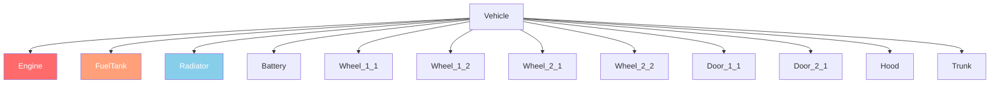

# 6.2. fejezet: Járműrendszer

[Kezdőlap](../../README.md) | [<< Előző: Entitásrendszer](01-entity-system.md) | **Járművek** | [Következő: Időjárás >>](03-weather.md)

---

## Bevezetés

A DayZ járművek a közlekedési rendszert kiterjesztő entitások. Az autók a `CarScript`-et, a hajók a `BoatScript`-et terjesztik ki, és mindkettő a `Transport`-ból örököl. A járművek folyadékrendszerrel, független egészségű alkatrészekkel, sebességváltó-szimulációval és a motor által kezelt fizikával rendelkeznek. Ez a fejezet a járművekkel való interakcióhoz szükséges API metódusokat tárgyalja.

---

## Osztályhierarchia

```
EntityAI
└── Transport                    // 3_Game - minden jármű alapja
    ├── Car                      // 3_Game - motor-natív autó fizika
    │   └── CarScript            // 4_World - szkriptelhető autó alap
    │       ├── CivilianSedan
    │       ├── OffroadHatchback
    │       ├── Hatchback_02
    │       ├── Sedan_02
    │       ├── Truck_01_Base
    │       └── ...
    └── Boat                     // 3_Game - motor-natív hajó fizika
        └── BoatScript           // 4_World - szkriptelhető hajó alap
```

---

## Transport (alap)

**Fájl:** `3_Game/entities/transport.c`

Az absztrakt alap minden járműhöz. Üléskezelést és személyzet hozzáférést biztosít.

### Személyzetkezelés

```c
proto native int   CrewSize();                          // Ülések összes száma
proto native int   CrewMemberIndex(Human crew_member);  // Személy ülésindexe
proto native Human CrewMember(int posIdx);              // Személy az adott ülésindexen
proto native void  CrewGetOut(int posIdx);              // Személyzettag kiszállítása
proto native void  CrewDeath(int posIdx);               // Személyzettag megölése az ülésben
```

### Beszállás

```c
proto native int  GetAnimInstance();
proto native int  CrewPositionIndex(int componentIdx);  // Komponensből ülésindex
proto native vector CrewEntryPoint(int posIdx);         // Világ belépési pont az üléshez
```

**Példa --- minden utas kiszállítása:**

```c
void EjectAllCrew(Transport vehicle)
{
    for (int i = 0; i < vehicle.CrewSize(); i++)
    {
        Human crew = vehicle.CrewMember(i);
        if (crew)
        {
            vehicle.CrewGetOut(i);
        }
    }
}
```

---

## Car (motor natív)

**Fájl:** `3_Game/entities/car.c`

Motor szintű autó fizika. Minden `proto native` metódus, amely a jármű szimulációt vezérli.

### Motor

```c
proto native bool  EngineIsOn();
proto native void  EngineStart();
proto native void  EngineStop();
proto native float EngineGetRPM();
proto native float EngineGetRPMRedline();
proto native float EngineGetRPMMax();
proto native int   GetGear();
```

### Folyadékok

A DayZ járművek négy folyadéktípust használnak, amelyeket a `CarFluid` felsorolás definiál:

```c
enum CarFluid
{
    FUEL,
    OIL,
    BRAKE,
    COOLANT
}
```

```c
proto native float GetFluidCapacity(CarFluid fluid);
proto native float GetFluidFraction(CarFluid fluid);     // 0.0 - 1.0
proto native void  Fill(CarFluid fluid, float amount);
proto native void  Leak(CarFluid fluid, float amount);
proto native void  LeakAll(CarFluid fluid);
```

**Példa --- jármű feltankolása:**

```c
void RefuelVehicle(Car car)
{
    float capacity = car.GetFluidCapacity(CarFluid.FUEL);
    float current = car.GetFluidFraction(CarFluid.FUEL) * capacity;
    float needed = capacity - current;
    car.Fill(CarFluid.FUEL, needed);
}
```

### Sebesség

```c
proto native float GetSpeedometer();    // Sebesség km/h-ban (abszolút érték)
```

### Vezérlés (szimuláció)

```c
proto native void  SetBrake(float value, int wheel = -1);    // 0.0 - 1.0, -1 = minden kerék
proto native void  SetHandbrake(float value);                 // 0.0 - 1.0
proto native void  SetSteering(float value, bool analog = true);
proto native void  SetThrust(float value, int wheel = -1);    // 0.0 - 1.0
proto native void  SetClutchState(bool engaged);
```

### Kerekek

```c
proto native int   WheelCount();
proto native bool  WheelIsAnyLocked();
proto native float WheelGetSurface(int wheelIdx);
```

### Visszahívások (CarScript-ben felülírandó)

```c
void OnEngineStart();
void OnEngineStop();
void OnContact(string zoneName, vector localPos, IEntity other, Contact data);
void OnFluidChanged(CarFluid fluid, float newValue, float oldValue);
void OnGearChanged(int newGear, int oldGear);
void OnSound(CarSoundCtrl ctrl, float oldValue);
```

---

## CarScript

**Fájl:** `4_World/entities/vehicles/carscript.c`

A szkriptelhető autó osztály, amelyet a legtöbb jármű mod kiterjeszt. Alkatrészeket, ajtókat, lámpákat és hangkezelést ad hozzá.

### Alkatrész egészség

A CarScript sérülési zónákat használ a jármű alkatrészek ábrázolásához. Minden alkatrész függetlenül sérülhet:

```c
// Alkatrész egészség ellenőrzése a standard EntityAI API-n keresztül
float engineHP = car.GetHealth("Engine", "Health");
float fuelTankHP = car.GetHealth("FuelTank", "Health");

// Alkatrész egészség beállítása
car.SetHealth("Engine", "Health", 0);       // Motor megsemmisítése
car.SetHealth("FuelTank", "Health", 100);   // Üzemanyagtartály javítása
```

### Sérülési zóna diagram



Járművek gyakori sérülési zónái:

| Zóna | Leírás |
|------|--------|
| `""` (globális) | Jármű összesített egészsége |
| `"Engine"` | Motor alkatrész |
| `"FuelTank"` | Üzemanyagtartály |
| `"Radiator"` | Hűtő (hűtőfolyadék) |
| `"Battery"` | Akkumulátor |
| `"SparkPlug"` | Gyújtógyertya |
| `"FrontLeft"` / `"FrontRight"` | Első kerekek |
| `"RearLeft"` / `"RearRight"` | Hátsó kerekek |
| `"DriverDoor"` / `"CoDriverDoor"` | Első ajtók |
| `"Hood"` / `"Trunk"` | Motorháztető és csomagtartó |

### Lámpák

```c
void SetLightsState(int state);   // 0 = ki, 1 = be
int  GetLightsState();
```

### Ajtóvezérlés

```c
bool IsDoorOpen(string doorSource);
void OpenDoor(string doorSource);
void CloseDoor(string doorSource);
```

### Főbb felülírások egyéni járművekhez

```c
override void EEInit();                    // Jármű alkatrészek, folyadékok inicializálása
override void OnEngineStart();             // Egyéni motorindítási viselkedés
override void OnEngineStop();              // Egyéni motorleállítási viselkedés
override void EOnSimulate(IEntity other, float dt);  // Képkockánkénti szimuláció
override bool CanObjectAttachWeapon(string slot_name);
```

**Példa --- jármű létrehozása teljes folyadékkal:**

```c
void SpawnReadyVehicle(vector pos)
{
    Car car = Car.Cast(GetGame().CreateObjectEx("CivilianSedan", pos,
                        ECE_PLACE_ON_SURFACE | ECE_INITAI | ECE_CREATEPHYSICS));
    if (!car)
        return;

    // Minden folyadék feltöltése
    car.Fill(CarFluid.FUEL, car.GetFluidCapacity(CarFluid.FUEL));
    car.Fill(CarFluid.OIL, car.GetFluidCapacity(CarFluid.OIL));
    car.Fill(CarFluid.BRAKE, car.GetFluidCapacity(CarFluid.BRAKE));
    car.Fill(CarFluid.COOLANT, car.GetFluidCapacity(CarFluid.COOLANT));

    // Szükséges alkatrészek spawnja
    EntityAI carEntity = EntityAI.Cast(car);
    carEntity.GetInventory().CreateAttachment("CarBattery");
    carEntity.GetInventory().CreateAttachment("SparkPlug");
    carEntity.GetInventory().CreateAttachment("CarRadiator");
    carEntity.GetInventory().CreateAttachment("HatchbackWheel");
}
```

---

## BoatScript

**Fájl:** `4_World/entities/vehicles/boatscript.c`

Szkriptelhető alap hajó entitásokhoz. Hasonló API a CarScript-hez, de propeller-alapú fizikával.

### Motor és meghajtás

```c
proto native bool  EngineIsOn();
proto native void  EngineStart();
proto native void  EngineStop();
proto native float EngineGetRPM();
```

### Folyadékok

A hajók ugyanazt a `CarFluid` felsorolást használják, de jellemzően csak a `FUEL`-t:

```c
float fuel = boat.GetFluidFraction(CarFluid.FUEL);
boat.Fill(CarFluid.FUEL, boat.GetFluidCapacity(CarFluid.FUEL));
```

### Sebesség

```c
proto native float GetSpeedometer();   // Sebesség km/h-ban
```

**Példa --- hajó spawnja:**

```c
void SpawnBoat(vector waterPos)
{
    BoatScript boat = BoatScript.Cast(
        GetGame().CreateObjectEx("Boat_01", waterPos,
                                  ECE_CREATEPHYSICS | ECE_INITAI)
    );
    if (boat)
    {
        boat.Fill(CarFluid.FUEL, boat.GetFluidCapacity(CarFluid.FUEL));
    }
}
```

---

## Jármű interakciós ellenőrzések

### Annak ellenőrzése, hogy egy játékos járműben van-e

```c
PlayerBase player;
if (player.IsInVehicle())
{
    EntityAI vehicle = player.GetDrivingVehicle();
    CarScript car;
    if (Class.CastTo(car, vehicle))
    {
        float speed = car.GetSpeedometer();
        Print(string.Format("Driving at %1 km/h", speed));
    }
}
```

### Minden jármű megtalálása a világban

```c
void FindAllVehicles(out array<Transport> vehicles)
{
    vehicles = new array<Transport>;
    array<Object> objects = new array<Object>;
    array<CargoBase> proxyCargos = new array<CargoBase>;

    // Nagy sugár használata a térkép közepétől
    GetGame().GetObjectsAtPosition(Vector(7500, 0, 7500), 15000, objects, proxyCargos);

    foreach (Object obj : objects)
    {
        Transport transport;
        if (Class.CastTo(transport, obj))
        {
            vehicles.Insert(transport);
        }
    }
}
```

---

## Összefoglalás

| Fogalom | Lényeg |
|---------|--------|
| Hierarchia | `Transport` > `Car`/`Boat` > `CarScript`/`BoatScript` |
| Motor | `EngineStart()`, `EngineStop()`, `EngineIsOn()`, `EngineGetRPM()` |
| Folyadékok | `CarFluid` felsorolás: `FUEL`, `OIL`, `BRAKE`, `COOLANT` |
| Töltés/Szivárgás | `Fill(fluid, amount)`, `Leak(fluid, amount)`, `GetFluidFraction(fluid)` |
| Sebesség | `GetSpeedometer()` km/h-t ad vissza |
| Személyzet | `CrewSize()`, `CrewMember(idx)`, `CrewGetOut(idx)` |
| Alkatrészek | Standard sérülési zónák: `"Engine"`, `"FuelTank"`, `"Radiator"` stb. |
| Létrehozás | `CreateObjectEx` a következővel: `ECE_PLACE_ON_SURFACE \| ECE_INITAI \| ECE_CREATEPHYSICS` |

---

## Bevált gyakorlatok

- **Mindig tartalmazd az `ECE_CREATEPHYSICS | ECE_INITAI` jelzőbiteket járművek spawnolásakor.** Fizika nélkül a jármű átesik a talajon. AI inicializálás nélkül a motorszimuláció nem indul el, és a jármű nem vezethető.
- **Töltsd fel mind a négy folyadékot spawn után.** Ha egy járműből hiányzik az olaj, fékfolyadék vagy hűtőfolyadék, azonnal károsítja magát a motor indításakor. Használd a `GetFluidCapacity()` metódust a járműtípusonkénti helyes maximális értékek lekéréséhez.
- **Ellenőrizd a `CrewMember()` null értékét a személyzetre vonatkozó műveletek előtt.** Az üres ülések `null`-t adnak vissza. A `CrewSize()` iterálása anélkül, hogy minden indexet ellenőriznél, összeomlásokat okoz, amikor az ülések üresek.
- **Használd a `GetSpeedometer()` metódust a sebesség manuális kiszámítása helyett.** A motor sebességmérője figyelembe veszi a kerék érintkezést, a sebességváltó állapotát és a fizikát. A pozíciókülönbségekből számított manuális sebesség számítások megbízhatatlanok.

---

## Kompatibilitás és hatás

> **Mod kompatibilitás:** A jármű modok általában modded osztályokkal terjesztik ki a `CarScript`-et. Konfliktusok akkor merülnek fel, amikor több mod ugyanazokat a visszahívásokat írja felül, mint az `OnEngineStart()` vagy az `EOnSimulate()`.

- **Betöltési sorrend:** Ha két mod is `modded class CarScript`-et használ és felülírja az `OnEngineStart()` metódust, csak az utolsónak betöltött fut le, hacsak mindkettő nem hívja a `super`-t. A jármű átalakító modoknak mindig meg kell hívniuk a `super`-t minden visszahívásban.
- **Modded osztály konfliktusok:** Az Expansion Vehicles és a vanilla jármű modok gyakran ütköznek az `EEInit()` és a folyadék inicializálás terén. Tesztelj mindkettő betöltésével.
- **Teljesítményi hatás:** Az `EOnSimulate()` minden fizikai tickben fut minden aktív járműhöz. Tartsd a logikát minimálisra ebben a visszahívásban; használj időzítő-akkumulátorokat a költséges műveletekhez.
- **Szerver/Kliens:** Az `EngineStart()`, `EngineStop()`, `Fill()`, `Leak()` és `CrewGetOut()` szerver-autoritatív. A `GetSpeedometer()`, `EngineIsOn()` és `GetFluidFraction()` mindkét oldalon biztonságosan olvasható.

---

## Valós modokban megfigyelt minták

> Ezeket a mintákat professzionális DayZ modok forráskódjának tanulmányozásával erősítettük meg.

| Minta | Mod | Fájl/Helyszín |
|-------|-----|---------------|
| `EEInit()` felülírás egyéni folyadékkapacitások beállításához és alkatrészek spawnjához | Expansion Vehicles | `CarScript` alosztályok |
| `EOnSimulate` akkumulátor időszakos üzemanyag-fogyasztás ellenőrzésekhez | Vanilla+ jármű modok | `CarScript` felülírások |
| `CrewGetOut()` ciklus admin mindent-kiszállít parancsban | VPP Admin Tools | Járműkezelő modul |
| Egyéni `OnContact()` felülírás ütközési sérülés hangolásához | Expansion | `ExpansionCarScript` |

---

[Kezdőlap](../../README.md) | [<< Előző: Entitásrendszer](01-entity-system.md) | **Járművek** | [Következő: Időjárás >>](03-weather.md)
