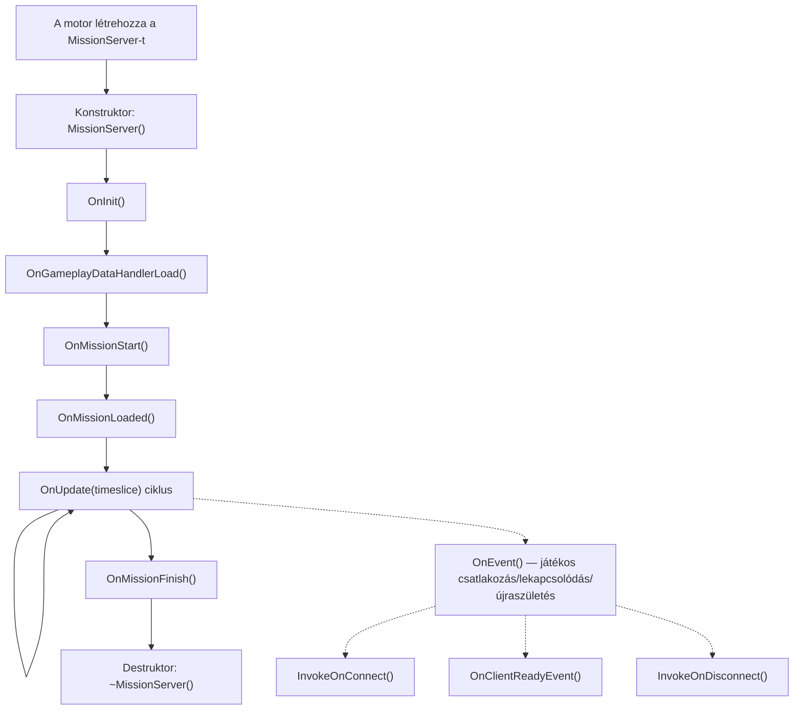
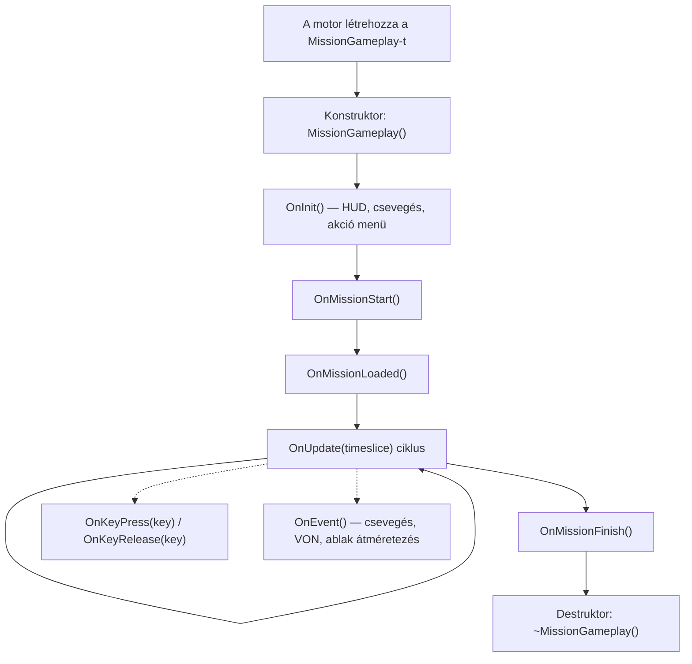
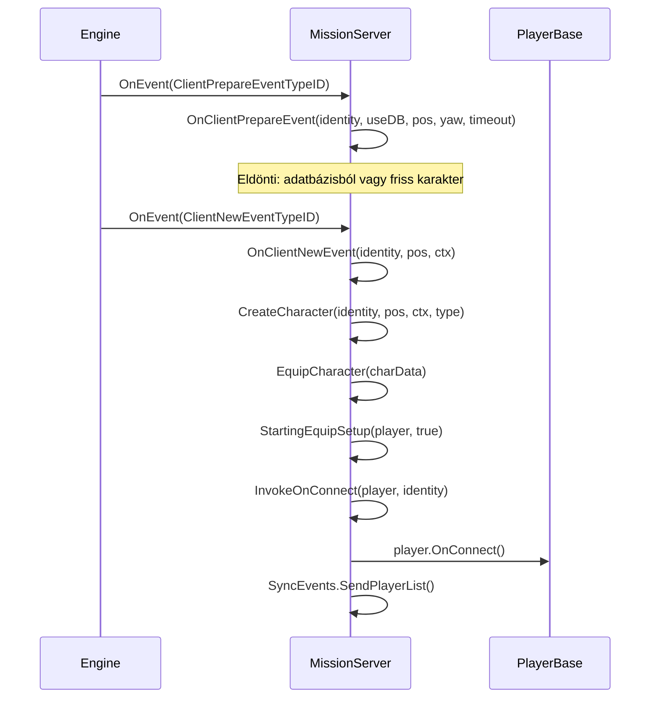
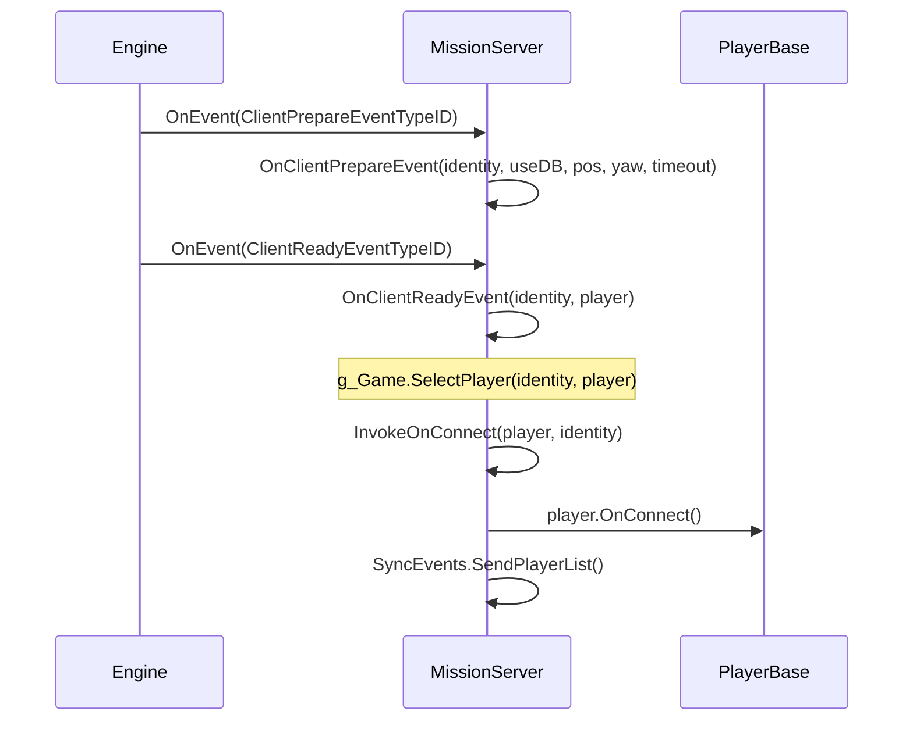
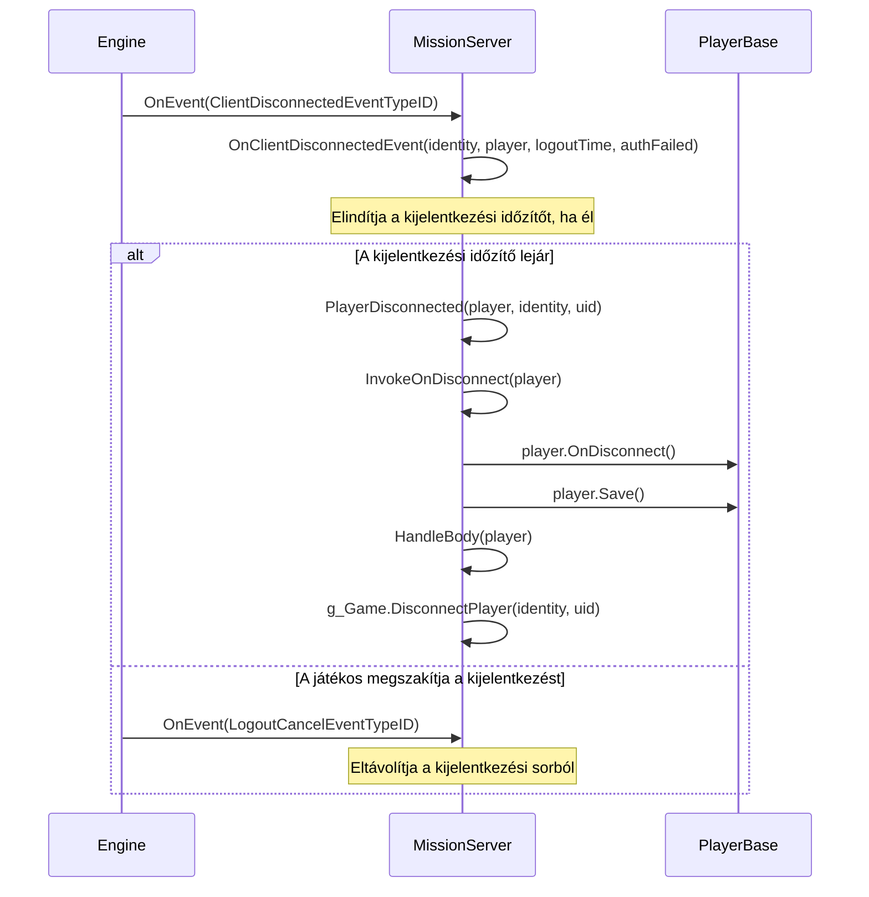

# 6.11. fejezet: Mission Hookok

[Főoldal](../../README.md) | [<< Előző: Központi gazdaság](10-central-economy.md) | **Mission Hookok** | [Következő: Akció rendszer >>](12-action-system.md)

---

## Bevezetés

Minden DayZ modnak szüksége van egy belépési pontra --- egy helyre, ahol inicializálja a menedzsereket, regisztrálja az RPC kezelőket, becsatlakozik a játékos-csatlakozási eseményekbe, és leállításkor mindent eltakarít. Ez a belépési pont a **Mission** osztály. A motor pontosan egy Mission példányt hoz létre, amikor egy szcenárió betöltődik: `MissionServer`-t dedikált szerveren, `MissionGameplay`-t kliens oldalon, vagy mindkettőt listen szerveren. Ezek az osztályok garantált sorrendben aktiválódó életciklus-hookokat biztosítanak, így a modoknak megbízható helyet adnak a viselkedés beillesztéséhez.

Ez a fejezet a teljes Mission osztályhierarchiát, minden hookelhető metódust, a helyes `modded class` kiterjesztési mintát, valamint valós példákat mutat be a vanilla DayZ-ből, a COT-ból és az Expansionből.

---

## Osztályhierarchia

```
Mission                      // 3_Game/gameplay.c (alap, definiálja az összes hook szignatúrát)
└── MissionBaseWorld         // 4_World/classes/missionbaseworld.c (minimális híd)
    └── MissionBase          // 5_Mission/mission/missionbase.c (közös beállítás: HUD, menük, pluginek)
        ├── MissionServer    // 5_Mission/mission/missionserver.c (szerver oldali)
        └── MissionGameplay  // 5_Mission/mission/missiongameplay.c (kliens oldali)
```

- A **Mission** definiálja az összes hook szignatúrát üres metódusokként: `OnInit()`, `OnUpdate()`, `OnEvent()`, `OnMissionStart()`, `OnMissionFinish()`, `OnKeyPress()`, `OnKeyRelease()`, stb.
- A **MissionBase** inicializálja a plugin menedzsert, a widget eseménykezelőt, a világ adatokat, a dinamikus zenét, a hang készleteket és a beviteli eszköz követést. Ez a közös szülője mind a szerver, mind a kliens oldalnak.
- A **MissionServer** kezeli a játékos csatlakozásokat, lekapcsolódásokat, újraszületéseket, holttestek kezelését, tick ütemezést és a tüzérséget.
- A **MissionGameplay** kezeli a HUD létrehozást, a csevegést, az akció menüket, a voice-over-network felületet, a felszerelés kezelőt, a bemenet kizárást és a kliens oldali játékos ütemezést.

---

## Életciklus áttekintés

### MissionServer életciklus (szerver oldal)



### MissionGameplay életciklus (kliens oldal)



---

## Mission alaposztály metódusai

**Fájl:** `3_Game/gameplay.c`

A `Mission` alaposztály definiálja az összes hookelhető metódust. Mindegyik virtuális, üres alapértelmezett implementációval, hacsak nincs másként jelölve.

### Életciklus hookok

| Metódus | Szignatúra | Mikor aktiválódik |
|---------|-----------|-------------------|
| `OnInit` | `void OnInit()` | A konstruktor után, a misszió indulása előtt. Elsődleges beállítási pont. |
| `OnMissionStart` | `void OnMissionStart()` | Az OnInit után. A misszió világ aktív. |
| `OnMissionLoaded` | `void OnMissionLoaded()` | Az OnMissionStart után. Minden vanilla rendszer inicializálva van. |
| `OnGameplayDataHandlerLoad` | `void OnGameplayDataHandlerLoad()` | Szerver: a gameplay adatok (cfggameplay.json) betöltése után. |
| `OnUpdate` | `void OnUpdate(float timeslice)` | Minden képkockánál. A `timeslice` az előző képkocka óta eltelt idő másodpercben (jellemzően 0.016-0.033). |
| `OnMissionFinish` | `void OnMissionFinish()` | Leállításkor vagy lekapcsolódáskor. Mindent itt kell eltakarítani. |

### Beviteli hookok (kliens oldal)

| Metódus | Szignatúra | Mikor aktiválódik |
|---------|-----------|-------------------|
| `OnKeyPress` | `void OnKeyPress(int key)` | Fizikai billentyű lenyomva. A `key` egy `KeyCode` konstans. |
| `OnKeyRelease` | `void OnKeyRelease(int key)` | Fizikai billentyű elengedve. |
| `OnMouseButtonPress` | `void OnMouseButtonPress(int button)` | Egérgomb lenyomva. |
| `OnMouseButtonRelease` | `void OnMouseButtonRelease(int button)` | Egérgomb elengedve. |

### Esemény hook

| Metódus | Szignatúra | Mikor aktiválódik |
|---------|-----------|-------------------|
| `OnEvent` | `void OnEvent(EventType eventTypeId, Param params)` | Motor események: csevegés, VON, játékos csatlakozás/lekapcsolódás, ablak átméretezés, stb. |

### Segéd metódusok

| Metódus | Szignatúra | Leírás |
|---------|-----------|--------|
| `GetHud` | `Hud GetHud()` | Visszaadja a HUD példányt (csak kliens). |
| `GetWorldData` | `WorldData GetWorldData()` | Visszaadja a világ-specifikus adatokat (hőmérsékleti görbék, stb.). |
| `IsPaused` | `bool IsPaused()` | Szünetel-e a játék (egyjátékos / listen szerver). |
| `IsServer` | `bool IsServer()` | `true` MissionServer esetén, `false` MissionGameplay esetén. |
| `IsMissionGameplay` | `bool IsMissionGameplay()` | `true` MissionGameplay esetén, `false` MissionServer esetén. |
| `PlayerControlEnable` | `void PlayerControlEnable(bool bForceSuppress)` | Játékos bemenet újra engedélyezése letiltás után. |
| `PlayerControlDisable` | `void PlayerControlDisable(int mode)` | Játékos bemenet letiltása (pl. `INPUT_EXCLUDE_ALL`). |
| `IsControlDisabled` | `bool IsControlDisabled()` | Le van-e tiltva jelenleg a játékos vezérlés. |
| `GetControlDisabledMode` | `int GetControlDisabledMode()` | Visszaadja az aktuális bemenet kizárási módot. |

---

## MissionServer hookok (szerver oldal)

**Fájl:** `5_Mission/mission/missionserver.c`

A `MissionServer`-t a motor hozza létre a dedikált szervereken. Mindent kezel, ami a szerver oldali játékos életciklussal kapcsolatos.

### Alapvető vanilla viselkedés

- **Konstruktor**: Beállítja a `CallQueue`-t a játékos statisztikákhoz (30 másodperces intervallum), a halott játékosok tömbjét, a kijelentkezés-követő map-eket és az eső kezelőt.
- **OnInit**: Betölti a `CfgGameplayHandler`-t, `PlayerSpawnHandler`-t, `CfgPlayerRestrictedAreaHandler`-t, `UndergroundAreaLoader`-t és a tüzérségi tüzelési pozíciókat.
- **OnMissionStart**: Létrehozza a hatás terület zónákat (szennyezett zónák, stb.).
- **OnUpdate**: Futtatja a tick ütemezőt, feldolgozza a kijelentkezési időzítőket, frissíti az alap környezeti hőmérsékletet, az eső kezelőt és a véletlenszerű tüzérséget.

### OnEvent --- Játékos csatlakozási események

A szerver `OnEvent` metódusa a központi diszpécser minden játékos életciklus eseményhez. A motor típusos `Param` objektumokkal küld eseményeket. A vanilla egy `switch` blokkal kezeli őket:

| Esemény | Param típus | Mi történik |
|---------|------------|-------------|
| `ClientPrepareEventTypeID` | `ClientPrepareEventParams` | Eldönti: adatbázisból vagy friss karakter |
| `ClientNewEventTypeID` | `ClientNewEventParams` | Létrehozza és felszereli az új karaktert, meghívja az `InvokeOnConnect`-et |
| `ClientReadyEventTypeID` | `ClientReadyEventParams` | Meglévő karakter betöltve, meghívja az `OnClientReadyEvent`-et + `InvokeOnConnect`-et |
| `ClientRespawnEventTypeID` | `ClientRespawnEventParams` | Játékos újraszületési kérelem, megöli a régi karaktert, ha eszméletlen |
| `ClientReconnectEventTypeID` | `ClientReconnectEventParams` | Játékos újracsatlakozott az élő karakteréhez |
| `ClientDisconnectedEventTypeID` | `ClientDisconnectedEventParams` | Játékos lekapcsolódik, elindítja a kijelentkezési időzítőt |
| `LogoutCancelEventTypeID` | `LogoutCancelEventParams` | Játékos megszakította a kijelentkezési visszaszámlálást |

### Játékos csatlakozási metódusok

Az `OnEvent`-ből hívódnak meg, amikor játékos-kapcsolódási események aktiválódnak:

| Metódus | Szignatúra | Vanilla viselkedés |
|---------|-----------|-------------------|
| `InvokeOnConnect` | `void InvokeOnConnect(PlayerBase player, PlayerIdentity identity)` | Meghívja a `player.OnConnect()` metódust. Az elsődleges "játékos csatlakozott" hook. |
| `InvokeOnDisconnect` | `void InvokeOnDisconnect(PlayerBase player)` | Meghívja a `player.OnDisconnect()` metódust. A játékos teljesen lekapcsolódott. |
| `OnClientReadyEvent` | `void OnClientReadyEvent(PlayerIdentity identity, PlayerBase player)` | Meghívja a `g_Game.SelectPlayer()` metódust. Meglévő karakter betöltve az adatbázisból. |
| `OnClientNewEvent` | `PlayerBase OnClientNewEvent(PlayerIdentity identity, vector pos, ParamsReadContext ctx)` | Létrehozza és felszereli az új karaktert. `PlayerBase`-t ad vissza. |
| `OnClientRespawnEvent` | `void OnClientRespawnEvent(PlayerIdentity identity, PlayerBase player)` | Megöli a régi karaktert, ha eszméletlen/megkötözött. |
| `OnClientReconnectEvent` | `void OnClientReconnectEvent(PlayerIdentity identity, PlayerBase player)` | Meghívja a `player.OnReconnect()` metódust. |
| `PlayerDisconnected` | `void PlayerDisconnected(PlayerBase player, PlayerIdentity identity, string uid)` | Meghívja az `InvokeOnDisconnect`-et, elmenti a játékost, kilép a hive-ból, kezeli a testet, eltávolítja a szerverről. |

### Karakter beállítás

| Metódus | Szignatúra | Leírás |
|---------|-----------|--------|
| `CreateCharacter` | `PlayerBase CreateCharacter(PlayerIdentity identity, vector pos, ParamsReadContext ctx, string characterName)` | Létrehozza a játékos entitást a `g_Game.CreatePlayer()` + `g_Game.SelectPlayer()` segítségével. |
| `EquipCharacter` | `void EquipCharacter(MenuDefaultCharacterData char_data)` | Végigmegy az attachment slotokon, véletlenszerűsít, ha az egyéni újraszületés le van tiltva. Meghívja a `StartingEquipSetup()` metódust. |
| `StartingEquipSetup` | `void StartingEquipSetup(PlayerBase player, bool clothesChosen)` | **Üres a vanillában** --- ez a te belépési pontod a kezdő készletekhez. |

---

## MissionGameplay hookok (kliens oldal)

**Fájl:** `5_Mission/mission/missiongameplay.c`

A `MissionGameplay` a kliensen jön létre, amikor egy szerverhez csatlakozik vagy egyjátékos módot indít. Minden kliens oldali felületet és bemenetet kezel.

### Alapvető vanilla viselkedés

- **Konstruktor**: Megsemmisíti a meglévő menüket, létrehozza a Chat-et, ActionMenu-t, IngameHud-ot, VoN állapotot, halványítási időzítőket és a SyncEvents regisztrációt.
- **OnInit**: Dupla inicializálás elleni védelem az `m_Initialized` változóval. Létrehozza a HUD gyökér widgetet a `"gui/layouts/day_z_hud.layout"` fájlból, a csevegés widgetet, az akció menüt, a mikrofon ikont, a VoN hangerő szint widgeteket és a csevegés csatorna területet. Meghívja a `PPEffects.Init()` és `MapMarkerTypes.Init()` metódusokat.
- **OnMissionStart**: Elrejti a kurzort, beállítja a misszió állapotát `MISSION_STATE_GAME`-re, betölti a hatás területeket egyjátékos módban.
- **OnUpdate**: Tick ütemező a helyi játékoshoz, hologram frissítések, radiális gyorselérés (konzol), gesztus menü, bemenetkezelés a felszereléshez/csevegéshez/VoN-hoz, debug monitor, szüneteltetés viselkedése.
- **OnMissionFinish**: Elrejti a párbeszédablakot, megsemmisíti az összes menüt és csevegést, törli a HUD gyökér widgetet, leállítja az összes PPE effektet, újra engedélyezi az összes bemenetet, beállítja a misszió állapotát `MISSION_STATE_FINNISH`-re.

### Beviteli hookok

```c
override void OnKeyPress(int key)
{
    super.OnKeyPress(key);
    // A vanilla továbbítja a Hud.KeyPress(key) metódusnak
    // a key értékek KeyCode konstansok (pl. KeyCode.KC_F1 = 59)
}

override void OnKeyRelease(int key)
{
    super.OnKeyRelease(key);
}
```

### Esemény hook

A vanilla `MissionGameplay.OnEvent()` kezeli a `ChatMessageEventTypeID`-t (hozzáadja a csevegés widgethez), `ChatChannelEventTypeID`-t (frissíti a csatorna jelzőt), `WindowsResizeEventTypeID`-t (újraépíti a menüket/HUD-ot), `SetFreeCameraEventTypeID`-t (debug kamera) és `VONStateEventTypeID`-t (hang állapot). Felülírásnál ugyanazt a `switch` mintát használd, és mindig hívd meg a `super.OnEvent()` metódust.

### Beviteli vezérlés

A `PlayerControlDisable(int mode)` aktivál egy bemenet kizárási csoportot (pl. `INPUT_EXCLUDE_ALL`, `INPUT_EXCLUDE_INVENTORY`). A `PlayerControlEnable(bool bForceSuppress)` eltávolítja azt. Ezek a `specific.xml`-ben definiált kizárási csoportokra térképeződnek. Írd felül, ha a modod egyéni bemenet kizárási viselkedést igényel (ahogy az Expansion teszi a menüinél).

---

## Szerver oldali eseményfolyam: Játékos csatlakozik

A pontos eseménysorrend ismerete, amikor egy játékos csatlakozik, kritikus ahhoz, hogy tudd, hova kell a kódodat hookol ni.

### Új karakter (első csatlakozás vagy halál után)



### Meglévő karakter (újracsatlakozás lekapcsolódás után)



### Játékos lekapcsolódás



---

## Hookolás módja: A modded class minta

A Mission osztályok kiterjesztésének helyes módja a `modded class` minta. Ez az Enforce Script osztályöröklődési mechanizmusát használja, ahol a `modded class` kiterjeszti a meglévő osztályt anélkül, hogy lecserélné, így több mod is együtt tud élni.

### Alapvető szerver hook

```c
// A te modod: Scripts/5_Mission/YourMod/MissionServer.c
modded class MissionServer
{
    ref MyServerManager m_MyManager;

    override void OnInit()
    {
        super.OnInit();  // MINDIG hívd meg először a super-t

        m_MyManager = new MyServerManager();
        m_MyManager.Init();
        Print("[MyMod] Server manager initialized");
    }

    override void OnMissionFinish()
    {
        if (m_MyManager)
        {
            m_MyManager.Cleanup();
            m_MyManager = null;
        }

        super.OnMissionFinish();  // Hívd meg a super-t (a takarítás előtt vagy után)
    }
}
```

### Alapvető kliens hook

```c
// A te modod: Scripts/5_Mission/YourMod/MissionGameplay.c
modded class MissionGameplay
{
    ref MyHudWidget m_MyHud;

    override void OnInit()
    {
        super.OnInit();  // MINDIG hívd meg először a super-t

        // Egyéni HUD elemek létrehozása
        m_MyHud = new MyHudWidget();
        m_MyHud.Init();
    }

    override void OnUpdate(float timeslice)
    {
        super.OnUpdate(timeslice);

        // Egyéni HUD frissítése minden képkockánál
        if (m_MyHud)
        {
            m_MyHud.Update(timeslice);
        }
    }

    override void OnMissionFinish()
    {
        if (m_MyHud)
        {
            m_MyHud.Destroy();
            m_MyHud = null;
        }

        super.OnMissionFinish();
    }
}
```

### Játékos csatlakozás hookolása

```c
modded class MissionServer
{
    override void InvokeOnConnect(PlayerBase player, PlayerIdentity identity)
    {
        super.InvokeOnConnect(player, identity);

        // A kódod a vanilla és az összes korábbi mod UTÁN fut le
        if (player && identity)
        {
            string uid = identity.GetId();
            string name = identity.GetName();
            Print("[MyMod] Player connected: " + name + " (" + uid + ")");

            // Játékos adat betöltése, beállítások küldése, stb.
            MyPlayerData.Load(uid);
        }
    }

    override void InvokeOnDisconnect(PlayerBase player)
    {
        // Mentsd az adatokat a super ELŐTT (a játékos utána törlődhet)
        if (player && player.GetIdentity())
        {
            string uid = player.GetIdentity().GetId();
            MyPlayerData.Save(uid);
        }

        super.InvokeOnDisconnect(player);
    }
}
```

### Csevegés üzenetek hookolása (szerver oldali OnEvent)

```c
modded class MissionServer
{
    override void OnEvent(EventType eventTypeId, Param params)
    {
        // Elfogás a super ELŐTT az események esetleges blokkolásához
        if (eventTypeId == ClientNewEventTypeID)
        {
            ClientNewEventParams newParams;
            Class.CastTo(newParams, params);
            PlayerIdentity identity = newParams.param1;

            if (IsPlayerBanned(identity))
            {
                // A csatlakozás blokkolása a super meghívásának kihagyásával
                return;
            }
        }

        super.OnEvent(eventTypeId, params);
    }
}
```

### Billentyűzet bemenet hookolása (kliens oldal)

```c
modded class MissionGameplay
{
    override void OnKeyPress(int key)
    {
        super.OnKeyPress(key);

        // Egyéni menü megnyitása F6-ra
        if (key == KeyCode.KC_F6)
        {
            if (!GetGame().GetUIManager().GetMenu())
            {
                MyCustomMenu.Open();
            }
        }
    }
}
```

### Hol regisztráld az RPC kezelőket

Az RPC kezelőket az `OnInit`-ben kell regisztrálni, nem a konstruktorban. Az `OnInit` idejére már minden script modul betöltődött és a hálózati réteg kész.

```c
modded class MissionServer
{
    override void OnInit()
    {
        super.OnInit();

        // RPC kezelők regisztrálása itt
        GetDayZGame().Event_OnRPC.Insert(OnMyRPC);
    }

    override void OnMissionFinish()
    {
        GetDayZGame().Event_OnRPC.Remove(OnMyRPC);
        super.OnMissionFinish();
    }

    void OnMyRPC(PlayerIdentity sender, Object target, int rpc_type,
                 ParamsReadContext ctx)
    {
        // Az RPC-id kezelése
    }
}
```

---

## Gyakori hookok cél szerint

| Ezt szeretném... | Ezt a metódust hookold | Melyik osztályon |
|-----------------|----------------------|-----------------|
| Mod inicializálása szerveren | `OnInit()` | `MissionServer` |
| Mod inicializálása kliensen | `OnInit()` | `MissionGameplay` |
| Kód futtatása minden képkockánál (szerver) | `OnUpdate(float timeslice)` | `MissionServer` |
| Kód futtatása minden képkockánál (kliens) | `OnUpdate(float timeslice)` | `MissionGameplay` |
| Reagálás játékos csatlakozásra | `InvokeOnConnect(player, identity)` | `MissionServer` |
| Reagálás játékos távozásra | `InvokeOnDisconnect(player)` | `MissionServer` |
| Kezdeti adatok küldése új kliensnek | `OnClientReadyEvent(identity, player)` | `MissionServer` |
| Reagálás új karakter születésére | `OnClientNewEvent(identity, pos, ctx)` | `MissionServer` |
| Kezdő felszerelés adása | `StartingEquipSetup(player, clothesChosen)` | `MissionServer` |
| Reagálás játékos újraszületésre | `OnClientRespawnEvent(identity, player)` | `MissionServer` |
| Reagálás játékos újracsatlakozásra | `OnClientReconnectEvent(identity, player)` | `MissionServer` |
| Lekapcsolódás/kijelentkezés logika kezelése | `OnClientDisconnectedEvent(identity, player, logoutTime, authFailed)` | `MissionServer` |
| Szerver események elfogása (csatlakozás, csevegés) | `OnEvent(eventTypeId, params)` | `MissionServer` |
| Kliens események elfogása (csevegés, VON) | `OnEvent(eventTypeId, params)` | `MissionGameplay` |
| Billentyűzet bemenet kezelése | `OnKeyPress(key)` / `OnKeyRelease(key)` | `MissionGameplay` |
| HUD elemek létrehozása | `OnInit()` | `MissionGameplay` |
| Takarítás szerver leállításkor | `OnMissionFinish()` | `MissionServer` |
| Takarítás kliens lekapcsolódáskor | `OnMissionFinish()` | `MissionGameplay` |
| Kód futtatása egyszer, miután minden rendszer betöltődött | `OnMissionLoaded()` | Bármelyik |
| Játékos bemenet letiltása/engedélyezése | `PlayerControlDisable(mode)` / `PlayerControlEnable(bForceSuppress)` | `MissionGameplay` |

---

## Szerver vs kliens: Melyik hookok aktiválódnak hol

| Hook | Szerver | Kliens | Megjegyzések |
|------|---------|--------|-------------|
| Konstruktor | Igen | Igen | Különböző osztály mindkét oldalon |
| `OnInit()` | Igen | Igen | |
| `OnMissionStart()` | Igen | Igen | |
| `OnMissionLoaded()` | Igen | Igen | |
| `OnGameplayDataHandlerLoad()` | Igen | Nem | cfggameplay.json betöltve |
| `OnUpdate(timeslice)` | Igen | Igen | Mindkettő a saját képkocka ciklusát futtatja |
| `OnMissionFinish()` | Igen | Igen | |
| `OnEvent()` | Igen | Igen | Különböző eseménytípusok mindkét oldalon |
| `InvokeOnConnect()` | Igen | Nem | Csak szerver |
| `InvokeOnDisconnect()` | Igen | Nem | Csak szerver |
| `OnClientReadyEvent()` | Igen | Nem | Csak szerver |
| `OnClientNewEvent()` | Igen | Nem | Csak szerver |
| `OnClientRespawnEvent()` | Igen | Nem | Csak szerver |
| `OnClientReconnectEvent()` | Igen | Nem | Csak szerver |
| `OnClientDisconnectedEvent()` | Igen | Nem | Csak szerver |
| `PlayerDisconnected()` | Igen | Nem | Csak szerver |
| `StartingEquipSetup()` | Igen | Nem | Csak szerver |
| `EquipCharacter()` | Igen | Nem | Csak szerver |
| `OnKeyPress()` | Nem | Igen | Csak kliens |
| `OnKeyRelease()` | Nem | Igen | Csak kliens |
| `OnMouseButtonPress()` | Nem | Igen | Csak kliens |
| `OnMouseButtonRelease()` | Nem | Igen | Csak kliens |
| `PlayerControlDisable()` | Nem | Igen | Csak kliens |
| `PlayerControlEnable()` | Nem | Igen | Csak kliens |

---

## EventType konstansok referencia

Minden esemény konstans a `3_Game/gameplay.c`-ben van definiálva, és az `OnEvent()`-en keresztül kerül diszpécselésre.

| Konstans | Oldal | Leírás |
|----------|-------|--------|
| `ClientPrepareEventTypeID` | Szerver | Játékos identitás megérkezett, döntés adatbázisból vagy friss karakter |
| `ClientNewEventTypeID` | Szerver | Új karakter létrehozása folyamatban |
| `ClientReadyEventTypeID` | Szerver | Meglévő karakter betöltve az adatbázisból |
| `ClientRespawnEventTypeID` | Szerver | Játékos újraszületést kért |
| `ClientReconnectEventTypeID` | Szerver | Játékos újracsatlakozott az élő karakteréhez |
| `ClientDisconnectedEventTypeID` | Szerver | Játékos lekapcsolódik |
| `LogoutCancelEventTypeID` | Szerver | Játékos megszakította a kijelentkezési visszaszámlálást |
| `ChatMessageEventTypeID` | Kliens | Csevegés üzenet érkezett (`ChatMessageEventParams`) |
| `ChatChannelEventTypeID` | Kliens | Csevegés csatorna megváltozott (`ChatChannelEventParams`) |
| `VONStateEventTypeID` | Kliens | Hang-hálózat állapot megváltozott |
| `VONStartSpeakingEventTypeID` | Kliens | A játékos elkezdett beszélni |
| `VONStopSpeakingEventTypeID` | Kliens | A játékos abbahagyta a beszédet |
| `MPSessionStartEventTypeID` | Mindkettő | Többjátékos munkamenet elindult |
| `MPSessionEndEventTypeID` | Mindkettő | Többjátékos munkamenet véget ért |
| `MPConnectionLostEventTypeID` | Kliens | Kapcsolat megszakadt a szerverrel |
| `PlayerDeathEventTypeID` | Mindkettő | A játékos meghalt |
| `SetFreeCameraEventTypeID` | Kliens | Szabad kamera átkapcsolva (debug) |

---

## Valós példák

### 1. példa: Szerver menedzser inicializálás

Egy tipikus minta egy szerver oldali menedzser inicializálásához, amelynek periodikus feladatokat kell futtatnia.

```c
modded class MissionServer
{
    ref MyTraderManager m_TraderManager;
    float m_TraderUpdateTimer;
    const float TRADER_UPDATE_INTERVAL = 5.0; // másodperc

    override void OnInit()
    {
        super.OnInit();

        m_TraderManager = new MyTraderManager();
        m_TraderManager.LoadConfig();
        m_TraderManager.SpawnTraders();
        m_TraderUpdateTimer = 0;

        Print("[MyMod] Trader manager initialized");
    }

    override void OnUpdate(float timeslice)
    {
        super.OnUpdate(timeslice);

        // A kereskedő frissítés korlátozása 5 másodpercenként
        m_TraderUpdateTimer += timeslice;
        if (m_TraderUpdateTimer >= TRADER_UPDATE_INTERVAL)
        {
            m_TraderUpdateTimer = 0;
            m_TraderManager.Update();
        }
    }

    override void OnMissionFinish()
    {
        if (m_TraderManager)
        {
            m_TraderManager.SaveState();
            m_TraderManager.DespawnTraders();
            m_TraderManager = null;
        }

        super.OnMissionFinish();
    }
}
```

### 2. példa: Játékos adat betöltés csatlakozáskor

```c
modded class MissionServer
{
    override void InvokeOnConnect(PlayerBase player, PlayerIdentity identity)
    {
        super.InvokeOnConnect(player, identity);
        if (!player || !identity)
            return;

        string uid = identity.GetId();
        string path = "$profile:MyMod/Players/" + uid + ".json";
        ref MyPlayerStats stats = new MyPlayerStats();

        if (FileExist(path))
            JsonFileLoader<MyPlayerStats>.JsonLoadFile(path, stats);
        else
            stats.SetDefaults();

        player.m_MyStats = stats;

        // Kezdeti adatok küldése a kliensnek
        ScriptRPC rpc = new ScriptRPC();
        rpc.Write(stats.GetKills());
        rpc.Write(stats.GetDeaths());
        rpc.Send(player, MY_RPC_SYNC_STATS, true, identity);
    }

    override void InvokeOnDisconnect(PlayerBase player)
    {
        if (player && player.GetIdentity() && player.m_MyStats)
        {
            string path = "$profile:MyMod/Players/" + player.GetIdentity().GetId() + ".json";
            JsonFileLoader<MyPlayerStats>.JsonSaveFile(path, player.m_MyStats);
        }
        super.InvokeOnDisconnect(player);
    }
}
```

### 3. példa: Kliens HUD létrehozás

Egyéni HUD elem létrehozása, amely minden képkockánál frissül.

```c
modded class MissionGameplay
{
    ref Widget m_MyHudRoot;
    ref TextWidget m_MyStatusText;
    float m_HudUpdateTimer;

    override void OnInit()
    {
        super.OnInit();

        // HUD létrehozása layout fájlból
        m_MyHudRoot = GetGame().GetWorkspace().CreateWidgets(
            "MyMod/gui/layouts/my_hud.layout"
        );

        if (m_MyHudRoot)
        {
            m_MyStatusText = TextWidget.Cast(
                m_MyHudRoot.FindAnyWidget("StatusText")
            );
            m_MyHudRoot.Show(true);
        }

        m_HudUpdateTimer = 0;
    }

    override void OnUpdate(float timeslice)
    {
        super.OnUpdate(timeslice);

        // HUD szöveg frissítése másodpercenként kétszer, nem minden képkockánál
        m_HudUpdateTimer += timeslice;
        if (m_HudUpdateTimer >= 0.5)
        {
            m_HudUpdateTimer = 0;
            UpdateMyHud();
        }
    }

    void UpdateMyHud()
    {
        PlayerBase player = PlayerBase.Cast(GetGame().GetPlayer());
        if (!player || !m_MyStatusText)
            return;

        string status = "Health: " + player.GetHealth("", "").ToString();
        m_MyStatusText.SetText(status);
    }

    override void OnMissionFinish()
    {
        if (m_MyHudRoot)
        {
            m_MyHudRoot.Unlink();
            m_MyHudRoot = null;
        }

        super.OnMissionFinish();
    }
}
```

### 4. példa: Csevegés parancs elfogás (szerver oldal)

Játékos csatlakozások elfogása egy kitiltási rendszer megvalósításához. Ezt a mintát a COT használja.

```c
modded class MissionServer
{
    override void OnEvent(EventType eventTypeId, Param params)
    {
        // Kitiltás ellenőrzése a super ELŐTT a csatlakozás feldolgozásánál
        if (eventTypeId == ClientNewEventTypeID)
        {
            ClientNewEventParams newParams;
            Class.CastTo(newParams, params);
            PlayerIdentity identity = newParams.param1;

            if (identity && IsBanned(identity.GetId()))
            {
                Print("[MyMod] Blocked banned player: " + identity.GetId());
                // Ne hívd meg a super-t --- a csatlakozás blokkolva
                return;
            }
        }

        super.OnEvent(eventTypeId, params);
    }

    bool IsBanned(string uid)
    {
        string path = "$profile:MyMod/Bans/" + uid + ".json";
        return FileExist(path);
    }
}
```

### 5. példa: Kezdő készlet a StartingEquipSetup-pal

A legtisztább módja az új játékosok felszerelésének az `OnClientNewEvent` érintése nélkül.

```c
modded class MissionServer
{
    override void StartingEquipSetup(PlayerBase player, bool clothesChosen)
    {
        super.StartingEquipSetup(player, clothesChosen);

        if (!player)
            return;

        // Minden új karakternek kést és kötszert adunk
        EntityAI knife = player.GetInventory().CreateInInventory("KitchenKnife");
        EntityAI bandage = player.GetInventory().CreateInInventory("BandageDressing");

        // Ételt adunk a hátizsákjába (ha van neki)
        EntityAI backpack = player.FindAttachmentBySlotName("Back");
        if (backpack)
        {
            backpack.GetInventory().CreateInInventory("SardinesCan");
            backpack.GetInventory().CreateInInventory("Canteen");
        }
    }
}
```

### Minta: Delegálás központi menedzserhez

Mind a COT, mind az Expansion ugyanazt a mintát követi: a mission hookjaik vékony csomagolók, amelyek egy singleton menedzserhez delegálnak. A COT létrehozza a `g_cotBase = new CommunityOnlineTools` példányt a konstruktorban, majd a megfelelő hookokból hívja a `g_cotBase.OnStart()` / `OnUpdate()` / `OnFinish()` metódusokat. Az Expansion ugyanezt teszi a `GetDayZExpansion().OnStart()` / `OnLoaded()` / `OnFinish()` metódusokkal. A te modod is kövesse ezt a mintát --- tartsd vékonynak a mission hook kódot, és a logikát tedd dedikált menedzser osztályokba.

---

## OnInit vs OnMissionStart vs OnMissionLoaded

| Hook | Mikor | Mire használd |
|------|-------|--------------|
| `OnInit()` | Először. A script modulok betöltődtek, a világ még nem aktív. | Menedzserek létrehozása, RPC-k regisztrálása, konfigurációk betöltése. |
| `OnMissionStart()` | Másodszor. A világ aktív, entitások spawnolhatók. | Entitások spawnolása, gameplay rendszerek indítása, triggerek létrehozása. |
| `OnMissionLoaded()` | Harmadszor. Minden vanilla rendszer teljesen inicializálva. | Modok közötti lekérdezések, véglegesítés, ami attól függ, hogy minden kész legyen. |

Mindig hívd meg a `super`-t mind a háromnál. Használd az `OnInit`-et elsődleges inicializálási pontként. Az `OnMissionLoaded`-ot csak akkor használd, ha garantálnod kell, hogy más modok már inicializálódtak.

---

## Az aktuális misszió elérése

```c
Mission mission = GetGame().GetMission();                                    // Alaposztály
MissionServer serverMission = MissionServer.Cast(GetGame().GetMission());   // Szerver cast
MissionGameplay clientMission = MissionGameplay.Cast(GetGame().GetMission()); // Kliens cast
PlayerBase player = PlayerBase.Cast(GetGame().GetPlayer());                  // CSAK KLIENS (null a szerveren)
```

---

## Gyakori hibák

### 1. A super.OnInit() elfelejtése

Minden `override`-nak **kötelezően** meg kell hívnia a `super`-t. Ennek elfelejtése elrontja a vanillát és minden más modot a láncban. Ez az egyetlen leggyakoribb modolási hiba.

```c
// HELYTELEN                                 // HELYES
override void OnInit()                      override void OnInit()
{                                           {
    m_MyManager = new MyManager();              super.OnInit();  // Mindig először!
}                                               m_MyManager = new MyManager();
                                            }
```

### 2. A GetGame().GetPlayer() használata a szerveren

A `GetGame().GetPlayer()` **mindig null** dedikált szerveren. Nincs "helyi" játékos. Használd a `GetGame().GetPlayers(array)` metódust az összes csatlakozott játékos iterálásához.

```c
// HELYES módja a játékosok iterálásának a szerveren
array<Man> players = new array<Man>();
GetGame().GetPlayers(players);
foreach (Man man : players)
{
    PlayerBase player = PlayerBase.Cast(man);
    if (player) { /* feldolgozás */ }
}
```

### 3. Takarítás hiánya az OnMissionFinish-ben

Mindig takaríts el widgeteket, callbackeket és referenciákat az `OnMissionFinish()`-ben. Takarítás nélkül a widgetek átszivárognak a következő misszió betöltésébe (kliens), és az elavult referenciák megmaradnak a szerver újraindítások között.

```c
override void OnMissionFinish()
{
    if (m_MyWidget) { m_MyWidget.Unlink(); m_MyWidget = null; }
    super.OnMissionFinish();
}
```

### 4. OnUpdate képkocka-korlátozás nélkül

Az `OnUpdate` minden képkockánál aktiválódik (15-60+ FPS). Használj időzítő akkumulátort minden nem triviális munkához.

```c
m_Timer += timeslice;
if (m_Timer >= 10.0)  // 10 másodpercenként
{
    m_Timer = 0;
    DoExpensiveWork();
}
```

### 5. RPC-k regisztrálása a konstruktorban

A konstruktor az összes script modul betöltése előtt fut. Regisztráld a callbackeket az `OnInit()`-ben (a legkorábbi biztonságos pont) és távolítsd el őket az `OnMissionFinish()`-ben.

### 6. Identity elérése lekapcsolódó játékosnál

A `player.GetIdentity()` `null`-t adhat vissza lekapcsolódás közben. Mindig ellenőrizd null-ra mind a `player`-t, mind az `identity`-t hozzáférés előtt.

```c
override void InvokeOnDisconnect(PlayerBase player)
{
    if (player)
    {
        PlayerIdentity identity = player.GetIdentity();
        if (identity)
            Print("[MyMod] Disconnected: " + identity.GetId());
    }
    super.InvokeOnDisconnect(player);
}
```

---

## Összefoglalás

| Fogalom | Lényeg |
|---------|--------|
| Mission hierarchia | `Mission` > `MissionBaseWorld` > `MissionBase` > `MissionServer` / `MissionGameplay` |
| Szerver osztály | `MissionServer` --- kezeli a játékos csatlakozásokat, spawnokat, tick ütemezést |
| Kliens osztály | `MissionGameplay` --- kezeli a HUD-ot, bemenetet, csevegést, menüket |
| Életciklus sorrend | Konstruktor > `OnInit()` > `OnMissionStart()` > `OnMissionLoaded()` > `OnUpdate()` ciklus > `OnMissionFinish()` > Destruktor |
| Játékos csatlakozás (szerver) | `OnEvent(ClientNewEventTypeID/ClientReadyEventTypeID)` > `InvokeOnConnect()` |
| Játékos távozás (szerver) | `OnEvent(ClientDisconnectedEventTypeID)` > `PlayerDisconnected()` > `InvokeOnDisconnect()` |
| Hookolási minta | `modded class MissionServer/MissionGameplay` az `override` és `super` hívásokkal |
| Bemenetkezelés | `OnKeyPress(key)` / `OnKeyRelease(key)` a `MissionGameplay`-en (csak kliens) |
| Eseménykezelés | `OnEvent(EventType, Param)` mindkét oldalon, különböző eseménytípusok oldalanként |
| super hívások | **Mindig hívd meg a super-t** minden felülírásnál, különben az egész mod lánc elromlik |
| Takarítás | **Mindig takaríts** az `OnMissionFinish()`-ben --- távolítsd el az RPC kezelőket, semmisítsd meg a widgeteket, nullázd a referenciákat |
| Képkocka-korlátozás | Használj időzítő akkumulátorokat az `OnUpdate()`-ben minden nem triviális munkához |
| GetPlayer() | Csak kliensen működik; mindig `null`-t ad vissza dedikált szerveren |
| RPC regisztráció | Regisztrálj az `OnInit()`-ben, ne a konstruktorban; regisztráld ki az `OnMissionFinish()`-ben |

---

## Legjobb gyakorlatok

- **Mindig hívd meg a `super`-t első sorként minden Mission felülírásban.** Ez az egyetlen leggyakoribb DayZ modolási hiba. A `super.OnInit()` elfelejtése csendben elrontja a vanilla inicializációt és minden más modot a láncban.
- **Tartsd vékonynak a mission hook kódot --- delegálj menedzser osztályokhoz.** Hozz létre egy singleton menedzsert (pl. `MyModManager`) és hívd a `manager.Init()` / `manager.Update()` / `manager.Cleanup()` metódusokat a hookokból. Ez tükrözi a COT és az Expansion által használt mintát.
- **Használj időzítő akkumulátorokat az `OnUpdate()`-ben minden munkához, aminek nem kell minden képkockánál futnia.** Az `OnUpdate` másodpercenként 15-60+ alkalommal aktiválódik. Adatbázis lekérdezések, fájl I/O vagy játékos iteráció képkocka-sebességen futtatása pazarolja a szerver CPU-t.
- **Regisztráld az RPC-ket és eseménykezelőket az `OnInit()`-ben, ne a konstruktorban.** A konstruktor az összes script modul betöltése előtt fut. A hálózati réteg nem áll készen az `OnInit()` előtt.
- **Mindig takaríts az `OnMissionFinish()`-ben.** Semmisítsd meg a widgeteket, távolítsd el a `CallLater` regisztrációkat, regisztráld ki az RPC kezelőket, és nullázd a menedzser referenciákat. A takarítás elmulasztása elavult referenciákat okoz a misszió újratöltések között.

---

## Kompatibilitás és hatás

> **Mod kompatibilitás:** A `MissionServer` és a `MissionGameplay` a két leggyakrabban modolt osztály a DayZ-ben. Minden mod, amelynek szerver logikája vagy kliens felülete van, ezekbe hookol.

- **Betöltési sorrend:** Az utolsónak betöltött mod `modded class` felülírása fut a legtávolabb a hívási láncban. Ha egy mod elfelejti a `super`-t, az csendben blokkolja az előtte betöltött összes modot. Ez a több-modos inkompatibilitás #1 oka.
- **Modded Class ütközések:** Az `InvokeOnConnect`, `InvokeOnDisconnect`, `OnInit`, `OnUpdate` és `OnMissionFinish` a legvitatottabb felülírási pontok. Az ütközések ritkák, amíg minden mod meghívja a `super`-t.
- **Teljesítmény hatás:** Nehéz logika az `OnUpdate()`-ben képkocka-korlátozás nélkül közvetlenül csökkenti a szerver/kliens FPS-t. Egyetlen mod, amely `GetGame().GetPlayers()` iterációt végez minden képkockánál egy 60 játékosos szerveren, mérhető többletterhelést ad.
- **Szerver/Kliens:** A `MissionServer` hookok csak dedikált szervereken aktiválódnak. A `MissionGameplay` hookok csak klienseken aktiválódnak. Listen szerveren mindkét osztály létezik. A `GetGame().GetPlayer()` mindig null dedikált szerveren.

---

## Valós modokban megfigyelt minták

> Ezeket a mintákat professzionális DayZ modok forráskódjának tanulmányozásával erősítettük meg.

| Minta | Mod | Fájl/Hely |
|-------|-----|-----------|
| Vékony `modded class MissionServer.OnInit()` delegálás singleton menedzserhez | COT | `CommunityOnlineTools` init a MissionServer-ben |
| `InvokeOnConnect` felülírás játékosonkénti JSON adat betöltéséhez | Expansion | Játékos beállítások szinkronizálása csatlakozáskor |
| `StartingEquipSetup` felülírás egyéni kezdő készletekhez | Több közösségi mod | MissionServer kezdő készlet hookok |
| `OnEvent` elfogás a `super` előtt kitiltott játékosok blokkolásához | COT | Kitiltási rendszer a MissionServer-ben |
| `OnMissionFinish` takarítás widget `Unlink()`-kel és null hozzárendeléssel | Expansion | HUD és menü takarítás |

---

[<< Előző: Központi gazdaság](10-central-economy.md) | **Mission Hookok** | [Következő: Akció rendszer >>](12-action-system.md)
