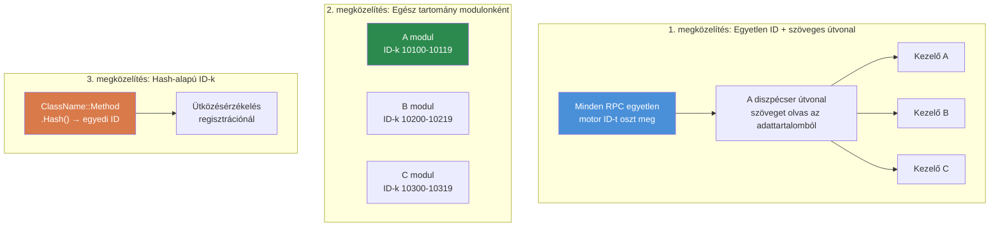

# 7.3. fejezet: RPC kommunikációs minták

[Kezdőlap](../../README.md) | [<< Előző: Modul rendszerek](02-module-systems.md) | **RPC kommunikációs minták** | [Következő: Konfiguráció perzisztencia >>](04-config-persistence.md)

---

## Bevezetés

A távoli eljáráshívások (RPC-k) az egyetlen módja az adatok kliens és szerver közötti küldésének a DayZ-ben. Minden admin panel, minden szinkronizált UI, minden szerver-kliens értesítés és minden kliens-szerver műveleti kérés RPC-ken keresztül áramlik. Az RPC-k helyes felépítésének megértése --- megfelelő szerializációs sorrenddel, jogosultság-ellenőrzéssel és hibakezeléssel --- elengedhetetlen bármely modhoz, amely többet tesz, mint tárgyakat ad hozzá a CfgVehicles-hez.

Ez a fejezet az alapvető `ScriptRPC` mintát, a kliens-szerver oda-vissza életciklust, a hibakezelést tárgyalja, majd összehasonlítja a DayZ modding közösség által használt három fő RPC útválasztási megközelítést.

---

## Tartalomjegyzék

- [ScriptRPC alapok](#scriptrpc-alapok)
- [Kliens-szerver-kliens oda-vissza](#kliens-szerver-kliens-oda-vissza)
- [Jogosultság-ellenőrzés végrehajtás előtt](#jogosultság-ellenőrzés-végrehajtás-előtt)
- [Hibakezelés és értesítések](#hibakezelés-és-értesítések)
- [Szerializáció: Az olvasás/írás szerződés](#szerializáció-az-olvasásírás-szerződés)
- [Három RPC megközelítés összehasonlítása](#három-rpc-megközelítés-összehasonlítása)
- [Gyakori hibák](#gyakori-hibák)
- [Bevált gyakorlatok](#bevált-gyakorlatok)

---

## ScriptRPC alapok

Minden RPC a DayZ-ben a `ScriptRPC` osztályt használja. A minta mindig ugyanaz: létrehozás, adatírás, küldés.

### Küldő oldal

```c
void SendDamageReport(PlayerIdentity target, string weaponName, float damage)
{
    ScriptRPC rpc = new ScriptRPC();

    // Mezők írása meghatározott sorrendben
    rpc.Write(weaponName);    // 1. mező: string
    rpc.Write(damage);        // 2. mező: float

    // Küldés a motoron keresztül
    // Paraméterek: célobjektum, RPC ID, garantált kézbesítés, címzett
    rpc.Send(null, MY_RPC_ID, true, target);
}
```

### Fogadó oldal

A fogadó a mezőket **pontosan ugyanabban a sorrendben** olvassa, ahogyan írták:

```c
void OnRPC_DamageReport(PlayerIdentity sender, Object target, ParamsReadContext ctx)
{
    string weaponName;
    if (!ctx.Read(weaponName)) return;  // 1. mező: string

    float damage;
    if (!ctx.Read(damage)) return;      // 2. mező: float

    // Adatok felhasználása
    Print("Hit by " + weaponName + " for " + damage.ToString() + " damage");
}
```

### Küldési paraméterek magyarázata

```c
rpc.Send(object, rpcId, guaranteed, identity);
```

| Paraméter | Típus | Leírás |
|-----------|------|-------------|
| `object` | `Object` | A célentitás (pl. játékos vagy jármű). Használj `null`-t globális RPC-khez. |
| `rpcId` | `int` | Az RPC típusát azonosító egész szám. Mindkét oldalon egyeznie kell. |
| `guaranteed` | `bool` | `true` = megbízható (TCP-szerű, veszteség esetén újraküldés). `false` = megbízhatatlan (tüzelj és felejtsd el). |
| `identity` | `PlayerIdentity` | Címzett. Kliensről `null` = küldés a szervernek. Szerverről `null` = küldés minden kliensnek. Meghatározott identity = küldés annak a kliensnek. |

### Mikor használd a `guaranteed`-et

- **`true` (megbízható):** Konfigurációváltozások, jogosultság-megadások, teleport parancsok, tiltási műveletek --- bármi, ahol egy elvesztett csomag szinkronizációs eltérést okozna a kliens és szerver között.
- **`false` (megbízhatatlan):** Gyors pozíciófrissítések, vizuális effektek, HUD állapot, ami néhány másodpercenként frissül amúgy is. Alacsonyabb többletterhelés, nincs újraküldési sor.

---

## Kliens-szerver-kliens oda-vissza

A leggyakoribb RPC minta az oda-vissza: a kliens kérelmez egy műveletet, a szerver validálja és végrehajtja, a szerver visszaküldi az eredményt.

```
KLIENS                          SZERVER
  │                               │
  │  1. Kérés RPC ──────────────►  │
  │     (művelet + paraméterek)    │
  │                               │  2. Jogosultság validálása
  │                               │  3. Művelet végrehajtása
  │                               │  4. Válasz előkészítése
  │  ◄───────────── 5. Válasz RPC │
  │     (eredmény + adatok)        │
  │                               │
  │  6. UI frissítése              │
```

### Teljes példa: Teleport kérés

**A kliens elküldi a kérést:**

```c
class TeleportClient
{
    void RequestTeleport(vector position)
    {
        ScriptRPC rpc = new ScriptRPC();
        rpc.Write(position);
        rpc.Send(null, MY_RPC_TELEPORT, true, null);  // null identity = küldés a szervernek
    }
};
```

**A szerver fogadja, validálja, végrehajtja, válaszol:**

```c
class TeleportServer
{
    void OnRPC_TeleportRequest(PlayerIdentity sender, Object target, ParamsReadContext ctx)
    {
        // 1. Kérési adatok olvasása
        vector position;
        if (!ctx.Read(position)) return;

        // 2. Jogosultság validálása
        if (!MyPermissions.GetInstance().HasPermission(sender.GetPlainId(), "MyMod.Admin.Teleport"))
        {
            SendError(sender, "No permission to teleport");
            return;
        }

        // 3. Adatok validálása
        if (position[1] < 0 || position[1] > 1000)
        {
            SendError(sender, "Invalid teleport height");
            return;
        }

        // 4. Művelet végrehajtása
        PlayerBase player = PlayerBase.Cast(sender.GetPlayer());
        if (!player) return;

        player.SetPosition(position);

        // 5. Sikeres válasz küldése
        ScriptRPC response = new ScriptRPC();
        response.Write(true);           // siker jelző
        response.Write(position);       // pozíció visszaküldése
        response.Send(null, MY_RPC_TELEPORT_RESULT, true, sender);
    }
};
```

**A kliens fogadja a választ:**

```c
class TeleportClient
{
    void OnRPC_TeleportResult(PlayerIdentity sender, Object target, ParamsReadContext ctx)
    {
        bool success;
        if (!ctx.Read(success)) return;

        vector position;
        if (!ctx.Read(position)) return;

        if (success)
        {
            // UI frissítése: "Teleported to X, Y, Z"
        }
    }
};
```

---

## Jogosultság-ellenőrzés végrehajtás előtt

Minden szerver oldali RPC kezelő, amely privilegizált műveletet végez, **köteles** a jogosultságokat ellenőrizni a végrehajtás előtt. Soha ne bízz meg a kliensben.

### A minta

```c
void OnRPC_AdminAction(PlayerIdentity sender, Object target, ParamsReadContext ctx)
{
    // 1. SZABÁLY: Mindig validáld, hogy a küldő létezik
    if (!sender) return;

    // 2. SZABÁLY: Ellenőrizd a jogosultságot az adatok olvasása előtt
    if (!MyPermissions.GetInstance().HasPermission(sender.GetPlainId(), "MyMod.Admin.Ban"))
    {
        MyLog.Warning("BanRPC", "Unauthorized ban attempt from " + sender.GetName());
        return;
    }

    // 3. SZABÁLY: Csak most olvasd és hajtsd végre
    string targetUid;
    if (!ctx.Read(targetUid)) return;

    // ... tiltás végrehajtása
}
```

### Miért ellenőrizd az olvasás előtt?

Egy jogosulatlan klienstől érkező adatok olvasása szerver ciklusokat pazarol. Ennél is fontosabb, hogy egy rosszindulatú kliens hibás adatai elemzési hibákat okozhatnak. A jogosultság ellenőrzése először egy olcsó védelem, amely azonnal elutasítja a rossz szereplőket.

### Jogosulatlan kísérletek naplózása

Mindig naplózd a sikertelen jogosultság-ellenőrzéseket. Ez audit nyomot hoz létre és segíti a szerver-tulajdonosokat a kihasználási kísérletek felismerésében:

```c
if (!HasPermission(sender, "MyMod.Spawn"))
{
    MyLog.Warning("SpawnRPC", "Denied spawn request from "
        + sender.GetName() + " (" + sender.GetPlainId() + ")");
    return;
}
```

---

## Hibakezelés és értesítések

Az RPC-k többféleképpen vallhatnak kudarcot: hálózati kiesés, hibás adatok, szerver oldali validációs hibák. A robusztus modok mindezeket kezelik.

### Olvasási hibák

Minden `ctx.Read()` kudarcot vallhat. Mindig ellenőrizd a visszatérési értéket:

```c
// ROSSZ: Olvasási hibák figyelmen kívül hagyása
string name;
ctx.Read(name);     // Ha ez kudarcot vall, a name "" — csendes adatsérülés
int count;
ctx.Read(count);    // Rossz bájtokat olvas — minden utána szemét

// JÓ: Korai visszatérés bármely olvasási hibánál
string name;
if (!ctx.Read(name)) return;
int count;
if (!ctx.Read(count)) return;
```

### Hibaválasz minta

Amikor a szerver elutasít egy kérést, küldj strukturált hibát vissza a kliensnek, hogy az UI megjeleníthesse:

```c
// Szerver: hiba küldése
void SendError(PlayerIdentity target, string errorMsg)
{
    ScriptRPC rpc = new ScriptRPC();
    rpc.Write(false);        // success = false
    rpc.Write(errorMsg);     // ok
    rpc.Send(null, MY_RPC_RESPONSE_ID, true, target);
}

// Kliens: hiba kezelése
void OnRPC_Response(PlayerIdentity sender, Object target, ParamsReadContext ctx)
{
    bool success;
    if (!ctx.Read(success)) return;

    if (!success)
    {
        string errorMsg;
        if (!ctx.Read(errorMsg)) return;

        // Hiba megjelenítése az UI-ban
        MyLog.Warning("MyMod", "Server error: " + errorMsg);
        return;
    }

    // Siker kezelése...
}
```

### Értesítési szórásos küldés

Olyan eseményekhez, amelyeket minden kliensnek látnia kell (killfeed, bejelentések, időjárásváltozások), a szerver szórásos küldést végez `identity = null`-lal:

```c
// Szerver: szórásos küldés minden kliensnek
void BroadcastAnnouncement(string message)
{
    ScriptRPC rpc = new ScriptRPC();
    rpc.Write(message);
    rpc.Send(null, RPC_ANNOUNCEMENT, true, null);  // null = minden kliens
}
```

---

## Szerializáció: Az olvasás/írás szerződés

A DayZ RPC-k legfontosabb szabálya: **az olvasási sorrendnek pontosan meg kell egyeznie az írási sorrenddel, típusról típusra.**

### A szerződés

```c
// A KÜLDŐ ír:
rpc.Write("hello");      // 1. string
rpc.Write(42);           // 2. int
rpc.Write(3.14);         // 3. float
rpc.Write(true);         // 4. bool

// A FOGADÓ UGYANABBAN a sorrendben olvas:
string s;   ctx.Read(s);     // 1. string
int i;      ctx.Read(i);     // 2. int
float f;    ctx.Read(f);     // 3. float
bool b;     ctx.Read(b);     // 4. bool
```

### Mi történik, ha a sorrend eltér

Ha felcseréled az olvasási sorrendet, a deszerializáló az egyik típusnak szánt bájtokat egy másikként értelmezi. Egy `int` olvasás ott, ahol `string` lett írva, szemetet eredményez, és minden további olvasás eltolódik --- megsértve az összes fennmaradó mezőt. A motor nem dob kivételt; csendben rossz adatokat ad vissza, vagy a `Read()` `false`-t ad vissza.

### Támogatott típusok

| Típus | Megjegyzések |
|------|-------|
| `int` | 32 bites előjeles |
| `float` | 32 bites IEEE 754 |
| `bool` | Egyetlen bájt |
| `string` | Hossz-előtagú UTF-8 |
| `vector` | Három float (x, y, z) |
| `Object` (mint target paraméter) | Entitás referencia, a motor oldja fel |

### Gyűjtemények szerializálása

Nincs beépített tömbszerializáció. Először írd a darabszámot, majd minden elemet:

```c
// KÜLDŐ
array<string> names = {"Alice", "Bob", "Charlie"};
rpc.Write(names.Count());
for (int i = 0; i < names.Count(); i++)
{
    rpc.Write(names[i]);
}

// FOGADÓ
int count;
if (!ctx.Read(count)) return;

array<string> names = new array<string>();
for (int i = 0; i < count; i++)
{
    string name;
    if (!ctx.Read(name)) return;
    names.Insert(name);
}
```

### Összetett objektumok szerializálása

Összetett adatokhoz mezőnként szerializálj. Ne próbálj objektumokat közvetlenül `Write()`-on keresztül átadni:

```c
// KÜLDŐ: az objektum lapítása primitívekre
rpc.Write(player.GetName());
rpc.Write(player.GetHealth());
rpc.Write(player.GetPosition());

// FOGADÓ: rekonstruálás
string name;    ctx.Read(name);
float health;   ctx.Read(health);
vector pos;     ctx.Read(pos);
```

---

## Három RPC megközelítés összehasonlítása

A DayZ modding közösség három alapvetően különböző megközelítést használ az RPC útválasztáshoz. Mindegyiknek vannak kompromisszumai.

### Három RPC megközelítés összehasonlítása



### 1. CF nevesített RPC-k

A Community Framework a `GetRPCManager()`-t biztosítja, amely szöveg nevek alapján irányítja az RPC-ket, mod névtérbe csoportosítva.

```c
// Regisztráció (az OnInit-ben):
GetRPCManager().AddRPC("MyMod", "RPC_SpawnItem", this, SingleplayerExecutionType.Server);

// Küldés a kliensről:
GetRPCManager().SendRPC("MyMod", "RPC_SpawnItem", new Param1<string>("AK74"), true);

// A kezelő fogadja:
void RPC_SpawnItem(CallType type, ParamsReadContext ctx, PlayerIdentity sender, Object target)
{
    if (type != CallType.Server) return;

    Param1<string> data;
    if (!ctx.Read(data)) return;

    string className = data.param1;
    // ... tárgy spawnolása
}
```

**Előnyök:**
- A szöveg-alapú útválasztás ember által olvasható és ütközésmentes
- A névtér csoportosítás (`"MyMod"`) megakadályozza a nevek ütközését modok között
- Széles körben használt --- ha COT/Expansion-nel integrálsz, ezt használod

**Hátrányok:**
- CF-t igényel függőségként
- `Param` burkolókat használ, amelyek bőbeszédűek összetett adattartalomhoz
- Szöveg összehasonlítás minden diszpécseléskor (minimális többletterhelés)

### 2. COT / Vanilla egész-tartomány RPC-k

A vanilla DayZ és a COT egyes részei nyers egész RPC ID-kat használnak. Minden mod egy egész tartományt foglal le és modolt `OnRPC` felülírásban diszpécsel.

```c
// RPC ID-k definiálása (válassz egyedi tartományt az ütközések elkerüléséhez)
const int MY_RPC_SPAWN_ITEM     = 90001;
const int MY_RPC_DELETE_ITEM    = 90002;
const int MY_RPC_TELEPORT       = 90003;

// Küldés:
ScriptRPC rpc = new ScriptRPC();
rpc.Write("AK74");
rpc.Send(null, MY_RPC_SPAWN_ITEM, true, null);

// Fogadás (modolt DayZGame-ben vagy entitásban):
modded class DayZGame
{
    override void OnRPC(PlayerIdentity sender, Object target, int rpc_type, ParamsReadContext ctx)
    {
        switch (rpc_type)
        {
            case MY_RPC_SPAWN_ITEM:
                HandleSpawnItem(sender, ctx);
                return;
            case MY_RPC_DELETE_ITEM:
                HandleDeleteItem(sender, ctx);
                return;
        }

        super.OnRPC(sender, target, rpc_type, ctx);
    }
};
```

**Előnyök:**
- Nincs függőség --- a vanilla DayZ-zel működik
- Az egész összehasonlítás gyors
- Teljes kontroll az RPC csővezeték felett

**Hátrányok:**
- **ID ütközési kockázat**: két mod, amely ugyanazt az egész tartományt választja, csendben elfogja egymás RPC-it
- A kézi diszpécser logika (switch/case) sok RPC-nél kezelhetetlenné válik
- Nincs névtér elszigetelés
- Nincs beépített nyilvántartás vagy felfedezhetőség

### 3. Egyéni szöveg-útválasztásos RPC-k

Egy egyéni szöveg-útválasztásos rendszer egyetlen motor RPC ID-t használ és multiplexel azáltal, hogy mod nevet + függvénynevet ír szöveg fejlécként minden RPC-be. Minden útválasztás egy statikus menedzser osztályon belül történik (a példában `MyRPC`).

```c
// Regisztráció:
MyRPC.Register("MyMod", "RPC_SpawnItem", this, MyRPCSide.SERVER);

// Küldés (csak fejléc, nincs adattartalom):
MyRPC.Send("MyMod", "RPC_SpawnItem", null, true, null);

// Küldés (adattartalommal):
ScriptRPC rpc = MyRPC.CreateRPC("MyMod", "RPC_SpawnItem");
rpc.Write("AK74");
rpc.Write(5);    // mennyiség
rpc.Send(null, MyRPC.FRAMEWORK_RPC_ID, true, null);

// Kezelő:
void RPC_SpawnItem(PlayerIdentity sender, Object target, ParamsReadContext ctx)
{
    string className;
    if (!ctx.Read(className)) return;

    int quantity;
    if (!ctx.Read(quantity)) return;

    // ... tárgyak spawnolása
}
```

**Előnyök:**
- Nulla ütközési kockázat --- szöveg névtér + függvénynév globálisan egyedi
- Nulla CF függőség (de opcionálisan átjár a CF `GetRPCManager()`-éhez, ha a CF jelen van)
- Egyetlen motor ID minimális hook lábnyomot jelent
- A `CreateRPC()` segédfüggvény előre beírja az útválasztási fejlécet, így csak az adattartalmat kell írnod
- Tiszta kezelő szignatúra: `(PlayerIdentity, Object, ParamsReadContext)`

**Hátrányok:**
- Két extra szöveg olvasás RPC-nként (az útválasztási fejléc) --- a gyakorlatban minimális többletterhelés
- Az egyéni rendszer azt jelenti, hogy más modok nem fedezhetik fel az RPC-idet a CF nyilvántartásán keresztül
- Csak `CallFunctionParams` reflexión keresztül diszpécsel, ami kicsit lassabb a közvetlen metódushívásnál

### Összehasonlító táblázat

| Jellemző | CF nevesített | Egész-tartomány | Egyéni szöveg-útválasztásos |
|---------|----------|---------------|---------------------|
| **Ütközési kockázat** | Nincs (névteres) | Magas | Nincs (névteres) |
| **Függőségek** | CF szükséges | Nincs | Nincs |
| **Kezelő szignatúra** | `(CallType, ctx, sender, target)` | Egyéni | `(sender, target, ctx)` |
| **Felfedezhetőség** | CF nyilvántartás | Nincs | `MyRPC.s_Handlers` |
| **Diszpécselési többletterhelés** | Szöveg keresés | Egész switch | Szöveg keresés |
| **Adattartalom stílus** | Param burkolók | Nyers Write/Read | Nyers Write/Read |
| **CF átjárás** | Natív | Kézi | Automatikus (`#ifdef`) |

### Melyiket kellene használnod?

- **A modod amúgy is CF-től függ** (COT/Expansion integráció): használj CF nevesített RPC-ket
- **Önálló mod, minimális függőségek**: használj egész-tartományt vagy építs szöveg-útválasztásos rendszert
- **Keretrendszert építesz**: fontold meg a szöveg-útválasztásos rendszert, mint a fenti egyéni `MyRPC` minta
- **Tanulás / prototípus**: az egész-tartomány a legegyszerűbb megérteni

---

## Gyakori hibák

### 1. A kezelő regisztrációjának elfelejtése

RPC-t küldesz, de a másik oldalon semmi nem történik. A kezelő soha nem lett regisztrálva.

```c
// HIBÁS: Nincs regisztráció — a szerver soha nem tud erről a kezelőről
class MyModule
{
    void RPC_DoThing(PlayerIdentity sender, Object target, ParamsReadContext ctx) { ... }
};

// HELYES: Regisztrálj az OnInit-ben
class MyModule
{
    void OnInit()
    {
        MyRPC.Register("MyMod", "RPC_DoThing", this, MyRPCSide.SERVER);
    }

    void RPC_DoThing(PlayerIdentity sender, Object target, ParamsReadContext ctx) { ... }
};
```

### 2. Olvasási/írási sorrend eltérés

A leggyakoribb RPC hiba. A küldő `(string, int, float)`-t ír, de a fogadó `(string, float, int)`-et olvas. Nincs hibaüzenet --- csak szemét adatok.

**Javítás:** Írj megjegyzés blokkot a mezősorrend dokumentálásához mind a küldő, mind a fogadó oldalon:

```c
// Átviteli formátum: [string weaponName] [int damage] [float distance]
```

### 3. Kliens-oldali adatok küldése a szervernek

A szerver nem tudja olvasni a kliens oldali widget állapotot, input állapotot vagy lokális változókat. Ha egy UI választást kell a szervernek küldened, szerializáld a releváns értéket (szöveg, index, ID) --- ne magát a widget objektumot.

### 4. Szórásos küldés egyedi küldés helyett

```c
// HIBÁS: MINDEN kliensnek küld, amikor egynek szántad
rpc.Send(null, MY_RPC_ID, true, null);

// HELYES: Küldés a konkrét kliensnek
rpc.Send(null, MY_RPC_ID, true, targetIdentity);
```

### 5. Elavult kezelők kezelése küldetés-újraindításkor

Ha egy modul regisztrál egy RPC kezelőt, majd a küldetés végén megsemmisül, a kezelő továbbra is a halott objektumra mutat. A következő RPC diszpécselés összeomlást okoz.

**Javítás:** Mindig töröld a regisztrációt vagy takarítsd ki a kezelőket a küldetés befejezésekor:

```c
override void OnMissionFinish()
{
    MyRPC.Unregister("MyMod", "RPC_DoThing");
}
```

Vagy használj centralizált `Cleanup()`-ot, amely kitörli a teljes kezelő térképet (ahogy a `MyRPC.Cleanup()` teszi).

---

## Bevált gyakorlatok

1. **Mindig ellenőrizd a `ctx.Read()` visszatérési értékét.** Minden olvasás kudarcot vallhat. Azonnal térj vissza kudarc esetén.

2. **Mindig validáld a küldőt a szerveren.** Ellenőrizd, hogy a `sender` nem-null és rendelkezik a szükséges jogosultsággal, mielőtt bármit tennél.

3. **Dokumentáld az átviteli formátumot.** Mind a küldő, mind a fogadó oldalon írj megjegyzést, amely felsorolja a mezőket sorrendben a típusaikkal.

4. **Használj megbízható kézbesítést állapotváltozásokhoz.** A megbízhatatlan kézbesítés csak gyors, mulandó frissítésekhez megfelelő (pozíció, effektek).

5. **Tartsd kicsinek az adattartalmakat.** A DayZ-nek van gyakorlati RPC-nkénti méretkorlátja. Nagy adatokhoz (konfiguráció szinkronizálás, játékos listák) bontsd több RPC-re vagy használj lapozást.

6. **Regisztráld a kezelőket korán.** Az `OnInit()` a legbiztonságosabb hely. A kliensek csatlakozhatnak, mielőtt az `OnMissionStart()` befejeződik.

7. **Takarítsd ki a kezelőket leállításkor.** Vagy töröld a regisztrációt egyenként, vagy töröld a teljes nyilvántartást az `OnMissionFinish()`-ben.

8. **Használd a `CreateRPC()`-t adattartalomhoz, a `Send()`-et jelzésekhez.** Ha nincs küldendő adatod (csak egy "csináld" jelzés), használd a csak-fejléces `Send()`-et. Ha van adatod, használd a `CreateRPC()` + kézi írások + kézi `rpc.Send()` kombinációt.

---

## Kompatibilitás és hatás

- **Multi-Mod:** Az egész-tartomány RPC-k ütközésérzékenyek --- két mod, amely ugyanazt az ID-t választja, csendben elfogja egymás üzeneteit. A szöveg-útválasztásos vagy CF nevesített RPC-k elkerülik ezt a névtér + függvénynév kulcs használatával.
- **Betöltési sorrend:** Az RPC kezelő regisztrációs sorrend csak akkor számít, ha több mod `modded class DayZGame`-et használ és felülírja az `OnRPC`-t. Mindegyiknek hívnia kell a `super.OnRPC()`-t a nem kezelt ID-khoz, különben az alább lévő modok soha nem kapják meg az RPC-iket. A szöveg-útválasztásos rendszerek elkerülik ezt egyetlen motor ID használatával.
- **Listen szerver:** Listen szervereken a kliens és a szerver ugyanabban a folyamatban fut. A szerver oldalról `identity = null`-lal küldött RPC helyben is fogadódik. Védd a kezelőket `if (type != CallType.Server) return;` ellenőrzéssel vagy használd a `GetGame().IsServer()` / `GetGame().IsClient()` ellenőrzést szükség szerint.
- **Teljesítmény:** Az RPC diszpécselési többletterhelés minimális (szöveg keresés vagy egész switch). A szűk keresztmetszet az adattartalom mérete --- a DayZ-nek van gyakorlati RPC-nkénti korlátja (~64 KB). Nagy adatokhoz (konfiguráció szinkronizálás) lapozz több RPC-n keresztül.
- **Migráció:** Az RPC ID-k mod-belső részletek és nem érintik a DayZ verziófrissítések. Ha megváltoztatod az RPC átviteli formátumodat (mezőket adsz hozzá/távolítasz el), a régi kliensek az új szerverrel csendben deszinkronizálódnak. Verziózd az RPC adattartalmakat vagy kényszerítsd a kliens frissítéseket.

---

## Elmélet vs gyakorlat

| Az elmélet azt mondja | DayZ valóság |
|---------------|-------------|
| Használj protocol buffereket vagy séma-alapú szerializációt | Az Enforce Scriptben nincs protobuf támogatás; kézzel `Write`/`Read`-elsz primitíveket egyeztetett sorrendben |
| Validálj minden bemenetet séma érvényesítéssel | Nem létezik séma validáció; minden `ctx.Read()` visszatérési értéket egyenként kell ellenőrizni |
| Az RPC-k legyenek idempotensek | A gyakorlatban a DayZ-ben ez csak lekérdezési RPC-knél kivitelezhető; a mutációs RPC-k (spawn, törlés, teleport) eredendően nem-idempotensek --- védd jogosultság-ellenőrzéssel helyette |

---

[Kezdőlap](../../README.md) | [<< Előző: Modul rendszerek](02-module-systems.md) | **RPC kommunikációs minták** | [Következő: Konfiguráció perzisztencia >>](04-config-persistence.md)
