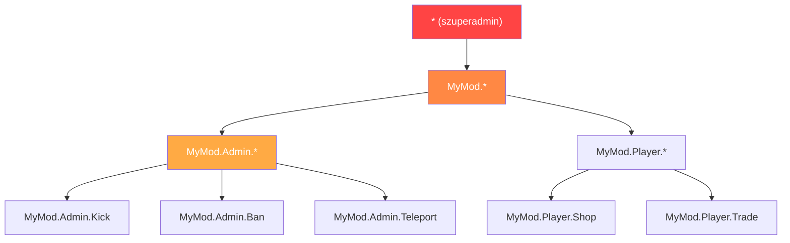

# 7.5. fejezet: Jogosultsági rendszerek

[Kezdőlap](../../README.md) | [<< Előző: Konfiguráció perzisztencia](04-config-persistence.md) | **Jogosultsági rendszerek** | [Következő: Eseményvezérelt architektúra >>](06-events.md)

---

## Bevezetés

Minden admin eszköz, minden privilegizált művelet és minden moderálási funkció a DayZ-ben jogosultsági rendszert igényel. A kérdés nem az, hogy ellenőrizzük-e a jogosultságokat, hanem az, hogyan strukturáljuk őket. A DayZ modding közösség három fő mintát alakított ki: hierarchikus pont-elválasztásos jogosultságok, felhasználói csoport alapú szerepkiosztás (VPP), és keretrendszer szintű szerep-alapú hozzáférés (CF/COT). Mindegyiknek más kompromisszumai vannak a granularitás, komplexitás és szerver-tulajdonosi élmény terén.

Ez a fejezet mindhárom mintát, a jogosultság-ellenőrzési folyamatot, a tárolási formátumokat és a wildcard/szuperadmin kezelést tárgyalja.

---

## Tartalomjegyzék

- [Miért fontosak a jogosultságok](#miért-fontosak-a-jogosultságok)
- [Hierarchikus pont-elválasztásos (MyMod minta)](#hierarchikus-pont-elválasztásos-mymod-minta)
- [VPP UserGroup minta](#vpp-usergroup-minta)
- [CF szerep-alapú minta (COT)](#cf-szerep-alapú-minta-cot)
- [Jogosultság-ellenőrzési folyamat](#jogosultság-ellenőrzési-folyamat)
- [Tárolási formátumok](#tárolási-formátumok)
- [Wildcard és szuperadmin minták](#wildcard-és-szuperadmin-minták)
- [Migráció rendszerek között](#migráció-rendszerek-között)
- [Bevált gyakorlatok](#bevált-gyakorlatok)

---

## Miért fontosak a jogosultságok

Jogosultsági rendszer nélkül két lehetőséged van: vagy minden játékos mindent megtehet (káosz), vagy beégeted a Steam64 ID-kat a szkriptjeidbe (karbantarthatatlan). A jogosultsági rendszer lehetővé teszi, hogy a szerver-tulajdonosok meghatározzák, ki mit tehet, kódmódosítás nélkül.

A három biztonsági szabály:

1. **Soha ne bízz meg a kliensben.** A kliens kérést küld; a szerver dönti el, hogy teljesíti-e.
2. **Alapértelmezett tiltás.** Ha egy játékos nem kapott kifejezetten jogosultságot, akkor nincs neki.
3. **Hibánál zárj.** Ha maga a jogosultság-ellenőrzés sikertelen (null identity, sérült adatok), tagadd meg a műveletet.

---

## Hierarchikus pont-elválasztásos (MyMod minta)

Ez a minta pont-elválasztásos jogosultsági szövegeket használ, fa hierarchiába szervezve. Minden jogosultság egy útvonal, mint a `"MyMod.Admin.Teleport"` vagy `"MyMod.Missions.Start"`. A wildcardok lehetővé teszik teljes részfák megadását.

### Jogosultsági formátum

```
MyMod                           (gyökér névtér)
├── Admin                        (admin eszközök)
│   ├── Panel                    (admin panel megnyitása)
│   ├── Teleport                 (saját/mások teleportálása)
│   ├── Kick                     (játékosok kirúgása)
│   ├── Ban                      (játékosok kitiltása)
│   └── Weather                  (időjárás változtatása)
├── Missions                     (küldetésrendszer)
│   ├── Start                    (küldetések kézi indítása)
│   └── Stop                     (küldetések leállítása)
└── AI                           (AI rendszer)
    ├── Spawn                    (AI kézi spawnolása)
    └── Config                   (AI konfiguráció szerkesztése)
```

### Adatmodell

Minden játékos (Steam64 ID-val azonosítva) rendelkezik a kapott jogosultsági szövegek tömbjével:

```c
class MyPermissionsData
{
    // kulcs: Steam64 ID, érték: jogosultsági szövegek tömbje
    ref map<string, ref TStringArray> Admins;

    void MyPermissionsData()
    {
        Admins = new map<string, ref TStringArray>();
    }
};
```

### Jogosultság-ellenőrzés

Az ellenőrzés végigmegy a játékos kapott jogosultságain és három egyezési típust támogat: pontos egyezés, teljes wildcard (`"*"`) és előtag wildcard (`"MyMod.Admin.*"`):

```c
bool HasPermission(string plainId, string permission)
{
    if (plainId == "" || permission == "")
        return false;

    TStringArray perms;
    if (!m_Permissions.Find(plainId, perms))
        return false;

    for (int i = 0; i < perms.Count(); i++)
    {
        string granted = perms[i];

        // Teljes wildcard: szuperadmin
        if (granted == "*")
            return true;

        // Pontos egyezés
        if (granted == permission)
            return true;

        // Előtag wildcard: "MyMod.Admin.*" egyezik "MyMod.Admin.Teleport"-tal
        if (granted.IndexOf("*") > 0)
        {
            string prefix = granted.Substring(0, granted.Length() - 1);
            if (permission.IndexOf(prefix) == 0)
                return true;
        }
    }

    return false;
}
```

### JSON tárolás

```json
{
    "Admins": {
        "76561198000000001": ["*"],
        "76561198000000002": ["MyMod.Admin.Panel", "MyMod.Admin.Teleport"],
        "76561198000000003": ["MyMod.Missions.*"],
        "76561198000000004": ["MyMod.Admin.Kick", "MyMod.Admin.Ban"]
    }
}
```

### Erősségek

- **Finoman részletezett:** pontosan azokat a jogosultságokat adhatod meg, amire az egyes adminoknak szükségük van
- **Hierarchikus:** a wildcardok teljes részfákat adnak anélkül, hogy minden jogosultságot felsorolnál
- **Öndokumentáló:** a jogosultsági szöveg megmondja, mit vezérel
- **Bővíthető:** az új jogosultságok egyszerűen új szövegek --- nincs sémaváltozás

### Gyengeségek

- **Nincs nevesített szerepkör:** ha 10 adminnak ugyanarra a készletre van szüksége, 10-szer sorolod fel
- **Szöveg-alapú:** az elgépelések a jogosultsági szövegekben csendben kudarcot vallanak (egyszerűen nem egyeznek)

---

## VPP UserGroup minta

A VPP Admin Tools csoport-alapú rendszert használ. Nevesített csoportokat (szerepköröket) definiálsz jogosultsági készletekkel, majd játékosokat rendelsz a csoportokhoz.

### Koncepció

```
Csoportok:
  "SuperAdmin"  → [összes jogosultság]
  "Moderator"   → [kick, ban, mute, teleport]
  "Builder"     → [objektumok spawnolása, teleport, ESP]

Játékosok:
  "76561198000000001" → "SuperAdmin"
  "76561198000000002" → "Moderator"
  "76561198000000003" → "Builder"
```

### Implementációs minta

```c
class VPPUserGroup
{
    string GroupName;
    ref array<string> Permissions;
    ref array<string> Members;  // Steam64 ID-k

    bool HasPermission(string permission)
    {
        if (!Permissions) return false;

        for (int i = 0; i < Permissions.Count(); i++)
        {
            if (Permissions[i] == permission)
                return true;
            if (Permissions[i] == "*")
                return true;
        }
        return false;
    }
};

class VPPPermissionManager
{
    ref array<ref VPPUserGroup> m_Groups;

    bool PlayerHasPermission(string plainId, string permission)
    {
        for (int i = 0; i < m_Groups.Count(); i++)
        {
            VPPUserGroup group = m_Groups[i];

            // Ellenőrizd, hogy a játékos ebben a csoportban van-e
            if (group.Members.Find(plainId) == -1)
                continue;

            if (group.HasPermission(permission))
                return true;
        }
        return false;
    }
};
```

### JSON tárolás

```json
{
    "Groups": [
        {
            "GroupName": "SuperAdmin",
            "Permissions": ["*"],
            "Members": ["76561198000000001"]
        },
        {
            "GroupName": "Moderator",
            "Permissions": [
                "admin.kick",
                "admin.ban",
                "admin.mute",
                "admin.teleport"
            ],
            "Members": [
                "76561198000000002",
                "76561198000000003"
            ]
        },
        {
            "GroupName": "Builder",
            "Permissions": [
                "admin.spawn",
                "admin.teleport",
                "admin.esp"
            ],
            "Members": [
                "76561198000000004"
            ]
        }
    ]
}
```

### Erősségek

- **Szerep-alapú:** egyszer definiálod a szerepkört, sok játékoshoz rendeled
- **Ismerős:** a szerver-tulajdonosok értik a csoport/szerepkör rendszereket más játékokból
- **Egyszerű tömeges változtatás:** egy csoport jogosultságainak módosítása az összes tagra érvényes

### Gyengeségek

- **Kevésbé részletezett extra munka nélkül:** egyetlen konkrét admin egyetlen extra jogosultsággal való felruházása új csoportot vagy játékos szintű felülbírálásokat igényel
- **A csoport öröklés bonyolult:** a VPP natívan nem támogatja a csoporthierarchiát (pl. az "Admin" örökli az összes "Moderator" jogosultságot)

---

## CF szerep-alapú minta (COT)

A Community Framework / COT szerep- és jogosultsági rendszert használ, ahol a szerepkörök explicit jogosultsági készletekkel definiáltak, és a játékosok szerepkörökhöz vannak rendelve.

### Koncepció

A CF jogosultsági rendszere hasonló a VPP csoportjaihoz, de a keretrendszer szintjébe integrált, így minden CF-alapú mod számára elérhető:

```c
// COT minta (egyszerűsítve)
// A szerepkörök az AuthFile.json-ban vannak definiálva
// Minden szerepkörnek van neve és jogosultsági tömbje
// A játékosok Steam64 ID-val vannak szerepkörökhöz rendelve

class CF_Permission
{
    string m_Name;
    ref array<ref CF_Permission> m_Children;
    int m_State;  // ALLOW, DENY, INHERIT
};
```

### Jogosultsági fa

A CF a jogosultságokat fastruktúraként ábrázolja, ahol minden csomópont kifejezetten engedélyezhető, tiltható vagy örökölheti a szülőjét:

```
Root
├── Admin [ALLOW]
│   ├── Kick [INHERIT → ALLOW]
│   ├── Ban [INHERIT → ALLOW]
│   └── Teleport [DENY]        ← Kifejezetten tiltva, annak ellenére, hogy az Admin ALLOW
└── ESP [ALLOW]
```

Ez a háromállapotú rendszer (engedélyezés/tiltás/öröklés) kifejezőbb, mint a MyMod és a VPP által használt kétértékű (megadott/nem megadott) rendszerek. Lehetővé teszi, hogy széles kategóriát adj meg, majd kivételeket faragj belőle.

### JSON tárolás

```json
{
    "Roles": {
        "Moderator": {
            "admin": {
                "kick": 2,
                "ban": 2,
                "teleport": 1
            }
        }
    },
    "Players": {
        "76561198000000001": {
            "Role": "SuperAdmin"
        }
    }
}
```

(Ahol `2 = ALLOW`, `1 = DENY`, `0 = INHERIT`)

### Erősségek

- **Háromállapotú jogosultságok:** engedélyezés, tiltás, öröklés maximális rugalmasságot ad
- **Fastruktúra:** tükrözi a jogosultsági útvonalak hierarchikus természetét
- **Keretrendszer szintű:** minden CF mod ugyanazt a jogosultsági rendszert használja

### Gyengeségek

- **Bonyolultság:** a három állapot nehezebben érthető a szerver-tulajdonosok számára, mint az egyszerű "megadott"
- **CF függőség:** csak a Community Framework-kel működik

---

## Jogosultság-ellenőrzési folyamat

Függetlenül attól, melyik rendszert használod, a szerver oldali jogosultság-ellenőrzés ugyanazt a mintát követi:

```
A kliens RPC kérést küld
        │
        ▼
A szerver RPC kezelő fogadja
        │
        ▼
    ┌─────────────────────────────────┐
    │ A küldő identity nem-null?       │
    │ (Hálózati szintű validáció)      │
    └───────────┬─────────────────────┘
                │ Nem → return (csendben eldobja)
                │ Igen ▼
    ┌─────────────────────────────────┐
    │ A küldőnek megvan a szükséges    │
    │ jogosultsága ehhez a művelethez? │
    └───────────┬─────────────────────┘
                │ Nem → figyelmeztetés naplózása, opcionálisan hibaküldés a kliensnek, return
                │ Igen ▼
    ┌─────────────────────────────────┐
    │ Kérési adatok validálása         │
    │ (paraméterek olvasása, határok   │
    │ ellenőrzése)                     │
    └───────────┬─────────────────────┘
                │ Érvénytelen → hibaküldés a kliensnek, return
                │ Érvényes ▼
    ┌─────────────────────────────────┐
    │ A privilegizált művelet végrehajtása │
    │ A művelet naplózása admin ID-val │
    │ Sikeres válasz küldése           │
    └─────────────────────────────────┘
```

### Implementáció

```c
void OnRPC_KickPlayer(PlayerIdentity sender, Object target, ParamsReadContext ctx)
{
    // 1. lépés: Küldő validálása
    if (!sender) return;

    // 2. lépés: Jogosultság ellenőrzése
    if (!MyPermissions.GetInstance().HasPermission(sender.GetPlainId(), "MyMod.Admin.Kick"))
    {
        MyLog.Warning("Admin", "Unauthorized kick attempt: " + sender.GetName());
        return;
    }

    // 3. lépés: Adatok olvasása és validálása
    string targetUid;
    if (!ctx.Read(targetUid)) return;

    if (targetUid == sender.GetPlainId())
    {
        // Nem rúghatod ki saját magadat
        SendError(sender, "Cannot kick yourself");
        return;
    }

    // 4. lépés: Végrehajtás
    PlayerIdentity targetIdentity = FindPlayerByUid(targetUid);
    if (!targetIdentity)
    {
        SendError(sender, "Player not found");
        return;
    }

    GetGame().DisconnectPlayer(targetIdentity);

    // 5. lépés: Naplózás és válasz
    MyLog.Info("Admin", sender.GetName() + " kicked " + targetIdentity.GetName());
    SendSuccess(sender, "Player kicked");
}
```

---

## Tárolási formátumok

Mindhárom rendszer JSON-ban tárolja a jogosultságokat. A különbségek strukturálisak:

### Sima játékosonkénti

```json
{
    "Admins": {
        "STEAM64_ID": ["perm.a", "perm.b", "perm.c"]
    }
}
```

**Fájl:** Egy fájl az összes játékosnak.
**Előny:** Egyszerű, könnyen kézzel szerkeszthető.
**Hátrány:** Redundáns, ha sok játékosnak ugyanazok a jogosultságai.

### Játékosonkénti fájl (Expansion / Player Data)

```json
// Fájl: $profile:MyMod/Players/76561198xxxxx.json
{
    "UID": "76561198xxxxx",
    "Permissions": ["perm.a", "perm.b"],
    "LastLogin": "2025-01-15 14:30:00"
}
```

**Előny:** Minden játékos független; nincsenek zárolási problémák.
**Hátrány:** Sok kis fájl; a "kinek van X jogosultsága?" keresés az összes fájl átfésülését igényli.

### Csoport-alapú (VPP)

```json
{
    "Groups": [
        {
            "GroupName": "RoleName",
            "Permissions": ["perm.a", "perm.b"],
            "Members": ["STEAM64_ID_1", "STEAM64_ID_2"]
        }
    ]
}
```

**Előny:** A szerepkör változtatások azonnal érvényesülnek az összes tagra.
**Hátrány:** Egy játékos nem kaphat könnyen játékosonkénti jogosultsági felülbírálásokat dedikált csoport nélkül.

### Formátum kiválasztása

| Tényező | Sima játékosonkénti | Játékosonkénti fájl | Csoport-alapú |
|--------|----------------|-----------------|-------------|
| **Kis szerver (1-5 admin)** | Legjobb | Túlzás | Túlzás |
| **Közepes szerver (5-20 admin)** | Jó | Jó | Legjobb |
| **Nagy közösség (20+ szerepkör)** | Redundáns | A fájlok szaporodnak | Legjobb |
| **Játékosonkénti testreszabás** | Natív | Natív | Megoldás szükséges |
| **Kézi szerkesztés** | Könnyű | Könnyű játékosonként | Közepes |

---

## Wildcard és szuperadmin minták



### Teljes wildcard: `"*"`

Minden jogosultságot megad. Ez a szuperadmin minta. A `"*"` jogosultsággal rendelkező játékos bármit megtehet.

```c
if (granted == "*")
    return true;
```

**Konvenció:** A DayZ modding közösség minden jogosultsági rendszere a `"*"`-ot használja szuperadminra. Ne találj ki más konvenciót.

### Előtag wildcard: `"MyMod.Admin.*"`

Minden `"MyMod.Admin."`-nal kezdődő jogosultságot megad. Ez lehetővé teszi egy teljes alrendszer megadását minden jogosultság felsorolása nélkül:

```c
// "MyMod.Admin.*" egyezik:
//   "MyMod.Admin.Teleport"  ✓
//   "MyMod.Admin.Kick"      ✓
//   "MyMod.Admin.Ban"       ✓
//   "MyMod.Missions.Start"  ✗ (más részfa)
```

### Implementáció

```c
if (granted.IndexOf("*") > 0)
{
    // "MyMod.Admin.*" → prefix = "MyMod.Admin."
    string prefix = granted.Substring(0, granted.Length() - 1);
    if (permission.IndexOf(prefix) == 0)
        return true;
}
```

### Nincs negatív jogosultság (pont-elválasztásos / VPP)

Mind a pont-elválasztásos, mind a VPP rendszer additív jogosultságokat használ. Jogosultságokat adhatsz, de nem tilthatsz kifejezetten. Ha egy jogosultság nincs a játékos listájában, az tiltott.

A CF/COT kivétel a háromállapotú rendszerével (ALLOW/DENY/INHERIT), amely támogatja az explicit tiltásokat.

### Szuperadmin kiskapu

Biztosíts módot annak ellenőrzésére, hogy valaki szuperadmin-e, anélkül, hogy konkrét jogosultságot ellenőriznél. Ez hasznos a megkerülési logikához:

```c
bool IsSuperAdmin(string plainId)
{
    return HasPermission(plainId, "*");
}
```

---

## Migráció rendszerek között

Ha a modod támogatnia kell az egyik jogosultsági rendszerről a másikra migráló szervereket (pl. sima admin UID listáról hierarchikus jogosultságokra), valósíts meg automatikus migrációt betöltéskor:

```c
void Load()
{
    if (!FileExist(PERMISSIONS_FILE))
    {
        CreateDefaultFile();
        return;
    }

    // Először próbáld az új formátumot
    if (LoadNewFormat())
        return;

    // Visszaesés a régi formátumra és migráció
    LoadLegacyAndMigrate();
}

void LoadLegacyAndMigrate()
{
    // Régi formátum olvasása: { "AdminUIDs": ["uid1", "uid2"] }
    LegacyPermissionData legacyData = new LegacyPermissionData();
    JsonFileLoader<LegacyPermissionData>.JsonLoadFile(PERMISSIONS_FILE, legacyData);

    // Migráció: minden régi admin szuperadmin lesz az új rendszerben
    for (int i = 0; i < legacyData.AdminUIDs.Count(); i++)
    {
        string uid = legacyData.AdminUIDs[i];
        GrantPermission(uid, "*");
    }

    // Mentés új formátumban
    Save();
    MyLog.Info("Permissions", "Migrated " + legacyData.AdminUIDs.Count().ToString()
        + " admin(s) from legacy format");
}
```

Ez egy gyakori minta az eredeti sima `AdminUIDs` tömbről a hierarchikus `Admins` map-re való migrációhoz.

---

## Bevált gyakorlatok

1. **Alapértelmezett tiltás.** Ha egy jogosultság nincs kifejezetten megadva, a válasz "nem".

2. **Ellenőrizd a szerveren, soha a kliensen.** A kliens oldali jogosultság-ellenőrzések csak az UI kényelmét szolgálják (gombok elrejtése). A szervernek mindig újra kell ellenőriznie.

3. **Használd a `"*"`-ot szuperadminra.** Ez az univerzális konvenció. Ne találj ki `"all"`, `"admin"` vagy `"root"` alternatívát.

4. **Naplózz minden elutasított privilegizált műveletet.** Ez a biztonsági audit nyomod.

5. **Biztosíts alapértelmezett jogosultsági fájlt helyőrzővel.** Az új szerver-tulajdonosoknak világos példát kell látniuk:

```json
{
    "Admins": {
        "PUT_STEAM64_ID_HERE": ["*"]
    }
}
```

6. **Névtérbe szervezd a jogosultságaidat.** Használd a `"YourMod.Category.Action"` formátumot az ütközések elkerüléséhez más modokkal.

7. **Támogasd az előtag wildcardokat.** A szerver-tulajdonosoknak tudniuk kell `"YourMod.Admin.*"`-ot megadni ahelyett, hogy minden admin jogosultságot egyenként felsorolnának.

8. **Tartsd a jogosultsági fájlt kézzel szerkeszthetőnek.** A szerver-tulajdonosok kézzel fogják szerkeszteni. Használj világos kulcsneveket, soronként egy jogosultságot a JSON-ban, és dokumentáld az elérhető jogosultságokat valahol a mod dokumentációjában.

9. **Valósítsd meg a migrációt az első naptól.** Amikor a jogosultsági formátumod változik (és változni fog), az automatikus migráció megelőzi a support jegyeket.

10. **Szinkronizáld a jogosultságokat a klienshez csatlakozáskor.** A kliensnek ismernie kell a saját jogosultságait az UI célokra (admin gombok megjelenítése/elrejtése). Küldj összefoglalót csatlakozáskor; ne küldd a teljes szerver jogosultsági fájlt.

---

## Kompatibilitás és hatás

- **Multi-Mod:** Minden mod definiálhatja a saját jogosultsági névterét (`"ModA.Admin.Kick"`, `"ModB.Build.Spawn"`). A `"*"` wildcard szuperadmint ad az *összes* modra, amely közös jogosultsági tárolót használ. Ha a modok független jogosultsági fájlokat használnak, a `"*"` csak az adott mod hatókörén belül érvényes.
- **Betöltési sorrend:** A jogosultsági fájlok egyszer töltődnek be a szerver indításakor. Nincs mod-közi sorrendiségi probléma, amíg minden mod a saját fájlját olvassa. Ha egy közös keretrendszer (CF/COT) kezeli a jogosultságokat, minden mod, amely azt a keretrendszert használja, ugyanazon a jogosultsági fán osztozik.
- **Listen szerver:** A jogosultság-ellenőrzéseknek mindig szerver oldalon kell futniuk. Listen szervereken a kliens oldali kód hívhatja a `HasPermission()`-t az UI kapuzásához (admin gombok megjelenítése/elrejtése), de a szerver oldali ellenőrzés a mérvadó.
- **Teljesítmény:** A jogosultság-ellenőrzések szövegtömb lineáris keresést végeznek játékosonként. Tipikus admin számokkal (1--20 admin, 5--30 jogosultság mindegyiknek) ez elhanyagolható. Rendkívül nagy jogosultsági készletekhez fontold meg a `set<string>` használatát tömb helyett az O(1) keresés érdekében.
- **Migráció:** Új jogosultsági szövegek hozzáadása nem-törő --- a meglévő adminoknak egyszerűen nincs meg az új jogosultságuk, amíg nem kapják meg. A jogosultságok átnevezése csendben tönkreteszi a meglévő megadásokat. Használj konfiguráció verziózást az átnevezett jogosultsági szövegek automatikus migrációjához.

---

## Gyakori hibák

| Hiba | Hatás | Javítás |
|---------|--------|-----|
| Kliens által küldött jogosultsági adatokban való megbízás | A kihasznált kliensek "admin vagyok" üzenetet küldenek és a szerver elhiszi; teljes szerver kompromittáció | Soha ne olvass jogosultságokat RPC adattartalomból; mindig a `sender.GetPlainId()`-t keresd ki a szerver oldali jogosultsági tárban |
| Hiányzó alapértelmezett tiltás | A hiányzó jogosultság-ellenőrzés mindenki számára hozzáférést ad; véletlen jogosultság-eszkaláció | Minden privilegizált művelet RPC kezelőjének ellenőriznie kell a `HasPermission()`-t és korán visszatérnie kudarc esetén |
| Elgépelés a jogosultsági szövegben csendben kudarcot vall | A `"MyMod.Amin.Kick"` (elgépelés) soha nem egyezik --- az admin nem tud kirúgni, nincs hibanaplóbejegyzés | Definiáld a jogosultsági szövegeket `static const` változókként; hivatkozz a konstansra, soha ne nyers szöveg literálra |
| A teljes jogosultsági fájl küldése a kliensnek | Minden csatlakozott kliens számára felfedi az összes admin Steam64 ID-ját és jogosultsági készletét | Csak a kérelmező játékos saját jogosultsági listáját küldd, soha ne a teljes szerver fájlt |
| Nincs wildcard támogatás a HasPermission-ben | A szerver-tulajdonosoknak minden egyes jogosultságot fel kell sorolniuk adminonként; fárasztó és hibára hajlamos | Valósítsd meg az előtag wildcardokat (`"MyMod.Admin.*"`) és a teljes wildcardot (`"*"`) az első naptól |

---

## Elmélet vs gyakorlat

| Az elmélet azt mondja | DayZ valóság |
|---------------|-------------|
| Használj RBAC-ot (szerep-alapú hozzáférés-vezérlés) csoport örökléssel | Csak a CF/COT támogat háromállapotú jogosultságokat; a legtöbb mod az egyszerűség kedvéért sima játékosonkénti megadást használ |
| A jogosultságokat adatbázisban kell tárolni | Nincs adatbázis-hozzáférés; JSON fájlok a `$profile:`-ban az egyetlen lehetőség |
| Használj kriptográfiai tokeneket az engedélyezéshez | Nincsenek kriptográfiai könyvtárak az Enforce Scriptben; a bizalom a `PlayerIdentity.GetPlainId()` (Steam64 ID) alapú, amelyet a motor ellenőriz |

---

[Kezdőlap](../../README.md) | [<< Előző: Konfiguráció perzisztencia](04-config-persistence.md) | **Jogosultsági rendszerek** | [Következő: Eseményvezérelt architektúra >>](06-events.md)
