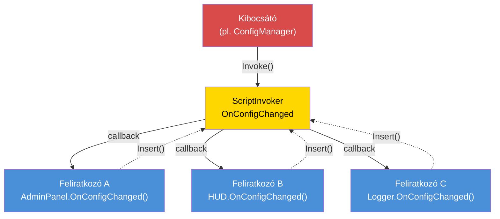

# 7.6. fejezet: Eseményvezérelt architektúra

[Kezdőlap](../../README.md) | [<< Előző: Jogosultsági rendszerek](05-permissions.md) | **Eseményvezérelt architektúra** | [Következő: Teljesítményoptimalizálás >>](07-performance.md)

---

## Bevezetés

Az eseményvezérelt architektúra szétválasztja az esemény kibocsátóját annak fogyasztóitól. Amikor egy játékos csatlakozik, a kapcsolatkezelőnek nem kell tudnia a killfeedről, az admin panelről, a küldetésrendszerről vagy a naplózó modulról --- egyszerűen elindít egy "játékos csatlakozott" eseményt, és minden érdekelt rendszer önállóan feliratkozik rá. Ez a bővíthető mod tervezés alapja: az új funkciók a meglévő eseményekre iratkoznak fel anélkül, hogy módosítanák az azokat kiváltó kódot.

A DayZ a `ScriptInvoker`-t biztosítja beépített esemény primitívként. Erre építve a professzionális modok eseménybuszokat építenek nevesített témákkal, típusos kezelőkkel és életciklus-kezeléssel. Ez a fejezet mindhárom fő mintát és a memóriaszivárgás-megelőzés kritikus fegyelmét tárgyalja.

---

## Tartalomjegyzék

- [ScriptInvoker minta](#scriptinvoker-minta)
- [EventBus minta (szöveg-alapú útválasztás)](#eventbus-minta-szöveg-alapú-útválasztás)
- [CF_EventHandler minta](#cf_eventhandler-minta)
- [Mikor használjunk eseményeket vs közvetlen hívásokat](#mikor-használjunk-eseményeket-vs-közvetlen-hívásokat)
- [Memóriaszivárgás megelőzése](#memóriaszivárgás-megelőzése)
- [Haladó: Egyéni eseményadatok](#haladó-egyéni-eseményadatok)
- [Bevált gyakorlatok](#bevált-gyakorlatok)

---

## ScriptInvoker minta

A `ScriptInvoker` a motor beépített pub/sub primitívje. Callback függvények listáját tartja, és mindegyiket meghívja, amikor egy esemény bekövetkezik. Ez a legalacsonyabb szintű esemény mechanizmus a DayZ-ben.

### Esemény létrehozása

```c
class WeatherManager
{
    // Az esemény. Bárki feliratkozhat, hogy értesüljön az időjárás változásáról.
    ref ScriptInvoker OnWeatherChanged = new ScriptInvoker();

    protected string m_CurrentWeather;

    void SetWeather(string newWeather)
    {
        m_CurrentWeather = newWeather;

        // Esemény kiváltása — minden feliratkozó értesül
        OnWeatherChanged.Invoke(newWeather);
    }
};
```

### Feliratkozás eseményre

```c
class WeatherUI
{
    void Init(WeatherManager mgr)
    {
        // Feliratkozás: időjárás változáskor hívja meg a kezelőnket
        mgr.OnWeatherChanged.Insert(OnWeatherChanged);
    }

    void OnWeatherChanged(string newWeather)
    {
        // UI frissítése
        m_WeatherLabel.SetText("Weather: " + newWeather);
    }

    void Cleanup(WeatherManager mgr)
    {
        // KRITIKUS: Leiratkozás befejezéskor
        mgr.OnWeatherChanged.Remove(OnWeatherChanged);
    }
};
```

### ScriptInvoker API

| Metódus | Leírás |
|--------|-------------|
| `Insert(func)` | Callback hozzáadása a feliratkozók listájához |
| `Remove(func)` | Adott callback eltávolítása |
| `Invoke(...)` | Az összes feliratkozott callback meghívása a megadott argumentumokkal |
| `Clear()` | Összes feliratkozó eltávolítása |

### Eseményvezérelt minta



### Az Insert/Remove működése

Az `Insert` egy függvényreferenciát ad hozzá egy belső listához. A `Remove` végigkeresi a listát és eltávolítja az egyező bejegyzést. Ha kétszer hívod meg az `Insert`-et ugyanazzal a függvénnyel, az minden `Invoke`-kor kétszer lesz meghívva. Ha egyszer hívod a `Remove`-t, az csak egy bejegyzést távolít el.

```c
// Ugyanaz a kezelő kétszeri feliratkozása hiba:
mgr.OnWeatherChanged.Insert(OnWeatherChanged);
mgr.OnWeatherChanged.Insert(OnWeatherChanged);  // Most 2x hívódik Invoke-onként

// Egy Remove csak egy bejegyzést távolít el:
mgr.OnWeatherChanged.Remove(OnWeatherChanged);
// Továbbra is 1x hívódik Invoke-onként — a második Insert még ott van
```

### Típusos szignatúrák

A `ScriptInvoker` nem kényszeríti ki a paramétertípusokat fordítási időben. A konvenció az, hogy a várt szignatúrát megjegyzésben dokumentáljuk:

```c
// Szignatúra: void(string weatherName, float temperature)
ref ScriptInvoker OnWeatherChanged = new ScriptInvoker();
```

Ha egy feliratkozónak rossz a szignatúrája, a viselkedés futásidőben definiálatlan --- összeomlhat, szemétértékeket kaphat, vagy csendben nem csinál semmit. Mindig pontosan egyeztesd a dokumentált szignatúrával.

### ScriptInvoker vanilla osztályokon

Számos vanilla DayZ osztály rendelkezik `ScriptInvoker` eseményekkel:

```c
// UIScriptedMenu rendelkezik OnVisibilityChanged eseménnyel
class UIScriptedMenu
{
    ref ScriptInvoker m_OnVisibilityChanged;
};

// MissionBase rendelkezik esemény hook-okkal
class MissionBase
{
    void OnUpdate(float timeslice);
    void OnEvent(EventType eventTypeId, Param params);
};
```

Feliratkozhatsz ezekre a vanilla eseményekre modolt osztályokból, hogy reagálj a motor szintű állapotváltozásokra.

---

## EventBus minta (szöveg-alapú útválasztás)

A `ScriptInvoker` egyetlen eseménycsatorna. Az EventBus nevesített csatornák gyűjteménye, amely központi elosztóként szolgál, ahol bármely modul közzétehet vagy feliratkozhat eseményekre témanév alapján.

### Egyéni EventBus minta

Ez a minta az EventBus-t statikus osztályként valósítja meg, nevesített `ScriptInvoker` mezőkkel a jól ismert eseményekhez, plusz egy általános `OnCustomEvent` csatornával ad-hoc témákhoz:

```c
class MyEventBus
{
    // Jól ismert életciklus-események
    static ref ScriptInvoker OnPlayerConnected;      // void(PlayerIdentity)
    static ref ScriptInvoker OnPlayerDisconnected;    // void(PlayerIdentity)
    static ref ScriptInvoker OnPlayerReady;           // void(PlayerBase, PlayerIdentity)
    static ref ScriptInvoker OnConfigChanged;         // void(string modId, string field, string value)
    static ref ScriptInvoker OnAdminPanelToggled;     // void(bool opened)
    static ref ScriptInvoker OnMissionStarted;        // void(MyInstance)
    static ref ScriptInvoker OnMissionCompleted;      // void(MyInstance, int reason)
    static ref ScriptInvoker OnAdminDataSynced;       // void()

    // Általános egyéni eseménycsatorna
    static ref ScriptInvoker OnCustomEvent;           // void(string eventName, Param params)

    static void Init() { ... }   // Összes invoker létrehozása
    static void Cleanup() { ... } // Összes invoker nullázása

    // Segédfüggvény egyéni esemény kiváltásához
    static void Fire(string eventName, Param params)
    {
        if (!OnCustomEvent) Init();
        OnCustomEvent.Invoke(eventName, params);
    }
};
```

### Feliratkozás az EventBus-ra

```c
class MyMissionModule : MyServerModule
{
    override void OnInit()
    {
        super.OnInit();

        // Feliratkozás játékos életciklusra
        MyEventBus.OnPlayerConnected.Insert(OnPlayerJoined);
        MyEventBus.OnPlayerDisconnected.Insert(OnPlayerLeft);

        // Feliratkozás konfigurációváltozásokra
        MyEventBus.OnConfigChanged.Insert(OnConfigChanged);
    }

    override void OnMissionFinish()
    {
        // Mindig iratkozz le leálláskor
        MyEventBus.OnPlayerConnected.Remove(OnPlayerJoined);
        MyEventBus.OnPlayerDisconnected.Remove(OnPlayerLeft);
        MyEventBus.OnConfigChanged.Remove(OnConfigChanged);
    }

    void OnPlayerJoined(PlayerIdentity identity)
    {
        MyLog.Info("Missions", "Player joined: " + identity.GetName());
    }

    void OnPlayerLeft(PlayerIdentity identity)
    {
        MyLog.Info("Missions", "Player left: " + identity.GetName());
    }

    void OnConfigChanged(string modId, string field, string value)
    {
        if (modId == "MyMod_Missions")
        {
            // Konfiguráció újratöltése
            ReloadSettings();
        }
    }
};
```

### Egyéni események használata

Egyszeri vagy mod-specifikus eseményekhez, amelyek nem indokolnak dedikált `ScriptInvoker` mezőt:

```c
// Kibocsátó (pl. a loot rendszerben):
MyEventBus.Fire("LootRespawned", new Param1<int>(spawnedCount));

// Feliratkozó (pl. egy naplózó modulban):
MyEventBus.OnCustomEvent.Insert(OnCustomEvent);

void OnCustomEvent(string eventName, Param params)
{
    if (eventName == "LootRespawned")
    {
        Param1<int> data;
        if (Class.CastTo(data, params))
        {
            MyLog.Info("Loot", "Respawned " + data.param1.ToString() + " items");
        }
    }
}
```

### Mikor használjunk nevesített mezőket vs egyéni eseményeket

| Megközelítés | Mikor használd |
|----------|----------|
| Nevesített `ScriptInvoker` mező | Az esemény jól ismert, gyakran használt, és stabil szignatúrával rendelkezik |
| `OnCustomEvent` + szöveg név | Az esemény mod-specifikus, kísérleti, vagy egyetlen feliratkozó használja |

A nevesített mezők konvenció szerint típusbiztonságosak és az osztály olvasásával felfedezhetők. Az egyéni események rugalmasak, de szöveges egyeztetést és kasztolást igényelnek.

---

## CF_EventHandler minta

A Community Framework a `CF_EventHandler`-t biztosítja strukturáltabb eseményrendszerként, típusos eseményargumentumokkal.

### Koncepció

```c
// CF eseménykezelő minta (egyszerűsítve):
class CF_EventArgs
{
    // Minden eseményargumentum alaposztálya
};

class CF_EventPlayerArgs : CF_EventArgs
{
    PlayerIdentity Identity;
    PlayerBase Player;
};

// A modulok felülírják az eseménykezelő metódusokat:
class MyModule : CF_ModuleWorld
{
    override void OnEvent(Class sender, CF_EventArgs args)
    {
        // Általános események kezelése
    }

    override void OnClientReady(Class sender, CF_EventArgs args)
    {
        // A kliens kész, az UI létrehozható
    }
};
```

### Főbb különbségek a ScriptInvoker-hez képest

| Jellemző | ScriptInvoker | CF_EventHandler |
|---------|--------------|-----------------|
| **Típusbiztonság** | Csak konvenció | Típusos EventArgs osztályok |
| **Felfedezhetőség** | Megjegyzések olvasása | Nevesített metódusok felülírása |
| **Feliratkozás** | `Insert()` / `Remove()` | Virtuális metódusok felülírása |
| **Egyéni adatok** | Param burkolók | Egyéni EventArgs alosztályok |
| **Takarítás** | Kézi `Remove()` | Automatikus (metódus felülírás, nincs regisztráció) |

A CF megközelítése kiküszöböli a kézi feliratkozás és leiratkozás szükségességét --- egyszerűen felülírod a kezelő metódust. Ez eltávolít egy teljes hibaosztályt (elfelejtett `Remove()` hívások), de CF függőséget igényel.

---

## Mikor használjunk eseményeket vs közvetlen hívásokat

### Használj eseményeket, amikor:

1. **Több független fogyasztónak** kell reagálnia ugyanarra a történésre. Játékos csatlakozik? A killfeed, az admin panel, a küldetésrendszer és a naplózó mind érintettek.

2. **A kibocsátónak nem kell tudnia a fogyasztókról.** A kapcsolatkezelőnek nem kell importálnia a killfeed modult.

3. **A fogyasztók köre futásidőben változik.** A modulok dinamikusan iratkozhatnak fel és le.

4. **Mod-közi kommunikáció.** Az A mod egy eseményt vált ki; a B mod feliratkozik rá. Egyik sem importálja a másikat.

### Használj közvetlen hívásokat, amikor:

1. **Pontosan egy fogyasztó van** és az fordítási időben ismert. Ha csak az életerő-rendszert érdekli egy sebzésszámítás, hívd meg közvetlenül.

2. **Visszatérési értékre van szükség.** Az események "tüzelj és felejtsd el" típusúak. Ha választ kell kapnod ("engedélyezett ez a művelet?"), használj közvetlen metódushívást.

3. **A sorrend számít.** Az esemény-feliratkozók beszúrási sorrendben hívódnak meg, de erre a sorrendre támaszkodni törékeny. Ha a B lépésnek az A lépés után kell történnie, hívd meg A-t majd B-t explicit módon.

4. **A teljesítmény kritikus.** Az eseményeknek van többletköltsége (a feliratkozói lista bejárása, reflekción keresztüli hívás). Képkockánkénti, entitásonkénti logikához a közvetlen hívások gyorsabbak.

### Döntési útmutató

```
                    A kibocsátónak szüksége van visszatérési értékre?
                         /                    \
                       IGEN                    NEM
                        |                       |
                   Közvetlen hívás      Hány fogyasztó van?
                                       /              \
                                     EGY            TÖBB
                                      |                |
                                 Közvetlen hívás    ESEMÉNY
```

---

## Memóriaszivárgás megelőzése

Az eseményvezérelt architektúra legveszélyesebb aspektusa az Enforce Scriptben a **feliratkozói szivárgás**. Ha egy objektum feliratkozik egy eseményre, majd megsemmisül leiratkozás nélkül, kétféle dolog történhet:

1. **Ha az objektum `Managed`-ből származik:** Az invokerben lévő gyenge referencia automatikusan nullázódik. Az invoker egy null függvényt hív meg --- ami nem csinál semmit, de ciklusokat pazarol a halott bejegyzések bejárásával.

2. **Ha az objektum NEM származik `Managed`-ből:** Az invoker egy lógó függvénymutatót tart. Amikor az esemény bekövetkezik, felszabadított memóriába hív. **Összeomlás.**

### Az aranyszabály

**Minden `Insert()`-nek kell legyen egy megfelelő `Remove()`.** Kivétel nélkül.

### Minta: Feliratkozás az OnInit-ben, leiratkozás az OnMissionFinish-ben

```c
class MyModule : MyServerModule
{
    override void OnInit()
    {
        super.OnInit();
        MyEventBus.OnPlayerConnected.Insert(HandlePlayerConnect);
    }

    override void OnMissionFinish()
    {
        MyEventBus.OnPlayerConnected.Remove(HandlePlayerConnect);
        // Majd hívd meg a super-t vagy végezd el a többi takarítást
    }

    void HandlePlayerConnect(PlayerIdentity identity) { ... }
};
```

### Minta: Feliratkozás a konstruktorban, leiratkozás a destruktorban

Egyértelmű tulajdonosi életciklussal rendelkező objektumokhoz:

```c
class PlayerTracker : Managed
{
    void PlayerTracker()
    {
        MyEventBus.OnPlayerConnected.Insert(OnPlayerConnected);
        MyEventBus.OnPlayerDisconnected.Insert(OnPlayerDisconnected);
    }

    void ~PlayerTracker()
    {
        if (MyEventBus.OnPlayerConnected)
            MyEventBus.OnPlayerConnected.Remove(OnPlayerConnected);
        if (MyEventBus.OnPlayerDisconnected)
            MyEventBus.OnPlayerDisconnected.Remove(OnPlayerDisconnected);
    }

    void OnPlayerConnected(PlayerIdentity identity) { ... }
    void OnPlayerDisconnected(PlayerIdentity identity) { ... }
};
```

**Figyelj a null ellenőrzésekre a destruktorban.** Leállás során a `MyEventBus.Cleanup()` már lefuthatott, és az összes invokert `null`-ra állította. A `Remove()` hívása `null` invokeren összeomlást okoz.

### Minta: EventBus takarítás mindent nulláz

A `MyEventBus.Cleanup()` metódus minden invokert `null`-ra állít, ami egyszerre eldobja az összes feliratkozói referenciát. Ez a nukleáris opció --- garantálja, hogy egyetlen elavult feliratkozó sem éli túl a küldetés-újraindítást:

```c
static void Cleanup()
{
    OnPlayerConnected    = null;
    OnPlayerDisconnected = null;
    OnConfigChanged      = null;
    // ... összes többi invoker
    s_Initialized = false;
}
```

Ezt a `MyFramework.ShutdownAll()` hívja meg az `OnMissionFinish` során. A moduloknak ettől függetlenül el kell `Remove()`-olniuk a saját feliratkozásaikat a helyesség kedvéért, de az EventBus takarítás biztonsági hálóként működik.

### Anti-minta: Anonim függvények

```c
// ROSSZ: Nem tudsz Remove-olni egy anonim függvényt
MyEventBus.OnPlayerConnected.Insert(function(PlayerIdentity id) {
    Print("Connected: " + id.GetName());
});
// Hogyan Remove-olod ezt? Nem tudsz rá hivatkozni.
```

Mindig nevesített metódusokat használj, hogy később le tudj iratkozni.

---

## Haladó: Egyéni eseményadatok

Összetett adattartalmú eseményekhez használj `Param` burkolókat:

### Param osztályok

A DayZ `Param1<T>`-től `Param4<T1, T2, T3, T4>`-ig biztosít típusos adatburkolásra:

```c
// Kiváltás strukturált adattal:
Param2<string, int> data = new Param2<string, int>("AK74", 5);
MyEventBus.Fire("ItemSpawned", data);

// Fogadás:
void OnCustomEvent(string eventName, Param params)
{
    if (eventName == "ItemSpawned")
    {
        Param2<string, int> data;
        if (Class.CastTo(data, params))
        {
            string className = data.param1;
            int quantity = data.param2;
        }
    }
}
```

### Egyéni eseményadat osztály

Sok mezővel rendelkező eseményekhez hozz létre dedikált adatosztályt:

```c
class KillEventData : Managed
{
    string KillerName;
    string VictimName;
    string WeaponName;
    float Distance;
    vector KillerPos;
    vector VictimPos;
};

// Kiváltás:
KillEventData killData = new KillEventData();
killData.KillerName = killer.GetIdentity().GetName();
killData.VictimName = victim.GetIdentity().GetName();
killData.WeaponName = weapon.GetType();
killData.Distance = vector.Distance(killer.GetPosition(), victim.GetPosition());
OnKillEvent.Invoke(killData);
```

---

## Bevált gyakorlatok

1. **Minden `Insert()`-nek kell legyen egy megfelelő `Remove()`.** Auditáld a kódodat: keress rá minden `Insert` hívásra és ellenőrizd, hogy van hozzá megfelelő `Remove` a takarítási útvonalon.

2. **Null-ellenőrizd az invokert a `Remove()` előtt a destruktorokban.** Leállás során az EventBus már takarítva lehet.

3. **Dokumentáld az esemény-szignatúrákat.** Minden `ScriptInvoker` deklaráció fölé írj megjegyzést a várt callback szignatúrával:
   ```c
   // Szignatúra: void(PlayerBase player, float damage, string source)
   static ref ScriptInvoker OnPlayerDamaged;
   ```

4. **Ne támaszkodj a feliratkozók végrehajtási sorrendjére.** Ha a sorrend számít, használj közvetlen hívásokat helyette.

5. **Tartsd gyorsnak az eseménykezelőket.** Ha egy kezelőnek költséges munkát kell végeznie, ütemezd a következő tick-re ahelyett, hogy blokkolnád az összes többi feliratkozót.

6. **Használj nevesített eseményeket stabil API-khoz, egyéni eseményeket kísérletekhez.** A nevesített `ScriptInvoker` mezők felfedezhetők és dokumentáltak. A szöveg-alapú egyéni események rugalmasak, de nehezebben megtalálhatók.

7. **Inicializáld az EventBus-t korán.** Az események az `OnMissionStart()` előtt is bekövetkezhetnek. Hívd meg az `Init()`-et az `OnInit()` során, vagy használd a lusta mintát (ellenőrizd a `null`-t az `Insert` előtt).

8. **Takarítsd ki az EventBus-t a küldetés befejezésekor.** Nullázz minden invokert az elavult referenciák megelőzéséhez a küldetés-újraindítások között.

9. **Soha ne használj anonim függvényeket eseményfeliratkozóként.** Nem tudsz leiratkozni róluk.

10. **Részesítsd előnyben az eseményeket a lekérdezéssel szemben.** Ahelyett, hogy minden képkockán ellenőriznéd, hogy "megváltozott-e a konfiguráció?", iratkozz fel az `OnConfigChanged`-re és csak akkor reagálj, amikor bekövetkezik.

---

## Kompatibilitás és hatás

- **Multi-Mod:** Több mod is feliratkozhat ugyanazokra az EventBus témákra ütközés nélkül. Minden feliratkozó függetlenül hívódik. Ha azonban egy feliratkozó helyrehozhatatlan hibát dob (pl. null referencia), az adott invokeren lévő későbbi feliratkozók nem feltétlenül hajtódnak végre.
- **Betöltési sorrend:** A feliratkozási sorrend egyenlő a hívási sorrenddel az `Invoke()` során. A korábban betöltődő modok elsőként regisztrálnak és elsőként kapják meg az eseményeket. Ne függj ettől a sorrendtől --- ha a végrehajtási sorrend számít, használj közvetlen hívásokat helyette.
- **Listen szerver:** Listen szervereken a szerver oldali kódból kiváltott események láthatók a kliens oldali feliratkozók számára, ha ugyanazt a statikus `ScriptInvoker`-t osztják meg. Használj külön EventBus mezőket a csak szerveres és csak klienses eseményekhez, vagy védd a kezelőket `GetGame().IsServer()` / `GetGame().IsClient()` ellenőrzéssel.
- **Teljesítmény:** A `ScriptInvoker.Invoke()` lineárisan bejárja az összes feliratkozót. 5--15 feliratkozóval eseményenként ez elhanyagolható. Kerüld az entitásonkénti feliratkozást (100+ entitás, mindegyik ugyanarra az eseményre iratkozik fel) --- használj menedzser mintát helyette.
- **Migráció:** A `ScriptInvoker` stabil vanilla API, amely valószínűleg nem változik a DayZ verziók között. Az egyéni EventBus burkolók a te saját kódod, és a mododdal együtt migrálnak.

---

## Gyakori hibák

| Hiba | Hatás | Javítás |
|---------|--------|-----|
| `Insert()`-tel való feliratkozás, de a `Remove()` soha nem hívódik meg | Memóriaszivárgás: az invoker referenciát tart a halott objektumra; `Invoke()`-kor felszabadított memóriába hív (összeomlás) vagy semmit nem csinál felesleges iterációval | Párosíts minden `Insert()`-et egy `Remove()`-val az `OnMissionFinish`-ben vagy a destruktorban |
| `Remove()` hívása null EventBus invokeren leállás közben | A `MyEventBus.Cleanup()` már nullázhatta az invokert; a `.Remove()` hívása null-on összeomlást okoz | Mindig ellenőrizd null-ra az invokert a `Remove()` előtt: `if (MyEventBus.OnPlayerConnected) MyEventBus.OnPlayerConnected.Remove(handler);` |
| Ugyanaz a kezelő dupla `Insert()`-je | A kezelő kétszer hívódik `Invoke()`-onként; egy `Remove()` csak egy bejegyzést távolít el, elavult feliratkozást hagyva | Ellenőrizd beszúrás előtt, vagy biztosítsd, hogy az `Insert()` csak egyszer hívódik (pl. `OnInit`-ben őrfeltétellel) |
| Anonim/lambda függvények használata kezelőként | Nem távolíthatók el, mert nincs referencia a `Remove()`-nak átadásához | Mindig nevesített metódusokat használj eseménykezelőkként |
| Események eltérő argumentum-szignatúrával való kiváltása | A feliratkozók szemétadatokat kapnak vagy futásidőben összeomlanak; nincs fordítási idejű ellenőrzés | Dokumentáld a várt szignatúrát minden `ScriptInvoker` deklaráció fölött és pontosan egyeztesd az összes kezelőben |

---

[Kezdőlap](../../README.md) | [<< Előző: Jogosultsági rendszerek](05-permissions.md) | **Eseményvezérelt architektúra** | [Következő: Teljesítményoptimalizálás >>](07-performance.md)
