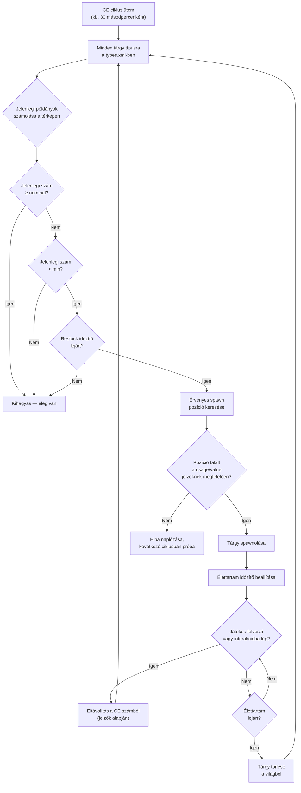

# Chapter 9.4: Zsákmánygazdaság részletes áttekintés

[Kezdőlap](../README.md) | [<< Előző: serverDZ.cfg referencia](03-server-cfg.md) | **Zsákmánygazdaság részletes áttekintés**

---

> **Összefoglaló:** A Központi Gazdaság (CE) az a rendszer, amely a DayZ-ben minden tárgy megjelenését vezérli -- a polcon lévő babkonzervtől a katonai laktanyában található AKM-ig. Ez a fejezet elmagyarázza a teljes spawn ciklust, dokumentálja a `types.xml`, `globals.xml`, `events.xml` és `cfgspawnabletypes.xml` minden mezőjét valós példákkal a vanilla szerverfájlokból, és tárgyalja a leggyakoribb gazdasági hibákat.

---

## Tartalomjegyzék

- [Hogyan működik a Központi Gazdaság](#hogyan-működik-a-központi-gazdaság)
- [A spawn ciklus](#a-spawn-ciklus)
- [types.xml -- Tárgy spawn definíciók](#typesxml----tárgy-spawn-definíciók)
- [Valós types.xml példák](#valós-typesxml-példák)
- [types.xml mező referencia](#typesxml-mező-referencia)
- [globals.xml -- Gazdasági paraméterek](#globalsxml----gazdasági-paraméterek)
- [events.xml -- Dinamikus események](#eventsxml----dinamikus-események)
- [cfgspawnabletypes.xml -- Felszerelések és rakomány](#cfgspawnabletypesxml----felszerelések-és-rakomány)
- [A nominal/restock kapcsolat](#a-nominalrestock-kapcsolat)
- [Gyakori gazdasági hibák](#gyakori-gazdasági-hibák)

---

## Hogyan működik a Központi Gazdaság

A Központi Gazdaság (CE) egy szerver oldali rendszer, amely folyamatos ciklusban fut. Feladata, hogy a világ tárgy populációját a konfigurációs fájlokban meghatározott szinteken tartsa.

A CE **nem** akkor helyez el tárgyakat, amikor egy játékos belép egy épületbe. Ehelyett egy globális időzítőn fut és a teljes térképen spawnol tárgyakat, függetlenül a játékosok közelségétől. A tárgyaknak van egy **élettartamuk** -- amikor ez az időzítő lejár és egyetlen játékos sem lépett interakcióba a tárggyal, a CE eltávolítja. Ezután a következő ciklusban észleli, hogy a szám a célszint alatt van, és valahol máshol spawnol egy pótlást.

Kulcsfogalmak:

- **Nominal** -- a céltárgyak száma, amelyeknek a térképen kell létezniük
- **Min** -- az a küszöb, amely alatt a CE megpróbálja újraspawnolni a tárgyat
- **Lifetime** -- mennyi ideig (másodpercben) marad meg egy érintetlen tárgy a takarítás előtt
- **Restock** -- minimális idő (másodpercben) mielőtt a CE újraspawnolhat egy tárgyat, miután felvették/megsemmisítették
- **Flags** -- mi számít az összesítésbe (térképen, rakományban, játékos inventárjában, rejtekhelyeken)

---

## A spawn ciklus



Röviden: a CE megszámolja, hányból létezik minden tárgyból, összehasonlítja a nominal/min célokkal, és pótlásokat spawnol, amikor a szám a `min` alá esik és a `restock` időzítő letelt.

---

## types.xml -- Tárgy spawn definíciók

Ez a legfontosabb gazdaságfájl. Minden tárgynak, amely a világban megjelenhet, szüksége van egy bejegyzésre. A vanilla `types.xml` Chernarus-hoz körülbelül 23 000 sort tartalmaz, ezernyi tárgyat lefedve.

### Valós types.xml példák

**Fegyver -- AKM**

```xml
<type name="AKM">
    <nominal>3</nominal>
    <lifetime>7200</lifetime>
    <restock>3600</restock>
    <min>2</min>
    <quantmin>30</quantmin>
    <quantmax>80</quantmax>
    <cost>100</cost>
    <flags count_in_cargo="0" count_in_hoarder="0" count_in_map="1" count_in_player="0" crafted="0" deloot="0"/>
    <category name="weapons"/>
    <usage name="Military"/>
    <value name="Tier4"/>
</type>
```

Az AKM egy ritka, magas szintű fegyver. Egyszerre csak 3 létezhet a térképen (`nominal`). Katonai épületekben jelenik meg Tier 4 (északnyugati) területeken. Amikor egy játékos felvesz egyet, a CE látja, hogy a térkép szám a `min=2` alá esett, és legalább 3600 másodperc (1 óra) után spawnol pótlást. A fegyver 30-80%-os lőszerrel jelenik meg a belső tárában (`quantmin`/`quantmax`).

**Étel -- BakedBeansCan**

```xml
<type name="BakedBeansCan">
    <nominal>15</nominal>
    <lifetime>14400</lifetime>
    <restock>0</restock>
    <min>12</min>
    <quantmin>-1</quantmin>
    <quantmax>-1</quantmax>
    <cost>100</cost>
    <flags count_in_cargo="0" count_in_hoarder="0" count_in_map="1" count_in_player="0" crafted="0" deloot="0"/>
    <category name="food"/>
    <tag name="shelves"/>
    <usage name="Town"/>
    <usage name="Village"/>
    <value name="Tier1"/>
    <value name="Tier2"/>
    <value name="Tier3"/>
</type>
```

A sült bab gyakori étel. Bármikor 15 konzervnek kell léteznie. Polcokon jelenik meg Város és Falu épületekben a Tier 1-3 zónákban (parttól a térkép közepéig). `restock=0` azonnali újraspawnolási jogosultságot jelent. `quantmin=-1` és `quantmax=-1` azt jelenti, hogy a tárgy nem használja a mennyiség rendszert (nem folyadék vagy lőszer tároló).

**Ruházat -- RidersJacket_Black**

```xml
<type name="RidersJacket_Black">
    <nominal>14</nominal>
    <lifetime>28800</lifetime>
    <restock>0</restock>
    <min>10</min>
    <quantmin>-1</quantmin>
    <quantmax>-1</quantmax>
    <cost>100</cost>
    <flags count_in_cargo="0" count_in_hoarder="0" count_in_map="1" count_in_player="0" crafted="0" deloot="0"/>
    <category name="clothes"/>
    <usage name="Town"/>
    <value name="Tier1"/>
    <value name="Tier2"/>
</type>
```

Gyakori civil dzseki. 14 példány a térképen, Város épületekben található a part közelében (Tier 1-2). A 28800 másodperces (8 óra) élettartam azt jelenti, hogy sokáig megmarad, ha senki sem veszi fel.

**Orvosi -- BandageDressing**

```xml
<type name="BandageDressing">
    <nominal>40</nominal>
    <lifetime>14400</lifetime>
    <restock>0</restock>
    <min>30</min>
    <quantmin>-1</quantmin>
    <quantmax>-1</quantmax>
    <cost>100</cost>
    <flags count_in_cargo="0" count_in_hoarder="0" count_in_map="1" count_in_player="0" crafted="0" deloot="0"/>
    <category name="tools"/>
    <tag name="shelves"/>
    <usage name="Medic"/>
</type>
```

A kötszerek nagyon gyakoriak (40 nominal). Orvosi épületekben (kórházak, rendelők) jelennek meg minden szinten (nincs `<value>` tag, ami minden szintet jelent). Figyeld meg, hogy a kategória `"tools"`, nem `"medical"` -- a DayZ-ben nincs orvosi kategória; az orvosi tárgyak az eszközök kategóriát használják.

**Letiltott tárgy (megmunkált változat)**

```xml
<type name="AK101_Black">
    <nominal>0</nominal>
    <lifetime>28800</lifetime>
    <restock>0</restock>
    <min>0</min>
    <quantmin>-1</quantmin>
    <quantmax>-1</quantmax>
    <cost>100</cost>
    <flags count_in_cargo="0" count_in_hoarder="0" count_in_map="1" count_in_player="0" crafted="1" deloot="0"/>
    <category name="weapons"/>
</type>
```

A `nominal=0` és `min=0` azt jelenti, hogy a CE soha nem fogja spawnolni ezt a tárgyat. A `crafted=1` jelzi, hogy csak megmunkálással szerezhető (fegyver festése). Továbbra is van élettartama, így a megőrzött példányok végül megtisztulnak.

---

## types.xml mező referencia

### Alap mezők

| Mező | Típus | Tartomány | Leírás |
|------|-------|-----------|--------|
| `name` | string | -- | A tárgy osztályneve. Pontosan meg kell egyeznie a játék osztálynevével. |
| `nominal` | int | 0+ | Céltárgyak száma a térképen. Állítsd 0-ra a spawnolás megakadályozásához. |
| `min` | int | 0+ | Amikor a szám erre az értékre vagy ez alá esik, a CE megpróbál többet spawnolni. |
| `lifetime` | int | másodperc | Mennyi ideig létezik egy érintetlen tárgy, mielőtt a CE törli. |
| `restock` | int | másodperc | Minimális hűtési idő, mielőtt a CE pótlást spawnolhat. 0 = azonnali. |
| `quantmin` | int | -1 - 100 | Minimális mennyiség százalék spawnoláskor (lőszer %, folyadék %). -1 = nem alkalmazható. |
| `quantmax` | int | -1 - 100 | Maximális mennyiség százalék spawnoláskor. -1 = nem alkalmazható. |
| `cost` | int | 0+ | Prioritás súly a spawn kiválasztáshoz. Jelenleg minden vanilla tárgy 100-at használ. |

### Jelzők

```xml
<flags count_in_cargo="0" count_in_hoarder="0" count_in_map="1" count_in_player="0" crafted="0" deloot="0"/>
```

| Jelző | Értékek | Leírás |
|-------|---------|--------|
| `count_in_map` | 0, 1 | A földön vagy épület spawn pontokon lévő tárgyak számítása. **Szinte mindig 1.** |
| `count_in_cargo` | 0, 1 | Más tárolókban (hátizsákok, sátrak) lévő tárgyak számítása. |
| `count_in_hoarder` | 0, 1 | Rejtekhelyeken, hordókban, elásott tárolókban, sátrakban lévő tárgyak számítása. |
| `count_in_player` | 0, 1 | Játékos inventárjában (testen vagy kézben) lévő tárgyak számítása. |
| `crafted` | 0, 1 | Ha 1, ez a tárgy csak megmunkálással szerezhető, nem CE spawnolással. |
| `deloot` | 0, 1 | Dinamikus Esemény zsákmány. Ha 1, a tárgy csak dinamikus esemény helyszíneken jelenik meg (helikopter roncsok, stb.). |

**A jelző stratégia számít.** Ha `count_in_player=1`, minden AKM, amit egy játékos hordoz, beleszámít a nominalba. Ez azt jelenti, hogy egy AKM felvétele nem váltana ki újraspawnolást, mert a szám nem változott. A legtöbb vanilla tárgy `count_in_player=0`-t használ, így a játékosnál lévő tárgyak nem blokkolják az újraspawnolást.

### Tagek

| Elem | Cél | Definiálva |
|------|-----|-----------|
| `<category name="..."/>` | Tárgy kategória a spawn pont illesztéshez | `cfglimitsdefinition.xml` |
| `<usage name="..."/>` | Épülettípus, ahol a tárgy megjelenhet | `cfglimitsdefinition.xml` |
| `<value name="..."/>` | Térkép szint zóna, ahol a tárgy megjelenhet | `cfglimitsdefinition.xml` |
| `<tag name="..."/>` | Spawn pozíció típusa egy épületen belül | `cfglimitsdefinition.xml` |

**Érvényes kategóriák:** `tools`, `containers`, `clothes`, `food`, `weapons`, `books`, `explosives`, `lootdispatch`

**Érvényes usage jelzők:** `Military`, `Police`, `Medic`, `Firefighter`, `Industrial`, `Farm`, `Coast`, `Town`, `Village`, `Hunting`, `Office`, `School`, `Prison`, `Lunapark`, `SeasonalEvent`, `ContaminatedArea`, `Historical`

**Érvényes value jelzők:** `Tier1`, `Tier2`, `Tier3`, `Tier4`, `Unique`

**Érvényes tagek:** `floor`, `shelves`, `ground`

Egy tárgynak **több** `<usage>` és `<value>` tagje is lehet. Több usage azt jelenti, hogy bármelyik ilyen épülettípusban megjelenhet. Több value azt jelenti, hogy bármelyik ilyen szinten megjelenhet.

Ha teljesen elhagyod a `<value>` taget, a tárgy **minden** szinten megjelenik. Ha elhagyod a `<usage>` taget, a tárgynak nincs érvényes spawn helye és **nem fog megjelenni**.

---

## globals.xml -- Gazdasági paraméterek

Ez a fájl a globális CE viselkedést szabályozza. Minden paraméter a vanilla fájlból:

```xml
<variables>
    <var name="AnimalMaxCount" type="0" value="200"/>
    <var name="CleanupAvoidance" type="0" value="100"/>
    <var name="CleanupLifetimeDeadAnimal" type="0" value="1200"/>
    <var name="CleanupLifetimeDeadInfected" type="0" value="330"/>
    <var name="CleanupLifetimeDeadPlayer" type="0" value="3600"/>
    <var name="CleanupLifetimeDefault" type="0" value="45"/>
    <var name="CleanupLifetimeLimit" type="0" value="50"/>
    <var name="CleanupLifetimeRuined" type="0" value="330"/>
    <var name="FlagRefreshFrequency" type="0" value="432000"/>
    <var name="FlagRefreshMaxDuration" type="0" value="3456000"/>
    <var name="FoodDecay" type="0" value="1"/>
    <var name="IdleModeCountdown" type="0" value="60"/>
    <var name="IdleModeStartup" type="0" value="1"/>
    <var name="InitialSpawn" type="0" value="100"/>
    <var name="LootDamageMax" type="1" value="0.82"/>
    <var name="LootDamageMin" type="1" value="0.0"/>
    <var name="LootProxyPlacement" type="0" value="1"/>
    <var name="LootSpawnAvoidance" type="0" value="100"/>
    <var name="RespawnAttempt" type="0" value="2"/>
    <var name="RespawnLimit" type="0" value="20"/>
    <var name="RespawnTypes" type="0" value="12"/>
    <var name="RestartSpawn" type="0" value="0"/>
    <var name="SpawnInitial" type="0" value="1200"/>
    <var name="TimeHopping" type="0" value="60"/>
    <var name="TimeLogin" type="0" value="15"/>
    <var name="TimeLogout" type="0" value="15"/>
    <var name="TimePenalty" type="0" value="20"/>
    <var name="WorldWetTempUpdate" type="0" value="1"/>
    <var name="ZombieMaxCount" type="0" value="1000"/>
    <var name="ZoneSpawnDist" type="0" value="300"/>
</variables>
```

A `type` attribútum az adattípust jelzi: `0` = egész szám, `1` = lebegőpontos szám.

### Teljes paraméter referencia

| Paraméter | Típus | Alapértelmezett | Leírás |
|-----------|-------|-----------------|--------|
| **AnimalMaxCount** | int | 200 | Egyszerre élő állatok maximális száma a térképen. |
| **CleanupAvoidance** | int | 100 | Távolság méterben egy játékostól, ahol a CE NEM takarít tárgyakat. Ezen a sugarán belüli tárgyak védettek az élettartam lejárta ellen. |
| **CleanupLifetimeDeadAnimal** | int | 1200 | Másodpercek, mielőtt egy halott állat tetem eltávolításra kerül. (20 perc) |
| **CleanupLifetimeDeadInfected** | int | 330 | Másodpercek, mielőtt egy halott zombi tetem eltávolításra kerül. (5,5 perc) |
| **CleanupLifetimeDeadPlayer** | int | 3600 | Másodpercek, mielőtt egy halott játékos test eltávolításra kerül. (1 óra) |
| **CleanupLifetimeDefault** | int | 45 | Alapértelmezett takarítási idő másodpercben olyan tárgyakhoz, amelyeknek nincs specifikus élettartama. |
| **CleanupLifetimeLimit** | int | 50 | Takarítási ciklusonként feldolgozott tárgyak maximális száma. |
| **CleanupLifetimeRuined** | int | 330 | Másodpercek, mielőtt a tönkrement tárgyak megtisztulnak. (5,5 perc) |
| **FlagRefreshFrequency** | int | 432000 | Milyen gyakran kell "frissíteni" a zászlórudat interakcióval a bázis romlásának megelőzéséhez, másodpercben. (5 nap) |
| **FlagRefreshMaxDuration** | int | 3456000 | A zászlórúd maximális élettartama rendszeres frissítéssel is, másodpercben. (40 nap) |
| **FoodDecay** | int | 1 | Étel romlás engedélyezése (1) vagy letiltása (0) az idő múlásával. |
| **IdleModeCountdown** | int | 60 | Másodpercek, mielőtt a szerver tétlen módba lép, amikor nincs csatlakoztatott játékos. |
| **IdleModeStartup** | int | 1 | A szerver tétlen módban (1) vagy aktív módban (0) indul-e. |
| **InitialSpawn** | int | 100 | A nominal értékek százaléka, amelyet az első szerver indításkor kell spawnolni (0-100). |
| **LootDamageMax** | float | 0.82 | Maximális sérülési állapot véletlenszerűen spawnolt zsákmánynál (0.0 = hibátlan, 1.0 = tönkrement). |
| **LootDamageMin** | float | 0.0 | Minimális sérülési állapot véletlenszerűen spawnolt zsákmánynál. |
| **LootProxyPlacement** | int | 1 | Tárgyak vizuális elhelyezésének engedélyezése (1) polcokon/asztalokon vs véletlenszerű padlóra dobás. |
| **LootSpawnAvoidance** | int | 100 | Távolság méterben egy játékostól, ahol a CE NEM spawnol új zsákmányt. Megakadályozza, hogy tárgyak a játékosok szeme láttára jelenjenek meg. |
| **RespawnAttempt** | int | 2 | Spawn pozíció próbálkozások száma tárgyankénti CE ciklusonként a feladás előtt. |
| **RespawnLimit** | int | 20 | A CE által ciklusonként újraspawnolt tárgyak maximális száma. |
| **RespawnTypes** | int | 12 | Újraspawnolási ciklusonként feldolgozott különböző tárgy típusok maximális száma. |
| **RestartSpawn** | int | 0 | Ha 1, minden zsákmány pozíció újrarandomizálása szerver újraindításkor. Ha 0, betöltés a perzisztenciából. |
| **SpawnInitial** | int | 1200 | Tárgyak száma, amelyet az első indítás kezdeti gazdaság feltöltésekor kell spawnolni. |
| **TimeHopping** | int | 60 | Hűtési idő másodpercben, amely megakadályozza, hogy egy játékos újracsatlakozzon ugyanarra a szerverre (szerver-hop elleni védelem). |
| **TimeLogin** | int | 15 | Bejelentkezési visszaszámlálás másodpercben (a "Kérjük várjon" időzítő csatlakozáskor). |
| **TimeLogout** | int | 15 | Kijelentkezési visszaszámlálás másodpercben. A játékos ez idő alatt a világban marad. |
| **TimePenalty** | int | 20 | Extra büntetés idő másodpercben, amely a kijelentkezési időzítőhöz adódik, ha a játékos szabálytalanul bontja a kapcsolatot (Alt+F4). |
| **WorldWetTempUpdate** | int | 1 | Világ hőmérséklet és nedvesség szimuláció frissítések engedélyezése (1) vagy letiltása (0). |
| **ZombieMaxCount** | int | 1000 | Egyszerre élő zombik maximális száma a térképen. |
| **ZoneSpawnDist** | int | 300 | Távolság méterben egy játékostól, amelynél a zombi spawn zónák aktiválódnak. |

### Gyakori hangolási beállítások

**Több zsákmány (PvP szerver):**
```xml
<var name="InitialSpawn" type="0" value="100"/>
<var name="RespawnLimit" type="0" value="50"/>
<var name="RespawnTypes" type="0" value="30"/>
<var name="RespawnAttempt" type="0" value="4"/>
```

**Hosszabb holttestek (több idő a kilobott zsákmány átvizsgálásához):**
```xml
<var name="CleanupLifetimeDeadPlayer" type="0" value="7200"/>
```

**Rövidebb bázis romlás (inaktív bázisok gyorsabb törlése):**
```xml
<var name="FlagRefreshFrequency" type="0" value="259200"/>
<var name="FlagRefreshMaxDuration" type="0" value="1728000"/>
```

---

## events.xml -- Dinamikus események

Az események speciális kezelést igénylő entitások megjelenését definiálják: állatok, járművek és helikopter roncsok. A `types.xml` tárgyakkal ellentétben, amelyek épületeken belül jelennek meg, az események a `cfgeventspawns.xml`-ben felsorolt előre meghatározott világ pozíciókon jelennek meg.

### Valós jármű esemény példa

```xml
<event name="VehicleCivilianSedan">
    <nominal>8</nominal>
    <min>5</min>
    <max>11</max>
    <lifetime>300</lifetime>
    <restock>0</restock>
    <saferadius>500</saferadius>
    <distanceradius>500</distanceradius>
    <cleanupradius>200</cleanupradius>
    <flags deletable="0" init_random="0" remove_damaged="1"/>
    <position>fixed</position>
    <limit>mixed</limit>
    <active>1</active>
    <children>
        <child lootmax="0" lootmin="0" max="5" min="3" type="CivilianSedan"/>
        <child lootmax="0" lootmin="0" max="5" min="3" type="CivilianSedan_Black"/>
        <child lootmax="0" lootmin="0" max="5" min="3" type="CivilianSedan_Wine"/>
    </children>
</event>
```

### Valós állat esemény példa

```xml
<event name="AnimalBear">
    <nominal>0</nominal>
    <min>2</min>
    <max>2</max>
    <lifetime>180</lifetime>
    <restock>0</restock>
    <saferadius>200</saferadius>
    <distanceradius>0</distanceradius>
    <cleanupradius>0</cleanupradius>
    <flags deletable="0" init_random="0" remove_damaged="1"/>
    <position>fixed</position>
    <limit>custom</limit>
    <active>1</active>
    <children>
        <child lootmax="0" lootmin="0" max="1" min="1" type="Animal_UrsusArctos"/>
    </children>
</event>
```

### Esemény mező referencia

| Mező | Leírás |
|------|--------|
| `name` | Esemény azonosító. Meg kell egyeznie egy bejegyzéssel a `cfgeventspawns.xml`-ben `position="fixed"` események esetén. |
| `nominal` | Aktív esemény csoportok célszáma a térképen. |
| `min` | Minimális csoporttagok spawn pontonként. |
| `max` | Maximális csoporttagok spawn pontonként. |
| `lifetime` | Másodpercek, mielőtt az esemény megtisztul és újraspawnol. Járműveknél ez az újraspawn ellenőrzési intervallum, nem a jármű perzisztencia élettartama. |
| `restock` | Minimális másodpercek az újraspawnolások között. |
| `saferadius` | Minimális távolság méterben egy játékostól az esemény spawnolásához. |
| `distanceradius` | Minimális távolság ugyanazon esemény két példánya között. |
| `cleanupradius` | Távolság bármely játékostól, amelyen belül az esemény NEM kerül megtisztításra. |
| `deletable` | A CE törölheti-e az eseményt (0 = nem). |
| `init_random` | Kezdeti pozíciók randomizálása (0 = rögzített pozíciók használata). |
| `remove_damaged` | Az esemény entitás eltávolítása, ha megsérül/tönkremegy (1 = igen). |
| `position` | `"fixed"` = pozíciók használata a `cfgeventspawns.xml`-ből. `"player"` = spawnolás játékosok közelében. |
| `limit` | `"child"` = korlát gyerek típusonként. `"mixed"` = korlát az összes gyerek között. `"custom"` = speciális viselkedés. |
| `active` | 1 = engedélyezett, 0 = letiltott. |

### Gyerekek

Minden `<child>` elem egy spawnolható változatot definiál:

| Attribútum | Leírás |
|------------|--------|
| `type` | A spawnolni kívánt entitás osztályneve. |
| `min` | Minimális példányok ebből a változatból (`limit="child"` esetén). |
| `max` | Maximális példányok ebből a változatból (`limit="child"` esetén). |
| `lootmin` | Az entitáson belül/kívül spawnolt zsákmány tárgyak minimális száma. |
| `lootmax` | Az entitáson belül/kívül spawnolt zsákmány tárgyak maximális száma. |

---

## cfgspawnabletypes.xml -- Felszerelések és rakomány

Ez a fájl meghatározza, milyen felszerelésekkel, rakománnyal és sérülési állapottal jelenik meg egy tárgy spawnoláskor. Bejegyzés nélkül a tárgyak üresen és véletlenszerű sérüléssel jelennek meg (a `globals.xml` `LootDamageMin`/`LootDamageMax` értékein belül).

### Fegyver felszerelésekkel -- AKM

```xml
<type name="AKM">
    <damage min="0.45" max="0.85" />
    <attachments chance="1.00">
        <item name="AK_PlasticBttstck" chance="1.00" />
    </attachments>
    <attachments chance="1.00">
        <item name="AK_PlasticHndgrd" chance="1.00" />
    </attachments>
    <attachments chance="0.50">
        <item name="KashtanOptic" chance="0.30" />
        <item name="PSO11Optic" chance="0.20" />
    </attachments>
    <attachments chance="0.05">
        <item name="AK_Suppressor" chance="1.00" />
    </attachments>
    <attachments chance="0.30">
        <item name="Mag_AKM_30Rnd" chance="1.00" />
    </attachments>
</type>
```

A bejegyzés értelmezése:

1. Az AKM 45-85% sérüléssel jelenik meg (kopott-tól erősen sérültig)
2. **Mindig** (100%) kap egy műanyag válltámaszt és kézvédőt
3. 50% esély az optikai helyszín kitöltésére -- ha igen, 30% esély Kashtan-ra, 20% PSO-11-re
4. 5% esély hangtompítóra
5. 30% esély feltöltött tárra

Minden `<attachments>` blokk egy felszerelési helyet képvisel. A blokkon lévő `chance` annak a valószínűsége, hogy a hely egyáltalán kitöltésre kerül. Az egyes `<item>` elemek `chance` értéke relatív kiválasztási súly -- a CE ezek alapján választ egy tárgyat a listából.

### Fegyver felszerelésekkel -- M4A1

```xml
<type name="M4A1">
    <damage min="0.45" max="0.85" />
    <attachments chance="1.00">
        <item name="M4_OEBttstck" chance="1.00" />
    </attachments>
    <attachments chance="1.00">
        <item name="M4_PlasticHndgrd" chance="1.00" />
    </attachments>
    <attachments chance="1.00">
        <item name="BUISOptic" chance="0.50" />
        <item name="M4_CarryHandleOptic" chance="1.00" />
    </attachments>
    <attachments chance="0.30">
        <item name="Mag_CMAG_40Rnd" chance="0.15" />
        <item name="Mag_CMAG_10Rnd" chance="0.50" />
        <item name="Mag_CMAG_20Rnd" chance="0.70" />
        <item name="Mag_CMAG_30Rnd" chance="1.00" />
    </attachments>
</type>
```

### Mellény táskákkal -- PlateCarrierVest_Camo

```xml
<type name="PlateCarrierVest_Camo">
    <damage min="0.1" max="0.6" />
    <attachments chance="0.85">
        <item name="PlateCarrierHolster_Camo" chance="1.00" />
    </attachments>
    <attachments chance="0.85">
        <item name="PlateCarrierPouches_Camo" chance="1.00" />
    </attachments>
</type>
```

### Hátizsák rakománnyal

```xml
<type name="AssaultBag_Ttsko">
    <cargo preset="mixArmy" />
    <cargo preset="mixArmy" />
    <cargo preset="mixArmy" />
</type>
```

A `preset` attribútum a `cfgrandompresets.xml`-ben definiált zsákmánykészletre hivatkozik. Minden `<cargo>` sor egy dobás -- ez a hátizsák 3 dobást kap a `mixArmy` készletből. A készlet saját `chance` értéke határozza meg, hogy minden dobás valóban eredményez-e tárgyat.

### Csak hoarder tárgyak

```xml
<type name="Barrel_Blue">
    <hoarder />
</type>
<type name="SeaChest">
    <hoarder />
</type>
```

A `<hoarder />` tag hoarder tárolóként jelöli meg a tárgyakat. A CE a `types.xml` `count_in_hoarder` jelzőjét használva külön számolja az ezeken belüli tárgyakat.

### Spawn sérülés felülírás

```xml
<type name="BandageDressing">
    <damage min="0.0" max="0.0" />
</type>
```

A kötszereket mindig Hibátlan állapotban spawnoltatja, felülírva a `globals.xml` globális `LootDamageMin`/`LootDamageMax` értékeit.

---

## A nominal/restock kapcsolat

A `nominal`, `min` és `restock` együttműködésének megértése kritikus a gazdaság hangolásához.

### A számítás

```
HA (jelenlegi_szám < min) ÉS (utolsó_spawn_óta_eltelt_idő > restock):
    új tárgy spawnolása (maximum nominal-ig)
```

**Példa az AKM-mel:**
- `nominal = 3`, `min = 2`, `restock = 3600`
- Szerver indul: a CE 3 AKM-et spawnol a térképen
- Játékos felvesz 1 AKM-et: térkép szám 2-re esik
- Szám (2) NEM kisebb, mint min (2), tehát nincs újraspawnolás még
- Játékos felvesz még egy AKM-et: térkép szám 1-re esik
- Szám (1) kisebb, mint min (2), és a restock időzítő (3600mp = 1 óra) elindul
- 1 óra után a CE 2 új AKM-et spawnol, hogy elérje a nominalt (3)

**Példa a BakedBeansCan-nel:**
- `nominal = 15`, `min = 12`, `restock = 0`
- Játékos megeszik egy konzervet: térkép szám 14-re esik
- Szám (14) NEM kisebb, mint min (12), tehát nincs újraspawnolás
- Még 3 konzerv elfogyasztva: szám 11-re esik
- Szám (11) kisebb, mint min (12), restock 0 (azonnali)
- Következő CE ciklus: 4 konzervet spawnol, hogy elérje a nominalt (15)

### Kulcs meglátások

- A **nominal és min közötti rés** határozza meg, hány tárgyat lehet "felhasználni" mielőtt a CE reagál. Kis rés (mint az AKM: 3/2) azt jelenti, hogy a CE már 2 felvétel után reagál. Nagy rés azt jelenti, hogy több tárgy hagyhatja el a gazdaságot, mielőtt az újraspawnolás beindul.

- A **restock = 0** gyakorlatilag azonnali újraspawnolást tesz lehetővé (következő CE ciklus). Magas restock értékek szűkösséget hoznak létre -- a CE tudja, hogy többet kell spawnolnia, de várnia kell.

- Az **élettartam** független a nominal/min-től. Még ha a CE spawnolt is egy tárgyat a nominal eléréséhez, a tárgy törlődik, amikor az élettartama lejár, ha senki nem nyúl hozzá. Ez folyamatos "forgást" hoz létre, ahol tárgyak jelennek meg és tűnnek el a térképen.

- A tárgyak, amelyeket a játékosok felvesznek, de később ledobnak (más helyen), továbbra is számítanak, ha a megfelelő jelző be van állítva. Egy ledobott AKM a földön továbbra is beleszámít a térkép összesbe, mert `count_in_map=1`.

---

## Gyakori gazdasági hibák

### A tárgynak van types.xml bejegyzése, de nem jelenik meg

**Ellenőrizd sorrendben:**

1. A `nominal` nagyobb-e 0-nál?
2. Van legalább egy `<usage>` tagje a tárgynak? (Nincs usage = nincs érvényes spawn hely)
3. A `<usage>` tag definiálva van a `cfglimitsdefinition.xml`-ben?
4. A `<value>` tag (ha van) definiálva van a `cfglimitsdefinition.xml`-ben?
5. A `<category>` tag érvényes?
6. A tárgy fel van sorolva a `cfgignorelist.xml`-ben? (Az ott lévő tárgyak blokkolva vannak)
7. A `crafted` jelző 1-re van állítva? (Megmunkált tárgyak soha nem jelennek meg természetesen)
8. A `RestartSpawn` a `globals.xml`-ben 0-ra van állítva meglévő perzisztenciával? (A régi perzisztencia megakadályozhatja az új tárgyak megjelenését törlésig)

### A tárgyak megjelennek, de azonnal eltűnnek

Az `lifetime` érték túl alacsony. Egy 45 másodperces élettartam (a `CleanupLifetimeDefault`) azt jelenti, hogy a tárgy szinte azonnal megtisztul. A fegyvereknek 7200-28800 másodperces élettartammal kell rendelkezniük.

### Túl sok/túl kevés egy tárgyból

Állítsd be a `nominal` és `min` értékeket együtt. Ha `nominal=100`-at állítasz, de `min=1`-et, a CE nem spawnol pótlást, amíg 99 tárgyat el nem vittek. Ha egyenletes ellátást szeretnél, tartsd a `min` értéket közel a `nominal`-hoz (pl. `nominal=20, min=15`).

### A tárgyak csak egy területen jelennek meg

Ellenőrizd a `<value>` tageket. Ha egy tárgynak csak `<value name="Tier4"/>` van, csak Chernarus északnyugati katonai területén jelenik meg. Adj hozzá több szintet a szélesebb eloszláshoz:

```xml
<value name="Tier1"/>
<value name="Tier2"/>
<value name="Tier3"/>
<value name="Tier4"/>
```

### Moddolt tárgyak nem jelennek meg

Amikor modból származó tárgyakat adsz a `types.xml`-hez:

1. Győződj meg róla, hogy a mod betöltött (fel van sorolva a `-mod=` paraméterben)
2. Ellenőrizd, hogy az osztálynév **pontosan** helyes (kis- és nagybetű érzékeny)
3. Add hozzá a tárgy kategória/usage/value tagjeit -- nem elég csak egy `types.xml` bejegyzés
4. Ha a mod új usage vagy value tageket ad hozzá, add hozzá őket a `cfglimitsdefinitionuser.xml`-hez
5. Ellenőrizd a szkript naplót ismeretlen osztálynevek figyelmeztetéseire

### Jármű alkatrészek nem jelennek meg járműveken belül

A jármű alkatrészek a `cfgspawnabletypes.xml`-en keresztül jelennek meg, nem a `types.xml`-en. Ha egy jármű kerekek vagy akkumulátor nélkül jelenik meg, ellenőrizd, hogy a járműnek van-e bejegyzése a `cfgspawnabletypes.xml`-ben a megfelelő felszerelés definíciókkal.

### Minden zsákmány Hibátlan vagy minden zsákmány Tönkrement

Ellenőrizd a `LootDamageMin` és `LootDamageMax` értékeket a `globals.xml`-ben. Vanilla értékek: `0.0` és `0.82`. Mindkettő `0.0`-ra állítása mindent Hibátlanná tesz. Mindkettő `1.0`-ra állítása mindent Tönkrementé tesz. Ellenőrizd a tárgyankénti felülírásokat is a `cfgspawnabletypes.xml`-ben.

### A gazdaság "beragadtnak" tűnik a types.xml szerkesztése után

Gazdaságfájlok szerkesztése után tedd az alábbiak egyikét:
- Töröld a `storage_1/` mappát a teljes törléshez és friss gazdaság indításhoz
- Állítsd a `RestartSpawn` értéket `1`-re a `globals.xml`-ben egy újraindításra a zsákmány újrarandomizálásához, majd állítsd vissza `0`-ra
- Várd meg, hogy a tárgyak élettartama természetesen lejárjon (ez órákat vehet igénybe)

---

**Előző:** [serverDZ.cfg referencia](03-server-cfg.md) | [Kezdőlap](../README.md) | **Következő:** [Jármű és dinamikus esemény spawnolás](05-vehicle-spawning.md)
