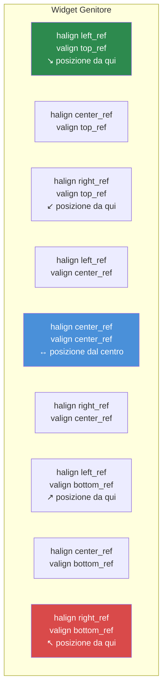

# Capitolo 3.3: Dimensionamento e Posizionamento

[Home](../../README.md) | [<< Precedente: Formato File Layout](02-layout-files.md) | **Dimensionamento e Posizionamento** | [Successivo: Widget Contenitore >>](04-containers.md)

---

Il sistema di layout di DayZ usa una **modalità a doppia coordinata** -- ogni dimensione può essere proporzionale (relativa al genitore) o in pixel (pixel assoluti dello schermo). Incomprendere questo sistema è la causa numero uno dei bug di layout. Questo capitolo lo spiega in modo approfondito.

---

## Il Concetto Base: Proporzionale vs. Pixel

Ogni widget ha una posizione (`x, y`) e una dimensione (`larghezza, altezza`). Ognuno di questi quattro valori può essere indipendentemente:

- **Proporzionale** (da 0.0 a 1.0) -- relativo alle dimensioni del widget genitore
- **Pixel** (qualsiasi numero positivo) -- pixel assoluti dello schermo

La modalità per ogni asse è controllata da quattro flag:

| Flag | Controlla | `0` = Proporzionale | `1` = Pixel |
|---|---|---|---|
| `hexactpos` | Posizione X | Frazione della larghezza del genitore | Pixel da sinistra |
| `vexactpos` | Posizione Y | Frazione dell'altezza del genitore | Pixel dall'alto |
| `hexactsize` | Larghezza | Frazione della larghezza del genitore | Larghezza in pixel |
| `vexactsize` | Altezza | Frazione dell'altezza del genitore | Altezza in pixel |

Questo significa che puoi mescolare le modalità liberamente. Per esempio, un widget può avere larghezza proporzionale ma altezza in pixel -- un pattern molto comune per righe e barre.

---

## Comprendere la Modalità Proporzionale

Quando un flag è `0` (proporzionale), il valore rappresenta una **frazione della dimensione del genitore**:

- `size 1 1` con `hexactsize 0` e `vexactsize 0` significa "100% della larghezza del genitore, 100% dell'altezza del genitore" -- il figlio riempie il genitore.
- `size 0.5 0.3` significa "50% della larghezza del genitore, 30% dell'altezza del genitore."
- `position 0.5 0` con `hexactpos 0` significa "inizia al 50% della larghezza del genitore da sinistra."

La modalità proporzionale è indipendente dalla risoluzione. Il widget si scala automaticamente quando il genitore cambia dimensione o quando il gioco gira a una risoluzione diversa.

```
// Un widget che riempie la metà sinistra del suo genitore
FrameWidgetClass LeftHalf {
 position 0 0
 size 0.5 1
 hexactpos 0
 vexactpos 0
 hexactsize 0
 vexactsize 0
}
```

---

## Comprendere la Modalità Pixel

Quando un flag è `1` (pixel/esatto), il valore è in **pixel dello schermo**:

- `size 200 40` con `hexactsize 1` e `vexactsize 1` significa "200 pixel di larghezza, 40 pixel di altezza."
- `position 10 10` con `hexactpos 1` e `vexactpos 1` significa "10 pixel dal bordo sinistro del genitore, 10 pixel dal bordo superiore del genitore."

La modalità pixel ti dà un controllo esatto ma NON si scala automaticamente con la risoluzione.

```
// Un pulsante a dimensione fissa: 120x30 pixel
ButtonWidgetClass MyButton {
 position 10 10
 size 120 30
 hexactpos 1
 vexactpos 1
 hexactsize 1
 vexactsize 1
 text "Click Me"
}
```

---

## Mescolare le Modalità: Il Pattern Più Comune

La vera potenza viene dal mescolare modalità proporzionali e pixel. Il pattern più comune nelle mod DayZ professionali è:

**Larghezza proporzionale, altezza in pixel** -- per barre, righe e intestazioni.

```
// Riga a larghezza piena, esattamente 30 pixel di altezza
FrameWidgetClass Row {
 position 0 0
 size 1 30
 hexactpos 0
 vexactpos 0
 hexactsize 0        // Larghezza: proporzionale (100% del genitore)
 vexactsize 1        // Altezza: pixel (30px)
}
```

**Larghezza e altezza proporzionali, posizione in pixel** -- per pannelli centrati con offset fisso.

```
// Pannello 60% x 70%, offset 0px dal centro
FrameWidgetClass Dialog {
 position 0 0
 size 0.6 0.7
 halign center_ref
 valign center_ref
 hexactpos 1         // Posizione: pixel (offset 0px dal centro)
 vexactpos 1
 hexactsize 0        // Dimensione: proporzionale (60% x 70%)
 vexactsize 0
}
```

---

## Riferimenti di Allineamento: halign e valign

Gli attributi `halign` e `valign` cambiano il **punto di riferimento** per il posizionamento:

| Valore | Effetto |
|---|---|
| `left_ref` (predefinito) | La posizione è misurata dal bordo sinistro del genitore |
| `center_ref` | La posizione è misurata dal centro del genitore |
| `right_ref` | La posizione è misurata dal bordo destro del genitore |
| `top_ref` (predefinito) | La posizione è misurata dal bordo superiore del genitore |
| `center_ref` | La posizione è misurata dal centro del genitore |
| `bottom_ref` | La posizione è misurata dal bordo inferiore del genitore |

### Punti di Riferimento dell'Allineamento



Quando combinato con la posizione in pixel (`hexactpos 1`), i riferimenti di allineamento rendono il centraggio banale:

```
// Centrato sullo schermo senza offset
FrameWidgetClass CenteredDialog {
 position 0 0
 size 0.4 0.5
 halign center_ref
 valign center_ref
 hexactpos 1
 vexactpos 1
 hexactsize 0
 vexactsize 0
}
```

Con `center_ref`, una posizione di `0 0` significa "centrato nel genitore." Una posizione di `10 0` significa "10 pixel a destra del centro."

### Elementi Allineati a Destra

```
// Icona fissata al bordo destro, 5px dal bordo
ImageWidgetClass StatusIcon {
 position 5 5
 size 24 24
 halign right_ref
 valign top_ref
 hexactpos 1
 vexactpos 1
 hexactsize 1
 vexactsize 1
}
```

### Elementi Allineati in Basso

```
// Barra di stato in basso al genitore
FrameWidgetClass StatusBar {
 position 0 0
 size 1 30
 halign left_ref
 valign bottom_ref
 hexactpos 1
 vexactpos 1
 hexactsize 0
 vexactsize 1
}
```

---

## CRITICO: Nessun Valore di Dimensione Negativo

**Non usare mai valori negativi per la dimensione dei widget nei file di layout.** Le dimensioni negative causano comportamento indefinito -- i widget possono diventare invisibili, renderizzare in modo errato o crashare il sistema UI. Se hai bisogno che un widget sia nascosto, usa `visible 0` invece.

Questo è uno degli errori di layout più comuni. Se il tuo widget non appare, controlla di non aver accidentalmente impostato un valore di dimensione negativo.

---

## Pattern di Dimensionamento Comuni

### Overlay a Schermo Intero

```
FrameWidgetClass Overlay {
 position 0 0
 size 1 1
 hexactpos 0
 vexactpos 0
 hexactsize 0
 vexactsize 0
}
```

### Dialogo Centrato (60% x 70%)

```
FrameWidgetClass Dialog {
 position 0 0
 size 0.6 0.7
 halign center_ref
 valign center_ref
 hexactpos 1
 vexactpos 1
 hexactsize 0
 vexactsize 0
}
```

### Pannello Laterale Allineato a Destra (25% Larghezza)

```
FrameWidgetClass SidePanel {
 position 0 0
 size 0.25 1
 halign right_ref
 hexactpos 1
 vexactpos 0
 hexactsize 0
 vexactsize 0
}
```

### Barra Superiore (Larghezza Piena, Altezza Fissa)

```
FrameWidgetClass TopBar {
 position 0 0
 size 1 40
 hexactpos 0
 vexactpos 0
 hexactsize 0
 vexactsize 1
}
```

### Distintivo Angolo Inferiore-Destro

```
FrameWidgetClass Badge {
 position 10 10
 size 80 24
 halign right_ref
 valign bottom_ref
 hexactpos 1
 vexactpos 1
 hexactsize 1
 vexactsize 1
}
```

### Icona Centrata a Dimensione Fissa

```
ImageWidgetClass Icon {
 position 0 0
 size 64 64
 halign center_ref
 valign center_ref
 hexactpos 1
 vexactpos 1
 hexactsize 1
 vexactsize 1
}
```

---

## Posizione e Dimensione Programmatica

Nel codice, puoi leggere e impostare posizione e dimensione usando sia coordinate proporzionali che pixel (schermo):

```c
// Coordinate proporzionali (intervallo 0-1)
float x, y, w, h;
widget.GetPos(x, y);           // Leggi posizione proporzionale
widget.SetPos(0.5, 0.1);      // Imposta posizione proporzionale
widget.GetSize(w, h);          // Leggi dimensione proporzionale
widget.SetSize(0.3, 0.2);     // Imposta dimensione proporzionale

// Coordinate pixel/schermo
widget.GetScreenPos(x, y);     // Leggi posizione in pixel
widget.SetScreenPos(100, 50);  // Imposta posizione in pixel
widget.GetScreenSize(w, h);    // Leggi dimensione in pixel
widget.SetScreenSize(400, 300);// Imposta dimensione in pixel
```

Per centrare un widget sullo schermo programmaticamente:

```c
int screen_w, screen_h;
GetScreenSize(screen_w, screen_h);

float w, h;
widget.GetScreenSize(w, h);
widget.SetScreenPos((screen_w - w) / 2, (screen_h - h) / 2);
```

---

## L'Attributo `scaled`

Quando `scaled 1` è impostato, il widget rispetta l'impostazione di scala UI di DayZ (Opzioni > Video > Dimensione HUD). Questo è importante per gli elementi HUD che dovrebbero scalarsi con la preferenza dell'utente.

Senza `scaled`, i widget dimensionati in pixel avranno la stessa dimensione fisica indipendentemente dall'opzione di scala UI.

---

## L'Attributo `fixaspect`

Usa `fixaspect` per mantenere il rapporto d'aspetto di un widget:

- `fixaspect fixwidth` -- L'altezza si regola per mantenere il rapporto d'aspetto basato sulla larghezza
- `fixaspect fixheight` -- La larghezza si regola per mantenere il rapporto d'aspetto basato sull'altezza

Questo è principalmente utile per `ImageWidget` per prevenire la distorsione dell'immagine.

---

## Z-Order e Priorità

L'attributo `priority` controlla quali widget vengono renderizzati in cima quando si sovrappongono. Valori più alti vengono renderizzati sopra valori più bassi.

| Intervallo Priorità | Uso Tipico |
|---------------------|------------|
| 0-5 | Elementi di sfondo, pannelli decorativi |
| 10-50 | Elementi UI normali, componenti HUD |
| 50-100 | Elementi overlay, pannelli fluttuanti |
| 100-200 | Notifiche, tooltip |
| 998-999 | Dialoghi modali, overlay bloccanti |

```
FrameWidget myBackground {
    priority 1
    // ...
}

FrameWidget myDialog {
    priority 999
    // ...
}
```

**Importante:** La priorità influisce solo sull'ordine di rendering tra fratelli all'interno dello stesso genitore. I figli annidati vengono sempre disegnati sopra il loro genitore indipendentemente dai valori di priorità.

---

## Debug dei Problemi di Dimensionamento

Quando un widget non appare dove ti aspetti:

1. **Controlla i flag esatti** -- `hexactsize` è impostato a `0` quando intendevi pixel? Un valore di `200` in modalità proporzionale significa 200x la larghezza del genitore (fuori dallo schermo).
2. **Controlla le dimensioni negative** -- Qualsiasi valore negativo in `size` causerà problemi.
3. **Controlla la dimensione del genitore** -- Un figlio proporzionale di un genitore a dimensione zero ha dimensione zero.
4. **Controlla `visible`** -- I widget sono visibili per difetto, ma se un genitore è nascosto, lo sono anche tutti i figli.
5. **Controlla `priority`** -- Un widget con priorità inferiore potrebbe essere nascosto dietro un altro.
6. **Usa `clipchildren`** -- Se un genitore ha `clipchildren 1`, i figli fuori dai suoi limiti non sono visibili.

---

## Buone Pratiche

- Specifica sempre tutti e quattro i flag esatti esplicitamente (`hexactpos`, `vexactpos`, `hexactsize`, `vexactsize`). Ometterli porta a comportamento imprevedibile perché i valori predefiniti variano tra i tipi di widget.
- Usa il pattern larghezza-proporzionale + altezza-pixel per righe e barre. Questa è la combinazione più sicura per la risoluzione e lo standard nelle mod professionali.
- Centra i dialoghi con `halign center_ref` + `valign center_ref` + posizione pixel `0 0`, non con posizione proporzionale `0.5 0.5`. L'approccio con riferimento di allineamento rimane centrato indipendentemente dalla dimensione del widget.
- Evita dimensioni in pixel per elementi a schermo intero o quasi. Usa il dimensionamento proporzionale in modo che la UI si adatti a qualsiasi risoluzione (1080p, 1440p, 4K).
- Quando usi `SetScreenPos()` / `SetScreenSize()` nel codice, chiamali dopo che il widget è collegato al suo genitore. Chiamarli prima del collegamento può produrre coordinate errate.

---

## Teoria vs Pratica

> Cosa dice la documentazione rispetto a come funzionano le cose a runtime.

| Concetto | Teoria | Realtà |
|----------|--------|--------|
| Dimensionamento proporzionale | Valori 0.0-1.0 si scalano relativamente al genitore | Se il genitore ha una dimensione in pixel, i valori proporzionali del figlio sono relativi a quel valore in pixel, non allo schermo -- un figlio di un genitore largo 200px con `size 0.5` è 100px |
| Allineamento `center_ref` | Il widget si centra all'interno del genitore | L'angolo superiore-sinistro del widget viene posizionato al punto centrale -- il widget pende a destra e in basso dal centro a meno che la posizione non sia `0 0` con modalità pixel |
| Z-order `priority` | Valori più alti vengono renderizzati sopra | La priorità influisce solo sui fratelli all'interno dello stesso genitore. Un figlio viene sempre renderizzato sopra il suo genitore indipendentemente dai valori di priorità |
| Attributo `scaled` | Il widget rispetta l'impostazione Dimensione HUD | Influisce solo sulle dimensioni in modalità pixel. Le dimensioni proporzionali si scalano già con il genitore e ignorano il flag `scaled` |
| Valori di posizione negativi | Dovrebbero spostare in direzione inversa | Funziona per la posizione (offset a sinistra/su dal riferimento), ma valori di dimensione negativi causano comportamento di rendering indefinito -- non usarli mai |

---

## Compatibilità e Impatto

- **Multi-Mod:** Dimensionamento e posizionamento sono per-widget e non possono entrare in conflitto tra mod. Tuttavia, le mod che usano overlay a schermo intero (`size 1 1` sulla radice) con `priority 999` possono bloccare gli elementi UI di altre mod dal ricevere input.
- **Prestazioni:** Il dimensionamento proporzionale richiede ricalcolo relativo al genitore ogni frame per widget animati o dinamici. Per layout statici, non c'è differenza misurabile tra modalità proporzionale e pixel.
- **Versione:** Il sistema a doppia coordinata (proporzionale vs pixel) è stabile da DayZ 0.63 Experimental. Il comportamento dell'attributo `scaled` è stato raffinato in DayZ 1.14 per rispettare meglio il cursore Dimensione HUD.

---

## Prossimi Passi

- [3.4 Widget Contenitore](04-containers.md) -- Come spaziatori e widget di scorrimento gestiscono il layout automaticamente
- [3.5 Creazione Programmatica di Widget](05-programmatic-widgets.md) -- Impostare dimensione e posizione dal codice
