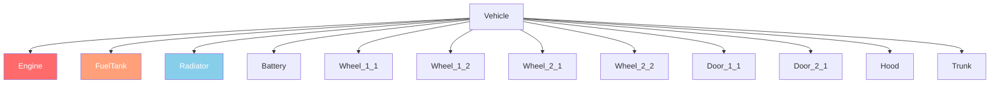

# Capitolo 6.2: Sistema veicoli

[Home](../../README.md) | [<< Precedente: Sistema entita](01-entity-system.md) | **Veicoli** | [Successivo: Meteo >>](03-weather.md)

---

## Introduzione

I veicoli DayZ sono entita che estendono il sistema di trasporto. Le auto estendono `CarScript`, le barche estendono `BoatScript`, ed entrambi ereditano da `Transport`. I veicoli hanno sistemi di fluidi, parti con salute indipendente, simulazione del cambio e fisica gestita dal motore. Questo capitolo copre i metodi API necessari per interagire con i veicoli negli script.

---

## Gerarchia delle classi

```
EntityAI
└── Transport                    // 3_Game - base per tutti i veicoli
    ├── Car                      // 3_Game - fisica auto nativa del motore
    │   └── CarScript            // 4_World - base auto scriptabile
    │       ├── CivilianSedan
    │       ├── OffroadHatchback
    │       ├── Hatchback_02
    │       ├── Sedan_02
    │       ├── Truck_01_Base
    │       └── ...
    └── Boat                     // 3_Game - fisica barca nativa del motore
        └── BoatScript           // 4_World - base barca scriptabile
```

---

## Transport (base)

**File:** `3_Game/entities/transport.c`

La base astratta per tutti i veicoli. Fornisce gestione dei posti e accesso all'equipaggio.

### Gestione equipaggio

```c
proto native int   CrewSize();                          // Numero totale di posti
proto native int   CrewMemberIndex(Human crew_member);  // Ottenere l'indice del posto di un umano
proto native Human CrewMember(int posIdx);              // Ottenere l'umano all'indice del posto
proto native void  CrewGetOut(int posIdx);              // Forzare l'uscita dal posto
proto native void  CrewDeath(int posIdx);               // Uccidere il membro dell'equipaggio nel posto
```

### Entrata dell'equipaggio

```c
proto native int  GetAnimInstance();
proto native int  CrewPositionIndex(int componentIdx);  // Componente a indice del posto
proto native vector CrewEntryPoint(int posIdx);         // Posizione mondiale di ingresso per il posto
```

**Esempio --- espellere tutti i passeggeri:**

```c
void EjectAllCrew(Transport vehicle)
{
    for (int i = 0; i < vehicle.CrewSize(); i++)
    {
        Human crew = vehicle.CrewMember(i);
        if (crew)
        {
            vehicle.CrewGetOut(i);
        }
    }
}
```

---

## Car (nativo del motore)

**File:** `3_Game/entities/car.c`

Fisica auto a livello di motore. Tutti i metodi `proto native` che guidano la simulazione del veicolo.

### Motore

```c
proto native bool  EngineIsOn();
proto native void  EngineStart();
proto native void  EngineStop();
proto native float EngineGetRPM();
proto native float EngineGetRPMRedline();
proto native float EngineGetRPMMax();
proto native int   GetGear();
```

### Fluidi

I veicoli DayZ hanno quattro tipi di fluido definiti nell'enum `CarFluid`:

```c
enum CarFluid
{
    FUEL,
    OIL,
    BRAKE,
    COOLANT
}
```

```c
proto native float GetFluidCapacity(CarFluid fluid);
proto native float GetFluidFraction(CarFluid fluid);     // 0.0 - 1.0
proto native void  Fill(CarFluid fluid, float amount);
proto native void  Leak(CarFluid fluid, float amount);
proto native void  LeakAll(CarFluid fluid);
```

**Esempio --- rifornire un veicolo:**

```c
void RefuelVehicle(Car car)
{
    float capacity = car.GetFluidCapacity(CarFluid.FUEL);
    float current = car.GetFluidFraction(CarFluid.FUEL) * capacity;
    float needed = capacity - current;
    car.Fill(CarFluid.FUEL, needed);
}
```

### Velocita

```c
proto native float GetSpeedometer();    // Velocita in km/h (valore assoluto)
```

### Controlli (simulazione)

```c
proto native void  SetBrake(float value, int wheel = -1);    // 0.0 - 1.0, -1 = tutte le ruote
proto native void  SetHandbrake(float value);                 // 0.0 - 1.0
proto native void  SetSteering(float value, bool analog = true);
proto native void  SetThrust(float value, int wheel = -1);    // 0.0 - 1.0
proto native void  SetClutchState(bool engaged);
```

### Ruote

```c
proto native int   WheelCount();
proto native bool  WheelIsAnyLocked();
proto native float WheelGetSurface(int wheelIdx);
```

### Callback (da sovrascrivere in CarScript)

```c
void OnEngineStart();
void OnEngineStop();
void OnContact(string zoneName, vector localPos, IEntity other, Contact data);
void OnFluidChanged(CarFluid fluid, float newValue, float oldValue);
void OnGearChanged(int newGear, int oldGear);
void OnSound(CarSoundCtrl ctrl, float oldValue);
```

---

## CarScript

**File:** `4_World/entities/vehicles/carscript.c`

La classe auto scriptabile che la maggior parte dei mod veicoli estende. Aggiunge parti, porte, luci e gestione del suono.

### Salute delle parti

CarScript usa zone di danno per rappresentare le parti del veicolo. Ogni parte puo essere danneggiata indipendentemente:

```c
// Controllare la salute delle parti tramite l'API standard EntityAI
float engineHP = car.GetHealth("Engine", "Health");
float fuelTankHP = car.GetHealth("FuelTank", "Health");

// Impostare la salute delle parti
car.SetHealth("Engine", "Health", 0);       // Distruggere il motore
car.SetHealth("FuelTank", "Health", 100);   // Riparare il serbatoio
```

### Diagramma zone di danno



Zone di danno comuni per i veicoli:

| Zona | Descrizione |
|------|-------------|
| `""` (globale) | Salute complessiva del veicolo |
| `"Engine"` | Parte motore |
| `"FuelTank"` | Serbatoio carburante |
| `"Radiator"` | Radiatore (liquido di raffreddamento) |
| `"Battery"` | Batteria |
| `"SparkPlug"` | Candela |
| `"FrontLeft"` / `"FrontRight"` | Ruote anteriori |
| `"RearLeft"` / `"RearRight"` | Ruote posteriori |
| `"DriverDoor"` / `"CoDriverDoor"` | Porte anteriori |
| `"Hood"` / `"Trunk"` | Cofano e bagagliaio |

### Luci

```c
void SetLightsState(int state);   // 0 = spente, 1 = accese
int  GetLightsState();
```

### Controllo porte

```c
bool IsDoorOpen(string doorSource);
void OpenDoor(string doorSource);
void CloseDoor(string doorSource);
```

### Override principali per veicoli personalizzati

```c
override void EEInit();                    // Inizializzare parti del veicolo, fluidi
override void OnEngineStart();             // Comportamento avvio motore personalizzato
override void OnEngineStop();              // Comportamento arresto motore personalizzato
override void EOnSimulate(IEntity other, float dt);  // Simulazione per-tick
override bool CanObjectAttachWeapon(string slot_name);
```

**Esempio --- creare un veicolo con fluidi pieni:**

```c
void SpawnReadyVehicle(vector pos)
{
    Car car = Car.Cast(GetGame().CreateObjectEx("CivilianSedan", pos,
                        ECE_PLACE_ON_SURFACE | ECE_INITAI | ECE_CREATEPHYSICS));
    if (!car)
        return;

    // Riempire tutti i fluidi
    car.Fill(CarFluid.FUEL, car.GetFluidCapacity(CarFluid.FUEL));
    car.Fill(CarFluid.OIL, car.GetFluidCapacity(CarFluid.OIL));
    car.Fill(CarFluid.BRAKE, car.GetFluidCapacity(CarFluid.BRAKE));
    car.Fill(CarFluid.COOLANT, car.GetFluidCapacity(CarFluid.COOLANT));

    // Spawnare le parti necessarie
    EntityAI carEntity = EntityAI.Cast(car);
    carEntity.GetInventory().CreateAttachment("CarBattery");
    carEntity.GetInventory().CreateAttachment("SparkPlug");
    carEntity.GetInventory().CreateAttachment("CarRadiator");
    carEntity.GetInventory().CreateAttachment("HatchbackWheel");
}
```

---

## BoatScript

**File:** `4_World/entities/vehicles/boatscript.c`

Base scriptabile per entita barca. API simile a CarScript ma con fisica basata su elica.

### Motore e propulsione

```c
proto native bool  EngineIsOn();
proto native void  EngineStart();
proto native void  EngineStop();
proto native float EngineGetRPM();
```

### Fluidi

Le barche usano lo stesso enum `CarFluid` ma tipicamente usano solo `FUEL`:

```c
float fuel = boat.GetFluidFraction(CarFluid.FUEL);
boat.Fill(CarFluid.FUEL, boat.GetFluidCapacity(CarFluid.FUEL));
```

### Velocita

```c
proto native float GetSpeedometer();   // Velocita in km/h
```

**Esempio --- spawnare una barca:**

```c
void SpawnBoat(vector waterPos)
{
    BoatScript boat = BoatScript.Cast(
        GetGame().CreateObjectEx("Boat_01", waterPos,
                                  ECE_CREATEPHYSICS | ECE_INITAI)
    );
    if (boat)
    {
        boat.Fill(CarFluid.FUEL, boat.GetFluidCapacity(CarFluid.FUEL));
    }
}
```

---

## Controlli di interazione con i veicoli

### Verificare se un giocatore e in un veicolo

```c
PlayerBase player;
if (player.IsInVehicle())
{
    EntityAI vehicle = player.GetDrivingVehicle();
    CarScript car;
    if (Class.CastTo(car, vehicle))
    {
        float speed = car.GetSpeedometer();
        Print(string.Format("Driving at %1 km/h", speed));
    }
}
```

### Trovare tutti i veicoli nel mondo

```c
void FindAllVehicles(out array<Transport> vehicles)
{
    vehicles = new array<Transport>;
    array<Object> objects = new array<Object>;
    array<CargoBase> proxyCargos = new array<CargoBase>;

    // Usare un grande raggio dal centro della mappa
    GetGame().GetObjectsAtPosition(Vector(7500, 0, 7500), 15000, objects, proxyCargos);

    foreach (Object obj : objects)
    {
        Transport transport;
        if (Class.CastTo(transport, obj))
        {
            vehicles.Insert(transport);
        }
    }
}
```

---

## Riepilogo

| Concetto | Punto chiave |
|----------|-------------|
| Gerarchia | `Transport` > `Car`/`Boat` > `CarScript`/`BoatScript` |
| Motore | `EngineStart()`, `EngineStop()`, `EngineIsOn()`, `EngineGetRPM()` |
| Fluidi | Enum `CarFluid`: `FUEL`, `OIL`, `BRAKE`, `COOLANT` |
| Riempimento/Perdita | `Fill(fluid, amount)`, `Leak(fluid, amount)`, `GetFluidFraction(fluid)` |
| Velocita | `GetSpeedometer()` restituisce km/h |
| Equipaggio | `CrewSize()`, `CrewMember(idx)`, `CrewGetOut(idx)` |
| Parti | Zone di danno standard: `"Engine"`, `"FuelTank"`, `"Radiator"`, ecc. |
| Creazione | `CreateObjectEx` con `ECE_PLACE_ON_SURFACE \| ECE_INITAI \| ECE_CREATEPHYSICS` |

---

## Buone pratiche

- **Includi sempre `ECE_CREATEPHYSICS | ECE_INITAI` quando spawni veicoli.** Senza fisica, il veicolo cade attraverso il terreno. Senza init AI, la simulazione del motore non si avvia e il veicolo non puo essere guidato.
- **Riempi tutti e quattro i fluidi dopo lo spawn.** Un veicolo a cui manca olio, liquido dei freni o liquido di raffreddamento si danneggera immediatamente quando il motore si avvia. Usa `GetFluidCapacity()` per ottenere i valori massimi corretti per tipo di veicolo.
- **Controlla il null di `CrewMember()` prima di operare sull'equipaggio.** I posti vuoti restituiscono `null`. Iterare `CrewSize()` senza controllare ogni indice causa crash quando i posti sono liberi.
- **Usa `GetSpeedometer()` invece di calcolare la velocita manualmente.** Il tachimetro del motore tiene conto del contatto delle ruote, dello stato della trasmissione e della fisica correttamente. I calcoli manuali della velocita dai delta di posizione sono inaffidabili.

---

## Compatibilita e impatto

> **Compatibilita mod:** I mod veicoli comunemente estendono `CarScript` con classi moddate. I conflitti sorgono quando piu mod sovrascrivono gli stessi callback come `OnEngineStart()` o `EOnSimulate()`.

- **Ordine di caricamento:** Se due mod entrambi usano `modded class CarScript` e sovrascrivono `OnEngineStart()`, solo l'ultimo caricato viene eseguito a meno che entrambi non chiamino `super`. I mod di revisione veicoli dovrebbero sempre chiamare `super` in ogni callback.
- **Conflitti di classi moddate:** Expansion Vehicles e i mod veicoli vanilla entrano frequentemente in conflitto su `EEInit()` e l'inizializzazione dei fluidi. Testa con entrambi caricati.
- **Impatto sulle prestazioni:** `EOnSimulate()` viene eseguito ad ogni tick della fisica per ogni veicolo attivo. Mantieni la logica minima in questo callback; usa accumulatori di timer per operazioni costose.
- **Server/Client:** `EngineStart()`, `EngineStop()`, `Fill()`, `Leak()` e `CrewGetOut()` sono autoritativi del server. `GetSpeedometer()`, `EngineIsOn()` e `GetFluidFraction()` sono sicuri da leggere su entrambi i lati.

---

## Pattern osservati nei mod reali

> Questi pattern sono stati confermati studiando il codice sorgente di mod DayZ professionali.

| Pattern | Mod | File/Posizione |
|---------|-----|---------------|
| Override di `EEInit()` per impostare capacita dei fluidi personalizzate e spawnare parti | Expansion Vehicles | Sottoclassi `CarScript` |
| Accumulatore `EOnSimulate` per controlli periodici del consumo di carburante | Mod veicoli Vanilla+ | Override `CarScript` |
| Ciclo `CrewGetOut()` nel comando admin espelli-tutti | VPP Admin Tools | Modulo gestione veicoli |
| Override personalizzato di `OnContact()` per taratura del danno da collisione | Expansion | `ExpansionCarScript` |

---

[Home](../../README.md) | [<< Precedente: Sistema entita](01-entity-system.md) | **Veicoli** | [Successivo: Meteo >>](03-weather.md)
