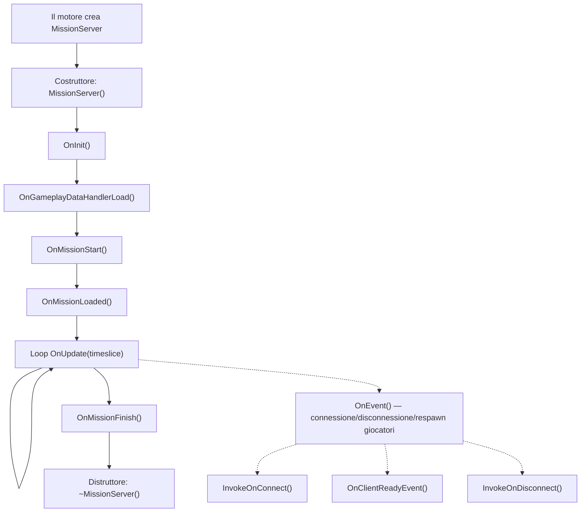
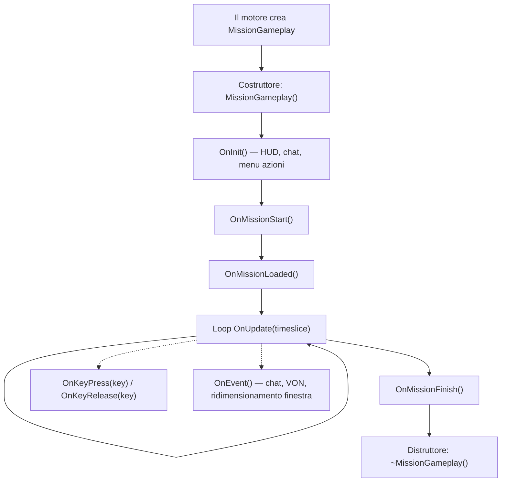
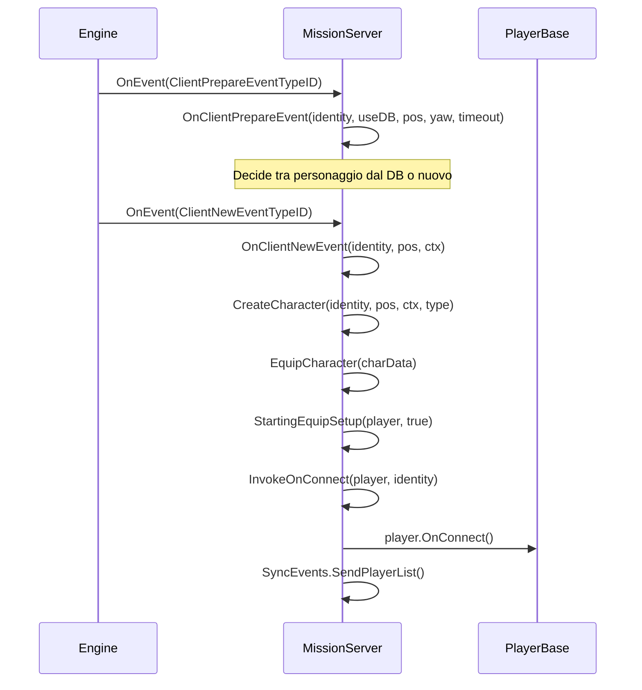
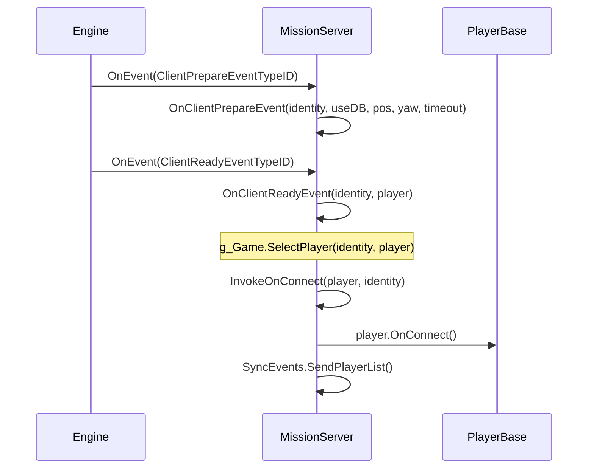
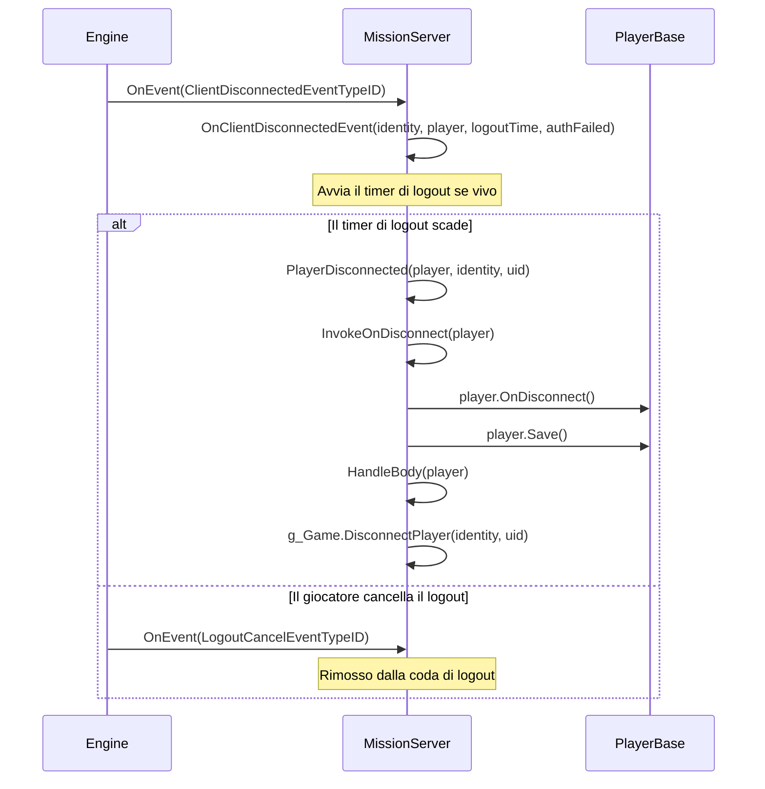

# Capitolo 6.11: Hook delle Missioni

[Home](../../README.md) | [<< Precedente: Economia Centrale](10-central-economy.md) | **Hook delle Missioni** | [Successivo: Sistema delle Azioni >>](12-action-system.md)

---

## Introduzione

Ogni mod di DayZ ha bisogno di un punto di ingresso --- un posto dove inizializzare i manager, registrare i gestori RPC, agganciarsi alle connessioni dei giocatori e pulire alla chiusura. Quel punto di ingresso è la classe **Mission**. Il motore crea esattamente un'istanza di Mission quando viene caricato uno scenario: `MissionServer` su un server dedicato, `MissionGameplay` su un client, o entrambi su un listen server. Queste classi forniscono hook del ciclo di vita che si attivano in un ordine garantito, dando alle mod un posto affidabile dove iniettare comportamenti.

Questo capitolo copre l'intera gerarchia della classe Mission, ogni metodo agganciabile, il pattern corretto `modded class` per estenderli, e esempi reali da DayZ vanilla, COT ed Expansion.

---

## Gerarchia delle Classi

```
Mission                      // 3_Game/gameplay.c (base, definisce tutte le firme degli hook)
└── MissionBaseWorld         // 4_World/classes/missionbaseworld.c (ponte minimale)
    └── MissionBase          // 5_Mission/mission/missionbase.c (setup condiviso: HUD, menu, plugin)
        ├── MissionServer    // 5_Mission/mission/missionserver.c (lato server)
        └── MissionGameplay  // 5_Mission/mission/missiongameplay.c (lato client)
```

- **Mission** definisce tutte le firme degli hook come metodi vuoti: `OnInit()`, `OnUpdate()`, `OnEvent()`, `OnMissionStart()`, `OnMissionFinish()`, `OnKeyPress()`, `OnKeyRelease()`, ecc.
- **MissionBase** inizializza il plugin manager, il gestore degli eventi dei widget, i dati del mondo, la musica dinamica, i set di suoni e il tracciamento dei dispositivi di input. È il genitore comune per server e client.
- **MissionServer** gestisce le connessioni dei giocatori, le disconnessioni, i respawn, la gestione dei corpi, la pianificazione dei tick e l'artiglieria.
- **MissionGameplay** gestisce la creazione dell'HUD, la chat, i menu delle azioni, l'UI del voice-over-network, l'inventario, l'esclusione degli input e la pianificazione lato client del giocatore.

---

## Panoramica del Ciclo di Vita

### Ciclo di Vita di MissionServer (Lato Server)



### Ciclo di Vita di MissionGameplay (Lato Client)



---

## Metodi della Classe Base Mission

**File:** `3_Game/gameplay.c`

La classe base `Mission` definisce ogni metodo agganciabile. Tutti sono virtuali con implementazioni predefinite vuote a meno che non sia indicato diversamente.

### Hook del Ciclo di Vita

| Metodo | Firma | Quando Si Attiva |
|--------|-------|-----------------|
| `OnInit` | `void OnInit()` | Dopo il costruttore, prima che la missione inizi. Punto di setup principale. |
| `OnMissionStart` | `void OnMissionStart()` | Dopo OnInit. Il mondo della missione è attivo. |
| `OnMissionLoaded` | `void OnMissionLoaded()` | Dopo OnMissionStart. Tutti i sistemi vanilla sono inizializzati. |
| `OnGameplayDataHandlerLoad` | `void OnGameplayDataHandlerLoad()` | Server: dopo il caricamento dei dati di gameplay (cfggameplay.json). |
| `OnUpdate` | `void OnUpdate(float timeslice)` | Ogni frame. `timeslice` sono i secondi dall'ultimo frame (tipicamente 0.016-0.033). |
| `OnMissionFinish` | `void OnMissionFinish()` | All'arresto o alla disconnessione. Pulisci tutto qui. |

### Hook degli Input (Lato Client)

| Metodo | Firma | Quando Si Attiva |
|--------|-------|-----------------|
| `OnKeyPress` | `void OnKeyPress(int key)` | Tasto fisico premuto. `key` è una costante `KeyCode`. |
| `OnKeyRelease` | `void OnKeyRelease(int key)` | Tasto fisico rilasciato. |
| `OnMouseButtonPress` | `void OnMouseButtonPress(int button)` | Pulsante del mouse premuto. |
| `OnMouseButtonRelease` | `void OnMouseButtonRelease(int button)` | Pulsante del mouse rilasciato. |

### Hook degli Eventi

| Metodo | Firma | Quando Si Attiva |
|--------|-------|-----------------|
| `OnEvent` | `void OnEvent(EventType eventTypeId, Param params)` | Eventi del motore: chat, VON, connessione/disconnessione giocatori, ridimensionamento finestra, ecc. |

### Metodi di Utilità

| Metodo | Firma | Descrizione |
|--------|-------|-------------|
| `GetHud` | `Hud GetHud()` | Restituisce l'istanza dell'HUD (solo client). |
| `GetWorldData` | `WorldData GetWorldData()` | Restituisce dati specifici del mondo (curve di temperatura, ecc.). |
| `IsPaused` | `bool IsPaused()` | Se il gioco è in pausa (single player / listen server). |
| `IsServer` | `bool IsServer()` | `true` per MissionServer, `false` per MissionGameplay. |
| `IsMissionGameplay` | `bool IsMissionGameplay()` | `true` per MissionGameplay, `false` per MissionServer. |
| `PlayerControlEnable` | `void PlayerControlEnable(bool bForceSuppress)` | Riabilita l'input del giocatore dopo la disabilitazione. |
| `PlayerControlDisable` | `void PlayerControlDisable(int mode)` | Disabilita l'input del giocatore (es. `INPUT_EXCLUDE_ALL`). |
| `IsControlDisabled` | `bool IsControlDisabled()` | Se i controlli del giocatore sono attualmente disabilitati. |
| `GetControlDisabledMode` | `int GetControlDisabledMode()` | Restituisce la modalità corrente di esclusione degli input. |

---

## Hook di MissionServer (Lato Server)

**File:** `5_Mission/mission/missionserver.c`

MissionServer viene istanziato dal motore sui server dedicati. Gestisce tutto ciò che riguarda il ciclo di vita del giocatore sul server.

### Comportamento Vanilla Chiave

- **Costruttore**: Configura la `CallQueue` per le statistiche dei giocatori (intervallo di 30 secondi), l'array dei giocatori morti, le mappe di tracciamento dei logout, il gestore di approvvigionamento della pioggia.
- **OnInit**: Carica `CfgGameplayHandler`, `PlayerSpawnHandler`, `CfgPlayerRestrictedAreaHandler`, `UndergroundAreaLoader`, posizioni di fuoco dell'artiglieria.
- **OnMissionStart**: Crea le zone di area effetto (zone contaminate, ecc.).
- **OnUpdate**: Esegue lo scheduler dei tick, elabora i timer di logout, aggiorna la temperatura ambientale di base, l'approvvigionamento della pioggia, l'artiglieria casuale.

### OnEvent --- Eventi di Connessione dei Giocatori

L'`OnEvent` del server è il dispatcher centrale per tutti gli eventi del ciclo di vita dei giocatori. Il motore invia eventi con oggetti `Param` tipizzati. Vanilla li gestisce tramite un blocco `switch`:

| Evento | Tipo Param | Cosa Succede |
|--------|-----------|--------------|
| `ClientPrepareEventTypeID` | `ClientPrepareEventParams` | Decide tra personaggio dal DB o nuovo |
| `ClientNewEventTypeID` | `ClientNewEventParams` | Crea + equipaggia un nuovo personaggio, chiama `InvokeOnConnect` |
| `ClientReadyEventTypeID` | `ClientReadyEventParams` | Personaggio esistente caricato, chiama `OnClientReadyEvent` + `InvokeOnConnect` |
| `ClientRespawnEventTypeID` | `ClientRespawnEventParams` | Richiesta di respawn del giocatore, uccide il vecchio personaggio se incosciente |
| `ClientReconnectEventTypeID` | `ClientReconnectEventParams` | Giocatore riconnesso a un personaggio vivo |
| `ClientDisconnectedEventTypeID` | `ClientDisconnectedEventParams` | Giocatore in disconnessione, avvia il timer di logout |
| `LogoutCancelEventTypeID` | `LogoutCancelEventParams` | Giocatore ha cancellato il conto alla rovescia di logout |

### Metodi di Connessione dei Giocatori

Chiamati dall'interno di `OnEvent` quando si attivano eventi relativi ai giocatori:

| Metodo | Firma | Comportamento Vanilla |
|--------|-------|----------------------|
| `InvokeOnConnect` | `void InvokeOnConnect(PlayerBase player, PlayerIdentity identity)` | Chiama `player.OnConnect()`. Hook principale "giocatore connesso". |
| `InvokeOnDisconnect` | `void InvokeOnDisconnect(PlayerBase player)` | Chiama `player.OnDisconnect()`. Giocatore completamente disconnesso. |
| `OnClientReadyEvent` | `void OnClientReadyEvent(PlayerIdentity identity, PlayerBase player)` | Chiama `g_Game.SelectPlayer()`. Personaggio esistente caricato dal DB. |
| `OnClientNewEvent` | `PlayerBase OnClientNewEvent(PlayerIdentity identity, vector pos, ParamsReadContext ctx)` | Crea + equipaggia un nuovo personaggio. Restituisce `PlayerBase`. |
| `OnClientRespawnEvent` | `void OnClientRespawnEvent(PlayerIdentity identity, PlayerBase player)` | Uccide il vecchio personaggio se incosciente/legato. |
| `OnClientReconnectEvent` | `void OnClientReconnectEvent(PlayerIdentity identity, PlayerBase player)` | Chiama `player.OnReconnect()`. |
| `PlayerDisconnected` | `void PlayerDisconnected(PlayerBase player, PlayerIdentity identity, string uid)` | Chiama `InvokeOnDisconnect`, salva il giocatore, esce dall'hive, gestisce il corpo, rimuove dal server. |

### Setup del Personaggio

| Metodo | Firma | Descrizione |
|--------|-------|-------------|
| `CreateCharacter` | `PlayerBase CreateCharacter(PlayerIdentity identity, vector pos, ParamsReadContext ctx, string characterName)` | Crea l'entità giocatore tramite `g_Game.CreatePlayer()` + `g_Game.SelectPlayer()`. |
| `EquipCharacter` | `void EquipCharacter(MenuDefaultCharacterData char_data)` | Itera gli slot degli accessori, randomizza se il respawn personalizzato è disabilitato. Chiama `StartingEquipSetup()`. |
| `StartingEquipSetup` | `void StartingEquipSetup(PlayerBase player, bool clothesChosen)` | **Vuoto nel vanilla** --- il tuo punto di ingresso per i kit iniziali. |

---

## Hook di MissionGameplay (Lato Client)

**File:** `5_Mission/mission/missiongameplay.c`

MissionGameplay viene istanziato sul client quando ci si connette a un server o si avvia il single player. Gestisce tutta l'UI e gli input lato client.

### Comportamento Vanilla Chiave

- **Costruttore**: Distrugge i menu esistenti, crea Chat, ActionMenu, IngameHud, stato VoN, timer di dissolvenza, registrazione SyncEvents.
- **OnInit**: Protegge dalla doppia inizializzazione con `m_Initialized`. Crea il widget radice dell'HUD da `"gui/layouts/day_z_hud.layout"`, il widget della chat, il menu delle azioni, l'icona del microfono, i widget del livello vocale VoN, l'area del canale di chat. Chiama `PPEffects.Init()` e `MapMarkerTypes.Init()`.
- **OnMissionStart**: Nasconde il cursore, imposta lo stato della missione su `MISSION_STATE_GAME`, carica le aree di effetto nel single player.
- **OnUpdate**: Scheduler dei tick per il giocatore locale, aggiornamenti dell'ologramma, barra rapida radiale (console), menu dei gesti, gestione degli input per inventario/chat/VoN, monitor di debug, comportamento in pausa.
- **OnMissionFinish**: Nasconde il dialogo, distrugge tutti i menu e la chat, elimina il widget radice dell'HUD, ferma tutti gli effetti PPE, riabilita tutti gli input, imposta lo stato della missione su `MISSION_STATE_FINNISH`.

### Hook degli Input

```c
override void OnKeyPress(int key)
{
    super.OnKeyPress(key);
    // Vanilla inoltra a Hud.KeyPress(key)
    // i valori dei tasti sono costanti KeyCode (es. KeyCode.KC_F1 = 59)
}

override void OnKeyRelease(int key)
{
    super.OnKeyRelease(key);
}
```

### Hook degli Eventi

L'`OnEvent()` di MissionGameplay vanilla gestisce `ChatMessageEventTypeID` (aggiunge al widget della chat), `ChatChannelEventTypeID` (aggiorna l'indicatore del canale), `WindowsResizeEventTypeID` (ricostruisce menu/HUD), `SetFreeCameraEventTypeID` (camera di debug), e `VONStateEventTypeID` (stato vocale). Sovrascrivilo con lo stesso pattern `switch` e chiama sempre `super.OnEvent()`.

### Controllo degli Input

`PlayerControlDisable(int mode)` attiva un gruppo di esclusione degli input (es. `INPUT_EXCLUDE_ALL`, `INPUT_EXCLUDE_INVENTORY`). `PlayerControlEnable(bool bForceSuppress)` lo rimuove. Questi corrispondono ai gruppi di esclusione definiti in `specific.xml`. Sovrascrivili se la tua mod necessita di un comportamento personalizzato di esclusione degli input (come fa Expansion per i suoi menu).

---

## Flusso degli Eventi Lato Server: Connessione di un Giocatore

Comprendere la sequenza esatta degli eventi quando un giocatore si connette è critico per sapere dove agganciare il tuo codice.

### Nuovo Personaggio (Prima Connessione o Dopo la Morte)



### Personaggio Esistente (Riconnessione Dopo Disconnessione)



### Disconnessione del Giocatore



---

## Come Agganciare: Il Pattern modded class

Il modo corretto per estendere le classi Mission è il pattern `modded class`. Questo utilizza il meccanismo di ereditarietà delle classi di Enforce Script dove `modded class` estende la classe esistente senza sostituirla, permettendo a più mod di coesistere.

### Hook Server Base

```c
// La tua mod: Scripts/5_Mission/YourMod/MissionServer.c
modded class MissionServer
{
    ref MyServerManager m_MyManager;

    override void OnInit()
    {
        super.OnInit();  // Chiama SEMPRE super per primo

        m_MyManager = new MyServerManager();
        m_MyManager.Init();
        Print("[MyMod] Server manager inizializzato");
    }

    override void OnMissionFinish()
    {
        if (m_MyManager)
        {
            m_MyManager.Cleanup();
            m_MyManager = null;
        }

        super.OnMissionFinish();  // Chiama super (prima o dopo la tua pulizia)
    }
}
```

### Hook Client Base

```c
// La tua mod: Scripts/5_Mission/YourMod/MissionGameplay.c
modded class MissionGameplay
{
    ref MyHudWidget m_MyHud;

    override void OnInit()
    {
        super.OnInit();  // Chiama SEMPRE super per primo

        // Crea elementi HUD personalizzati
        m_MyHud = new MyHudWidget();
        m_MyHud.Init();
    }

    override void OnUpdate(float timeslice)
    {
        super.OnUpdate(timeslice);

        // Aggiorna l'HUD personalizzato ogni frame
        if (m_MyHud)
        {
            m_MyHud.Update(timeslice);
        }
    }

    override void OnMissionFinish()
    {
        if (m_MyHud)
        {
            m_MyHud.Destroy();
            m_MyHud = null;
        }

        super.OnMissionFinish();
    }
}
```

### Agganciare la Connessione dei Giocatori

```c
modded class MissionServer
{
    override void InvokeOnConnect(PlayerBase player, PlayerIdentity identity)
    {
        super.InvokeOnConnect(player, identity);

        // Il tuo codice viene eseguito DOPO vanilla e tutte le mod precedenti
        if (player && identity)
        {
            string uid = identity.GetId();
            string name = identity.GetName();
            Print("[MyMod] Giocatore connesso: " + name + " (" + uid + ")");

            // Carica dati giocatore, invia impostazioni, ecc.
            MyPlayerData.Load(uid);
        }
    }

    override void InvokeOnDisconnect(PlayerBase player)
    {
        // Salva i dati PRIMA di super (il giocatore potrebbe essere eliminato dopo)
        if (player && player.GetIdentity())
        {
            string uid = player.GetIdentity().GetId();
            MyPlayerData.Save(uid);
        }

        super.InvokeOnDisconnect(player);
    }
}
```

### Agganciare i Messaggi Chat (OnEvent Lato Server)

```c
modded class MissionServer
{
    override void OnEvent(EventType eventTypeId, Param params)
    {
        // Intercetta PRIMA di super per potenzialmente bloccare gli eventi
        if (eventTypeId == ClientNewEventTypeID)
        {
            ClientNewEventParams newParams;
            Class.CastTo(newParams, params);
            PlayerIdentity identity = newParams.param1;

            if (IsPlayerBanned(identity))
            {
                // Blocca la connessione non chiamando super
                return;
            }
        }

        super.OnEvent(eventTypeId, params);
    }
}
```

### Agganciare gli Input da Tastiera (Lato Client)

```c
modded class MissionGameplay
{
    override void OnKeyPress(int key)
    {
        super.OnKeyPress(key);

        // Apri il menu personalizzato premendo F6
        if (key == KeyCode.KC_F6)
        {
            if (!GetGame().GetUIManager().GetMenu())
            {
                MyCustomMenu.Open();
            }
        }
    }
}
```

### Dove Registrare i Gestori RPC

I gestori RPC dovrebbero essere registrati in `OnInit`, non nel costruttore. Al momento di `OnInit`, tutti i moduli script sono caricati e il layer di rete è pronto.

```c
modded class MissionServer
{
    override void OnInit()
    {
        super.OnInit();

        // Registra i gestori RPC qui
        GetDayZGame().Event_OnRPC.Insert(OnMyRPC);
    }

    override void OnMissionFinish()
    {
        GetDayZGame().Event_OnRPC.Remove(OnMyRPC);
        super.OnMissionFinish();
    }

    void OnMyRPC(PlayerIdentity sender, Object target, int rpc_type,
                 ParamsReadContext ctx)
    {
        // Gestisci i tuoi RPC
    }
}
```

---

## Hook Comuni per Scopo

| Voglio... | Agganciare questo metodo | Su quale classe |
|-----------|--------------------------|-----------------|
| Inizializzare la mia mod sul server | `OnInit()` | `MissionServer` |
| Inizializzare la mia mod sul client | `OnInit()` | `MissionGameplay` |
| Eseguire codice ogni frame (server) | `OnUpdate(float timeslice)` | `MissionServer` |
| Eseguire codice ogni frame (client) | `OnUpdate(float timeslice)` | `MissionGameplay` |
| Reagire alla connessione di un giocatore | `InvokeOnConnect(player, identity)` | `MissionServer` |
| Reagire alla disconnessione di un giocatore | `InvokeOnDisconnect(player)` | `MissionServer` |
| Inviare dati iniziali al nuovo client | `OnClientReadyEvent(identity, player)` | `MissionServer` |
| Reagire alla generazione di un nuovo personaggio | `OnClientNewEvent(identity, pos, ctx)` | `MissionServer` |
| Dare equipaggiamento iniziale | `StartingEquipSetup(player, clothesChosen)` | `MissionServer` |
| Reagire al respawn del giocatore | `OnClientRespawnEvent(identity, player)` | `MissionServer` |
| Reagire alla riconnessione del giocatore | `OnClientReconnectEvent(identity, player)` | `MissionServer` |
| Gestire la logica di disconnessione/logout | `OnClientDisconnectedEvent(identity, player, logoutTime, authFailed)` | `MissionServer` |
| Intercettare eventi del server (connessione, chat) | `OnEvent(eventTypeId, params)` | `MissionServer` |
| Intercettare eventi del client (chat, VON) | `OnEvent(eventTypeId, params)` | `MissionGameplay` |
| Gestire input da tastiera | `OnKeyPress(key)` / `OnKeyRelease(key)` | `MissionGameplay` |
| Creare elementi HUD | `OnInit()` | `MissionGameplay` |
| Pulire all'arresto del server | `OnMissionFinish()` | `MissionServer` |
| Pulire alla disconnessione del client | `OnMissionFinish()` | `MissionGameplay` |
| Eseguire codice una volta dopo il caricamento di tutti i sistemi | `OnMissionLoaded()` | Entrambi |
| Disabilitare/abilitare gli input del giocatore | `PlayerControlDisable(mode)` / `PlayerControlEnable(bForceSuppress)` | `MissionGameplay` |

---

## Server vs Client: Quali Hook Si Attivano Dove

| Hook | Server | Client | Note |
|------|--------|--------|------|
| Costruttore | Sì | Sì | Classe diversa su ogni lato |
| `OnInit()` | Sì | Sì | |
| `OnMissionStart()` | Sì | Sì | |
| `OnMissionLoaded()` | Sì | Sì | |
| `OnGameplayDataHandlerLoad()` | Sì | No | cfggameplay.json caricato |
| `OnUpdate(timeslice)` | Sì | Sì | Entrambi eseguono il proprio loop di frame |
| `OnMissionFinish()` | Sì | Sì | |
| `OnEvent()` | Sì | Sì | Tipi di eventi diversi su ogni lato |
| `InvokeOnConnect()` | Sì | No | Solo server |
| `InvokeOnDisconnect()` | Sì | No | Solo server |
| `OnClientReadyEvent()` | Sì | No | Solo server |
| `OnClientNewEvent()` | Sì | No | Solo server |
| `OnClientRespawnEvent()` | Sì | No | Solo server |
| `OnClientReconnectEvent()` | Sì | No | Solo server |
| `OnClientDisconnectedEvent()` | Sì | No | Solo server |
| `PlayerDisconnected()` | Sì | No | Solo server |
| `StartingEquipSetup()` | Sì | No | Solo server |
| `EquipCharacter()` | Sì | No | Solo server |
| `OnKeyPress()` | No | Sì | Solo client |
| `OnKeyRelease()` | No | Sì | Solo client |
| `OnMouseButtonPress()` | No | Sì | Solo client |
| `OnMouseButtonRelease()` | No | Sì | Solo client |
| `PlayerControlDisable()` | No | Sì | Solo client |
| `PlayerControlEnable()` | No | Sì | Solo client |

---

## Riferimento Costanti EventType

Tutte le costanti degli eventi sono definite in `3_Game/gameplay.c` e inviate attraverso `OnEvent()`.

| Costante | Lato | Descrizione |
|----------|------|-------------|
| `ClientPrepareEventTypeID` | Server | Identità del giocatore ricevuta, decide tra DB o nuovo |
| `ClientNewEventTypeID` | Server | Nuovo personaggio in fase di creazione |
| `ClientReadyEventTypeID` | Server | Personaggio esistente caricato dal DB |
| `ClientRespawnEventTypeID` | Server | Il giocatore ha richiesto il respawn |
| `ClientReconnectEventTypeID` | Server | Il giocatore si è riconnesso a un personaggio vivo |
| `ClientDisconnectedEventTypeID` | Server | Giocatore in disconnessione |
| `LogoutCancelEventTypeID` | Server | Il giocatore ha cancellato il conto alla rovescia di logout |
| `ChatMessageEventTypeID` | Client | Messaggio chat ricevuto (`ChatMessageEventParams`) |
| `ChatChannelEventTypeID` | Client | Canale chat cambiato (`ChatChannelEventParams`) |
| `VONStateEventTypeID` | Client | Stato voice-over-network cambiato |
| `VONStartSpeakingEventTypeID` | Client | Il giocatore ha iniziato a parlare |
| `VONStopSpeakingEventTypeID` | Client | Il giocatore ha smesso di parlare |
| `MPSessionStartEventTypeID` | Entrambi | Sessione multiplayer avviata |
| `MPSessionEndEventTypeID` | Entrambi | Sessione multiplayer terminata |
| `MPConnectionLostEventTypeID` | Client | Connessione al server persa |
| `PlayerDeathEventTypeID` | Entrambi | Il giocatore è morto |
| `SetFreeCameraEventTypeID` | Client | Camera libera attivata/disattivata (debug) |

---

## Esempi Reali

### Esempio 1: Inizializzazione del Manager del Server

Un pattern tipico per inizializzare un manager lato server che deve eseguire compiti periodici.

```c
modded class MissionServer
{
    ref MyTraderManager m_TraderManager;
    float m_TraderUpdateTimer;
    const float TRADER_UPDATE_INTERVAL = 5.0; // secondi

    override void OnInit()
    {
        super.OnInit();

        m_TraderManager = new MyTraderManager();
        m_TraderManager.LoadConfig();
        m_TraderManager.SpawnTraders();
        m_TraderUpdateTimer = 0;

        Print("[MyMod] Trader manager inizializzato");
    }

    override void OnUpdate(float timeslice)
    {
        super.OnUpdate(timeslice);

        // Limita l'aggiornamento dei trader a ogni 5 secondi
        m_TraderUpdateTimer += timeslice;
        if (m_TraderUpdateTimer >= TRADER_UPDATE_INTERVAL)
        {
            m_TraderUpdateTimer = 0;
            m_TraderManager.Update();
        }
    }

    override void OnMissionFinish()
    {
        if (m_TraderManager)
        {
            m_TraderManager.SaveState();
            m_TraderManager.DespawnTraders();
            m_TraderManager = null;
        }

        super.OnMissionFinish();
    }
}
```

### Esempio 2: Caricamento Dati del Giocatore alla Connessione

```c
modded class MissionServer
{
    override void InvokeOnConnect(PlayerBase player, PlayerIdentity identity)
    {
        super.InvokeOnConnect(player, identity);
        if (!player || !identity)
            return;

        string uid = identity.GetId();
        string path = "$profile:MyMod/Players/" + uid + ".json";
        ref MyPlayerStats stats = new MyPlayerStats();

        if (FileExist(path))
            JsonFileLoader<MyPlayerStats>.JsonLoadFile(path, stats);
        else
            stats.SetDefaults();

        player.m_MyStats = stats;

        // Invia dati iniziali al client
        ScriptRPC rpc = new ScriptRPC();
        rpc.Write(stats.GetKills());
        rpc.Write(stats.GetDeaths());
        rpc.Send(player, MY_RPC_SYNC_STATS, true, identity);
    }

    override void InvokeOnDisconnect(PlayerBase player)
    {
        if (player && player.GetIdentity() && player.m_MyStats)
        {
            string path = "$profile:MyMod/Players/" + player.GetIdentity().GetId() + ".json";
            JsonFileLoader<MyPlayerStats>.JsonSaveFile(path, player.m_MyStats);
        }
        super.InvokeOnDisconnect(player);
    }
}
```

### Esempio 3: Creazione HUD Lato Client

Creare un elemento HUD personalizzato che si aggiorna ogni frame.

```c
modded class MissionGameplay
{
    ref Widget m_MyHudRoot;
    ref TextWidget m_MyStatusText;
    float m_HudUpdateTimer;

    override void OnInit()
    {
        super.OnInit();

        // Crea HUD dal file di layout
        m_MyHudRoot = GetGame().GetWorkspace().CreateWidgets(
            "MyMod/gui/layouts/my_hud.layout"
        );

        if (m_MyHudRoot)
        {
            m_MyStatusText = TextWidget.Cast(
                m_MyHudRoot.FindAnyWidget("StatusText")
            );
            m_MyHudRoot.Show(true);
        }

        m_HudUpdateTimer = 0;
    }

    override void OnUpdate(float timeslice)
    {
        super.OnUpdate(timeslice);

        // Aggiorna il testo dell'HUD due volte al secondo, non ogni frame
        m_HudUpdateTimer += timeslice;
        if (m_HudUpdateTimer >= 0.5)
        {
            m_HudUpdateTimer = 0;
            UpdateMyHud();
        }
    }

    void UpdateMyHud()
    {
        PlayerBase player = PlayerBase.Cast(GetGame().GetPlayer());
        if (!player || !m_MyStatusText)
            return;

        string status = "Health: " + player.GetHealth("", "").ToString();
        m_MyStatusText.SetText(status);
    }

    override void OnMissionFinish()
    {
        if (m_MyHudRoot)
        {
            m_MyHudRoot.Unlink();
            m_MyHudRoot = null;
        }

        super.OnMissionFinish();
    }
}
```

### Esempio 4: Intercettazione Comandi Chat (Lato Server)

Intercettare le connessioni dei giocatori per implementare un sistema di ban. Questo pattern è usato da COT.

```c
modded class MissionServer
{
    override void OnEvent(EventType eventTypeId, Param params)
    {
        // Controlla i ban PRIMA che super elabori la connessione
        if (eventTypeId == ClientNewEventTypeID)
        {
            ClientNewEventParams newParams;
            Class.CastTo(newParams, params);
            PlayerIdentity identity = newParams.param1;

            if (identity && IsBanned(identity.GetId()))
            {
                Print("[MyMod] Giocatore bannato bloccato: " + identity.GetId());
                // Non chiama super --- la connessione è bloccata
                return;
            }
        }

        super.OnEvent(eventTypeId, params);
    }

    bool IsBanned(string uid)
    {
        string path = "$profile:MyMod/Bans/" + uid + ".json";
        return FileExist(path);
    }
}
```

### Esempio 5: Kit Iniziale tramite StartingEquipSetup

Il modo più pulito per dare ai nuovi giocatori l'equipaggiamento senza toccare `OnClientNewEvent`.

```c
modded class MissionServer
{
    override void StartingEquipSetup(PlayerBase player, bool clothesChosen)
    {
        super.StartingEquipSetup(player, clothesChosen);

        if (!player)
            return;

        // Dai a ogni nuovo personaggio un coltello e una benda
        EntityAI knife = player.GetInventory().CreateInInventory("KitchenKnife");
        EntityAI bandage = player.GetInventory().CreateInInventory("BandageDressing");

        // Dai del cibo nello zaino (se ne hanno uno)
        EntityAI backpack = player.FindAttachmentBySlotName("Back");
        if (backpack)
        {
            backpack.GetInventory().CreateInInventory("SardinesCan");
            backpack.GetInventory().CreateInInventory("Canteen");
        }
    }
}
```

### Pattern: Delegare a un Manager Centrale

Sia COT che Expansion seguono lo stesso pattern: i loro hook delle missioni sono wrapper sottili che delegano a un manager singleton. COT crea `g_cotBase = new CommunityOnlineTools` nel costruttore, poi chiama `g_cotBase.OnStart()` / `OnUpdate()` / `OnFinish()` dagli hook corrispondenti. Expansion fa lo stesso con `GetDayZExpansion().OnStart()` / `OnLoaded()` / `OnFinish()`. La tua mod dovrebbe seguire questo pattern --- mantieni il codice degli hook delle missioni sottile e spingi la logica in classi manager dedicate.

---

## OnInit vs OnMissionStart vs OnMissionLoaded

| Hook | Quando | Usare Per |
|------|--------|-----------|
| `OnInit()` | Primo. I moduli script sono caricati, il mondo non è ancora attivo. | Creare manager, registrare RPC, caricare configurazioni. |
| `OnMissionStart()` | Secondo. Il mondo è attivo, le entità possono essere generate. | Generare entità, avviare sistemi di gameplay, creare trigger. |
| `OnMissionLoaded()` | Terzo. Tutti i sistemi vanilla completamente inizializzati. | Query tra mod, finalizzazione che dipende dal fatto che tutto sia pronto. |

Chiama sempre `super` su tutti e tre. Usa `OnInit` come punto di inizializzazione principale. Usa `OnMissionLoaded` solo quando hai bisogno di garantire che altre mod si siano già inizializzate.

---

## Accedere alla Missione Corrente

```c
Mission mission = GetGame().GetMission();                                    // Classe base
MissionServer serverMission = MissionServer.Cast(GetGame().GetMission());   // Cast server
MissionGameplay clientMission = MissionGameplay.Cast(GetGame().GetMission()); // Cast client
PlayerBase player = PlayerBase.Cast(GetGame().GetPlayer());                  // SOLO CLIENT (null sul server)
```

---

## Errori Comuni

### 1. Dimenticare super.OnInit()

Ogni `override` **deve** chiamare `super`. Dimenticarlo rompe vanilla e ogni altra mod nella catena. Questo è l'errore di modding più comune in assoluto.

```c
// SBAGLIATO                                  // CORRETTO
override void OnInit()                      override void OnInit()
{                                           {
    m_MyManager = new MyManager();              super.OnInit();  // Sempre per primo!
}                                               m_MyManager = new MyManager();
                                            }
```

### 2. Usare GetGame().GetPlayer() sul Server

`GetGame().GetPlayer()` è **sempre null** su un server dedicato. Non c'è un giocatore "locale". Usa `GetGame().GetPlayers(array)` per iterare tutti i giocatori connessi.

```c
// Modo CORRETTO per iterare i giocatori sul server
array<Man> players = new array<Man>();
GetGame().GetPlayers(players);
foreach (Man man : players)
{
    PlayerBase player = PlayerBase.Cast(man);
    if (player) { /* elabora */ }
}
```

### 3. Non Pulire in OnMissionFinish

Pulisci sempre widget, callback e riferimenti in `OnMissionFinish()`. Senza pulizia, i widget trapelano nel caricamento della missione successiva (client), e i riferimenti obsoleti persistono attraverso i riavvii del server.

```c
override void OnMissionFinish()
{
    if (m_MyWidget) { m_MyWidget.Unlink(); m_MyWidget = null; }
    super.OnMissionFinish();
}
```

### 4. OnUpdate Senza Limitazione dei Frame

`OnUpdate` si attiva ogni frame (15-60+ FPS). Usa un accumulatore di timer per qualsiasi lavoro non banale.

```c
m_Timer += timeslice;
if (m_Timer >= 10.0)  // Ogni 10 secondi
{
    m_Timer = 0;
    DoExpensiveWork();
}
```

### 5. Registrare RPC nel Costruttore

Il costruttore viene eseguito prima che tutti i moduli script siano caricati. Registra i callback in `OnInit()` (il primo punto sicuro) e deregistra in `OnMissionFinish()`.

### 6. Accedere all'Identity di un Giocatore in Disconnessione

`player.GetIdentity()` può restituire `null` durante la disconnessione. Controlla sempre null sia su `player` che su `identity` prima di accedere.

```c
override void InvokeOnDisconnect(PlayerBase player)
{
    if (player)
    {
        PlayerIdentity identity = player.GetIdentity();
        if (identity)
            Print("[MyMod] Disconnesso: " + identity.GetId());
    }
    super.InvokeOnDisconnect(player);
}
```

---

## Riepilogo

| Concetto | Punto Chiave |
|----------|-------------|
| Gerarchia Mission | `Mission` > `MissionBaseWorld` > `MissionBase` > `MissionServer` / `MissionGameplay` |
| Classe server | `MissionServer` --- gestisce connessioni giocatori, spawn, pianificazione tick |
| Classe client | `MissionGameplay` --- gestisce HUD, input, chat, menu |
| Ordine del ciclo di vita | Costruttore > `OnInit()` > `OnMissionStart()` > `OnMissionLoaded()` > loop `OnUpdate()` > `OnMissionFinish()` > Distruttore |
| Connessione giocatore (server) | `OnEvent(ClientNewEventTypeID/ClientReadyEventTypeID)` > `InvokeOnConnect()` |
| Disconnessione giocatore (server) | `OnEvent(ClientDisconnectedEventTypeID)` > `PlayerDisconnected()` > `InvokeOnDisconnect()` |
| Pattern di aggancio | `modded class MissionServer/MissionGameplay` con chiamate `override` e `super` |
| Gestione input | `OnKeyPress(key)` / `OnKeyRelease(key)` su `MissionGameplay` (solo client) |
| Gestione eventi | `OnEvent(EventType, Param)` su entrambi i lati, tipi di eventi diversi per lato |
| Chiamate super | **Chiama sempre super** ad ogni override, o rompi l'intera catena di mod |
| Pulizia | **Pulisci sempre** in `OnMissionFinish()` --- rimuovi gestori RPC, distruggi widget, metti a null i riferimenti |
| Limitazione dei frame | Usa accumulatori di timer in `OnUpdate()` per qualsiasi lavoro non banale |
| GetPlayer() | Funziona solo sul client; restituisce sempre `null` sul server dedicato |
| Registrazione RPC | Registra in `OnInit()`, non nel costruttore; deregistra in `OnMissionFinish()` |

---

## Buone Pratiche

- **Chiama sempre `super` come prima riga in ogni override di Mission.** Questo è l'errore di modding DayZ più comune in assoluto. Dimenticare `super.OnInit()` rompe silenziosamente l'inizializzazione vanilla e ogni altra mod nella catena.
- **Mantieni il codice degli hook delle missioni sottile --- delega a classi manager.** Crea un manager singleton (es. `MyModManager`) e chiama `manager.Init()` / `manager.Update()` / `manager.Cleanup()` dagli hook. Questo rispecchia il pattern usato da COT ed Expansion.
- **Usa accumulatori di timer in `OnUpdate()` per qualsiasi lavoro che non deve essere eseguito ogni frame.** `OnUpdate` si attiva 15-60+ volte al secondo. Eseguire query al database, I/O su file o iterazioni sui giocatori alla frequenza dei frame spreca CPU del server.
- **Registra RPC e gestori di eventi in `OnInit()`, non nel costruttore.** Il costruttore viene eseguito prima che tutti i moduli script siano caricati. Il layer di rete non è pronto fino a `OnInit()`.
- **Pulisci sempre in `OnMissionFinish()`.** Distruggi widget, rimuovi registrazioni `CallLater`, deregistra gestori RPC, e metti a null i riferimenti ai manager. Non pulire causa riferimenti obsoleti attraverso i ricaricamenti delle missioni.

---

## Compatibilità e Impatto

> **Compatibilità Mod:** `MissionServer` e `MissionGameplay` sono le due classi più comunemente modificate in DayZ. Ogni mod con logica server o hook UI client si aggancia ad esse.

- **Ordine di Caricamento:** L'override `modded class` dell'ultima mod caricata viene eseguito per primo (più esterno) nella catena di chiamate. Se una mod dimentica `super`, blocca silenziosamente tutte le mod caricate prima di essa. Questa è la causa #1 di incompatibilità tra mod.
- **Conflitti di Modded Class:** `InvokeOnConnect`, `InvokeOnDisconnect`, `OnInit`, `OnUpdate`, e `OnMissionFinish` sono i punti di override più contesi. I conflitti sono rari finché ogni mod chiama `super`.
- **Impatto sulle Prestazioni:** Logica pesante in `OnUpdate()` senza limitazione dei frame riduce direttamente gli FPS del server/client. Una singola mod che esegue l'iterazione `GetGame().GetPlayers()` ogni frame su un server da 60 giocatori aggiunge un overhead misurabile.
- **Server/Client:** Gli hook di `MissionServer` si attivano solo sui server dedicati. Gli hook di `MissionGameplay` si attivano solo sui client. Su un listen server, entrambe le classi esistono. `GetGame().GetPlayer()` è sempre null sui server dedicati.

---

## Osservato nelle Mod Reali

> Questi pattern sono stati confermati studiando il codice sorgente di mod DayZ professionali.

| Pattern | Mod | File/Posizione |
|---------|-----|----------------|
| `modded class MissionServer.OnInit()` sottile che delega a un manager singleton | COT | Inizializzazione di `CommunityOnlineTools` in MissionServer |
| Override di `InvokeOnConnect` per caricare dati JSON per giocatore | Expansion | Sincronizzazione impostazioni giocatore alla connessione |
| Override di `StartingEquipSetup` per kit iniziali personalizzati | Molteplici mod della comunità | Hook dei kit iniziali in MissionServer |
| Intercettazione `OnEvent` prima di `super` per bloccare giocatori bannati | COT | Sistema ban in MissionServer |
| Pulizia in `OnMissionFinish` con `Unlink()` dei widget e assegnazioni null | Expansion | Pulizia HUD e menu |

---

[Home](../../README.md) | [<< Precedente: Economia Centrale](10-central-economy.md) | **Hook delle Missioni** | [Successivo: Sistema delle Azioni >>](12-action-system.md)
