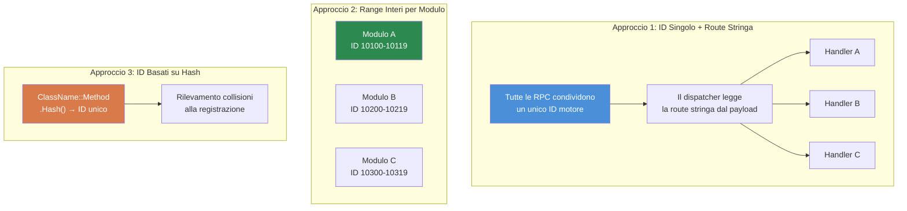

# Capitolo 7.3: Pattern di Comunicazione RPC

[Home](../../README.md) | [<< Precedente: Sistemi a Moduli](02-module-systems.md) | **Pattern di Comunicazione RPC** | [Successivo: Persistenza Configurazione >>](04-config-persistence.md)

---

## Introduzione

Le Remote Procedure Call (RPC) sono l'unico modo per inviare dati tra client e server in DayZ. Ogni pannello di amministrazione, ogni UI sincronizzata, ogni notifica server-to-client e ogni richiesta di azione client-to-server passa attraverso le RPC. Capire come costruirle correttamente --- con l'ordine di serializzazione appropriato, i controlli dei permessi e la gestione degli errori --- è essenziale per qualsiasi mod che faccia più che aggiungere oggetti a CfgVehicles.

Questo capitolo copre il pattern fondamentale `ScriptRPC`, il ciclo di vita del roundtrip client-server, la gestione degli errori, e poi confronta i tre principali approcci di routing RPC usati nella comunità di modding di DayZ.

---

## Indice

- [Fondamenti di ScriptRPC](#fondamenti-di-scriptrpc)
- [Roundtrip Client-Server-Client](#roundtrip-client-server-client)
- [Controllo Permessi Prima dell'Esecuzione](#controllo-permessi-prima-dellesecuzione)
- [Gestione Errori e Notifiche](#gestione-errori-e-notifiche)
- [Serializzazione: Il Contratto Read/Write](#serializzazione-il-contratto-readwrite)
- [Tre Approcci RPC a Confronto](#tre-approcci-rpc-a-confronto)
- [Errori Comuni](#errori-comuni)
- [Best Practice](#best-practice)

---

## Fondamenti di ScriptRPC

Ogni RPC in DayZ usa la classe `ScriptRPC`. Il pattern è sempre lo stesso: crea, scrivi i dati, invia.

### Lato di Invio

```c
void SendDamageReport(PlayerIdentity target, string weaponName, float damage)
{
    ScriptRPC rpc = new ScriptRPC();

    // Scrivi i campi in un ordine specifico
    rpc.Write(weaponName);    // campo 1: string
    rpc.Write(damage);        // campo 2: float

    // Invia attraverso il motore
    // Parametri: oggetto target, ID RPC, consegna garantita, destinatario
    rpc.Send(null, MY_RPC_ID, true, target);
}
```

### Lato di Ricezione

Il ricevitore legge i campi nello **stesso identico ordine** in cui sono stati scritti:

```c
void OnRPC_DamageReport(PlayerIdentity sender, Object target, ParamsReadContext ctx)
{
    string weaponName;
    if (!ctx.Read(weaponName)) return;  // campo 1: string

    float damage;
    if (!ctx.Read(damage)) return;      // campo 2: float

    // Usa i dati
    Print("Colpito da " + weaponName + " per " + damage.ToString() + " danni");
}
```

### Parametri di Send Spiegati

```c
rpc.Send(object, rpcId, guaranteed, identity);
```

| Parametro | Tipo | Descrizione |
|-----------|------|-------------|
| `object` | `Object` | L'entità target (es. un giocatore o veicolo). Usa `null` per RPC globali. |
| `rpcId` | `int` | Intero che identifica questo tipo di RPC. Deve corrispondere su entrambi i lati. |
| `guaranteed` | `bool` | `true` = affidabile (simile a TCP, ritrasmette in caso di perdita). `false` = inaffidabile (fire-and-forget). |
| `identity` | `PlayerIdentity` | Destinatario. `null` dal client = invia al server. `null` dal server = broadcast a tutti i client. Identity specifico = invia solo a quel client. |

### Quando Usare `guaranteed`

- **`true` (affidabile):** Modifiche alla configurazione, concessione di permessi, comandi di teletrasporto, azioni di ban --- tutto ciò in cui un pacchetto perso lascerebbe client e server desincronizzati.
- **`false` (inaffidabile):** Aggiornamenti rapidi di posizione, effetti visivi, stato dell'HUD che si aggiorna ogni pochi secondi comunque. Minor overhead, nessuna coda di ritrasmissione.

---

## Roundtrip Client-Server-Client

Il pattern RPC più comune è il roundtrip: il client richiede un'azione, il server valida ed esegue, il server reinvia il risultato.

```
CLIENT                          SERVER
  │                               │
  │  1. RPC Richiesta ──────────► │
  │     (azione + parametri)      │
  │                               │  2. Valida permesso
  │                               │  3. Esegui azione
  │                               │  4. Prepara risposta
  │  ◄────────── 5. RPC Risposta  │
  │     (risultato + dati)        │
  │                               │
  │  6. Aggiorna UI               │
```

### Esempio Completo: Richiesta di Teletrasporto

**Il client invia la richiesta:**

```c
class TeleportClient
{
    void RequestTeleport(vector position)
    {
        ScriptRPC rpc = new ScriptRPC();
        rpc.Write(position);
        rpc.Send(null, MY_RPC_TELEPORT, true, null);  // null identity = invia al server
    }
};
```

**Il server riceve, valida, esegue, risponde:**

```c
class TeleportServer
{
    void OnRPC_TeleportRequest(PlayerIdentity sender, Object target, ParamsReadContext ctx)
    {
        // 1. Leggi i dati della richiesta
        vector position;
        if (!ctx.Read(position)) return;

        // 2. Valida il permesso
        if (!MyPermissions.GetInstance().HasPermission(sender.GetPlainId(), "MyMod.Admin.Teleport"))
        {
            SendError(sender, "No permission to teleport");
            return;
        }

        // 3. Valida i dati
        if (position[1] < 0 || position[1] > 1000)
        {
            SendError(sender, "Invalid teleport height");
            return;
        }

        // 4. Esegui l'azione
        PlayerBase player = PlayerBase.Cast(sender.GetPlayer());
        if (!player) return;

        player.SetPosition(position);

        // 5. Invia risposta di successo
        ScriptRPC response = new ScriptRPC();
        response.Write(true);           // flag di successo
        response.Write(position);       // rimanda la posizione
        response.Send(null, MY_RPC_TELEPORT_RESULT, true, sender);
    }
};
```

**Il client riceve la risposta:**

```c
class TeleportClient
{
    void OnRPC_TeleportResult(PlayerIdentity sender, Object target, ParamsReadContext ctx)
    {
        bool success;
        if (!ctx.Read(success)) return;

        vector position;
        if (!ctx.Read(position)) return;

        if (success)
        {
            // Aggiorna UI: "Teletrasportato a X, Y, Z"
        }
    }
};
```

---

## Controllo Permessi Prima dell'Esecuzione

Ogni handler RPC lato server che esegue un'azione privilegiata **deve** controllare i permessi prima di eseguire. Non fidarti mai del client.

### Il Pattern

```c
void OnRPC_AdminAction(PlayerIdentity sender, Object target, ParamsReadContext ctx)
{
    // REGOLA 1: Valida sempre che il sender esista
    if (!sender) return;

    // REGOLA 2: Controlla il permesso prima di leggere i dati
    if (!MyPermissions.GetInstance().HasPermission(sender.GetPlainId(), "MyMod.Admin.Ban"))
    {
        MyLog.Warning("BanRPC", "Unauthorized ban attempt from " + sender.GetName());
        return;
    }

    // REGOLA 3: Solo ora leggi ed esegui
    string targetUid;
    if (!ctx.Read(targetUid)) return;

    // ... esegui il ban
}
```

### Perché Controllare Prima di Leggere?

Leggere dati da un client non autorizzato spreca cicli del server. Ancora più importante, dati malformati da un client malevolo potrebbero causare errori di parsing. Controllare prima il permesso è una protezione economica che rifiuta immediatamente i malintenzionati.

### Logga i Tentativi Non Autorizzati

Logga sempre i controlli di permesso falliti. Questo crea una traccia di audit e aiuta i proprietari dei server a rilevare tentativi di exploit:

```c
if (!HasPermission(sender, "MyMod.Spawn"))
{
    MyLog.Warning("SpawnRPC", "Denied spawn request from "
        + sender.GetName() + " (" + sender.GetPlainId() + ")");
    return;
}
```

---

## Gestione Errori e Notifiche

Le RPC possono fallire in vari modi: cadute di rete, dati malformati, fallimenti di validazione lato server. I mod robusti gestiscono tutti questi casi.

### Fallimenti di Lettura

Ogni `ctx.Read()` può fallire. Controlla sempre il valore di ritorno:

```c
// MALE: Ignorare i fallimenti di lettura
string name;
ctx.Read(name);     // Se fallisce, name è "" — corruzione silenziosa
int count;
ctx.Read(count);    // Questo legge i byte sbagliati — tutto dopo è spazzatura

// BENE: Return anticipato su qualsiasi fallimento di lettura
string name;
if (!ctx.Read(name)) return;
int count;
if (!ctx.Read(count)) return;
```

### Pattern di Risposta con Errore

Quando il server rifiuta una richiesta, invia un errore strutturato al client così la UI può visualizzarlo:

```c
// Server: invia errore
void SendError(PlayerIdentity target, string errorMsg)
{
    ScriptRPC rpc = new ScriptRPC();
    rpc.Write(false);        // success = false
    rpc.Write(errorMsg);     // motivo
    rpc.Send(null, MY_RPC_RESPONSE_ID, true, target);
}

// Client: gestisci errore
void OnRPC_Response(PlayerIdentity sender, Object target, ParamsReadContext ctx)
{
    bool success;
    if (!ctx.Read(success)) return;

    if (!success)
    {
        string errorMsg;
        if (!ctx.Read(errorMsg)) return;

        // Mostra errore nella UI
        MyLog.Warning("MyMod", "Server error: " + errorMsg);
        return;
    }

    // Gestisci il successo...
}
```

### Broadcast di Notifiche

Per eventi che tutti i client devono vedere (killfeed, annunci, cambiamenti meteo), il server fa broadcast con `identity = null`:

```c
// Server: broadcast a tutti i client
void BroadcastAnnouncement(string message)
{
    ScriptRPC rpc = new ScriptRPC();
    rpc.Write(message);
    rpc.Send(null, RPC_ANNOUNCEMENT, true, null);  // null = tutti i client
}
```

---

## Serializzazione: Il Contratto Read/Write

La regola più importante delle RPC di DayZ: **l'ordine di Read deve corrispondere esattamente all'ordine di Write, tipo per tipo.**

### Il Contratto

```c
// Il SENDER scrive:
rpc.Write("hello");      // 1. string
rpc.Write(42);           // 2. int
rpc.Write(3.14);         // 3. float
rpc.Write(true);         // 4. bool

// Il RECEIVER legge nello STESSO ordine:
string s;   ctx.Read(s);     // 1. string
int i;      ctx.Read(i);     // 2. int
float f;    ctx.Read(f);     // 3. float
bool b;     ctx.Read(b);     // 4. bool
```

### Cosa Va Storto con un Ordine Non Corrispondente

Se scambi l'ordine di lettura, il deserializzatore interpreta byte destinati a un tipo come un altro. Un `int` letto dove era stato scritto uno `string` produrrà spazzatura, e ogni lettura successiva sarà sfalsata --- corrompendo tutti i campi rimanenti. Il motore non lancia un'eccezione; restituisce silenziosamente dati errati o causa il ritorno di `false` da `Read()`.

### Tipi Supportati

| Tipo | Note |
|------|-------|
| `int` | 32 bit con segno |
| `float` | 32 bit IEEE 754 |
| `bool` | Singolo byte |
| `string` | UTF-8 con prefisso di lunghezza |
| `vector` | Tre float (x, y, z) |
| `Object` (come parametro target) | Riferimento entità, risolto dal motore |

### Serializzare le Collezioni

Non c'è serializzazione built-in per gli array. Scrivi prima il conteggio, poi ogni elemento:

```c
// SENDER
array<string> names = {"Alice", "Bob", "Charlie"};
rpc.Write(names.Count());
for (int i = 0; i < names.Count(); i++)
{
    rpc.Write(names[i]);
}

// RECEIVER
int count;
if (!ctx.Read(count)) return;

array<string> names = new array<string>();
for (int i = 0; i < count; i++)
{
    string name;
    if (!ctx.Read(name)) return;
    names.Insert(name);
}
```

### Serializzare Oggetti Complessi

Per dati complessi, serializza campo per campo. Non provare a passare oggetti direttamente attraverso `Write()`:

```c
// SENDER: appiattisci l'oggetto in primitivi
rpc.Write(player.GetName());
rpc.Write(player.GetHealth());
rpc.Write(player.GetPosition());

// RECEIVER: ricostruisci
string name;    ctx.Read(name);
float health;   ctx.Read(health);
vector pos;     ctx.Read(pos);
```

---

## Tre Approcci RPC a Confronto

La comunità di modding di DayZ usa tre approcci fondamentalmente diversi per il routing RPC. Ciascuno ha i suoi compromessi.

### Tre Approcci RPC a Confronto



### 1. RPC Nominali del CF

Il Community Framework fornisce `GetRPCManager()` che instrada le RPC tramite nomi stringa raggruppati per namespace del mod.

```c
// Registrazione (in OnInit):
GetRPCManager().AddRPC("MyMod", "RPC_SpawnItem", this, SingleplayerExecutionType.Server);

// Invio dal client:
GetRPCManager().SendRPC("MyMod", "RPC_SpawnItem", new Param1<string>("AK74"), true);

// L'handler riceve:
void RPC_SpawnItem(CallType type, ParamsReadContext ctx, PlayerIdentity sender, Object target)
{
    if (type != CallType.Server) return;

    Param1<string> data;
    if (!ctx.Read(data)) return;

    string className = data.param1;
    // ... genera l'oggetto
}
```

**Pro:**
- Il routing basato su stringhe è leggibile e privo di collisioni
- Il raggruppamento per namespace (`"MyMod"`) previene conflitti di nomi tra mod
- Ampiamente usato --- se ti integri con COT/Expansion, usi questo

**Contro:**
- Richiede CF come dipendenza
- Usa wrapper `Param` che sono verbosi per payload complessi
- Confronto di stringhe ad ogni distribuzione (overhead minore)

### 2. RPC con Range di Interi COT / Vanilla

Vanilla DayZ e alcune parti di COT usano ID RPC interi raw. Ogni mod reclama un range di interi e distribuisce in un override moddificato di `OnRPC`.

```c
// Definisci i tuoi ID RPC (scegli un range unico per evitare collisioni)
const int MY_RPC_SPAWN_ITEM     = 90001;
const int MY_RPC_DELETE_ITEM    = 90002;
const int MY_RPC_TELEPORT       = 90003;

// Invio:
ScriptRPC rpc = new ScriptRPC();
rpc.Write("AK74");
rpc.Send(null, MY_RPC_SPAWN_ITEM, true, null);

// Ricezione (in DayZGame moddificato o entità):
modded class DayZGame
{
    override void OnRPC(PlayerIdentity sender, Object target, int rpc_type, ParamsReadContext ctx)
    {
        switch (rpc_type)
        {
            case MY_RPC_SPAWN_ITEM:
                HandleSpawnItem(sender, ctx);
                return;
            case MY_RPC_DELETE_ITEM:
                HandleDeleteItem(sender, ctx);
                return;
        }

        super.OnRPC(sender, target, rpc_type, ctx);
    }
};
```

**Pro:**
- Nessuna dipendenza --- funziona con vanilla DayZ
- Il confronto intero è veloce
- Pieno controllo sulla pipeline RPC

**Contro:**
- **Rischio di collisione ID**: due mod che scelgono lo stesso range di interi intercetteranno silenziosamente le RPC l'uno dell'altro
- La logica di distribuzione manuale (switch/case) diventa scomoda con molte RPC
- Nessun isolamento namespace
- Nessun registro o scopribilità built-in

### 3. RPC Personalizzate con Route Stringa

Un sistema personalizzato con route stringa usa un singolo ID RPC del motore e multiplexa scrivendo un nome mod + nome funzione come header stringa in ogni RPC. Tutto il routing avviene dentro una classe manager statica (`MyRPC` in questo esempio).

```c
// Registrazione:
MyRPC.Register("MyMod", "RPC_SpawnItem", this, MyRPCSide.SERVER);

// Invio (solo header, nessun payload):
MyRPC.Send("MyMod", "RPC_SpawnItem", null, true, null);

// Invio (con payload):
ScriptRPC rpc = MyRPC.CreateRPC("MyMod", "RPC_SpawnItem");
rpc.Write("AK74");
rpc.Write(5);    // quantità
rpc.Send(null, MyRPC.FRAMEWORK_RPC_ID, true, null);

// Handler:
void RPC_SpawnItem(PlayerIdentity sender, Object target, ParamsReadContext ctx)
{
    string className;
    if (!ctx.Read(className)) return;

    int quantity;
    if (!ctx.Read(quantity)) return;

    // ... genera gli oggetti
}
```

**Pro:**
- Zero rischio di collisione --- namespace stringa + nome funzione è globalmente unico
- Zero dipendenze dal CF (ma opzionalmente si collega al `GetRPCManager()` del CF quando presente)
- Un singolo ID motore significa un footprint di hook minimo
- L'helper `CreateRPC()` pre-scrive l'header di routing così scrivi solo il payload
- Firma pulita dell'handler: `(PlayerIdentity, Object, ParamsReadContext)`

**Contro:**
- Due letture stringa extra per RPC (l'header di routing) --- overhead minimo nella pratica
- Sistema personalizzato significa che altri mod non possono scoprire le tue RPC tramite il registro del CF
- Distribuisce solo tramite reflection `CallFunctionParams`, che è leggermente più lento di una chiamata diretta a metodo

### Tabella Comparativa

| Caratteristica | CF Nominale | Range Interi | Route Stringa Personalizzata |
|---------|----------|---------------|---------------------|
| **Rischio collisione** | Nessuno (con namespace) | Alto | Nessuno (con namespace) |
| **Dipendenze** | Richiede CF | Nessuna | Nessuna |
| **Firma handler** | `(CallType, ctx, sender, target)` | Personalizzata | `(sender, target, ctx)` |
| **Scopribilità** | Registro CF | Nessuna | `MyRPC.s_Handlers` |
| **Overhead distribuzione** | Lookup stringa | Switch intero | Lookup stringa |
| **Stile payload** | Wrapper Param | Raw Write/Read | Raw Write/Read |
| **Bridge CF** | Nativo | Manuale | Automatico (`#ifdef`) |

### Quale Dovresti Usare?

- **Il tuo mod dipende già dal CF** (integrazione COT/Expansion): usa RPC Nominali del CF
- **Mod standalone, dipendenze minime**: usa range interi o costruisci un sistema con route stringa
- **Stai costruendo un framework**: considera un sistema con route stringa come il pattern `MyRPC` personalizzato sopra
- **Apprendimento / prototipazione**: il range di interi è il più semplice da capire

---

## Errori Comuni

### 1. Dimenticare di Registrare l'Handler

Invii una RPC ma non succede nulla dall'altra parte. L'handler non è mai stato registrato.

```c
// SBAGLIATO: Nessuna registrazione — il server non sa mai di questo handler
class MyModule
{
    void RPC_DoThing(PlayerIdentity sender, Object target, ParamsReadContext ctx) { ... }
};

// CORRETTO: Registra in OnInit
class MyModule
{
    void OnInit()
    {
        MyRPC.Register("MyMod", "RPC_DoThing", this, MyRPCSide.SERVER);
    }

    void RPC_DoThing(PlayerIdentity sender, Object target, ParamsReadContext ctx) { ... }
};
```

### 2. Ordine Read/Write Non Corrispondente

Il bug RPC più comune. Il sender scrive `(string, int, float)` ma il receiver legge `(string, float, int)`. Nessun messaggio d'errore --- solo dati spazzatura.

**Soluzione:** Scrivi un blocco commento che documenta l'ordine dei campi sia nel sito di invio che di ricezione:

```c
// Formato wire: [string weaponName] [int damage] [float distance]
```

### 3. Inviare Dati Solo-Client al Server

Il server non può leggere lo stato dei widget del client, lo stato degli input o le variabili locali. Se devi inviare una selezione UI al server, serializza il valore rilevante (una stringa, un indice, un ID) --- non l'oggetto widget stesso.

### 4. Fare Broadcast Quando Intendevi Unicast

```c
// SBAGLIATO: Invia a TUTTI i client quando volevi inviare a uno solo
rpc.Send(null, MY_RPC_ID, true, null);

// CORRETTO: Invia al client specifico
rpc.Send(null, MY_RPC_ID, true, targetIdentity);
```

### 5. Non Gestire Handler Obsoleti Tra i Riavvii di Missione

Se un modulo registra un handler RPC e poi viene distrutto alla fine della missione, l'handler punta ancora all'oggetto morto. La prossima distribuzione RPC causerà un crash.

**Soluzione:** Deregistra sempre o pulisci gli handler alla fine della missione:

```c
override void OnMissionFinish()
{
    MyRPC.Unregister("MyMod", "RPC_DoThing");
}
```

Oppure usa un `Cleanup()` centralizzato che svuota l'intera mappa degli handler (come fa `MyRPC.Cleanup()`).

---

## Best Practice

1. **Controlla sempre i valori di ritorno di `ctx.Read()`.** Ogni lettura può fallire. Ritorna immediatamente in caso di fallimento.

2. **Valida sempre il sender sul server.** Controlla che `sender` non sia null e abbia il permesso richiesto prima di fare qualsiasi cosa.

3. **Documenta il formato wire.** Sia nel sito di invio che di ricezione, scrivi un commento che elenchi i campi in ordine con i loro tipi.

4. **Usa la consegna affidabile per i cambiamenti di stato.** La consegna inaffidabile è appropriata solo per aggiornamenti rapidi ed effimeri (posizione, effetti).

5. **Mantieni i payload piccoli.** DayZ ha un limite pratico di dimensione per RPC. Per dati grandi (sync di configurazione, liste giocatori), dividi in RPC multiple o usa la paginazione.

6. **Registra gli handler presto.** `OnInit()` è il posto più sicuro. I client possono connettersi prima che `OnMissionStart()` completi.

7. **Pulisci gli handler allo shutdown.** Deregistra individualmente o svuota l'intero registro in `OnMissionFinish()`.

8. **Usa `CreateRPC()` per i payload, `Send()` per i segnali.** Se non hai dati da inviare (solo un segnale "fallo"), usa il `Send()` solo-header. Se hai dati, usa `CreateRPC()` + write manuali + `rpc.Send()` manuale.

---

## Compatibilità e Impatto

- **Multi-Mod:** Le RPC con range di interi sono soggette a collisioni --- due mod che scelgono lo stesso ID intercettano silenziosamente i messaggi dell'altro. Le RPC con route stringa o nominali CF evitano questo usando namespace + nome funzione come chiave.
- **Ordine di Caricamento:** L'ordine di registrazione degli handler RPC conta solo quando più mod fanno `modded class DayZGame` e sovrascrivono `OnRPC`. Ciascuno deve chiamare `super.OnRPC()` per gli ID non gestiti, o i mod successivi non riceveranno mai le loro RPC. I sistemi con route stringa evitano questo usando un singolo ID motore.
- **Listen Server:** Sui listen server, sia client che server girano nello stesso processo. Una RPC inviata con `identity = null` dal lato server sarà ricevuta anche localmente. Proteggi gli handler con `if (type != CallType.Server) return;` o controlla `GetGame().IsServer()` / `GetGame().IsClient()` come appropriato.
- **Prestazioni:** L'overhead di distribuzione RPC è minimo (lookup stringa o switch intero). Il collo di bottiglia è la dimensione del payload --- DayZ ha un limite pratico per RPC (~64 KB). Per dati grandi (sync di configurazione), impagina su RPC multiple.
- **Migrazione:** Gli ID RPC sono un dettaglio interno del mod e non sono influenzati dagli aggiornamenti di versione di DayZ. Se cambi il formato wire della tua RPC (aggiungi/rimuovi campi), i vecchi client che parlano con un nuovo server si desincronizzeranno silenziosamente. Versiona i tuoi payload RPC o forza gli aggiornamenti client.

---

## Teoria vs Pratica

| Il Libro Dice | Realtà DayZ |
|---------------|-------------|
| Usa protocol buffer o serializzazione basata su schema | Enforce Script non ha supporto protobuf; fai `Write`/`Read` manuali di primitivi in ordine corrispondente |
| Valida tutti gli input con enforcement dello schema | Non esiste validazione di schema; ogni valore di ritorno di `ctx.Read()` deve essere controllato individualmente |
| Le RPC dovrebbero essere idempotenti | Pratico in DayZ solo per RPC di query; le RPC di mutazione (spawn, delete, teleport) sono intrinsecamente non-idempotenti --- proteggile con controlli di permesso |

---

[Home](../../README.md) | [<< Precedente: Sistemi a Moduli](02-module-systems.md) | **Pattern di Comunicazione RPC** | [Successivo: Persistenza Configurazione >>](04-config-persistence.md)
