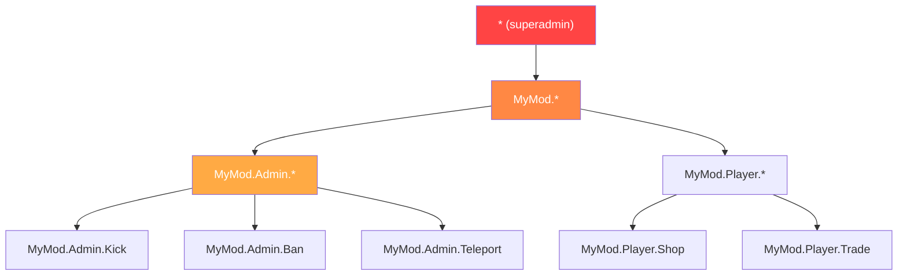

# Capitolo 7.5: Sistemi di Permessi

[Home](../../README.md) | [<< Precedente: Persistenza Configurazione](04-config-persistence.md) | **Sistemi di Permessi** | [Successivo: Architettura Event-Driven >>](06-events.md)

---

## Introduzione

Ogni strumento di amministrazione, ogni azione privilegiata e ogni funzionalità di moderazione in DayZ ha bisogno di un sistema di permessi. La domanda non è se controllare i permessi, ma come strutturarli. La comunità di modding di DayZ si è stabilizzata su tre pattern principali: permessi gerarchici separati da punti, assegnazione ruoli con gruppi utente (VPP), e accesso basato su ruoli a livello di framework (CF/COT). Ciascuno ha compromessi diversi in granularità, complessità ed esperienza per il proprietario del server.

Questo capitolo copre tutti e tre i pattern, il flusso di controllo dei permessi, i formati di archiviazione e la gestione wildcard/superadmin.

---

## Indice

- [Perché i Permessi Contano](#perché-i-permessi-contano)
- [Gerarchico Separato da Punti (Pattern MyMod)](#gerarchico-separato-da-punti-pattern-mymod)
- [Pattern UserGroup di VPP](#pattern-usergroup-di-vpp)
- [Pattern Basato su Ruoli del CF (COT)](#pattern-basato-su-ruoli-del-cf-cot)
- [Flusso di Controllo dei Permessi](#flusso-di-controllo-dei-permessi)
- [Formati di Archiviazione](#formati-di-archiviazione)
- [Pattern Wildcard e Superadmin](#pattern-wildcard-e-superadmin)
- [Migrazione Tra Sistemi](#migrazione-tra-sistemi)
- [Best Practice](#best-practice)

---

## Perché i Permessi Contano

Senza un sistema di permessi, hai due opzioni: o ogni giocatore può fare tutto (caos), o hardcodi gli ID Steam64 nei tuoi script (non manutenibile). Un sistema di permessi permette ai proprietari dei server di definire chi può fare cosa, senza modificare il codice.

Le tre regole di sicurezza:

1. **Non fidarti mai del client.** Il client invia una richiesta; il server decide se onorarla.
2. **Nega per default.** Se a un giocatore non è stato esplicitamente concesso un permesso, non ce l'ha.
3. **Fallisci in chiusura.** Se il controllo dei permessi stesso fallisce (identity null, dati corrotti), nega l'azione.

---

## Gerarchico Separato da Punti (Pattern MyMod)

MyMod usa stringhe di permesso separate da punti organizzate in una gerarchia ad albero. Ogni permesso è un percorso come `"MyMod.Admin.Teleport"` o `"MyMod.Missions.Start"`. I wildcard permettono di concedere interi sotto-alberi.

### Formato dei Permessi

```
MyMod                           (namespace radice)
├── Admin                        (strumenti admin)
│   ├── Panel                    (apri pannello admin)
│   ├── Teleport                 (teletrasporta sé/altri)
│   ├── Kick                     (espelli giocatori)
│   ├── Ban                      (banna giocatori)
│   └── Weather                  (cambia meteo)
├── Missions                     (sistema missioni)
│   ├── Start                    (avvia missioni manualmente)
│   └── Stop                     (ferma missioni)
└── AI                           (sistema IA)
    ├── Spawn                    (genera IA manualmente)
    └── Config                   (modifica config IA)
```

### Modello Dati

Ogni giocatore (identificato dall'ID Steam64) ha un array di stringhe di permesso concesse:

```c
class MyPermissionsData
{
    // chiave: ID Steam64, valore: array di stringhe di permesso
    ref map<string, ref TStringArray> Admins;

    void MyPermissionsData()
    {
        Admins = new map<string, ref TStringArray>();
    }
};
```

### Controllo dei Permessi

Il controllo scorre i permessi concessi al giocatore e supporta tre tipi di corrispondenza: corrispondenza esatta, wildcard completo (`"*"`), e wildcard prefisso (`"MyMod.Admin.*"`):

```c
bool HasPermission(string plainId, string permission)
{
    if (plainId == "" || permission == "")
        return false;

    TStringArray perms;
    if (!m_Permissions.Find(plainId, perms))
        return false;

    for (int i = 0; i < perms.Count(); i++)
    {
        string granted = perms[i];

        // Wildcard completo: superadmin
        if (granted == "*")
            return true;

        // Corrispondenza esatta
        if (granted == permission)
            return true;

        // Wildcard prefisso: "MyMod.Admin.*" corrisponde a "MyMod.Admin.Teleport"
        if (granted.IndexOf("*") > 0)
        {
            string prefix = granted.Substring(0, granted.Length() - 1);
            if (permission.IndexOf(prefix) == 0)
                return true;
        }
    }

    return false;
}
```

### Archiviazione JSON

```json
{
    "Admins": {
        "76561198000000001": ["*"],
        "76561198000000002": ["MyMod.Admin.Panel", "MyMod.Admin.Teleport"],
        "76561198000000003": ["MyMod.Missions.*"],
        "76561198000000004": ["MyMod.Admin.Kick", "MyMod.Admin.Ban"]
    }
}
```

### Punti di Forza

- **Granulare:** puoi concedere esattamente i permessi di cui ogni admin ha bisogno
- **Gerarchico:** i wildcard concedono interi sotto-alberi senza elencare ogni permesso
- **Auto-documentante:** la stringa di permesso ti dice cosa controlla
- **Estensibile:** nuovi permessi sono semplicemente nuove stringhe --- nessun cambiamento di schema

### Debolezze

- **Nessun ruolo nominato:** se 10 admin hanno bisogno dello stesso set, lo elenchi 10 volte
- **Basato su stringhe:** errori di battitura nelle stringhe di permesso falliscono silenziosamente (semplicemente non corrispondono)

---

## Pattern UserGroup di VPP

VPP Admin Tools usa un sistema basato su gruppi. Si definiscono gruppi nominati (ruoli) con set di permessi, poi si assegnano giocatori ai gruppi.

### Concetto

```
Gruppi:
  "SuperAdmin"  → [tutti i permessi]
  "Moderator"   → [kick, ban, mute, teleport]
  "Builder"     → [spawn oggetti, teleport, ESP]

Giocatori:
  "76561198000000001" → "SuperAdmin"
  "76561198000000002" → "Moderator"
  "76561198000000003" → "Builder"
```

### Pattern di Implementazione

```c
class VPPUserGroup
{
    string GroupName;
    ref array<string> Permissions;
    ref array<string> Members;  // ID Steam64

    bool HasPermission(string permission)
    {
        if (!Permissions) return false;

        for (int i = 0; i < Permissions.Count(); i++)
        {
            if (Permissions[i] == permission)
                return true;
            if (Permissions[i] == "*")
                return true;
        }
        return false;
    }
};

class VPPPermissionManager
{
    ref array<ref VPPUserGroup> m_Groups;

    bool PlayerHasPermission(string plainId, string permission)
    {
        for (int i = 0; i < m_Groups.Count(); i++)
        {
            VPPUserGroup group = m_Groups[i];

            // Controlla se il giocatore è in questo gruppo
            if (group.Members.Find(plainId) == -1)
                continue;

            if (group.HasPermission(permission))
                return true;
        }
        return false;
    }
};
```

### Archiviazione JSON

```json
{
    "Groups": [
        {
            "GroupName": "SuperAdmin",
            "Permissions": ["*"],
            "Members": ["76561198000000001"]
        },
        {
            "GroupName": "Moderator",
            "Permissions": [
                "admin.kick",
                "admin.ban",
                "admin.mute",
                "admin.teleport"
            ],
            "Members": [
                "76561198000000002",
                "76561198000000003"
            ]
        },
        {
            "GroupName": "Builder",
            "Permissions": [
                "admin.spawn",
                "admin.teleport",
                "admin.esp"
            ],
            "Members": [
                "76561198000000004"
            ]
        }
    ]
}
```

### Punti di Forza

- **Basato su ruoli:** definisci un ruolo una volta, assegnalo a molti giocatori
- **Familiare:** i proprietari dei server capiscono i sistemi gruppo/ruolo da altri giochi
- **Modifiche di massa facili:** cambia i permessi di un gruppo e tutti i membri vengono aggiornati

### Debolezze

- **Meno granulare senza lavoro extra:** dare a un admin specifico un permesso extra significa creare un nuovo gruppo o aggiungere override per-giocatore
- **L'ereditarietà dei gruppi è complessa:** VPP non supporta nativamente la gerarchia dei gruppi (es. "Admin" eredita tutti i permessi di "Moderator")

---

## Pattern Basato su Ruoli del CF (COT)

Community Framework / COT usa un sistema di ruoli e permessi dove i ruoli sono definiti con set di permessi espliciti, e i giocatori vengono assegnati ai ruoli.

### Concetto

Il sistema di permessi del CF è simile ai gruppi di VPP ma integrato nel layer del framework, rendendolo disponibile a tutti i mod basati su CF:

```c
// Pattern COT (semplificato)
// I ruoli sono definiti in AuthFile.json
// Ogni ruolo ha un nome e un array di permessi
// I giocatori sono assegnati ai ruoli tramite ID Steam64

class CF_Permission
{
    string m_Name;
    ref array<ref CF_Permission> m_Children;
    int m_State;  // ALLOW, DENY, INHERIT
};
```

### Albero dei Permessi

CF rappresenta i permessi come una struttura ad albero, dove ogni nodo può essere esplicitamente consentito, negato o ereditato dal padre:

```
Root
├── Admin [ALLOW]
│   ├── Kick [INHERIT → ALLOW]
│   ├── Ban [INHERIT → ALLOW]
│   └── Teleport [DENY]        ← Esplicitamente negato anche se Admin è ALLOW
└── ESP [ALLOW]
```

Questo sistema a tre stati (allow/deny/inherit) è più espressivo dei sistemi binari (concesso/non-concesso) usati da MyMod e VPP. Permette di concedere una categoria ampia e poi ritagliare eccezioni.

### Archiviazione JSON

```json
{
    "Roles": {
        "Moderator": {
            "admin": {
                "kick": 2,
                "ban": 2,
                "teleport": 1
            }
        }
    },
    "Players": {
        "76561198000000001": {
            "Role": "SuperAdmin"
        }
    }
}
```

(Dove `2 = ALLOW`, `1 = DENY`, `0 = INHERIT`)

### Punti di Forza

- **Permessi a tre stati:** allow, deny, inherit offre la massima flessibilità
- **Struttura ad albero:** rispecchia la natura gerarchica dei percorsi di permesso
- **A livello di framework:** tutti i mod CF condividono lo stesso sistema di permessi

### Debolezze

- **Complessità:** tre stati sono più difficili da capire per i proprietari dei server rispetto al semplice "concesso"
- **Dipendenza dal CF:** funziona solo con il Community Framework

---

## Flusso di Controllo dei Permessi

Indipendentemente dal sistema usato, il controllo dei permessi lato server segue lo stesso pattern:

```
Il client invia una richiesta RPC
        │
        ▼
L'handler RPC del server la riceve
        │
        ▼
    ┌─────────────────────────────────┐
    │ L'identity del sender è non-null? │
    │ (Validazione a livello di rete)  │
    └───────────┬─────────────────────┘
                │ No → return (scarta silenziosamente)
                │ Sì ▼
    ┌─────────────────────────────────┐
    │ Il sender ha il permesso         │
    │ richiesto per questa azione?     │
    └───────────┬─────────────────────┘
                │ No → logga warning, opzionalmente invia errore al client, return
                │ Sì ▼
    ┌─────────────────────────────────┐
    │ Valida i dati della richiesta    │
    │ (leggi parametri, controlla limiti) │
    └───────────┬─────────────────────┘
                │ Non valido → invia errore al client, return
                │ Valido ▼
    ┌─────────────────────────────────┐
    │ Esegui l'azione privilegiata     │
    │ Logga l'azione con l'ID admin    │
    │ Invia risposta di successo       │
    └─────────────────────────────────┘
```

### Implementazione

```c
void OnRPC_KickPlayer(PlayerIdentity sender, Object target, ParamsReadContext ctx)
{
    // Passo 1: Valida il sender
    if (!sender) return;

    // Passo 2: Controlla il permesso
    if (!MyPermissions.GetInstance().HasPermission(sender.GetPlainId(), "MyMod.Admin.Kick"))
    {
        MyLog.Warning("Admin", "Unauthorized kick attempt: " + sender.GetName());
        return;
    }

    // Passo 3: Leggi e valida i dati
    string targetUid;
    if (!ctx.Read(targetUid)) return;

    if (targetUid == sender.GetPlainId())
    {
        // Non puoi espellere te stesso
        SendError(sender, "Cannot kick yourself");
        return;
    }

    // Passo 4: Esegui
    PlayerIdentity targetIdentity = FindPlayerByUid(targetUid);
    if (!targetIdentity)
    {
        SendError(sender, "Player not found");
        return;
    }

    GetGame().DisconnectPlayer(targetIdentity);

    // Passo 5: Logga e rispondi
    MyLog.Info("Admin", sender.GetName() + " kicked " + targetIdentity.GetName());
    SendSuccess(sender, "Player kicked");
}
```

---

## Formati di Archiviazione

Tutti e tre i sistemi archiviano i permessi in JSON. Le differenze sono strutturali:

### Flat Per-Giocatore

```json
{
    "Admins": {
        "STEAM64_ID": ["perm.a", "perm.b", "perm.c"]
    }
}
```

**File:** Un file per tutti i giocatori.
**Pro:** Semplice, facile da modificare a mano.
**Contro:** Ridondante se molti giocatori condividono gli stessi permessi.

### File Per-Giocatore (Expansion / Dati Giocatore)

```json
// File: $profile:MyMod/Players/76561198xxxxx.json
{
    "UID": "76561198xxxxx",
    "Permissions": ["perm.a", "perm.b"],
    "LastLogin": "2025-01-15 14:30:00"
}
```

**Pro:** Ogni giocatore è indipendente; nessun problema di locking.
**Contro:** Molti file piccoli; cercare "chi ha il permesso X?" richiede la scansione di tutti i file.

### Basato su Gruppi (VPP)

```json
{
    "Groups": [
        {
            "GroupName": "NomeRuolo",
            "Permissions": ["perm.a", "perm.b"],
            "Members": ["STEAM64_ID_1", "STEAM64_ID_2"]
        }
    ]
}
```

**Pro:** Le modifiche ai ruoli si propagano a tutti i membri istantaneamente.
**Contro:** Un giocatore non può facilmente avere override di permessi per-giocatore senza un gruppo dedicato.

### Scegliere un Formato

| Fattore | Flat Per-Giocatore | File Per-Giocatore | Basato su Gruppi |
|--------|----------------|-----------------|-------------|
| **Server piccolo (1-5 admin)** | Migliore | Eccessivo | Eccessivo |
| **Server medio (5-20 admin)** | Buono | Buono | Migliore |
| **Community grande (20+ ruoli)** | Ridondante | I file si moltiplicano | Migliore |
| **Personalizzazione per-giocatore** | Nativa | Nativa | Richiede workaround |
| **Modifica manuale** | Facile | Facile per giocatore | Moderata |

---

## Pattern Wildcard e Superadmin



### Wildcard Completo: `"*"`

Concede tutti i permessi. Questo è il pattern superadmin. Un giocatore con `"*"` può fare qualsiasi cosa.

```c
if (granted == "*")
    return true;
```

**Convenzione:** Ogni sistema di permessi nella comunità di modding di DayZ usa `"*"` per il superadmin. Non inventare una convenzione diversa.

### Wildcard Prefisso: `"MyMod.Admin.*"`

Concede tutti i permessi che iniziano con `"MyMod.Admin."`. Questo permette di concedere un intero sottosistema senza elencare ogni permesso:

```c
// "MyMod.Admin.*" corrisponde a:
//   "MyMod.Admin.Teleport"  ✓
//   "MyMod.Admin.Kick"      ✓
//   "MyMod.Admin.Ban"       ✓
//   "MyMod.Missions.Start"  ✗ (sotto-albero diverso)
```

### Implementazione

```c
if (granted.IndexOf("*") > 0)
{
    // "MyMod.Admin.*" → prefix = "MyMod.Admin."
    string prefix = granted.Substring(0, granted.Length() - 1);
    if (permission.IndexOf(prefix) == 0)
        return true;
}
```

### Nessun Permesso Negativo (Separato da Punti / VPP)

Sia il sistema separato da punti che quello VPP usano permessi solo additivi. Puoi concedere permessi ma non negarli esplicitamente. Se un permesso non è nella lista del giocatore, è negato.

CF/COT è l'eccezione con il suo sistema a tre stati (ALLOW/DENY/INHERIT), che supporta le negazioni esplicite.

### Scappatoia Superadmin

Fornisci un modo per controllare se qualcuno è superadmin senza controllare un permesso specifico. Questo è utile per la logica di bypass:

```c
bool IsSuperAdmin(string plainId)
{
    return HasPermission(plainId, "*");
}
```

---

## Migrazione Tra Sistemi

Se il tuo mod deve supportare server che migrano da un sistema di permessi a un altro (es. da una lista flat di UID admin a permessi gerarchici), implementa la migrazione automatica al caricamento:

```c
void Load()
{
    if (!FileExist(PERMISSIONS_FILE))
    {
        CreateDefaultFile();
        return;
    }

    // Prova prima il nuovo formato
    if (LoadNewFormat())
        return;

    // Fallback al formato legacy e migra
    LoadLegacyAndMigrate();
}

void LoadLegacyAndMigrate()
{
    // Leggi il vecchio formato: { "AdminUIDs": ["uid1", "uid2"] }
    LegacyPermissionData legacyData = new LegacyPermissionData();
    JsonFileLoader<LegacyPermissionData>.JsonLoadFile(PERMISSIONS_FILE, legacyData);

    // Migra: ogni admin legacy diventa un superadmin nel nuovo sistema
    for (int i = 0; i < legacyData.AdminUIDs.Count(); i++)
    {
        string uid = legacyData.AdminUIDs[i];
        GrantPermission(uid, "*");
    }

    // Salva nel nuovo formato
    Save();
    MyLog.Info("Permissions", "Migrated " + legacyData.AdminUIDs.Count().ToString()
        + " admin(s) from legacy format");
}
```

Questo è un pattern comune usato per migrare dall'array flat `AdminUIDs` originale alla mappa gerarchica `Admins`.

---

## Best Practice

1. **Nega per default.** Se un permesso non è esplicitamente concesso, la risposta è "no".

2. **Controlla sul server, mai sul client.** I controlli di permesso lato client sono solo per comodità UI (nascondere pulsanti). Il server deve sempre ri-verificare.

3. **Usa `"*"` per il superadmin.** È la convenzione universale. Non inventare `"all"`, `"admin"`, o `"root"`.

4. **Logga ogni azione privilegiata negata.** Questa è la tua traccia di audit di sicurezza.

5. **Fornisci un file di permessi predefinito con un segnaposto.** I nuovi proprietari di server dovrebbero vedere un esempio chiaro:

```json
{
    "Admins": {
        "PUT_STEAM64_ID_HERE": ["*"]
    }
}
```

6. **Usa namespace per i tuoi permessi.** Usa `"TuoMod.Categoria.Azione"` per evitare collisioni con altri mod.

7. **Supporta i wildcard prefisso.** I proprietari dei server dovrebbero poter concedere `"TuoMod.Admin.*"` invece di elencare ogni singolo permesso admin individualmente.

8. **Mantieni il file dei permessi modificabile dall'uomo.** I proprietari dei server lo modificheranno a mano. Usa nomi di chiave chiari, un permesso per riga nel JSON, e documenta i permessi disponibili da qualche parte nella documentazione del tuo mod.

9. **Implementa la migrazione dal primo giorno.** Quando il formato dei permessi cambia (e cambierà), la migrazione automatica previene i ticket di supporto.

10. **Sincronizza i permessi al client alla connessione.** Il client ha bisogno di conoscere i propri permessi per scopi UI (mostrare/nascondere pulsanti admin). Invia un riepilogo alla connessione; non inviare l'intero file dei permessi del server.

---

## Compatibilità e Impatto

- **Multi-Mod:** Ogni mod può definire il proprio namespace di permessi (`"ModA.Admin.Kick"`, `"ModB.Build.Spawn"`). Il wildcard `"*"` concede superadmin su *tutti* i mod che condividono lo stesso archivio di permessi. Se i mod usano file di permessi indipendenti, `"*"` si applica solo all'ambito di quel mod.
- **Ordine di Caricamento:** I file di permessi vengono caricati una volta durante l'avvio del server. Nessun problema di ordinamento cross-mod fintanto che ogni mod legge il proprio file. Se un framework condiviso (CF/COT) gestisce i permessi, tutti i mod che usano quel framework condividono lo stesso albero dei permessi.
- **Listen Server:** I controlli dei permessi dovrebbero sempre essere eseguiti lato server. Sui listen server, il codice lato client può chiamare `HasPermission()` per il gating UI (mostrare/nascondere pulsanti admin), ma il controllo lato server è quello autoritativo.
- **Prestazioni:** I controlli di permesso sono una scansione lineare di un array di stringhe per giocatore. Con conteggi admin tipici (1--20 admin, 5--30 permessi ciascuno), questo è trascurabile. Per set di permessi estremamente grandi, considera un `set<string>` invece di un array per lookup O(1).
- **Migrazione:** Aggiungere nuove stringhe di permesso non è distruttivo --- gli admin esistenti semplicemente non hanno il nuovo permesso finché non viene concesso. Rinominare i permessi rompe le concessioni esistenti silenziosamente. Usa il versioning della configurazione per migrare automaticamente le stringhe di permesso rinominate.

---

## Errori Comuni

| Errore | Impatto | Soluzione |
|---------|--------|-----|
| Fidarsi dei dati di permesso inviati dal client | I client exploit inviano "Sono admin" e il server ci crede; compromissione completa del server | Non leggere mai i permessi da un payload RPC; cerca sempre `sender.GetPlainId()` nell'archivio di permessi lato server |
| Manca il deny di default | Un controllo di permesso mancante concede accesso a tutti; escalation accidentale di privilegi | Ogni handler RPC per un'azione privilegiata deve controllare `HasPermission()` e fare return anticipato in caso di fallimento |
| Errore di battitura nella stringa di permesso fallisce silenziosamente | `"MyMod.Amin.Kick"` (errore di battitura) non corrisponde mai --- l'admin non può espellere, nessun errore viene loggato | Definisci le stringhe di permesso come variabili `static const`; fai riferimento alla costante, mai a una stringa letterale raw |
| Inviare il file di permessi completo al client | Espone tutti gli ID Steam64 degli admin e i loro set di permessi a qualsiasi client connesso | Invia solo la lista dei permessi del giocatore richiedente, mai il file completo del server |
| Nessun supporto wildcard in HasPermission | I proprietari dei server devono elencare ogni singolo permesso per admin; noioso e soggetto a errori | Implementa wildcard prefisso (`"MyMod.Admin.*"`) e wildcard completo (`"*"`) dal primo giorno |

---

## Teoria vs Pratica

| Il Libro Dice | Realtà DayZ |
|---------------|-------------|
| Usa RBAC (controllo accesso basato su ruoli) con ereditarietà dei gruppi | Solo CF/COT supporta permessi a tre stati; la maggior parte dei mod usa concessioni flat per-giocatore per semplicità |
| I permessi dovrebbero essere archiviati in un database | Nessun accesso database; i file JSON in `$profile:` sono l'unica opzione |
| Usa token crittografici per l'autorizzazione | Nessuna libreria crittografica in Enforce Script; la fiducia si basa su `PlayerIdentity.GetPlainId()` (ID Steam64) verificato dal motore |

---

[Home](../../README.md) | [<< Precedente: Persistenza Configurazione](04-config-persistence.md) | **Sistemi di Permessi** | [Successivo: Architettura Event-Driven >>](06-events.md)
