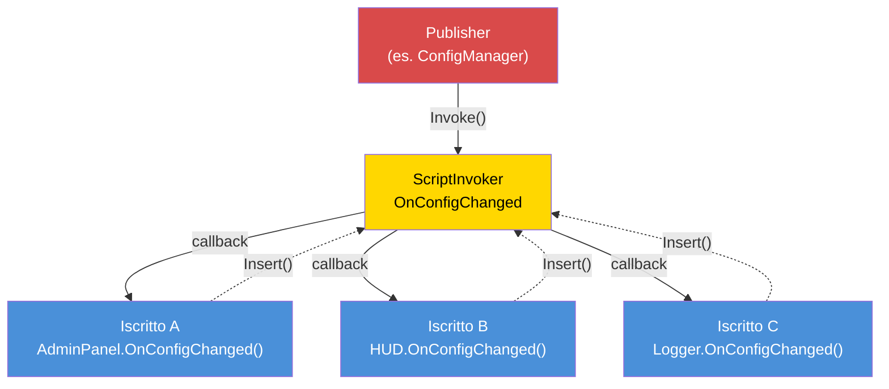

# Capitolo 7.6: Architettura Event-Driven

[Home](../../README.md) | [<< Precedente: Sistemi di Permessi](05-permissions.md) | **Architettura Event-Driven** | [Successivo: Ottimizzazione delle Prestazioni >>](07-performance.md)

---

## Introduzione

L'architettura event-driven disaccoppia il produttore di un evento dai suoi consumatori. Quando un giocatore si connette, il gestore della connessione non ha bisogno di conoscere il killfeed, il pannello admin, il sistema missioni o il modulo di logging --- lancia un evento "player connected", e ogni sistema interessato si iscrive in modo indipendente. Questa è la base del design estensibile dei mod: le nuove funzionalità si iscrivono agli eventi esistenti senza modificare il codice che li genera.

DayZ fornisce `ScriptInvoker` come primitiva di eventi integrata. Sopra di esso, i mod professionali costruiscono event bus con topic nominati, handler tipizzati e gestione del ciclo di vita. Questo capitolo copre tutti e tre i pattern principali e la disciplina critica della prevenzione dei memory leak.

---

## Indice dei Contenuti

- [Pattern ScriptInvoker](#pattern-scriptinvoker)
- [Pattern EventBus (Topic con Routing a Stringa)](#pattern-eventbus-topic-con-routing-a-stringa)
- [Pattern CF_EventHandler](#pattern-cf_eventhandler)
- [Quando Usare Eventi vs Chiamate Dirette](#quando-usare-eventi-vs-chiamate-dirette)
- [Prevenzione dei Memory Leak](#prevenzione-dei-memory-leak)
- [Avanzato: Dati Evento Personalizzati](#avanzato-dati-evento-personalizzati)
- [Buone Pratiche](#buone-pratiche)

---

## Pattern ScriptInvoker

`ScriptInvoker` è la primitiva pub/sub integrata nel motore. Mantiene una lista di callback di funzioni e le invoca tutte quando un evento viene lanciato. Questo è il meccanismo di eventi al livello più basso in DayZ.

### Creare un Evento

```c
class WeatherManager
{
    // L'evento. Chiunque può iscriversi per essere notificato quando il meteo cambia.
    ref ScriptInvoker OnWeatherChanged = new ScriptInvoker();

    protected string m_CurrentWeather;

    void SetWeather(string newWeather)
    {
        m_CurrentWeather = newWeather;

        // Lancia l'evento — tutti gli iscritti vengono notificati
        OnWeatherChanged.Invoke(newWeather);
    }
};
```

### Iscriversi a un Evento

```c
class WeatherUI
{
    void Init(WeatherManager mgr)
    {
        // Iscrizione: quando il meteo cambia, chiama il nostro handler
        mgr.OnWeatherChanged.Insert(OnWeatherChanged);
    }

    void OnWeatherChanged(string newWeather)
    {
        // Aggiorna la UI
        m_WeatherLabel.SetText("Weather: " + newWeather);
    }

    void Cleanup(WeatherManager mgr)
    {
        // CRITICO: Disiscriversi quando si ha finito
        mgr.OnWeatherChanged.Remove(OnWeatherChanged);
    }
};
```

### API di ScriptInvoker

| Metodo | Descrizione |
|--------|-------------|
| `Insert(func)` | Aggiunge un callback alla lista degli iscritti |
| `Remove(func)` | Rimuove un callback specifico |
| `Invoke(...)` | Chiama tutti i callback iscritti con gli argomenti forniti |
| `Clear()` | Rimuove tutti gli iscritti |

### Pattern Event-Driven



### Come Funzionano Insert/Remove

`Insert` aggiunge un riferimento a funzione in una lista interna. `Remove` cerca nella lista e rimuove la voce corrispondente. Se chiami `Insert` due volte con la stessa funzione, verrà chiamata due volte ad ogni `Invoke`. Se chiami `Remove` una volta, rimuove una sola voce.

```c
// Iscrivere lo stesso handler due volte è un bug:
mgr.OnWeatherChanged.Insert(OnWeatherChanged);
mgr.OnWeatherChanged.Insert(OnWeatherChanged);  // Ora chiamato 2 volte per Invoke

// Un Remove rimuove solo una voce:
mgr.OnWeatherChanged.Remove(OnWeatherChanged);
// Ancora chiamato 1 volta per Invoke — il secondo Insert è ancora presente
```

### Signature Tipizzate

`ScriptInvoker` non impone i tipi dei parametri in fase di compilazione. La convenzione è documentare la signature attesa in un commento:

```c
// Signature: void(string weatherName, float temperature)
ref ScriptInvoker OnWeatherChanged = new ScriptInvoker();
```

Se un iscritto ha la signature sbagliata, il comportamento è indefinito a runtime --- potrebbe crashare, ricevere valori spazzatura, o non fare nulla silenziosamente. Fai sempre corrispondere esattamente la signature documentata.

### ScriptInvoker nelle Classi Vanilla

Molte classi vanilla di DayZ espongono eventi `ScriptInvoker`:

```c
// UIScriptedMenu ha OnVisibilityChanged
class UIScriptedMenu
{
    ref ScriptInvoker m_OnVisibilityChanged;
};

// MissionBase ha hook per eventi
class MissionBase
{
    void OnUpdate(float timeslice);
    void OnEvent(EventType eventTypeId, Param params);
};
```

Puoi iscriverti a questi eventi vanilla dalle classi moddate per reagire ai cambiamenti di stato a livello del motore.

---

## Pattern EventBus (Topic con Routing a Stringa)

Uno `ScriptInvoker` è un singolo canale di eventi. Un EventBus è una collezione di canali nominati, che fornisce un hub centrale dove qualsiasi modulo può pubblicare o iscriversi ad eventi per nome del topic.

### Pattern EventBus Personalizzato

Questo pattern implementa l'EventBus come una classe statica con campi `ScriptInvoker` nominati per eventi ben noti, più un canale generico `OnCustomEvent` per topic ad-hoc:

```c
class MyEventBus
{
    // Eventi del ciclo di vita ben noti
    static ref ScriptInvoker OnPlayerConnected;      // void(PlayerIdentity)
    static ref ScriptInvoker OnPlayerDisconnected;    // void(PlayerIdentity)
    static ref ScriptInvoker OnPlayerReady;           // void(PlayerBase, PlayerIdentity)
    static ref ScriptInvoker OnConfigChanged;         // void(string modId, string field, string value)
    static ref ScriptInvoker OnAdminPanelToggled;     // void(bool opened)
    static ref ScriptInvoker OnMissionStarted;        // void(MyInstance)
    static ref ScriptInvoker OnMissionCompleted;      // void(MyInstance, int reason)
    static ref ScriptInvoker OnAdminDataSynced;       // void()

    // Canale eventi personalizzati generico
    static ref ScriptInvoker OnCustomEvent;           // void(string eventName, Param params)

    static void Init() { ... }   // Crea tutti gli invoker
    static void Cleanup() { ... } // Annulla tutti gli invoker

    // Helper per lanciare un evento personalizzato
    static void Fire(string eventName, Param params)
    {
        if (!OnCustomEvent) Init();
        OnCustomEvent.Invoke(eventName, params);
    }
};
```

### Iscriversi all'EventBus

```c
class MyMissionModule : MyServerModule
{
    override void OnInit()
    {
        super.OnInit();

        // Iscrizione al ciclo di vita del giocatore
        MyEventBus.OnPlayerConnected.Insert(OnPlayerJoined);
        MyEventBus.OnPlayerDisconnected.Insert(OnPlayerLeft);

        // Iscrizione ai cambiamenti di configurazione
        MyEventBus.OnConfigChanged.Insert(OnConfigChanged);
    }

    override void OnMissionFinish()
    {
        // Disiscriversi sempre allo shutdown
        MyEventBus.OnPlayerConnected.Remove(OnPlayerJoined);
        MyEventBus.OnPlayerDisconnected.Remove(OnPlayerLeft);
        MyEventBus.OnConfigChanged.Remove(OnConfigChanged);
    }

    void OnPlayerJoined(PlayerIdentity identity)
    {
        MyLog.Info("Missions", "Player joined: " + identity.GetName());
    }

    void OnPlayerLeft(PlayerIdentity identity)
    {
        MyLog.Info("Missions", "Player left: " + identity.GetName());
    }

    void OnConfigChanged(string modId, string field, string value)
    {
        if (modId == "MyMod_Missions")
        {
            // Ricarica la nostra configurazione
            ReloadSettings();
        }
    }
};
```

### Usare Eventi Personalizzati

Per eventi una tantum o specifici del mod che non giustificano un campo `ScriptInvoker` dedicato:

```c
// Publisher (es. nel sistema di loot):
MyEventBus.Fire("LootRespawned", new Param1<int>(spawnedCount));

// Iscritto (es. in un modulo di logging):
MyEventBus.OnCustomEvent.Insert(OnCustomEvent);

void OnCustomEvent(string eventName, Param params)
{
    if (eventName == "LootRespawned")
    {
        Param1<int> data;
        if (Class.CastTo(data, params))
        {
            MyLog.Info("Loot", "Respawned " + data.param1.ToString() + " items");
        }
    }
}
```

### Quando Usare Campi Nominati vs Eventi Personalizzati

| Approccio | Quando Usare |
|----------|----------|
| Campo `ScriptInvoker` nominato | L'evento è ben noto, usato frequentemente e ha una signature stabile |
| `OnCustomEvent` + nome stringa | L'evento è specifico del mod, sperimentale o usato da un singolo iscritto |

I campi nominati sono type-safe per convenzione e individuabili leggendo la classe. Gli eventi personalizzati sono flessibili ma richiedono corrispondenza di stringhe e casting.

---

## Pattern CF_EventHandler

Community Framework fornisce `CF_EventHandler` come sistema di eventi più strutturato con event args tipizzati.

### Concetto

```c
// Pattern event handler di CF (semplificato):
class CF_EventArgs
{
    // Classe base per tutti gli argomenti evento
};

class CF_EventPlayerArgs : CF_EventArgs
{
    PlayerIdentity Identity;
    PlayerBase Player;
};

// I moduli fanno override dei metodi event handler:
class MyModule : CF_ModuleWorld
{
    override void OnEvent(Class sender, CF_EventArgs args)
    {
        // Gestisci eventi generici
    }

    override void OnClientReady(Class sender, CF_EventArgs args)
    {
        // Il client è pronto, la UI può essere creata
    }
};
```

### Differenze Chiave rispetto a ScriptInvoker

| Funzionalità | ScriptInvoker | CF_EventHandler |
|---------|--------------|-----------------|
| **Type safety** | Solo per convenzione | Classi EventArgs tipizzate |
| **Individuazione** | Leggi i commenti | Override di metodi nominati |
| **Iscrizione** | `Insert()` / `Remove()` | Override di metodi virtuali |
| **Dati personalizzati** | Wrapper Param | Sottoclassi EventArgs personalizzate |
| **Pulizia** | `Remove()` manuale | Automatica (override del metodo, nessuna registrazione) |

L'approccio di CF elimina la necessità di iscriversi e disiscriversi manualmente --- basta fare override del metodo handler. Questo rimuove un'intera classe di bug (chiamate `Remove()` dimenticate) al costo di richiedere CF come dipendenza.

---

## Quando Usare Eventi vs Chiamate Dirette

### Usa gli Eventi Quando:

1. **Più consumatori indipendenti** devono reagire allo stesso avvenimento. Un giocatore si connette? Il killfeed, il pannello admin, il sistema missioni e il logger sono tutti interessati.

2. **Il produttore non dovrebbe conoscere i consumatori.** Il gestore della connessione non dovrebbe importare il modulo killfeed.

3. **L'insieme dei consumatori cambia a runtime.** I moduli possono iscriversi e disiscriversi dinamicamente.

4. **Comunicazione cross-mod.** Il Mod A lancia un evento; il Mod B si iscrive. Nessuno dei due importa l'altro.

### Usa le Chiamate Dirette Quando:

1. **C'è esattamente un consumatore** ed è noto in fase di compilazione. Se solo il sistema salute si interessa di un calcolo del danno, chiamalo direttamente.

2. **Servono valori di ritorno.** Gli eventi sono fire-and-forget. Se hai bisogno di una risposta ("questa azione dovrebbe essere permessa?"), usa una chiamata diretta al metodo.

3. **L'ordine è importante.** Gli iscritti agli eventi vengono chiamati nell'ordine di inserimento, ma dipendere da questo ordine è fragile. Se il passo B deve avvenire dopo il passo A, chiama A poi B esplicitamente.

4. **Le prestazioni sono critiche.** Gli eventi hanno overhead (iterazione della lista degli iscritti, chiamata via reflection). Per la logica per-frame e per-entità, le chiamate dirette sono più veloci.

### Guida alla Decisione

```
                    Il produttore ha bisogno di un valore di ritorno?
                         /                    \
                        SÌ                     NO
                        |                       |
                   Chiamata diretta     Quanti consumatori?
                                       /              \
                                     UNO            MULTIPLI
                                      |                |
                                 Chiamata diretta    EVENTO
```

---

## Prevenzione dei Memory Leak

L'aspetto più pericoloso dell'architettura event-driven in Enforce Script sono i **leak degli iscritti**. Se un oggetto si iscrive a un evento e viene poi distrutto senza disiscriversi, succede una di due cose:

1. **Se l'oggetto estende `Managed`:** Il riferimento debole nell'invoker viene automaticamente annullato. L'invoker chiamerà una funzione null --- che non fa nulla, ma spreca cicli iterando voci morte.

2. **Se l'oggetto NON estende `Managed`:** L'invoker mantiene un puntatore a funzione pendente. Quando l'evento viene lanciato, chiama in memoria liberata. **Crash.**

### La Regola d'Oro

**Ogni `Insert()` deve avere un `Remove()` corrispondente.** Nessuna eccezione.

### Pattern: Iscrizione in OnInit, Disiscrizione in OnMissionFinish

```c
class MyModule : MyServerModule
{
    override void OnInit()
    {
        super.OnInit();
        MyEventBus.OnPlayerConnected.Insert(HandlePlayerConnect);
    }

    override void OnMissionFinish()
    {
        MyEventBus.OnPlayerConnected.Remove(HandlePlayerConnect);
        // Poi chiama super o fai altra pulizia
    }

    void HandlePlayerConnect(PlayerIdentity identity) { ... }
};
```

### Pattern: Iscrizione nel Costruttore, Disiscrizione nel Distruttore

Per oggetti con un ciclo di vita di proprietà chiaro:

```c
class PlayerTracker : Managed
{
    void PlayerTracker()
    {
        MyEventBus.OnPlayerConnected.Insert(OnPlayerConnected);
        MyEventBus.OnPlayerDisconnected.Insert(OnPlayerDisconnected);
    }

    void ~PlayerTracker()
    {
        if (MyEventBus.OnPlayerConnected)
            MyEventBus.OnPlayerConnected.Remove(OnPlayerConnected);
        if (MyEventBus.OnPlayerDisconnected)
            MyEventBus.OnPlayerDisconnected.Remove(OnPlayerDisconnected);
    }

    void OnPlayerConnected(PlayerIdentity identity) { ... }
    void OnPlayerDisconnected(PlayerIdentity identity) { ... }
};
```

**Nota i controlli null nel distruttore.** Durante lo shutdown, `MyEventBus.Cleanup()` potrebbe essere già stato eseguito, impostando tutti gli invoker a `null`. Chiamare `Remove()` su un invoker `null` causa un crash.

### Pattern: La Pulizia dell'EventBus Annulla Tutto

Il metodo `MyEventBus.Cleanup()` imposta tutti gli invoker a `null`, il che rilascia tutti i riferimenti degli iscritti in una volta. Questa è l'opzione nucleare --- garantisce che nessun iscritto stantio sopravviva attraverso i riavvii della missione:

```c
static void Cleanup()
{
    OnPlayerConnected    = null;
    OnPlayerDisconnected = null;
    OnConfigChanged      = null;
    // ... tutti gli altri invoker
    s_Initialized = false;
}
```

Viene chiamato da `MyFramework.ShutdownAll()` durante `OnMissionFinish`. I moduli dovrebbero comunque fare `Remove()` delle proprie iscrizioni per correttezza, ma la pulizia dell'EventBus agisce come rete di sicurezza.

### Anti-Pattern: Funzioni Anonime

```c
// SBAGLIATO: Non puoi fare Remove di una funzione anonima
MyEventBus.OnPlayerConnected.Insert(function(PlayerIdentity id) {
    Print("Connected: " + id.GetName());
});
// Come fai Remove di questa? Non puoi referenziarla.
```

Usa sempre metodi nominati così puoi disiscriverti successivamente.

---

## Avanzato: Dati Evento Personalizzati

Per eventi che trasportano payload complessi, usa i wrapper `Param`:

### Classi Param

DayZ fornisce `Param1<T>` fino a `Param4<T1, T2, T3, T4>` per incapsulare dati tipizzati:

```c
// Lancio con dati strutturati:
Param2<string, int> data = new Param2<string, int>("AK74", 5);
MyEventBus.Fire("ItemSpawned", data);

// Ricezione:
void OnCustomEvent(string eventName, Param params)
{
    if (eventName == "ItemSpawned")
    {
        Param2<string, int> data;
        if (Class.CastTo(data, params))
        {
            string className = data.param1;
            int quantity = data.param2;
        }
    }
}
```

### Classe Dati Evento Personalizzata

Per eventi con molti campi, crea una classe dati dedicata:

```c
class KillEventData : Managed
{
    string KillerName;
    string VictimName;
    string WeaponName;
    float Distance;
    vector KillerPos;
    vector VictimPos;
};

// Lancio:
KillEventData killData = new KillEventData();
killData.KillerName = killer.GetIdentity().GetName();
killData.VictimName = victim.GetIdentity().GetName();
killData.WeaponName = weapon.GetType();
killData.Distance = vector.Distance(killer.GetPosition(), victim.GetPosition());
OnKillEvent.Invoke(killData);
```

---

## Buone Pratiche

1. **Ogni `Insert()` deve avere un `Remove()` corrispondente.** Verifica il tuo codice: cerca ogni chiamata `Insert` e verifica che abbia un `Remove` corrispondente nel percorso di pulizia.

2. **Controlla null sull'invoker prima di `Remove()` nei distruttori.** Durante lo shutdown, l'EventBus potrebbe essere già stato pulito.

3. **Documenta le signature degli eventi.** Sopra ogni dichiarazione `ScriptInvoker`, scrivi un commento con la signature del callback atteso:
   ```c
   // Signature: void(PlayerBase player, float damage, string source)
   static ref ScriptInvoker OnPlayerDamaged;
   ```

4. **Non fare affidamento sull'ordine di esecuzione degli iscritti.** Se l'ordine è importante, usa chiamate dirette.

5. **Mantieni gli event handler veloci.** Se un handler deve fare lavoro costoso, pianificalo per il tick successivo piuttosto che bloccare tutti gli altri iscritti.

6. **Usa eventi nominati per API stabili, eventi personalizzati per esperimenti.** I campi `ScriptInvoker` nominati sono individuabili e documentati. Gli eventi personalizzati con routing a stringa sono flessibili ma più difficili da trovare.

7. **Inizializza l'EventBus presto.** Gli eventi possono essere lanciati prima di `OnMissionStart()`. Chiama `Init()` durante `OnInit()` o usa il pattern lazy (controlla `null` prima di `Insert`).

8. **Pulisci l'EventBus alla fine della missione.** Annulla tutti gli invoker per prevenire riferimenti stantii attraverso i riavvii della missione.

9. **Non usare mai funzioni anonime come iscritti agli eventi.** Non puoi disiscriverle.

10. **Preferisci gli eventi al polling.** Invece di controllare "la configurazione è cambiata?" ad ogni frame, iscriviti a `OnConfigChanged` e reagisci solo quando viene lanciato.

---

## Compatibilità e Impatto

- **Multi-Mod:** Più mod possono iscriversi agli stessi topic dell'EventBus senza conflitto. Ogni iscritto viene chiamato indipendentemente. Tuttavia, se un iscritto lancia un errore irrecuperabile (es. riferimento null), gli iscritti successivi su quell'invoker potrebbero non essere eseguiti.
- **Ordine di Caricamento:** L'ordine di iscrizione equivale all'ordine di chiamata su `Invoke()`. I mod che caricano prima si registrano prima e ricevono gli eventi per primi. Non dipendere da questo ordine --- se l'ordine di esecuzione è importante, usa chiamate dirette.
- **Listen Server:** Nei listen server, gli eventi lanciati dal codice lato server sono visibili agli iscritti lato client se condividono lo stesso `ScriptInvoker` statico. Usa campi EventBus separati per eventi solo server e solo client, oppure proteggi gli handler con `GetGame().IsServer()` / `GetGame().IsClient()`.
- **Prestazioni:** `ScriptInvoker.Invoke()` itera tutti gli iscritti linearmente. Con 5--15 iscritti per evento, questo è trascurabile. Evita di iscrivere per-entità (100+ entità che si iscrivono allo stesso evento) --- usa un pattern manager.
- **Migrazione:** `ScriptInvoker` è un'API vanilla stabile che difficilmente cambierà tra le versioni di DayZ. I wrapper EventBus personalizzati sono codice tuo e migrano con il tuo mod.

---

## Errori Comuni

| Errore | Impatto | Soluzione |
|---------|--------|-----|
| Iscriversi con `Insert()` ma non chiamare mai `Remove()` | Memory leak: l'invoker mantiene un riferimento all'oggetto morto; su `Invoke()`, chiama in memoria liberata (crash) o non fa nulla con iterazione sprecata | Accoppia ogni `Insert()` con un `Remove()` in `OnMissionFinish` o nel distruttore |
| Chiamare `Remove()` su un invoker EventBus null durante lo shutdown | `MyEventBus.Cleanup()` potrebbe aver già annullato l'invoker; chiamare `.Remove()` su null causa crash | Controlla sempre null sull'invoker prima di `Remove()`: `if (MyEventBus.OnPlayerConnected) MyEventBus.OnPlayerConnected.Remove(handler);` |
| Doppio `Insert()` dello stesso handler | L'handler viene chiamato due volte per `Invoke()`; un `Remove()` rimuove solo una voce, lasciando un'iscrizione stantia | Controlla prima di inserire, o assicurati che `Insert()` venga chiamato una sola volta (es. in `OnInit` con un flag di guardia) |
| Usare funzioni anonime/lambda come handler | Non possono essere rimosse perché non c'è un riferimento da passare a `Remove()` | Usa sempre metodi nominati come event handler |
| Lanciare eventi con signature degli argomenti non corrispondenti | Gli iscritti ricevono dati spazzatura o crashano a runtime; nessun controllo in fase di compilazione | Documenta la signature attesa sopra ogni dichiarazione `ScriptInvoker` e falla corrispondere esattamente in tutti gli handler |

---

[<< Precedente: Sistemi di Permessi](05-permissions.md) | [Home](../../it/README.md) | [Successivo: Ottimizzazione delle Prestazioni >>](07-performance.md)
