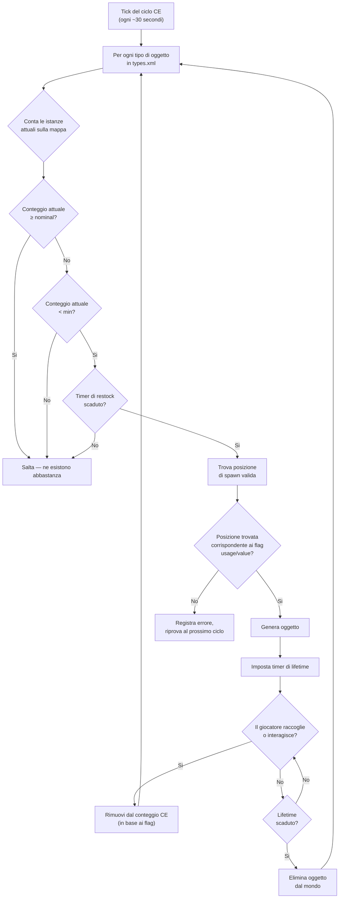

# Chapter 9.4: Economia del Loot in Dettaglio

[Home](../README.md) | [<< Precedente: Riferimento serverDZ.cfg](03-server-cfg.md) | **Economia del Loot in Dettaglio**

---

> **Riepilogo:** La Central Economy (CE) e il sistema che controlla ogni spawn di oggetti in DayZ -- da una scatoletta di fagioli su uno scaffale a un AKM in una caserma militare. Questo capitolo spiega l'intero ciclo di spawn, documenta ogni campo in `types.xml`, `globals.xml`, `events.xml` e `cfgspawnabletypes.xml` con esempi reali dai file vanilla del server, e copre gli errori piu comuni nell'economia.

---

## Indice

- [Come funziona la Central Economy](#come-funziona-la-central-economy)
- [Il ciclo di spawn](#il-ciclo-di-spawn)
- [types.xml -- Definizioni degli spawn degli oggetti](#typesxml----definizioni-degli-spawn-degli-oggetti)
- [Esempi reali di types.xml](#esempi-reali-di-typesxml)
- [Riferimento dei campi di types.xml](#riferimento-dei-campi-di-typesxml)
- [globals.xml -- Parametri dell'economia](#globalsxml----parametri-delleconomia)
- [events.xml -- Eventi dinamici](#eventsxml----eventi-dinamici)
- [cfgspawnabletypes.xml -- Accessori e cargo](#cfgspawnabletypesxml----accessori-e-cargo)
- [La relazione Nominal/Restock](#la-relazione-nominalrestock)
- [Errori comuni nell'economia](#errori-comuni-nelleconomia)

---

## Come funziona la Central Economy

La Central Economy (CE) e un sistema lato server che funziona in un ciclo continuo. Il suo compito e mantenere la popolazione di oggetti del mondo ai livelli definiti nei tuoi file di configurazione.

La CE **non** piazza oggetti quando un giocatore entra in un edificio. Invece, funziona con un timer globale e genera oggetti su tutta la mappa, indipendentemente dalla vicinanza dei giocatori. Gli oggetti hanno un **lifetime** -- quando quel timer scade e nessun giocatore ha interagito con l'oggetto, la CE lo rimuove. Poi, al ciclo successivo, rileva che il conteggio e sotto il target e genera un sostituto da qualche altra parte.

Concetti chiave:

- **Nominal** -- il numero target di copie di un oggetto che dovrebbero esistere sulla mappa
- **Min** -- la soglia sotto la quale la CE tentera di rigenerare l'oggetto
- **Lifetime** -- per quanto tempo (in secondi) un oggetto intoccato persiste prima della pulizia
- **Restock** -- tempo minimo (in secondi) prima che la CE possa rigenerare un oggetto dopo che e stato preso/distrutto
- **Flags** -- cosa conta verso il totale (sulla mappa, nel cargo, nell'inventario del giocatore, nelle scorte)

---

## Il ciclo di spawn



In breve: la CE conta quanti di ogni oggetto esistono, confronta con i target nominal/min e genera sostituti quando il conteggio scende sotto `min` e il timer `restock` e scaduto.

---

## types.xml -- Definizioni degli spawn degli oggetti

Questo e il file dell'economia piu importante. Ogni oggetto che puo apparire nel mondo ha bisogno di una voce qui. Il `types.xml` vanilla per Chernarus contiene circa 23.000 righe che coprono migliaia di oggetti.

### Esempi reali di types.xml

**Arma -- AKM**

```xml
<type name="AKM">
    <nominal>3</nominal>
    <lifetime>7200</lifetime>
    <restock>3600</restock>
    <min>2</min>
    <quantmin>30</quantmin>
    <quantmax>80</quantmax>
    <cost>100</cost>
    <flags count_in_cargo="0" count_in_hoarder="0" count_in_map="1" count_in_player="0" crafted="0" deloot="0"/>
    <category name="weapons"/>
    <usage name="Military"/>
    <value name="Tier4"/>
</type>
```

L'AKM e un'arma rara di alto livello. Solo 3 possono esistere sulla mappa contemporaneamente (`nominal`). Appare negli edifici Military nelle aree Tier 4 (nord-ovest). Quando un giocatore ne raccoglie uno, la CE vede che il conteggio sulla mappa scende sotto `min=2` e generera un sostituto dopo almeno 3600 secondi (1 ora). L'arma appare con il 30-80% di munizioni nel caricatore interno (`quantmin`/`quantmax`).

**Cibo -- BakedBeansCan**

```xml
<type name="BakedBeansCan">
    <nominal>15</nominal>
    <lifetime>14400</lifetime>
    <restock>0</restock>
    <min>12</min>
    <quantmin>-1</quantmin>
    <quantmax>-1</quantmax>
    <cost>100</cost>
    <flags count_in_cargo="0" count_in_hoarder="0" count_in_map="1" count_in_player="0" crafted="0" deloot="0"/>
    <category name="food"/>
    <tag name="shelves"/>
    <usage name="Town"/>
    <usage name="Village"/>
    <value name="Tier1"/>
    <value name="Tier2"/>
    <value name="Tier3"/>
</type>
```

I fagioli in scatola sono un cibo comune. 15 scatolette dovrebbero esistere in ogni momento. Appaiono sugli scaffali negli edifici Town e Village nei Tier 1-3 (dalla costa alla zona intermedia della mappa). `restock=0` significa idoneita immediata al respawn. `quantmin=-1` e `quantmax=-1` significano che l'oggetto non usa il sistema di quantita (non e un contenitore di liquido o munizioni).

**Abbigliamento -- RidersJacket_Black**

```xml
<type name="RidersJacket_Black">
    <nominal>14</nominal>
    <lifetime>28800</lifetime>
    <restock>0</restock>
    <min>10</min>
    <quantmin>-1</quantmin>
    <quantmax>-1</quantmax>
    <cost>100</cost>
    <flags count_in_cargo="0" count_in_hoarder="0" count_in_map="1" count_in_player="0" crafted="0" deloot="0"/>
    <category name="clothes"/>
    <usage name="Town"/>
    <value name="Tier1"/>
    <value name="Tier2"/>
</type>
```

Una giacca civile comune. 14 copie sulla mappa, trovabile negli edifici Town vicino alla costa (Tier 1-2). Un lifetime di 28800 secondi (8 ore) significa che persiste a lungo se nessuno la raccoglie.

**Medico -- BandageDressing**

```xml
<type name="BandageDressing">
    <nominal>40</nominal>
    <lifetime>14400</lifetime>
    <restock>0</restock>
    <min>30</min>
    <quantmin>-1</quantmin>
    <quantmax>-1</quantmax>
    <cost>100</cost>
    <flags count_in_cargo="0" count_in_hoarder="0" count_in_map="1" count_in_player="0" crafted="0" deloot="0"/>
    <category name="tools"/>
    <tag name="shelves"/>
    <usage name="Medic"/>
</type>
```

Le bende sono molto comuni (40 nominal). Appaiono negli edifici Medic (ospedali, cliniche) in tutti i tier (nessun tag `<value>` significa tutti i tier). Nota che la categoria e `"tools"`, non `"medical"` -- DayZ non ha una categoria medical; gli oggetti medici usano la categoria tools.

**Oggetto disabilitato (variante craftabile)**

```xml
<type name="AK101_Black">
    <nominal>0</nominal>
    <lifetime>28800</lifetime>
    <restock>0</restock>
    <min>0</min>
    <quantmin>-1</quantmin>
    <quantmax>-1</quantmax>
    <cost>100</cost>
    <flags count_in_cargo="0" count_in_hoarder="0" count_in_map="1" count_in_player="0" crafted="1" deloot="0"/>
    <category name="weapons"/>
</type>
```

`nominal=0` e `min=0` significa che la CE non generera mai questo oggetto. `crafted=1` indica che puo essere ottenuto solo tramite crafting (verniciatura di un'arma). Ha comunque un lifetime in modo che le istanze persistite vengano eventualmente ripulite.

---

## Riferimento dei campi di types.xml

### Campi principali

| Campo | Tipo | Intervallo | Descrizione |
|-------|------|------------|-------------|
| `name` | stringa | -- | Nome della classe dell'oggetto. Deve corrispondere esattamente al nome della classe del gioco. |
| `nominal` | int | 0+ | Numero target di questo oggetto sulla mappa. Imposta a 0 per impedire lo spawn. |
| `min` | int | 0+ | Quando il conteggio scende a questo valore o sotto, la CE tentera di generarne altri. |
| `lifetime` | int | secondi | Per quanto tempo un oggetto intoccato esiste prima che la CE lo elimini. |
| `restock` | int | secondi | Cooldown minimo prima che la CE possa generare un sostituto. 0 = immediato. |
| `quantmin` | int | da -1 a 100 | Percentuale minima di quantita alla generazione (% munizioni, % liquido). -1 = non applicabile. |
| `quantmax` | int | da -1 a 100 | Percentuale massima di quantita alla generazione. -1 = non applicabile. |
| `cost` | int | 0+ | Peso di priorita per la selezione dello spawn. Attualmente tutti gli oggetti vanilla usano 100. |

### Flags

```xml
<flags count_in_cargo="0" count_in_hoarder="0" count_in_map="1" count_in_player="0" crafted="0" deloot="0"/>
```

| Flag | Valori | Descrizione |
|------|--------|-------------|
| `count_in_map` | 0, 1 | Conta gli oggetti a terra o nei punti di spawn degli edifici. **Quasi sempre 1.** |
| `count_in_cargo` | 0, 1 | Conta gli oggetti dentro altri contenitori (zaini, tende). |
| `count_in_hoarder` | 0, 1 | Conta gli oggetti in scorte, barili, contenitori sepolti, tende. |
| `count_in_player` | 0, 1 | Conta gli oggetti nell'inventario del giocatore (sul corpo o nelle mani). |
| `crafted` | 0, 1 | Quando e 1, questo oggetto e ottenibile solo tramite crafting, non tramite spawn della CE. |
| `deloot` | 0, 1 | Loot degli Eventi Dinamici. Quando e 1, l'oggetto appare solo nelle posizioni degli eventi dinamici (relitti di elicotteri, ecc.). |

**La strategia dei flag conta.** Se `count_in_player=1`, ogni AKM che un giocatore trasporta conta verso il nominal. Questo significa che raccogliere un AKM non attiverebbe un respawn perche il conteggio non e cambiato. La maggior parte degli oggetti vanilla usa `count_in_player=0` in modo che gli oggetti in possesso dei giocatori non blocchino i respawn.

### Tag

| Elemento | Scopo | Definito in |
|----------|-------|-------------|
| `<category name="..."/>` | Categoria dell'oggetto per la corrispondenza dei punti di spawn | `cfglimitsdefinition.xml` |
| `<usage name="..."/>` | Tipo di edificio dove questo oggetto puo apparire | `cfglimitsdefinition.xml` |
| `<value name="..."/>` | Zona tier della mappa dove questo oggetto puo apparire | `cfglimitsdefinition.xml` |
| `<tag name="..."/>` | Tipo di posizione di spawn all'interno di un edificio | `cfglimitsdefinition.xml` |

**Categorie valide:** `tools`, `containers`, `clothes`, `food`, `weapons`, `books`, `explosives`, `lootdispatch`

**Flag di usage validi:** `Military`, `Police`, `Medic`, `Firefighter`, `Industrial`, `Farm`, `Coast`, `Town`, `Village`, `Hunting`, `Office`, `School`, `Prison`, `Lunapark`, `SeasonalEvent`, `ContaminatedArea`, `Historical`

**Flag di value validi:** `Tier1`, `Tier2`, `Tier3`, `Tier4`, `Unique`

**Tag validi:** `floor`, `shelves`, `ground`

Un oggetto puo avere **multipli** tag `<usage>` e `<value>`. Usage multipli significano che puo apparire in uno qualsiasi di quei tipi di edificio. Value multipli significano che puo apparire in uno qualsiasi di quei tier.

Se ometti completamente `<value>`, l'oggetto appare in **tutti** i tier. Se ometti `<usage>`, l'oggetto non ha una posizione di spawn valida e **non apparira**.

---

## globals.xml -- Parametri dell'economia

Questo file controlla il comportamento globale della CE. Ogni parametro dal file vanilla:

```xml
<variables>
    <var name="AnimalMaxCount" type="0" value="200"/>
    <var name="CleanupAvoidance" type="0" value="100"/>
    <var name="CleanupLifetimeDeadAnimal" type="0" value="1200"/>
    <var name="CleanupLifetimeDeadInfected" type="0" value="330"/>
    <var name="CleanupLifetimeDeadPlayer" type="0" value="3600"/>
    <var name="CleanupLifetimeDefault" type="0" value="45"/>
    <var name="CleanupLifetimeLimit" type="0" value="50"/>
    <var name="CleanupLifetimeRuined" type="0" value="330"/>
    <var name="FlagRefreshFrequency" type="0" value="432000"/>
    <var name="FlagRefreshMaxDuration" type="0" value="3456000"/>
    <var name="FoodDecay" type="0" value="1"/>
    <var name="IdleModeCountdown" type="0" value="60"/>
    <var name="IdleModeStartup" type="0" value="1"/>
    <var name="InitialSpawn" type="0" value="100"/>
    <var name="LootDamageMax" type="1" value="0.82"/>
    <var name="LootDamageMin" type="1" value="0.0"/>
    <var name="LootProxyPlacement" type="0" value="1"/>
    <var name="LootSpawnAvoidance" type="0" value="100"/>
    <var name="RespawnAttempt" type="0" value="2"/>
    <var name="RespawnLimit" type="0" value="20"/>
    <var name="RespawnTypes" type="0" value="12"/>
    <var name="RestartSpawn" type="0" value="0"/>
    <var name="SpawnInitial" type="0" value="1200"/>
    <var name="TimeHopping" type="0" value="60"/>
    <var name="TimeLogin" type="0" value="15"/>
    <var name="TimeLogout" type="0" value="15"/>
    <var name="TimePenalty" type="0" value="20"/>
    <var name="WorldWetTempUpdate" type="0" value="1"/>
    <var name="ZombieMaxCount" type="0" value="1000"/>
    <var name="ZoneSpawnDist" type="0" value="300"/>
</variables>
```

L'attributo `type` indica il tipo di dato: `0` = intero, `1` = float.

### Riferimento completo dei parametri

| Parametro | Tipo | Predefinito | Descrizione |
|-----------|------|-------------|-------------|
| **AnimalMaxCount** | int | 200 | Numero massimo di animali vivi sulla mappa contemporaneamente. |
| **CleanupAvoidance** | int | 100 | Distanza in metri da un giocatore dove la CE NON ripulira gli oggetti. Gli oggetti entro questo raggio sono protetti dalla scadenza del lifetime. |
| **CleanupLifetimeDeadAnimal** | int | 1200 | Secondi prima che il cadavere di un animale venga rimosso. (20 minuti) |
| **CleanupLifetimeDeadInfected** | int | 330 | Secondi prima che il cadavere di uno zombie venga rimosso. (5,5 minuti) |
| **CleanupLifetimeDeadPlayer** | int | 3600 | Secondi prima che il corpo di un giocatore morto venga rimosso. (1 ora) |
| **CleanupLifetimeDefault** | int | 45 | Tempo di pulizia predefinito in secondi per gli oggetti senza un lifetime specifico. |
| **CleanupLifetimeLimit** | int | 50 | Numero massimo di oggetti elaborati per ciclo di pulizia. |
| **CleanupLifetimeRuined** | int | 330 | Secondi prima che gli oggetti rovinati vengano ripuliti. (5,5 minuti) |
| **FlagRefreshFrequency** | int | 432000 | Quanto spesso un palo con bandiera deve essere "rinfrescato" tramite interazione per prevenire il degrado della base, in secondi. (5 giorni) |
| **FlagRefreshMaxDuration** | int | 3456000 | Durata massima di un palo con bandiera anche con rinfrescamento regolare, in secondi. (40 giorni) |
| **FoodDecay** | int | 1 | Abilita (1) o disabilita (0) il deterioramento del cibo nel tempo. |
| **IdleModeCountdown** | int | 60 | Secondi prima che il server entri in modalita inattiva quando nessun giocatore e connesso. |
| **IdleModeStartup** | int | 1 | Se il server si avvia in modalita inattiva (1) o attiva (0). |
| **InitialSpawn** | int | 100 | Percentuale dei valori nominal da generare al primo avvio del server (0-100). |
| **LootDamageMax** | float | 0.82 | Stato di danno massimo per il loot generato casualmente (0.0 = incontaminato, 1.0 = rovinato). |
| **LootDamageMin** | float | 0.0 | Stato di danno minimo per il loot generato casualmente. |
| **LootProxyPlacement** | int | 1 | Abilita (1) il posizionamento visivo degli oggetti su scaffali/tavoli vs cadute casuali a terra. |
| **LootSpawnAvoidance** | int | 100 | Distanza in metri da un giocatore dove la CE NON generera nuovo loot. Impedisce che gli oggetti appaiano davanti ai giocatori. |
| **RespawnAttempt** | int | 2 | Numero di tentativi di posizione di spawn per oggetto per ciclo CE prima di arrendersi. |
| **RespawnLimit** | int | 20 | Numero massimo di oggetti che la CE rigenerera per ciclo. |
| **RespawnTypes** | int | 12 | Numero massimo di diversi tipi di oggetto elaborati per ciclo di respawn. |
| **RestartSpawn** | int | 0 | Quando e 1, ri-randomizza tutte le posizioni del loot al riavvio del server. Quando e 0, carica dalla persistenza. |
| **SpawnInitial** | int | 1200 | Numero di oggetti da generare durante la popolazione iniziale dell'economia al primo avvio. |
| **TimeHopping** | int | 60 | Cooldown in secondi che impedisce a un giocatore di riconnettersi allo stesso server (anti-server-hop). |
| **TimeLogin** | int | 15 | Timer del conto alla rovescia del login in secondi (il timer "Attendere prego" durante la connessione). |
| **TimeLogout** | int | 15 | Timer del conto alla rovescia del logout in secondi. Il giocatore rimane nel mondo durante questo tempo. |
| **TimePenalty** | int | 20 | Tempo di penalita extra in secondi aggiunto al timer di logout se il giocatore si disconnette in modo improprio (Alt+F4). |
| **WorldWetTempUpdate** | int | 1 | Abilita (1) o disabilita (0) gli aggiornamenti della simulazione di temperatura e umidita del mondo. |
| **ZombieMaxCount** | int | 1000 | Numero massimo di zombie vivi sulla mappa contemporaneamente. |
| **ZoneSpawnDist** | int | 300 | Distanza in metri da un giocatore alla quale le zone di spawn degli zombie diventano attive. |

### Regolazioni comuni

**Piu loot (server PvP):**
```xml
<var name="InitialSpawn" type="0" value="100"/>
<var name="RespawnLimit" type="0" value="50"/>
<var name="RespawnTypes" type="0" value="30"/>
<var name="RespawnAttempt" type="0" value="4"/>
```

**Corpi morti piu a lungo (piu tempo per saccheggiare le uccisioni):**
```xml
<var name="CleanupLifetimeDeadPlayer" type="0" value="7200"/>
```

**Degrado delle basi piu veloce (eliminare le basi abbandonate piu rapidamente):**
```xml
<var name="FlagRefreshFrequency" type="0" value="259200"/>
<var name="FlagRefreshMaxDuration" type="0" value="1728000"/>
```

---

## events.xml -- Eventi dinamici

Gli eventi definiscono gli spawn per entita che necessitano di gestione speciale: animali, veicoli e relitti di elicotteri. A differenza degli oggetti di `types.xml` che appaiono dentro gli edifici, gli eventi appaiono in posizioni predefinite nel mondo elencate in `cfgeventspawns.xml`.

### Esempio reale di evento veicolo

```xml
<event name="VehicleCivilianSedan">
    <nominal>8</nominal>
    <min>5</min>
    <max>11</max>
    <lifetime>300</lifetime>
    <restock>0</restock>
    <saferadius>500</saferadius>
    <distanceradius>500</distanceradius>
    <cleanupradius>200</cleanupradius>
    <flags deletable="0" init_random="0" remove_damaged="1"/>
    <position>fixed</position>
    <limit>mixed</limit>
    <active>1</active>
    <children>
        <child lootmax="0" lootmin="0" max="5" min="3" type="CivilianSedan"/>
        <child lootmax="0" lootmin="0" max="5" min="3" type="CivilianSedan_Black"/>
        <child lootmax="0" lootmin="0" max="5" min="3" type="CivilianSedan_Wine"/>
    </children>
</event>
```

### Esempio reale di evento animale

```xml
<event name="AnimalBear">
    <nominal>0</nominal>
    <min>2</min>
    <max>2</max>
    <lifetime>180</lifetime>
    <restock>0</restock>
    <saferadius>200</saferadius>
    <distanceradius>0</distanceradius>
    <cleanupradius>0</cleanupradius>
    <flags deletable="0" init_random="0" remove_damaged="1"/>
    <position>fixed</position>
    <limit>custom</limit>
    <active>1</active>
    <children>
        <child lootmax="0" lootmin="0" max="1" min="1" type="Animal_UrsusArctos"/>
    </children>
</event>
```

### Riferimento dei campi degli eventi

| Campo | Descrizione |
|-------|-------------|
| `name` | Identificatore dell'evento. Deve corrispondere a una voce in `cfgeventspawns.xml` per gli eventi con `position="fixed"`. |
| `nominal` | Numero target di gruppi di eventi attivi sulla mappa. |
| `min` | Numero minimo di membri del gruppo per punto di spawn. |
| `max` | Numero massimo di membri del gruppo per punto di spawn. |
| `lifetime` | Secondi prima che l'evento venga ripulito e rigenerato. Per i veicoli, questo e l'intervallo di controllo del respawn, non il lifetime di persistenza del veicolo. |
| `restock` | Secondi minimi tra i respawn. |
| `saferadius` | Distanza minima in metri da un giocatore perche l'evento possa apparire. |
| `distanceradius` | Distanza minima tra due istanze dello stesso evento. |
| `cleanupradius` | Distanza da qualsiasi giocatore sotto la quale l'evento NON verra ripulito. |
| `deletable` | Se l'evento puo essere eliminato dalla CE (0 = no). |
| `init_random` | Randomizza le posizioni iniziali (0 = usa posizioni fisse). |
| `remove_damaged` | Rimuovi l'entita dell'evento se diventa danneggiata/rovinata (1 = si). |
| `position` | `"fixed"` = usa posizioni da `cfgeventspawns.xml`. `"player"` = genera vicino ai giocatori. |
| `limit` | `"child"` = limite per tipo di figlio. `"mixed"` = limite condiviso tra tutti i figli. `"custom"` = comportamento speciale. |
| `active` | 1 = abilitato, 0 = disabilitato. |

### Figli

Ogni elemento `<child>` definisce una variante che puo apparire:

| Attributo | Descrizione |
|-----------|-------------|
| `type` | Nome della classe dell'entita da generare. |
| `min` | Numero minimo di istanze di questa variante (per `limit="child"`). |
| `max` | Numero massimo di istanze di questa variante (per `limit="child"`). |
| `lootmin` | Numero minimo di oggetti loot generati dentro/sopra l'entita. |
| `lootmax` | Numero massimo di oggetti loot generati dentro/sopra l'entita. |

---

## cfgspawnabletypes.xml -- Accessori e cargo

Questo file definisce quali accessori, cargo e stato di danno ha un oggetto quando appare. Senza una voce qui, gli oggetti appaiono vuoti e con danno casuale (entro `LootDamageMin`/`LootDamageMax` da `globals.xml`).

### Arma con accessori -- AKM

```xml
<type name="AKM">
    <damage min="0.45" max="0.85" />
    <attachments chance="1.00">
        <item name="AK_PlasticBttstck" chance="1.00" />
    </attachments>
    <attachments chance="1.00">
        <item name="AK_PlasticHndgrd" chance="1.00" />
    </attachments>
    <attachments chance="0.50">
        <item name="KashtanOptic" chance="0.30" />
        <item name="PSO11Optic" chance="0.20" />
    </attachments>
    <attachments chance="0.05">
        <item name="AK_Suppressor" chance="1.00" />
    </attachments>
    <attachments chance="0.30">
        <item name="Mag_AKM_30Rnd" chance="1.00" />
    </attachments>
</type>
```

Lettura di questa voce:

1. L'AKM appare con danno tra 45-85% (da usurato a molto danneggiato)
2. **Sempre** (100%) riceve un calcio e un paramano in plastica
3. 50% di probabilita che lo slot ottico venga riempito -- se lo e, 30% di probabilita per il Kashtan, 20% per il PSO-11
4. 5% di probabilita di un silenziatore
5. 30% di probabilita di un caricatore inserito

Ogni blocco `<attachments>` rappresenta uno slot per accessori. Il `chance` sul blocco e la probabilita che quello slot venga popolato. Il `chance` su ogni `<item>` all'interno e un peso di selezione relativo -- la CE sceglie un oggetto dalla lista usando questi come pesi.

### Arma con accessori -- M4A1

```xml
<type name="M4A1">
    <damage min="0.45" max="0.85" />
    <attachments chance="1.00">
        <item name="M4_OEBttstck" chance="1.00" />
    </attachments>
    <attachments chance="1.00">
        <item name="M4_PlasticHndgrd" chance="1.00" />
    </attachments>
    <attachments chance="1.00">
        <item name="BUISOptic" chance="0.50" />
        <item name="M4_CarryHandleOptic" chance="1.00" />
    </attachments>
    <attachments chance="0.30">
        <item name="Mag_CMAG_40Rnd" chance="0.15" />
        <item name="Mag_CMAG_10Rnd" chance="0.50" />
        <item name="Mag_CMAG_20Rnd" chance="0.70" />
        <item name="Mag_CMAG_30Rnd" chance="1.00" />
    </attachments>
</type>
```

### Giubbotto con tasche -- PlateCarrierVest_Camo

```xml
<type name="PlateCarrierVest_Camo">
    <damage min="0.1" max="0.6" />
    <attachments chance="0.85">
        <item name="PlateCarrierHolster_Camo" chance="1.00" />
    </attachments>
    <attachments chance="0.85">
        <item name="PlateCarrierPouches_Camo" chance="1.00" />
    </attachments>
</type>
```

### Zaino con cargo

```xml
<type name="AssaultBag_Ttsko">
    <cargo preset="mixArmy" />
    <cargo preset="mixArmy" />
    <cargo preset="mixArmy" />
</type>
```

L'attributo `preset` fa riferimento a un pool di loot definito in `cfgrandompresets.xml`. Ogni riga `<cargo>` e un lancio -- questo zaino ottiene 3 lanci dal pool `mixArmy`. Il valore `chance` del pool stesso determina se ogni lancio produce effettivamente un oggetto.

### Oggetti solo per accumulatori

```xml
<type name="Barrel_Blue">
    <hoarder />
</type>
<type name="SeaChest">
    <hoarder />
</type>
```

Il tag `<hoarder />` contrassegna gli oggetti come contenitori per accumulatori. La CE conta gli oggetti all'interno di questi separatamente usando il flag `count_in_hoarder` da `types.xml`.

### Sovrascrittura del danno allo spawn

```xml
<type name="BandageDressing">
    <damage min="0.0" max="0.0" />
</type>
```

Forza le bende ad apparire sempre in condizioni Incontaminate, sovrascrivendo i valori globali `LootDamageMin`/`LootDamageMax` da `globals.xml`.

---

## La relazione Nominal/Restock

Capire come `nominal`, `min` e `restock` lavorano insieme e fondamentale per regolare la tua economia.

### La matematica

```
SE (conteggio_attuale < min) E (tempo_dall_ultimo_spawn > restock):
    genera nuovo oggetto (fino a nominal)
```

**Esempio con l'AKM:**
- `nominal = 3`, `min = 2`, `restock = 3600`
- Il server si avvia: la CE genera 3 AKM sulla mappa
- Un giocatore raccoglie 1 AKM: il conteggio sulla mappa scende a 2
- Il conteggio (2) NON e inferiore a min (2), quindi nessun respawn ancora
- Un giocatore raccoglie un altro AKM: il conteggio sulla mappa scende a 1
- Il conteggio (1) E inferiore a min (2), e il timer di restock (3600s = 1 ora) inizia
- Dopo 1 ora, la CE genera 2 nuovi AKM per raggiungere il nominal (3) di nuovo

**Esempio con BakedBeansCan:**
- `nominal = 15`, `min = 12`, `restock = 0`
- Un giocatore mangia una scatoletta: il conteggio sulla mappa scende a 14
- Il conteggio (14) NON e inferiore a min (12), quindi nessun respawn
- Altre 3 scatolette mangiate: il conteggio scende a 11
- Il conteggio (11) E inferiore a min (12), restock e 0 (istantaneo)
- Prossimo ciclo CE: genera 4 scatolette per raggiungere il nominal (15)

### Intuizioni chiave

- **Il divario tra nominal e min** determina quanti oggetti possono essere "consumati" prima che la CE reagisca. Un divario piccolo (come l'AKM: 3/2) significa che la CE reagisce dopo solo 2 raccolte. Un divario grande significa che piu oggetti possono uscire dall'economia prima che il respawn si attivi.

- **restock = 0** rende il respawn effettivamente istantaneo (prossimo ciclo CE). Valori alti di restock creano scarsita -- la CE sa che deve generare di piu ma deve aspettare.

- **Il lifetime** e indipendente da nominal/min. Anche se la CE ha generato un oggetto per raggiungere il nominal, l'oggetto verra eliminato quando il suo lifetime scade se nessuno lo tocca. Questo crea un costante "ricambio" di oggetti che appaiono e scompaiono sulla mappa.

- Gli oggetti che i giocatori raccolgono ma poi rilasciano (in una posizione diversa) contano comunque se il flag rilevante e impostato. Un AKM lasciato a terra conta comunque verso il totale della mappa perche `count_in_map=1`.

---

## Errori comuni nell'economia

### L'oggetto ha una voce in types.xml ma non appare

**Controlla in ordine:**

1. Il `nominal` e maggiore di 0?
2. L'oggetto ha almeno un tag `<usage>`? (Nessun usage = nessuna posizione di spawn valida)
3. Il tag `<usage>` e definito in `cfglimitsdefinition.xml`?
4. Il tag `<value>` (se presente) e definito in `cfglimitsdefinition.xml`?
5. Il tag `<category>` e valido?
6. L'oggetto e elencato in `cfgignorelist.xml`? (Gli oggetti li dentro sono bloccati)
7. Il flag `crafted` e impostato a 1? (Gli oggetti craftabili non appaiono mai naturalmente)
8. `RestartSpawn` in `globals.xml` e impostato a 0 con persistenza esistente? (La vecchia persistenza potrebbe impedire ai nuovi oggetti di apparire fino a un wipe)

### Gli oggetti appaiono ma scompaiono immediatamente

Il valore `lifetime` e troppo basso. Un lifetime di 45 secondi (il `CleanupLifetimeDefault`) significa che l'oggetto viene ripulito quasi immediatamente. Le armi dovrebbero avere lifetime di 7200-28800 secondi.

### Troppi/troppo pochi di un oggetto

Regola `nominal` e `min` insieme. Se imposti `nominal=100` ma `min=1`, la CE non generera sostituti finche 99 oggetti non saranno stati presi. Se vuoi una fornitura costante, mantieni `min` vicino a `nominal` (ad esempio `nominal=20, min=15`).

### Gli oggetti appaiono solo in una zona

Controlla i tuoi tag `<value>`. Se un oggetto ha solo `<value name="Tier4"/>`, apparira solo nell'area militare nord-ovest di Chernarus. Aggiungi piu tier per distribuirlo sulla mappa:

```xml
<value name="Tier1"/>
<value name="Tier2"/>
<value name="Tier3"/>
<value name="Tier4"/>
```

### Gli oggetti delle mod non appaiono

Quando aggiungi oggetti da una mod a `types.xml`:

1. Assicurati che la mod sia caricata (elencata nel parametro `-mod=`)
2. Verifica che il nome della classe sia **esattamente** corretto (sensibile alle maiuscole)
3. Aggiungi i tag category/usage/value dell'oggetto -- avere solo una voce in `types.xml` non e sufficiente
4. Se la mod aggiunge nuovi tag usage o value, aggiungili a `cfglimitsdefinitionuser.xml`
5. Controlla il log degli script per avvisi su nomi di classe sconosciuti

### I pezzi dei veicoli non appaiono nei veicoli

I pezzi dei veicoli appaiono tramite `cfgspawnabletypes.xml`, non `types.xml`. Se un veicolo appare senza ruote o batteria, controlla che il veicolo abbia una voce in `cfgspawnabletypes.xml` con le definizioni appropriate degli accessori.

### Tutto il loot e Incontaminato o tutto il loot e Rovinato

Controlla `LootDamageMin` e `LootDamageMax` in `globals.xml`. I valori vanilla sono `0.0` e `0.82`. Impostare entrambi a `0.0` rende tutto incontaminato. Impostare entrambi a `1.0` rende tutto rovinato. Controlla anche le sovrascritture per singolo oggetto in `cfgspawnabletypes.xml`.

### L'economia sembra "bloccata" dopo aver modificato types.xml

Dopo aver modificato i file dell'economia, esegui una di queste azioni:
- Cancella `storage_1/` per un wipe completo e un nuovo inizio dell'economia
- Imposta `RestartSpawn` a `1` in `globals.xml` per un riavvio per ri-randomizzare il loot, poi reimpostalo a `0`
- Aspetta che i lifetime degli oggetti scadano naturalmente (puo richiedere ore)

---

**Precedente:** [Riferimento serverDZ.cfg](03-server-cfg.md) | [Home](../README.md) | **Successivo:** [Spawn di Veicoli ed Eventi Dinamici](05-vehicle-spawning.md)
