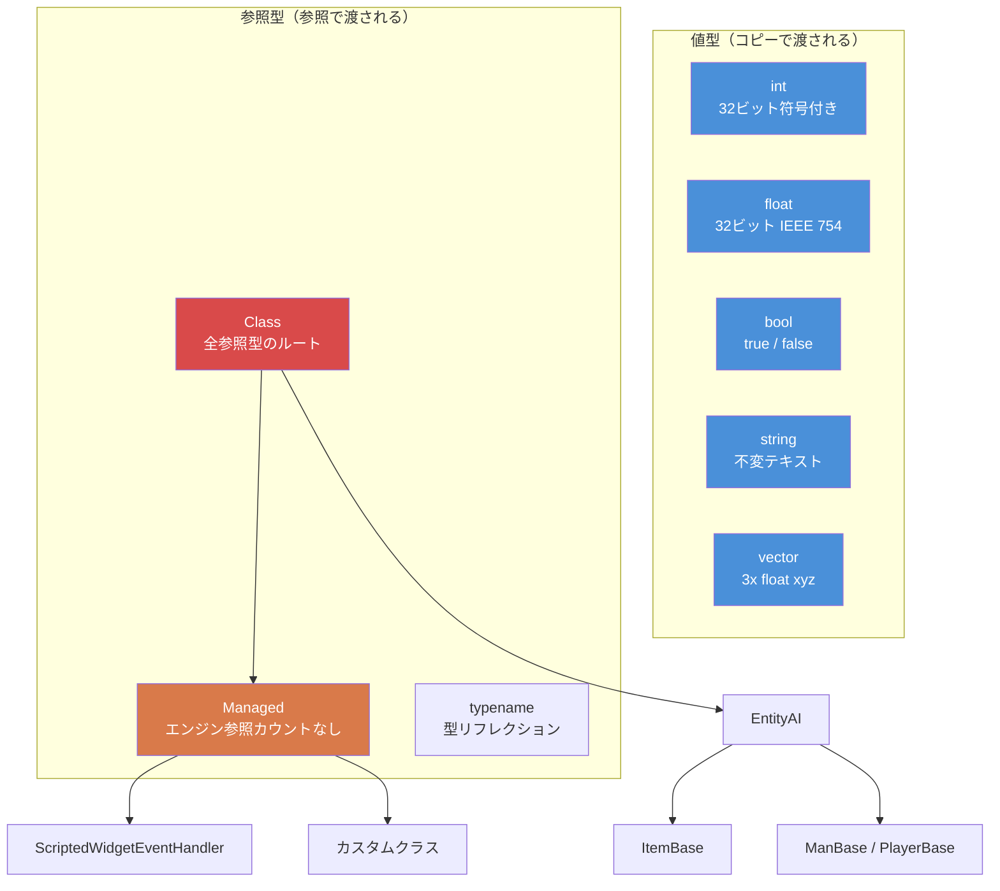

# Chapter 1.1: 変数と型

[ホーム](../../README.md) | **変数と型** | [次: 配列、マップ、セット >>](02-arrays-maps-sets.md)

---

## はじめに

Enforce Script は Enfusion エンジンのスクリプト言語で、DayZ Standalone で使用されます。C言語風の構文を持つオブジェクト指向言語で、多くの点で C# に似ていますが、独自の型、ルール、制限があります。C#、Java、C++ の経験がある方はすぐに馴染めるでしょう --- ただし違いに十分注意してください。Enforce Script がこれらの言語と異なる部分こそが、バグの潜む場所だからです。

この章では基本的な構成要素について扱います：プリミティブ型、変数の宣言と初期化、型変換の仕組み。すべての DayZ Mod コードはここから始まります。

---

## プリミティブ型

Enforce Script には小さく固定されたプリミティブ型のセットがあります。新しい値型は定義できません --- クラスのみ定義可能です（[第1.3章](03-classes-inheritance.md)で解説）。

| 型 | サイズ | デフォルト値 | 説明 |
|------|------|---------------|-------------|
| `int` | 32ビット符号付き | `0` | -2,147,483,648 から 2,147,483,647 の整数 |
| `float` | 32ビット IEEE 754 | `0.0` | 浮動小数点数 |
| `bool` | 1ビット論理値 | `false` | `true` または `false` |
| `string` | 可変長 | `""` (空) | テキスト。不変の値型 --- 参照ではなく値で渡される |
| `vector` | 3x float | `"0 0 0"` | 3成分の float (x, y, z)。値で渡される |
| `typename` | エンジン参照 | `null` | 型そのものへの参照。リフレクションに使用 |
| `void` | N/A | N/A | 「何も返さない」を示す戻り値型としてのみ使用 |

### 型階層図



### 型の定数

いくつかの型は便利な定数を公開しています：

```c
// int の範囲
int maxInt = int.MAX;    // 2147483647
int minInt = int.MIN;    // -2147483648

// float の範囲
float smallest = float.MIN;     // 最小の正の float (~1.175e-38)
float largest  = float.MAX;     // 最大の float (~3.403e+38)
float lowest   = float.LOWEST;  // 最も小さい（負の）float (-3.403e+38)
```

---

## 変数の宣言

変数は型名に続けて変数名を書いて宣言します。宣言と代入を1つの文で行うことも、別々に行うこともできます。

```c
void MyFunction()
{
    // 宣言のみ（デフォルト値で初期化される）
    int health;          // health == 0
    float speed;         // speed == 0.0
    bool isAlive;        // isAlive == false
    string name;         // name == ""

    // 初期化付き宣言
    int maxPlayers = 60;
    float gravity = 9.81;
    bool debugMode = true;
    string serverName = "My DayZ Server";
}
```

### `auto` キーワード

右辺から型が明らかな場合、`auto` を使ってコンパイラに型を推論させることができます：

```c
void Example()
{
    auto count = 10;           // int
    auto ratio = 0.75;         // float
    auto label = "Hello";      // string
    auto player = GetGame().GetPlayer();  // DayZPlayer（GetPlayer の戻り値の型）
}
```

これは単なる便利機能です --- コンパイラはコンパイル時に型を解決します。パフォーマンスの違いはありません。

### 定数

初期化後に変更されない値には `const` キーワードを使用します：

```c
const int MAX_SQUAD_SIZE = 8;
const float SPAWN_RADIUS = 150.0;
const string MOD_PREFIX = "[MyMod]";

void Example()
{
    int a = MAX_SQUAD_SIZE;  // OK: 定数の読み取り
    MAX_SQUAD_SIZE = 10;     // エラー: 定数に代入できない
}
```

定数は通常ファイルスコープ（関数の外）またはクラスメンバーとして宣言します。命名規則：`UPPER_SNAKE_CASE`。

---

## `int` の使い方

整数は最も多用される型です。DayZ ではアイテム数、プレイヤーID、体力値（離散化時）、enum 値、ビットフラグなどに使われます。

```c
void IntExamples()
{
    int count = 5;
    int total = count + 10;     // 15
    int doubled = count * 2;    // 10
    int remainder = 17 % 5;     // 2（剰余演算）

    // インクリメントとデクリメント
    count++;    // count は 6 に
    count--;    // count は再び 5 に

    // 複合代入
    count += 3;  // count は 8 に
    count -= 2;  // count は 6 に
    count *= 4;  // count は 24 に
    count /= 6;  // count は 4 に

    // 整数除算は切り捨て（丸めなし）
    int result = 7 / 2;    // result == 3（3.5 ではない）

    // ビット演算（フラグに使用）
    int flags = 0;
    flags = flags | 0x01;   // ビット0をセット
    flags = flags | 0x04;   // ビット2をセット
    bool hasBit0 = (flags & 0x01) != 0;  // true
}
```

### 実例：プレイヤー数

```c
void PrintPlayerCount()
{
    array<Man> players = new array<Man>;
    GetGame().GetPlayers(players);
    int count = players.Count();
    Print(string.Format("Players online: %1", count));
}
```

---

## `float` の使い方

float は小数を表します。DayZ では位置、距離、体力のパーセンテージ、ダメージ値、タイマーなどに広く使われます。

```c
void FloatExamples()
{
    float health = 100.0;
    float damage = 25.5;
    float remaining = health - damage;   // 74.5

    // DayZ 固有: ダメージ倍率
    float headMultiplier = 3.0;
    float actualDamage = damage * headMultiplier;  // 76.5

    // float の除算は小数の結果を返す
    float ratio = 7.0 / 2.0;   // 3.5

    // 便利な数学関数
    float dist = 150.7;
    float rounded = Math.Round(dist);    // 151
    float floored = Math.Floor(dist);    // 150
    float ceiled  = Math.Ceil(dist);     // 151
    float clamped = Math.Clamp(dist, 0.0, 100.0);  // 100
}
```

### 実例：距離チェック

```c
bool IsPlayerNearby(PlayerBase player, vector targetPos, float radius)
{
    if (!player)
        return false;

    vector playerPos = player.GetPosition();
    float distance = vector.Distance(playerPos, targetPos);
    return distance <= radius;
}
```

---

## `bool` の使い方

Boolean は `true` または `false` を保持します。条件判定、フラグ、状態追跡に使用されます。

```c
void BoolExamples()
{
    bool isAdmin = true;
    bool isBanned = false;

    // 論理演算子
    bool canPlay = isAdmin || !isBanned;    // true (OR, NOT)
    bool isSpecial = isAdmin && !isBanned;  // true (AND)

    // 否定
    bool notAdmin = !isAdmin;   // false

    // 比較結果は bool
    int health = 50;
    bool isLow = health < 25;       // false
    bool isHurt = health < 100;     // true
    bool isDead = health == 0;      // false
    bool isAlive = health != 0;     // true
}
```

### 条件式での真偽判定

Enforce Script では、条件式で bool 以外の値を使用できます。以下は `false` と評価されます：
- `0` (int)
- `0.0` (float)
- `""` (空の string)
- `null` (null オブジェクト参照)

それ以外はすべて `true` です。これは null チェックでよく使われます：

```c
void SafeCheck(PlayerBase player)
{
    // これら2つは同等です：
    if (player != null)
        Print("Player exists");

    if (player)
        Print("Player exists");

    // これら2つも同等です：
    if (player == null)
        Print("No player");

    if (!player)
        Print("No player");
}
```

---

## `string` の使い方

Enforce Script の文字列は**値型**です --- `int` や `float` と同様に、代入時や関数への受け渡し時にコピーされます。これは文字列が参照型である C# や Java とは異なります。

```c
void StringExamples()
{
    string greeting = "Hello";
    string name = "Survivor";

    // + による連結
    string message = greeting + ", " + name + "!";  // "Hello, Survivor!"

    // 文字列のフォーマット（1始まりのプレースホルダ）
    string formatted = string.Format("Player %1 has %2 health", name, 75);
    // 結果: "Player Survivor has 75 health"

    // 長さ
    int len = message.Length();    // 17

    // 比較
    bool same = (greeting == "Hello");  // true

    // 他の型からの変換
    string fromInt = "Score: " + 42;     // 動作しない -- 明示的に変換が必要
    string correct = "Score: " + 42.ToString();  // "Score: 42"

    // Format の使用が推奨されるアプローチ
    string best = string.Format("Score: %1", 42);  // "Score: 42"
}
```

### エスケープシーケンス

文字列は標準的なエスケープシーケンスをサポートしています：

| シーケンス | 意味 |
|----------|---------|
| `\n` | 改行 |
| `\r` | キャリッジリターン |
| `\t` | タブ |
| `\\` | リテラルのバックスラッシュ |
| `\"` | リテラルのダブルクォート |

**警告：** これらはドキュメントに記載されていますが、バックスラッシュ（`\\`）とエスケープされた引用符（`\"`）は、特に JSON 関連の操作において CParser で問題を引き起こすことが知られています。ファイルパスや JSON 文字列を扱う場合は、可能な限りバックスラッシュを避けてください。パスにはフォワードスラッシュを使用してください --- DayZ はすべてのプラットフォームでフォワードスラッシュを受け入れます。

### 実例：チャットメッセージ

```c
void SendAdminMessage(string adminName, string text)
{
    string msg = string.Format("[ADMIN] %1: %2", adminName, text);
    Print(msg);
}
```

---

## `vector` の使い方

`vector` 型は3つの `float` コンポーネント（x, y, z）を保持します。DayZ における位置、方向、回転、速度の基本型です。文字列やプリミティブ型と同様に、vector は**値型**です --- 代入時にコピーされます。

### 初期化

vector は2つの方法で初期化できます：

```c
void VectorInit()
{
    // 方法1: 文字列初期化（スペース区切りの3つの数値）
    vector pos1 = "100.5 0 200.3";

    // 方法2: Vector() コンストラクタ関数
    vector pos2 = Vector(100.5, 0, 200.3);

    // デフォルト値は "0 0 0"
    vector empty;   // empty == <0, 0, 0>
}
```

**重要：** 文字列初期化の形式ではカンマではなく**スペース**を区切り文字として使用します。`"1 2 3"` は有効ですが、`"1,2,3"` は無効です。

### コンポーネントアクセス

配列スタイルのインデックスで個々のコンポーネントにアクセスします：

```c
void VectorComponents()
{
    vector pos = Vector(100.5, 25.0, 200.3);

    // コンポーネントの読み取り
    float x = pos[0];   // 100.5  (東/西)
    float y = pos[1];   // 25.0   (上/下、高度)
    float z = pos[2];   // 200.3  (北/南)

    // コンポーネントへの書き込み
    pos[1] = 50.0;      // 高度を 50 に変更
}
```

DayZ の座標系：
- `[0]` = X = 東(+) / 西(-)
- `[1]` = Y = 上(+) / 下(-) (海抜高度)
- `[2]` = Z = 北(+) / 南(-)

### 静的定数

```c
vector zero    = vector.Zero;      // "0 0 0"
vector up      = vector.Up;        // "0 1 0"
vector right   = vector.Aside;     // "1 0 0"
vector forward = vector.Forward;   // "0 0 1"
```

### よく使う vector 操作

```c
void VectorOps()
{
    vector pos1 = Vector(100, 0, 200);
    vector pos2 = Vector(150, 0, 250);

    // 2点間の距離
    float dist = vector.Distance(pos1, pos2);

    // 距離の二乗（高速、比較に適している）
    float distSq = vector.DistanceSq(pos1, pos2);

    // pos1 から pos2 への方向
    vector dir = vector.Direction(pos1, pos2);

    // ベクトルの正規化（長さ = 1 にする）
    vector norm = dir.Normalized();

    // ベクトルの長さ
    float len = dir.Length();

    // 線形補間（pos1 と pos2 の 50% 地点）
    vector midpoint = vector.Lerp(pos1, pos2, 0.5);

    // 内積
    float dot = vector.Dot(dir, vector.Up);
}
```

### 実例：スポーン位置

```c
// 指定した X,Z 座標の地面上の位置を取得
vector GetGroundPosition(float x, float z)
{
    vector pos = Vector(x, 0, z);
    pos[1] = GetGame().SurfaceY(x, z);  // Y を地形の高さに設定
    return pos;
}

// 中心点から半径内のランダムな位置を取得
vector GetRandomPositionAround(vector center, float radius)
{
    float angle = Math.RandomFloat(0, Math.PI2);
    float dist = Math.RandomFloat(0, radius);

    vector offset = Vector(Math.Cos(angle) * dist, 0, Math.Sin(angle) * dist);
    vector pos = center + offset;
    pos[1] = GetGame().SurfaceY(pos[0], pos[2]);
    return pos;
}
```

---

## `typename` の使い方

`typename` 型は型そのものへの参照を保持します。リフレクション --- ランタイムでの型の検査と操作 --- に使用されます。ジェネリックシステム、コンフィグローダー、ファクトリパターンを作成する際に出会うことになります。

```c
void TypenameExamples()
{
    // クラスの typename を取得
    typename t = PlayerBase;

    // 文字列から typename を取得
    typename t2 = t.StringToEnum(PlayerBase, "PlayerBase");

    // 型の比較
    if (t == PlayerBase)
        Print("It's PlayerBase!");

    // オブジェクトインスタンスの typename を取得
    PlayerBase player;
    // ... player が有効であると仮定 ...
    typename objType = player.Type();

    // 継承の確認
    bool isMan = objType.IsInherited(Man);

    // typename を文字列に変換
    string name = t.ToString();  // "PlayerBase"

    // typename からインスタンスを作成（ファクトリパターン）
    Class instance = t.Spawn();
}
```

### typename による Enum 変換

```c
enum DamageType
{
    MELEE = 0,
    BULLET = 1,
    EXPLOSION = 2
};

void EnumConvert()
{
    // Enum から文字列へ
    string name = typename.EnumToString(DamageType, DamageType.BULLET);
    // name == "BULLET"

    // 文字列から Enum へ
    int value;
    typename.StringToEnum(DamageType, "EXPLOSION", value);
    // value == 2
}
```

---

## Managed クラス

`Managed` はエンジンの参照カウントを**無効にする**特別な基底クラスです。`Managed` を継承したクラスはエンジンのガベージコレクタで追跡されません --- そのライフタイムは完全にスクリプトの `ref` 参照によって管理されます。

```c
class MyScriptHandler : Managed
{
    // このクラスはエンジンによるガベージコレクションの対象外です
    // 最後の ref が解放されたときのみ削除されます
}
```

スクリプトのみのクラス（ゲームエンティティを表さないもの）のほとんどは `Managed` を継承すべきです。`PlayerBase`、`ItemBase` のようなエンティティクラスは `EntityAI`（エンジン管理であり、`Managed` ではない）を継承します。

### Managed の使用タイミング

| `Managed` を使用する場合... | `Managed` を使用しない場合... |
|----------------------|-----------------------------|
| 設定データクラス | アイテム (`ItemBase`) |
| マネージャーシングルトン | 武器 (`Weapon_Base`) |
| UI コントローラー | 車両 (`CarScript`) |
| イベントハンドラーオブジェクト | プレイヤー (`PlayerBase`) |
| ヘルパー/ユーティリティクラス | `EntityAI` を継承するすべてのクラス |

クラスがゲームワールド内の物理エンティティを表さない場合、ほぼ確実に `Managed` を継承すべきです。

---

## 型変換

Enforce Script は型間の暗黙的変換と明示的変換の両方をサポートしています。

### 暗黙的変換

一部の変換は自動的に行われます：

```c
void ImplicitConversions()
{
    // int から float へ（常に安全、データ損失なし）
    int count = 42;
    float fCount = count;    // 42.0

    // float から int へ（切り捨て、丸めではない！）
    float precise = 3.99;
    int truncated = precise;  // 3（4 ではない）

    // int/float から bool へ
    bool fromInt = 5;      // true（ゼロ以外）
    bool fromZero = 0;     // false
    bool fromFloat = 0.1;  // true（ゼロ以外）

    // bool から int へ
    int fromBool = true;   // 1
    int fromFalse = false; // 0
}
```

### 明示的変換（パース）

文字列と数値型の間で変換するには、パースメソッドを使用します：

```c
void ExplicitConversions()
{
    // 文字列から int へ
    int num = "42".ToInt();           // 42
    int bad = "hello".ToInt();        // 0（静かに失敗）

    // 文字列から float へ
    float f = "3.14".ToFloat();       // 3.14

    // 文字列から vector へ
    vector v = "100 25 200".ToVector();  // <100, 25, 200>

    // 数値から文字列へ（Format を使用）
    string s1 = string.Format("%1", 42);       // "42"
    string s2 = string.Format("%1", 3.14);     // "3.14"

    // int/float の .ToString()
    string s3 = (42).ToString();     // "42"
}
```

### オブジェクトキャスト

クラス型には `Class.CastTo()` または `ClassName.Cast()` を使用します。これは[第1.3章](03-classes-inheritance.md)で詳しく解説していますが、基本的なパターンは以下の通りです：

```c
void CastExample()
{
    Object obj = GetSomeObject();

    // 安全なキャスト（推奨）
    PlayerBase player;
    if (Class.CastTo(player, obj))
    {
        // player は有効で安全に使用可能
        string name = player.GetIdentity().GetName();
    }

    // 代替キャスト構文
    PlayerBase player2 = PlayerBase.Cast(obj);
    if (player2)
    {
        // player2 は有効
    }
}
```

---

## 変数のスコープ

変数は宣言されたコードブロック（中括弧）内でのみ存在します。Enforce Script ではネストされたスコープや兄弟スコープ内で同じ変数名を再宣言することは**できません**。

```c
void ScopeExample()
{
    int x = 10;

    if (true)
    {
        // int x = 20;  // エラー: ネストされたスコープでの 'x' の再宣言
        x = 20;         // OK: 外側の x を変更
        int y = 30;     // OK: このスコープ内の新しい変数
    }

    // y はここではアクセスできない（内側のスコープで宣言されている）
    // Print(y);  // エラー: 未宣言の識別子 'y'

    // 重要: これは for ループにも適用されます
    for (int i = 0; i < 5; i++)
    {
        // i はここに存在する
    }
    // for (int i = 0; i < 3; i++)  // DayZ ではエラー: 'i' は既に宣言済み
    // 別の名前を使用してください：
    for (int j = 0; j < 3; j++)
    {
        // j はここに存在する
    }
}
```

### 兄弟スコープの罠

これは Enforce Script で最も有名な落とし穴の1つです。`if` と `else` ブロックで同じ変数名を宣言するとコンパイルエラーになります：

```c
void SiblingTrap()
{
    if (someCondition)
    {
        int result = 10;    // ここで宣言
        Print(result);
    }
    else
    {
        // int result = 20; // エラー: 'result' の多重宣言
        // 兄弟スコープであっても同じスコープとして扱われる
    }

    // 修正: if/else の前に宣言する
    int result;
    if (someCondition)
    {
        result = 10;
    }
    else
    {
        result = 20;
    }
}
```

---

## 演算子の優先順位

優先順位の高い順：

| 優先度 | 演算子 | 説明 | 結合性 |
|----------|----------|-------------|---------------|
| 1 | `()` `[]` `.` | グルーピング、配列アクセス、メンバーアクセス | 左から右 |
| 2 | `!` `-` (単項) `~` | 論理 NOT、否定、ビットwise NOT | 右から左 |
| 3 | `*` `/` `%` | 乗算、除算、剰余 | 左から右 |
| 4 | `+` `-` | 加算、減算 | 左から右 |
| 5 | `<<` `>>` | ビットシフト | 左から右 |
| 6 | `<` `<=` `>` `>=` | 関係演算 | 左から右 |
| 7 | `==` `!=` | 等値演算 | 左から右 |
| 8 | `&` | ビットwise AND | 左から右 |
| 9 | `^` | ビットwise XOR | 左から右 |
| 10 | `\|` | ビットwise OR | 左から右 |
| 11 | `&&` | 論理 AND | 左から右 |
| 12 | `\|\|` | 論理 OR | 左から右 |
| 13 | `=` `+=` `-=` `*=` `/=` `%=` `&=` `\|=` `^=` `<<=` `>>=` | 代入 | 右から左 |

> **ヒント：** 迷った場合は括弧を使用してください。Enforce Script は C 言語風の優先順位ルールに従いますが、明示的なグルーピングはバグを防ぎ、可読性を向上させます。

---

## ベストプラクティス

- デフォルト値と意図が一致する場合でも、宣言時に常に明示的に変数を初期化してください -- 将来の読者に意図を伝えることができます。
- 変更されるべきでない値には `const` を使用してください。ファイルまたはクラスのスコープに `UPPER_SNAKE_CASE` で配置します。
- 型を混在させる場合は `+` による連結よりも `string.Format()` を使用してください -- 暗黙的変換の問題を回避し、読みやすくなります。
- 距離を比較する場合は `vector.Distance()` の代わりに `vector.DistanceSq()` を使用してください -- コストの高い平方根演算を回避できます。
- float を `==` で比較しないでください。常に `Math.AbsFloat(a - b) < 0.001` のようなイプシロン許容値を使用してください。

---

## 実際の Mod での使用例

> プロフェッショナルな DayZ Mod のソースコードを調査して確認されたパターン。

| パターン | Mod | 詳細 |
|---------|-----|--------|
| クラススコープの `const string LOG_PREFIX` | COT / Expansion | すべてのモジュールがタイプミスを防ぐためにログプレフィックスの文字列定数を定義 |
| `m_PascalCase` メンバー命名 | VPP / Dabs Framework | すべてのメンバー変数がプリミティブでも一貫して `m_` プレフィックスを使用 |
| すべてのログ出力に `string.Format` | Expansion Market | 数値との `+` 連結は使わず、常に `%1`..`%9` プレースホルダを使用 |
| `"0 0 0"` リテラルの代わりに `vector.Zero` | COT Admin Tools | 可読性の向上と文字列パースのオーバーヘッド回避のために名前付き定数を使用 |

---

## 理論と実践

| 概念 | 理論 | 現実 |
|---------|--------|---------|
| `auto` キーワード | 任意の型を推論できるはず | 単純な代入では動作するが読み手を混乱させることがある -- ほとんどの Mod では明示的に型を宣言 |
| `float` から `int` への切り捨て | 「ゼロ方向への丸め」として文書化 | ほぼ全員が一度は引っかかる。`3.99` は `4` ではなく `3` になる |
| `string` は値型 | `int` のようにコピーで渡される | 参照セマンティクスを期待する C#/Java 開発者を驚かせる。コピーへの変更は元に影響しない |

---

## よくある間違い

### 1. 初期化されていない変数をロジックに使用

プリミティブ型はデフォルト値を持ちます（`0`、`0.0`、`false`、`""`）が、これに依存するとコードが脆弱で読みにくくなります。常に明示的に初期化してください。

```c
// 悪い例: 暗黙的なゼロに依存
int count;
if (count > 0)  // count == 0 なので動作するが、意図が不明確
    DoThing();

// 良い例: 明示的な初期化
int count = 0;
if (count > 0)
    DoThing();
```

### 2. float から int への切り捨て

float から int への変換は最も近い値への丸めではなく、切り捨て（ゼロ方向への丸め）です：

```c
float f = 3.99;
int i = f;         // i == 3（4 ではない）

// 丸めが必要な場合：
int rounded = Math.Round(f);  // 4
```

### 3. float 比較での精度

float の厳密な等値比較は決して行わないでください：

```c
float a = 0.1 + 0.2;
// 悪い例: 浮動小数点の表現により失敗する可能性がある
if (a == 0.3)
    Print("Equal");

// 良い例: 許容値（イプシロン）を使用
if (Math.AbsFloat(a - 0.3) < 0.001)
    Print("Close enough");
```

### 4. 数値との文字列連結

`+` で数値を文字列に連結することはできません。`string.Format()` を使用してください：

```c
int kills = 5;
// 問題が発生する可能性:
// string msg = "Kills: " + kills;

// 正しい方法: Format を使用
string msg = string.Format("Kills: %1", kills);
```

### 5. vector の文字列フォーマット

vector の文字列初期化はカンマではなくスペースが必要です：

```c
vector good = "100 25 200";     // 正しい
// vector bad = "100, 25, 200"; // 間違い: カンマは正しくパースされない
// vector bad2 = "100,25,200";  // 間違い
```

### 6. string と vector が値型であることを忘れる

クラスオブジェクトとは異なり、文字列と vector は代入時にコピーされます。コピーを変更しても元のオブジェクトには影響しません：

```c
vector posA = "10 20 30";
vector posB = posA;       // posB はコピー
posB[1] = 99;             // posB のみが変更される
// posA はまだ "10 20 30"
```

---

## 練習問題

### 練習1: 変数の基本
以下を格納する変数を宣言してください：
- プレイヤーの名前 (string)
- 体力のパーセンテージ (float, 0-100)
- キル数 (int)
- 管理者かどうか (bool)
- ワールド座標 (vector)

`string.Format()` を使用してフォーマットされたサマリーを出力してください。

### 練習2: 温度変換器
関数 `float CelsiusToFahrenheit(float celsius)` とその逆関数 `float FahrenheitToCelsius(float fahrenheit)` を作成してください。沸点（100C = 212F）と氷点（0C = 32F）でテストしてください。

### 練習3: 距離計算器
2つの vector を受け取り、以下を返す関数を作成してください：
- 3D 距離
- 2D 距離（高さ/Y 軸を無視）
- 高さの差

ヒント: 2D 距離の場合、距離を計算する前に `[1]` を `0` に設定した新しい vector を作成してください。

### 練習4: 型変換
文字列 `"42"` から以下に変換してください：
1. `int`
2. `float`
3. `string.Format()` を使って `string` に戻す
4. `bool`（int 値がゼロ以外なので `true` になるはず）

### 練習5: 地面位置
任意の位置を受け取り、Y コンポーネントをその X,Z 位置の地形の高さに設定して返す関数 `vector SnapToGround(vector pos)` を作成してください。`GetGame().SurfaceY()` を使用してください。

---

## まとめ

| 概念 | 要点 |
|---------|-----------|
| 型 | `int`, `float`, `bool`, `string`, `vector`, `typename`, `void` |
| デフォルト値 | `0`, `0.0`, `false`, `""`, `"0 0 0"`, `null` |
| 定数 | `const` キーワード、`UPPER_SNAKE_CASE` 規則 |
| vector | `"x y z"` 文字列または `Vector(x,y,z)` で初期化、`[0]`、`[1]`、`[2]` でアクセス |
| スコープ | 変数は `{}` ブロックにスコープされる。ネスト/兄弟ブロックでの再宣言不可 |
| 変換 | `float` から `int` は切り捨て。文字列パースには `.ToInt()`、`.ToFloat()`、`.ToVector()` を使用 |
| フォーマット | 混合型の文字列構築には常に `string.Format()` を使用 |

---

[ホーム](../../README.md) | **変数と型** | [次: 配列、マップ、セット >>](02-arrays-maps-sets.md)
