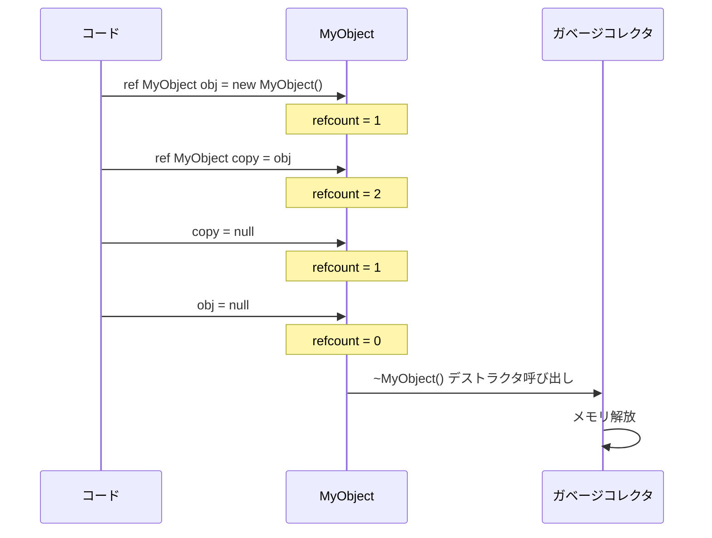
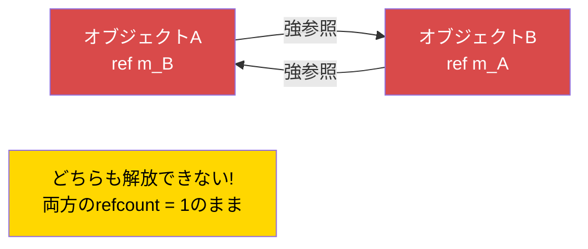

# 第1.8章: メモリ管理

[ホーム](../../README.md) | [<< 前へ: 数学とベクトル](07-math-vectors.md) | **メモリ管理** | [次へ: キャストとリフレクション >>](09-casting-reflection.md)

---

## はじめに

Enforce Scriptは、メモリ管理に**自動参照カウント（ARC）**を使用します -- 従来の意味でのガベージコレクションではありません。`ref`、`autoptr`、生のポインタがどのように機能するかを理解することは、安定したDayZ MODを書くために不可欠です。間違えると、メモリリーク（サーバーが徐々にRAMを消費しクラッシュする）か、削除されたオブジェクトへのアクセス（有用なエラーメッセージなしの即座のクラッシュ）が発生します。この章では、すべてのポインタ型、各型の使用タイミング、最も危険な落とし穴である参照サイクルの回避方法を説明します。

---

## 3つのポインタ型

Enforce Scriptには、オブジェクトへの参照を保持する3つの方法があります:

| ポインタ型 | キーワード | オブジェクトを維持? | 削除時にゼロ化? | 主な用途 |
|-------------|---------|---------------------|-------------------|-------------|
| **生のポインタ** | *(なし)* | いいえ（弱参照） | クラスが `Managed` を継承する場合のみ | 逆参照、オブザーバー、キャッシュ |
| **強参照** | `ref` | はい | はい | 所有メンバー、コレクション |
| **オートポインタ** | `autoptr` | はい、スコープ終了時に削除 | はい | ローカル変数 |

### ARCの仕組み

すべてのオブジェクトには**参照カウント** -- そのオブジェクトを指す強参照（`ref`、`autoptr`、ローカル変数、関数引数）の数があります。カウントがゼロになると、オブジェクトは自動的に破棄され、デストラクタが呼び出されます。

**弱参照**（生のポインタ）は参照カウントを増加させません。オブジェクトを維持せずに観察します。

---

## 生のポインタ（弱参照）

生のポインタは `ref` や `autoptr` なしで宣言された変数です。クラスメンバーの場合、これは**弱参照**を作成します: オブジェクトを指しますが、オブジェクトを維持しません。

```c
class Observer
{
    PlayerBase m_WatchedPlayer;  // 弱参照 -- プレイヤーを維持しない

    void Watch(PlayerBase player)
    {
        m_WatchedPlayer = player;
    }

    void Report()
    {
        if (m_WatchedPlayer) // 弱参照は常にnullチェック
        {
            Print("Watching: " + m_WatchedPlayer.GetIdentity().GetName());
        }
        else
        {
            Print("Player no longer exists");
        }
    }
}
```

### Managedクラス vs 非Managedクラス

弱参照の安全性は、オブジェクトのクラスが `Managed` を継承しているかどうかに依存します:

- **Managedクラス**（ほとんどのDayZゲームプレイクラス）: オブジェクトが削除されると、すべての弱参照が自動的に `null` に設定されます。これは安全です。
- **非Managedクラス**（`Managed` を継承しないプレーンな `class`）: オブジェクトが削除されると、弱参照は**ダングリングポインタ**になります -- 古いメモリアドレスを保持し続けます。アクセスするとクラッシュします。

```c
// 安全 -- Managedクラス、弱参照はゼロ化される
class SafeData : Managed
{
    int m_Value;
}

void TestManaged()
{
    SafeData data = new SafeData();
    SafeData weakRef = data;
    delete data;

    if (weakRef) // false -- weakRefは自動的にnullに設定された
    {
        Print(weakRef.m_Value); // 到達しない
    }
}
```

```c
// 危険 -- 非Managedクラス、弱参照がダングリングになる
class UnsafeData
{
    int m_Value;
}

void TestNonManaged()
{
    UnsafeData data = new UnsafeData();
    UnsafeData weakRef = data;
    delete data;

    if (weakRef) // TRUE -- weakRefはまだ古いアドレスを保持!
    {
        Print(weakRef.m_Value); // クラッシュ! 削除されたメモリへのアクセス
    }
}
```

> **ルール:** 独自のクラスを書く場合は、安全のために常に `Managed` を継承してください。ほとんどのDayZエンジンクラス（EntityAI、ItemBase、PlayerBaseなど）はすでに `Managed` を継承しています。

---

## ref（強参照）

`ref` キーワードは変数を**強参照**としてマークします。少なくとも1つの強参照が存在する限り、オブジェクトは維持されます。最後の強参照が破棄または上書きされると、オブジェクトは削除されます。

### クラスメンバー

クラスが**所有**し、作成と破棄の責任を持つオブジェクトに `ref` を使用します。

```c
class MissionManager
{
    protected ref array<ref MissionBase> m_ActiveMissions;
    protected ref map<string, ref MissionConfig> m_Configs;
    protected ref MyLog m_Logger;

    void MissionManager()
    {
        m_ActiveMissions = new array<ref MissionBase>;
        m_Configs = new map<string, ref MissionConfig>;
        m_Logger = new MyLog;
    }

    // デストラクタは不要! MissionManagerが削除されると:
    // 1. m_Logger refが解放 -> MyLogが削除
    // 2. m_Configs refが解放 -> mapが削除 -> 各MissionConfigが削除
    // 3. m_ActiveMissions refが解放 -> arrayが削除 -> 各MissionBaseが削除
}
```

### 所有オブジェクトのコレクション

コレクションにオブジェクトを格納し、コレクションがそれらを所有する場合、コレクションと要素の**両方**に `ref` を使用します:

```c
class ZoneManager
{
    // 配列は所有（ref）、内部の各ゾーンも所有（ref）
    protected ref array<ref SafeZone> m_Zones;

    void ZoneManager()
    {
        m_Zones = new array<ref SafeZone>;
    }

    void AddZone(vector center, float radius)
    {
        ref SafeZone zone = new SafeZone(center, radius);
        m_Zones.Insert(zone);
    }
}
```

**重要な区別:** `array<SafeZone>` は**弱い**参照を保持します。`array<ref SafeZone>` は**強い**参照を保持します。弱いバージョンを使用すると、配列に挿入されたオブジェクトは、強参照が維持していないため即座に削除される可能性があります。

```c
// 間違い -- オブジェクトは挿入直後に削除される!
ref array<MyClass> weakArray = new array<MyClass>;
weakArray.Insert(new MyClass()); // オブジェクト作成、弱参照として挿入、
                                  // 強参照なし -> 即座に削除

// 正しい -- オブジェクトは配列によって維持される
ref array<ref MyClass> strongArray = new array<ref MyClass>;
strongArray.Insert(new MyClass()); // 配列にいる限りオブジェクトは生存
```

---

## autoptr（スコープ付き強参照）

`autoptr` は `ref` と同一ですが、**ローカル変数**を対象としています。変数がスコープを出ると（関数が戻ると）、オブジェクトは自動的に削除されます。

```c
void ProcessData()
{
    autoptr JsonSerializer serializer = new JsonSerializer;
    // serializerを使用...

    // 関数の終了時にserializerは自動的に削除される
}
```

### autoptrの使用タイミング

実際には、Enforce Scriptでは**ローカル変数はデフォルトですでに強参照**です。`autoptr` キーワードはこれを明示的かつ自己文書化します。どちらを使用しても構いません:

```c
void Example()
{
    // これらは機能的に同等:
    MyClass a = new MyClass();       // ローカル変数 = 強参照（暗黙的）
    autoptr MyClass b = new MyClass(); // ローカル変数 = 強参照（明示的）

    // aとbの両方がこの関数終了時に削除される
}
```

> **DayZ MODの慣例:** ほとんどのコードベースはクラスメンバーに `ref` を使用し、ローカルの `autoptr` は省略します（暗黙的な強参照の動作に依存）。このプロジェクトのCLAUDE.mdは次のように記載しています: "**`autoptr` は使用しない** -- 明示的な `ref` を使用する。" プロジェクトが確立した慣例に従ってください。

---

## notnullパラメータ修飾子

関数パラメータの `notnull` 修飾子は、nullが有効な引数ではないことをコンパイラに伝えます。コンパイラはこれを呼び出し側で強制します。

```c
void ProcessPlayer(notnull PlayerBase player)
{
    // nullチェックは不要 -- コンパイラが保証する
    string name = player.GetIdentity().GetName();
    Print("Processing: " + name);
}

void CallExample(PlayerBase maybeNull)
{
    if (maybeNull)
    {
        ProcessPlayer(maybeNull); // OK -- 先にチェックした
    }

    // ProcessPlayer(null); // コンパイルエラー: notnullパラメータにnullを渡せない
}
```

nullが常にプログラミングエラーとなるパラメータに `notnull` を使用します。ランタイムでクラッシュを引き起こすのではなく、コンパイル時にバグを検出します。

---

## 参照サイクル（メモリリーク警告）

参照サイクルは、2つのオブジェクトが互いに強参照（`ref`）を保持している場合に発生します。どちらのオブジェクトも削除できません。各オブジェクトが相手を維持しているためです。これはDayZ MODにおけるメモリリークの最も一般的な原因です。

### 問題

```c
class Parent
{
    ref Child m_Child; // Childへの強参照
}

class Child
{
    ref Parent m_Parent; // Parentへの強参照 -- サイクル!
}

void CreateCycle()
{
    ref Parent parent = new Parent();
    ref Child child = new Child();

    parent.m_Child = child;
    child.m_Parent = parent;

    // この関数が終了すると:
    // - ローカルの'parent' refが解放されるが、child.m_Parentがparentを維持
    // - ローカルの'child' refが解放されるが、parent.m_Childがchildを維持
    // どちらのオブジェクトも削除されない! これは永続的なメモリリーク。
}
```

### 修正: 一方が生の（弱い）参照であること

サイクルを一方を弱参照にすることで打破します。「子」は「親」への弱参照を保持すべきです:

```c
class Parent
{
    ref Child m_Child; // 強 -- 親が子を所有
}

class Child
{
    Parent m_Parent; // 弱（生） -- 子が親を観察
}

void NoCycle()
{
    ref Parent parent = new Parent();
    ref Child child = new Child();

    parent.m_Child = child;
    child.m_Parent = parent;

    // この関数が終了すると:
    // - ローカルの'parent' refが解放 -> parentの参照カウント = 0 -> 削除
    // - Parentのデストラクタがm_Childを解放 -> childの参照カウント = 0 -> 削除
    // 両方のオブジェクトが適切にクリーンアップされる!
}
```

### 実世界の例: UIパネル

DayZ UIコードで一般的なパターンは、ウィジェットを保持するパネルで、ウィジェットがパネルへの参照を必要とするものです。パネルがウィジェットを所有し（強参照）、ウィジェットがパネルを観察します（弱参照）。

```c
class AdminPanel
{
    protected ref array<ref AdminPanelTab> m_Tabs; // タブを所有

    void AdminPanel()
    {
        m_Tabs = new array<ref AdminPanelTab>;
    }

    void AddTab(string name)
    {
        ref AdminPanelTab tab = new AdminPanelTab(name, this);
        m_Tabs.Insert(tab);
    }
}

class AdminPanelTab
{
    protected string m_Name;
    protected AdminPanel m_Owner; // 弱 -- サイクルを回避

    void AdminPanelTab(string name, AdminPanel owner)
    {
        m_Name = name;
        m_Owner = owner; // 親への弱参照
    }

    AdminPanel GetOwner()
    {
        return m_Owner; // パネルが削除された場合はnullの可能性
    }
}
```

### 参照カウントのライフサイクル



### 参照サイクル（メモリリーク）



---

## deleteキーワード

`delete` を使用して、いつでもオブジェクトを手動で削除できます。これは参照カウントに関係なく、オブジェクトを**即座に**破棄します。すべての参照（Managedクラスでは強・弱の両方）がnullに設定されます。

```c
void ManualDelete()
{
    ref MyClass obj = new MyClass();
    ref MyClass anotherRef = obj;

    Print(obj != null);        // true
    Print(anotherRef != null); // true

    delete obj;

    Print(obj != null);        // false
    Print(anotherRef != null); // false（Managedクラスではこれもnull化）
}
```

### deleteの使用タイミング

- リソースを**即座に**解放する必要がある場合（ARCを待たない）
- シャットダウン/破棄メソッドでのクリーンアップ
- ゲームワールドからオブジェクトを削除する場合（ゲームエンティティには `GetGame().ObjectDelete(obj)`）

### deleteを使用すべきでない場合

- 他の人が所有するオブジェクト（所有者の `ref` が予期せずnullになる）
- 他のシステム（タイマー、コールバック、UI）がまだ使用中のオブジェクト
- 適切なチャネルを経由せずにエンジン管理のエンティティを削除

---

## ガベージコレクションの動作

Enforce Scriptは、到達不能なオブジェクトを定期的にスキャンする従来のガベージコレクタを持って**いません**。代わりに、**決定的な参照カウント**を使用します:

1. 強参照が作成されると（`ref` への代入、ローカル変数、関数引数）、オブジェクトの参照カウントが増加します。
2. 強参照がスコープを出るか上書きされると、参照カウントが減少します。
3. 参照カウントがゼロに達すると、オブジェクトは**即座に**破棄されます（デストラクタが呼び出され、メモリが解放されます）。
4. `delete` は参照カウントをバイパスし、オブジェクトを即座に破棄します。

これは以下を意味します:
- オブジェクトのライフタイムは予測可能で決定的
- 「GCポーズ」や予測不能な遅延はない
- 参照サイクルは絶対に回収されない -- 永続的なリーク
- 破棄の順序は明確に定義される: 最後の参照が解放された逆順でオブジェクトが破棄される

---

## 実世界の例: 適切なマネージャークラス

以下は、典型的なDayZ MODマネージャーの適切なメモリ管理パターンを示す完全な例です:

```c
class MyZoneManager
{
    // シングルトンインスタンス -- これを維持する唯一の強参照
    private static ref MyZoneManager s_Instance;

    // 所有コレクション -- マネージャーがこれらの責任を持つ
    protected ref array<ref MyZone> m_Zones;
    protected ref map<string, ref MyZoneConfig> m_Configs;

    // 外部システムへの弱参照 -- これは所有しない
    protected PlayerBase m_LastEditor;

    void MyZoneManager()
    {
        m_Zones = new array<ref MyZone>;
        m_Configs = new map<string, ref MyZoneConfig>;
    }

    void ~MyZoneManager()
    {
        // 明示的なクリーンアップ（オプション -- ARCが処理するが、良い習慣）
        m_Zones.Clear();
        m_Configs.Clear();
        m_LastEditor = null;

        Print("[MyZoneManager] Destroyed");
    }

    static MyZoneManager GetInstance()
    {
        if (!s_Instance)
        {
            s_Instance = new MyZoneManager();
        }
        return s_Instance;
    }

    static void DestroyInstance()
    {
        s_Instance = null; // 強参照を解放、デストラクタをトリガー
    }

    void CreateZone(string name, vector center, float radius, PlayerBase editor)
    {
        ref MyZoneConfig config = new MyZoneConfig(name, center, radius);
        m_Configs.Set(name, config);

        ref MyZone zone = new MyZone(config);
        m_Zones.Insert(zone);

        m_LastEditor = editor; // 弱参照 -- プレイヤーは所有しない
    }

    void RemoveZone(int index)
    {
        if (!m_Zones.IsValidIndex(index))
            return;

        MyZone zone = m_Zones.Get(index);
        string name = zone.GetName();

        m_Zones.RemoveOrdered(index); // 強参照が解放、ゾーンが削除される可能性
        m_Configs.Remove(name);       // 設定refが解放、設定が削除
    }

    MyZone FindZoneAtPosition(vector pos)
    {
        foreach (MyZone zone : m_Zones)
        {
            if (zone.ContainsPosition(pos))
                return zone; // 呼び出し側に弱参照を返す
        }
        return null;
    }
}

class MyZone
{
    protected string m_Name;
    protected vector m_Center;
    protected float m_Radius;
    protected MyZoneConfig m_Config; // 弱 -- 設定はマネージャーが所有

    void MyZone(MyZoneConfig config)
    {
        m_Config = config; // 弱参照
        m_Name = config.GetName();
        m_Center = config.GetCenter();
        m_Radius = config.GetRadius();
    }

    string GetName() { return m_Name; }

    bool ContainsPosition(vector pos)
    {
        return vector.Distance(m_Center, pos) <= m_Radius;
    }
}

class MyZoneConfig
{
    protected string m_Name;
    protected vector m_Center;
    protected float m_Radius;

    void MyZoneConfig(string name, vector center, float radius)
    {
        m_Name = name;
        m_Center = center;
        m_Radius = radius;
    }

    string GetName() { return m_Name; }
    vector GetCenter() { return m_Center; }
    float GetRadius() { return m_Radius; }
}
```

### この例のメモリ所有権ダイアグラム

```
MyZoneManager (シングルトン、静的s_Instanceが所有)
  |
  |-- ref array<ref MyZone>   m_Zones     [強 -> 強要素]
  |     |
  |     +-- MyZone
  |           |-- MyZoneConfig m_Config    [弱 -- m_Configsが所有]
  |
  |-- ref map<string, ref MyZoneConfig> m_Configs  [強 -> 強要素]
  |     |
  |     +-- MyZoneConfig                   [ここが所有]
  |
  +-- PlayerBase m_LastEditor                [弱 -- エンジンが所有]
```

`DestroyInstance()` が呼び出されると:
1. `s_Instance` がnullに設定され、強参照が解放される
2. `MyZoneManager` デストラクタが実行
3. `m_Zones` が解放 -> 配列が削除 -> 各 `MyZone` が削除
4. `m_Configs` が解放 -> mapが削除 -> 各 `MyZoneConfig` が削除
5. `m_LastEditor` は弱参照なので、クリーンアップ不要
6. すべてのメモリが解放。リークなし。

---

## ベストプラクティス

- クラスが作成・所有するクラスメンバーには `ref` を使用し、逆参照と外部の観察には生のポインタ（キーワードなし）を使用してください。
- 純粋なスクリプトクラスには常に `Managed` を継承してください -- 削除時に弱参照がゼロ化されることが保証され、ダングリングポインタのクラッシュを防ぎます。
- 子が親への生のポインタを保持することで参照サイクルを打破してください: 親が子を所有（`ref`）、子が親を観察（生）。
- コレクションが要素を所有する場合は `array<ref MyClass>` を使用してください。`array<MyClass>` は弱参照を保持し、オブジェクトを維持しません。
- 手動の `delete` よりもARC駆動のクリーンアップを優先してください -- 最後の `ref` の解放がデストラクタを自然にトリガーさせましょう。

---

## 実際のMODで確認されたパターン

> プロフェッショナルなDayZ MODソースコードの調査で確認されたパターンです。

| パターン | MOD | 詳細 |
|---------|-----|--------|
| 親 `ref` + 子の生のバックポインタ | COT / Expansion UI | パネルが `ref` でタブを所有し、タブがサイクルを避けるために親パネルへの生のポインタを保持 |
| `static ref` シングルトン + `Destroy()` のnull化 | Dabs / VPP | すべてのシングルトンが静的 `Destroy()` で `s_Instance = null` を使用してクリーンアップをトリガー |
| 管理コレクションの `ref array<ref T>` | Expansion Market | 配列とその要素の両方が `ref` で適切な所有権を確保 |
| エンジンエンティティ（プレイヤー、アイテム）への生のポインタ | COT Admin | エンジンがエンティティのライフタイムを管理するため、プレイヤー参照を生のポインタとして保存 |

---

## 理論と実践

| 概念 | 理論 | 実際 |
|---------|--------|---------|
| ローカル変数の `autoptr` | スコープ終了時に自動削除すべき | ローカルは暗黙的にすでに強参照。`autoptr` は実際にはほとんど使用されない |
| ARCがすべてのクリーンアップを処理 | refcountがゼロになるとオブジェクトが解放される | 参照サイクルは絶対に回収されない -- サーバー再起動まで永続的にリーク |
| 即座のクリーンアップに `delete` | オブジェクトをすぐに破棄する | 他のシステムが保持する参照を予期せずnull化する可能性 -- ARCに任せることを優先 |

---

## よくある間違い

| 間違い | 問題 | 修正 |
|---------|---------|-----|
| 互いに `ref` を持つ2つのオブジェクト | 参照サイクル、永続的なメモリリーク | 一方が生の（弱い）参照であること |
| `array<ref MyClass>` の代わりに `array<MyClass>` | 要素が弱参照、オブジェクトが即座に削除される可能性 | 所有要素には `array<ref MyClass>` を使用 |
| オブジェクトが削除された後に生のポインタにアクセス | クラッシュ（非Managedクラスのダングリングポインタ） | `Managed` を継承し、弱参照を常にnullチェック |
| 弱参照のnullチェックをしない | 参照先オブジェクトが削除された場合にクラッシュ | 常に: `if (weakRef) { weakRef.DoThing(); }` |
| 他のシステムが所有するオブジェクトに `delete` を使用 | 所有者の `ref` が予期せずnullになる | 所有者にARCを通じてオブジェクトを解放させる |
| エンジンエンティティ（プレイヤー、アイテム）に `ref` を格納 | エンジンのライフタイム管理と競合する可能性 | エンジンエンティティには生のポインタを使用 |
| クラスメンバーコレクションの `ref` 忘れ | コレクションが弱参照、回収される可能性 | 常に: `protected ref array<...> m_List;` |
| 両側に `ref` を持つ循環的な親子関係 | 典型的なサイクル。親も子も解放されない | 親が子を所有（`ref`）、子が親を観察（生） |

---

## 判断ガイド: どのポインタ型を使うか?

```
このクラスが作成・所有するクラスメンバーですか?
  -> はい: refを使用
  -> いいえ: 逆参照または外部の観察ですか?
    -> はい: 生のポインタ（キーワードなし）を使用、常にnullチェック
    -> いいえ: 関数内のローカル変数ですか?
      -> はい: 生で問題なし（ローカルは暗黙的に強参照）
      -> 明示的なautoptrは明確さのためにオプション

コレクション（array/map）にオブジェクトを格納?
  -> コレクションが所有するオブジェクト: array<ref MyClass>
  -> コレクションが観察するオブジェクト: array<MyClass>

nullであってはならない関数パラメータ?
  -> notnull修飾子を使用
```

---

## クイックリファレンス

```c
// 生のポインタ（クラスメンバーの弱参照）
MyClass m_Observer;              // オブジェクトを維持しない
                                 // 削除時にnullに設定（Managedのみ）

// 強参照（オブジェクトを維持）
ref MyClass m_Owned;             // refが解放されるまでオブジェクトは生存
ref array<ref MyClass> m_List;   // 配列と要素の両方が強く保持

// オートポインタ（スコープ付き強参照）
autoptr MyClass local;           // スコープ終了時に削除

// notnull（コンパイル時のnullガード）
void Func(notnull MyClass obj);  // コンパイラがnull引数を拒否

// 手動delete（即座、ARCをバイパス）
delete obj;                      // 即座に破棄、すべてのrefをnull化（Managed）

// 参照サイクルを打破: 一方が弱であること
class Parent { ref Child m_Child; }      // 強 -- 親が子を所有
class Child  { Parent m_Parent; }        // 弱 -- 子が親を観察
```

---

[<< 1.7: 数学とベクトル](07-math-vectors.md) | [ホーム](../../README.md) | [1.9: キャストとリフレクション >>](09-casting-reflection.md)
