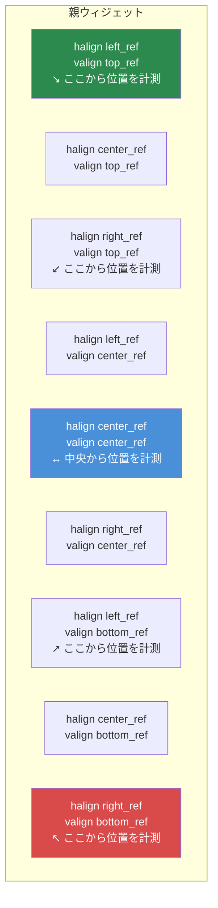

# 第3.3章: サイズとポジショニング

[ホーム](../../README.md) | [<< 前へ: レイアウトファイル形式](02-layout-files.md) | **サイズとポジショニング** | [次へ: コンテナウィジェット >>](04-containers.md)

---

DayZのレイアウトシステムは**二重座標モード**を使用します --- すべての寸法は比率（親に対する相対値）またはピクセルベース（絶対スクリーンピクセル）のいずれかになります。このシステムの誤解がレイアウトバグの最大の原因です。この章ではそれを徹底的に説明します。

---

## 基本概念: 比率 vs ピクセル

すべてのウィジェットには位置（`x, y`）とサイズ（`width, height`）があります。これら4つの値はそれぞれ独立して以下のいずれかになります：

- **比率**（0.0〜1.0） --- 親ウィジェットの寸法に対する相対値
- **ピクセル**（任意の正の数） --- 絶対スクリーンピクセル

各軸のモードは4つのフラグで制御されます：

| フラグ | 制御対象 | `0` = 比率 | `1` = ピクセル |
|---|---|---|---|
| `hexactpos` | X位置 | 親の幅に対する割合 | 左からのピクセル |
| `vexactpos` | Y位置 | 親の高さに対する割合 | 上からのピクセル |
| `hexactsize` | 幅 | 親の幅に対する割合 | ピクセル幅 |
| `vexactsize` | 高さ | 親の高さに対する割合 | ピクセル高さ |

これはモードを自由に混合できることを意味します。例えば、ウィジェットは比率の幅とピクセルの高さを持つことができます --- 行やバーでは非常に一般的なパターンです。

---

## 比率モードの理解

フラグが`0`（比率）の場合、値は**親の寸法に対する割合**を表します：

- `hexactsize 0`と`vexactsize 0`で`size 1 1`は「親の幅の100%、親の高さの100%」を意味します --- 子が親を埋め尽くします。
- `size 0.5 0.3`は「親の幅の50%、親の高さの30%」を意味します。
- `hexactpos 0`で`position 0.5 0`は「親の幅の50%の位置から開始」を意味します。

比率モードは解像度に依存しません。親のサイズが変わったり、ゲームが異なる解像度で実行されたりすると、ウィジェットは自動的にスケーリングされます。

```
// 親の左半分を埋めるウィジェット
FrameWidgetClass LeftHalf {
 position 0 0
 size 0.5 1
 hexactpos 0
 vexactpos 0
 hexactsize 0
 vexactsize 0
}
```

---

## ピクセルモードの理解

フラグが`1`（ピクセル/正確）の場合、値は**スクリーンピクセル**です：

- `hexactsize 1`と`vexactsize 1`で`size 200 40`は「幅200ピクセル、高さ40ピクセル」を意味します。
- `hexactpos 1`と`vexactpos 1`で`position 10 10`は「親の左端から10ピクセル、親の上端から10ピクセル」を意味します。

ピクセルモードは正確な制御ができますが、解像度に合わせて自動的にスケーリングされません。

```
// 固定サイズのボタン: 120x30ピクセル
ButtonWidgetClass MyButton {
 position 10 10
 size 120 30
 hexactpos 1
 vexactpos 1
 hexactsize 1
 vexactsize 1
 text "Click Me"
}
```

---

## モードの混合: 最も一般的なパターン

真の威力はモードの混合にあります。プロのDayZ Modで最も一般的なパターンは：

**比率の幅、ピクセルの高さ** --- バー、行、ヘッダー用。

```
// フル幅の行、正確に30ピクセルの高さ
FrameWidgetClass Row {
 position 0 0
 size 1 30
 hexactpos 0
 vexactpos 0
 hexactsize 0        // 幅: 比率（親の100%）
 vexactsize 1        // 高さ: ピクセル（30px）
}
```

**比率の幅と高さ、ピクセルの位置** --- 固定量だけオフセットされた中央パネル用。

```
// 60% x 70%のパネル、中央から0pxオフセット
FrameWidgetClass Dialog {
 position 0 0
 size 0.6 0.7
 halign center_ref
 valign center_ref
 hexactpos 1         // 位置: ピクセル（中央から0pxオフセット）
 vexactpos 1
 hexactsize 0        // サイズ: 比率（60% x 70%）
 vexactsize 0
}
```

---

## アラインメント参照: halignとvalign

`halign`と`valign`属性はポジショニングの**基準点**を変更します：

| 値 | 効果 |
|---|---|
| `left_ref`（デフォルト） | 親の左端から位置を計測 |
| `center_ref` | 親の中央から位置を計測 |
| `right_ref` | 親の右端から位置を計測 |
| `top_ref`（デフォルト） | 親の上端から位置を計測 |
| `center_ref` | 親の中央から位置を計測 |
| `bottom_ref` | 親の下端から位置を計測 |

### アラインメント基準点



ピクセル位置（`hexactpos 1`）とアラインメント参照を組み合わせると、センタリングが簡単になります：

```
// オフセットなしで画面中央に配置
FrameWidgetClass CenteredDialog {
 position 0 0
 size 0.4 0.5
 halign center_ref
 valign center_ref
 hexactpos 1
 vexactpos 1
 hexactsize 0
 vexactsize 0
}
```

`center_ref`の場合、位置`0 0`は「親の中央に配置」を意味します。位置`10 0`は「中央から右に10ピクセル」を意味します。

### 右揃えの要素

```
// 右端に固定されたアイコン、端から5px
ImageWidgetClass StatusIcon {
 position 5 5
 size 24 24
 halign right_ref
 valign top_ref
 hexactpos 1
 vexactpos 1
 hexactsize 1
 vexactsize 1
}
```

### 下揃えの要素

```
// 親の下部にあるステータスバー
FrameWidgetClass StatusBar {
 position 0 0
 size 1 30
 halign left_ref
 valign bottom_ref
 hexactpos 1
 vexactpos 1
 hexactsize 0
 vexactsize 1
}
```

---

## 重要: サイズに負の値は使用不可

**レイアウトファイルでウィジェットサイズに負の値を使用しないでください。** 負のサイズは未定義の動作を引き起こします --- ウィジェットが非表示になったり、不正確にレンダリングされたり、UIシステムがクラッシュする可能性があります。ウィジェットを非表示にしたい場合は、代わりに`visible 0`を使用してください。

これは最も一般的なレイアウトの間違いの一つです。ウィジェットが表示されない場合は、誤って負のサイズ値を設定していないか確認してください。

---

## 一般的なサイズパターン

### フルスクリーンオーバーレイ

```
FrameWidgetClass Overlay {
 position 0 0
 size 1 1
 hexactpos 0
 vexactpos 0
 hexactsize 0
 vexactsize 0
}
```

### 中央ダイアログ（60% x 70%）

```
FrameWidgetClass Dialog {
 position 0 0
 size 0.6 0.7
 halign center_ref
 valign center_ref
 hexactpos 1
 vexactpos 1
 hexactsize 0
 vexactsize 0
}
```

### 右揃えサイドパネル（幅25%）

```
FrameWidgetClass SidePanel {
 position 0 0
 size 0.25 1
 halign right_ref
 hexactpos 1
 vexactpos 0
 hexactsize 0
 vexactsize 0
}
```

### トップバー（フル幅、固定高さ）

```
FrameWidgetClass TopBar {
 position 0 0
 size 1 40
 hexactpos 0
 vexactpos 0
 hexactsize 0
 vexactsize 1
}
```

### 右下コーナーバッジ

```
FrameWidgetClass Badge {
 position 10 10
 size 80 24
 halign right_ref
 valign bottom_ref
 hexactpos 1
 vexactpos 1
 hexactsize 1
 vexactsize 1
}
```

### 固定サイズの中央アイコン

```
ImageWidgetClass Icon {
 position 0 0
 size 64 64
 halign center_ref
 valign center_ref
 hexactpos 1
 vexactpos 1
 hexactsize 1
 vexactsize 1
}
```

---

## プログラムでの位置とサイズ設定

コードでは、比率座標とピクセル（スクリーン）座標の両方を使って位置とサイズを読み取り・設定できます：

```c
// 比率座標（0-1の範囲）
float x, y, w, h;
widget.GetPos(x, y);           // 比率位置を読み取り
widget.SetPos(0.5, 0.1);      // 比率位置を設定
widget.GetSize(w, h);          // 比率サイズを読み取り
widget.SetSize(0.3, 0.2);     // 比率サイズを設定

// ピクセル/スクリーン座標
widget.GetScreenPos(x, y);     // ピクセル位置を読み取り
widget.SetScreenPos(100, 50);  // ピクセル位置を設定
widget.GetScreenSize(w, h);    // ピクセルサイズを読み取り
widget.SetScreenSize(400, 300);// ピクセルサイズを設定
```

プログラムでウィジェットを画面中央に配置するには：

```c
int screen_w, screen_h;
GetScreenSize(screen_w, screen_h);

float w, h;
widget.GetScreenSize(w, h);
widget.SetScreenPos((screen_w - w) / 2, (screen_h - h) / 2);
```

---

## `scaled`属性

`scaled 1`が設定されると、ウィジェットはDayZのUIスケーリング設定（オプション > ビデオ > HUDサイズ）を尊重します。これはユーザーの好みに合わせてスケーリングすべきHUD要素に重要です。

`scaled`なしでは、ピクセルサイズのウィジェットはUIスケーリングオプションに関係なく同じ物理サイズになります。

---

## `fixaspect`属性

ウィジェットのアスペクト比を維持するために`fixaspect`を使用します：

- `fixaspect fixwidth` --- 幅に基づいてアスペクト比を維持するように高さが調整されます
- `fixaspect fixheight` --- 高さに基づいてアスペクト比を維持するように幅が調整されます

これは主に`ImageWidget`で画像の歪みを防ぐために使用されます。

---

## Z順序とプライオリティ

`priority`属性は、重なり合った時にどのウィジェットが前面にレンダリングされるかを制御します。値が高いほど低い値の上にレンダリングされます。

| プライオリティ範囲 | 一般的な使用法 |
|----------------|-------------|
| 0-5 | 背景要素、装飾パネル |
| 10-50 | 通常のUI要素、HUDコンポーネント |
| 50-100 | オーバーレイ要素、フローティングパネル |
| 100-200 | 通知、ツールチップ |
| 998-999 | モーダルダイアログ、ブロッキングオーバーレイ |

```
FrameWidget myBackground {
    priority 1
    // ...
}

FrameWidget myDialog {
    priority 999
    // ...
}
```

**重要:** プライオリティは同じ親内の兄弟間でのみレンダリング順序に影響します。ネストされた子はプライオリティ値に関係なく、常に親の上にレンダリングされます。

---

## サイズ問題のデバッグ

ウィジェットが期待通りの場所に表示されない場合：

1. **exactフラグを確認** --- ピクセルを意図していたのに`hexactsize`が`0`に設定されていませんか？比率モードでの`200`の値は親の幅の200倍を意味します（画面外に大きくはみ出します）。
2. **負のサイズを確認** --- `size`のいずれかの負の値は問題を引き起こします。
3. **親のサイズを確認** --- ゼロサイズの親の比率の子はゼロサイズです。
4. **`visible`を確認** --- ウィジェットはデフォルトで可視ですが、親が非表示の場合、すべての子も非表示です。
5. **`priority`を確認** --- プライオリティが低いウィジェットは別のウィジェットの後ろに隠れている可能性があります。
6. **`clipchildren`を使用** --- 親に`clipchildren 1`がある場合、境界外の子は表示されません。

---

## ベストプラクティス

- 常に4つすべてのexactフラグを明示的に指定してください（`hexactpos`、`vexactpos`、`hexactsize`、`vexactsize`）。省略すると、デフォルトがウィジェットタイプによって異なるため、予測不能な動作につながります。
- 行やバーには比率の幅＋ピクセルの高さパターンを使用してください。これは最も解像度に安全な組み合わせであり、プロのModの標準です。
- ダイアログの中央配置には`halign center_ref` + `valign center_ref` + ピクセル位置`0 0`を使用し、比率位置`0.5 0.5`は使用しないでください。アラインメント参照アプローチはウィジェットサイズに関係なく中央に保たれます。
- フルスクリーンまたはほぼフルスクリーンの要素にはピクセルサイズを避けてください。比率サイズを使用して、UIが任意の解像度（1080p、1440p、4K）に適応するようにしてください。
- コードで`SetScreenPos()` / `SetScreenSize()`を使用する場合、ウィジェットが親にアタッチされた後に呼び出してください。アタッチ前に呼び出すと、不正確な座標が生成される可能性があります。

---

## 理論と実際

> ドキュメントに記載されていることと、実行時に実際にどう動作するかの比較です。

| 概念 | 理論 | 実際 |
|---------|--------|---------|
| 比率サイズ | 値0.0〜1.0は親に対して相対的にスケーリング | 親がピクセルサイズの場合、子の比率値はそのピクセル値に対する相対値であり、スクリーンに対してではありません --- 200pxの幅の親の子で`size 0.5`は100pxです |
| `center_ref`アラインメント | ウィジェットが親内で自身を中央に配置 | ウィジェットの左上角が中央ポイントに配置されます --- ピクセルモードで位置が`0 0`でない限り、ウィジェットは中央から右下にぶら下がります |
| `priority` Z順序 | 高い値が前面にレンダリング | プライオリティは同じ親内の兄弟にのみ影響します。子はプライオリティ値に関係なく常に親の上にレンダリングされます |
| `scaled`属性 | ウィジェットがHUDサイズ設定を尊重 | ピクセルモードの寸法にのみ影響します。比率の寸法はすでに親に合わせてスケーリングされ、`scaled`フラグを無視します |
| 負の位置値 | 逆方向にオフセット | 位置では機能します（基準から左/上にオフセット）が、負のサイズ値は未定義のレンダリング動作を引き起こします --- 使用しないでください |

---

## 互換性と影響

- **マルチMod:** サイズとポジショニングはウィジェットごとであり、Mod間で競合することはありません。ただし、ルートで`size 1 1`と`priority 999`のフルスクリーンオーバーレイを使用するModは、他のModのUI要素が入力を受け取るのをブロックする可能性があります。
- **パフォーマンス:** 比率サイズはアニメーションまたは動的ウィジェットで毎フレーム親に対する再計算が必要です。静的レイアウトでは、比率モードとピクセルモードの間で測定可能な差はありません。
- **バージョン:** 二重座標システム（比率vsピクセル）はDayZ 0.63 Experimental以来安定しています。`scaled`属性の動作はDayZ 1.14でHUDサイズスライダーをより適切に尊重するように改善されました。

---

## 次のステップ

- [3.4 コンテナウィジェット](04-containers.md) --- スペーサーやスクロールウィジェットがレイアウトを自動的に処理する方法
- [3.5 プログラムによるウィジェット作成](05-programmatic-widgets.md) --- コードからサイズと位置を設定する
